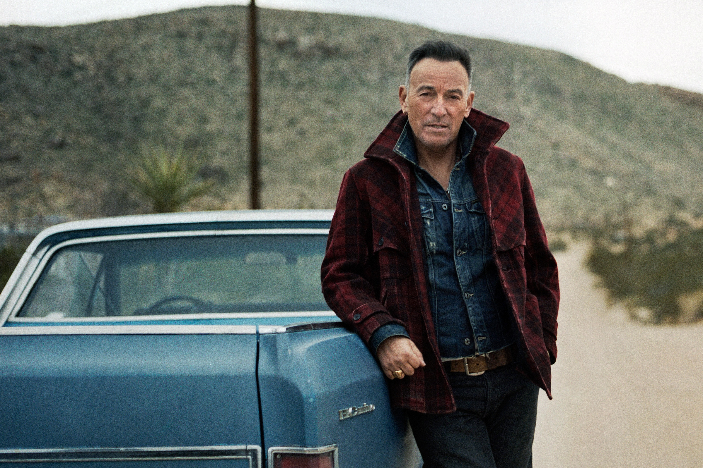
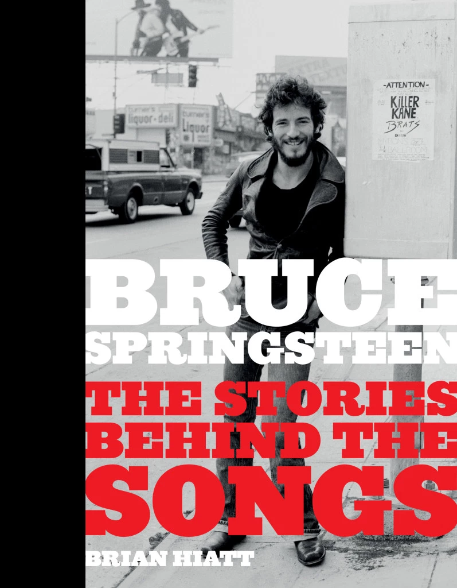

Exclusive: How Bruce Springsteen Created ‘Thunder Road’

*My new book, [Bruce Springsteen: The Stories Behind the Songs](https://amzn.to/2JNmqVo), tells the tales behind every officially released studio recording of [Bruce Springsteen](https://www.rollingstone.com/t/bruce-springsteen/)’s career so far. In addition to my years of Springsteen reporting, including five interviews with the man himself, the book draws on over 60 hours of brand-new interviews with musicians, producers, and other collaborators from throughout his career (including [Max Weinberg](https://www.rollingstone.com/t/max-weinberg/), Roy Bittan, Nils Lofgren, Soozie Tyrell, Tom Morello, David Sancious and many, many more). I’m proud to debut this exclusive excerpt here at *Rolling Stone*, where I’ve been on staff since 2004. Every song gets its own entry in the book; the one you’re about to read chronicles the making of the opening track of [Born to Run](https://www.rollingstone.com/t/born-to-run/). (We’ve also posted excerpts of the [“Born in the U.S.A”](http://%22born%20in%20the%20u.s.a%22/) and [“Badlands”](https://www.rollingstone.com/music/music-features/bruce-springsteen-badlands-813835/) entries.)*

ADVERTISEMENT

#### Related

[    ##### Hear Bruce Springsteen's Lush New Song 'There Goes My Miracle'](https://www.rollingstone.com/music/music-news/bruce-springsteen-new-song-836231/)[##### Watch Steven Van Zandt Return to Asbury Park, Reflect on Legendary Gigs in New Doc](https://www.rollingstone.com/music/music-news/steve-van-zandt-asbury-park-documentary-835713/)

A funny thing happened the first time Bruce Springsteen and [the E Street Band](https://www.rollingstone.com/t/the-e-street-band/) played an embryonic version of “Thunder Road,” back in February of 1975: the crowd cheered the delicate opening riff as if they’d known the song for years. It was an encouraging sign, but what Springsteen performed that night was something of a mess, with a bunch of undercooked lyrics (“baby, you know that’s just jive”), and an ill-placed, vaguely “Rosalita”-like, Latin-tinged, double-time sax break. The eventual chorus melody was in there, albeit played by Clarence Clemons’ sax; the phrase “thunder road,” which Springsteen would pinch from an old movie poster, was absent. In all, it was emblematic of a songwriter caught between styles and eras, trying to find the right exit on his musical turnpike. (It’s widely assumed that this early version was called “Wings for Wheels” – also the name of Thom Zimny’s excellent 2005* Born to Run *documentary – but Max Weinberg says that was actually a working title for the entire album, and that they referred to the song as “Angelina” or “Angelina’s Dress Sways.”)

Springsteen had a new band, but wasn’t quite sure what to do with it. In the summer of 1974, after finishing just one song, “Born to Run,” for Springsteen’s third album, David Sancious and drummer Ernest “Boom” Carter (who had just joined in February as Vini Lopez’s replacement), bolted the E Street Band together to start a jazz-fusion act, Tone. Appel was understandably horrified, especially given Sancious’ considerable influence on *the Wild, the Innocent and the E Street Shuffle*. Springsteen was stoic; he’d figure it out. Enter the new guys. Max Weinberg and Roy Bittan would stick around for 40 years and counting, forming the core of what would turn out to be the defining version of the E Street Band.

ADVERTISEMENT

Like Danny Federici, Bittan grew up playing the accordion, but he was a more disciplined and intellectual musician. He absorbed the full breadth of American popular music, “from Al Jolson forward,” Bittan says. “I was playing for 50th anniversary parties when I was 14 years old, because I had a repertoire of all those songs.” Weinberg, a native of Newark, New Jersey, played professionally starting at the age of seven, when he first sat in with a wedding band. By the time he auditioned for Springsteen, he was attending Seton Hall University, with thoughts of law school. His heart was in soul music and pre-1967 rock, and he felt like “an anomaly, a little out of the time.” “I never really thought that I’d end up playing drums for my whole life, which is really odd,” Weinberg says. “I love playing the drums, but if I couldn’t play them the way that I wanted to, I didn’t want to do it.” With Springsteen, he saw his chance, dropping out of college to jump on board.

Another new figure in Springsteen’s orbit was Jon Landau, a prominent rock critic who had a past as a record producer, having hopped onto a Detroit-bound plane straight from his college graduation in 1969 to produce the MC5’s second album, *Back in the U.S.A*. In the early spring of 1975, with sessions for his third album stalling, Springsteen invited Landau to the empty warehouse in Neptune, New Jersey where the E Street Band was rehearsing. It would be one of the most important rehearsals of Springsteen’s career. “Jon immediately started making tremendously spot-on musical suggestions,” says Weinberg, “particularly rhythmically. It was amazing. Within a couple of hours, he had turned the rhythmic thrust of the band away from that kind of charming but scattershot approach that was on the first two records. Very charming, but very busy drumming, certainly not what Jon wanted to hear.”

“Thunder Road,” in particular, “was fantastic, but it was a little unwieldy, a little unfocused, a little more like a jam piece,” Landau told me in 2005. “I remember talking with Bruce about a few ideas about how to just reshuffle the deck a little bit, and keep the song building from the very beginning right through the end.” As Springsteen adopted Landau’s suggested shifts and edits, the song started to take shape, and with it, a new, streamlined, harder-rocking sound for the E Street Band. From there, Jon Landau was on the production team for the third album, beginning a life-long professional relationship.

ADVERTISEMENT

“Thunder Road” was the world’s introduction to Bittan’s architectural piano style, enhanced by glockenspiel parts an octave up. “Roy had the ability to take the basic parts that Bruce created when he would write the song,” Landau told me, “and expand on them just the right amount and give them a little more structure, and really wound up anchoring the arrangements on most of that record.” Engineer Jimmy Iovine relied heavily on Bittan when he was mixing the album, “I always had Roy’s piano in my hand,” he says, “And whenever I would get in trouble I’d push Roy out. It’s the truth – he was always doing something interesting.”

Springsteen wrote nearly all of *Born to Ru*n on piano. “Thunder Road was just so obviously an opening, due to its intro.” Springsteen told me in 2005. “There is something about the melody that just suggests ‘new day,’ it suggests morning.. That’s why that song ended up first on the record, instead of ‘Born to Run.’ Which would’ve made sense, to put ‘Born to Run’ first on the album – [and we] still put it on the top of the second side.”

“That song was interesting for me,” says Bittan, “because I created a piano part that moves – It was like staircases to me. I would move up to a section, then down. When the chords change, I would sort of step up to it musically and then I would come down from it and move around all different ways.” He recalls the instrumental coda as a collaboration with Springsteen. “When we got to the end,” Bittan says, “it seemed like it needed something. So I said, ‘well, what if we do a little instrumental?’ I’d play a little something, and then Bruce would play something, so it kind of came about in a very beautiful way.”

There were many revisions, including an amusing array of women’s names (In addition to Angelina, Anne, Chrissie and Christina all got a ride before Mary won out). The harmonica part in the intro was, at one point, played on sax instead. A handwritten worksheet from the sessions shows Springsteen’s focus on details like the fill Weinberg plays at the song’s “pulling here to win” climax – he wanted to try something a la the Dave Clark Five. Appel, whose relationship with Springsteen began to fray during the making of *Born to Run*, recalls a moment when the artist and Landau wanted to build “Thunder Road” more gradually, and replace the electric guitars that come in close to the two-minute-mark with acoustics – in Appel’s telling, he talked them out of it. As it was, Springsteen spent thirteen hours straight overdubbing electric guitar, Iovine recalls. And at some point in ‘75, Springsteen also recorded an eerie alternate version, a solo acoustic take that feels like a ghostly reflection of the released song, as if it’s being sung by a heartbroken narrator decades after its events.

ADVERTISEMENT

As Springsteen wrote in his book Songs, “Thunder Road” offered a proposition : “Do you want to take a chance? On us? On life?” There was, however, an undercurrent of dread, as there almost always would be going forward. Springsteen was only 24 when he recorded “Thunder Road,” which makes the line “maybe we ain’t that young anymore” all the more striking. “The songs were written immediately after the Vietnam War,” Springsteen told me in 2005. “And you forget, everybody felt like that then. It didn’t matter how old you were, everybody experienced a radical change in the image they had of their country *and* of themselves. The reason was, ‘you were changed.’ You were going to be a radically different type of American than the generation that immediately preceded you, so that line was just recognizing that fact. The influences of a lot of my heroes from the Sixties and Fifties ended up on that record, but I realized that I was not them. I was someone else. So it wasn’t just a mish-mash of previous styles. There was a lot of stuff we loved in it from the music we loved, but there was something else, too – quite a sense of dread and uncertainty about the future and who you were, where you were going, where the whole country was going, so that found its way into the record.”

[*Bruce Springsteen: The Stories Behind the Songs*](https://amzn.to/2JNmqVo), by [Brian Hiatt](https://www.rollingstone.com/t/brian-hiatt/), is in stores everywhere.