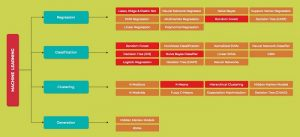
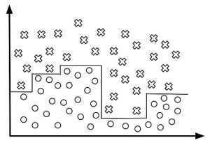

Explaining Random Forest (with Python Implementation)

# Explaining Random Forest (with Python Implementation)

[  **Previous post**](https://www.kdnuggets.com/2019/03/beginners-guide-linear-regression-python-scikit-learn.html)

[**Next post**  ](https://www.kdnuggets.com/2019/03/datathon-data-science-hackathon-april.html)

[

[**Tweet](https://twitter.com/intent/tweet?original_referer=https%3A%2F%2Fwww.kdnuggets.com%2F2019%2F03%2Frandom-forest-python.html&ref_src=twsrc%5Etfw&text=Explaining%20Random%20Forest%20(with%20Python%20Implementation)%3A&tw_p=tweetbutton&url=https%3A%2F%2Fwww.kdnuggets.com%2F2019%2F03%2Frandom-forest-python.html%23.XOKfhH-tOO8.twitter)]()[[Share]()[36](https://www.kdnuggets.com/2019/03/random-forest-python.html#)](https://www.kdnuggets.com/2019/03/random-forest-python.html#)

Tags: [Explained](https://www.kdnuggets.com/tag/explained), [Machine Learning](https://www.kdnuggets.com/tag/machine-learning), [Python](https://www.kdnuggets.com/tag/python), [Random Forests](https://www.kdnuggets.com/tag/random-forests)

We provide an in-depth introduction to Random Forest, with an explanation to how it works, its advantages and disadvantages, important hyperparameters and a full example Python implementation.

**Want to code in Python, Java or R?
Try SAS Viya free for 14 days**

* * *

  [comments](https://www.kdnuggets.com/2019/03/random-forest-python.html#comments)

**By [The Learning Machine](https://www.thelearningmachine.ai/)**

### **Random Forest (+Python implementation)**

#### **1. Introduction**

This article is written by ***[The Learning Machine](https://www.thelearningmachine.ai/)***, a new open-source project that aims to create an interactive roadmap containing A-Z explanations of concepts, methods, algorithms and their code implementations in either Python or R, accessible for people with various backgrounds.

Check out our click-and-go ***[Machine Learning Mind Map](https://www.thelearningmachine.ai/ml)*** with algorithm explanations and Python implementation.

#### **2. Random Forest**

Random Forest is a flexible, easy to use machine learning algorithm that produces, even without hyper-parameter tuning, a great result most of the time. It can be used for both classification and regression tasks. In this article, you are going to learn how the random forest algorithm deals with classification and regression problems.

*To understand the Random Forest algorithm, you have to be familiar with Decision Trees at first. Read an article on Decision Trees ***[here](https://www.thelearningmachine.ai/tree-id3)***.*

One of the common problems with decision trees, especially the ones that have a table full of columns, is that they tend to ***overfit*** a lot. Sometimes it looks like the tree just *memorizes* the data. Here are the typical examples of decision trees that overfit, both for **categorical** and **continuous** data:

**I. Categorical:**

*If the client is male, between 15 and 25, from the US, likes ice-cream, has a German friend, hates birds and ate pancakes on August 25th, 2012, - he is likely to download Pokemon Go.*

**II. Continuous:**

Random Forest prevents this problem: it is an ensemble of multiple decision trees, not just one. And the more the number of these decision trees in Random Forest, the better the generalization.

More precisely, Random Forest works as follows:

1. Selects k features (columns) from the dataset (table) with a total of m features randomly (where k<<m). Then, it builds a Decision Tree from those k features.

2. Repeats n times so that you have ***n*** Decision Trees built from different random combinations of k features (or a different random sample of the data, called ***bootstrap***  ***sample***).

3. Takes each of the n built Decision Trees and passes a random variable to predict the outcome. Stores the predicted outcome (target), so that you have a total of ***n*** outcomes from the ***n*** Decision Trees.

4. Calculates the votes for each predicted target and takes the mode (most frequent target variable). In other words, considers the high voted predicted target as the final prediction from the random forest algorithm.

** In case of a regression problem, for a new record, each tree in the forest predicts a value for Y (output). The final value can be calculated by taking the average of all the values predicted by all the trees in a forest. Or, in case of a classification problem, each tree in the forest predicts the category to which the new record belongs. Finally, the new record is assigned to the category that wins the majority vote.*

**Example:**

James wants to decide what places he should visit during his one week stay in Paris. He goes to a friend who lived there one year and asks what he visited in the past and if he liked it or not. Based on his experience, he will give James some advice.

This is a typical decision tree algorithm approach. James’ friend decided about what James should visit, based on his personal experience of a year.

Later, James starts asking more and more of his friends to advise him, and they recommend the places they have been to. Then James chooses the places that were recommend the most to him, which is the typical Random Forest algorithm approach.

***Thus, Random Forest is an algorithm that builds n decision trees by randomly selecting k out of the total of m features for every decision tree, and takes the mode (average, if regression) of the predicted outcomes.***

#### **3. Pros & Cons**

**Advantages:**

1. **Can be used for both classification and regression problems:** Random Forest works well when you have both categorical and numerical features.

2. **Reduction in overfitting**: by averaging several trees, there is a significantly lower risk of overfitting.

3. **Make a wrong prediction only when more than half of the base classifiers are wrong**: Random Forest is very stable - even if a new data point is introduced in the dataset, the overall algorithm is not affected much as new data may impact one tree, but it is very hard for it to impact all the trees.

**Disadvantages:**

1. Random forests have been observed to overfit for some datasets with noisy classification/regression tasks.

2. More complex and computationally expensive than decision tree algorithm.

3. Due to their complexity, they require much more time to train than other comparable algorithms.

### **4. Important Hyperparameters **

The Hyperparameters in a random forest are either used to increase the predictive power of the model or to make the model faster. Below, hyperparameters of sklearn built-in random forest function is described:

1. **Increasing the Predictive Power**

- **n_estimators:** the number of trees the algorithm builds before taking the maximum voting or taking averages of predictions. In general, a higher number of trees increases the performance and makes the predictions more stable, but it also slows down the computation.
- **max_features:** the maximum number of features Random Forest is allowed to try in an individual tree. Sklearn provides several options, described in their *[documentation](http://scikit-learn.org/stable/modules/generated/sklearn.ensemble.RandomForestClassifier.html)*.
- **min_sample_leaf: **determines the minimum number of leaves that are required to split an internal node.

1. ** Increasing the Models Speed**

- **n_jobs:** tells the engine how many processors it is allowed to use. If it has a value of 1, it can only use one processor. A value of “-1” means that there is no limit.
- **random_state:** makes the model’s output replicable. The model will always produce the same results when it has a definite value of random_state and if it has been given the same hyperparameters and the same training data.
- **oob_score: **(also called oob sampling) - a random forest cross-validation method. In this sampling, about one-third of the data is not used to train the model and can be used to evaluate its performance. These samples are called the out of bag samples. It is very similar to the leave-one-out cross-validation method, but almost no additional computational burden goes along with it.

### **5. Python Implementation**

View/download a template of Random Forest located in a git repository *[here](https://github.com/the-learning-machine/ML/blob/master/Classification/random_forests.ipynb)*.

**Resources:**

- [On-line and web-based: Analytics, Data Mining, Data Science, Machine Learning education](https://www.kdnuggets.com/education/online.html)
- [Software for Analytics, Data Science, Data Mining, and Machine Learning](https://www.kdnuggets.com/software/index.html)

**Related:**

- [Random forests explained intuitively](https://www.kdnuggets.com/2019/01/random-forests-explained-intuitively.html)
- [Data Scientist Interviews Demystified](https://www.kdnuggets.com/2018/08/data-scientist-interviews-demystified.html)
- [A Tour of The Top 10 Algorithms for Machine Learning Newbies](https://www.kdnuggets.com/2018/02/tour-top-10-algorithms-machine-learning-newbies.html)

What do you think?
21 Responses

Upvote

Funny

Love

Surprised

Angry

Sad

- [1 comment]()
- [**KDnuggets**](https://disqus.com/home/forums/kdnuggets/)
- [Login](https://disqus.com/embed/comments/?base=default&f=kdnuggets&t_u=https%3A%2F%2Fwww.kdnuggets.com%2F2019%2F03%2Frandom-forest-python.html&t_d=Explaining%20Random%20Forest%20(with%20Python%20Implementation)&t_t=Explaining%20Random%20Forest%20(with%20Python%20Implementation)&s_o=default#)
- [](https://disqus.com/home/inbox/)
- [ Recommend  2](https://disqus.com/embed/comments/?base=default&f=kdnuggets&t_u=https%3A%2F%2Fwww.kdnuggets.com%2F2019%2F03%2Frandom-forest-python.html&t_d=Explaining%20Random%20Forest%20(with%20Python%20Implementation)&t_t=Explaining%20Random%20Forest%20(with%20Python%20Implementation)&s_o=default#)
- tTweetfShare
- [Sort by Best](https://disqus.com/embed/comments/?base=default&f=kdnuggets&t_u=https%3A%2F%2Fwww.kdnuggets.com%2F2019%2F03%2Frandom-forest-python.html&t_d=Explaining%20Random%20Forest%20(with%20Python%20Implementation)&t_t=Explaining%20Random%20Forest%20(with%20Python%20Implementation)&s_o=default#)

Join the discussion…

###### Log in with

-
-
-
-

######  or sign up with Disqus

?

### Disqus is a discussion network

- Disqus never moderates or censors. The rules on this community are its own.
- Don't be a jerk or do anything illegal. Everything is easier that way.

[Read full terms and conditions](https://docs.disqus.com/kb/terms-and-policies/)

-

    - [−](https://disqus.com/embed/comments/?base=default&f=kdnuggets&t_u=https%3A%2F%2Fwww.kdnuggets.com%2F2019%2F03%2Frandom-forest-python.html&t_d=Explaining%20Random%20Forest%20(with%20Python%20Implementation)&t_t=Explaining%20Random%20Forest%20(with%20Python%20Implementation)&s_o=default#)
    - [*⚑*](https://disqus.com/embed/comments/?base=default&f=kdnuggets&t_u=https%3A%2F%2Fwww.kdnuggets.com%2F2019%2F03%2Frandom-forest-python.html&t_d=Explaining%20Random%20Forest%20(with%20Python%20Implementation)&t_t=Explaining%20Random%20Forest%20(with%20Python%20Implementation)&s_o=default#)

 [ganesh3](https://disqus.com/by/ganesh3/)    •  [2 months ago](https://www.kdnuggets.com/2019/03/random-forest-python.html#comment-4407725095)

How do we get/optimize the AUC ROC parameter for Random forest?

- [Powered by Disqus](https://disqus.com/)
- [*✉*Subscribe*✔*](https://disqus.com/embed/comments/?base=default&f=kdnuggets&t_u=https%3A%2F%2Fwww.kdnuggets.com%2F2019%2F03%2Frandom-forest-python.html&t_d=Explaining%20Random%20Forest%20(with%20Python%20Implementation)&t_t=Explaining%20Random%20Forest%20(with%20Python%20Implementation)&s_o=default#)
- [*d*Add Disqus](https://publishers.disqus.com/engage?utm_source=kdnuggets&utm_medium=Disqus-Footer)
- [**Disqus' Privacy Policy](https://help.disqus.com/customer/portal/articles/466259-privacy-policy)

* * *

[**Previous post**](https://www.kdnuggets.com/2019/03/beginners-guide-linear-regression-python-scikit-learn.html)

[**Next post**](https://www.kdnuggets.com/2019/03/datathon-data-science-hackathon-april.html)

* * *

## Top Stories Past 30 Days

| **Most Popular** |
| --- |
| 1.   [**The most desired skill in data science**](https://www.kdnuggets.com/2019/04/most-desired-skill-data-science.html) 2.   [**Data Visualization in Python: Matplotlib vs Seaborn**](https://www.kdnuggets.com/2019/04/data-visualization-python-matplotlib-seaborn.html) 3.   [**The Third Wave Data Scientist**](https://www.kdnuggets.com/2019/05/third-wave-data-scientist.html) 4.   [**How To Go Into Data Science: Ultimate Q&A for Aspiring Data Scientists with Serious Guides**](https://www.kdnuggets.com/2019/04/data-science-ultimate-questions-answers-aspiring-data-scientists.html) 5.   [**The 3 Biggest Mistakes on Learning Data Science**](https://www.kdnuggets.com/2019/05/biggest-mistakes-learning-data-science.html) 6.   [**Best Data Visualization Techniques for small and large data**](https://www.kdnuggets.com/2019/04/best-data-visualization-techniques.html) 7.   [**Data Scientist — Best Job of the Year in USA**](https://www.kdnuggets.com/2019/05/data-scientist-best-job-careercast.html) |

| **Most Shared** |
| --- |
| 1.   [**Data Visualization in Python: Matplotlib vs Seaborn**](https://www.kdnuggets.com/2019/04/data-visualization-python-matplotlib-seaborn.html) 2.   [**Top Data Science and Machine Learning Methods Used in 2018, 2019**](https://www.kdnuggets.com/2019/04/top-data-science-machine-learning-methods-2018-2019.html) 3.   [**The most desired skill in data science**](https://www.kdnuggets.com/2019/04/most-desired-skill-data-science.html) 4.   [**Best Data Visualization Techniques for small and large data**](https://www.kdnuggets.com/2019/04/best-data-visualization-techniques.html) 5.   [**The 3 Biggest Mistakes on Learning Data Science**](https://www.kdnuggets.com/2019/05/biggest-mistakes-learning-data-science.html) 6.   [**The Third Wave Data Scientist**](https://www.kdnuggets.com/2019/05/third-wave-data-scientist.html) 7.   [**How To Go Into Data Science: Ultimate Q&A for Aspiring Data Scientists with Serious Guides**](https://www.kdnuggets.com/2019/04/data-science-ultimate-questions-answers-aspiring-data-scientists.html) |