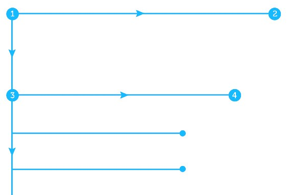

F-Shaped Pattern for Reading Content – UX Planet

# F-Shaped Pattern for Reading Content

## by [Nick Babich](http://babich.biz/)

This article will walk you through the principles of the F-Layout, why it works, and how you can create your own.

### What is the F-Pattern and how it works?

The F-Pattern describes the most common user eye-scanning patterns when it comes to blocks of content. *F for fast.* That’s how users read your content. In a few seconds, their eyes move at amazing speeds across your websites page.

The pattern was popularized by NNGroup [eyetracking study](http://www.nngroup.com/topic/eyetracking/) which recorded more than 200 users looked at thousands of web pages and found that users’ main reading behavior was fairly consistent across many different sites and tasks. This**  **reading pattern looked somewhat like an F and has the following three components:

- •Users first read in a horizontal movement, usually across the upper part of the content area. This initial element forms the F’s top bar.
- •Next, they scan a vertical line down the left side of the screen, looking for points of interest in the paragraph’s initial sentences. When they found something interesting they read across in a second horizontal movement**  **that typically covers a shorter area than the previous movement. This additional element forms the F’s lower bar.
- •Finally, users scan the content’s left side in a vertical movement.

Our eyes are trained to start at the top-left corner, scan horizontally, then drop down to the next line and do the same until we find something of interest.

The NNGroup demonstrates how eye-tracking studies revealed that users (in left-to-right reading cultures) typically scan heavy blocks of content in a pattern that looks like the letter F or E. *The areas where users looked the most are colored red; the yellow areas indicate fewer views, followed by the least-viewed blue areas. Gray areas didn’t attract any fixations.*

Obviously, users’ scan patterns are not always comprised of exactly three parts. When the reader finds something they like, they begin reading normally, forming horizontal lines.

### Why should I use it?

F-shaped pattern will help you create a design with good *visual hierarchy, *a*  *design that people can *scan *easily. F-shaped layout feels comfortable for the most western readers, because they have been reading top to bottom, left to right for their entire lives.

### When should I use it?

The F-pattern is the go-to layout for text-heavy websites like blogs and news sites. If there is a lot of content — especially text — users will respond better with the layout that designed according to the natural scanning format.

CNN uses the F-Shapen pattern

### How to use F-Shapen pattern

F-Layout literally gives the designer more control over what gets seen.

#### Prioritize your content

Before arranging the elements on your page, prioritize the most and least important ones. Once you know what you want your users to see, you can simply place them in the pattern’s ‘hot spots’ for the right interactions.

#### Set initial expectations

The first two paragraphs are the most important. Place the most important content near to the top of the page as possible in an attempt to communicate the site’s (or page) purpose quickly. The user will usually read horizontally across the header, so here’s a good place for a *navigation bar*.

The most important content on this page can be seen in a few seconds. Image credits: tutsplus

#### Design for scanning, not reading

When applying the pattern think scanners and place content these scanners would most likely be interested in along the F:

- •Start new paragraphs with enticing keywords.
- •People will first look at the most dominant element (the element or area with the greatest visual weight) on the page. Thus, give more visual weight to things that matter: use typography to indicate the importance of text (e.g. try **highlighting keywords** within text), and certain colors to highlight buttons.
- •Cover only one idea per paragraph, and use bullets as much as possible.
- •Place the most important content (such as CTAs) at the left and right sides, where the user begins and ends their horizontal scanning. This momentary pause as they drop down gives them a little extra time to consider.

#### Utilize the sidebar

Sidebar exists to get users involved in a deeper level, so use it to drive user engagement:

- •Feature anything you want your user to see, but that doesn’t fit in organically with the primary content. This could be an ad, a listing of “related articles”, a social media widget, etc.
- •Use it as a tool for users to find specific content. The obvious example is a category listing, a tag cloud, a “popular posts” widget, etc.

Medium placing a sub-navigation in sidebar.

#### Avoid boring layouts

The main drawback to this F-shapen layout is its predisposition to monotony. It’s easy to bore your users with repetitive and similar content in rows. You certainly don’t benefit from a bored user if they begin to dull everything out, so add one “awkward” element within the scanning area to keep the user engaged.

Image credit: tutsplus

This technique of “breaking the expectations” of the layout can be useful when you have really long vertical spans of content that feel dull or boring once you scroll past the first couple sections.

### Conclusion

F-shapen pattern simply follows the common trends of the human eye so that you can optimize the structure of your layout. But you don’t need to follow it rigidly — it’s a guideline, not a template.

Thank you!

*Follow UX Planet: *[*Twitter*](https://twitter.com/101babich)* | *[*Facebook*](https://www.facebook.com/uxplanet/)