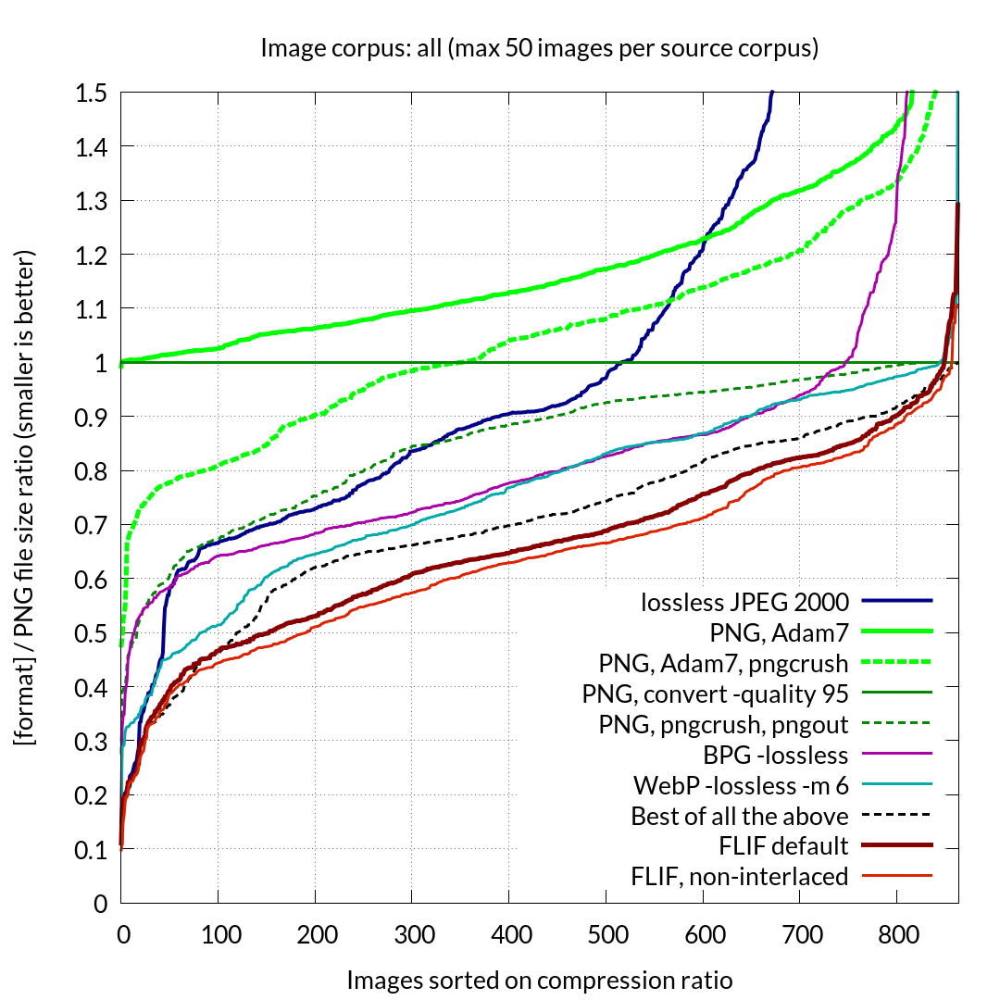
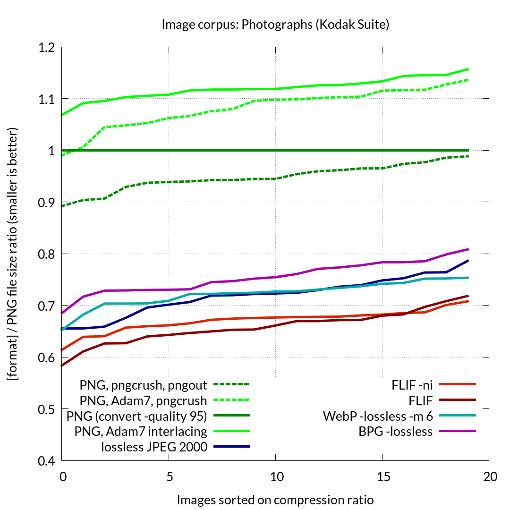
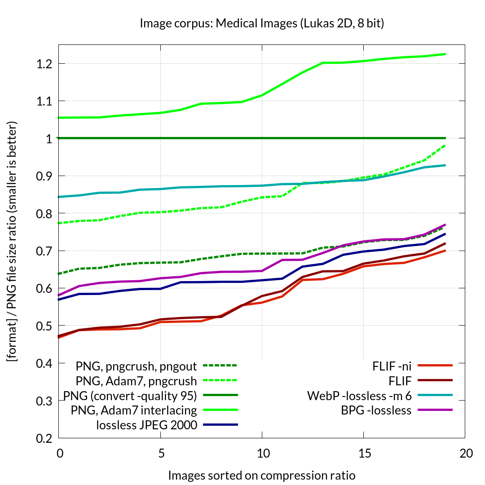
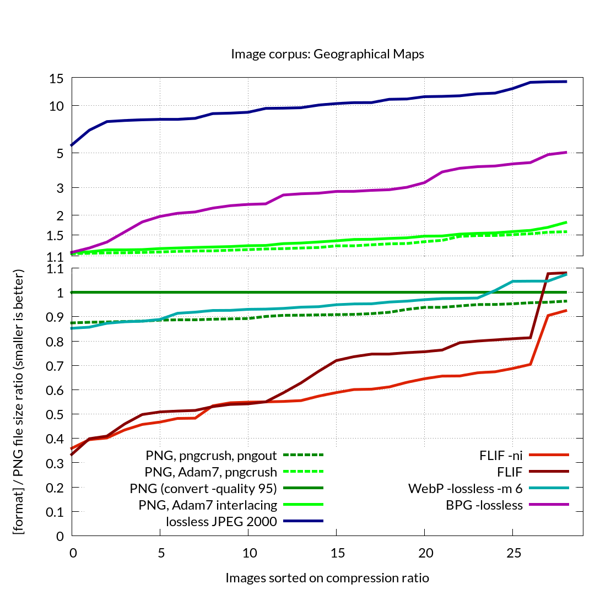

FLIF - Free Lossless Image Format

 [FLIF home](https://flif.info/index.html)  [Animation](https://flif.info/animation.html)  [Example](https://flif.info/example.html)  [Lossy?](https://flif.info/lossy.html)  [Publications](https://flif.info/publications.html)  [RWD](https://flif.info/responsive.html)  [Software](https://flif.info/software.html)

 

## FLIF - Free Lossless Image Format

FLIF is a novel lossless image format which outperforms PNG, lossless WebP, lossless BPG, lossless JPEG2000, and lossless JPEG XR in terms of compression ratio.

According to the [compression experiments we have performed](https://docs.google.com/spreadsheets/d/1LxY78fbm47VmrYGTXkBXXitGjhGl32NsuHPH2QXufgA/edit?usp=sharing)  [[older results here]](https://docs.google.com/spreadsheets/d/16ghJEjf_T7TDTOg2WlelnG1SYCsHng6V-1rxdo78YL8/edit?usp=sharing), FLIF files are on average:

- 14% smaller than lossless [WebP](https://developers.google.com/speed/webp/),

- 22% smaller than lossless [BPG](http://bellard.org/bpg/),

- 33% smaller than brute-force crushed PNG files (using ZopfliPNG),

- 43% smaller than typical PNG files,

- 46% smaller than optimized Adam7-interlaced PNG files,

- 53% smaller than lossless JPEG 2000 compression,

- 74% smaller than lossless JPEG XR compression.

Even if the best image format was picked out of PNG, JPEG 2000, WebP or BPG for a given image corpus, depending on the type of images (photograph, line art, 8 bit or higher bit depth, etc), **then FLIF still beats that by 12%** on a *median* corpus (or 19% on average, including 16-bit images which are not supported by WebP and BPG).

## Status

The file format has been standardised and versioned. The latest stable version is **FLIF16** and is documented [here](https://flif.info/spec.html).

## Advantages

Here are some of the key advantages of FLIF:

Best compression

The results of a compression test similar to the [WebP study](https://developers.google.com/speed/webp/docs/webp_lossless_alpha_study#results) are shown below. FLIF clearly beats other image compression algorithms. (Note: the graph below is for an early version of FLIF. It has slightly improved since then.)

 

Works on any kind of image

FLIF does away with knowing what image format performs the best at any given task.

You are supposed to know that PNG works well for line art, but not for photographs. For regular photographs where some quality loss is acceptable, JPEG can be used, but for medical images you may want to use lossless JPEG 2000. And so on. It can be tricky for non-technical end-users.

More recent formats like [WebP](https://developers.google.com/speed/webp/) and [BPG](http://bellard.org/bpg/) do not solve this problem, since they still have their strengths and weaknesses.

**FLIF works well on any kind of image, so the end-user does not need to try different algorithms and parameters.**  [Here is a selection of different kinds of images and how each image format performs with them](https://docs.google.com/spreadsheets/d/16ghJEjf_T7TDTOg2WlelnG1SYCsHng6V-1rxdo78YL8/edit?usp=sharing). The conclusion? FLIF beats anything else **in all categories**.

Here is an example to illustrate the point. On photographs, PNG performs poorly while WebP, BPG and JPEG 2000 compress well (see plot on the left). On medical images, PNG and WebP perform relatively poorly (note: it looks like the most recent development version of WebP performs a lot better!) while BPG and JPEG 2000 work well (see middle plot). On geographical maps, BPG and JPEG 2000 perform (extremely) poorly while while PNG and WebP work well (see plot on the right). In each of these three examples, FLIF performs well — even better than any of the others.

     

Progressive and lossless

FLIF is lossless, but can still be used in low-bandwidth situations, since only the first part of a file is needed for a reasonable preview of the image.

Other lossless formats also support progressive decoding (e.g. PNG with Adam7 interlacing), but FLIF is better at it. Here is a simple demonstration video, which shows an image as it is slowly being downloaded:

[(L)](https://www.youtube.com/channel/UCS-oI85IpE6_nj-yeOxEoJA)

## [Jon Sneyers](https://www.youtube.com/channel/UCS-oI85IpE6_nj-yeOxEoJA?feature=emb_subscribe_title)

### 124 subscribers

[Image compression race: PNG Adam7 vs FLIF](https://www.youtube.com/watch?v=ByH7RMsMxBY)

## More videos

[  Progressive JPEG vs lossy FLIF: image compression race  Jon Sneyers • 1.4K views  0:43](https://www.youtube.com/watch?v=3WVpYBiRqKE&feature=emb_rel_pause)[  Generation loss at high quality settings  Jon Sneyers • 3.7K views  1:51](https://www.youtube.com/watch?v=N1pSch9F9ZQ&feature=emb_rel_pause)[  Generation loss: FLIF vs WebP vs BPG vs JPEG vs MozJPEG  Jon Sneyers • 2.6K views  3:29](https://www.youtube.com/watch?v=YKmhZJ8H1Fc&feature=emb_rel_pause)[  Generation loss: comparison of FLIF, WebP, BPG and JPEG  Jon Sneyers • 52K views  0:34](https://www.youtube.com/watch?v=IheZzcYUV9w&feature=emb_rel_pause)[  Generation loss: FLIF vs WebP vs BPG vs JPEG  Jon Sneyers • 23K views  0:21](https://www.youtube.com/watch?v=_h5gC3EzlJg&feature=emb_rel_pause)[  Generation loss at quality 97 or higher  Jon Sneyers • 8.2K views  0:45](https://www.youtube.com/watch?v=w7vXJbLhTyI&feature=emb_rel_pause)[  Generation loss at high quality: FLIF vs WebP vs BPG vs JPEG  Jon Sneyers • 987 views  3:30](https://www.youtube.com/watch?v=L58TCSiX80A&feature=emb_rel_pause)[  Generation loss: FLIF vs WebP vs BPG vs JPEG  Jon Sneyers • 18K views  0:21](https://www.youtube.com/watch?v=gJJachY651c&feature=emb_rel_pause)[  Generation loss: FLIF vs WebP vs BPG vs JPEG  Jon Sneyers • 11K views  0:21](https://www.youtube.com/watch?v=pHbRRXo0obc&feature=emb_rel_pause)[  Generation loss: comparison of FLIF, WebP and JPEG  Jon Sneyers • 4.2K views  0:51](https://www.youtube.com/watch?v=bpne6IhI57Y&feature=emb_rel_pause)[  Jan Trump en Donald Jambon zien dansende mensen  Jon Sneyers • 131 views  0:38](https://www.youtube.com/watch?v=OUPBxPULewA&feature=emb_rel_pause)

0:50 / 1:06

[![](data:image/svg+xml,%3csvg xmlns='http://www.w3.org/2000/svg' height='100%25' version='1.1' viewBox='0 0 67 36' width='100%25' data-evernote-id='58' class='js-evernote-checked'%3e%3cuse class='ytp-svg-shadow js-evernote-checked' xlink:href='%23ytp-id-23' data-evernote-id='135'%3e%3c/use%3e%3cpath class='ytp-svg-fill js-evernote-checked' d='M 45.09 10 L 45.09 25.82 L 47.16 25.82 L 47.41 24.76 L 47.47 24.76 C 47.66 25.14 47.94 25.44 48.33 25.66 C 48.72 25.88 49.16 25.99 49.63 25.99 C 50.48 25.99 51.1 25.60 51.5 24.82 C 51.9 24.04 52.09 22.82 52.09 21.16 L 52.09 19.40 C 52.12 18.13 52.05 17.15 51.90 16.44 C 51.75 15.74 51.50 15.23 51.16 14.91 C 50.82 14.59 50.34 14.44 49.75 14.44 C 49.29 14.44 48.87 14.57 48.47 14.83 C 48.27 14.96 48.09 15.11 47.93 15.29 C 47.78 15.46 47.64 15.65 47.53 15.86 L 47.51 15.86 L 47.51 10 L 45.09 10 z M 8.10 10.56 L 10.96 20.86 L 10.96 25.82 L 13.42 25.82 L 13.42 20.86 L 16.32 10.56 L 13.83 10.56 L 12.78 15.25 C 12.49 16.62 12.31 17.59 12.23 18.17 L 12.16 18.17 C 12.04 17.35 11.84 16.38 11.59 15.23 L 10.59 10.56 L 8.10 10.56 z M 30.10 10.56 L 30.10 12.58 L 32.59 12.58 L 32.59 25.82 L 35.06 25.82 L 35.06 12.58 L 37.55 12.58 L 37.55 10.56 L 30.10 10.56 z M 19.21 14.46 C 18.37 14.46 17.69 14.63 17.17 14.96 C 16.65 15.29 16.27 15.82 16.03 16.55 C 15.79 17.28 15.67 18.23 15.67 19.43 L 15.67 21.06 C 15.67 22.24 15.79 23.19 16 23.91 C 16.21 24.62 16.57 25.15 17.07 25.49 C 17.58 25.83 18.27 26 19.15 26 C 20.02 26 20.69 25.83 21.19 25.5 C 21.69 25.17 22.06 24.63 22.28 23.91 C 22.51 23.19 22.63 22.25 22.63 21.06 L 22.63 19.43 C 22.63 18.23 22.50 17.28 22.27 16.56 C 22.04 15.84 21.68 15.31 21.18 14.97 C 20.68 14.63 20.03 14.46 19.21 14.46 z M 56.64 14.47 C 55.39 14.47 54.51 14.84 53.99 15.61 C 53.48 16.38 53.22 17.60 53.22 19.27 L 53.22 21.23 C 53.22 22.85 53.47 24.05 53.97 24.83 C 54.34 25.40 54.92 25.77 55.71 25.91 C 55.97 25.96 56.26 25.99 56.57 25.99 C 57.60 25.99 58.40 25.74 58.96 25.23 C 59.53 24.72 59.81 23.94 59.81 22.91 C 59.81 22.74 59.79 22.61 59.78 22.51 L 57.63 22.39 C 57.62 23.06 57.54 23.54 57.40 23.83 C 57.26 24.12 57.01 24.27 56.63 24.27 C 56.35 24.27 56.13 24.18 56.00 24.02 C 55.87 23.86 55.79 23.61 55.75 23.25 C 55.71 22.89 55.68 22.36 55.68 21.64 L 55.68 21.08 L 59.86 21.08 L 59.86 19.16 C 59.86 17.99 59.77 17.08 59.58 16.41 C 59.39 15.75 59.07 15.25 58.61 14.93 C 58.15 14.62 57.50 14.47 56.64 14.47 z M 23.92 14.67 L 23.92 23.00 C 23.92 24.03 24.11 24.79 24.46 25.27 C 24.82 25.76 25.35 26.00 26.09 26.00 C 27.16 26.00 27.97 25.49 28.5 24.46 L 28.55 24.46 L 28.76 25.82 L 30.73 25.82 L 30.73 14.67 L 28.23 14.67 L 28.23 23.52 C 28.13 23.73 27.97 23.90 27.77 24.03 C 27.57 24.16 27.37 24.24 27.15 24.24 C 26.89 24.24 26.70 24.12 26.59 23.91 C 26.48 23.70 26.43 23.35 26.43 22.85 L 26.43 14.67 L 23.92 14.67 z M 36.80 14.67 L 36.80 23.00 C 36.80 24.03 36.98 24.79 37.33 25.27 C 37.60 25.64 37.97 25.87 38.45 25.96 C 38.61 25.99 38.78 26.00 38.97 26.00 C 40.04 26.00 40.83 25.49 41.36 24.46 L 41.41 24.46 L 41.64 25.82 L 43.59 25.82 L 43.59 14.67 L 41.09 14.67 L 41.09 23.52 C 40.99 23.73 40.85 23.90 40.65 24.03 C 40.45 24.16 40.23 24.24 40.01 24.24 C 39.75 24.24 39.58 24.12 39.47 23.91 C 39.36 23.70 39.31 23.35 39.31 22.85 L 39.31 14.67 L 36.80 14.67 z M 56.61 16.15 C 56.88 16.15 57.08 16.23 57.21 16.38 C 57.33 16.53 57.42 16.79 57.47 17.16 C 57.52 17.53 57.53 18.06 57.53 18.78 L 57.53 19.58 L 55.69 19.58 L 55.69 18.78 C 55.69 18.05 55.71 17.52 55.75 17.16 C 55.79 16.81 55.87 16.55 56.00 16.39 C 56.13 16.23 56.32 16.15 56.61 16.15 z M 19.15 16.19 C 19.50 16.19 19.75 16.38 19.89 16.75 C 20.03 17.12 20.09 17.7 20.09 18.5 L 20.09 21.97 C 20.09 22.79 20.03 23.39 19.89 23.75 C 19.75 24.11 19.51 24.29 19.15 24.30 C 18.80 24.30 18.54 24.11 18.41 23.75 C 18.28 23.39 18.22 22.79 18.22 21.97 L 18.22 18.5 C 18.22 17.7 18.28 17.12 18.42 16.75 C 18.56 16.38 18.81 16.19 19.15 16.19 z M 48.63 16.22 C 48.88 16.22 49.08 16.31 49.22 16.51 C 49.36 16.71 49.45 17.05 49.50 17.52 C 49.55 17.99 49.58 18.68 49.58 19.55 L 49.58 21 L 49.59 21 C 49.59 21.81 49.57 22.45 49.5 22.91 C 49.43 23.37 49.32 23.70 49.16 23.89 C 49.00 24.08 48.78 24.17 48.51 24.17 C 48.30 24.17 48.11 24.12 47.94 24.02 C 47.76 23.92 47.62 23.78 47.51 23.58 L 47.51 17.25 C 47.59 16.95 47.75 16.70 47.96 16.50 C 48.17 16.31 48.39 16.22 48.63 16.22 z ' id='ytp-id-23' data-evernote-id='112'%3e%3c/path%3e%3c/svg%3e)](https://www.youtube.com/watch?v=ByH7RMsMxBY)

Lossy compression is useful when network bandwidth or diskspace are limited, and you still want to get a visually OK image. The disadvantages of lossy compression are obvious: information is lost forever, compression artifacts can be noticeable, and transcoding or editing can cause [generation loss](https://en.wikipedia.org/wiki/Generation_loss). With better compression, the need to go there is lessened.

[Here is an example](https://flif.info/example.html) to illustrate the progressive decoding of FLIF, compared to other methods.

Responsive by design

A FLIF image can be loaded in different ‘variations’ from the same source file, by loading the file only partially. This makes it a very appropriate file format for responsive web design.

[Read more about FLIF and Responsive Web Design](https://flif.info/responsive.html)

Try the [Poly-FLIF interactive demo](https://uprootlabs.github.io/poly-flif/) by [hrj](https://github.com/hrj)!

No patents, Free

Unlike some other image formats (e.g. BPG and JPEG 2000), FLIF is completely royalty-free and it is not known to be encumbered by software patents. At least as far as we know. FLIF uses [arithmetic coding](https://en.wikipedia.org/wiki/Arithmetic_coding), just like [FFV1](https://en.wikipedia.org/wiki/FFV1) (which inspired FLIF), but as far as we know, all patents related to arithmetic coding [are expired](https://en.wikipedia.org/wiki/Arithmetic_coding#US_patents). Other than that, we do not think FLIF uses any techniques on which patents are claimed. However, we are not lawyers. There are a stunning number of software patents, some of which are very broad and vague; it is impossible to read them all, let alone guarantee that nobody will ever claim part of FLIF to be covered by some patent. All we know is that we did not knowingly use any technique which is (still) patented, and we did not patent FLIF ourselves either.

 

The reference implementation of FLIF is [Free Software](http://fsfe.org/about/basics/freesoftware.en.html). It is released under the terms of the [GNU Lesser General Public License (LGPL)](http://www.gnu.org/licenses/gpl.html), version 3 or any later version. That means you get the “four freedoms”:

1. The freedom to run the program, for any purpose.

2. The freedom to study how the program works, and adapt it to your needs.

3. The freedom to redistribute copies.

4. The freedom to improve the program, and release your improvements to the public, so that the whole community benefits.

The reference FLIF decoder is also available as a shared library, released under the more permissive (non-copyleft) terms of the [Apache 2.0 license](http://www.apache.org/licenses/LICENSE-2.0). Public domain example code is available to illustrate how to use the decoder library.

Moreover, the reference implementation is available free of charge (gratis) under these terms.

## Download

[FLIF source code](https://github.com/FLIF-hub/FLIF)

[UGUI: FLIF](http://flif.info/UGUI_FLIF) - A GUI for FLIF

[FLIF-GUI](https://filemill.net/#flif-gui) - Drag & drop, parallel batch processing, size statistics. (Windows).

[Phew](https://github.com/sveinbjornt/Phew) - FLIF Viewer for OSX

## Features

FLIF currently has the following features:

- Lossless compression

- [Lossy compression](https://flif.info/lossy.html) (encoder preprocessing option, format itself is lossless so no generation loss)

- Greyscale, RGB, RGBA (also palette and color-bucket modes)

- Color depth: up to 16 bits per channel (high bit depth)

- Interlaced (default) or non-interlaced

- Interlaced files can be decoded quickly at lower quality/resolution ([“Responsive By Design”](https://flif.info/responsive.html))

- [Progressive decoding](https://flif.info/example.html) of partially downloaded files

- [Animation support](https://flif.info/animation.html)

- Support for embedded ICC color profiles, Exif and XMP metadata

- Rudimentary support to compress camera raw files (RGGB)

- Encoding and decoding speeds are acceptable, but should be improved

- Fallback web browser support via a JavaScript polyfill decoder ([poly-flif](https://uprootlabs.github.io/poly-flif))

## TODO list

FLIF does not yet support the following features:

- Other color spaces (CMYK, YCbCr, ...)

- Tiles (to store huge images with fast cropped viewing)

- Better lossy compression

- Native web browser support

- Support in popular image tools and viewers

- A highly optimized implementation

## Technical information

FLIF is based on MANIAC compression. MANIAC (Meta-Adaptive Near-zero Integer Arithmetic Coding) is an algorithm for entropy coding developed by Jon Sneyers and Pieter Wuille. It is a variant of [CABAC (context-adaptive binary arithmetic coding)](https://en.wikipedia.org/wiki/Context-adaptive_binary_arithmetic_coding), where instead of using a multi-dimensional array of quantized local image information, the contexts are nodes of decision trees which are dynamically learned at encode time. This means a much more image-specific context model can be used, resulting in better compression.

Moreover, FLIF supports a form of progressive interlacing (essentially a generalization/improvement of PNG's [Adam7 interlacing](https://en.wikipedia.org/wiki/Adam7_algorithm)) which means that any prefix (e.g. partial download) of a compressed file can be used as a reasonable lossy encoding of the entire image. In contrast to other interlacing image formats (e.g. PNG or GIF), interlaced FLIF encoding takes the interlacing into account in the pixel estimation and in the MANIAC context model. As a result, the overhead of interlacing is small, and in some cases (e.g. photographs) interlaced FLIF files are even smaller than non-interlaced ones.

Many more technical details can be found in the [publications](https://flif.info/publications.html) section of this website.

## FLIF sponsors

  FLIF development is currently sponsored by [Cloudinary](http://cloudinary.com/), the image back-end for web and mobile developers. Obviously Cloudinary fully supports the FLIF format, both as an input format and an output format.