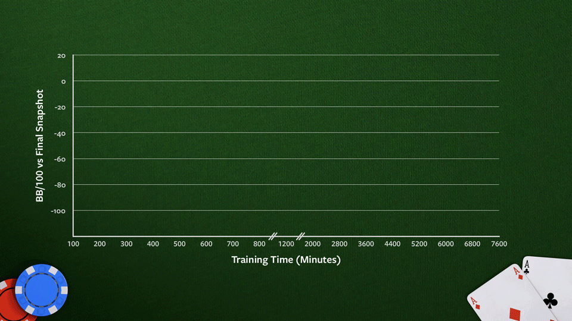
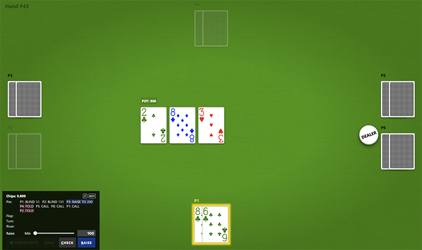
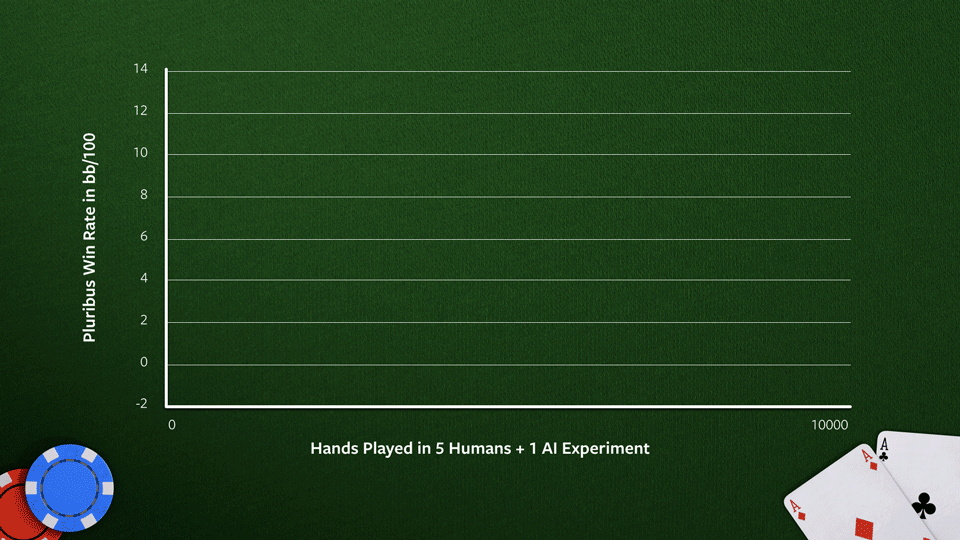
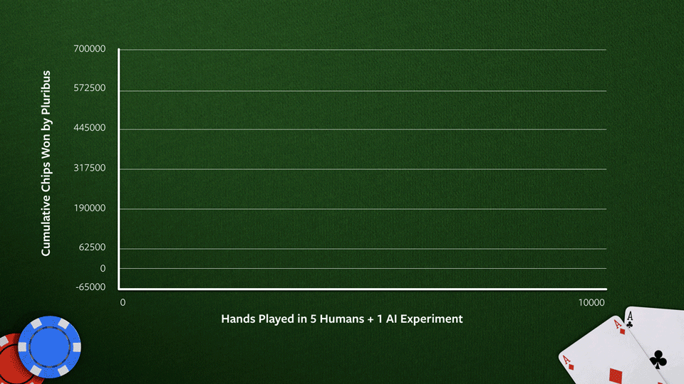

Facebook, Carnegie Mellon build first AI that beats pros in 6-player poker

[Research](https://ai.facebook.com/blog/results/research/)

# Facebook, Carnegie Mellon build first AI that beats pros in 6-player poker

July 11, 2019
Written by
Noam Brown

Share

- Pluribus is the first AI bot capable of beating human experts in six-player no-limit Hold’em, the most widely played poker format in the world. This is the first time an AI bot has beaten top human players in a complex game with more than two players or two teams.
- We tested Pluribus against professional poker players, including two winners of the World Series of Poker Main Event. Pluribus won decisively.
- Pluribus succeeds because it can very efficiently handle the challenges of a game with both hidden information and more than two players. It uses self-play to teach itself how to win, with no examples or guidance on strategy.
- Pluribus uses far fewer computing resources than the bots that have defeated humans in other games.
- The bot’s success will advance AI research, because many important AI challenges involve many players and hidden information.

For decades, poker has been a difficult and important grand challenge problem for the field of AI. Because poker involves hidden information — you don’t know your opponents’ cards — success requires bluffing and other strategies that do not apply to chess, Go, and other games. This twist has made poker resistant to AI techniques that produced breakthroughs in these other games.

In recent years, new AI methods have been able to beat top humans in poker if there is only one opponent. But developing an AI system capable of defeating elite players in full-scale poker with multiple opponents at the table was widely recognized as the key remaining milestone.

Pluribus, a new AI bot we developed in collaboration with Carnegie Mellon University, has overcome this challenge and defeated elite human professional players in the most popular and widely played poker format in the world: six-player no-limit Texas Hold'em poker. Pluribus defeated pro players in both a “five AIs + one human player” format and a “one AI + five human players” format. If each chip was worth a dollar, Pluribus would have won an average of about $5 per hand and would have made about $1,000/hour playing against five human players. These results are considered a decisive margin of victory by poker professionals.

This is the first time an AI bot has proven capable of defeating top professionals in any major benchmark game that has more than two players (or two teams). We are sharing details on Pluribus in this blog post, and more information is available in [*this newly published paper in ***Science**](https://l.facebook.com/l.php?u=https%3A%2F%2Fscience.sciencemag.org%2Flookup%2Fdoi%2F10.1126%2Fscience.aay2400&h=AT3Bo2BIqEQ23PWGXssCm_zN1J1IPHn7Amt0FCxKxAo-WCG6A5mpBtDpKZEfYYkSxi01MlYLTKIL7jt7nE-LMLQD406vixL82SP7LGqqP62dlk7fIyySO7NPGmX1D_wTkO2dhlgkE6lFSStjFa9eCTHyXsw).

Pluribus achieves this result through several innovations on [*Libratus*](https://l.facebook.com/l.php?u=https%3A%2F%2Fscience.sciencemag.org%2Fcontent%2F359%2F6374%2F418&h=AT2wp5W32cXIMrdrMw08fIViAHUK9v7E_CxuVJaneDeCO9rU6g7qsZGgnDhPzrfIG5_wCbUS41E1BY5-M0WMiU3bA_2B9wpAoUELMOABdMeA-YuuIn2fKsbu1JhLFNj_fkFVlVLkFaRPSGI036Nh29nuESQ), the AI that beat human pros in two-player no-limit Hold’em in 2017, as well as other algorithms and code developed in Tuomas Sandholm’s Carnegie Mellon University research lab. In particular, Pluribus incorporates a new online search algorithm that can efficiently evaluate its options by searching just a few moves ahead rather than only to the end of the game. Pluribus also uses new, faster self-play algorithms for games with hidden information. Combined, these advances made it possible to train Pluribus using very little processing power and memory — the equivalent of less than $150 worth of cloud computing resources. This efficiency stands in stark contrast to other recent AI milestone projects, which required the equivalent of millions of dollars’ worth of computing resources to train.

[**](https://ai.facebook.com/blog/pluribus-first-ai-to-beat-pros-in-6-player-poker/#)

This video shows sample hands from Pluribus’s experiment against professional poker players. (Cards are turned face up to make it easier to see Pluribus’s strategy.)

These innovations have important implications beyond poker, because two-player zero-sum interactions (in which one player wins and one player loses) are common in recreational games, but they are very rare in real life. Real-world scenarios — taking action on harmful content and dealing with cybersecurity challenges, as well as managing an online auction or navigating traffic — typically involve multiple actors and/or hidden information. Multi-player interactions pose serious theoretical and practical challenges to past AI techniques. Our results nevertheless show that a carefully constructed AI algorithm can reach superhuman performance outside of two-player zero-sum games.

"The most stimulating thing about playing against Pluribus was responding to its complex preflop strategies. Unlike humans, Pluribus used multiple raise sizes preflop. Attempting to respond to nonlinear open ranges was a fun challenge that differs from human games." —Seth Davies, professional poker player

“I was really excited to get to play against the bot and saw it as a unique learning experience. I thought the bot played a very solid, fundamentally sound game. It did a very good job of putting me to tough decisions when I didn’t have a strong hand and getting value when it had the best hand. It was a fun challenge and I’d enjoy the opportunity to compete with it again.” —Trevor Savage, professional poker player

“Pluribus is a very hard opponent to play against. It’s really hard to pin him down on any kind of hand. He’s also very good at making thin value bets on the river. He’s very good at extracting value out of his good hands.” —Chris Ferguson, WSOP champion

“It is an absolute monster bluffer. I would say it’s a much more efficient bluffer than most humans. And that’s what makes it so difficult to play against. You're always in a situation with a ton of pressure that the AI is putting on you and you know it’s very likely it could be bluffing here.” —Jason Les, professional poker player

"Whenever playing the bot, I feel like I pick up something new to incorporate into my game. As humans I think we tend to oversimplify the game for ourselves, making strategies easier to adopt and remember. The bot doesn't take any of these shortcuts and has an immensely complicated/balanced game tree for every decision.” —Jimmy Chou, professional poker player

“It was incredibly fascinating getting to play against the poker bot and seeing some of the strategies it chose. There were several plays that humans simply are not making at all, especially relating to its bet sizing. Bots/AI are an important part in the evolution of poker and it was amazing to have firsthand experience in this large step toward the future.” —Michael Gagliano, professional poker player

## Winning at six-player poker

Six-player poker presents two major challenges that are very different from ones typically seen in past benchmark games.

#### Not just a two-player zero-sum game

All AI breakthroughs in previous benchmark games have been limited to those with only two players or two teams facing off in a zero-sum competition (for example, [*checkers*](https://l.facebook.com/l.php?u=https%3A%2F%2Fscience.sciencemag.org%2Fcontent%2F317%2F5844%2F1518&h=AT0Q3VFcJW9mE2-tstNWIdmdi_1h5BAXaGQyZklLPJ3j2VeYIfzyBeTjKzQ94qR-NHMH-c_9fX5nEoLpqHhxE2Z_OZk9dDiHCviAflkBeyR3HOQFnvhRwweg-dpUIkEyz4-UXAZw9z_ThCQH3liFRHZd1XE), [*chess*](https://l.facebook.com/l.php?u=https%3A%2F%2Fwww.sciencedirect.com%2Fscience%2Farticle%2Fpii%2FS0004370201001291&h=AT2oiQI2pUYqksfKvXp1sBveuUal5HFPHqSS1JmxiD_Qg0aNct9YWmxY41PLXGmOzzi8SxvpNtIeiEH1U0SWqVirns1OdbPNzDwqq18l_NtlcYEhd8jwTkQrUCugplniGjefAnAAdvpG2Aa-cab38TYCl4c), [*Go*](https://l.facebook.com/l.php?u=https%3A%2F%2Fwww.nature.com%2Farticles%2Fnature16961&h=AT003X0FZ0vn2AD9j_Cs5v-dqFxXmVpCfUJ0yuCS4r9yCZIzyLPmRA3SzcLMHYRAEzoRUWAK-xRVgjFPDnA3SzZmHgnwnunrofaivXe78-SyhKPP5IE6usQT8DdX8tAq3bB3xUH2UV1erl5U6DAe4doQKG0), [*two-player poker*](https://science.sciencemag.org/content/359/6374/418.abstract), [*StarCraft 2*](https://l.facebook.com/l.php?u=https%3A%2F%2Fdeepmind.com%2Fblog%2Falphastar-mastering-real-time-strategy-game-starcraft-ii%2F&h=AT0QIWBaXeIgVOrucOA0tz2dZdRZLIue1nSNgwnknsHRI0tNc_mpFanzVG05y9JRWEg_MvhKwpBP4JxmZ7al4xJgMdTqCPRoq0TvMdLs4ucTj4pOTofPqbe2zAIFfZ53UZ1T0Y0s1JJ5W1xYRpgyQ9ruyd0), and [*Dota 2*](https://l.facebook.com/l.php?u=https%3A%2F%2Fopenai.com%2Fblog%2Fopenai-five%2F&h=AT3-16tuABTjda6Jay3swTs-j9w6acxNooXel3RkHEUfHpxbj2UQNXCTvoT0f3lFaOBz78SkrKs2_Qhc4iKcSrAKf_Pe5ME9auAils2C4JfZYLCge6rChlrVqp3ZAyDDGv8nOWmSAaDUpLEu_SIkyfukWv8)). In each of those cases, the AI was successful because it attempted to estimate a kind of strategy known as a [*Nash equilibrium*](https://l.facebook.com/l.php?u=https%3A%2F%2Fen.wikipedia.org%2Fwiki%2FNash_equilibrium&h=AT0WOYherrCGPtcDp3qKs-LS8RSx8LhLlLYwbh2DNRSOWtKnwYVqeoWqJi6hKBUhc9PhwpvQ3EknW-yr7lML0ADO-HENZSVc5EBlbFATKJLvuISPJRBA-Bji4C4Ap3nBj0Pvjy2Cy8V8yEtAM1pL5cQmvZM). In two-player and two-team zero-sum games, playing an exact Nash equilibrium makes it impossible to lose no matter what the opponent does. (For example, the Nash equilibrium strategy for rock-paper-scissors is to randomly pick rock, paper, or scissors with equal probability.)

Although a Nash equilibrium is guaranteed to exist in any finite game, it is not generally possible to efficiently compute a Nash equilibrium in a game with three or more players. (This is also true for two-player general-sum games.) Moreover, in a game with more than two players, it is possible to lose even when playing an exact Nash equilibrium strategy. One such example is the [*Lemonade Stand game*](https://l.facebook.com/l.php?u=http%3A%2F%2Fciteseerx.ist.psu.edu%2Fviewdoc%2Fdownload%3Fdoi%3D10.1.1.226.5518%26rep%3Drep1%26type%3Dpdf&h=AT3eTOTg_TE7P0HyFPyWrAseUrskRDBTx-AdAZlGTH0CRqLL1iews758p_HvhhvaqQGzG6PpqDBZ_kInODHX_y5NTAosFO6hNpFzv8Ia-8EJ8PeeLYSTL5GH3WWyUsbOiC2fLOLS-p3WIey5Oq5TH43zM54), in which each player simultaneously picks a point on a ring and wants to be as far away as possible from any other player. The Nash equilibrium is for all players to be spaced equally far apart along the ring, but there are infinitely many ways this can be accomplished. If each player independently computes one of those equilibria, the joint strategy is unlikely to result in all players being spaced equally far apart along the ring.

In the Lemonade Stand game, each player tries to be as far away as possible from the other participants. There are infinitely many ways to achieve this, however. If each player independently chooses one of the infinitely many equilibria, the players are unlikely to all be spaced equally far apart.

The shortcomings of Nash equilibria outside of two-player zero-sum games have raised the question among researchers of what the right goal should even be in such games. In the case of six-player poker, we take the viewpoint that our goal should not be a specific game-theoretic solution concept, but rather to create an AI that empirically defeats human opponents in the long run, including elite human professionals. (This is what’s commonly regarded as “superhuman” performance for AI bots.)

The algorithms we used to construct Pluribus are not guaranteed to converge to a Nash equilibrium outside of two-player zero-sum games. Nevertheless, we observe that Pluribus plays a strategy that consistently defeats elite human poker professionals in six-player poker, and that the algorithms are therefore capable of producing superhuman strategies in a wider class of settings beyond two-player zero-sum games.

#### Hidden information in a more complex environment

No other game embodies the challenge of hidden information quite like poker, where each player has information (his or her cards) that the others lack. A successful poker AI must reason about this hidden information and carefully balance its strategy to remain unpredictable while still picking good actions. For example, bluffing occasionally can be effective, but always bluffing would be too predictable and would likely result in losing a lot of money. It is therefore necessary to carefully balance the probability with which one bluffs with the probability that one bets with strong hands. In other words, the value of an action in an imperfect-information game is dependent on the probability with which it is chosen and on the probability with which other actions are chosen.

In contrast, in perfect-information games, players need not worry about balancing the probabilities of actions; a good move in chess is good regardless of the probability with which it is chosen. And though it is possible to solve a chess endgame in isolation without understanding the game’s opening strategies such as the Sicilian Defense or Queen’s Gambit, it is impossible to disentangle the optimal strategy of a specific poker situation from the overall strategy of poker.

Previous poker-playing bots such as Libratus coped with hidden information in games as large as [*two-player no-limit Texas Hold’em*](https://l.facebook.com/l.php?u=https%3A%2F%2Fscience.sciencemag.org%2Fcontent%2F359%2F6374%2F418&h=AT0I0lpM1Xj-SbYYgCmXs9qhkDLVexKKU2qaNbPqalY9nJhbHIbasnfP4E6ZRtllLyqbOjNzST2tYXy7PgqE3Ff69dHB_Jm1nsTKo0cKjl6zytZfqrEN0cULoFBrVvCHsb0zD5eYqwwDqG6ubmsmdC9_otQ) by combining a theoretically sound self-play algorithms based on [*Counterfactual Regret Minimization*](https://l.facebook.com/l.php?u=http%3A%2F%2Fpapers.nips.cc%2Fpaper%2F3306-regret-minimization-in-games-with-incomplete-information.pdf&h=AT0RA_N2sbeoQaHtBNZbv7PSN_DA-IdySRIQmGLzUuySA1nH0M7Hzj6EkZTTlQcH9Vp5xXKJTqlMluymJBvade1o4C6OvzGSVwNpdIuZCHUUrgGzEIhyC4h-AIB9BoF883MeigZbOnXvk5VYXa7nxRNso8E) (CFR) with a carefully constructed search procedure for imperfect-information games. Adding additional players in poker, however, increases the complexity of the game exponentially. Those previous techniques could not scale to six-player poker even with 10,000x as much compute. Pluribus uses new techniques that can handle this challenge far better than anything that came before.

## Understanding Pluribus’s blueprint strategy

The core of Pluribus's strategy was computed via self-play, in which the AI plays against copies of itself, without any human gameplay data used as input. The AI starts from scratch by playing randomly and gradually improves as it determines which actions, and which probability distribution over those actions, lead to better outcomes against earlier versions of its strategy. The version of self-play used in Pluribus is an improved variant of the iterative Monte Carlo CFR (MCCFR) algorithm.

On each iteration of the algorithm, MCCFR designates one player as the “traverser” whose current strategy is updated on the iteration. At the start of the iteration, MCCFR simulates a hand of poker based on the current strategy of all players (which is initially completely random). Once the simulated hand is completed, the algorithm reviews each decision the traverser made and investigates how much better or worse it would have done by choosing the other available actions instead. Next, the AI assesses the merits of each hypothetical decision that would have been made following those other available actions, and so on.

[**](https://ai.facebook.com/blog/pluribus-first-ai-to-beat-pros-in-6-player-poker/#)

This graphic shows how the Monte Carlo Counterfactual Regret Minimization algorithm updates the traverser’s strategy by assessing the value of real and hypothetical moves. In Pluribus, this traversal is actually done in a depth-first manner for optimization purposes.

Exploring other hypothetical outcomes is possible because the AI is playing against copies of itself. If the AI wants to know what would have happened if some other action had been chosen, then it need only ask itself what it would have done in response to that action.

The difference between what the traverser would have received for choosing an action versus what the traverser actually achieved (in expectation) on the iteration is added to the counterfactual regret for the action. At the end of the iteration, the traverser's strategy is updated so that actions with higher counterfactual regret are chosen with higher probability.

Maintaining counterfactual regrets for each action in each decision point in a game such as no-limit Texas Hold’em would require more bytes than the number of atoms in the universe. To reduce the complexity of the game, we ignore some actions and also bucket similar decision points together in a process called abstraction. After abstraction, the bucketed decision points are treated as identical.

Pluribus's self-play outputs what we refer to as the blueprint strategy for the entire game. During actual play, Pluribus improves upon this blueprint strategy using its search algorithm. But Pluribus does not adapt its strategy to the observed tendencies of its opponents.

This graph shows how Pluribus’s blueprint strategy improves during training on a 64-core CPU. Performance is measured against the final snapshot of training. We do not use search in these comparisons. Typical human and top human performance are estimated based on discussions with human professionals. The graphic also notes when Pluribus stops “limping,” a passive strategy that advanced players typically avoid.

We trained the blueprint strategy for Pluribus in eight days on a 64-core server and required less than 512 GB of RAM. No GPUs were used. At typical cloud computing instance rates, it would cost less than $150 to train. This is in sharp contrast to other recent AI breakthroughs, including those involving self-play in games, which commonly cost millions of dollars to train. We are able to achieve superhuman performance at such a low computational cost because of algorithmic improvements, which are discussed below.

## A more efficient, more effective search strategy

The blueprint strategy is necessarily coarse-grained because of the size and complexity of no-limit Texas Hold'em. During actual play, Pluribus improves upon the blueprint strategy by conducting real-time search to determine a better, finer-grained strategy for its particular situation.

AI bots have used real-time search in many perfect-information games, including backgammon (two-ply search), chess (alpha-beta pruning search), and Go (Monte Carlo tree search). For example, when determining their next move, chess AIs commonly look some number of moves ahead until a leaf node is reached at the depth limit of the algorithm's lookahead.

Those search methods, however, don’t work with imperfect-information games because they do not consider the opponents’ ability to shift to different strategies beyond the leaf nodes. This weakness leads the search algorithms to produce brittle, unbalanced strategies that the opponents can easily exploit. AI bots were previously unable to solve this challenge in a way that can scale to six-player poker.

Pluribus instead uses an approach in which the searcher explicitly considers that any or all players may shift to different strategies beyond the leaf nodes of a subgame. Specifically, rather than assuming all players play according to a single fixed strategy beyond the leaf nodes (which results in the leaf nodes having a single fixed value), we instead assume that each player may choose among four different strategies to play for the remainder of the game when a leaf node is reached. One of the four continuation strategies we use in Pluribus is the precomputed blueprint strategy; another is a modified form of the blueprint strategy in which the strategy is biased toward folding; another is the blueprint strategy biased toward calling; and the final option is the blueprint strategy biased toward raising.

This technique results in the searcher finding a more balanced strategy that produces stronger overall performance, because choosing an unbalanced strategy (e.g., always playing rock in rock-paper-scissors) would be punished by an opponent shifting to one of the other continuation strategies (e.g., always playing paper).

As we’ve noted, another major challenge of search in imperfect-information games is that a player's optimal strategy for a particular situation depends on how her opponents perceive her gameplay. If a player never bluffs, her opponents would know to always fold in response to a big bet.

To cope, Pluribus tracks the probability it would have reached the current situation with each possible hand according to its strategy. Regardless of which hand Pluribus is actually holding, it will first calculate how it would act with every possible hand — being careful to balance its strategy across all the hands so it remains unpredictable to the opponent. Once this balanced strategy across all hands is computed, Pluribus then executes an action for the hand it is actually holding.

When playing, Pluribus runs on two CPUs. For comparison, AlphaGo used 1,920 CPUs and 280 GPUs for real-time search in its 2016 matches against top Go professional Lee Sedol. Pluribus also uses less than 128 GB of memory. The amount of time Pluribus takes to search on a single subgame varies between one second and 33 seconds depending on the particular situation. On average, Pluribus plays twice as fast as typical human pros: 20 seconds per hand when playing against copies of itself in six-player poker.

## How Pluribus performed against human pros

We evaluated Pluribus by playing against a group of elite human professionals. The collection of pros included Chris “Jesus” Ferguson (the 2000 World Series of Poker Main Event champion), Greg Merson (the 2012 World Series of Poker Main Event champion), and Darren Elias (four-time World Poker Tour champion). The full list of pros: Jimmy Chou, Seth Davies, Michael Gagliano, Anthony Gregg, Dong Kim, Jason Les, Linus Loeliger, Daniel McAulay, Nick Petrangelo, Sean Ruane, Trevor Savage, and Jake Toole. Each of these pros has won more than $1 million playing poker professionally, and many have won more than $10 million.

When AI systems have played humans in other benchmark games, the machine has sometimes performed well at first, but it eventually lost as the human player discovered its vulnerabilities. For an AI to master a game, it must show it can also win, even when the human opponents have time to adapt. Our matches involved thousands of poker hands over the course of several days, giving the human experts ample time to search for weaknesses and adapt.

“The bot wasn’t just playing against some middle-of-the-road pros,” said Elias. “It was playing some of the best players in the world.”

This is the interface used during the experiment with Pluribus and the professional players.

There were two formats for the experiment: five humans playing with one AI at the table, and one human playing with five copies of the AI at the table. In each case, there were six players at the table with 10,000 chips at the start of each hand. The small blind was 50 chips, and the big blind was 100 chips.

Although poker is a game of skill, there is an extremely large luck component as well. It is common for top professionals to lose money even over the course of 10,000 hands of poker simply because of bad luck. To reduce the role of luck, we used a version of the [*AIVAT*](https://l.facebook.com/l.php?u=https%3A%2F%2Farxiv.org%2Fabs%2F1612.06915&h=AT3gXQuPYfDe5hghCwJp0XL9dQpwWyelkih5SZl2mRfgu_2l8cSxNux2haGqgR98h3WS2iRqxGFgJUA2yCYcu_Tr-rXfkRsE2NtiKa2-m8DX9eeDyv2HKOsewat3iWr8VtBsj4WcZydOYUxswmWyBBUM7JE) variance reduction algorithm, which applies a baseline estimate of the value of each situation to reduce variance while still keeping the samples unbiased. For example, if the bot is dealt a really strong hand, AIVAT will subtract a baseline value from its winnings to counter the good luck. This adjustment allowed us to achieve statistically significant results with roughly 10x fewer hands than would normally be needed.

#### 5 humans + 1 AI

In this experiment, 10,000 hands of poker were played over 12 days. Each day, five volunteers from the pool of professionals were selected to participate. A prize of $50,000 was divided among the human pros based on their performance, to incentivize them to play their best. After applying AIVAT, Pluribus’s win rate was estimated to be about 5 big blinds per 100 hands (5 bb/100), which is considered a very strong victory over its elite human opponents (profitable with a p-value of 0.021). If each chip was worth a dollar, Pluribus would have won an average of about $5 per hand and would have made about $1,000/hour. This result exceeds the rate at which professional players typically expect to win when playing against a mix of both professional and amateur players.

“Pluribus is a very hard opponent to play against,” Ferguson said after the experiment. “It’s really hard to pin him down on any kind of hand. He’s also very good at making thin value bets on the river. He’s very good at extracting value out of his good hands.”

It is important to note, however, that Pluribus is intended to be a tool for AI research and that we are using poker only as a way to benchmark AI progress in imperfect-information multi-agent interactions relative to top human ability.

#### 5 AIs + 1 human

This experiment was conducted with Ferguson, Elias, and Linus Loeliger. (The experiment involving Loeliger was completed after the final version of the Science paper was submitted.) Loeliger is considered by many to be the best player in the world at six-player no-limit Hold’em cash games. Each human played 5,000 hands of poker with five copies of Pluribus at the table. Pluribus does not adapt its strategy to its opponents, so intentional collusion among the bots was not an issue. In aggregate, the humans lost by 2.3 bb/100. Elias was down 4.0 bb/100 (standard error of 2.2 bb/100), Ferguson was down 2.5 bb/100 (standard error of 2.0 bb/100), and Loeliger was down 0.5 bb/100 (standard error of 1.0 bb/100).

This graphic shows Pluribus’s average win rate against professional poker players over the course of the 10,000-hand experiment. The straight line shows actual results, and the dotted lines show one standard deviation.

“Its major strength is its ability to use mixed strategies,” Elias said. “That’s the same thing that humans try to do. It’s a matter of execution for humans — to do this in a perfectly random way and to do so consistently. Most people just can’t.”

Because Pluribus's strategy was determined entirely from self-play without any human data, it also provides an outside perspective on what optimal play should look like in multi-player no-limit Texas Hold'em. Pluribus confirms the conventional human wisdom that limping (calling the big blind rather than folding or raising) is suboptimal for any player except the small blind player who already has half the big blind in the pot by the rules, and thus has to invest only half as much as the other players to call. Although Pluribus initially experimented with limping when computing its blueprint strategy offline through self-play, it gradually discarded this tactic as self-play continued. But Pluribus disagrees with the folk wisdom that donk betting (starting a round by betting when one ended the previous betting round with a call) is a mistake; Pluribus does this far more often than professional humans do.

“It was incredibly fascinating getting to play against the poker bot and seeing some of the strategies it chose,” said Gagliano. “There were several plays that humans simply are not making at all, especially relating to its bet sizing.”

This graphic shows Pluribus's chip count when competing against the pro players. The straight line shows actual results, and the dotted lines show one standard deviation.

## From poker to other imperfect-information challenges

AI has previously had a number of high-profile successes in perfect-information two-player zero-sum games. But most real-world strategic interactions involve hidden information and are not two-player zero-sum. Pluribus’s success shows that there are also large-scale, complex multi-player settings in which a carefully constructed self-play-and-search algorithm can be successful despite the lack of known strong theoretical guarantees on performance.

Pluribus is also unusual because it costs far less to train and run than other recent AI systems for benchmark games. Some experts in the field have worried that future AI research will be dominated by large teams with access to millions of dollars in computing resources. We believe Pluribus is powerful evidence that novel approaches that require only modest resources can drive cutting-edge AI research.

Even though Pluribus was developed to play poker, the techniques used are not specific to poker and [*need not require any expert domain knowledge*](https://l.facebook.com/l.php?u=https%3A%2F%2Fresearch.fb.com%2Fpublications%2Fdeep-counterfactual-regret-minimization%2F&h=AT2A6qMiclImb-E2GYhchyNnwnZPV-nTlgPuygKK1AmIUmuVS4ajd4i64Ti7GFt5XYV6E6gUhO03wza4bv26I3XxRVf-kkuKkaKd_wOlmlHVsSPunuGOTq8HWDAJ32aV9h4C1AVc-SjVCsbZW-qMCgeDpY8) to develop. This research gives us a better fundamental understanding of how to build general AI that can cope with multi-agent environments, both with other AI agents and with humans, and allows us to benchmark progress in this field against the pinnacle of human ability.

Of course, the approach taken in Pluribus may not be successful in all multi-agent settings. In poker, there is limited opportunity for players to communicate and collude. It is possible to construct very simple coordination games in which existing self-play algorithms fail to find a good strategy. Nevertheless, many real-world interactions – including ones involving fraud prevention, cybersecurity, and taking action on harmful content – can potentially be modeled as scenarios involving hidden information and/or multiple agents with limited communication and collusion among participants.

The techniques that enable Pluribus to defeat multiple opponents at the poker table may help the AI community develop effective strategies in these and other fields.

Thanks to Tuomas Sandholm and the team at CMU who have been working on strategic reasoning technologies over the last 16 years. Sandholm has founded two companies in this work — Strategic Machine Inc., Strategy Robot Inc. — that have exclusively licensed the technologies developed in his Carnegie Mellon laboratory. Strategic Machine is applying the technologies to poker, gaming, business, and medicine, and Strategy Robot is applying them to defense and intelligence. Pluribus builds on and incorporates large parts of that technology and code. It also includes poker-specific code, written as a collaboration between Carnegie Mellon and Facebook for the current study, that will not be applied to defense applications.

## Written by

Noam Brown
Research Scientist

## Related posts

[Training AI agents to solve unfamiliar tasks](https://ai.facebook.com/blog/training-ai-agents-to-solve-unfamiliar-tasks/)

October 01, 2018

[Q&A with MIT Technology Review award winner Noam Brown](https://ai.facebook.com/blog/q-and-a-with-2019-innovator-under-35-noam-brown/)

June 26, 2019

[Horizon: The first open source reinforcement learning platform for large-scale products and services](https://ai.facebook.com/blog/horizon-the-first-open-source-reinforcement-learning-platform-for-large-scale-products-and-services/)

November 01, 2018

## Related Tags

[Research](https://ai.facebook.com/blog/results/research/)