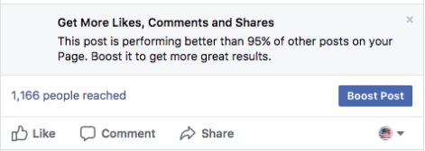
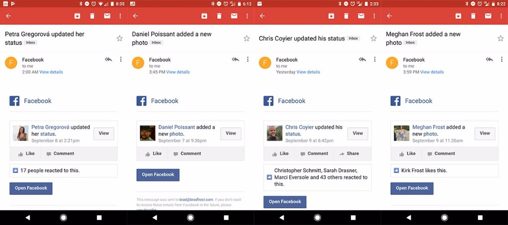
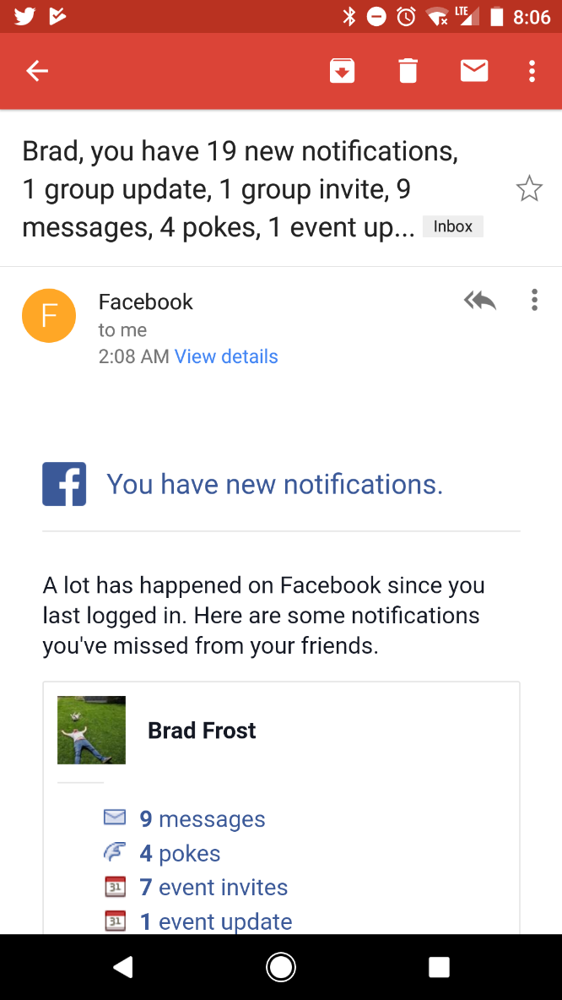
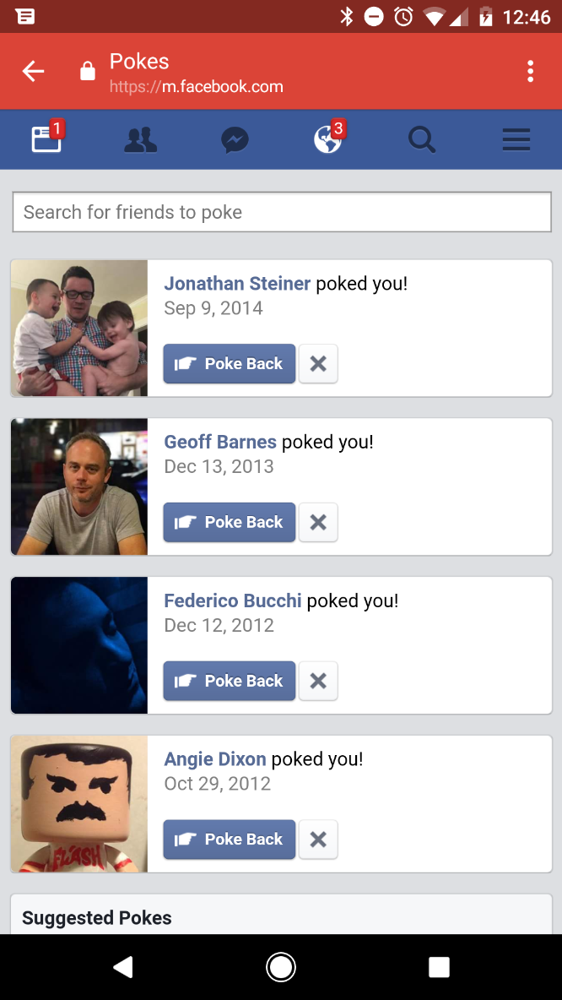

Facebook, You Needy Sonofabitch

# Facebook, You Needy Sonofabitch

Several months ago, I turned off notifications from Facebook on my phone. Last week, I went ahead and removed the Facebook app from my phone.

Now, I genuinely enjoy Facebook. I use it for keeping up with with my family and my IRL friends, who are spread out all over the world. (The questions I ask when determining who to friend on Facebook: “Have they been in my house? Or would it feel natural/comfortable for them to visit my house?”)

But lately I’ve noticed the platform feeling increasingly grabby, to the point where they’ve broken the [fourth wall](https://en.wikipedia.org/wiki/Fourth_wall) with me and now the whole experience is no longer enjoyable. They’ve gotten so brazen in their tactics to keep users engaged (ENGAGED!) I think **it’s no longer possible to be a casual Facebook user.**

Here’s a few examples of what I’m talking about:

## You’ve shared x days in a row and your friends are responding.

No doubt this notification is inspired by Snapchat’s [snap streak](https://support.snapchat.com/en-US/a/Snaps-snapstreak) feature, which encourages people to keep messaging each other every day in order to keep the streak alive. But holy crap, this feels so incredibly unnatural to say out loud. It’s weird to see them so explicitly come out and say “you’re using the platform exactly how we want you to, and you have friends because of it. You want friends, right? You want to be loved, don’t you? The only way to be loved is to keep posting.”

Now, I can appreciate the fact that businesses want to have a solid understanding of how their audiences are responding to posts, but it seems strange and disturbing to talk to regular users like they’re all marketeers.

## Exploiting good intentions

People enjoy wishing people happy birthday. People enjoy taking a stroll down memory lane once in a while. Facebook has masterfully taken those kind and sentimental aspects of the human condition and manipulated them for clicks.

For years I found myself on the hamster wheel of wishing everyone a forced happy birthday. For years! Of course I want the people in my life to have a happy birthday, but it shouldn’t feel like a tedious chore. It’s valuable to know the birthdays of your friends and family, but it’s lousy to use that as a hook to keep you coming back and playing the slots.

Same thing with memories. I occasionally enjoy looking back at experiences I have with my family and friends. And when this feature first rolled out I found myself exploring a few of my past posts. But too much of a good thing gets swept up in the rest of the noise, and I notice this feature now pops up on the regular. I can almost hear them saying “Oh hey, people seem to like this memories thing; let’s turn it up to 11!” It went from being an occasional treat to just another notification clogging up the pipes.

## Pay to play

I have a page for my [business](https://www.facebook.com/brad.frost.web.design/), which is where I share links to web design resources. I can appreciate the fact that businesses paying for posts keeps the big blue ship afloat, and I can appreciate the fact that businesses would want to know if I particular post would be especially good to promote. But lately it seems they’ve really turned the screws trying to aggressively funnel you into paying to promote posts.

### This post is performing 95% better than others. Boost it!

### You want to promote this post, don’t you?

There’s no respite from these messages, so it constantly feels like a gun to your head to get you to boost, promote, and pay.

## Miscellaneous Debris

One thing that’s become obvious over the course of the last year is Facebook’s willingness to suggest more and more things that have nothing to do with my personal life experience. On one hand, I appreciate the sentiment of trying to expand someone’s horizons to open them up to new people, places, and experiences. But even if that’s the spirit of what Facebook is trying to accomplish, the execution feels like a shallow grab for clicks.

### So and so created a poll

I’m not even a member of Assemble Volunteers.

### So and so just posted for the first time in a while.

My cousin updated his status for the first time in a while. Good for him!

### So and so just joined Messenger! Be the first to send a welcome message or sticker.

“Hey, we have products. Use our products.”

### So and so added an event near you

Surfacing events you might be interested in isn’t a bad idea, but execution is everything. For a platform that knows so much about me, I think it’s incredible how far off the mark most of their suggestions are.

## We haven’t heard from you in a while…

This disturbs me perhaps more than anything.

I started the draft of this post a few days ago, and have since been taking care of work, going to a wedding, and living my life. But my several-day absence from Facebook apparently got them really worried. They started sending me a slew of emails over a period of time, highlighting recent posts from people, including my wife’s childhood friend’s husband.

Facebook got worried when I didn’t bite on any of those, so they decided to bring out the big guns.

Holy shit! My Facebook just blew up. So much has happened! I’ve apparently been poked 4 times! Despite my intention to not feed the beast and rather simply analyze their tactics for bringing me back in, being poked 4 times was just too irresistible not to check out. So I clicked through to find this:

Apparently pokes from 5 years ago are still newsworthy! Anything to get you to come back.

## What to make of all this

This is what happens when the metric of how much time users spend using your thing supersedes the goal of providing legitimate value to your users. **The tricks, hooks, and tactics Facebook uses to keep people coming back have gotten more aggressive and explicit. And I feel that takes away from the actual value the platform provides.**

There are of course plenty of weighty, important topics worth criticizing Facebook for, from their perpetuating fake news to their role in influencing the election to enabling the surveillance state and so on. But even this seemingly benign topic has huge ramifications on how people spend their time and live their lives. As users, it’s important to be aware of how the platform is manipulating you. As designers, it’s important to be mindful of how much attention we’re demanding from users and why we’re demanding that attention in the first place.

So that’s where I’m at. I’m likely not going to delete Facebook entirely since I do genuinely enjoy staying in touch with the people in my life, and for better or worse Facebook is where those people hang out. But I want to do use Facebook on my own terms, not theirs.

Posted on [11 Sep, 2017](http://bradfrost.com/blog/post/facebook-you-needy-sonofabitch/)

Tags: [deathtobullshit](http://bradfrost.com/blog/tag/deathtobullshit/), [design](http://bradfrost.com/blog/tag/design/), [facebook](http://bradfrost.com/blog/tag/facebook/)