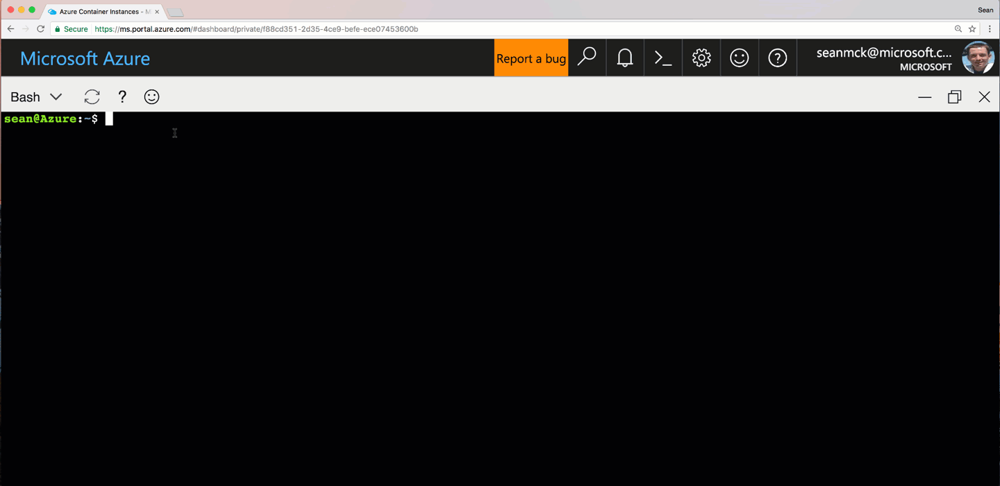

Fast and Easy Containers: Azure Container Instances

# Fast and Easy Containers: Azure Container Instances

     

Posted on July 26, 2017

 [Corey Sanders](https://azure.microsoft.com/en-us/blog/author/corey-sanders/)  Director of Compute, Azure

Containers have fundamentally changed the way developers develop their applications, the way applications are deployed, and the way system administrators manage their environments. Containers offer a broadly accepted and open standard, enabling simple portability between platforms and between clouds. Today, I am extremely excited to announce a new Azure service that makes it even easier to deploy containers. The very first service of its kind in the cloud, Azure Container Instances (ACI) is a new Azure service delivering containers with great simplicity and speed and without any Virtual Machine infrastructure to manage. ACIs are the fastest and easiest way to run a container in the cloud.

An Azure Container Instance is a single container that starts in seconds and is billed by the second. ACI offer highly versatile sizing, allowing you to select the exact amount of memory separate from the exact count of vCPUs, so your application perfectly fits on the infrastructure. Your containers won’t be billed for a second longer than is required and won’t use a GB more than is needed. With ACI, containers are a first-class object of the Azure platform, offering Role-Based Access Control (RBAC) on the instance and billing tags to track usage at the individual container level. As the service directly exposes containers, there is no VM management you need to think about or higher-level cluster orchestration concepts to learn. It is simply your code, in a container, running in the cloud.

For those beginning their container journey, Azure Container Instances provide a simple experience to get started with containers in the cloud, enabling you to quickly create and deploy new containers with only a few simple parameters. Here is a sample command that will deploy to ACI using Azure CLI. For step by step instructions, refer to [ACI quickstart](https://docs.microsoft.com/en-us/azure/container-instances/container-instances-quickstart).

az container create -g aci_grp --name nginx --image library/nginx --ip-address public

and if you want to control the exact GB of memory and CPU count:

az container create -g aci_grp --name nginx --image library/nginx --ip-address public  –cpu 2  --memory 5

Container Instances are available today in public preview for Linux containers. Windows container support will be available in the coming weeks. You can deploy using the Azure CLI or using a template. Furthermore, you can quickly and easily deploy from a public repository, like Docker Hub, or pull from your own private repository using the Azure Container Registry. Each container deployed is securely isolated from other customers using proven virtualization technology.

The above shows the simplicity of ACI. While Azure Container Instances are not an orchestrator and are not intended to replace orchestrators, they will fuel orchestrators and other services as a container building block. In fact, as part of today’s announcement, we are also releasing in open source, the [ACI Connector for Kubernetes](https://github.com/azure/aci-connector-k8s). This is an open-source connector that enables Kubernetes clusters to deploy to Azure Container Instances. This enables on-demand and nearly instantaneous container compute, orchestrated by Kubernetes, without having VM infrastructure to manage and while still leveraging the portable Kubernetes API. This will allow you to utilize both VMs and container instances simultaneously in the same K8s cluster, giving you the best of both worlds. Azure Container Instances can be used for fast bursting and scaling whereas VMs can be used for the more predictable scaling. Workloads can even migrate back-and-forth between these underlying infrastructure models. This offers a level of agility for deploying Kubernetes, unlike any other cloud provider, enabling services that start in seconds without any underlying VMs and are billed and scaled per second.

Here is a demo of the ACI Connector in action:

We continue to increase our investment and community engagement with containers and with Kubernetes, including Helm, our recent release of [Draft](https://github.com/Azure/draft), and the open-source ACI connector released today. With these community releases, we continue to learn how important it is to have an open ecosystem to drive innovation in this growing container space, an exciting and humbling experience. To continue our education and community engagement, I am also excited to [announce](https://azure.microsoft.com/en-us/blog/announcing-cncf) that Microsoft has joined the Cloud Native Computing Foundation (CNCF) as a Platinum member. CNCF is a Collaborative Project of the Linux Foundation (that Microsoft joined last year) which hosts and provides governance for a wide range of projects including Kubernetes, Prometheus, OpenTracing, Fluentd, Linkerd, containerd, Helm, gRPC, and many others. I am really excited to work closely with the CNCF community and have Gabe Monroy (Lead PM, Containers @ Microsoft Azure) join the CNCF board.

I hope you try out these new services and give us feedback. I am excited to see what you are going to build!

See ya around,

Corey