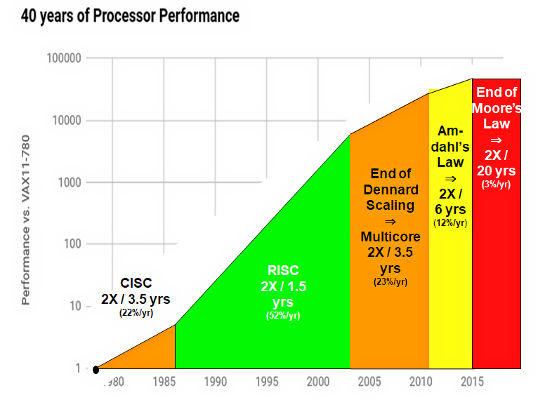

Fifty (or Sixty) Years of Processor Development…for This?

March 29, 2018

## Fifty (or Sixty) Years of Processor Development…for This?

“Dennard Scaling and Moore’s Law are dead, Now what?” – a 4-act play by Dr. David Patterson

by Steven Leibson

*“We cross our bridges when we come to them and burn them behind us, with nothing to show for our progress except a memory of the smell of smoke, and a presumption that once our eyes watered.” – Rosencranz and Guildenstern are Dead by Tom Stoppard*

Dr. David Patterson quick-marched an audience of about 200 pizza-sated engineers through a half-century of computer design on March 15. He spoke from the podium in a large conference room in building E at Texas Instruments’ Santa Clara campus during an IEEE talk titled “50 Years of Computer Architecture: From Mainframe CPUs to DNN TPUs and Open RISC-V.” It’s a history of accidental successes and potholes, sinkholes, and black holes that swallow entire architectures.

Patterson started his talk with the 1960s and the groundbreaking IBM System/360 project, which built upon Maurice Wilkes’s early development of microprogramming in 1951. That was long, long ago in computer years. Towards the end of his talk, Patterson displayed an earthshaking graph showing precisely how the death of Dennard Scaling, followed closely by the death of Moore’s Law, is altering the way we design computers. He finished by explaining the technological post mortem aftereffects of these shocks.

It’s always a pleasure watching masters ply their chosen crafts, and Patterson is truly the master of computer architecture and the forces that drive it; he’s taught this topic since 1976, and he co-authored the definitive bestselling book “[Computer Architecture: A Quantitative Approach](https://www.amazon.com/Computer-Architecture-Sixth-Quantitative-Approach/dp/0128119055/ref=dp_ob_title_bk)” with Dr. John Hennessy that’s now on its sixth edition. (“You should buy it!” he suggested.) So Patterson’s now light years beyond [Malcolm Gladwell](https://en.wikipedia.org/wiki/Outliers_(book))’s 10K hours needed for subject mastery, and it showed.

Patterson captivated his audience for 75 minutes, giving a talk split into four acts. Like Tom Stoppard’s absurdist play “Rosencranz and Guildenstern are Dead,” nothing—not one thing—seems to go as planned.

Dr. David Patterson presented to the IEEE Santa Clara Valley Section on March 15 prior to winning the ACM’s 2017 A. M. Turing Award. (Source: Steve Leibson)

**Act I: The IBM System/360, DEC’s VAX, and Prelude to CISC**

The 1950s and 1960s saw tremendous experimentation with mainframe instruction set architectures (ISAs). (Mainframes were almost the only computers being designed at the time.) Nearly every new mainframe had a “new and improved” ISA. By the early 1960s, IBM alone sold four lines of computers—the 650, 701, 702, and 1401, targeted at business, scientific, and real-time applications—all with mutually incompatible ISAs. Four incompatible computer ISAs meant that IBM was developing and maintaining four completely independent sets of peripheral devices (tape drives, disk and drum drives, and printers) and four software development tool sets (assemblers, compilers, operating systems, etc.) as well.

The situation was clearly not sustainable, so IBM took a huge gamble. It decided to develop one binary-compatible instruction set for all of its machines. One hardware-independent instruction set to rule them all. Chief Architect Gene Amdahl and his team developed the System/360 architecture, designed to be implemented on a series of low-cost to high-cost machines with 8-, 16-, 32-, and 64-bit datapaths.

To simplify hardware development of the IBM System/360 processor hardware, the development team chose to use microprogramming for the hard-to-design control logic. Maurice Wilkes first conceived of microprogramming in 1951, and it was first used in 1958 for the EDSAC 2 computer. So, in a sense, microprogramming was already proven technology by the time IBM started the System/360 project, which then proved it again, big time.

Microprogrammed processor control immediately blossomed in mainframe design, especially after semiconductor memory chips appeared and started to ride Moore’s Law. Perhaps the greatest example of massive microprogramming was the DEC VAX, introduced in 1977. The VAX 11/780 was a groundbreaking minicomputer built from TTL and memory chips that became the performance benchmark for the rest of the century.

DEC engineers developed the VAX ISA during a time when assembly-language coding dominated, partly because of engineering inertia (“we’ve always done it that way”) and partly because the rudimentary high-level compilers of the day produced machine code that did not compare well against tight, hand-coded assembly language. The VAX ISA’s instructions supported a huge number of programmer-friendly addressing modes and included individual machine instructions that performed complex operations such as queue insertion/deletion and polynomial evaluation. VAX engineers delighted in designing hardware that eased the programmer’s burden. Microcoding made it easy to add new instructions to an ISA, and the 99-bit-wide VAX microprogram control store ballooned to 4096 words.

This focus on creating an ever-expanding number of instructions to ease the assembly-language programmer’s burden proved to be a real competitive advantage for DEC’s VAX. Programmers loved computers that made their jobs easier. For many computer historians, the VAX 11/780 marks the birth of CISC (complex instruction set computing).

**Act II: Accidental Successes and Big Failures**

The DEC VAX 11/780 minicomputer peaked just as microprocessors were starting to explode. Almost all early microprocessors were CISC machines, because lightening the programmer’s burden remained a competitive advantage, even when the computer shrank to one chip. Intel’s Gordon Moore, who had developed Moore’s Law at Fairchild, was tasked with developing a follow-on ISA to supplant the accidental success of the 8-bit Intel 8080/8085 (and Z80) ISA. Taking one page from IBM’s tremendously successful System/360 project (one ISA to rule them all) and another from DEC’s VAX line of CISC minicomputers, Moore also sought to develop the ultimate ISA—one Intel ISA to last for the rest of time.

At a time when contemporary 8-bit microprocessors had 16-bit address spaces, this new, ultimate Intel ISA had a 32-bit address space and built-in memory security. It accommodated instructions of any bit length starting with just one bit. And it would be programmed in the latest and greatest high-level language: Ada.

This ISA was to become the Intel iAPX 432, and it was a very big, very ambitious project for Intel.

If you research the history of the “revolutionary” iAPX 432, you’ll discover that it was a massive failure. The hardware required to implement the iAPX 432 ISA was massively complex. As a result, the chip implementation was massively late. (It required a 6-year development cycle and only appeared in 1981.) And when the microprocessor finally did appear, it was massively slow.

Gordon Moore saw early on in the project that the iAPX 432 was going to take a long time to develop, so he launched a parallel crash project in 1976 to develop a much less ambitious 16-bit microprocessor based on a source-code-compatible extension of the successful 8-bit 8080 ISA. The development team had just one year to produce the chip, so they splurged and spent all of three weeks developing the ISA. The result was the 8086—one ISA to rule them all, at least for several decades.

One problem: By Intel insiders’ own description, the 8086 microprocessor was a dog.

The Intel 8086’s performance lagged that of its closest microprocessor rivals: the elegant Motorola 68000 (a 32-bit processor in 16-bit clothing) and the 16-bit Zilog Z8000. IBM selected the Intel 8086 for its IBM PC project despite its lack of performance because Intel’s engineers in Israel had developed the 8088: an 8086 variant with an 8-bit bus. The 8088 microprocessor ran a bit slower than the 8086, but its 8-bit bus seemed more compatible with existing peripheral chips, and it reduced the PC motherboard’s manufacturing costs.

IBM projected that it would sell about 250,000 IBM PCs. Instead, it sold more than 100 million, and the Intel 8088 instantly became an accidental, blockbuster hit.

**Act III: The Birth of RISC, VLIW, and the sinking of the Itanic**

In 1974, just after the first commercial microprocessors appeared, IBM’s John Cocke was trying to develop a control processor for an electronic telephone switch. He calculated that the control processor needed to execute about 10 million instructions/second (MIPS) to meet the application’s requirements. Microprocessors of the day were an order of magnitude too slow, and even IBM’s System/370 mainframe fell short. It delivered about 2 MIPS.

So Cocke’s 801 project team developed a radically streamlined processor architecture with a pipelined datapath and fast, non-microprogrammed control circuitry made possible by reducing the number of instructions to a minimum to simplify control challenges. (The machine is called the IBM 801 because it was developed in Building 801 at IBM’s Thomas J. Watson Research Center.) The IBM 801 project implemented the first RISC (reduced instruction set computer) ISA.

The resulting 801 computer prototype built with small-scale Motorola MECL 10K chips delivered an earth-shattering 15 MIPS and easily met the design requirements. Because the reduced number of instructions would be less programmer-friendly than a CISC instruction set, Cocke’s team had to develop optimizing compilers that shouldered the extra burden of creating efficient machine code from complex algorithms written in high-level languages.

Cocke became known as “the father of RISC” for this work. IBM never built the telephone switch, but the 801 processor evolved and eventually became the basis for IBM’s long line of POWER RISC processors, used extensively in its mainframes and servers.

Later, a couple of engineers at DEC found that about 20% of the VAX’s CISC instructions consumed about 80% of the VAX microcode but represented only 0.2% of overall program execution time. What a waste! Considering the results of the IBM 801 project and the findings of DEC’s engineers, perhaps CISC architecture wasn’t so great after all.

Turns out, it wasn’t.

In 1984, Stanford Professor John Hennessy published a landmark paper titled “[VLSI Processor Architecture](https://pdfs.semanticscholar.org/ee02/e249bfdbc94a41acd9041d5ee9eadf77b169.pdf)” in the IEEE Transactions on Computers that proved the superiority of RISC ISAs and architectures for VLSI processor implementations. Patterson summarized Hennessy’s proof in his talk: RISC is inherently faster because CISC machines require 6x more clocks per instruction than do RISC machines. Even though CISC machines need only execute half as many instructions as RISC machines for a given task, RISC machines are inherently 3x faster than CISC machines, if you do the math.

Consequently, the x86 processors in today’s PCs may still appear to be executing software-compatible CISC instructions, but, as soon as those instructions cross over from external RAM into the processor, an instruction chopper/shredder slices and dices x86 machine instructions into simpler “micro-ops” (Intel-Speak for RISC instructions) that are then scheduled and executed on multiple RISC execution pipelines. Today’s x86 processors got faster by evolving into RISC machines.

A few processor architects decided to develop an ISA that was far better than either RISC or CISC. A very wide instruction word should make it possible to pack multiple parallel operations into one huge machine instruction. The architects dubbed this ISA variant VLIW (Very Long Instruction Word). VLIW machines take a page from the book of RISC by expecting the VLIW software compiler to figure out how to schedule and pack instructions generated from high-level source code into VLIW machine code.

Intel decided that VLIW ISAs looked very appealing and began developing a VLIW processor that would become its entry into the imminent world of 64-bit microprocessors. Intel dubbed its VLIW ISA “IA-64.” As usual, Intel had developed its own nomenclature. VLIW became EPIC (Explicitly Parallel Instruction Computing) in Intel-Speak. EPIC would not be based on the x86 instruction set, in part to prevent AMD from making copies.

Later, HP’s PA-RISC engineers observed that RISC was running out of gas, and they, too, caught the VLIW bug. HP joined forces with Intel in 1994 to develop a joint 64-bit VLIW/EPIC architecture. The result would be called the Itanium microprocessor. The announced goal was to deliver the first Itanium processor in 1998.

It soon became clear, however, that VLIW processors and compilers were going to be hard to develop. Intel did not announce the Itanium name until 1999 (Usenet wonks immediately dubbed the Itanium processor the “Itanic”), and the first working processor wasn’t released until 2001. The “Itanic” eventually sank into oblivion in 2017 with the Intel’s end-of-life announcement for IA-64. (See “[Intel Pulls the Plug on Itanium: Possibly the World’s Most Expensive Failed Chip Project](http://www.eejournal.com/article/intel-pulls-the-plug-on-itanium/).”)

Intel’s EPIC was an epic failure—the microprocessor version of Jar Jar Binks. It seemed like a good idea at the time.

Itanium, EPIC, and VLIW processors died for several reasons, said Patterson:

- Branches are unpredictable, which complicates scheduling and packing parallel operations into VLIW instruction words.
- Unpredictable cache misses slow execution and create variable execution latency.
- VLIW ISAs explode code size.
- Good optimizing compilers for VLIW machines turn out to be too difficult to create.

Donald Knuth, perhaps the world’s best known computer algorithm wizard, observed, “The Itanium approach…was supposed to be so terrific – until it turned out that the wished-for compilers were basically impossible to write.”

It seems that compilers just do better with simple, RISC-like architectures.

VLIW architectures failed as general-purpose microprocessors. However the concept later found a home, which takes us to Act IV.

**Act IV: Dennard Scaling and Moore’s Law are Dead, but DSAs, TPUs, and Open RISC-V are alive**

In Tom Stoppard’s play “Rosencranz and Guildenstern are Dead,” two insignificant characters plucked from Shakespeare’s “Hamlet” finally discover at the end of the last act that they’ve been dead for the entire play. In the final act of Patterson’s processor history, it’s Dennard Scaling and Moore’s Law that have died. Here’s a figure from the latest edition of Hennessy and Patterson’s book that graphically tells the entire story arc:

Source: John Hennessy and David Patterson, Computer Architecture: A Quantitative Approach, 6/e. 2018

You can see from this graph that RISC microprocessors enjoyed nearly twenty years of rapid performance gains from 1986 to 2004 as they rode atop both Moore’s Law (2x more transistors at each new semiconductor process node) and Dennard Scaling (2x faster at half the power consumption per transistor for each process node). Then Dennard Scaling died and individual processors stopped getting faster. Power consumption per transistor stopped dropping in half at each node as well.

The industry compensated by relying solely on Moore’s Law—2x more transistors per node—and rapidly increasing the number of processors on one chip to usher in the multicore era. The processor-performance-doubling interval stretched from 1.5 years to 3.5 years during this era, which lasted less than ten years before Amdahl’s Law (paraphrased as, “There’s only so much exploitable parallelism in any given application”) kicked in. Few applications can keep dozens of processors busy.

Then Moore’s Law died.

The net result, according to Patterson, is that processor-performance improvement since 2015 has fallen precipitously to a paltry 3% per year. Moore’s-Law doubling time for processors is no longer 1.5 or even 3.5 years. It’s now twenty years.

Game over? “No,” said Patterson, there are still interesting things to do in the field of processor architecture.

One example: Domain Specific Architectures (DSAs), which are purpose-built processors that try to accelerate a few application-specific tasks. VLIW architectures failed to launch for general-purpose computing but make sense for DSP applications, which have much less branching. Another example: Google’s TPU (Tensor Processing Unit), which accelerates DNN (Deep Neural Network) execution using a massive array of 65,536 multiply/accumulate (MAC) units on one piece of silicon.

It turns out that reduced-precision matrix math is the key to implementing really fast DNNs. The 65,536 8-bit MACs in the Google TPU run at 700MHz and deliver 92 TOPS (tera operations/second). That’s about 30x faster than a server CPU and 15x faster than a GPU. Factor in the 28nm TPU’s lower power consumption—half that of a server-class CPU or a GPU—and the performance/power advantage doubles to 60x and 30x respectively.

By a strange coincidence, Professor David Patterson recently retired from UC Berkeley after teaching and working there for 40 years. He now works as a Distinguished Engineer for Google on the TPU project.

Another interesting thing to do is to develop open-source ISAs, said Patterson. Previous attempts at creating open-source ISAs—[OpenRISC](https://en.wikipedia.org/wiki/OpenRISC) and [OpenSPARC](https://en.wikipedia.org/wiki/OpenSPARC) to name two—have not taken the world by storm, but the shiny new open-source ISA that’s got Patterson jazzed is [RISC-V,](https://en.wikipedia.org/wiki/RISC-V) which he helped spark at Berkeley. Look at an SoC, said Patterson, and you’ll see many processors with different ISAs. “Why?” he asked.

Why do you need a general-purpose ISA, an image-processing ISA, a video-processing ISA, an audio-processing ISA, and a DSP ISA on one chip? Why not just have one or a few simple ISAs (and one software-development tool chain) that you can use and reuse for application-specific processing? Why not have the ISA be open source, so that anyone can use it royalty-free and everyone can improve it? Patterson’s single answer to these questions is the RISC-V ISA.

The newly formed [RISC-V Foundation](https://riscv.org/), similar in concept to the successful Linux Foundation and already packed with more than 100 member companies, operates like a standards body for the RISC-V ISA. The Foundation’s mission is to drive the adoption of the RISC-V ISA and to direct its future development. Coincidentally, “retired” Dr. David Patterson is the Vice Chair of the RISC-V Foundation.

Like Rosencranz and Guildenstern, Dennard Scaling and Moore’s Law are dead at the end of Patterson’s historical play, yet interesting things to do with computer architecture remain to be done.

*“There’s nothing more unconvincing than an unconvincing death.”*  – from “Rosencranz and Guildenstern are Dead”

Epilog: On March 21, just a week after the IEEE talk, the ACM recognized Patterson’s and Hennessy’s contribution to computer architecture by [awarding the 2017 ACM A.M. Turing Award](https://www.acm.org/media-center/2018/march/turing-award-2017) to both of them “for pioneering a systematic, quantitative approach to the design and evaluation of computer architectures with enduring impact on the microprocessor industry.”

### *Related*

#### [Berkeley’s RISC-V Wants to Be Free](https://www.eejournal.com/article/20141210-risc-v/)

[(L)](https://www.eejournal.com/article/20050920_cantle/)

#### [Allan Cantle](https://www.eejournal.com/article/20050920_cantle/)

#### [Crossing the Reconfigurable Computing Chasm](https://www.eejournal.com/article/crossing-the-reconfigurable-computing-chasm/)

[inShare.](#)

[(L)](http://www.reddit.com/submit?url=)