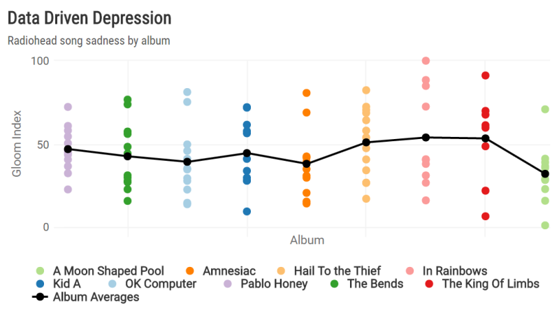
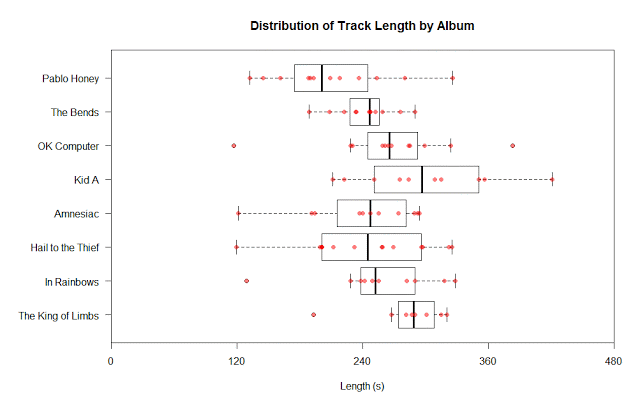
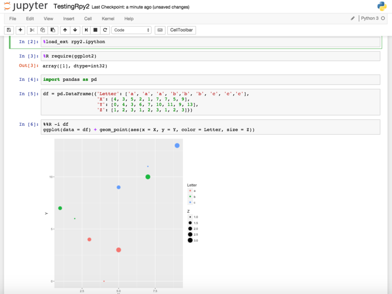

Finding Radiohead’s most depressing song, with R

# Finding Radiohead’s most depressing song, with R

February 22, 2017
By [David Smith](https://www.r-bloggers.com/author/david-smith/)

[inShare.](#)17

(This article was first published on **[Revolutions](http://blog.revolutionanalytics.com/2017/02/finding-radioheads-most-depressing-song-with-r.html)**, and kindly contributed to [R-bloggers)](https://www.r-bloggers.com/)

4.8k
SHARES

[Share](http://www.facebook.com/sharer.php?u=https%3A%2F%2Fwww.r-bloggers.com%2Ffinding-radioheads-most-depressing-song-with-r%2F)[Tweet](https://twitter.com/intent/tweet?text=Finding%20Radiohead%E2%80%99s%20most%20depressing%20song%2C%20with%20R&url=https://www.r-bloggers.com/finding-radioheads-most-depressing-song-with-r/&via=Rbloggers)

[Radiohead](https://www.radiohead.com/) is known for having some fairly maudlin songs, but of all of their tracks, which is the *most* depressing? Data scientist and R enthusiast Charlie Thompson [ranked all of their tracks according to a "gloom index"](http://rcharlie.com/2017-02-16-fitteR-happieR/), and created the following chart of gloominess for each of the band's nine studio albums. (Click for the [interactive version](http://rcharlie.com/htmlwidgets/fitterhappier/album_chart.html), crated with with [highcharter package for R](https://mran.revolutionanalytics.com/package/highcharter/), which allows you to explore individual tracks.)

If you're familiar with the albums, this looks pretty reasonable. Radiohead's debut, "Honey Pablo" was fairly poppy musically, but contained some pretty dark lyrics (especially in the break-out hit, *Creep*). Their most recent album "A Moon Shaped Pool" is a fantastic listen, but it isn't exactly going to get the party started.

The "Gloom Index" charted above is a combination of three quantities, and then scaled from 1 (Radiohead's gloomiest song, *True Love Waits*), to 100 (the cheeriest, *15 Step*).

The first quantity is Spotify's "[valence score](https://developer.spotify.com/web-api/get-audio-features/)", which Spotify describes as a "quantity describing the musical positiveness of a track". Valence scores range from 0 (songs that sound depressed or angry) to 1 (songs that are happy or euphoric). Charlie extracted the list of Radiohead's 101 singles and the valence score for each from the Spotify developer API, using the [httr package](https://mran.microsoft.com/package/httr/) for R. This is useful in its own right, but several songs have the same valence score, so Charlie also looks at song lyrics to further differentiate them.

The second quantity is the percentage of words in the lyrics that that are "sad". Charlie scraped the song lyrics from [Genius](https://genius.com/) using the [rvest package](https://mran.microsoft.com/package/rvest/), and then used the [tidytext package](https://mran.microsoft.com/package/tidytext/) to break the lyrics into words, eliminate common "stop words" like 'the' and 'a', and count the number with negative sentiment.

The third quantity is the "lyrical density" ([following a method described by Myles Harrison](http://www.everydayanalytics.ca/2013/06/radiohead-lyrics-data-visualization-and-content-analysis.html)): the number of words per second, easily calculated from the Spotify track length data and the word counts calculated in the prior step.

The three quantities are combined together to create the "gloom index" as follows:

$$ \mathrm{gloomIndex} = \frac{1-\mathrm{valence}}{2} + \frac{\mathrm{pctSad}*(1+\mathrm{lyricalDensity})}{2} $$

Roughly, this is the average of the valence score and (almost) the number of sad words per second. (I'm guessing Charlie adds 1 to the lyrical density to get the two terms to about the same scale, so that both have about equal weight.)

It would be interesting to compare the "Gloom Index" for Radiohead with that for other famously downbeat artists (say, Bon Iver or Low). You'd need to so away with scaling the Gloom Index from 1 to 100 as Charlie has done here, but the formula could easily be adapted to make a universal score. If you'd like to give it a try, all of the R code is included in Charlie's blog post, linked below.

RCharlie: [fitteR happieR](http://rcharlie.com/2017-02-16-fitteR-happieR/)

### *Related*

#### [Everything in Its Right Place: Visualization and Content Analysis of Radiohead Lyrics](https://www.r-bloggers.com/everything-in-its-right-place-visualization-and-content-analysis-of-radiohead-lyrics/)

In "R bloggers"

#### [Pipelining R and Python in Notebooks](https://www.r-bloggers.com/pipelining-r-and-python-in-notebooks/)

In "R bloggers"
[(L)](https://www.r-bloggers.com/the-kaggle-bug/)

#### [The Kaggle Bug](https://www.r-bloggers.com/the-kaggle-bug/)

In "R bloggers"
4.8k
SHARES

[Share](http://www.facebook.com/sharer.php?u=https%3A%2F%2Fwww.r-bloggers.com%2Ffinding-radioheads-most-depressing-song-with-r%2F)[Tweet](https://twitter.com/intent/tweet?text=Finding%20Radiohead%E2%80%99s%20most%20depressing%20song%2C%20with%20R&url=https://www.r-bloggers.com/finding-radioheads-most-depressing-song-with-r/&via=Rbloggers)

To **leave a comment** for the author, please follow the link and comment on their blog: **[Revolutions](http://blog.revolutionanalytics.com/2017/02/finding-radioheads-most-depressing-song-with-r.html)**.

* * *

[R-bloggers.com](https://www.r-bloggers.com/) offers **[daily e-mail updates](https://feedburner.google.com/fb/a/mailverify?uri=RBloggers)** about [R](https://www.r-project.org/) news and [tutorials](https://www.r-bloggers.com/search/tutorial) on topics such as: [Data science](https://www.r-bloggers.com/search/data%20science), [Big Data,](https://www.r-bloggers.com/search/Big%20Data)[R jobs](https://www.r-users.com/), visualization ([ggplot2](https://www.r-bloggers.com/search/ggplot2), [Boxplots](https://www.r-bloggers.com/search/boxplot), [maps](https://www.r-bloggers.com/search/map), [animation](https://www.r-bloggers.com/search/animation)), programming ([RStudio](https://www.r-bloggers.com/search/RStudio), [Sweave](https://www.r-bloggers.com/search/sweave), [LaTeX](https://www.r-bloggers.com/search/LaTeX), [SQL](https://www.r-bloggers.com/search/SQL), [Eclipse](https://www.r-bloggers.com/search/eclipse), [git](https://www.r-bloggers.com/search/git), [hadoop](https://www.r-bloggers.com/search/hadoop), [Web Scraping](https://www.r-bloggers.com/search/Web+Scraping)) statistics ([regression](https://www.r-bloggers.com/search/regression), [PCA](https://www.r-bloggers.com/search/PCA), [time series](https://www.r-bloggers.com/search/time+series), [trading](https://www.r-bloggers.com/search/trading)) and more...

* * *

* * *

If you got this far, why not ***subscribe for updates*  **from the site? Choose your flavor: [e-mail](http://feedburner.google.com/fb/a/mailverify?uri=RBloggers), [twitter](https://twitter.com/#!/rbloggers), [RSS](http://feeds.feedburner.com/RBloggers), or [facebook](http://www.facebook.com/pages/R-bloggers/191414254890)...

[inShare.](#)17