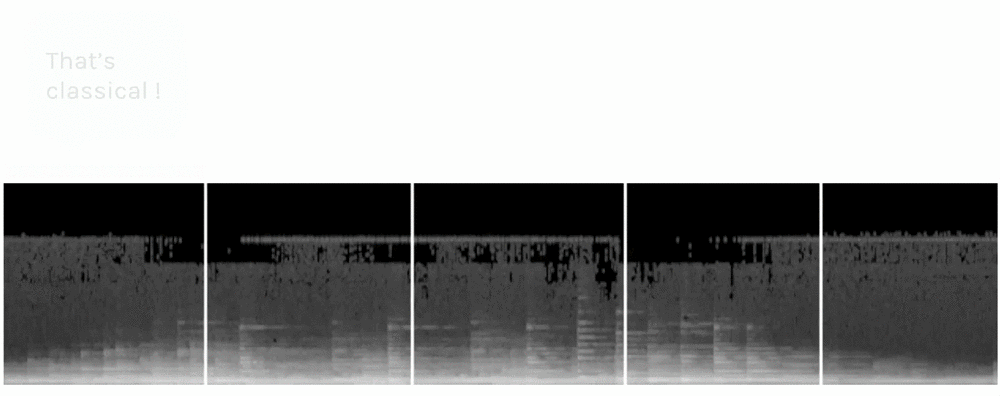
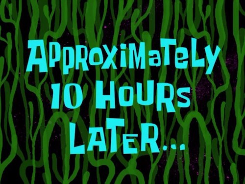
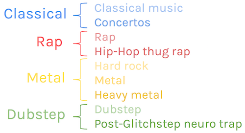
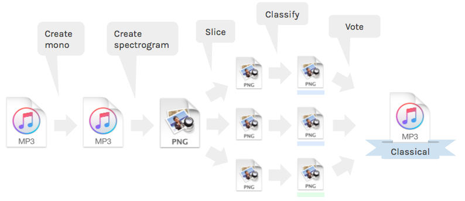

Finding the genre of a song with Deep Learning — A.I. Odyssey part. 1

# Finding the genre of a song with Deep Learning — A.I. Odyssey part. 1

A step-by-step guide to make your computer a music expert.

***> If you like Artificial Intelligence, ***> [***> subscribe to the newsletter***](http://eepurl.com/cATXvT)***>  to receive updates on articles and much more!***

One of the things we, humans, are particularly good at is classifying songs. In just a few seconds we can tell whether we’re listening to Classical music, Rap, Blues or EDM. However, as simple as this task is for us, millions of people still live with unclassifed digital music libraries.

* * *

*...*

The average library is estimated to have about 7,160 songs. If it takes 3 seconds to classify a song (either by listening or because you already know), a quick back-of-the-envelope calculation gives around 6 hours to classify them all.

[**Ultimate Guide to Leveraging NLP & Machine Learning for your Chatbot** *Code Snippets and Github Included*chatbotslife.com](https://chatbotslife.com/ultimate-guide-to-leveraging-nlp-machine-learning-for-you-chatbot-531ff2dd870c)[(L)](https://chatbotslife.com/ultimate-guide-to-leveraging-nlp-machine-learning-for-you-chatbot-531ff2dd870c)

If you add the time it takes to manually label the song, this can easily go up to 10+ hours of manual work. **No one wants to do that.**

In this post, we’ll see how we can use **Deep Learning** to help us in this labour-intensive task.

Here’s a general overview of what we will do:

- •Extract a simplified representation of each song in the library
- •Train a deep neural network to classify the songs
- •Use the classifier to fill in the mising genres of our library

#### The data

First of all, we’re going to need a dataset. For that I have started with my own iTunes library — which is already labelled due to my slightly obsessive passion for order. Although it is not as diverse, complete or even as big as other datasets we could find, it is a good start. Note that I have only used 2,000 songs as it already represents a lot of data.

#### Refining the dataset

The first observation is that there are too many genres and **subgenres**, or to put it differently, genres with too few examples. This needs to be corrected, either by removing the examples from the dataset, or by assigning them to a broader genre. We don’t really need this *Concertos* genre, *Classical* will do the trick.

Creating super genres

#### Too much information — Waaaaaay to much

Once we have a decent number of genres, with enough songs each, we can start to extract the important information from the data. A song is nothing but a very, very long series of values. The classic sampling frequency is 44100Hz — there are 44100 values stored for every second of audio, and twice as much for stereo.

This means that a **3 minute** long stereo song contains **7,938,000 samples**. That’s a lot of information, and we need to reduce this to a more manageable level if we want to do anything with it. We can start by *discarding the stereo channel *as it contains highly redundant information.

DeepMind —[ WaveNet](https://deepmind.com/blog/wavenet-generative-model-raw-audio/)

We will use *Fourier’s Transform* to convert our audio data to the frequency domain. This allows for a much more simple and compact representation of the data, which we will export as a **spectrogram**. This process will give us a PNG file containing the evolution of all the frequencies of our song through time.

The 44100Hz sampling rate we talked about earlier allows us to reconstruct frequencies up to 22050Hz — see [Nyquist-Shannon sampling theorem](https://en.wikipedia.org/wiki/Nyquist%E2%80%93Shannon_sampling_theorem#Aliasing) — but now that the frequencies are extracted, we can use a much lower resolution. Here, we’ll use 50 pixel per second (20ms per pixel), which is more than enough to be sure to use all the information we need.

**NB:** If you know a genre characterized by ~20ms frequency variations, you got me.

Here’s what our song looks like after the process (12.8s sample shown here).

Spectrogram of an extract of the song

**Time** is on the x axis, and **frequency** on the y axis. The highest frequencies are at the top and the lowest at the bottom. The scaled amplitude of the frequency is shown in greyscale, with white being the maximum and black the minimum.

I have used use a spectrogram with 128 frequency levels, because it contains all the relevant information of the song — we can easily distinguish different notes/frequencies.

[**An augmentation based deep neural network approach to learn human driving behavior** *Overview*chatbotslife.com](https://chatbotslife.com/using-augmentation-to-mimic-human-driving-496b569760a9)[(L)](https://chatbotslife.com/using-augmentation-to-mimic-human-driving-496b569760a9)

#### Further processing

The next thing we have to do is to deal with the length of the songs. There are two approaches for this problem. The first one would be to use a *recurrent neural network* with wich we would feed each column of the image in order. Instead, I have chosen to exploit even further the fact that humans are able to classify songs with **short extracts**.

> If we can classify songs by ear in under 3 seconds, why couldn’t machines do the same ?

We can create *fixed length* slices of the spectrogram, and consider them as independent samples representing the genre. We can use **square slices **for convenience, which means that we will cut down the spectrogram into 128x128 pixel slices. This represents 2.56s worth of data in each slice.

Sliced spectrogram

At this point, we could use **data augmentation** to expand the dataset even more (we won’t here because we aready have a lot of data). We could for instance add random noise to the images, or slightly stretch them horizontally and then crop them.

However, we have to make sure that we do not break the patterns of the data. We can’t *rotate* the images, nor *flip* them horizontally because sounds are not symmetrical.

*E.g,* see those *white fading lines*? These are decaying sounds which cannot be reversed.

Decaying sound

#### Choice of the model — Let’s build a classifier!

After we have sliced all our songs into square spectral images, we have a dataset containing tens of thousands of samples for each genre. We can now train a **Deep Convolutional Neural Network** to classify these samples. For this purpose, I have used Tensorflow’s wrapper TFLearn.

Convolutional neural network

#### Implementation details

- •*Dataset split: T*raining (70%), validation (20%), testing (10%)
- •*Model*: Convolutional neural network.
- •*Layers*: Kernels of size 2x2 with stride of 2
- •*Optimizer*: *RMSProp.*
- •*Activation function:* ELU (Exponential Linear Unit), because of the [performance it has shown when compared to ReLUs](https://arxiv.org/pdf/1511.07289.pdf)
- •*Initialization*: Xavier for the weights matrices in all layers.
- •*Regularization*: Dropout with probability 0.5

#### Results — Does this thing work?

With 2,000 songs split between 6 genres — *Hardcore, Dubstep, Electro, Classical, Soundtrack and Rap*, and using more than 12,000 128x128 spectrogram slices in total, the model reached ***90% accuracy*** on the validation set. This is pretty good, especially considering that we are processing the songs tiny bits at a time. Note that **this is not the final accuracy **we’ll have on classifying whole songs (it will be even better). We’re only talking *slices* here.

[**INTRODUCTION TO DEEP LEARNING ON SOCIAL NETWORKS: “HOW TO LEARN EVEN MORE ABOUT YOUR PERSONAL LIFE…** *POSTED BY CRISTIAN RANDIERI IN TECHNOLOGY NEWS*chatbotslife.com](https://chatbotslife.com/introduction-to-deep-learning-on-social-networks-how-to-learn-even-more-about-your-personal-life-cd1da6d67770)[(L)](https://chatbotslife.com/introduction-to-deep-learning-on-social-networks-how-to-learn-even-more-about-your-personal-life-cd1da6d67770)

#### Time to classify some files!

So far, we have converted our songs from stereo to mono and created a spectrogram, which we sliced into small bits. We then used these slices to train a deep neural network. We can now use the model to classify a new song that we have *never seen*.

We start off by generating the spectrogram the same way we did with the training data. Because of the slicing, we cannot predict the class of the song in one go. We have to slice the new song, and then put together the predicted classes for all the slices.

To do that, we will use a **voting system**. Each sample of the track will “vote” for a genre, and we choose the genre with the most votes. This will increase our accuracy as we’ll get rid of many classifications errors with this ensemble learning-*esque* method.

**NB:** a 3 minute long track has about 70 slices.

Voting system

With this pipeline, we can now classify the unlabelled songs from our library. We could simply run the voting system on all the songs for which we need a genre, and take the word of the classifier. This would give good results but we might want to improve our voting system.

Full classification pipeline

#### A better voting system

The last layer of the classifier we have built is a **softmax*** layer.* This means that it doesn’t really output the detected genre, but rather the probabilities of each. This is what we call the classification **confidence**.

Classification confidence

We can use this to improve our voting system. For instance, we could reject votes from slices with low confidence. If there is no clear winner, we reject the vote.

> It’s better to say “I don’t know” than to give a answer we’re not sure of.

Classification rejected because of the low confidence

Similarly, we could leave unlabelled the songs for which no genre received more than a certain fraction -*70%?- *of the votes. This way, we will avoid mislabeling songs, which we can still label later by hand.

Track left unlabeled because of low voting system confidence

### Conclusions

In this post, we have seen how we could extract important information from redundant and high dimensional data structure — *tracks*. We have taken advantage of short patterns in the data which allowed us to classify 2.56 second long extracts. Finally, we have used our model to fill in the blanks in a digital library.

***> If you like Artificial Intelligence, ***> [***> subscribe to the newsletter***](http://eepurl.com/cATXvT)***>  to receive updates on articles and much more!***

***(Psst! ***[***part. 2***](https://medium.com/@juliendespois/talk-to-you-computer-with-you-eyes-and-deep-learning-a-i-odyssey-part-2-7d3405ab8be1#.j6htbas27)*** is out!)***

You can play with the code here:

[**despoisj/DeepAudioClassification** *DeepAudioClassification - Finding the genre of a song with Deep Learning*github.com](https://github.com/despoisj/DeepAudioClassification)[(L)](https://github.com/despoisj/DeepAudioClassification)

If you want to go further on audio classification, there are other approaches which yield impressive results, such as [Shazam’s fingerprinting technique](https://www.toptal.com/algorithms/shazam-it-music-processing-fingerprinting-and-recognition) or [dilated convolutions](http://blog.themusio.com/2016/11/04/dilated-causal-convolutions-for-audio-and-text-generation/).

Thanks for reading this post, stay tuned for more !

