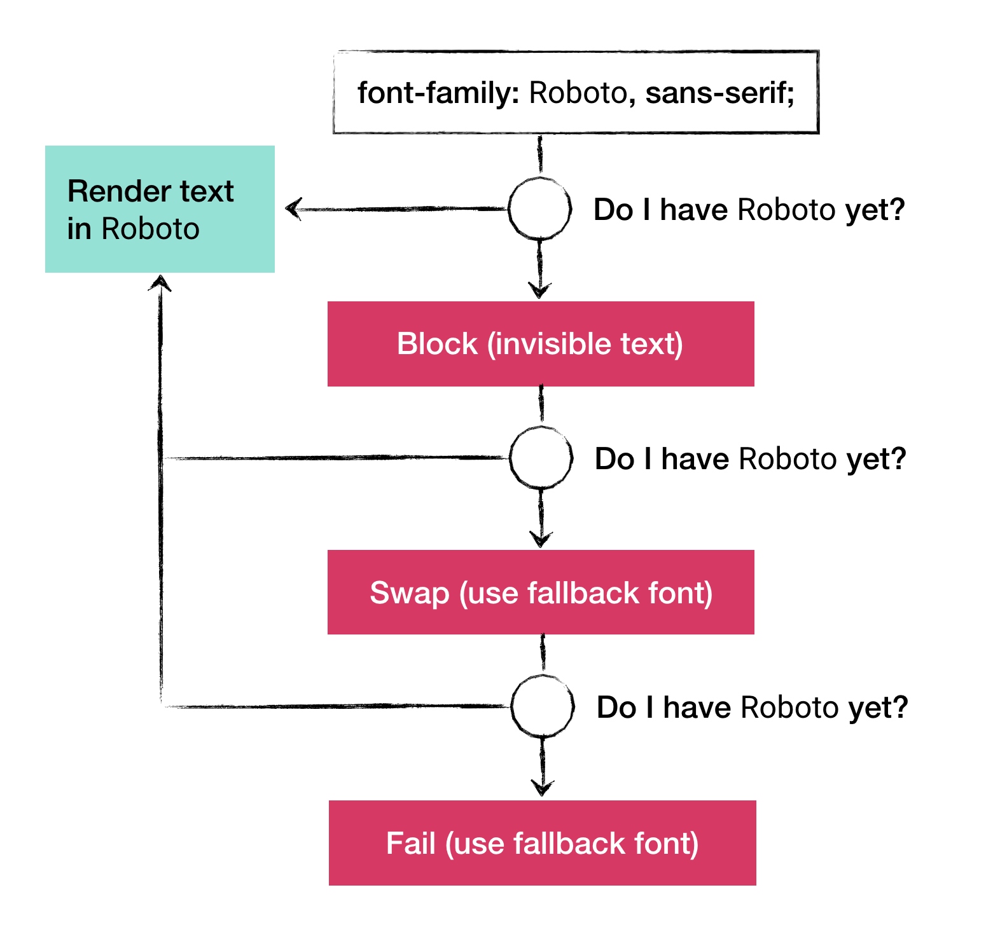
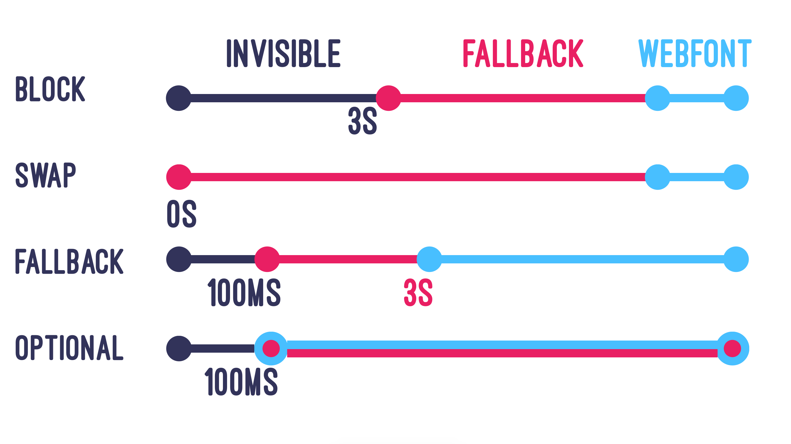

Font-display playground

#  Font-display

This is a small explainer that I built for [a talk](https://vimeo.com/241111413) on web fonts and performance.

Before we talk about what `font-display` is, let's talk about the lifetime of a web font. For a super detailed explanation of where web fonts fit in the browser rendering process, Ilya Grigorik has an [amazing blog post](https://developers.google.com/web/fundamentals/performance/optimizing-content-efficiency/webfont-optimization#webfonts_and_the_critical_rendering_path) on web font optimization. But, if we're just trying to understand the basics, there are basically three parts to it: 

During the **block** period, the browser renders your text in an invisible font. This is why on a lot of webfont-heavy websites, during the first load of the page you will see no text or worse, phantom underlines.

During the **swap** period, the browser renders your text in the fallback font (in the example in the diagram, that would be the default `serif` font.

The **failure** period means no font has been found, in which case the browser renders your text in the fallback font, as above.

* * *

With the new `font-display` attribute, you can control the length of each of these periods, and what happens when one of them fails. There are 4 different values: `block`, `swap`, `fallback` and `optional`. There's also `auto`, which usually ends up being the same as `block`. These values are supported on all modern browsers (IE not included), but double check the [compatibility table](https://developer.mozilla.org/en-US/docs/Web/CSS/@font-face/font-display#Browser_compatibility) for the latest!

The font display is controlled per font-face:

	  @font-face {
	      font-family: 'my-font';
	      font-display: optional;
	      src: url(my-font.woff2) format('woff2');
	  }

 ** Update** (May 14, 2019): Google Fonts now lets you control font loading using the `display` query parameter:

	  <link href="https://fonts.googleapis.com/css?family=Roboto&display=optional" rel="stylesheet">

## font-display: block

The text blocks (is invisible) for a short period*. Then, if the custom font hasn't been downloaded yet, the browser swaps (renders the text in the fallback font), for however long it takes the custom font to be downloaded, and then re-renders the text in the custom font. You get a **FOIT** (flash of invisible text).

*The length of the block period [depends](https://tabatkins.github.io/specs/css-font-display/#intro) on which browser you're using. Chrome, Firefox and ([recently](https://webkit.org/blog/6643/improved-font-loading/)) Safari use 3s. IE uses 0s (effectively having no block period), and older Safari used no timeout, effectively having an inifinite block period.

## font-display: swap

There is no block period (so no invisible text), and the text is shown immediately in the fallback font until the custom font loads, then it's swapped with the custom font. You get a **FOUT** (flash of unstyled text).

## font-display: fallback

This is somewhere in between block and swap. The text is invisible for a short period of time (100ms). Then if the custom font hasn't downloaded, the text is shown in a fallback font (for about 3s), then swapped after the custom font loads.

## font-display: optional

This behaves just like fallback, only the browser can decide to not use the custom font at all, based on the user's connection speed (if you're on a slow 3G or less, it will take forever to download the custom font and then swapping to it will be too late and extremely annoying)

Side-by-side, that looks like this: 

##  Demo

This demo simulates a slow connection speed. The font resource is returned after a 4s delay (so after the block period would normally end), so that you can see what happens for each of the options.

0.0
s

 **Very slow** font (4s server delay)

 **Medium slow** font (2s server delay)

 **Fast** font (0s server delay)

##  So, what should I do?

This depends a lot on *how* you are using your webfont, and whether rendering the text in a fallback font makes sense. For example, if you're rendering the main body text on a site, you should use `font-display:optional`. On browsers that implement it (all modern browsers at the time of updating this article in 2019) the experience will be much nicer: your users will get fast content, and if the web font download takes too long, they won't get a page relayout halfway through reading your article.

If you're using a web font for icons, there is no acceptable fallback font you can render these icons in (unless you're using emoji or something), so your only option is to completely block until the font is ready, with `font-display:block`.

* * *

Happy fonting! ❤️, [monica](https://twitter.com/notwaldorf)