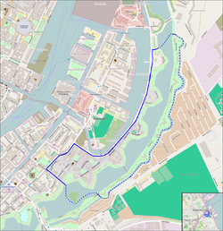
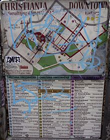
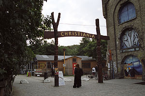
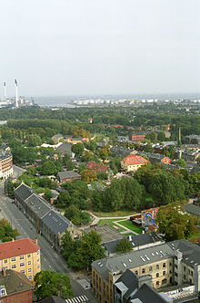
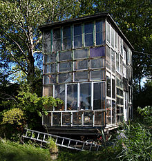
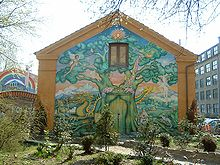
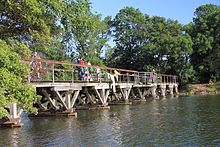
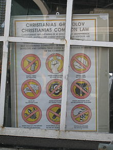
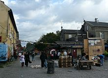
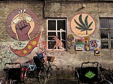

Freetown Christiania - Wikipedia

# Freetown Christiania

From Wikipedia, the free encyclopedia

Jump to:[navigation](https://en.wikipedia.org/wiki/Freetown_Christiania#mw-head),[search](https://en.wikipedia.org/wiki/Freetown_Christiania#p-search)

| Freetown Christiania *Fristaden Christiania* |
| --- |
|  Flag |
| **Anthem: **I kan ikke slå os ihjel *You cannot kill us* |
| .png) |
| Location | [Copenhagen](https://en.wikipedia.org/wiki/Copenhagen), [Denmark](https://en.wikipedia.org/wiki/Denmark) |
| Official languages | [Danish](https://en.wikipedia.org/wiki/Danish_language) |
| Government | [Anarchist community](https://en.wikipedia.org/wiki/Anarchism) |
| Establishment |
| • Declared | 1971 |
| Area |
| • Total | 0.34 km2 (0.13 sq mi) |
| Membership | 1,000 Approx. |
| Currency | [Danish Krone](https://en.wikipedia.org/wiki/Danish_Krone) (de facto), Løn (de jure) |
| Time zone | [UTC+1](https://en.wikipedia.org/wiki/UTC%2B1) |

**Christiania**, also known as **Freetown Christiania** ([Danish](https://en.wikipedia.org/wiki/Danish_language): *Fristaden Christiania* or *Staden*), is a self-proclaimed [autonomous](https://en.wikipedia.org/wiki/Autonomous) neighborhood of about 850 residents, covering 34 hectares (84 acres) in the borough of [Christianshavn](https://en.wikipedia.org/wiki/Christianshavn) in the [Danish](https://en.wikipedia.org/wiki/Denmark) capital [Copenhagen](https://en.wikipedia.org/wiki/Copenhagen).[[1]](https://en.wikipedia.org/wiki/Freetown_Christiania#cite_note-1) It was temporarily closed by residents in April 2011 while discussions continued with the Danish government about its future, but then re-opened to the public.[[2]](https://en.wikipedia.org/wiki/Freetown_Christiania#cite_note-2)

Christiania has been a source of controversy since its creation in a squatted military area in 1971. Its [cannabis](https://en.wikipedia.org/wiki/Cannabis_in_Denmark) trade was tolerated by authorities until 2004. In the years following 2004, measures for normalizing the legal status of the community led to conflicts, police raids and negotiations.

## Contents

 [[hide]()]

- [1  History](https://en.wikipedia.org/wiki/Freetown_Christiania#History)
    - [1.1  Barracks and ramparts](https://en.wikipedia.org/wiki/Freetown_Christiania#Barracks_and_ramparts)
    - [1.2  Building and area protection](https://en.wikipedia.org/wiki/Freetown_Christiania#Building_and_area_protection)
    - [1.3  Founding of Christiania](https://en.wikipedia.org/wiki/Freetown_Christiania#Founding_of_Christiania)
    - [1.4  The community](https://en.wikipedia.org/wiki/Freetown_Christiania#The_community)
    - [1.5  Riots over demolition of house](https://en.wikipedia.org/wiki/Freetown_Christiania#Riots_over_demolition_of_house)
    - [1.6  2005 shooting and murder](https://en.wikipedia.org/wiki/Freetown_Christiania#2005_shooting_and_murder)
    - [1.7  Cars](https://en.wikipedia.org/wiki/Freetown_Christiania#Cars)
    - [1.8  Gay House](https://en.wikipedia.org/wiki/Freetown_Christiania#Gay_House)
    - [1.9  Grenade attack](https://en.wikipedia.org/wiki/Freetown_Christiania#Grenade_attack)
    - [1.10  2016 shooting](https://en.wikipedia.org/wiki/Freetown_Christiania#2016_shooting)
- [2  Drugs](https://en.wikipedia.org/wiki/Freetown_Christiania#Drugs)
    - [2.1  Eviction of 'hard drugs'](https://en.wikipedia.org/wiki/Freetown_Christiania#Eviction_of_.27hard_drugs.27)
    - [2.2  Biker gang eviction](https://en.wikipedia.org/wiki/Freetown_Christiania#Biker_gang_eviction)
    - [2.3  Action against open drug selling](https://en.wikipedia.org/wiki/Freetown_Christiania#Action_against_open_drug_selling)
- [3  Further developments](https://en.wikipedia.org/wiki/Freetown_Christiania#Further_developments)
    - [3.1  Governmental normalization measures](https://en.wikipedia.org/wiki/Freetown_Christiania#Governmental_normalization_measures)
    - [3.2  Quotes from politicians](https://en.wikipedia.org/wiki/Freetown_Christiania#Quotes_from_politicians)
    - [3.3  Architectural competition](https://en.wikipedia.org/wiki/Freetown_Christiania#Architectural_competition)
    - [3.4  Christiania's development plan](https://en.wikipedia.org/wiki/Freetown_Christiania#Christiania.27s_development_plan)
- [4  The flag](https://en.wikipedia.org/wiki/Freetown_Christiania#The_flag)
- [5  In fiction and popular culture](https://en.wikipedia.org/wiki/Freetown_Christiania#In_fiction_and_popular_culture)
- [6  Notable residents](https://en.wikipedia.org/wiki/Freetown_Christiania#Notable_residents)
- [7  See also](https://en.wikipedia.org/wiki/Freetown_Christiania#See_also)
- [8  References](https://en.wikipedia.org/wiki/Freetown_Christiania#References)
- [9  External links](https://en.wikipedia.org/wiki/Freetown_Christiania#External_links)

## History[[edit](https://en.wikipedia.org/w/index.php?title=Freetown_Christiania&action=edit&section=1)]

### Barracks and ramparts[[edit](https://en.wikipedia.org/w/index.php?title=Freetown_Christiania&action=edit&section=2)]

[(L)](https://en.wikipedia.org/wiki/File:Christiania_Downtown_Map.jpg)
Christiania Downtown Map

[(L)](https://en.wikipedia.org/wiki/File:Entr%C3%A9e_de_Christiania.jpg)
Entrance to Christiania

The area of Christiania consists of the former military [barracks](https://en.wikipedia.org/wiki/Barracks) of Bådsmandsstræde and parts of the city [ramparts](https://en.wikipedia.org/wiki/Defensive_wall). The ramparts and the borough of [Christianshavn](https://en.wikipedia.org/wiki/Christianshavn) (then a separate city) were established in 1617 by King [Christian IV](https://en.wikipedia.org/wiki/Christian_IV_of_Denmark) by reclaiming the low beaches and islets between Copenhagen and [Amager](https://en.wikipedia.org/wiki/Amager). After the [siege of Copenhagen](https://en.wikipedia.org/wiki/Siege_of_Copenhagen) during wars with Sweden, the ramparts were reinforced during 1682 to 1692 under [Christian V](https://en.wikipedia.org/wiki/Christian_V_of_Denmark) to form a complete defence ring. The western ramparts of Copenhagen were demolished during the 19th century, but those of Christianshavn were allowed to remain. They are today considered among the finest surviving 17th century defence works in the world.[[3]](https://en.wikipedia.org/wiki/Freetown_Christiania#cite_note-3)

The barracks of Bådsmandsstræde (*Bådsmandsstrædes Kaserne*) housed the [Royal Artillery Regiment](https://en.wikipedia.org/wiki/Kongens_Artilleriregiment), the [Army Materiel Command](https://en.wikipedia.org/wiki/Army_Materiel_Command_(Denmark)) and ammunition laboratories and depots. Less used after World War II, the barracks were abandoned between 1967 and 1971.

The adjacent area to the north, [Holmen](https://en.wikipedia.org/wiki/Holmen_naval_base), was Denmark's main naval base until the 1990s. It is an area in development, home to the new [Copenhagen Opera House](https://en.wikipedia.org/wiki/Copenhagen_Opera_House) (not to be confused with the first and still existing venue called "Operaen", a concert venue in Christiania) and schools. An area further north is still used by the [navy](https://en.wikipedia.org/wiki/Navy), but open to the public during daytime.

The outermost defence line, Enveloppen, has been renamed *Dyssen* in Christiania language (except for the southernmost tip of it which was not annexed by Christiania). It is connected to central Christiania by a bridge across the main moat or can be reached by the path beginning at Christmas Møllers Plads. Four gunpowder storehouses line the [redans](https://en.wikipedia.org/wiki/Redan). They were built 1779-80 to replace a storage in central Copenhagen, at [Østerport](https://en.wikipedia.org/wiki/%C3%98sterport), which exploded infamously in 1770, killing 50 people. The buildings are renamed *Aircondition*, *Autogena*, *Fakirskolen* (The Fakir School) and *Kosmiske Blomst* (Cosmic Flower) and have, although protected, been slightly altered from their historical state.[[4]](https://en.wikipedia.org/wiki/Freetown_Christiania#cite_note-4)

[(L)](https://en.wikipedia.org/wiki/File:Christiania_depuis_Notre_Sauveur.jpg)

The last Danish [execution](https://en.wikipedia.org/wiki/Execution) site, active from 1946 to 1950, can still be seen on the Second [Redan](https://en.wikipedia.org/wiki/Redan) close to the building called *Aircondition*.[[5]](https://en.wikipedia.org/wiki/Freetown_Christiania#cite_note-5) The wooden execution shed is gone, but the concrete foundation and a drain for the blood remain just next to the path. In total, 29 [World War II criminals](https://en.wikipedia.org/wiki/Capital_punishment_in_Denmark#The_post_1945_purges) were executed on the site. The last was Ib Birkedal, a high-level Danish [Gestapo](https://en.wikipedia.org/wiki/Gestapo) collaborator, on 20 July 1950.

### Building and area protection[[edit](https://en.wikipedia.org/w/index.php?title=Freetown_Christiania&action=edit&section=3)]

[(L)](https://en.wikipedia.org/wiki/File:Christiania,_glass_house,_august_2007.jpg)

Glass house in Freetown Christiania, one of the many idiosyncratic constructions exemplifying modern "architecture without architects".

In 2007, the National Heritage Agency proposed protection status for some of the ancient military buildings, now in Christiania. These are:

- *Den grå hal* ('The grey hall'), formerly a riding house with a unique Bohlendach roof construction, now Christiania's largest concert venue
- *Den grønne hal* ('The green hall'), originally a smaller riding house
- *Mælkebøtten* ('The dandelion')
- The Commander's house, a half-timbered building
- The 17th and 18th century powder magazines on the bastions.

Some of the historic buildings have been altered somewhat after Christiania's takeover.[[6]](https://en.wikipedia.org/wiki/Freetown_Christiania#cite_note-6)

### Founding of Christiania[[edit](https://en.wikipedia.org/w/index.php?title=Freetown_Christiania&action=edit&section=4)]

After the military moved out, the area was only guarded by a few [watchmen](https://en.wikipedia.org/wiki/Security_guard) and there was sporadic [trespassing](https://en.wikipedia.org/wiki/Trespassing) of [homeless](https://en.wikipedia.org/wiki/Homeless) people using the empty buildings. On 4 September 1971, inhabitants of the surrounding neighborhood broke down the fence to take over parts of the unused area as a playground for their children.

Although the takeover was not necessarily organized in the beginning, some claim this happened as a protest against the Danish government. At the time there was a lack of affordable housing in Copenhagen.

On 26 September 1971, Christiania was declared open by [Jacob Ludvigsen](https://en.wikipedia.org/w/index.php?title=Jacob_Ludvigsen&action=edit&redlink=1), a well-known [provo](https://en.wikipedia.org/wiki/Provo_(movement)) and journalist who published a magazine called *Hovedbladet* ('The main paper'), which was intended for and successfully distributed to mostly young people. In the paper, Ludvigsen wrote an article in which he and five others went on exploration into what he termed 'The Forbidden City of the Military'. The article widely announced the proclamation of the free town, and among other things he wrote the following under the headline *Civilians conquered the 'forbidden city' of the military*:[[7]](https://en.wikipedia.org/wiki/Freetown_Christiania#cite_note-7)

*> Christiania is the land of the settlers. It is the so far biggest opportunity to build up a society from scratch - while nevertheless still incorporating the remaining constructions. Own electricity plant, a bath-house, a giant athletics building, where all the seekers of peace could have their grand meditation - and yoga center. Halls where theater groups can feel at home. Buildings for the stoners who are too paranoid and weak to participate in the race...Yes for those who feel the beating of the pioneer heart there can be no doubt as to the purpose of Christiania. It is the part of the city which has been kept secret to us - but no more.*> [*> [> citation needed](https://en.wikipedia.org/wiki/Wikipedia:Citation_needed)*> ]

Ludvigsen was co-author of Christiania's [mission statement](https://en.wikipedia.org/wiki/Mission_statement), dating from 1971, which offers the following:

*> The objective of Christiania is to create a self-governing society whereby each and every individual holds themselves responsible over the wellbeing of the entire community. Our society is to be economically self-sustaining and, as such, our aspiration is to be steadfast in our conviction that psychological and physical destitution can be averted.*

The spirit of Christiania quickly developed into one of [the hippie movement](https://en.wikipedia.org/wiki/Hippie), [the squatter movement](https://en.wikipedia.org/wiki/Squatter), [collectivism](https://en.wikipedia.org/wiki/Collectivism) and [anarchism](https://en.wikipedia.org/wiki/Anarchism), in contrast to the site's previous military use.

The 1976 protest song *I kan ikke slå os ihjel* (translated: "You cannot kill us"), written by Tom Lunden of [flower power](https://en.wikipedia.org/wiki/Flower_power) rock group [Bifrost](https://en.wikipedia.org/wiki/Bifrost_(band)), became the unofficial anthem of Christiania.[[8]](https://en.wikipedia.org/wiki/Freetown_Christiania#cite_note-8)

### The community[[edit](https://en.wikipedia.org/w/index.php?title=Freetown_Christiania&action=edit&section=5)]

[(L)](https://en.wikipedia.org/wiki/File:Copenhagen_entrance_christiania.jpg)
Mural in Christiania

[(L)](https://en.wikipedia.org/wiki/File:Christiania_2015_01.JPG)

The "[Dyssebroen](https://en.wikipedia.org/wiki/Dyssebroen)" bridge, connecting Christiania's main portion ([Christianshavn Side](https://en.wikipedia.org/wiki/Christianshavn)) to its more 'rural' [Amager Side](https://en.wikipedia.org/wiki/Amager) backdrop across [Stadsgraven](https://en.wikipedia.org/wiki/Stadsgraven) canal

[Meditation](https://en.wikipedia.org/wiki/Meditation) and [yoga](https://en.wikipedia.org/wiki/Yoga) have always been popular among the Christianites, and for many years Christiania had their own internationally acclaimed theater group Solvognen, who, beyond their theater performances, also staged many happenings in Copenhagen and even throughout Sweden. Ludvigsen had always talked of the acceptance of drug-addicts who could no longer cope with regular society, and the spirit of that belief has still not diminished, even though many problems sprouted due to drug traffic and use (mostly of 'hard drugs', however, which are not tolerated in Christiania). These addicts enter and remain in Christiania and are considered just as integral to the Freetown ethics as the entrepreneurs. For this reason many Danes have seen Christiania as a successful social experiment. However, for years the legal status of the region has been in a limbo due to different Danish governments attempting to remove the Christianites. Such attempts at removal have all been unsuccessful so far.

Christiania is considered to be the fourth largest [tourist attraction](https://en.wikipedia.org/wiki/Tourist_attraction) in Copenhagen (and it has half a million visitors annually);[[9]](https://en.wikipedia.org/wiki/Freetown_Christiania#cite_note-9) and abroad it is a well-known "brand" for the supposedly progressive and liberated Danish lifestyle. Many Danish businesses and organizations also use Christiania as a show place for their foreign friends and guests.[*[citation needed](https://en.wikipedia.org/wiki/Wikipedia:Citation_needed)*] The purpose is to show something Danish that cannot be found anywhere else in the world.

The people in Christiania have developed their own set of rules, independent of the Danish government. The rules forbid stealing, violence, guns, knives, bulletproof vests, hard drugs and [bikers' colors](https://en.wikipedia.org/wiki/Colors_(motorcycling)).[[10]](https://en.wikipedia.org/wiki/Freetown_Christiania#cite_note-10)[*[self-published source](https://en.wikipedia.org/wiki/Wikipedia:Verifiability#Self-published_sources)*]

Famous for its main drag, known as *Pusher Street*, where [hash](https://en.wikipedia.org/wiki/Hashish) and [skunk weed](https://en.wikipedia.org/wiki/Skunk_(cannabis)) were sold openly from permanent stands until 2004, it nevertheless does have rules forbidding 'hard drugs', such as [cocaine](https://en.wikipedia.org/wiki/Cocaine), [amphetamine](https://en.wikipedia.org/wiki/Amphetamine), [ecstasy](https://en.wikipedia.org/wiki/Methylenedioxymethamphetamine) and [heroin](https://en.wikipedia.org/wiki/Heroin). The hash commerce is controversial, but since the rules require a consensus they cannot be removed unless everybody agrees. Legalization of cannabis is one of the ideas of many of the citizens in Christiania. The region negotiated an arrangement with the Danish defense ministry (which still owns the land) in 1995. Since 1994, residents have paid taxes and fees for water, electricity, trash disposal, etc.

After bitter negotiations that temporarily resulted in the area being sealed off to the public, in June 2011, the residents of Christiania agreed to collectively set up a fund to formally purchase the land at below market prices.[[11]](https://en.wikipedia.org/wiki/Freetown_Christiania#cite_note-11) The community made its first payment in July 2012, officially becoming legal landowners.[[12]](https://en.wikipedia.org/wiki/Freetown_Christiania#cite_note-12)

### Riots over demolition of house[[edit](https://en.wikipedia.org/w/index.php?title=Freetown_Christiania&action=edit&section=6)]

On May 14, 2007, workers from the governmental Forest and Nature Agency, accompanied by police, entered Christiania to demolish leftovers of the small, abandoned building of *Cigarkassen* ('the cigar box'). They were met by angry and frightened Christianites, fearing that the police also intended to demolish other houses. The residents built roadblocks, but the police eventually entered the Freetown en masse and were met by resistance. Residents threw stones and shot fireworks at police vehicles. They also built barricades in the street outside Christiania's gate. The police used [tear gas](https://en.wikipedia.org/wiki/Tear_gas) on the residents and a number of arrests were made.[[13]](https://en.wikipedia.org/wiki/Freetown_Christiania#cite_note-13) One activist sneaked behind the police commander and poured a bucket of urine and feces upon him before being immediately arrested.[[14]](https://en.wikipedia.org/wiki/Freetown_Christiania#cite_note-14) The trouble continued into the early morning hours. In all, over 50 activists from both Christiania and outside were arrested. Prosecutors demanded they be imprisoned on the basis that they might otherwise participate in further disturbances in Copenhagen (which prosecutors claimed was "in a state of rebellion").[[15]](https://en.wikipedia.org/wiki/Freetown_Christiania#cite_note-15)

### 2005 shooting and murder[[edit](https://en.wikipedia.org/w/index.php?title=Freetown_Christiania&action=edit&section=7)]

On April 24, 2005, a 26-year-old Christiania resident was killed and three other residents injured in a violent gang assault on *Pusher Street*. The reason for this was a feud over the cannabis market of Copenhagen.

After the open cannabis trade was ended in Christiania the year before, criminal circles outside Christiania were eager to take over the market. Those responsible for the shooting were one such gang residing in [Nørrebro](https://en.wikipedia.org/wiki/N%C3%B8rrebro), a northwestern borough of the city. They had repeatedly asked the Christiania pushers to allow them on their market and had repeatedly been turned down. On April 23, 2005, this stalemate escalated violently. The pushers of Christiania discovered that a member of the outside gang had infiltrated their organisation by dating a female pusher. He was exposed and just barely escaped - two shots were fired at him. The next day two cars pulled up outside Christiania and 6–8 masked men with [automatic weapons](https://en.wikipedia.org/wiki/Automatic_weapon) got out and headed for *Pusher Street*. When they arrived they fired at least 35 rounds indiscriminately toward the crowd, killing one Christianite and injuring three others.

Some saw this tragic incident as a sign that the future survival of the community was dubious due to the risk of violence stemming from the cannabis market.[[16]](https://en.wikipedia.org/wiki/Freetown_Christiania#cite_note-16) Others blamed the incident on the fragmentation of the Copenhagen cannabis market and its expansion to the rest of the city, brought about by the measures of the [Anders Fogh Rasmussen](https://en.wikipedia.org/wiki/Anders_Fogh_Rasmussen) government. *See below: [Drugs](https://en.wikipedia.org/wiki/Freetown_Christiania#Drugs)*

[(L)](https://en.wikipedia.org/wiki/File:Chritianias_common_law.jpg)
Christiania common law; the nine rules.

### Cars[[edit](https://en.wikipedia.org/w/index.php?title=Freetown_Christiania&action=edit&section=8)]

Within Christiania itself no private cars are allowed. However, a total of 132 cars are owned by residents and need to be parked on the streets surrounding the Freetown.[[17]](https://en.wikipedia.org/wiki/Freetown_Christiania#cite_note-17) After negotiating with city authorities, Christiania has agreed to establish parking areas for residents' own cars on its territory. As of 2005, parking space for only 14 cars had been established within the area.[[18]](https://en.wikipedia.org/wiki/Freetown_Christiania#cite_note-18)

Before the city council elections of November 2001, residents in one of Christiania's sections proposed a municipal kindergarten just outside Christiania should be torn down and moved some hundred meters away, the area being turned into a parking lot. The proposal was criticized by other Christiania residents and citizens in the borough, but proponents claimed the wooden kindergarten buildings were outdated anyway and the parking space issue needed to be solved before Christiania itself would turn into an area where cars were widely parked. It has also been claimed that taxis and police vehicles add to the traffic problems.[[19]](https://en.wikipedia.org/wiki/Freetown_Christiania#cite_note-19)

As of 2008 Christiania established a road block robot in the vehicle entrance of Christiania next to The Gray Hall (Grå Hal) to prevent cannabis customers and other visitors from driving into Christiania and park their cars in its narrow streets. Only cargo transport is allowed through these gates. A downside to this was that it moved the problem to another part of Christiania further up the road where the residents now have blocked this entrance entirely until another road block robot will be installed. There are very few entrances to Christiania. With the two entrances blocked by road block robots the Christianites believe they can rid themselves from the problem of harassing traffic.

### Gay House[[edit](https://en.wikipedia.org/w/index.php?title=Freetown_Christiania&action=edit&section=9)]

Since the 1970s, the Gay House (Bøssehuset), one of Christiania's autonomous institutions, had been a center for gay activism, parties, and theatre. The humorous and artistically high-ranking variety-style shows still have fame among Copenhagen homosexuals.[*[citation needed](https://en.wikipedia.org/wiki/Wikipedia:Citation_needed)*]

In 2002, a group of young gay performers and activists, [Dunst](https://en.wikipedia.org/wiki/Dunst_(queer_network_in_Copenhagen)), were invited to take over the house so it could remain a center for gay activity. Dunst introduced democratic management and established open workshops for photography, art, music, dance, video etc. They also arranged three 'Save Christiania' nights, a cabaret show and three support parties in order to be able to pay down some of the Gay House's debt to Christiania. According to Dunst, however, neighbours would never readily accept them and the newcomers were accused of not understanding "the Christiania lifestyle". Dunst claimed they received verbal abuse, threatening letters, and even in one instance, had a baseball bat brandished against them. Some disliked Dunst's loud parties and their contemporary electro-punk style music being described as [techno](https://en.wikipedia.org/wiki/Techno). After nine months, they were asked to leave Christiania.

In 2004, Dunst participated in 'Christiania Distortion', an event supportive of Christiania. As they could not make use of the Gay House, Dunst's part of the event took place in a bus circling around Christiania.[[20]](https://en.wikipedia.org/wiki/Freetown_Christiania#cite_note-20)[[21]](https://en.wikipedia.org/wiki/Freetown_Christiania#cite_note-21)

### Grenade attack[[edit](https://en.wikipedia.org/w/index.php?title=Freetown_Christiania&action=edit&section=10)]

On 24 April 2009, a 22-year-old man had his jaw blown off by a [hand grenade](https://en.wikipedia.org/wiki/Hand_grenade) thrown into the crowds seated at Cafe Nemoland.[[22]](https://en.wikipedia.org/wiki/Freetown_Christiania#cite_note-grenade_cph_post-22) Four[[22]](https://en.wikipedia.org/wiki/Freetown_Christiania#cite_note-grenade_cph_post-22) or five[[23]](https://en.wikipedia.org/wiki/Freetown_Christiania#cite_note-grenade_politiken-23) others had minor back and leg injuries. A perpetrator has not been found.

### 2016 shooting[[edit](https://en.wikipedia.org/w/index.php?title=Freetown_Christiania&action=edit&section=11)]

On 31 August 2016, a person believed to be carrying the day's earnings from cannabis sales suddenly pulled a gun during a routine arrest and shot two police officers and a civilian.[[24]](https://en.wikipedia.org/wiki/Freetown_Christiania#cite_note-NYTShooting-24)[[25]](https://en.wikipedia.org/wiki/Freetown_Christiania#cite_note-LocShooting1-25) The injuries of one of the officers who was shot in the head were life-threatening (he survived, but needed a long period of rehabilitation), while the injuries of the other victims were less serious.[[25]](https://en.wikipedia.org/wiki/Freetown_Christiania#cite_note-LocShooting1-25)[[26]](https://en.wikipedia.org/wiki/Freetown_Christiania#cite_note-26) Police sealed off the entire neighborhood and located the perpetrator in [Kastrup](https://en.wikipedia.org/wiki/Kastrup) a few hours later. During a brief shootout with [Politiets Aktionsstyrke](https://en.wikipedia.org/wiki/Politiets_Aktionsstyrke) (a special intervention police unit) he was seriously wounded and later died from his injuries in the hospital.[[27]](https://en.wikipedia.org/wiki/Freetown_Christiania#cite_note-27)[[28]](https://en.wikipedia.org/wiki/Freetown_Christiania#cite_note-28)[[29]](https://en.wikipedia.org/wiki/Freetown_Christiania#cite_note-29) The perpetrator, a 25-year-old Danish citizen of [Bosnian](https://en.wikipedia.org/wiki/Bosnia) descent (he arrived in Denmark as a child with his family), was well-known to the police for violence and involvement in cannabis sale. Although known to be a sympathizer of [Islamic extremism](https://en.wikipedia.org/wiki/Islamic_extremism), this is not considered to have played a role in his actions.[[24]](https://en.wikipedia.org/wiki/Freetown_Christiania#cite_note-NYTShooting-24)[[30]](https://en.wikipedia.org/wiki/Freetown_Christiania#cite_note-30)[[31]](https://en.wikipedia.org/wiki/Freetown_Christiania#cite_note-31) Police officers very rarely receive life-threatening injuries during encounters with criminals (before the Christiania shooting, the last police officer to be killed by a criminal in Denmark was in 1995[[32]](https://en.wikipedia.org/wiki/Freetown_Christiania#cite_note-32)) and the incident was widely condemned.[[33]](https://en.wikipedia.org/wiki/Freetown_Christiania#cite_note-33)

In a communal meeting consisting of Christiania residents it was decided that the stalls in *Pusher Street* (by far the site of the largest cannabis sale in Denmark) should be removed, which happened the following day, September 2.[[34]](https://en.wikipedia.org/wiki/Freetown_Christiania#cite_note-Astrup-2016-09-01-34)[[35]](https://en.wikipedia.org/wiki/Freetown_Christiania#cite_note-35)[[36]](https://en.wikipedia.org/wiki/Freetown_Christiania#cite_note-BBC-2016-09-02-36) Local residents also urged people who were friends of the neighborhood to help by not buying cannabis in Christiania.[[34]](https://en.wikipedia.org/wiki/Freetown_Christiania#cite_note-Astrup-2016-09-01-34) About two months later, it was estimated that the cannabis sale had dropped by about 75%.[[37]](https://en.wikipedia.org/wiki/Freetown_Christiania#cite_note-pol30oct-37)

## Drugs[[edit](https://en.wikipedia.org/w/index.php?title=Freetown_Christiania&action=edit&section=12)]

|     |     |
| --- | --- |
|  | This section **needs additional citations for [verification](https://en.wikipedia.org/wiki/Wikipedia:Verifiability)**. Please help [improve this article](https://en.wikipedia.org/w/index.php?title=Freetown_Christiania&action=edit) by [adding citations to reliable sources](https://en.wikipedia.org/wiki/Help:Introduction_to_referencing_with_Wiki_Markup/1). Unsourced material may be challenged and removed.  *(July 2015)*  *([Learn how and when to remove this template message](https://en.wikipedia.org/wiki/Help:Maintenance_template_removal))* |

.JPG)

[(L)](https://en.wikipedia.org/wiki/File:Christiania_Street_(cropped).JPG)

*Pusher Street* in 2007, after eviction of the hash stands. A 'no photo sign' remains.

Since its opening, Christiania has been famous for its open cannabis trade, taking place in the aptly named and centrally located *Pusher Street*, although named *Green Light District* by the Christianian council. Although the hash trade is illegal, authorities were for many years reluctant to forcibly stop it. Proponents thought that concentrating the hash trade at one place would limit its dispersion in society, and that it could prevent users from switching to 'harder drugs'. Some wanted to legalize hash altogether. Opponents thought the ban should be enforced, in Christiania as elsewhere, and that there should be no differentiation between 'soft' and 'hard' drugs. It has also been claimed that the open cannabis trade was one of Copenhagen's major tourist attractions, while some said it scared other potential tourists away. Even though the police have attempted to stop the drug trade, the cannabis market has generally thrived in Christiania. Following the [2016 shooting](https://en.wikipedia.org/wiki/Freetown_Christiania#2016_shooting) where local residents removed the *Pusher Street* stalls, it was estimated that the cannabis sale dropped by about 75%.[[37]](https://en.wikipedia.org/wiki/Freetown_Christiania#cite_note-pol30oct-37)

### Eviction of 'hard drugs'[[edit](https://en.wikipedia.org/w/index.php?title=Freetown_Christiania&action=edit&section=13)]

[(L)](https://en.wikipedia.org/wiki/File:Mural_in_Christiania_against_hard_drugs.jpg)

Murals and signs around Christiania make the community's opposition to heroin clear.

During the late 1970s 'hard drugs' such as [heroin](https://en.wikipedia.org/wiki/Heroin) were considered permissible, but this had grave consequences. In one year, from 1978 to 1979, ten people had died in Christiania from drug overdose; four of them were residents. Most of them lived in a building called 'The Arc of Peace', which was in an extreme level of disrepair: doors were missing, there were holes in the floors and, in most rooms, there was no furniture except for mattresses. One floor was overrun by a feral cat colony.

Heroin-pushers were eventually evicted by the residents, and the "ban" on hard drugs continues to this day.

### Biker gang eviction[[edit](https://en.wikipedia.org/w/index.php?title=Freetown_Christiania&action=edit&section=14)]

Around 1984 a Copenhagen-resident biker gang called Bullshit arrived in Christiania and took control of a part of the cannabis market. Violence in the neighborhood increased and many Christianites felt unsafe and unhappy with the new residents. This resulted in sabotage acts directed towards the bikers as well as the publication of several provocative manuscripts urging the Christianites to throw out the powerful and armed bikers. This tension culminated when the police found a murdered individual who had been sliced to pieces and buried beneath the floor of a building. Christiania reacted with two colossal community meetings—one outside the building—where it was agreed that the bikers had to leave.

The [Hells Angels](https://en.wikipedia.org/wiki/Hells_Angels) recently had established themselves in Copenhagen and the leaders of Bullshit were murdered in a war over the drug trade in Copenhagen including Christiania.

A biker war between the Hells Angels and rival gangs over the drug trade continued in Copenhagen from the murder of the leader of Bullshit, 'Makrellen', who controlled the cannabis trade in Christiania, through to 1996.

### Action against open drug selling[[edit](https://en.wikipedia.org/w/index.php?title=Freetown_Christiania&action=edit&section=15)]

Since its opening in 1971, the open drug trade of Christiania was a thorn in the side of Danish authorities, a constant source of public discussion, and led to protests from neighboring countries as well (especially [Sweden with its no-tolerance drug policy](https://en.wikipedia.org/wiki/Drug_policy_of_Sweden)). When the centre-right [cabinet of Anders Fogh Rasmussen](https://en.wikipedia.org/wiki/Cabinet_of_Anders_Fogh_Rasmussen_I) took office in 2001, one of its promises was to end illegal activities at Christiania. These were, including the obvious cannabis market, a long list of alleged criminal activities. People demanded the end of 'hard drugs' sales, such as cocaine and amphetamines, weapons trade, dealing with contraband etc. The Christiania residents claimed them to be purely speculative accusations.

In 2002, the government began aiming to make the cannabis trade less visible. In response, the cannabis sellers covered their stands in military [camouflage](https://en.wikipedia.org/wiki/Camouflage) nets as a humorous reply.[[38]](https://en.wikipedia.org/wiki/Freetown_Christiania#cite_note-38) On 4 January 2004, the stands were demolished by the cannabis dealers the day before a large scale police operation. They knew about this operation, and decided to take the stands down themselves. The police made more than 20 arrests in the following weeks, and a large part of the organized dealer network of *Pusher Street* was then eliminated. Before they were demolished, the [National Museum of Denmark](https://en.wikipedia.org/wiki/National_Museum_of_Denmark) was able to get one of the more colorful stands, which is now part of an exhibit.

On 16 March 2004, police raided the area. Allegedly, many dealers started to move huge amounts of cannabis out into Copenhagen and the rest of the country instead. This was done in order to avoid the heavy police-presence in Christiania and to meet the demand for cannabis by clients.

The open cannabis trade returned to *Pusher Street* after the 2004 raids, but the stalls were again torn down by Christiania's residents after the [2016 shooting](https://en.wikipedia.org/wiki/Freetown_Christiania#2016_shooting).[[36]](https://en.wikipedia.org/wiki/Freetown_Christiania#cite_note-BBC-2016-09-02-36)

## Further developments[[edit](https://en.wikipedia.org/w/index.php?title=Freetown_Christiania&action=edit&section=16)]

The open cannabis trade in Christiania has been hailed by some Danes and seen as a source of constant annoyance by others. The center-right government took a number of steps to enforce the law in Christiania. The first step in this process was a police crackdown on the cannabis trade. Both politicians and police declared that the cannabis trade would not be allowed to return. The second (and currently ongoing) phase is the registration of all buildings in Christiania. The third step will be the demolition of a number of wooden private residences situated in a nature conservation area (the historic naval fortress of Copenhagen). These buildings had all been approved by the authorities before the new government passed the current law on Christiania.[*[citation needed](https://en.wikipedia.org/wiki/Wikipedia:Citation_needed)*] For the last 15 years the government has not allowed construction in Christiania.[*[citation needed](https://en.wikipedia.org/wiki/Wikipedia:Citation_needed)*] This is now being enforced on a zero-tolerance policy with the help of a massive police presence.[*[citation needed](https://en.wikipedia.org/wiki/Wikipedia:Citation_needed)*]

### Governmental normalization measures[[edit](https://en.wikipedia.org/w/index.php?title=Freetown_Christiania&action=edit&section=17)]

In 2004, the Danish government passed a law abolishing the collective and treating its 900 members as individuals. Beginning in the summer of 2005, a series of protests were staged by Christiania members. During the same time, Danish police made frequent sweeps of the area.

The Christiania Café *Månefiskeren* set up a board recording the number of police patrols on Christiania in November 2005. In the summer of 2006 this passed the 1,000th patrol (about 4–6 patrols a day). These patrols normally consisted of 6 to 20 police officers, often dressed in combat uniform and sometimes with police dogs.

In January 2006, the government proposed that Christiania would be turned into a mixed alternative community and residential area adding [condominiums](https://en.wikipedia.org/wiki/Condominium) for 400 new residents. Current residents, now paying [DKK](https://en.wikipedia.org/wiki/Danish_krone) 1,450 (USD 250) per month, would be allowed to remain but need to begin paying normal rent for the facilities, albeit below market rent levels. Christiania has rejected this scenario, fearing the freetown would turn into a normal Copenhagen neighborhood. In particular, the concept of privately owned dwellings is claimed to be incompatible with Christiania's collective ownership.

In September 2007, the representatives of Christiania and Copenhagen's city council reached an agreement to cede control of Christiania to the city over the course of 10 years for the purposes of business development.[[39]](https://en.wikipedia.org/wiki/Freetown_Christiania#cite_note-39) Also, as of May 2009, the [Eastern High Court](https://en.wikipedia.org/wiki/Courts_of_Denmark) upheld a 2004 Act of Parliament which reaffirmed the state's legal claim to control of the base.[[40]](https://en.wikipedia.org/wiki/Freetown_Christiania#cite_note-40)

### Quotes from politicians[[edit](https://en.wikipedia.org/w/index.php?title=Freetown_Christiania&action=edit&section=18)]

> Christiania is a dwelling for people who wish to live in a different manner... But it is crucial that varied ownership-models are introduced, so that there will be both private and partially owned houses.

> — Christian Wedell-Neergaard, the Christiania-spokesperson for the governing > [> Conservative Party](https://en.wikipedia.org/wiki/Conservative_People%27s_Party_(Denmark))> [*> [> citation needed](https://en.wikipedia.org/wiki/Wikipedia:Citation_needed)*> ]

> (Christiania's) demand that there be a collective fund is not fair, It doesn't meet the wish for a normalization. We (the government) have emphasized that there should be varied ownership-models, such as private ownership ... it is natural that there are also privately owned buildings in an area like Christiania... Because it is the case for the surrounding society in general, that there are variety in the ownership.

> — Christian Wedell-Neergaard> [> [41]](https://en.wikipedia.org/wiki/Freetown_Christiania#cite_note-41)

> It’s a question of principle, whether a group of people should be allowed to occupy a large part of government property in central Copenhagen. There’s no question that what they’ve been doing is illegal… they seized government property and have been living on it and that’s worth a lot of money now.

> — Karsten Lauritzen, Member of Parliament from Danish party Venstre> [> [42]](https://en.wikipedia.org/wiki/Freetown_Christiania#cite_note-42)

The Minister of Finance from the Liberal Party (Venstre), part of the then ruling coalition, who to the question in parliament whether the new buildings at Christiania were only economically motivated, answered:

> It is a political priority that there be built new houses as suggested, to ensure a development of the Christiania-area with varied ownership-models.

> — > [> Thor Pedersen](https://en.wikipedia.org/wiki/Thor_Pedersen)>  (Finance Minister and member of the Danish Liberal party > [> Venstre](https://en.wikipedia.org/wiki/Venstre_(Denmark))> )> [> [43]](https://en.wikipedia.org/wiki/Freetown_Christiania#cite_note-43)

### Architectural competition[[edit](https://en.wikipedia.org/w/index.php?title=Freetown_Christiania&action=edit&section=19)]

In order to present a reasonable use of area after an eventual "cleaning", the Danish government commissioned an architectural competition. 17 proposals were received, of which only eight have met the formal competition requirements. All of the proposals were rejected by the jury. The cost of the architectural competition was 850,000 Danish Kroner (113,900 EUR, 177,700 USD, 89,500 GBP).[*[citation needed](https://en.wikipedia.org/wiki/Wikipedia:Citation_needed)*]

### Christiania's development plan[[edit](https://en.wikipedia.org/w/index.php?title=Freetown_Christiania&action=edit&section=20)]

Christiania has countered the government's plans for normalization with its own community driven planning proposal, which after eight months of internal workshops and meetings gained consensus at the common meeting before being published in early 2006. Christiania's own development plan was awarded the Initiative Award of the Society for the Beautification of Copenhagen in November 2006 and the plan has received positive attention from the municipality of Copenhagen and the Agenda 21 Society for its sustainability goals and democratic process.[*[citation needed](https://en.wikipedia.org/wiki/Wikipedia:Citation_needed)*]

## The flag[[edit](https://en.wikipedia.org/w/index.php?title=Freetown_Christiania&action=edit&section=21)]

The flag of Christiania is a red banner with three yellow discs representing the dots in the "i"s in "Christiania". [[44]](https://en.wikipedia.org/wiki/Freetown_Christiania#cite_note-44) The colors were supposedly chosen because when the original squatters took over the former military base, they reportedly found a large amount of red and yellow paint.[[45]](https://en.wikipedia.org/wiki/Freetown_Christiania#cite_note-45)

## In fiction and popular culture[[edit](https://en.wikipedia.org/w/index.php?title=Freetown_Christiania&action=edit&section=22)]

- In 1998, Swedish rapper [Promoe](https://en.wikipedia.org/wiki/Promoe) mentioned Christiania in his song *Denmark Style* from the Sut Min Pik EP that was released by [Fondle 'Em Records](https://en.wikipedia.org/wiki/Fondle_%27Em_Records).[*[citation needed](https://en.wikipedia.org/wiki/Wikipedia:Citation_needed)*]
- The community is featured in one of the episodes ("Verlaufen in Daenemark") of [Wladimir Kaminer](https://en.wikipedia.org/wiki/Wladimir_Kaminer)'s collection of stories, *Die Reise nach Trulala*.
- In March 2004, Christiania was featured in an episode of the political satirical TV show *Den halve sandhed* (*The half truth*). As a [tongue-in-cheek](https://en.wikipedia.org/wiki/Tongue-in-cheek) action, a journalist started to erect a small wooden hut in one of Christiania's open areas, claiming he assumed everyone could settle in the freetown. Within minutes, Christiania residents arrived and told him this was totally unacceptable. The journalist was violently threatened and told to make himself scarce. Later, journalists set up a stall attempting to sell 'non-politically correct' products such as [Coca-Cola](https://en.wikipedia.org/wiki/Coca-Cola), arguing this was no worse than selling cannabis to minors.[[46]](https://en.wikipedia.org/wiki/Freetown_Christiania#cite_note-46)
- In June 2011, Christiania was featured in the season 7 premiere of the American TV show *[Weeds](https://en.wikipedia.org/wiki/Weeds_(TV_series))*.[[47]](https://en.wikipedia.org/wiki/Freetown_Christiania#cite_note-47)
- In October 2014, a feature documentary film called *Christiania – 40 Years of Occupation* had its premiere at the *New York Architecture and Design Film Festival*. It has since been screened in countries around the world and won Best Feature Documentary at the [Seattle Transmedia and Independent Film Festival](https://en.wikipedia.org/wiki/Seattle%27s_True_Independent_Film_Festival) in May 2015.[[48]](https://en.wikipedia.org/wiki/Freetown_Christiania#cite_note-48)[*[third-party source needed](https://en.wikipedia.org/wiki/Wikipedia:Independent_sources)*]
- [Lukas Forchhammer](https://en.wikipedia.org/wiki/Lukas_Forchhammer), lead singer in the Danish pop-soul band [Lukas Graham](https://en.wikipedia.org/wiki/Lukas_Graham), has often referenced Christiania in his performances. In October 2015, the opening titles of the music video for "[Mama Said](https://en.wikipedia.org/wiki/Mama_Said_(Lukas_Graham_song))" stated "Christiania is a magical place in Copenhagen; this is where Lukas Graham was born".[[49]](https://en.wikipedia.org/wiki/Freetown_Christiania#cite_note-49) While performing the song "[7 Years](https://en.wikipedia.org/wiki/7_Years_(Lukas_Graham_song))" at the 2016 [Billboard Music Awards](https://en.wikipedia.org/wiki/Billboard_Music_Award), Forchhammer wore a black T-shirt that read "Freetown Christiania" in gold and white lettering.[[50]](https://en.wikipedia.org/wiki/Freetown_Christiania#cite_note-50)
- In 2016, Trailer Park Boys Out of the Park: Europe featured the neighborhood. It highlighted some of the culture of the surrounding area.

## Notable residents[[edit](https://en.wikipedia.org/w/index.php?title=Freetown_Christiania&action=edit&section=23)]

- [Lukas Forchhammer](https://en.wikipedia.org/wiki/Lukas_Forchhammer) (1988–), lead singer in the Danish pop-soul band [Lukas Graham](https://en.wikipedia.org/wiki/Lukas_Graham).[[51]](https://en.wikipedia.org/wiki/Freetown_Christiania#cite_note-51)

## See also[[edit](https://en.wikipedia.org/w/index.php?title=Freetown_Christiania&action=edit&section=24)]

|     |     |
| --- | --- |
| - [Dyssebroen](https://en.wikipedia.org/wiki/Dyssebroen) - [Counter-economics](https://en.wikipedia.org/wiki/Counter-economics) - [List of anarchist communities](https://en.wikipedia.org/wiki/List_of_anarchist_communities) - [Taylor Camp](https://en.wikipedia.org/wiki/Taylor_Camp) - [Ungdomshuset](https://en.wikipedia.org/wiki/Ungdomshuset) | - [Micronations portal](https://en.wikipedia.org/wiki/Portal:Micronations) - [Denmark portal](https://en.wikipedia.org/wiki/Portal:Denmark) - [Kingdom of Elleore](https://en.wikipedia.org/wiki/Kingdom_of_Elleore) - [Squatting](https://en.wikipedia.org/wiki/Squatting) - [Ruigoord](https://en.wikipedia.org/wiki/Ruigoord) - [Christianshavn Station](https://en.wikipedia.org/wiki/Christianshavn_Station) - [Metelkova](https://en.wikipedia.org/wiki/Metelkova) |

## References[[edit](https://en.wikipedia.org/w/index.php?title=Freetown_Christiania&action=edit&section=25)]

1. **[Jump up ^](https://en.wikipedia.org/wiki/Freetown_Christiania#cite_ref-1)**  http://www.bygst.dk/(X(1)S(wgyxlacmhcx40qle0djftyv1))/viden-om/christiania/beboerne-paa-christiania/?AspxAutoDetectCookieSupport=1 In Danish

2. **[Jump up ^](https://en.wikipedia.org/wiki/Freetown_Christiania#cite_ref-2)**  Eriksen, Lars; Topping, Alexandra (28 April 2011). ["Christiania, one of Europe's most famous communes, faces last stand"](https://www.theguardian.com/world/2011/apr/28/christiania-copenhagen-squat-last-stand). *The Guardian*. London.

3. **[Jump up ^](https://en.wikipedia.org/wiki/Freetown_Christiania#cite_ref-3)**  [History of the Christiania area](https://web.archive.org/web/20090331232758/http://www.kulturarv.dk/tjenester/nyheder/christiania_historie.jsp) at the [Wayback Machine](https://en.wikipedia.org/wiki/Wayback_Machine) (archived March 31, 2009), [Heritage Agency of Denmark](https://en.wikipedia.org/wiki/Heritage_Agency_of_Denmark), 12 March 2007 (Danish)

4. **[Jump up ^](https://en.wikipedia.org/wiki/Freetown_Christiania#cite_ref-4)**  [History of Christiania area](https://web.archive.org/web/20111001193758/http://www.kulturarv.dk/fredede-bygninger/oplev-danmarks-fredede-bygninger/ta-ud-og-kig/christiania/) at the [Wayback Machine](https://en.wikipedia.org/wiki/Wayback_Machine) (archived October 1, 2011), Heritage Agency of Denmark (Danish)

5. **[Jump up ^](https://en.wikipedia.org/wiki/Freetown_Christiania#cite_ref-5)**  [*Skydeskuret på Amager*](http://www.information.dk/19110) (The shooting shed on Amager), [Information](https://en.wikipedia.org/wiki/Dagbladet_Information), 29 May 2007 (Danish)

6. **[Jump up ^](https://en.wikipedia.org/wiki/Freetown_Christiania#cite_ref-6)**  [Description of Christiania houses recommended for protection](https://web.archive.org/web/20081223152729/http://www.kulturarv.dk/tjenester/nyheder/christiania-huse.jsp) at the [Wayback Machine](https://en.wikipedia.org/wiki/Wayback_Machine) (archived December 23, 2008), Heritage Agency of Denmark, 13 March 2007 (Danish)

7. **[Jump up ^](https://en.wikipedia.org/wiki/Freetown_Christiania#cite_ref-7)**  [Christiania](https://web.archive.org/web/20081230234028/http://www.jacob-ludvigsen.dk/?Christiania) at the [Wayback Machine](https://en.wikipedia.org/wiki/Wayback_Machine) (archived December 30, 2008), facsimiles of 'Hovedbladet', Jacob Ludvigsen's website (Danish)

8. **[Jump up ^](https://en.wikipedia.org/wiki/Freetown_Christiania#cite_ref-8)**  Henrik Vesterberg, [Sangene kan de i hvert fald ikke slå ihjel](https://web.archive.org/web/20120218152618/http://ibyen.dk/musik/article340487.ece) at the [Wayback Machine](https://en.wikipedia.org/wiki/Wayback_Machine) (archived February 18, 2012), *Politiken*, July 11, 2007 (Danish)

9. **[Jump up ^](https://en.wikipedia.org/wiki/Freetown_Christiania#cite_ref-9)**  [En rusten plattform og et kuleformet hus mener de er egne stater - Disse ni europeiske landene eksisterer egentlig ikke.](http://www.dagbladet.no/2013/12/25/tema/reise/ferie/europaferie/europa/30909554/)

10. **[Jump up ^](https://en.wikipedia.org/wiki/Freetown_Christiania#cite_ref-10)**  [Guide to The Alternative Copenhagen](https://milepoint.com/forums/threads/guide-to-the-alternative-copenhagen.2246/)

11. **[Jump up ^](https://en.wikipedia.org/wiki/Freetown_Christiania#cite_ref-11)**  [UPDATE: Christiania accepts "beautiful agreement"](https://web.archive.org/web/20111130035107/http://www.cphpost.dk/news/national/88-national/51799-update-christiania-accepts-beautiful-agreement.html) at the [Wayback Machine](https://en.wikipedia.org/wiki/Wayback_Machine) (archived November 30, 2011)

12. **[Jump up ^](https://en.wikipedia.org/wiki/Freetown_Christiania#cite_ref-12)**  Vickers, Steve (September 7, 2012). ["In Copenhagen's Christiania neighborhood, the future looks more settled"](http://www.washingtonpost.com/lifestyle/travel/in-copenhagens-christiania-neighborhood-the-future-looks-more-settled/2012/09/06/cb1df946-ed38-11e1-a80b-9f898562d010_story.html). *The Washington Post*. Retrieved July 16, 2015.

13. **[Jump up ^](https://en.wikipedia.org/wiki/Freetown_Christiania#cite_ref-13)**  [Christiania demolition unleashes havoc](https://web.archive.org/web/20080921125748/http://www.cphpost.dk/get/101685.html) at the [Wayback Machine](https://en.wikipedia.org/wiki/Wayback_Machine) (archived September 21, 2008) [The Copenhagen Post](https://en.wikipedia.org/wiki/The_Copenhagen_Post), 14 May 2007

14. **[Jump up ^](https://en.wikipedia.org/wiki/Freetown_Christiania#cite_ref-14)**  [Politichef overhældt med urin af aktivist](https://web.archive.org/web/20070518182454/http://www.jp.dk/kbh/artikel:aid=4407920/) at the [Wayback Machine](https://en.wikipedia.org/wiki/Wayback_Machine) (archived May 18, 2007) [Jyllands-Posten](https://en.wikipedia.org/wiki/Jyllands-Posten), 14 May 2007 (Danish)

15. **[Jump up ^](https://en.wikipedia.org/wiki/Freetown_Christiania#cite_ref-15)**  [Politianklagere: »København er i oprør«](https://web.archive.org/web/20070607005618/http://modkraft.dk/spip.php?page=nyheder-artikel&id_article=5478) at the [Wayback Machine](https://en.wikipedia.org/wiki/Wayback_Machine) (archived June 7, 2007), 18 May 2007 (Danish)

16. **[Jump up ^](https://en.wikipedia.org/wiki/Freetown_Christiania#cite_ref-16)**  [First arrest in drug war slaying](https://web.archive.org/web/20070810190715/http://www.cphpost.dk/get/87615.html) at the [Wayback Machine](https://en.wikipedia.org/wiki/Wayback_Machine) (archived August 10, 2007)

17. **[Jump up ^](https://en.wikipedia.org/wiki/Freetown_Christiania#cite_ref-17)**  [SVAR PÅ: "200 BILER"](https://web.archive.org/web/20070928083830/http://home.christiania.org/~hannah/33/polilogn/01folder.htm#svar5) at the [Wayback Machine](https://en.wikipedia.org/wiki/Wayback_Machine) (archived September 28, 2007)(Danish)

18. **[Jump up ^](https://en.wikipedia.org/wiki/Freetown_Christiania#cite_ref-18)**  [Christiania´s TRAFIKGRUPPE](https://web.archive.org/web/20030203052222/http://christiania.org/~trafikgruppe/) at the [Wayback Machine](https://en.wikipedia.org/wiki/Wayback_Machine) (archived February 3, 2003)(Danish)

19. **[Jump up ^](https://en.wikipedia.org/wiki/Freetown_Christiania#cite_ref-19)**  [Fra Ugespejlet 11 - OM:TREKANTEN. BILER, BØRNEHAVER, CHRISTIANIA & TRAFIKKEN](https://web.archive.org/web/20081220044409/http://www.ch1.dk/arkiv/nyh/uge_spejl_18_01_02.htm) at the [Wayback Machine](https://en.wikipedia.org/wiki/Wayback_Machine) (archived December 20, 2008) (Danish)

20. **[Jump up ^](https://en.wikipedia.org/wiki/Freetown_Christiania#cite_ref-20)**  ["Dunst historie"](http://www.dunst.dk/dunst/about_us/dk_hvad_er_dunst.html) (in Danish). Dunst.dk. Retrieved February 10, 2012.

21. **[Jump up ^](https://en.wikipedia.org/wiki/Freetown_Christiania#cite_ref-21)**  ["Åbent brev til Christiania"](http://www.dunst.dk/dunst/press/2004/04_05_26_ugespeglet/ugespeglet.html). Dunst.dk. 26 May 2004. Retrieved February 10, 2012.

22. ^ [Jump up to: ***a***](https://en.wikipedia.org/wiki/Freetown_Christiania#cite_ref-grenade_cph_post_22-0)  [***b***](https://en.wikipedia.org/wiki/Freetown_Christiania#cite_ref-grenade_cph_post_22-1)  ["Man's jaw blown off in grenade attack"](https://web.archive.org/web/20090426044857/http://www.cphpost.dk/news/local/87-local/45478-mans-jaw-blown-off-in-grenade-attack.html). [Copenhagen](https://en.wikipedia.org/wiki/Copenhagen): [Copenhagen Post](https://en.wikipedia.org/wiki/Copenhagen_Post). Archived from [the original](http://www.cphpost.dk/news/local/87-local/45478-mans-jaw-blown-off-in-grenade-attack.html) on 2009-04-26. Retrieved April 24, 2009. "A number of people were injured - one seriously - when a hand grenade was thrown at them outside a Christiania café. A young man had part of his jaw blown off in an indiscriminate attack last night in the Christiania area of Copenhagen. The 22-year-old and four friends were sitting at a picnic table outside Café Nemoland when a hand grenade landed near them shortly after midnight. The man’s face was badly injured when he was hit by shrapnel, but his condition was described as stable last night. Three of his companions received less severe injuries to their backs and legs, while one escaped injury in the attack."

23. **[Jump up ^](https://en.wikipedia.org/wiki/Freetown_Christiania#cite_ref-grenade_politiken_23-0)**  Julian Isherwood. ["Grenade lobbed at cafe"](http://politiken.dk/newsinenglish/article696566.ece). [Copenhagen](https://en.wikipedia.org/wiki/Copenhagen): [Politiken](https://en.wikipedia.org/wiki/Politiken). Retrieved April 24, 2009. "Five people were wounded, one of them seriously, during the night when a hand grenade was lobbed at the Cafe Nemoland in the Christiania district of Copenhagen. A 22-year-old man suffered serious facial injuries, while four others suffered shrapnel wounds to the back and lower extremities. The 22-year-old was operated on during the night and is said to be in a stable condition. Police have no clues as to who was responsible for the attack or, as yet, an indication of a motive."

24. ^ [Jump up to: ***a***](https://en.wikipedia.org/wiki/Freetown_Christiania#cite_ref-NYTShooting_24-0)  [***b***](https://en.wikipedia.org/wiki/Freetown_Christiania#cite_ref-NYTShooting_24-1)  ["Denmark drug raid turns bloody as suspect opens fire on cops"](https://www.nytimes.com/aponline/2016/09/01/world/europe/ap-eu-denmark-shootout.html). New York Times. 1 September 2016. Retrieved 2 September 2016.

25. ^ [Jump up to: ***a***](https://en.wikipedia.org/wiki/Freetown_Christiania#cite_ref-LocShooting1_25-0)  [***b***](https://en.wikipedia.org/wiki/Freetown_Christiania#cite_ref-LocShooting1_25-1)  ["What we know about the Christiania shooting"](http://www.thelocal.dk/20160901/christiania-shooting-what-we-know). *thelocal.dk*. 2 September 2016. Retrieved 2 September 2016.

26. **[Jump up ^](https://en.wikipedia.org/wiki/Freetown_Christiania#cite_ref-26)**  ["Skudsåret betjent uden for livsfare - er begyndt at genoptræne"](http://nyheder.tv2.dk/krimi/2016-10-07-skudsaaret-betjent-uden-for-livsfare-er-begyndt-at-genoptraene). *TV2 News*. 7 October 2016. Retrieved 14 December 2016.

27. **[Jump up ^](https://en.wikipedia.org/wiki/Freetown_Christiania#cite_ref-27)**  W., Christian (2 September 2016). ["Suspected Christiania shooter dead"](http://cphpost.dk/news/suspected-christiania-shooter-dead.html). CPH Post. Retrieved 2 September 2016.

28. **[Jump up ^](https://en.wikipedia.org/wiki/Freetown_Christiania#cite_ref-28)**  ["Two police officers, one civilian shot in Christiania"](http://www.thelocal.dk/20160901/two-police-officers-one-civilian-shot-in-christiania). *thelocal.dk*. 1 September 2016. Retrieved 2 September 2016.

29. **[Jump up ^](https://en.wikipedia.org/wiki/Freetown_Christiania#cite_ref-29)**  Tofte, Sofie (1 September 2016). ["Politiet i stor aktion efter skyderi på Christiania"](http://www.dr.dk/nyheder/billedserier/billeder-politiet-i-stor-aktion-efter-skyderi-paa-christiania) (in Danish). DR Nyheder. Retrieved 2 September 2016.

30. **[Jump up ^](https://en.wikipedia.org/wiki/Freetown_Christiania#cite_ref-30)**  ["Christiania shooter is Isis 'sympathizer': police"](http://www.thelocal.dk/20160901/christiania-shooter-is-isis-sympathizer). *thelocal.dk*. 1 September 2016. Retrieved 2 September 2016.

31. **[Jump up ^](https://en.wikipedia.org/wiki/Freetown_Christiania#cite_ref-31)**  Tofte, Sofie; Bjerregaard, Morten (2 September 2016). ["Politi: Intet tyder på sammenhæng mellem Christiania-nedskydning og IS-sympatier"](http://www.dr.dk/nyheder/indland/politi-intet-tyder-paa-sammenhaeng-mellem-christiania-nedskydning-og-sympatier) (in Danish). DR Nyheder. Retrieved 2 September 2016.

32. **[Jump up ^](https://en.wikipedia.org/wiki/Freetown_Christiania#cite_ref-32)**  Sørensen, Helle Harbo (8 October 2008). ["Politidrab og røveri i Århus"](http://nyheder.tv2.dk/nyheder.tv2.dk/nyheder.tv2.dk/nyheder.tv2.dk/nyheder.tv2.dk/nyheder.tv2.dk/nyheder.tv2.dk/nyheder.tv2.dk/nyheder.tv2.dk/nyheder/article.php/id-8175840) (in Danish). TV2 Nyheder. Retrieved 2 September 2016.

33. **[Jump up ^](https://en.wikipedia.org/wiki/Freetown_Christiania#cite_ref-33)**  Astrup, Søren (1 September 2016). ["Politikerne efter skyderi i fristad: Otte gange vrede"](http://politiken.dk/indland/ECE3365002/politikerne-efter-skyderi-i-fristad-otte-gange-vrede/). *Politiken* (in Danish). JP/Politikens Hus. Retrieved 2 September 2016.

34. ^ [Jump up to: ***a***](https://en.wikipedia.org/wiki/Freetown_Christiania#cite_ref-Astrup-2016-09-01_34-0)  [***b***](https://en.wikipedia.org/wiki/Freetown_Christiania#cite_ref-Astrup-2016-09-01_34-1)  Astrup, Søren; Hvilsom, Frank (2 September 2016). ["Nu rydder christianitterne selv Pusher Street"](https://politiken.dk/indland/kobenhavn/ECE3366373/nu-rydder-christianitterne-selv-pusher-street/). *Politiken* (in Danish). JP/Politikens Hus. Retrieved 2 September 2016.

35. **[Jump up ^](https://en.wikipedia.org/wiki/Freetown_Christiania#cite_ref-35)**  ["Cannabis booths torn down in Danish Free Town Christiania"](https://www.nytimes.com/reuters/2016/09/02/world/europe/02reuters-denmark-christiania-drugs.html). New York Times. 2 September 2016. Retrieved 2 September 2016.

36. ^ [Jump up to: ***a***](https://en.wikipedia.org/wiki/Freetown_Christiania#cite_ref-BBC-2016-09-02_36-0)  [***b***](https://en.wikipedia.org/wiki/Freetown_Christiania#cite_ref-BBC-2016-09-02_36-1)  ["Copenhagen cannabis market torn down after shooting"](http://www.bbc.com/news/world-europe-37260193). *BBC News*. 2 September 2016. Retrieved 2 September 2016.

37. ^ [Jump up to: ***a***](https://en.wikipedia.org/wiki/Freetown_Christiania#cite_ref-pol30oct_37-0)  [***b***](https://en.wikipedia.org/wiki/Freetown_Christiania#cite_ref-pol30oct_37-1)  Hvilsom, Frank (30 October 2016). ["Politidirektør: Hashmarked i Pusher Street er skrumpet kraftigt"](http://politiken.dk/indland/samfund/ECE3450441/politidirektoer-hashmarked-i-pusher-street-er-skrumpet-kraftigt/). *Politiken* (in Danish). JP/Politikens Hus. Retrieved 30 October 2016.

38. **[Jump up ^](https://en.wikipedia.org/wiki/Freetown_Christiania#cite_ref-38)**  [Christiania Guide - Page 10 - www.christiania.org](https://web.archive.org/web/20120205193855/http://www.christiania.org/inc/guide/?lan=gb&side=10) at the [Wayback Machine](https://en.wikipedia.org/wiki/Wayback_Machine) (archived February 5, 2012)

39. **[Jump up ^](https://en.wikipedia.org/wiki/Freetown_Christiania#cite_ref-39)**  Riley, Harriet (2007-09-18). ["Farewell to Freetown"](https://www.theguardian.com/commentisfree/2007/sep/18/farewelltofreetown). *The Guardian*. London. Retrieved 2010-05-02.

40. **[Jump up ^](https://en.wikipedia.org/wiki/Freetown_Christiania#cite_ref-40)**  [Christiania loses court challenge](https://web.archive.org/web/20100811224214/http://www.cphpost.dk/news/national/88-national/45750-christiania-loses-court-challenge.html) at the [Wayback Machine](https://en.wikipedia.org/wiki/Wayback_Machine) (archived August 11, 2010)

41. **[Jump up ^](https://en.wikipedia.org/wiki/Freetown_Christiania#cite_ref-41)**  All quotes from Politiken, 29 January 2006, p. 6.

42. **[Jump up ^](https://en.wikipedia.org/wiki/Freetown_Christiania#cite_ref-42)**  ["Christiania for Sale"](http://roadsandkingdoms.com/2012/christiania-for-sale/), *Roads & Kingdoms*, June 28, 2012

43. **[Jump up ^](https://en.wikipedia.org/wiki/Freetown_Christiania#cite_ref-43)**  Information, 6 June 2006, p. 3.

44. **[Jump up ^](https://en.wikipedia.org/wiki/Freetown_Christiania#cite_ref-44)**  ["Christiania, Denmark"](https://web.archive.org/web/20120215015243/http://fotw.net/flags/dk-chris.html). Flags of the World. Archived from [the original](http://fotw.net/flags/dk-chris.html) on 15 February 2012.

45. **[Jump up ^](https://en.wikipedia.org/wiki/Freetown_Christiania#cite_ref-45)**  ["Save Christiania"](http://www.ricksteves.com/plan/destinations/scan/christiana.htm). Rick Steves. [Archived](https://web.archive.org/web/20130330134811/http://www.ricksteves.com/plan/destinations/scan/christiana.htm) from the original on 30 March 2013.

46. **[Jump up ^](https://en.wikipedia.org/wiki/Freetown_Christiania#cite_ref-46)**  ["Den halve sandhed"](http://presse.dr.dk/presse/Article.asp?articleID=19136). DR Presse.

47. **[Jump up ^](https://en.wikipedia.org/wiki/Freetown_Christiania#cite_ref-47)**  ["Weeds S7E1"](http://www.allreadable.com/f40cHhJJ). Retrieved 15 December 2015.

48. **[Jump up ^](https://en.wikipedia.org/wiki/Freetown_Christiania#cite_ref-48)**  Lawson, Robert. ["Bus No. 8 News"](http://www.busno8.com/#!news/ck0q). *busno8.com*.

49. **[Jump up ^](https://en.wikipedia.org/wiki/Freetown_Christiania#cite_ref-49)**  Lukas Graham (23 October 2015). ["Mama Said"](https://www.youtube.com/watch?v=HdAkYCyCZv8). *YouTube* (Video). Retrieved 4 August 2016.

50. **[Jump up ^](https://en.wikipedia.org/wiki/Freetown_Christiania#cite_ref-50)**  Winter, Kevin. ["Singer Lukas Graham rehearses onstage during the 2016 Billboard Music Awards"](http://media.gettyimages.com/photos/singer-lukas-graham-rehearses-onstage-during-the-2016-billboard-music-picture-id533133434)  (JPEG) (Picture). Getty Images. Retrieved 4 August 2016.

51. **[Jump up ^](https://en.wikipedia.org/wiki/Freetown_Christiania#cite_ref-51)**  Treo, Thomas (14 December 2012). ["Der er krummer i Lukas Graham"](http://ekstrabladet.dk/musik/koncert_anmeldelser/der-er-krummer-i-lukas-graham/4757235). *[Ekstra Bladet](https://en.wikipedia.org/wiki/Ekstra_Bladet)* (in Danish). Retrieved 12 April 2016.

## External links[[edit](https://en.wikipedia.org/w/index.php?title=Freetown_Christiania&action=edit&section=26)]

|     |     |
| --- | --- |
|  | Wikimedia Commons has media related to ***[Christiania](https://commons.wikimedia.org/wiki/Category:Christiania)***. |

|     |     |
| --- | --- |
|  | Wikivoyage has a travel guide for ***[Christiania](https://en.wikivoyage.org/wiki/Christiania#Q202206)***. |

- [Official website of Christiania City (Freetown Christiania)](http://www.christiania.org/)
- [Palaces and Properties Agency's website about Christiania and the new Christiania act of 2004](http://www.ses.dk/en/Christiania.aspx)
- [Official web "Bevar Christiania" (Save Christiania)](http://www.bevarchristiania.dk/)
- [Interview with Charlotte Østervang - Christiania Photographer](http://hesomagazine.com/photographic/christiania-interview-with-charlotte-ostervang/)
- [The Coinage of Denmark's Free State: Christiania](http://christianiacoinbog.wordpress.com/)

[Coordinates](https://en.wikipedia.org/wiki/Geographic_coordinate_system): [55°40′24.92″N  12°35′58.96″E](https://tools.wmflabs.org/geohack/geohack.php?pagename=Freetown_Christiania&params=55_40_24.92_N_12_35_58.96_E_region:DK_type:landmark)

| [[hide](https://en.wikipedia.org/wiki/Freetown_Christiania#)] - [v](https://en.wikipedia.org/wiki/Template:Anarchies) · - [t](https://en.wikipedia.org/w/index.php?title=Template_talk:Anarchies&action=edit&redlink=1) · - [e](https://en.wikipedia.org/w/index.php?title=Template:Anarchies&action=edit) [Anarchist](https://en.wikipedia.org/wiki/Anarchist)-related territories |
| --- |
|     |
| - [Paris Commune](https://en.wikipedia.org/wiki/Paris_Commune) (1871) · - [Strandzha Commune](https://en.wikipedia.org/wiki/Strandzha_Commune) (1903) · - [Soviet Republic of Naissaar](https://en.wikipedia.org/wiki/Soviet_Republic_of_Naissaar) (1917-18) · - [Odessa Soviet Republic](https://en.wikipedia.org/wiki/Odessa_Soviet_Republic) (1918) · - [Bavarian Soviet Republic](https://en.wikipedia.org/wiki/Bavarian_Soviet_Republic) (1919) · - [Bremen Soviet Republic](https://en.wikipedia.org/wiki/Bremen_Soviet_Republic) (1919) · - [Free Territory](https://en.wikipedia.org/wiki/Free_Territory) (1918–21) · - [Anarchist Aragon](https://en.wikipedia.org/wiki/Anarchist_Aragon) (1936–39) · - [Revolutionary Catalonia](https://en.wikipedia.org/wiki/Revolutionary_Catalonia) (1936–39) · - **Freetown Christiania** (1971-present) · - [Rebel Zapatista Autonomous Municipalities](https://en.wikipedia.org/wiki/Rebel_Zapatista_Autonomous_Municipalities) (1994–present) · - [Rojava](https://en.wikipedia.org/wiki/Rojava) (2012–present) |

| [[show](https://en.wikipedia.org/wiki/Freetown_Christiania#)] - [v](https://en.wikipedia.org/wiki/Template:Micronations) · - [t](https://en.wikipedia.org/wiki/Template_talk:Micronations) · - [e](https://en.wikipedia.org/w/index.php?title=Template:Micronations&action=edit) [Micronations](https://en.wikipedia.org/wiki/Micronation) |
| --- |

| [[show](https://en.wikipedia.org/wiki/Freetown_Christiania#)] - [v](https://en.wikipedia.org/wiki/Template:Copenhagen) · - [t](https://en.wikipedia.org/wiki/Template_talk:Copenhagen) · - [e](https://en.wikipedia.org/w/index.php?title=Template:Copenhagen&action=edit) [Copenhagen](https://en.wikipedia.org/wiki/Copenhagen) |
| --- |

| [Authority control](https://en.wikipedia.org/wiki/Help:Authority_control) | - [WorldCat Identities](https://www.worldcat.org/identities/containsVIAFID/145585126) · - [VIAF](https://en.wikipedia.org/wiki/Virtual_International_Authority_File): [145585126](https://viaf.org/viaf/145585126) · - [LCCN](https://en.wikipedia.org/wiki/Library_of_Congress_Control_Number): [n96044181](http://id.loc.gov/authorities/names/n96044181) · - [GND](https://en.wikipedia.org/wiki/Integrated_Authority_File): [4096769-4](http://d-nb.info/gnd/4096769-4) |
| --- | --- |

[Categories](https://en.wikipedia.org/wiki/Help:Category):

- [Anarchist communities](https://en.wikipedia.org/wiki/Category:Anarchist_communities)
- [Utopian communities](https://en.wikipedia.org/wiki/Category:Utopian_communities)
- [Anarchist organizations in Denmark](https://en.wikipedia.org/wiki/Category:Anarchist_organizations_in_Denmark)
- [Anarchism in Denmark](https://en.wikipedia.org/wiki/Category:Anarchism_in_Denmark)
- [Cannabis culture](https://en.wikipedia.org/wiki/Category:Cannabis_culture)
- [Neighbourhoods in Denmark](https://en.wikipedia.org/wiki/Category:Neighbourhoods_in_Denmark)
- [Counterculture communities](https://en.wikipedia.org/wiki/Category:Counterculture_communities)
- [Cooperative federations](https://en.wikipedia.org/wiki/Category:Cooperative_federations)
- [Danish architecture](https://en.wikipedia.org/wiki/Category:Danish_architecture)
- [Danish culture](https://en.wikipedia.org/wiki/Category:Danish_culture)
- [Squats in Denmark](https://en.wikipedia.org/wiki/Category:Squats_in_Denmark)
- [Ecovillages](https://en.wikipedia.org/wiki/Category:Ecovillages)
- [Geography of Copenhagen](https://en.wikipedia.org/wiki/Category:Geography_of_Copenhagen)
- [Parks in Copenhagen](https://en.wikipedia.org/wiki/Category:Parks_in_Copenhagen)
- [Hippie movement](https://en.wikipedia.org/wiki/Category:Hippie_movement)
- [Shanty towns in Europe](https://en.wikipedia.org/wiki/Category:Shanty_towns_in_Europe)
- [Intentional communities](https://en.wikipedia.org/wiki/Category:Intentional_communities)
- [Populated places established in 1971](https://en.wikipedia.org/wiki/Category:Populated_places_established_in_1971)
- [Separatism in Denmark](https://en.wikipedia.org/wiki/Category:Separatism_in_Denmark)
- [Tourist attractions in Copenhagen](https://en.wikipedia.org/wiki/Category:Tourist_attractions_in_Copenhagen)
- [Car-free zones](https://en.wikipedia.org/wiki/Category:Car-free_zones)
- [Drugs in Denmark](https://en.wikipedia.org/wiki/Category:Drugs_in_Denmark)
- [Micronations in Denmark](https://en.wikipedia.org/wiki/Category:Micronations_in_Denmark)
- [Secessionist towns and cities](https://en.wikipedia.org/wiki/Category:Secessionist_towns_and_cities)