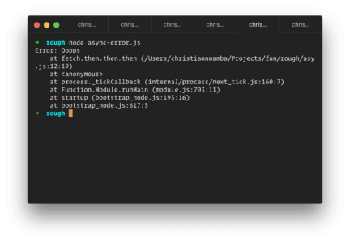
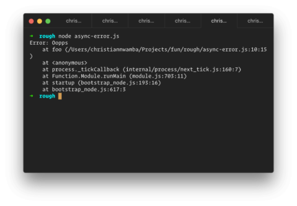

From JavaScript Promises to Async/Await: why bother?

In this tutorial, we will cover why we need `async/await` when we could achieve the same fit with JavaScript Promises, to this effect we’ll demonstrate why you should rather use `async/await` whilst also exclusively drawing comparisons to their use cases.

With constantly emerging technologies and tools, developers often times wonder “why do we need this? What’s the advantage of this new tool? Does it solve a bigger problem” etc. Just like in this [StackOverFlow question](https://stackoverflow.com/questions/34401389/javascript-promises-vs-async-await-difference) below:

## Async/Await

Inside a function marked as `async`, you are allowed to place the `await` keyword in front of an expression that returns a `Promise`. When you do, the execution is paused until the `Promise` is resolved.

Before we dive into it, let’s take a moment to familiarize you with the `async/await` style. First, `async/await` makes the asynchronous code appear and behave like synchronous code. Being that it was built on top of `Promises`, you could simply see it as a new way of writing synchronous code. Just like `Promises` themselves, `async/await` is equally non-blocking.

The purpose of `async/await` functions is to simplify the behavior of using `Promises` synchronously and to perform some behavior on a group of `Promises`. Just as `Promises` are similar to structured callbacks, one can say that `async/await` is similar to combining [generators](https://developer.mozilla.org/en-US/docs/Web/JavaScript/Guide/Iterators_and_Generators) and `Promises`.

Basically, there are two keywords involved, `async` and `await`, let’s understand them better:

### Async

Putting the keyword `async` before a function tells the function to return a `Promise`. If the code returns something that is not a `Promise`, then JavaScript automatically wraps it into a resolved promise with that value e.g when it returns an `AsyncFunction` object:

	    async function oddNumber() {
	      return 7;
	    }

Then it’ll return a resolved `Promise` with the result of `7`, however, we can set it to explicitly return a `Promise` like this:

	    async function evenNumber() {
	      return Promise.resolve(8);
	    }

Then there’s the second keyword `await` that makes the function even much better.

### Await

The `await` keyword simply makes JavaScript wait until that `Promise` settles and then returns its result:

	    let result = await promise;

Note that the `await` keyword only works inside async functions, otherwise you would get a `SyntaxError`. From the `async` function above, let’s have an `await` example that resolves in 2secs.

	    async function evenNumber() {

	      let promise = new Promise((resolve, reject) => {
	        setTimeout(() => resolve("8"), 2000)
	      });

	      let result = await promise; // pause till the promise resolves

	      alert(result); // "8"
	    }

`await` simply makes JavaScript wait until the `Promise` settles, and then go on with the result. Meanwhile, as it waits, the engine carries on with performing other tasks like running scripts and handling events. Thus, no CPU resources will be lost.

## Syntax

	    async function name([param[, param[, ... param]]]) {
	       statements
	    }

### Parameters

Where:

- name = the function name
- param = argument or arguments to be passed to the function
- statement = the body of the function.

### Return Value

A [Promise](https://developer.mozilla.org/en/docs/Web/JavaScript/Reference/Global_Objects/Promise) which will be resolved with the value returned by the `async` function, or rejected with an uncaught exception thrown from within the `async` function.

## Why bother?

Now that you have a fair understanding of how `async/await` works and it’s syntax, let’s go ahead and dive into more awesome features that will convince you to adopt it:

### 1. Error handling

Using the `try/catch` construct, `async/await` makes it relatively easy to handle both synchronous and asynchronous errors:

	    const oddRequest = () => {
	        try {
	          getJSON()
	            .then(result => {
	              // this parse may fail
	              const data = JSON.parse(result)
	              console.log(data)
	            })
	            //  handle asynchronous errors
	             .catch((err) => {
	               console.log(err)
	             })
	        } catch (err) {
	          console.log(err)
	        }
	      }

In this promise example, the `try/catch` will not handle the error if `JSON.parse` fails. This is because it’s happening inside a promise. Hence, we need to call `.catch` on the promise, this will (hopefully) be more sophisticated than `console.log` in your production-ready code. Now let’s simplify it with `async/await` :

	        const oddRequest = async () => {
	          try {
	            // this parse may fail
	            const data = JSON.parse(await getJSON())
	            console.log(data)
	          } catch (e) {
	            console.log(e)
	          }
	        }

With `async/await`, the catch block will handle parsing errors. As can be seen evidently, this is much more efficient, simple and less complicated.

### 2. Conditionals

`async/await` handles conditionals in a much better fashion as compared to using `Promises`. Often times, we want to fetch some data and then decide whether it should return that fetched data or get more data(make another call for more data) based on some value in the initially fetched data. Take for example :

	    const getNumbers = () => {
	      return getJSON()
	        .then(firstNumber=> {

	        /*we can return "firstNumber" but then it needs an even number
	        so we'd make another call to return an even number then return it*/

	          if (secondNumber.requiresEvenNumber) {
	            return getEvenNumber(firstNumber)
	              .then(secondNumber=> {
	                console.log(secondNumber)
	                return secondNumber
	              })
	          } else {
	            console.log(firstNumber)
	            return firstNumber
	          }
	        })
	    }

Now, this could get ridiculously complicated and confusing as you go on with values that require other values, however, `async/await` makes it really simple to handle:

	    const getNumbers = async () => {
	      const firstNumber = await getJSON()
	      if (firstNumber.requiresEvenNumber) {
	        const secondNumber = await getEvenNumber(data);
	        console.log(secondNumber)
	        return secondNumber
	      } else {
	        console.log(firstNumber)
	        return firstNumber
	      }
	    }

This is undoubtedly simpler, less ambiguous and direct. This is one of the advantages of the `async/await` syntax, it handles conditionals in a seamless manner.

### 3. Chaining

Consider a situation where we have a sequence of asynchronous tasks to be done one after another. For instance, loading scripts or returning `Promises` from an API etc. It will result in a promise chain and we’ll have to split the functions into many parts to handle it. Consider this example:

	    function getAPIData(url) {
	      return contentData(url) // returns a promise
	        .catch(e => {
	          return somethingElse(url)  // returns a promise
	        })
	        .then(v => {
	          return someOtherThing(v); // returns a promise
	        })
	        .then(x => {
	          return anotherOtherThing(v)
	        });
	        //   the chain continues with more .then() handlers
	    }

Here the flow is:
1. The initial `contentData(url)` resolves
2. Then the `.then` handler is called
3. The value that it returns is passed to the next `.then` handler
4. If an error occurs, the `catch` handler handles it

As the result is passed along the chain of handlers, we can see even more functions being created to handle it.

However, that entire chain can be rewritten with a single async function:

	    async function getAPIData(url) {
	      let payload;
	      try {
	        const v = await contentData(url);
	        payload = await anotherOtherThing(v)
	      } catch(e) {
	        v = await somethingElse(url);
	      }
	      return payload;
	    }

### 4. Error reporting

The way `Promises` report errors are quite misleading and complicated as compared to `async/await`. Consider a function that calls multiple `Promises` in a chain, and somewhere down the chain an error is thrown:

	    const fetch =() =>{
	        return new Promise((resolve, reject) =>{
	            resolve('{ "text": "some content" }')
	        })
	    }
	    const foo = () =>{
	            return fetch()
	            .then(result => fetch())
	            .then(result => fetch())
	            .then(() =>{
	                throw new Error("Oopps")
	            })
	    }
	    foo().catch(error =>{
	        console.log(error)
	    })

The logcat reads:

This suggests that the error occurs from `fetch()` whereas in essence, it doesn’t. As can be seen from the code, the error clearly is as a result of the `foo()` method but there was no mention of it in the stack.

However, if we are to rewrite the code in `async/await` syntax:

	    const fetch = async() =>{
	        return new Promise((resolve, reject) =>{
	            resolve('{ "text": "some content" }')
	        })
	    }
	    const foo = async() =>{
	            await fetch()
	            await fetch()
	            throw new Error("Oopps")
	    }
	    foo().catch(error =>{
	        console.log(error)
	    })

The logcat here reads:

Now, this points exactly to the `foo()` method and better still, it points to the exact location of the error in the codebase.

### 5. Lower memory requirements

This is an extension of the error reporting function above however with more attention to performance and memory efficiency.

Imagine a scenario where a function `doe` is called when a call to an asynchronous function `boo` resolves:

	    const foo = () => {
	            boo().then(() => doe());
	    };

When `foo` is called, the following happens synchronously:

- `boo` is called and returns a promise that will resolve at some point in the future.
- The `.then` callback (which is effectively calling `doe()`) is added to the callback chain.

After that, we’re done executing the code in the body of function `foo`. Note: `foo` is never suspended, and the context is gone by the time the asynchronous call to `boo` resolves. Imagine what happens if `boo` (or `doe`) asynchronously throws an exception. The stack trace should include `foo`, since that’s where `boo` (or `doe`) was called from, right? How is that possible now that we have no reference to `foo` anymore? That’s exactly the same case we had on the third step above.

To make it work, the JavaScript engine needs to do something in addition to the above steps,

it also captures and **stores the stack trace** within `foo` while it still has the chance.

Capturing the stack trace **takes time** (i.e. degrades performance); storing these stack traces **requires memory**.

Here’s the same program, written using `async/await` instead of vanilla promises:

	    const foo = async () => {
	            await boo();
	            doe();
	    };

With `await`, there’s no need to store the current stack trace — it’s sufficient to store a pointer from `boo` to `foo`. During the execution of `boo`, `foo` is suspended, so its context is still available. If `boo` throws an exception, the stack trace can be reconstructed on-demand by traversing these pointers. If `doe` throws an exception, the stack trace can be constructed just like it would be for asynchronous function, because we’re still within `foo` when that happens. Either way, stack trace capturing is no longer necessary — instead, the stack trace is only constructed when needed. **Storing the pointers requires less memory than storing entire stack traces**

### 6. Neat syntax

The `async/await` syntax is generally very clean and concise. Considering our previous examples, you can look at how much code we didn’t have to write. it’s clear we saved a decent amount of code (thereby saving us time and effort). We didn’t have to:

- Write `.then`
- Create an anonymous function to handle responses
- Name variables that we don’t need to use
- We also avoided nesting our code.

These small advantages add up quickly, to enhance both the code structure and the javascript engine functions.

## Conclusion

Compared to using `Promises` directly, not only can [async and await](https://developers.google.com/web/fundamentals/getting-started/primers/async-functions) make the code more readable for developers — they enable some interesting optimizations in JavaScript engines, too! As we have seen with memory and performance.

The fundamental difference between `await` and vanilla `Promises` is that `await X()`  *suspends* execution of the current function, while `promise.then(X)`  *continues* execution of the current function after adding the `X` call to the callback chain. In the context of stack traces, this difference is pretty significant.

When a `Promise` chain throws an unhandled exception at any point, the JavaScript engine displays an error message and (hopefully) a useful stack trace. As a developer, you expect this regardless of whether you use vanilla `Promises` or `async` and `await`.