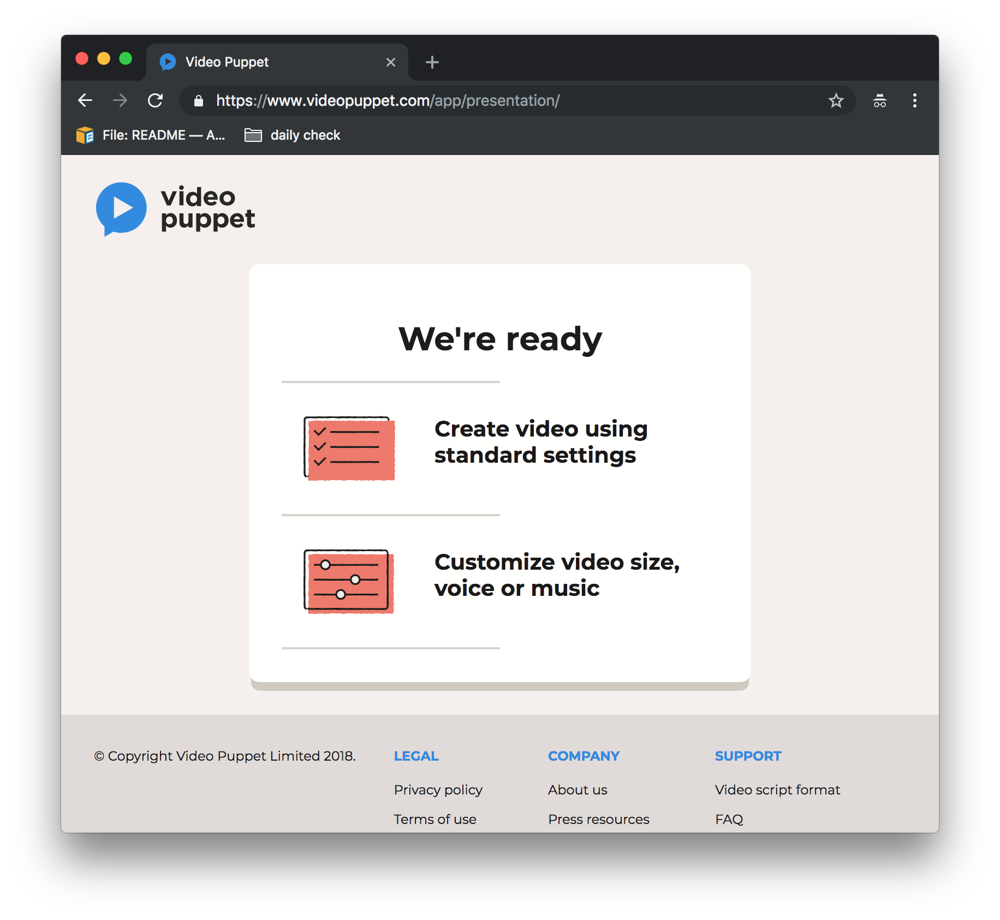
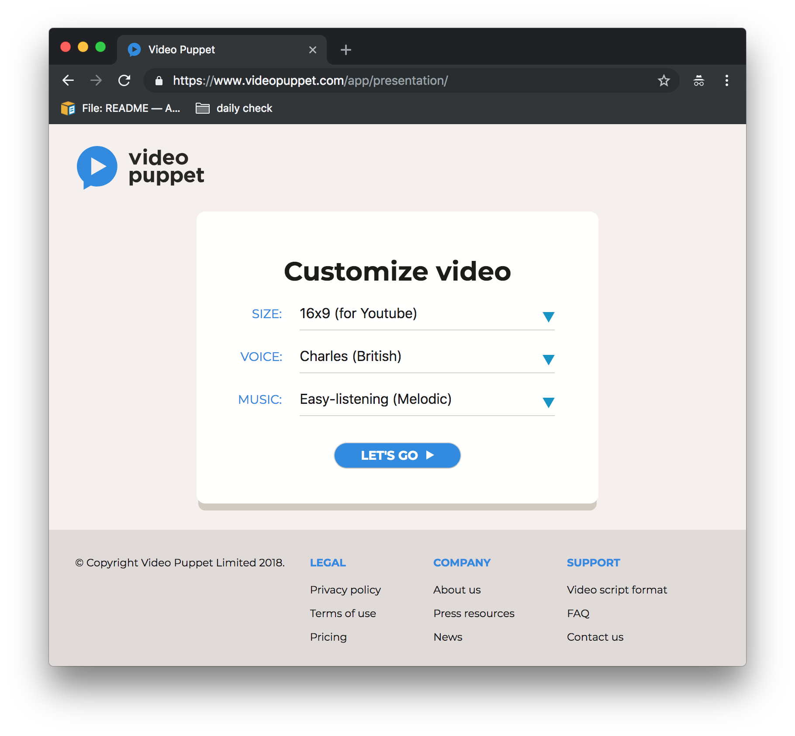

From PowerPoint to Video

# From PowerPoint to Video

Video Puppet makes it easy to turn presentations into videos.

- [Getting started](https://www.videopuppet.com/docs/powerpoint/#getting-started)

- [Quick example](https://www.videopuppet.com/docs/powerpoint/#quick-example)

- [Important limitations](https://www.videopuppet.com/docs/powerpoint/#important-limitations)

- [Common tasks](https://www.videopuppet.com/docs/powerpoint/#common-tasks)

    - [Add video segments](https://www.videopuppet.com/docs/powerpoint/#add-video-segments)

    - [Add pre-recorded audio](https://www.videopuppet.com/docs/powerpoint/#add-pre-recorded-audio)

    - [Control pronunciation and add pauses in the narration](https://www.videopuppet.com/docs/powerpoint/#control-pronunciation-and-add-pauses-in-the-narration)

    - [Keep a slide without any narration](https://www.videopuppet.com/docs/powerpoint/#keep-a-slide-without-any-narration)

    - [Change the main video voice](https://www.videopuppet.com/docs/powerpoint/#change-the-main-video-voice)

    - [Change the voice for a particular paragraph](https://www.videopuppet.com/docs/powerpoint/#change-the-voice-for-a-particular-paragraph)

    - [Change subtitles](https://www.videopuppet.com/docs/powerpoint/#change-subtitles)

    - [Remove the background music?](https://www.videopuppet.com/docs/powerpoint/#remove-the-background-music)

- [More information](https://www.videopuppet.com/docs/powerpoint/#more-information)

## Getting started

Create slides in a Powerpoint-compatible tool, and put narration into [speaker notes.](https://support.office.com/en-us/article/add-speaker-notes-to-your-slides-26985155-35f5-45ba-812b-e1bd3c48928e). [Upload the presentation file](https://www.videopuppet.com/app/presentation/) as PPT, PPTX, PPSX and ODP. (For Google Slides, just use *File -> Download -> Microsoft Powerpoint* from the application menu to produce a PPTX file).

*Note: For best results, [embed fonts](https://support.office.com/en-us/article/embed-fonts-in-word-or-powerpoint-cb3982aa-ea76-4323-b008-86670f222dbc#OfficeVersion=Windows) into your document before uploading to Video Puppet. This will make sure that the text is displayed in your video exactly as it is on your screen.*

## Quick example

Check out this [sample Powerpoint file](https://www.videopuppet.com/assets/examples/demo.ppt) - and make sure to inspect the speaker notes. Video Puppet created the video below based on that presentation. Tweak the file then create a new video by [uploading](https://www.videopuppet.com/app/presentation/) the modified file to the presentation wizard.

## Important limitations

PowerPoint transitions and animations do not work yet.

Video slides are supported, but partial video frames are not (you cannot currently mix images and video in the same slide, and play video in a part of a picture).

Make sure to [embed fonts](https://support.office.com/en-us/article/embed-fonts-in-word-or-powerpoint-cb3982aa-ea76-4323-b008-86670f222dbc#OfficeVersion=Windows) into your document before uploading to Video Puppet, so your slides display correctly.

## Common tasks

Here is how to perform some common tasks as you start experimenting with Video Puppet:

### Add video segments

You can also use screen recordings or pre-edited videos as scenes. To use a video file in one of your scenes, just [insert the video](https://support.office.com/en-us/article/insert-and-play-a-video-file-from-your-computer-f3fcbd3e-5f86-4320-8aea-31bff480ed02) into your presentation. You can add MOV and MP4 videos to your slides.

*Note: Video slides are supported, but partial video frames are not (you cannot currently mix images and video in the same slide, and play video in a part of a picture).*

### Add pre-recorded audio

Automatically generated narration is great for quick experimentation, and for iterating on the content. But having the same voice as everyone else can mean that your videos lose the personal touch. For authors that want to use their own voice for narration, but still make videos from PowerPoint slides, Video Puppet now lets you easily replace the generated narration with your own audio.

To use your own voice, remove the text from speaker notes, and [add an audio file to a slide](https://support.office.com/en-us/article/video-add-and-record-audio-eeac1757-5f20-4379-95f2-0d0cd151d5b8). If a PowerPoint slide has an audio file attached, Video Puppet will play that as the narration for the corresponding scene. Video Puppet supports WAV, MP3 and M4A files.

### Control pronunciation and add pauses in the narration

Add a pause [stage direction](https://www.videopuppet.com/docs/format/#stage-directions) between the paragraphs in your speaker notes. The instruction should be in brackets, followed by a colon (`:`) and a number of seconds you want to wait. It’s important to add this into a separate paragraph, so there needs to be a blank line between the instruction and the rest of the text. For example, to add a pause of 3 seconds between two sentences, add this to speaker notes:

	First sentence, something very
	interesting and amusing.

	(pause: 3)

	Second sentence, even more amusing.

Check out the [Narration format reference](https://www.videopuppet.com/docs/format/#narration) for more information.

### Keep a slide without any narration

Video Puppet will automatically synchronise picture and sound, so that the slides match the duration of your narration. If you want to keep a slide visible for a period of time without any narration, just add a pause instruction to the speaker notes. For example, to keep a slide for 10 seconds, add the following instruction:

	(pause: 10)

### Change the main video voice

After uploading the slides, choose the bottom option option, “Customize video size, voice or music”.

In the menu, just choose a different voice from the dropdown, and click the “Let’s Go” button to build the video.

### Change the voice for a particular paragraph

Add a voice [stage direction](https://www.videopuppet.com/docs/format/#stage-directions) between the paragraphs in your speaker notes to set the voice for the following text. The instruction should be in brackets, followed by a colon (`:`) and a number of seconds you want to wait. It’s important to add this into a separate paragraph, so there needs to be a blank line between the instruction and the rest of the text. For example:

	First sentence, in the main video voice.

	(voice: Brian)

	Brian will read this sentence.

Check out the [Narration format reference](https://www.videopuppet.com/docs/format/#narration) for more information.

### Change subtitles

Video Puppet lets you add subtitles automatically based on the narration text. If you use your own audio, or want to change the subtitles to differ from the narration text, just add a paragraph starting with the right angle bracket (`>`) to your narration.

	Video Puppet will read this

	> Video Puppet will show this instead

Check out the [subtitles format reference](https://www.videopuppet.com/docs/format/#subtitles-1) for more information and tricks.

### Remove the background music?

To make videos more appealing, Video Puppet adds a neutral background music automatically. You can remove the background music completely or change it to something else after uploading the slides. Choose the bottom option option, “Customize video size, voice or music”. In the “Music” drop down, select “No Music”, then click the “Let’s Go” button to build the video.

## More information

Check out the [narration formatting reference](https://www.videopuppet.com/docs/format/#narration) for more information on controlling pronunciation, and the [stage directions formatting reference](https://www.videopuppet.com/docs/format/#stage-directions) for additional processing commands you can add to speaker notes.