G Suite admin can access your emails without knowing your password.

 ![](data:image/svg+xml,%3csvg xmlns='http://www.w3.org/2000/svg' viewBox='0 0 283.5 27.8' preserveAspectRatio='none' data-evernote-id='1355' class='js-evernote-checked'%3e %3cpath class='elementor-shape-fill js-evernote-checked' d='M283.5%2c9.7c0%2c0-7.3%2c4.3-14%2c4.6c-6.8%2c0.3-12.6%2c0-20.9-1.5c-11.3-2-33.1-10.1-44.7-5.7 s-12.1%2c4.6-18%2c7.4c-6.6%2c3.2-20%2c9.6-36.6%2c9.3C131.6%2c23.5%2c99.5%2c7.2%2c86.3%2c8c-1.4%2c0.1-6.6%2c0.8-10.5%2c2c-3.8%2c1.2-9.4%2c3.8-17%2c4.7 c-3.2%2c0.4-8.3%2c1.1-14.2%2c0.9c-1.5-0.1-6.3-0.4-12-1.6c-5.7-1.2-11-3.1-15.8-3.7C6.5%2c9.2%2c0%2c10.8%2c0%2c10.8V0h283.5V9.7z M260.8%2c11.3 c-0.7-1-2-0.4-4.3-0.4c-2.3%2c0-6.1-1.2-5.8-1.1c0.3%2c0.1%2c3.1%2c1.5%2c6%2c1.9C259.7%2c12.2%2c261.4%2c12.3%2c260.8%2c11.3z M242.4%2c8.6 c0%2c0-2.4-0.2-5.6-0.9c-3.2-0.8-10.3-2.8-15.1-3.5c-8.2-1.1-15.8%2c0-15.1%2c0.1c0.8%2c0.1%2c9.6-0.6%2c17.6%2c1.1c3.3%2c0.7%2c9.3%2c2.2%2c12.4%2c2.7 C239.9%2c8.7%2c242.4%2c8.6%2c242.4%2c8.6z M185.2%2c8.5c1.7-0.7-13.3%2c4.7-18.5%2c6.1c-2.1%2c0.6-6.2%2c1.6-10%2c2c-3.9%2c0.4-8.9%2c0.4-8.8%2c0.5 c0%2c0.2%2c5.8%2c0.8%2c11.2%2c0c5.4-0.8%2c5.2-1.1%2c7.6-1.6C170.5%2c14.7%2c183.5%2c9.2%2c185.2%2c8.5z M199.1%2c6.9c0.2%2c0-0.8-0.4-4.8%2c1.1 c-4%2c1.5-6.7%2c3.5-6.9%2c3.7c-0.2%2c0.1%2c3.5-1.8%2c6.6-3C197%2c7.5%2c199%2c6.9%2c199.1%2c6.9z M283%2c6c-0.1%2c0.1-1.9%2c1.1-4.8%2c2.5s-6.9%2c2.8-6.7%2c2.7 c0.2%2c0%2c3.5-0.6%2c7.4-2.5C282.8%2c6.8%2c283.1%2c5.9%2c283%2c6z M31.3%2c11.6c0.1-0.2-1.9-0.2-4.5-1.2s-5.4-1.6-7.8-2C15%2c7.6%2c7.3%2c8.5%2c7.7%2c8.6 C8%2c8.7%2c15.9%2c8.3%2c20.2%2c9.3c2.2%2c0.5%2c2.4%2c0.5%2c5.7%2c1.6S31.2%2c11.9%2c31.3%2c11.6z M73%2c9.2c0.4-0.1%2c3.5-1.6%2c8.4-2.6c4.9-1.1%2c8.9-0.5%2c8.9-0.8 c0-0.3-1-0.9-6.2-0.3S72.6%2c9.3%2c73%2c9.2z M71.6%2c6.7C71.8%2c6.8%2c75%2c5.4%2c77.3%2c5c2.3-0.3%2c1.9-0.5%2c1.9-0.6c0-0.1-1.1-0.2-2.7%2c0.2 C74.8%2c5.1%2c71.4%2c6.6%2c71.6%2c6.7z M93.6%2c4.4c0.1%2c0.2%2c3.5%2c0.8%2c5.6%2c1.8c2.1%2c1%2c1.8%2c0.6%2c1.9%2c0.5c0.1-0.1-0.8-0.8-2.4-1.3 C97.1%2c4.8%2c93.5%2c4.2%2c93.6%2c4.4z M65.4%2c11.1c-0.1%2c0.3%2c0.3%2c0.5%2c1.9-0.2s2.6-1.3%2c2.2-1.2s-0.9%2c0.4-2.5%2c0.8C65.3%2c10.9%2c65.5%2c10.8%2c65.4%2c11.1 z M34.5%2c12.4c-0.2%2c0%2c2.1%2c0.8%2c3.3%2c0.9c1.2%2c0.1%2c2%2c0.1%2c2-0.2c0-0.3-0.1-0.5-1.6-0.4C36.6%2c12.8%2c34.7%2c12.4%2c34.5%2c12.4z M152.2%2c21.1 c-0.1%2c0.1-2.4-0.3-7.5-0.3c-5%2c0-13.6-2.4-17.2-3.5c-3.6-1.1%2c10%2c3.9%2c16.5%2c4.1C150.5%2c21.6%2c152.3%2c21%2c152.2%2c21.1z' data-evernote-id='1438'%3e%3c/path%3e %3cpath class='elementor-shape-fill js-evernote-checked' d='M269.6%2c18c-0.1-0.1-4.6%2c0.3-7.2%2c0c-7.3-0.7-17-3.2-16.6-2.9c0.4%2c0.3%2c13.7%2c3.1%2c17%2c3.3 C267.7%2c18.8%2c269.7%2c18%2c269.6%2c18z' data-evernote-id='1439'%3e%3c/path%3e %3cpath class='elementor-shape-fill js-evernote-checked' d='M227.4%2c9.8c-0.2-0.1-4.5-1-9.5-1.2c-5-0.2-12.7%2c0.6-12.3%2c0.5c0.3-0.1%2c5.9-1.8%2c13.3-1.2 S227.6%2c9.9%2c227.4%2c9.8z' data-evernote-id='1440'%3e%3c/path%3e %3cpath class='elementor-shape-fill js-evernote-checked' d='M204.5%2c13.4c-0.1-0.1%2c2-1%2c3.2-1.1c1.2-0.1%2c2%2c0%2c2%2c0.3c0%2c0.3-0.1%2c0.5-1.6%2c0.4 C206.4%2c12.9%2c204.6%2c13.5%2c204.5%2c13.4z' data-evernote-id='1441'%3e%3c/path%3e %3cpath class='elementor-shape-fill js-evernote-checked' d='M201%2c10.6c0-0.1-4.4%2c1.2-6.3%2c2.2c-1.9%2c0.9-6.2%2c3.1-6.1%2c3.1c0.1%2c0.1%2c4.2-1.6%2c6.3-2.6 S201%2c10.7%2c201%2c10.6z' data-evernote-id='1442'%3e%3c/path%3e %3cpath class='elementor-shape-fill js-evernote-checked' d='M154.5%2c26.7c-0.1-0.1-4.6%2c0.3-7.2%2c0c-7.3-0.7-17-3.2-16.6-2.9c0.4%2c0.3%2c13.7%2c3.1%2c17%2c3.3 C152.6%2c27.5%2c154.6%2c26.8%2c154.5%2c26.7z' data-evernote-id='1443'%3e%3c/path%3e %3cpath class='elementor-shape-fill js-evernote-checked' d='M41.9%2c19.3c0%2c0%2c1.2-0.3%2c2.9-0.1c1.7%2c0.2%2c5.8%2c0.9%2c8.2%2c0.7c4.2-0.4%2c7.4-2.7%2c7-2.6 c-0.4%2c0-4.3%2c2.2-8.6%2c1.9c-1.8-0.1-5.1-0.5-6.7-0.4S41.9%2c19.3%2c41.9%2c19.3z' data-evernote-id='1444'%3e%3c/path%3e %3cpath class='elementor-shape-fill js-evernote-checked' d='M75.5%2c12.6c0.2%2c0.1%2c2-0.8%2c4.3-1.1c2.3-0.2%2c2.1-0.3%2c2.1-0.5c0-0.1-1.8-0.4-3.4%2c0 C76.9%2c11.5%2c75.3%2c12.5%2c75.5%2c12.6z' data-evernote-id='1445'%3e%3c/path%3e %3cpath class='elementor-shape-fill js-evernote-checked' d='M15.6%2c13.2c0-0.1%2c4.3%2c0%2c6.7%2c0.5c2.4%2c0.5%2c5%2c1.9%2c5%2c2c0%2c0.1-2.7-0.8-5.1-1.4 C19.9%2c13.7%2c15.7%2c13.3%2c15.6%2c13.2z' data-evernote-id='1446'%3e%3c/path%3e %3c/svg%3e)

# Can G Suite Admin Read My Email?

When I was recently working on a G Suite deployment project, customer asked me if its possible to watch users emails, So I did some research and testing to find if its really possible.

Author – Goldy Arora – G Suite Certified Consultant

## So Can G Suite Admin Read My Email?

**Google allows G Suite administrators to monitor and audit users emails. An Administrator may use Google Vault, Content Compliance rules, Audit API or Email delegation to view and audit users emails. It is recommend for G Suite Administrators to consider their local laws before performing email auditing on their users mailboxes.**

**
**

 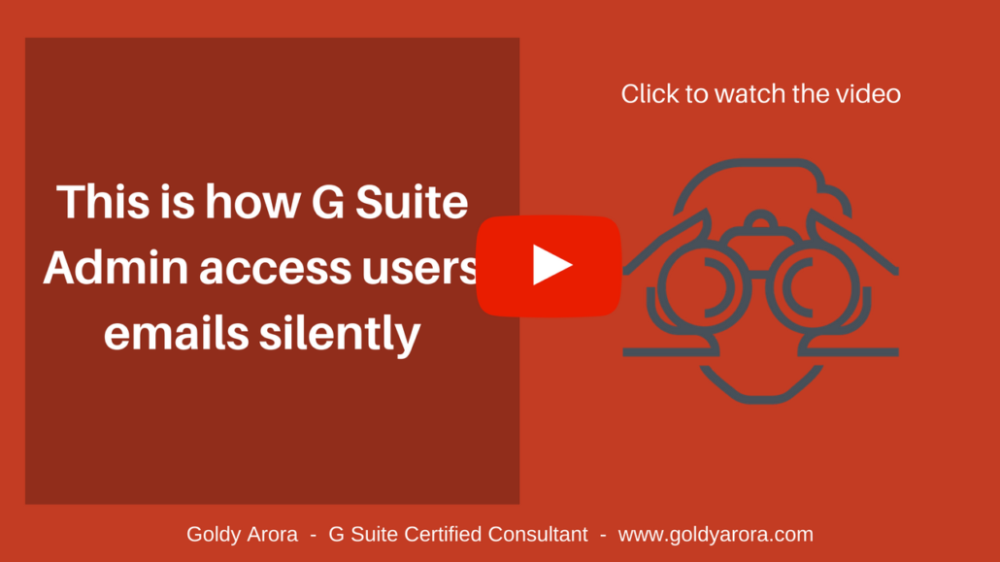

## Monitor Your Users Emails in G Suite via Content compliance Rule

In this video (or article below), i’ll show you how you can get bcc copy of your users/employees emails without knowing their G Suite password.

You should be a [G Suite Administrator](https://www.goldyarora.com/g-suite-admin/), and must be using G Suite Basic, Business, Government, Education or Enterprise edition as it does not work for G Suite Free.

**Article Overview-:**

- In this article you will see how being a G Suite Administrator you can get a copy of your users sent and received emails without knowing their passwords or putting forwarding in their mailboxes
- **Note-: **This option is primarily meant for auditing, you need to keep your country law and organizational policy in mind before attempting this method of getting access to your users emails.
- For any feedback or query, feel free to write me

**Scenario -:**

- For auditing purpose you would like to track incoming and/or outgoing (including intra-domain) emails of one or all of your Google Apps users, without asking or changing their password or putting a forwarding rule in their mailboxes

**Solution Explanation-:**

- To achieve this, you will create a server side rule in G Suite (formerly Google Apps) which you can apply on either one user, or an OU or even at all users
- This rule will state, that any message which contain @yourdomain.com in the message header, then send its copy to the id which you define

**System Requirements-:**

- This solution will only work with Basic, Business, Education and Government edition of G Suite (Google Apps), and not with free edition

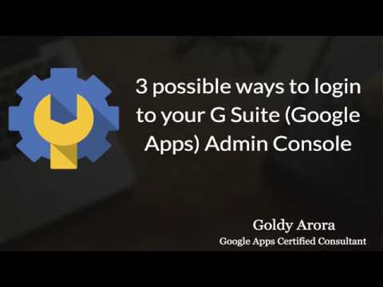

## Step 1 - Login to G Suite Control Panel

To achieve this, we need to login to our G Suite admin console, watch the video to see 3 possible ways to access admin console.

I assume you have administration permission to perform this task, if not, then you can [watch this tutorial](https://www.goldyarora.com/delegated-administration-google-apps/) to see how to become G Suite Administrator or delegated administrator.

Note -: If you haven’t signed up for G Suite yet, you may consider using [G Suite Promo Code](https://www.goldyarora.com/g-suite-promotion-codes/) to save 20%.

## Step 2 - Navigate to APPS

Once you are logged into G Suite Control Panel, click on APPS icon from the Dashboard.

 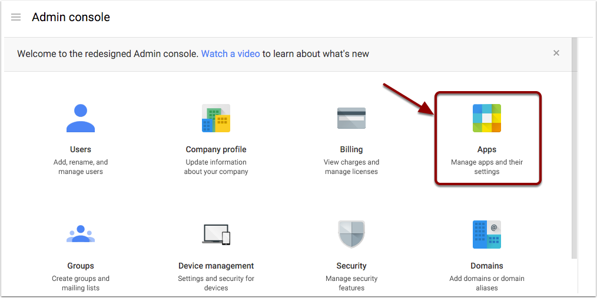

 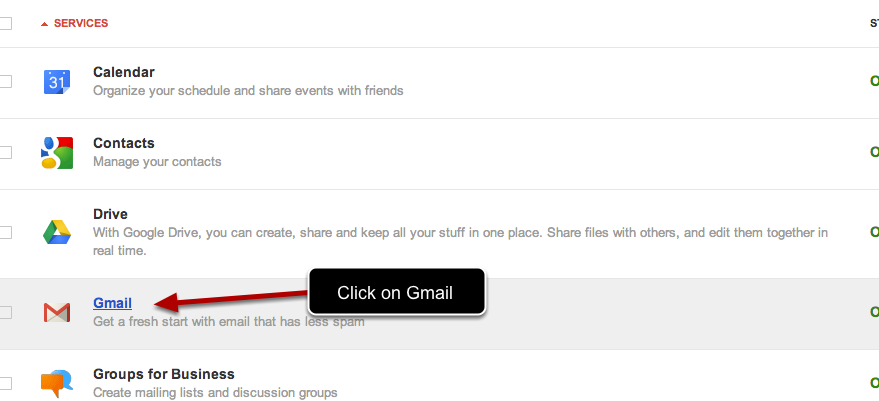

## Step 3 - Go to Gmail

As we will be applying a server side to our Gmail application, which will get us bcc copy of all sent and received emails of our users

Click on the GMAIL icon as shown in the screenshot

## Step 4 - Click on Advance Settings

The rule we want to apply is a part of Gmail advance settings, go ahead and click on it

 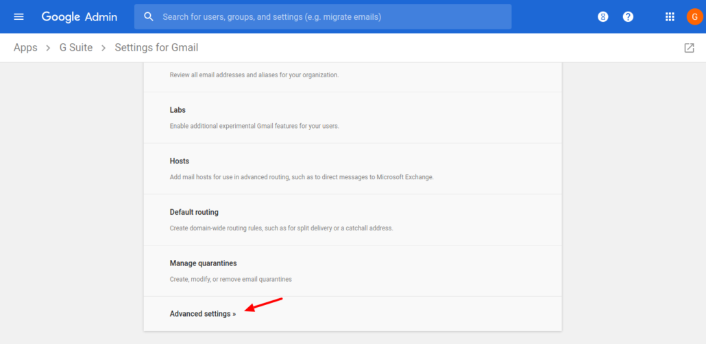

 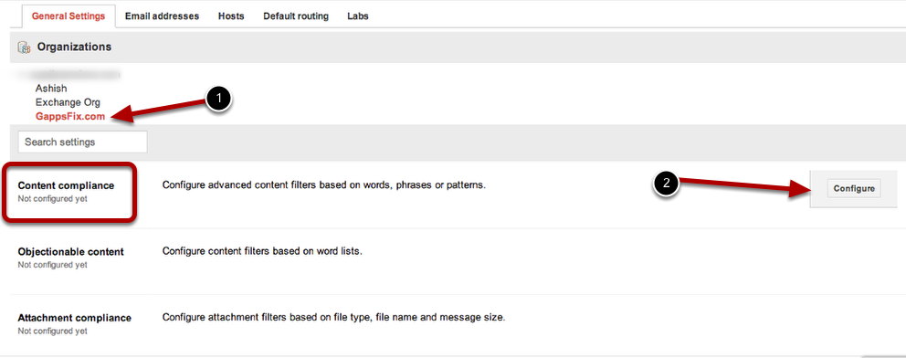

## Step 5 - Select Organization Unit

If you want to receive bcc copy of all the users in your domain, you can select the parent organization unit.

If you want to apply it on a specific function such as sales or accounting OR even only on a few users, you may create a new organizational unit and put required users in it, [here are instructions by Google for it.](https://support.google.com/a/answer/182537?hl=en)

After selecting right orgnaizational unit, scroll down to find “Content Compliance” and click on “Configure” as shown in the screenshot below

## Step 6 - Define Rule's Scope

Adding a description for your rule is recommended to ensure other administrators in your domain can refer to it and understand this rule’s objective in your absence

Select which emails you want to get as bcc for users, you can select any or all including inbound, outbound, internal sending or recieving, for the sake of this example, am only considering inbound and outbound, and not the intradoamin ones.

 

 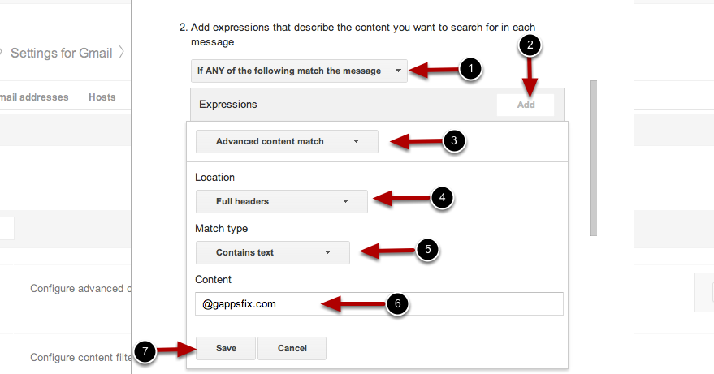

## Step 7 - Define the expression

Lets define our condition, think of it like IF/Else statement-:
1. Select “If any of the following match the message”
2. Click on “Add” to add a condition statement
3. Click on “Advance Content Match”
4. Location should be “Full Headers”
5. Match Type should be “Contain Text”

6. Content should be “yourdomainanme.com” (you need to change yourdomainname.com to your actual domain name)

7. Save your condition

Explanation -: In this step, we have created a condition (IF statement) stating if “@yourdomain.com” is found in the message header, then match the condition, now if your users either send or receive message through their corporate id, @yourdomain.com will surely be there in the headers, as its not possible to send/receive without it from/to their corporate id, however if your requirement is a bit complex, you may also use regex expressions to define your criteria.

## Step 8 - Who should get bcc?

1. Scroll down and click on “Add more recipients”
2. Click on Advance
3. Checkbox “Change Envelope Recipient”
4. Select “replace envelope recipient”
5. Enter the email id on which you would like to get bcc copy
6. Scroll below and follow the next step in this article
 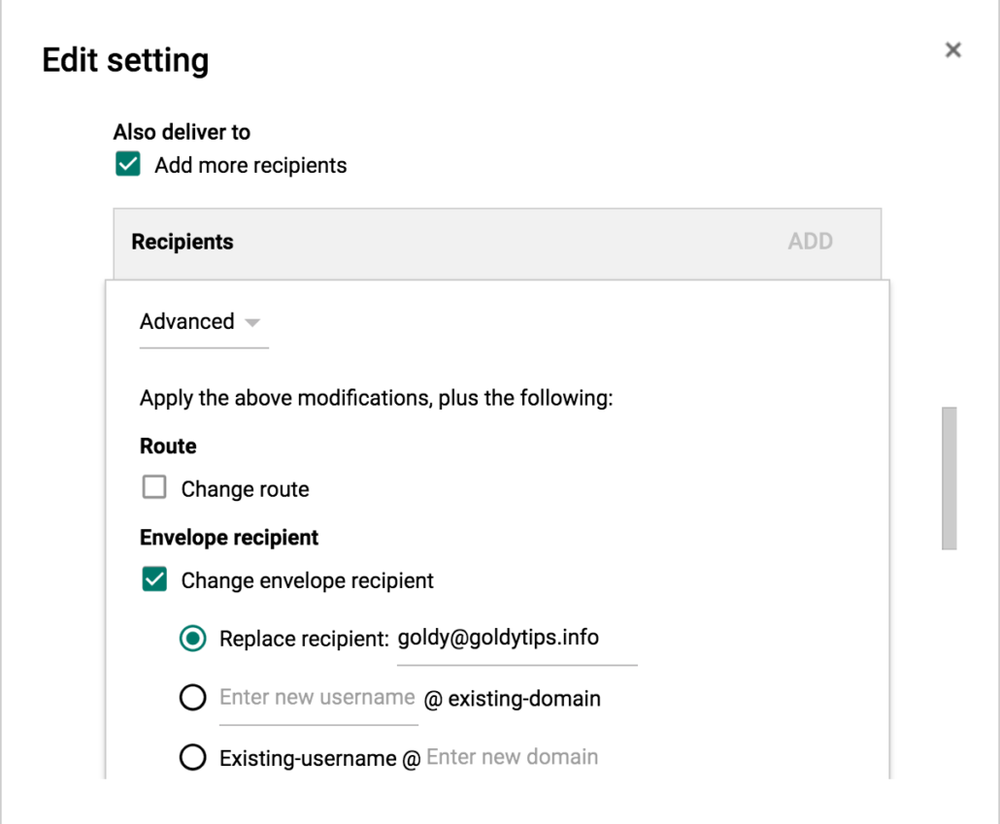
 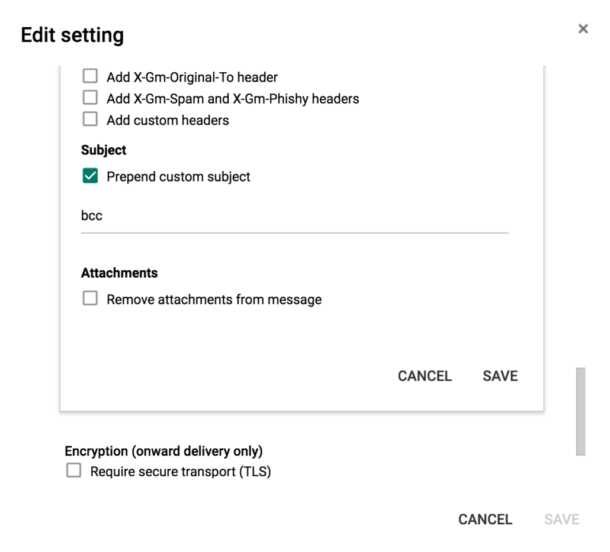

## Step 9 - Prepend subject (recommended)

1.

In this step, we’ll define a way to separate these bcc emails from your regular ones, so you can easily identify them and filter/label them if required.

    1. Click on “Prepend subject”

    2. Add any thing you would like to prepend in the subject of these bcc emails, for example {{BCC}}

    3. Now all theses bcc copies that you’ll get will have {{BCC}} in front of the subject line, which will help you make filter in Gmail and put them under a label/folder.

    4. Save your changes

## Step 10 - Done!

Congratulations, you will now get a bcc copy of your users in the mailbox you put in your condition as shown in above example)

feel free to put comments if you have any questions or feedback.

## G Suite user email auditing FAQ

##### Here are details about some additional ways by which a G Suite admin can monitor and audit users emails. if you don’t find the answer, feel free to ask in the comments below.

   ******    [Are there more way G Suite Admin can access my emails?](https://www.goldyarora.com/how-you-can-access-your-users-email-without-knowing-their-password-in-google-apps/)

G Suite Admin can not directly access users emails, however, Yes, he has following options to look at any users emails-:

### **(i) Google Vault ([Read My Complete Google Vault Guide here](https://www.goldyarora.com/blog/google-vault-guide/)) -: **

G Suite has different plans, and one of them is called “G Suite for Business” which comes an application called “[Google Vault](https://support.google.com/vault/answer/2462365?hl=en)“, which saves a copy of all users emails, on the record chat, group messages, files in Google Drive and Team Drive.

So even if a user deletes his/her email or a file in Google Drive, you can login to Google Vault as an Admin and search for users emails.

Please note -: above vault based solution to access your users email will not work with [G Suite basic plan](https://www.goldyarora.com/g-suite-promotion-code/) as Google does not vault with it, however it can be purchased additionally as shown in [Google Vault Pricing guide](https://www.goldyarora.com/blog/google-vault-guide/#GOOGLE_VAULT_PRICING) here.

### **(ii) Email Delegation -: **

G Suite offers an email delegation feature where you a user can delegate his or her gmail mailbox to someone (e.g a CXO delegating to executive assistant), this is usually done by a user, however G Suite Admin can also do it via [Google’s Email Settings API](https://developers.google.com/admin-sdk/email-settings/#manage_delegation_settings) without even users noticing it.

Note-: Though G Suite Admins can setup email delegation behind the scenes, if you are a user you can go to your delegation settings (Gmail –> Settings –> Accounts –> Grant Access to your account) and check if their account is delegated to someone and can delete the delegation too.

### **(iii) G Suite Content Compliance Rule -: **

G Suite Admin can also setup a rule in admin console to trigger a bcc copy of all (or required) users email as shown in the video tutorial above, and this solution works with all G Suite paid plans.

### **(iv) G Suite Admin Audit API -: **

In case if your requirement is not fulfilled by above solutions, you may consider putting a custom solution based on your needs with [G Suite Email Audit API](https://developers.google.com/admin-sdk/email-audit/). You also don’t need to start from scratch here, if you know a bit of Google Apps Script, you can use this [OAuth 2 library](https://github.com/googlesamples/apps-script-oauth2) to easily use Audit API within Apps Script.

   ******    [Can i login to my google apps user as an Admin?](https://www.goldyarora.com/how-you-can-access-your-users-email-without-knowing-their-password-in-google-apps/)

   ******    [Is it legal or ethical for Gmail Admin to read user emails?](https://www.goldyarora.com/how-you-can-access-your-users-email-without-knowing-their-password-in-google-apps/)

## Pages you may like

 [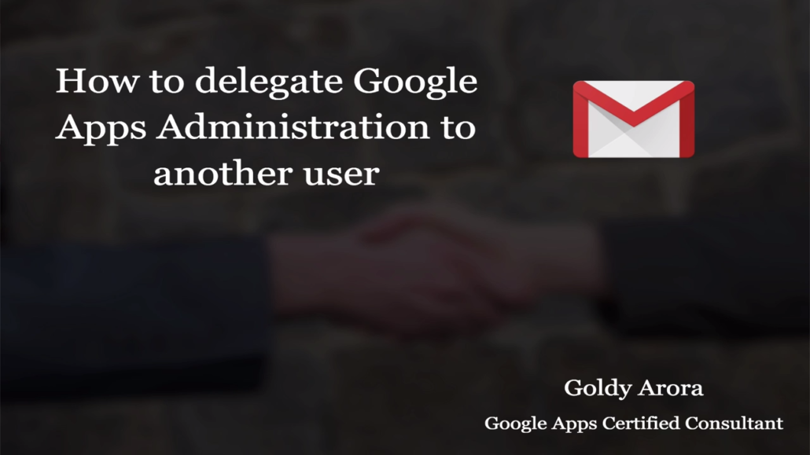](https://www.goldyarora.com/how-to-login-to-your-google-apps-control-panel-solved/)

### [Delegate your Admin responsibilities to another g suite user](https://www.goldyarora.com/how-to-login-to-your-google-apps-control-panel-solved/)

 [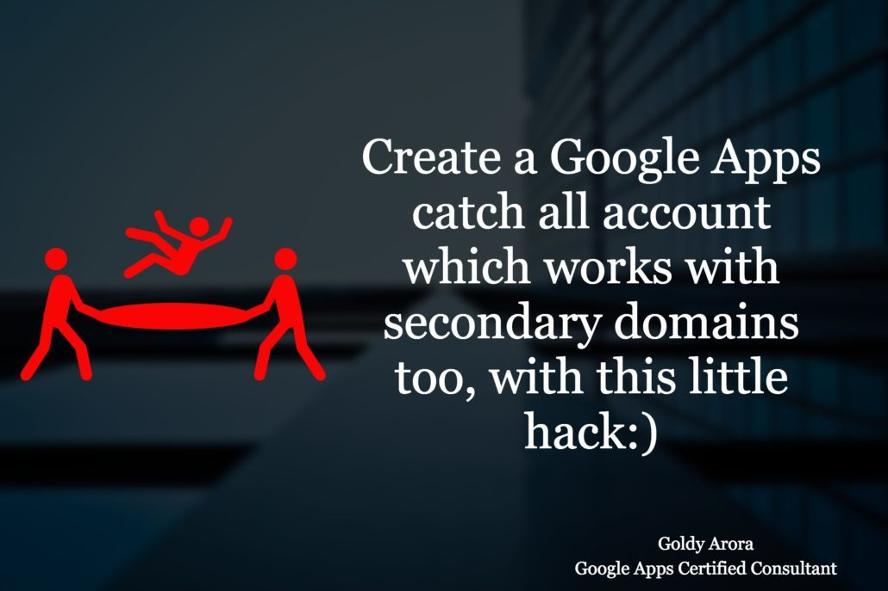](https://www.goldyarora.com/creating-catch-all-account-which-works-with-multiple-domains-in-google-apps/)

### [Create G Suite Catch-all account that works with multiple domain](https://www.goldyarora.com/creating-catch-all-account-which-works-with-multiple-domains-in-google-apps/)

 

### [THE DEFINITIVE GUIDE TO GOOGLE VAULT](https://www.goldyarora.com/google-apps-email-alias-create-additional-emails-free/)