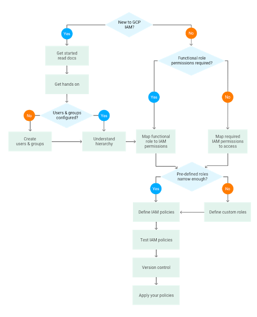
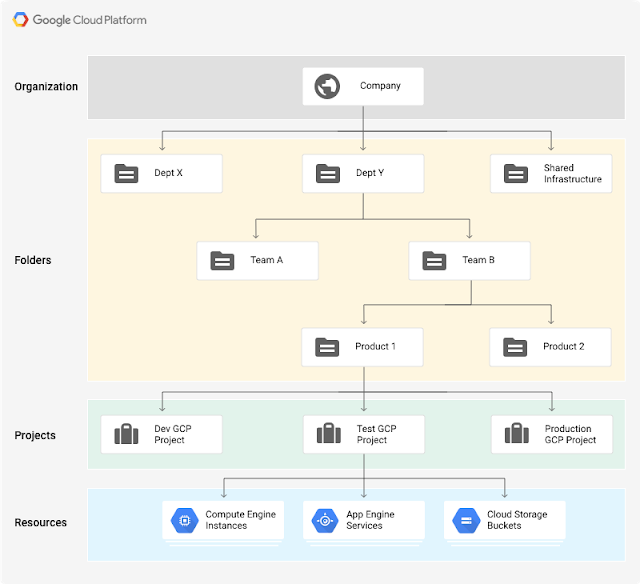

Getting to know Cloud IAM

# Getting to know Cloud IAM

By Grace Mollison, Cloud Solutions Architect

If your cloud environment consists of multiple projects and services accessed by multiple users, you want to be able to specify who can do what, to which resource. On [Google Cloud Platform](https://cloud.google.com/) (GCP), that means using [Cloud Identity and Access Management](https://cloud.google.com/iam/) (IAM), which gives you the control and visibility you need to centrally manage your cloud resources.

Implementing Cloud IAM is an ongoing, multi-step process. First, you need to configure your users and groups. Then, you need to determine whether to define functional roles—and map them to your users. You also need to determine whether pre-defined roles offered by Cloud IAM meet your organization’s needs, and if not, create custom ones. Of course, you’ll have to test your IAM policies, and revisit them over time to make sure that they continue to meet your needs.

To help you implement these controls, we’ve created a flowchart to help you navigate Cloud IAM. Whether you're new to IAM or familiar with it and just need a gentle reminder, this flowchart can serve as a handy checklist of steps you need to follow.

Let’s drill down into the the various steps in the flowchart.

### Get started by reading the documentation

If you’re new to Cloud IAM, we highly recommend you take time out to familiarize yourself with the [IAM documentation](https://cloud.google.com/iam/docs/), a comprehensive guide that includes resources to help you follow [best practice guidance](https://cloud.google.com/iam/docs/using-iam-securely). In particular, the [Understanding Roles](https://cloud.google.com/iam/docs/understanding-roles) document is a great way for you to become more familiar with IAM. This page lists all the available IAM roles per product, and from here you can easily locate the product-specific IAM pages for more detail on their respective IAM roles.

###

Get hands-on

Once you have familiarized yourself with the [overview](https://cloud.google.com/iam/docs/overview), it’s time to get hands-on to understand how to actually implement IAM policies. The [tutorial on implementing GCP policies](https://cloud.google.com/solutions/policies/implementing-policies-for-customer-use-cases) has a section on how to [map your requirements to IAM](https://cloud.google.com/solutions/policies/implementing-policies-for-customer-use-cases#map_iam_roles_to_functional_groups) and walks through the tutorial [implementation](https://cloud.google.com/solutions/policies/implementing-policies-for-customer-use-cases#configuring_the_cloud_resource_manager_hierarchy) using the [GCP Console](https://console.cloud.google.com/).

### Create users and groups

GCP uses [Google Accounts](https://support.google.com/work/android/answer/6371476) for authentication and access management. Best practice is to use groups to set up the IAM policies that meet your requirements. [Google groups](https://cloud.google.com/iam/docs/overview#google_group) are a convenient way to apply an access policy to a collection of users. You can grant and change access controls for a whole group at once rather than one-at-a-time, as you do for individual users or service accounts. You can also easily add members to and remove members from a Google group rather than updating a Cloud IAM policy.

###

Understand hierarchy

A key concept in Cloud IAM is that it uses a hierarchical approach to implementing IAM, flowing from the Organization node downwards. GCP allows you to [group and hierarchically organize all GCP resources](https://cloud.google.com/resource-manager/docs/cloud-platform-resource-hierarchy#cloud_platform_resource_hierarchy_and_iam_policy_hierarchy) into resource containers such as Organizations, Folders and Projects.

The following diagram shows an example of various resources and their hierarchical organization in GCP.

You can set an IAM policy at the [organization level](https://cloud.google.com/resource-manager/docs/access-control-org), the [folder level](https://cloud.google.com/resource-manager/docs/access-control-folders), the [project level](https://cloud.google.com/resource-manager/docs/access-control-proj), or (in some cases) the resource level. The tables in the [Understanding Roles](https://cloud.google.com/iam/docs/understanding-roles) document indicate at what level in the hierarchy you can incorporate an IAM role for a product as part of a policy.

A resource inherits the policies of its parent node. If you set a policy at the Organization level, all its child folders and projects inherit that policy. Likewise, if you set a policy at the Project level, its child resources inherit that policy as well. In other words, the policy for a resource is effectively the union of the policies set on the resource as well as all of the policies it inherits from its ancestors.

### Define functional or product-specific roles

When planning your IAM implementation there are two approaches: use a functional role or set access according to data or product type.

Typically the first few IAM policies that you need to map are functional and role-based, for example, the existing [Networking](https://cloud.google.com/iam/docs/job-functions/networking) and [Billing](https://cloud.google.com/iam/docs/job-functions/billing) roles.

Restricting access by product, meanwhile, looks at a particular resource and focuses on defining the policy focused on that resource. For example, you may wish to[restrict access to specific Cloud Storage buckets](https://cloud.google.com/storage/docs/access-control/iam#project-level_roles_vs_bucket-level_roles), [BigQuery datasets](https://cloud.google.com/bigquery/docs/access-control#predefined_roles_details) or [Pub/Sub topics and subscriptions](https://cloud.google.com/pubsub/docs/access-control).

###

Define custom roles

If the predefined IAM roles do not meet your security needs, you can create a custom role with one or more permissions.When creating a custom role, we recommend starting from an existing predefined role and add or remove permissions to it, rather than starting from an empty list of permissions.

Creating custom roles is an advanced configuration action since managing them represents additional operational overhead. You're responsible for maintaining your custom roles, and will need to add any new IAM permissions to them. Any changes that Google Cloud makes to predefined roles will not be reflected in your custom roles. You can use the [IAM permissions change log](https://cloud.google.com/iam/docs/permissions-change-log) to track the history of permission changes.

### Define IAM policy

You can grant roles to users by creating a [Cloud IAM policy](https://cloud.google.com/iam/docs/overview#policy), which is a collection of statements that define who has what type of access. These policies consist of a set of bindings of members (who has access) to one or more IAM roles. Here's an example of a policy in JSON:

	{
	  "bindings": [
	   {
	     "role": "roles/owner",
	     "members": [
	       "user:alice@example.com",
	       "group:admins@example.com",
	       "domain:google.com",
	       "serviceAccount:my-other-app@appspot.gserviceaccount.com"]
	   },
	   {
	     "role": "roles/viewer",
	     "members": ["user:bob@example.com"]
	   }
	   ]
	}

Using groups to define members is another best practice. It keeps the policies readable and allows you to easily adjust who has access to a resource without having to update the policies themselves.

### Test IAM policies

Testing any policies you create is critical. This way, you can safely check whether you’ve inadvertently granted broader access than required or, conversely, locked things down too much before applying the new or updated policies to your production environment.

An important decision is where you'll undertake testing. We recommend using a dedicated Folder, assuming the functional roles assigned at the Organization level are well-defined and unlikely to change.

A quick way to validate policies set at the Project level is to use the [Method: projects.setIamPolicy API](https://cloud.google.com/resource-manager/reference/rest/v1/projects/setIamPolicy) page, which has a useful **Try this API** form so you can see the request and response.

Alternately, another way to troubleshoot IAM policies and simulate changes is to use [IAM Explain](https://forsetisecurity.org/docs/quickstarts/explain/index.html), a part of the [Foresti security](https://forsetisecurity.org/) suite.

###

Use version control

Infrastructure as code gives you the confidence that you're deploying reproducible consistent configurations, provides an audit trail for changes and allows you to treat your infrastructure as you do code. An integral component of this approach is version control. Cloud IAM policies form part of your infrastructure definition, and can be used as part of a version control system.

There are lots of ways to write IAM policies:

- as pure JSON
- using the API written in one of the supported [languages](https://cloud.google.com/resource-manager/reference/rest/v1/projects/setIamPolicy)
- as declarative templates using [Cloud Deployment Manager](https://github.com/GoogleCloudPlatform/deploymentmanager-samples/tree/master/examples/v2/iam)
- using open-source tooling such as [Terraform](https://www.terraform.io/docs/providers/google/d/google_iam_policy.html)

The policies, in whichever format you settle upon, can then be kept in a version control system, such as [Cloud Source Repositories](https://cloud.google.com/source-repositories/), which provides private Git repositories. You can then integrate the repositories as part of your chosen deployment workflow.

### Apply your policies

Finally, it’s time to apply the policies that you've created. You can [apply policies](https://cloud.google.com/iam/docs/granting-changing-revoking-access) using the gcloud CLI, the IAM [API](https://cloud.google.com/iam/reference/rest/), [GCP Console](https://console.cloud.google.com/), [Cloud Deployment Manager](https://cloud.google.com/deployment-manager/) or via open-source software tooling such as [Terraform](https://www.terraform.io/), which includes example IAM policies that can be applied using the gcloud command and the [API](https://cloud.google.com/resource-manager/reference/rest/v1/projects/setIamPolicy).

###

Next steps

Navigating the flowchart provides you with a logical approach to implementing your IAM policies—but it doesn't stop there. Setting up [Cloud Audit Logging](https://cloud.google.com/logging/docs/audit/) to monitor your policies is a great next step. This done, you’ll be well on your way to a building an environment with control and visibility you need to centrally manage your GCP resources.