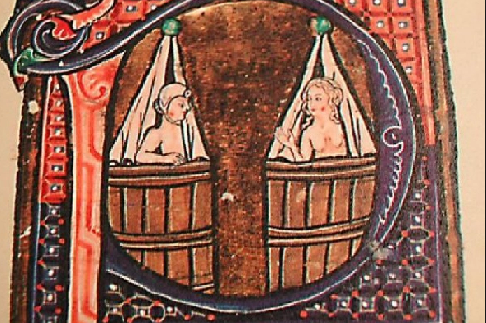
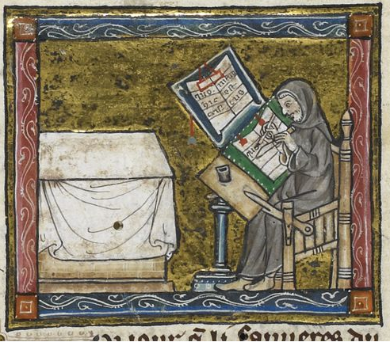

Going Medieval

[Skip to content](https://going-medieval.com/#content)

# [Going Medieval](https://going-medieval.com/)

Medieval History, Pop Culture, Swearing

- [Home](https://going-medieval.com/)
- [About](https://going-medieval.com/about/)
- [Contact](https://going-medieval.com/contact/)

## [I assure you, medieval people bathed.](https://going-medieval.com/2019/08/02/i-assure-you-medieval-people-bathed/)

I can’t believe I have to write this down right now, but my dear friends, medieval people bathed regularly.

Yes. I assure you. I am very serious. It is true.

In fact, medieval people *loved* a bath and can in many ways be considered a bathing culture, much in the way that say, Japan is now. Medieval people also very much valued being clean generally in an almost religious way.

This is not to say that getting clean was as easy for medieval people as it is for us now. But medieval people were very clever and had ways of getting around that.

 [Continue reading “I assure you, medieval people bathed.”](https://going-medieval.com/2019/08/02/i-assure-you-medieval-people-bathed/#more-844)

Posted on [August 2, 2019](https://going-medieval.com/2019/08/02/i-assure-you-medieval-people-bathed/)/Tags [bathing](https://going-medieval.com/tag/bathing/), [history of medicine](https://going-medieval.com/tag/history-of-medicine/), [Medieval History](https://going-medieval.com/tag/medieval-history/), [medieval hygine](https://going-medieval.com/tag/medieval-hygine/), [medieval medicine](https://going-medieval.com/tag/medieval-medicine/), [medieval myths](https://going-medieval.com/tag/medieval-myths/), [social history](https://going-medieval.com/tag/social-history/)/[1 Comment on I assure you, medieval people bathed.](https://going-medieval.com/2019/08/02/i-assure-you-medieval-people-bathed/#comments)

## [On Virtual Tours of Medieval London](https://going-medieval.com/2019/07/30/on-virtual-tours-of-medieval-london/)

Pals! Did you know that when I am not writing you swear filled screeds over here, I also work with [Placecloud,](https://www.placecloud.io/) where I make site-specific podcasts and videos about London?

Well I do! I’ve got several placecasts about the sites of medieval and early modern sex work there, including some videos, but most excitingly I also have a new virtual tour online there – [Eleanor Janega’s London.](https://www.placecloud.io/eleanor-janegas-london-2)

If you want to take a virtual walk around some of my favourite medieval London locations, this is the way to do it.

Enjoy!

Posted on [July 30, 2019](https://going-medieval.com/2019/07/30/on-virtual-tours-of-medieval-london/)/Tags [History of London](https://going-medieval.com/tag/history-of-london/), [London](https://going-medieval.com/tag/london/), [Medieval History](https://going-medieval.com/tag/medieval-history/), [tours](https://going-medieval.com/tag/tours/)/[Leave a comment on On Virtual Tours of Medieval London](https://going-medieval.com/2019/07/30/on-virtual-tours-of-medieval-london/#respond)

## [On colonialism, imperialism, and ignoring medieval history](https://going-medieval.com/2019/07/26/on-colonialism-imperialism-and-ignoring-medieval-history/)

We have a lot of fun, don’t we, when we talk about how people argue that the medieval period [was the Dark Ages](https://going-medieval.com/2017/05/26/theres-no-such-thing-as-the-dark-ages-but-ok/) based on the fact that the feel some type of way about it? Now, can I call people who think this ridiculously incredulous and basic? Yes. And I do. Thanks for asking. Having said that, the general ignorance of the medieval period is not from nothing.

On the one hand, you could argue that the idea that the middle ages was a bad time where people were generally stupid, unwashed, and rolling about in the muck on medieval people’s own conceptions of knowledge. As [Sara has pointed out to us before](https://going-medieval.com/2019/06/06/on-qanon-and-systems-of-knowledge/), medieval people considered themselves to be attempting to access a perfect knowledge which had been deteriorating since the fall of man. As a result, they attempted to emulate the knowledge of the people who came before them – i.e. Roman and Hellenic thinkers. They thought that past systems of knowledge were inherently better than their own, and, well, it’s hard not to take people at their word, you know?

But let’s be real, that is absolutely not the main reason people think the medieval period was a stupid time. That idea comes squarely from the way we tend to uphold the (frankly, misapplied) [idea of the Renaissance](https://going-medieval.com/2017/07/25/on-the-concept-of-the-renaissance-and-outkasts-hey-ya/), and also the fact that people [simply aren’t taught about](https://support.office.com/en-us/article/share-onedrive-files-and-folders-9fcc2f7d-de0c-4cec-93b0-a82024800c07) the medieval period other than as a contrast to said Renaissance.

Now here is the thing, there are a lot of reasons why this has happened. Part of it is down to the fact that the medieval period is hard to teach because everywhere is so different. Part of it is because if people aren’t taught about something, then odds are *they *can’t teach about it later. And part of it is that if you are taught over and over again that the medieval period was Very Bad and that the Renaissance saved us all from its darkness, then you believe that.

Today we are talking about *why* it is that this particular narrative is the one taught in classes all across the white world, and I regret to inform you that the answer is colonial imperialism. Yay.

 [Continue reading “On colonialism, imperialism, and ignoring medieval history”](https://going-medieval.com/2019/07/26/on-colonialism-imperialism-and-ignoring-medieval-history/#more-815)

Posted on [July 26, 2019](https://going-medieval.com/2019/07/26/on-colonialism-imperialism-and-ignoring-medieval-history/)/Tags [colonial history](https://going-medieval.com/tag/colonial-history/), [colonialism](https://going-medieval.com/tag/colonialism/), [historiography](https://going-medieval.com/tag/historiography/), [Imperial History](https://going-medieval.com/tag/imperial-history/), [Medieval History](https://going-medieval.com/tag/medieval-history/)/[Leave a comment on On colonialism, imperialism, and ignoring medieval history](https://going-medieval.com/2019/07/26/on-colonialism-imperialism-and-ignoring-medieval-history/#respond)

## [On city walls, symbolism, and being behind the residents’ gates at the Barbican](https://going-medieval.com/2019/06/28/on-city-walls-symbolism-and-being-behind-the-residents-gates-at-the-barbican/)

This week class is outside at the Barbican, where we talk about the London city wall. Enjoy!

* * *

For more on belonging in the medieval period see:

[On sexualising the “other”](https://going-medieval.com/2019/06/21/on-sexualising-the-other/)

Posted on [June 28, 2019](https://going-medieval.com/2019/06/28/on-city-walls-symbolism-and-being-behind-the-residents-gates-at-the-barbican/)/Tags [Belonging](https://going-medieval.com/tag/belonging/), [history of sex](https://going-medieval.com/tag/history-of-sex/), [London](https://going-medieval.com/tag/london/), [Medieval History](https://going-medieval.com/tag/medieval-history/), [The Barbican](https://going-medieval.com/tag/the-barbican/), [Urban History](https://going-medieval.com/tag/urban-history/)/[Leave a comment on On city walls, symbolism, and being behind the residents’ gates at the Barbican](https://going-medieval.com/2019/06/28/on-city-walls-symbolism-and-being-behind-the-residents-gates-at-the-barbican/#respond)

## [On sexualising the “other”](https://going-medieval.com/2019/06/21/on-sexualising-the-other/)

Friends, we are as ever living in a society that spends a lot of time and energy attempting to uphold what it sees as “normal”. Normality, after all, doesn’t police itself, or even hold up as a concept without strenuous effort from the people invested in it. What we’re thinking about today is that in our society over time if something isn’t “normal” it is probably also sexual. Because sexual stuff is bad and therefore Not Normal and what we in the overthinking stuff game tend to refer to as “other”.

The other can vary from society and society and place to place, but here in Europe and in the areas that Europeans subjugated there is an underlying default, and that is a white straight dude. This was certainly true in medieval Europe, where, as you may have noticed men bossed everyone the fuck around and decided that they were defo the norm.

 [Continue reading “On sexualising the “other””](https://going-medieval.com/2019/06/21/on-sexualising-the-other/#more-793)

Posted on [June 21, 2019](https://going-medieval.com/2019/06/21/on-sexualising-the-other/)/Tags [history of sex](https://going-medieval.com/tag/history-of-sex/), [hypersexualisation](https://going-medieval.com/tag/hypersexualisation/), [Medieval History](https://going-medieval.com/tag/medieval-history/), [medieval philosophy](https://going-medieval.com/tag/medieval-philosophy/), [medieval sex](https://going-medieval.com/tag/medieval-sex/), [social history](https://going-medieval.com/tag/social-history/), [the other](https://going-medieval.com/tag/the-other/)/[Leave a comment on On sexualising the “other”](https://going-medieval.com/2019/06/21/on-sexualising-the-other/#respond)

## [On Jezebel, makeup, and other apocalyptic signs](https://going-medieval.com/2019/06/14/on-jezebel-makeup-and-other-apocalyptic-signs/)

Friends, today is a great day, for it was with deep pleasure that I found a spicy medieval take on women on the twitter TL. Check out Denise with the big medieval vibes:

Friends, I love everything about this garbage take. As regular readers will note, this is a very medieval way of looking at women because it sees them as [sexual aggressors](https://going-medieval.com/2017/05/26/on-women-and-desire/). Here women are Too Horny to FunctionTM and actively going about seducing poor hapless men into impregnating them. On display we *also *have the medieval idea of sex as an [enervating agent that just sort of happens at men](https://going-medieval.com/2019/04/01/on-the-objectification-of-sex/). A woman lubes up her legs (???) and next thing you know they have been tricked – tricked I say! – into the good old PIV which results in pregnancy, AKA[the only real sex](https://going-medieval.com/2017/08/02/the-history-of-penis-in-vagina-as-default-sex-at-bish/). That’s just how the world works.

What I love about this, and what we haven’t talked about here yet, however, is the connection that your girl Denise is making between makeup and lube (again, deeply, from the bottom of my heart ????) and sexual chaos. (Side note – sexy chaotic is where you’ll find me on any standard Sexy/Neutral/Asexual alignment chart, just so you know.)

 [Continue reading “On Jezebel, makeup, and other apocalyptic signs”](https://going-medieval.com/2019/06/14/on-jezebel-makeup-and-other-apocalyptic-signs/#more-786)

Posted on [June 14, 2019](https://going-medieval.com/2019/06/14/on-jezebel-makeup-and-other-apocalyptic-signs/)/Tags [Apocalypse](https://going-medieval.com/tag/apocalypse/), [history of religion](https://going-medieval.com/tag/history-of-religion/), [history of sex](https://going-medieval.com/tag/history-of-sex/), [history of women](https://going-medieval.com/tag/history-of-women/), [Jezebel](https://going-medieval.com/tag/jezebel/), [makeup](https://going-medieval.com/tag/makeup/), [Medieval History](https://going-medieval.com/tag/medieval-history/)/[Leave a comment on On Jezebel, makeup, and other apocalyptic signs](https://going-medieval.com/2019/06/14/on-jezebel-makeup-and-other-apocalyptic-signs/#respond)

## [On QAnon and Systems of Knowledge](https://going-medieval.com/2019/06/06/on-qanon-and-systems-of-knowledge/)

*Today at Going Medieval HQ we are excited to have a guest blog by kick-ass art historian working on medieval medical visual culture, and the other half of [Medieval Dick Twitter](https://twitter.com/hashtag/medievaldicktwitter?src=hash), Dr Sara Öberg-Strådal. [Follow her on Twitter](https://twitter.com/tinyredbook) for excellent meme action, updates about growing your own medieval pigment garden, and generally correct opinions.*

If you’re blessed enough to not have heard about QAnon. Congratulations. You should leave this post right now and go and do something nice for yourself.

[QAnon](https://en.wikipedia.org/wiki/QAnon) is a super strange radical internet cult that believes that Donald Trump is a divine saviour who is working against the Deep State to save America. Every other day there is a new coded message, a so-called “Q Drop”, predicting mass arrests and explaining that MS13 are bad because they are funded and run by Democrats. IDK. At best it is borderline incomprehensible, and at worst it is also super racist. Followers of Q will interpret any aspect of Trump’s presentation and twitter presence (his back-combed hair signified coming mass arrests) and personal biography (see the fairly fringe belief that [Trump can time travel](https://www.stitcher.com/podcast/qanon-anonymous/e/58701660?autoplay=true) and did so to get his uncle to write some shitty children’s books to predict his rise to power).

 [Continue reading “On QAnon and Systems of Knowledge”](https://going-medieval.com/2019/06/06/on-qanon-and-systems-of-knowledge/#more-771)

Posted on [June 6, 2019](https://going-medieval.com/2019/06/06/on-qanon-and-systems-of-knowledge/)/Tags [history of philosophy](https://going-medieval.com/tag/history-of-philosophy/), [history of thought](https://going-medieval.com/tag/history-of-thought/), [Medieval History](https://going-medieval.com/tag/medieval-history/), [medieval philosophy](https://going-medieval.com/tag/medieval-philosophy/), [medieval religion](https://going-medieval.com/tag/medieval-religion/), [QAnon](https://going-medieval.com/tag/qanon/)/[1 Comment on On QAnon and Systems of Knowledge](https://going-medieval.com/2019/06/06/on-qanon-and-systems-of-knowledge/#comments)

## More?

Have a burning medieval history question? Let me know.
I tweet over here:
https://twitter.com/GoingMedieval
Search for: