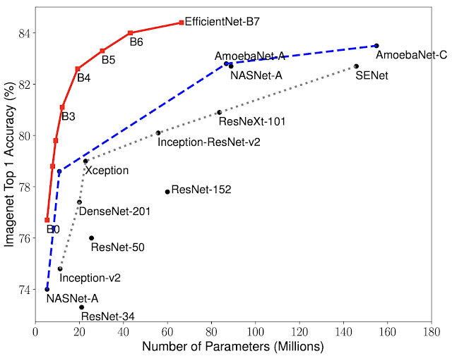

Google AI Blog: EfficientNet: Improving Accuracy and Efficiency through AutoML and Model Scaling

## [EfficientNet: Improving Accuracy and Efficiency through AutoML and Model Scaling](http://ai.googleblog.com/2019/05/efficientnet-improving-accuracy-and.html)

Wednesday, May 29, 2019

 Posted by Mingxing Tan, Staff Software Engineer and Quoc V. Le, Principal Scientist, Google AI

[Convolutional neural networks](https://en.wikipedia.org/wiki/Convolutional_neural_network) (CNNs) are commonly developed at a fixed resource cost, and then scaled up in order to achieve better accuracy when more resources are made available. For example, [ResNet](http://www.arxiv.org/abs/1512.03385) can be scaled up from ResNet-18 to ResNet-200 by increasing the number of layers, and recently, [GPipe](https://ai.googleblog.com/2019/03/introducing-gpipe-open-source-library.html) achieved 84.3% [ImageNet](http://www.image-net.org/) top-1 accuracy by scaling up a baseline CNN by a factor of four. The conventional practice for model scaling is to arbitrarily increase the CNN depth or width, or to use larger input image resolution for training and evaluation. While these methods do improve accuracy, they usually require tedious manual tuning, and still often yield suboptimal performance. What if, instead, we could find a more principled method to scale up a CNN to obtain better accuracy and efficiency?

In our [ICML 2019](https://icml.cc/Conferences/2019) paper, “[EfficientNet: Rethinking Model Scaling for Convolutional Neural Networks](https://arxiv.org/abs/1905.11946)”, we propose a novel model scaling method that uses a simple yet highly effective *compound coefficient* to scale up CNNs in a more structured manner. Unlike conventional approaches that arbitrarily scale network dimensions, such as width, depth and resolution, our method uniformly scales each dimension with a fixed set of scaling coefficients. Powered by this novel scaling method and recent progress on [AutoML](http://ai.googleblog.com/2018/08/mnasnet-towards-automating-design-of.html), we have developed a family of models, called EfficientNets, which superpass state-of-the-art accuracy with up to 10x better efficiency (smaller and faster).

**Compound Model Scaling: A Better Way to Scale Up CNNs**

In order to understand the effect of scaling the network, we systematically studied the impact of scaling different dimensions of the model. While scaling individual dimensions improves model performance, we observed that balancing all dimensions of the network—width, depth, and image resolution—against the available resources would best improve overall performance.

The first step in the compound scaling method is to perform a [grid search](https://en.wikipedia.org/wiki/Hyperparameter_optimization#Grid_search) to find the relationship between different scaling dimensions of the baseline network under a fixed resource constraint (e.g., 2x more [FLOPS](https://en.wikipedia.org/wiki/FLOPS)).This determines the appropriate scaling coefficient for each of the dimensions mentioned above. We then apply those coefficients to scale up the baseline network to the desired target model size or computational budget.

|     |
| --- |
|  |
| Comparison of different scaling methods. Unlike conventional scaling methods (b)-(d) that arbitrary scale a single dimension of the network, our compound scaling method uniformly scales up all dimensions in a principled way. |

This compound scaling method consistently improves model accuracy and efficiency for scaling up existing models such as [MobileNet](https://arxiv.org/abs/1704.04861) (+1.4% imagenet accuracy), and [ResNet](https://arxiv.org/abs/1512.03385) (+0.7%), compared to conventional scaling methods.

**EfficientNet Architecture**

The effectiveness of model scaling also relies heavily on the baseline network. So, to further improve performance, we have also developed a new baseline network by performing a [neural architecture search](https://en.wikipedia.org/wiki/Neural_architecture_search) using the [AutoML MNAS framework](https://ai.googleblog.com/2018/08/mnasnet-towards-automating-design-of.html), which optimizes both accuracy and efficiency (FLOPS). The resulting architecture uses mobile inverted bottleneck convolution (MBConv), similar to [MobileNetV2](https://arxiv.org/abs/1801.04381) and [MnasNet](https://arxiv.org/abs/1807.11626), but is slightly larger due to an increased FLOP budget. We then scale up the baseline network to obtain a family of models, called *EfficientNets*.

|     |
| --- |
|  |
| The architecture for our baseline network EfficientNet-B0 is simple and clean, making it easier to scale and generalize. |

**EfficientNet Performance **

We have compared our EfficientNets with other existing CNNs on [ImageNet](http://www.image-net.org/). In general, the EfficientNet models achieve both higher accuracy and better efficiency over existing CNNs, reducing parameter size and FLOPS by an order of magnitude. For example, in the high-accuracy regime, our EfficientNet-B7 reaches state-of-the-art 84.4% top-1 / 97.1% top-5 accuracy on ImageNet, while being 8.4x smaller and 6.1x faster on CPU inference than the previous [Gpipe](https://arxiv.org/abs/1811.06965). Compared with the widely used [ResNet-50](http://www.arxiv.org/abs/1512.03385), our EfficientNet-B4 uses similar FLOPS, while improving the top-1 accuracy from 76.3% of ResNet-50 to 82.6% (+6.3%).

|     |
| --- |
|  |
| Model Size vs. Accuracy Comparison. EfficientNet-B0 is the baseline network developed by [AutoML MNAS](https://ai.googleblog.com/2018/08/mnasnet-towards-automating-design-of.html), while Efficient-B1 to B7 are obtained by scaling up the baseline network. In particular, our EfficientNet-B7 achieves new state-of-the-art 84.4% top-1 / 97.1% top-5 accuracy, while being 8.4x smaller than the best existing CNN. |

Though EfficientNets perform well on ImageNet, to be most useful, they should also transfer to other datasets. To evaluate this, we tested EfficientNets on eight widely used transfer learning datasets. EfficientNets achieved state-of-the-art accuracy in 5 out of the 8 datasets, such as [CIFAR-100](https://www.cs.toronto.edu/~kriz/cifar.html) (91.7%) and [Flowers](http://www.robots.ox.ac.uk/~vgg/data/flowers/) (98.8%), with an order of magnitude fewer parameters (up to 21x parameter reduction), suggesting that our EfficientNets also transfer well.

By providing significant improvements to model efficiency, we expect EfficientNets could potentially serve as a new foundation for future computer vision tasks. Therefore, we have open-sourced all EfficientNet models, which we hope can benefit the larger machine learning community. You can find the EfficientNet source code and [TPU](https://cloud.google.com/tpu/) training scripts [here](https://github.com/tensorflow/tpu/tree/master/models/official/efficientnet).

**Acknowledgements:**

*Special thanks to Hongkun Yu, Ruoming Pang, Vijay Vasudevan, Alok Aggarwal, Barret Zoph, Xianzhi Du, Xiaodan Song, Samy Bengio, Jeff Dean, and the Google Brain team.*

