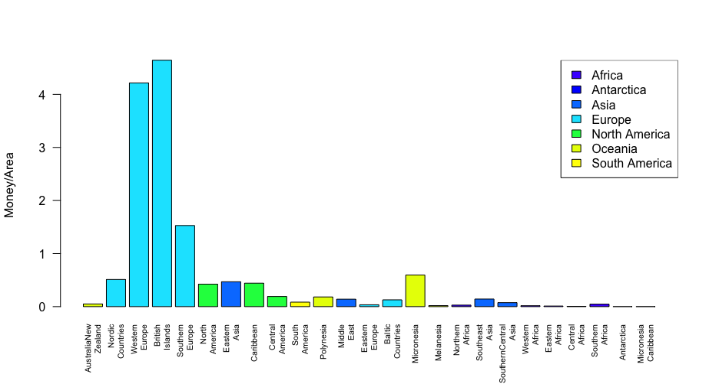
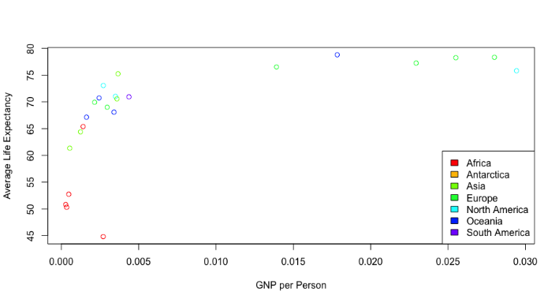

Google Cloud Platform for Data Scientists: Using R with Google Cloud SQL for MySQL | Google Cloud Big Data and Machine Learning Blog  |  Google Cloud Platform

 

## [Google Cloud Platform for Data Scientists: Using R with Google Cloud SQL for MySQL](https://cloud.google.com/blog/big-data/2017/03/google-cloud-platform-for-data-scientists-using-r-with-google-cloud-sql-for-mysql.html)

Wednesday, March 22, 2017

*By Gus Class, Developer Programs Engineer, Google Cloud*

**By connecting R to Cloud SQL, you can take advantage of all R features on top of a scalable, fully-managed MySQL service.**

Many developers working with relational data store aspects of business logic, customer metrics and other business data in a MySQL database. When data scientists or analysts outside the software development team analyze the data for insights, they may well choose the popular [R programming language](https://www.r-project.org/about.html) for creating statistical summaries and publication-quality visualizations of the data. But first, to get to the data from the shared data store, those users will need to connect to MySQL from R.

[Google Cloud SQL](https://cloud.google.com/sql/) is a relational database service in [Google Cloud Platform](https://cloud.google.com/) (GCP) that's easy to maintain and access from a variety of programming languages and data platforms. Using Cloud SQL, developers who are familiar with PostgreSQL (public beta [announced](https://cloudplatform.googleblog.com/2017/03/Google-Cloud-Platform-bolsters-support-for-relational-databases.html) at Google Cloud NEXT '17) or MySQL can record, manipulate and migrate data without needing to manage their own hardware and can scale up technical infrastructure without time-consuming migrations.

Connecting R to Cloud SQL Second Generation is as easy as connecting to any MySQL database. The only difference is that you'll need to use the Cloud SQL Proxy for bridging the connection between the R client and Cloud SQL. That difference aside, you can access Cloud SQL from your R programs just as you would any other SQL database.

In this post—part of an open-ended series devoted to using GCP as a platform for doing data science at scale—I’ll take you through the following high-level steps:

1. Create a Cloud SQL Instance
2. Configure access to the instance
3. Add a user and verify everything is working
4. Query the data using R
Let's get started.

### Create a Cloud SQL Instance

Before continuing, note the following:

- This tutorial assumes that you're using a [Cloud SQL Second Generation](https://cloud.google.com/sql/docs/mysql/1st-2nd-gen-differences) instance.
- The instance value passed to commands is typically the instance connection name, which is in the properties page of each Cloud SQL instance, selected from the [Cloud SQL instances page](https://console.cloud.google.com/sql/instances).

You must first create a Cloud SQL instance, which is described in detail in [the Cloud SQL Quickstart](https://cloud.google.com/sql/docs/quickstart). After you've created a Cloud SQL Instance, move on to the next step.

### Configure access to the instance

Next, you'll need to install the Cloud SQL Proxy and configure access to your Cloud SQL instance.

If you haven't already, install a MySQL client on your machine. On Windows, you use the [MySQL installer](https://dev.mysql.com/downloads/installer/). On OSX, you can install the mysql package using [Homebrew](http://brew.sh/):

hdr_strong
`brew install mysql`

Install [the Cloud SQL Proxy](https://cloud.google.com/sql/docs/mysql-connect-proxy#install) as described in the documentation. As an example, the following command will download the proxy for OSX and enable execute permissions:

hdr_strong

	curl -o cloud_sql_proxy https://dl.google.com/cloudsql/cloud_sql_proxy.darwin.amd64 &&
	chmod +x cloud_sql_proxy

Now that you have the requisite tools and a Cloud SQL instance, it's time to configure the root user password and look up the Instance Connection Name from the developer console.

- [Configure the root user account](https://cloud.google.com/sql/docs/create-manage-user-mysql) as described in the Cloud SQL documentation.
- Select the Cloud SQL instance you created from the [Cloud SQL instances page](https://console.cloud.google.com/sql/instances).
- After you select the Cloud SQL instance, find the **Instance Connection Name** from the properties listed at the bottom of the page. The connection name is necessary for connecting to your Cloud SQL instances.

### Add a user and verify everything works

If everything's working, you should now be able to connect the Cloud SQL Proxy to your Cloud SQL instance using the connection name from the previous step.

First, in a bash shell, use the **cloud_sql_proxy **command to connect to your instance:

hdr_strong
`cloud_sql_proxy -instances=myprojectname:us-central1:instanceid=tcp:3306`

If the command succeeds, you'll see the following message returned to your shell:

hdr_strong
`Ready for new connections`

You now can connect to the Cloud SQL proxy using familiar MySQL tools. Connect to the MySQL proxy using the `mysql` commandline client:

hdr_strong
`mysql -h 127.0.0.1 -u root -p`

From the `mysql` commandline client, add a user so that you don't need to connect as root:

hdr_strong

	use mysql;
	CREATE USER 'username'@'%' identified by 'password';
	grant all privileges on *.* to 'username'@'%' with grant option;

Disconnect from the server and then flush the privileges table using mysqladmin:

hdr_strong

	mysqladmin -u root -p -h 127.0.0.1 flush-privileges
	mysqladmin -u root -p -h 127.0.0.1 flush-tables

Now you should be able to connect as the user using the `mysql` client:
hdr_strong
`mysql -h 127.0.0.1 -u username -p`

Verify everything's working by creating an example database and a basic table for testing:

hdr_strong

	create database example;

	use example;

	create table test_r (
	    id int not null auto_increment primary key,
	    value varchar(64),
	    cur_time timestamp(3)
	);

Insert some data into the new table:
hdr_strong
`insert into test_r(value) values ('test data');`

If everything's working, go ahead and add a few more rows to the table, if you want.

### 3. Query the data using R

Now it's time to access the table using R. First, install the [R MySQL adapter package](https://cran.r-project.org/web/packages/RMySQL/README.html) using the following R REPL code:

hdr_strong
`install.packages("RMySQL")`

Load the library and create a helper function to return a connection to the Cloud SQL instance using the proxy that you started in the previous section:

hdr_strong

	# Load the DBI library
	library(DBI)

	# Helper for getting new connection to Cloud SQL
	getSqlConnection <- function(){
	  con <-
	    dbConnect(
	      RMySQL::MySQL(),
	      username = 'username',
	      password = 'password',
	      host = '127.0.0.1',
	      dbname = 'example'
	    ) # TODO: use a configuration group `group = "my-db")`
	  return(con)
	}

Now, you can run commands and store the results in R variables—for example, the following R REPL code:

hdr_strong

	conn <- getSqlConnection()
	res <- dbListTables(conn)
	print(res)
	dbDisconnect(conn) # Closes all open connections

lists the tables in the database to which you connected. To query for data in the table we created in the previous step, do the following from R:

hdr_strong

	conn <- getSqlConnection()
	res <- dbSendQuery(conn, "select * from test_r")
	data <- dbFetch(res)
	print(data)
	dbDisconnect(conn)

Now you can access the table rows in the data variable, for example, you can print the value column as:

hdr_strong
`print(data['value'])`

Now you can manipulate and plot table data directly from the Cloud SQL instance in R.

### Plotting data from sample databases

[MySQL provides various sample databases](http://dev.mysql.com/doc/index-other.html) that you can use for exploring data. For this final example, we'll be using the [MySQL World database](http://downloads.mysql.com/docs/world.sql.zip) that contains data about countries and cities of the world. Let's start by importing the data.

If it's not already running, start the Cloud SQL proxy from your shell using the `cloud_sql_proxy` command:

hdr_strong
`cloud_sql_proxy -instances=myprojectname:us-central1:instanceid=tcp:3306`

After you have [downloaded the zip file](http://downloads.mysql.com/docs/world.sql.zip), unzip it into a temporary folder, connect to the Cloud SQL proxy, and then import the sample table using the mysql client from your shell:

hdr_strong

	mysql -h 127.0.0.1 -u root -p
	source world.sql

Now you can look at the world data from Cloud SQL from the mysql client:
hdr_strong

	use world;
	show tables;
	desc country;

After retrieving the table descriptions, open your R REPL and query for summary data about countries:

hdr_strong

	# Load the DBI library
	library(DBI)

	# Helper for getting new connection to Cloud SQL
	getSqlConnection <- function(){
	  con <-
	    dbConnect(
	      RMySQL::MySQL(),
	      username = 'username',
	      password = 'password',
	      host = '127.0.0.1',
	      dbname = 'world'
	    ) # TODO: use a configuration group `group = "my-db")`
	  return(con)
	}

	conn <- getSqlConnection()

	res <- dbSendQuery(conn, paste("select region, continent, sum(gnp) as TotalGNP,",
	     "sum(surfacearea) as TotalSurface, sum(population) as TotalPop, ",
	     "avg(lifeexpectancy) from country group by continent, region order by ",
	     "avg(lifeexpectancy) desc;") )

	data <- dbFetch(res)
	print(data)
	dbDisconnect(conn)

Now the world country data is ready for manipulation and plotting. Let's create a bar plot of Regional GNP Units (money) relative to land area using the following R code:

hdr_strong

	# Create mapping of continent to color
	colIndex <- c(1:7)
	countries <- c('Africa', 'Antarctica', 'Asia', 'Europe',
	    'North America', 'Oceania', 'South America')
	names(colIndex) <- countries

	barplot(data$TotalGNP / data$TotalSurface,
	        ylab = "Money/Area",
	        names.arg = gsub("\nand\n", "", gsub("[ |\\/]", "\n",
	            data$region)),
	        las=2,
	        cex.names=2/3,
	        col=topo.colors(8)[colIndex[data$continent]])

	legend("topright", fill=topo.colors(8)[colIndex[countries]],
	    countries)

There are some interesting outliers in the data, such as British Islands and Western Europe.

As another example, let’s say you’re interested in the relationship between life expectancy and GNP per person. The following R REPL generates a plot that could lead to insights:

hdr_strong

	plot(data$TotalGNP / data$TotalPop, data$`avg(lifeexpectancy)`,
	    xlab="GNP per Person", ylab="Average Life Expectancy",
	    col=rainbow(8)[colIndex[data$continent]])

	legend("bottomright", fill=rainbow(8)[colIndex[countries]],
	    countries)

You can see there's a diminishing return in the increase of life expectancy relative to GNP around 5-thousandths of a GNP unit per person, that Antarctica doesn't have any living people and that African regions have lower life expectancy as well as lower GNP per person.

### Next steps

In this example, we created a Cloud SQL database using the Google Cloud console, enabled access to the database, verified access worked, populated a sample database and then plotted data from the database.

Note that in production systems, you typically will want to be performing analytical operations outside of your master database. For this task, you could [create a READ replica](https://cloud.google.com/sql/docs/replication/create-replica) of your production database and then would use that replicant for long-running queries to avoid affecting the performance of your master database.

As you further improve your database management, you may want to programmatically perform these operations as demonstrated in the [Cloud SQL sample code](https://cloud.google.com/sql/docs/admin-api/libraries). If you're working with data that exceeds the limits of MySQL's scalability, you should check out [Google BigQuery](https://cloud.google.com/bigquery/). (We’ll cover that subject in a future blog post.)

To dive deeper into using R with Cloud SQL:

- Check out the [language reference for R](https://cran.r-project.org/doc/manuals/R-lang.html) on the CRAN site
- Explore [Google Cloud SQL documentation](https://cloud.google.com/sql/docs/)