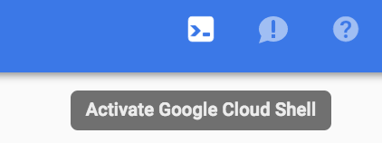
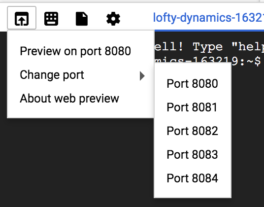

Google Cloud Shell, the free playground – Google Cloud Platform — Community – Medium

# Google Cloud Shell, the free playground

You may not notice, but there is a small shell icon on the top right side in Google Cloud console.

Activate Google Cloud Shell

There you have it, the free playground. You can read more about it at https://cloud.google.com/shell/.

You may wonder what is special about a web shell created by Google to make it easy for you to configure and use Google Cloud. Well, you can do more than “Google Cloud” with it.

Google Cloud Shell is a f1-micro instance running Debian preinstalled with developer tools and has a home directory that*** persists across sessions***.

The home directory is 5GB of persistent disk storage. That means you can bring over your `.zshrc`, install your tools in `$HOME`, put the binaries in `$HOME/bin` and you’re safe.

I am not saying you should turn it into your development environment, I am only highlighting the possibilities.

To put an icing on the cake, you can even preview a web app as long as the server is listening on ports 8080–8084.

Web Preview

One of my use cases for it is as a Docker playground. Why trouble your MacBook and use your bandwidth to try out stuffs when you can use Google’s for free.

The only request I have for Google is to make it possible for users to connect to the Cloud Shell via SSH.

It is not a powerful instance (f1-micro) and does not have much storage space (5GB) but it is definitely useful and it is free.