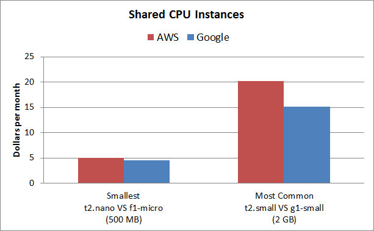
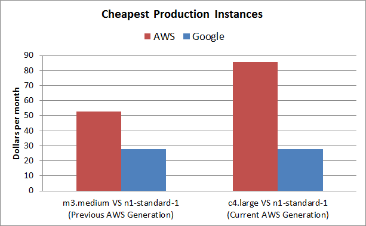
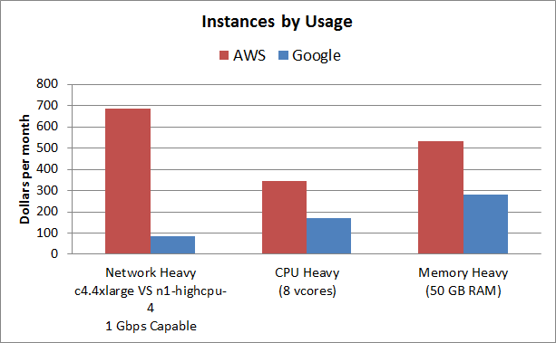
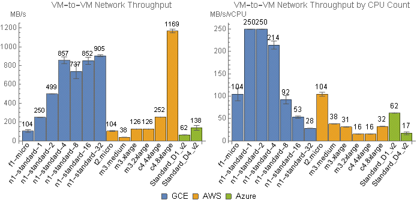
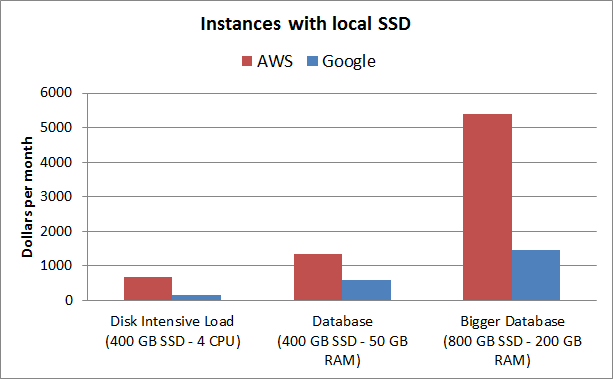
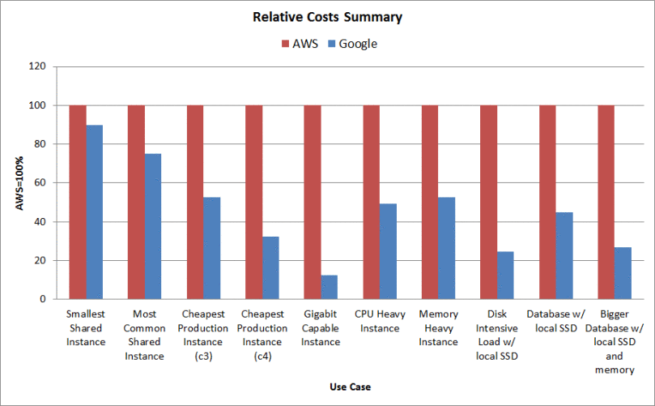

Google Cloud is 50% cheaper than AWS

210 Votes

Let’s revisit Google and Amazon pricing since the [AWS November 2016 Price Reduction](https://aws.amazon.com/blogs/aws/ec2-price-reduction-c4-m4-and-t2-instances/).

We’ll analyse instance costs, for various workloads and usages. All prices are given in dollars per month (720 hours) for servers located in Europe (eu-west-1).

# Shared CPU Instances

Shared CPU instances give only a bit of CPU. The physical processor is over allocated and shared with many other instances running on the same host. A shared CPU instance may burst to 100% CPU usage for short periods but it may also be starved of CPU and paused. Note that these instances are cheap but they are not reliable for non-negligible continuous workloads.

The smallest instances on both cloud is 500MB and a few percent of CPU. That’s the cheapest instance. It’s usable for testing and minimal needs (can’t do much with only 5% of CPU and 500MB).

The infamous t2.small and it’s rival the g1-small are usually the most common instance types in use. They come with 2GB of memory and a bit of CPU. It’s cheap and good enough for many use cases (excluding production and time critical processing, which need dedicated CPU time).

# The Cheapest Production Instances

Production instances are all the instances with dedicated CPU time (i.e. everything but the shared CPU instances).

**Most services will just run on the cheapest production instance available. *That* instance is very important because it determines the entry price and the specifications for everything.**

The cheapest production instance on Google Cloud is the n1-standard-1 which gives 1 CPU and 4 GB of memory.

AWS is more complex. The m3.medium is 1 CPU and 4 GB of memory. The c4.large is 2 CPU and 4 GB of memory.

m3/c3 are the previous family generation (pre-2015), using older hardware and an *ancient* virtualisation technology. c4/m4 are the current generation, it has enhanced networking and reserved bandwidth for EBS, among other system improvements.

**Either way, the Google entry-level instance is significantly cheaper than both AWS entry-level instances. There will be a lot of these running, expect massive costs savings by using Google cloud.**

* * *

I’m a believer that one should optimize for manageability and not raw costs. That means adopting c4/m4 as the standard for deployments (instead of c3/m3).

Given this decision, the smallest production instance on AWS is the c4.large (2 CPU, 4GB memory), a rather big instance when compared to the n1-standard-1 (1 CPU, 4GB memory). **Why are we forced to pay for two CPUs as the minimal choice on AWS? That does set a high base price.**

Not only Google is cheaper because it’s more competitive but it also offers more tailored options. The result is a massive 68% discount on the most commonly used production instance.

**Personal Note**: I would criticize the choice of AWS to discontinue the line of m4.medium instance type (1 CPU).

* * *

# Instances by usage

A server has 3 dimensions of specifications: CPU performances, memory size and network speed.

Most applications only have a hard requirement in a single dimension. We’ll analyse the pricing separately for each usage pattern.

## Network Heavy

**Typical Consumers**: load balancers, file transfers, uploads/downloads, backups and generally speaking everything that uses the network.

What should we order to have  1Gbps and how much will it be?

- The minimum on Google Cloud is the n1-highcpu-4 instance (4 CPU, 4 GB memory).
- The minimum on AWS is the c4.4xlarge instance (16 CPU, 30 GB memory).

AWS bandwidth allowance is limited and correlated to the instance size. The big instances -with decent bandwidth- are incredibly expensive.

To give a point of comparison, the c4|m4|r3.large instances have a hard cap at 220 Mbits/s of network traffic (Note: It also applies internally within a VPC).

[Source: Network and cloud storage benchmark in 2015](http://blog.zachbjornson.com/2015/12/29/cloud-storage-performance.html)

**All Google instances have significantly faster network than the equivalent [and even bigger] AWS instances, to the point where they’re not even playing in the same league.**

Google has been designing networks and manufacturing their own equipment for decades. It’s fair to assume than AWS doesn’t have the technology to compete.

## CPU

**Typical Consumers**: web servers, data analysis, simulations, processing and computations.

**Google is cheaper per CPU.**

Google CPU instances have half the memory of AWS CPU instances[1]. While that could have justified a 10% difference, it doesn’t justify double[2].

**Note**: The performances per CPU are equivalent on both cloud (though the CPU models and serial numbers may vary).

[1] A sane design decision. Most CPU bound workloads don’t need much memory. (Note: if they do, they can be run on “*standard*” instances).

[2] Pricing is mostly linked to CPU count. Additional memory is cheap.

## Memory

**Typical Consumers**: database, caches and in-memory workloads.
**Google is cheaper per GB of memory.**

Google memory instances have 15% less memory than AWS CPU instances. While that could have justified a few percent difference, it sure as hell doesn’t justify double[2].

[2] Pricing is mostly linked to CPU count. Additional memory is cheap.

# Local SSD and Scaling Up

**There are software that can only scale up**, typically SQL databases. A database holding tons of data will **require fast local disks and truckloads of memory** to operate non-sluggishly.

Scaling up is the most typical use case for beefy dedicated servers, but we’re not gonna rent a single server in another place just for one application. The cloud provider will have to accommodate that need.

Google allows to attach local 400GB SSDs to any instance type ($85 a month per disk).

Some AWS instances comes with small local SSD (16-160GB), you’re out of luck if you need more space than that. The only option to get big local SSD is the special i2 instances family, they have specifications in powers of 800GB local SSD + 4 CPU + 15 GB RAM (for $655 a month).

**The Google SSD model is superior. It’s significantly more modular and cheaper (and more performant but that’s a different topic).**

The requirements to fulfil are between parenthesis.

**Disk Intensive Load**: A job that requires high volume fast disks (i.e. local SSD) but not much memory.

AWS forces you to buy a big instance (i2.xlarge) to get enough SSD space whereas Google allows you to attach a SSD to a *small* instance (n1-highcpu-4). **The lack of flexibility from AWS has a measurable impact, the AWS setup is 406% the costs of the Google setup to achieve the same need.**

**Database**: A typical database. Fast storage and sizeable memory.

**Bigger Database**: Sometimes there is no choice but to scale up, to whatever resources are commanded by the application.

On AWS (i2.8xlarge) 32 cores, 244GB memory, 2 x 800 GB local SSD in RAID1 (+ 6 SSD unused yet gotta pay for it).

On Google Cloud (n1-highmem-32): 32 cores, 208 GB memory, 4 x 375 GB local SSD in RAID10.

**This last number is meant to show that the lack of flexibility of AWS can (and will) snowball quickly. Only a very particular instance can fulfil the requirements, it comes with many cores and 4800 GB of unnecessary local SSD. The AWS bill is $4k (273%) higher than the equivalent setup on Google Cloud.**

# Custom Instances

Google offers [custom machine types](https://cloud.google.com/compute/docs/machine-types#custom_machine_types). You can pick how much CPU and memory you want, you’ll get that **exact** instance with a tailored pricing.

It is quite flexible. For instance, we could recreate any instance from AWS on Google Cloud.

Of course, there are physical bounds inherent to hardware (e.g. you can’t have a single core with 100 GB of memory).

# Reserved Instances

**Reserved Instances are bullshit! **

**Reserving capacity is a dangerous and antiquated pricing model that belongs to the era of the datacenter.**

The numbers given in this article do not account for any AWS reservation. However, they all account for Google [sustained use discount](https://cloud.google.com/compute/pricing#sustained_use) (30% **automatic** discount on instances that ran for the entire month).

If your infrastructure is so small that you can reserve all your 4 instances upfront, you should reconsider why you use AWS in the first place. [There are more appropriate and cheaper options available.](https://thehftguy.wordpress.com/2016/06/08/choosing-a-cloud-provider-amazon-aws-ec2-vs-google-compute-engine-vs-microsoft-azure-vs-ibm-softlayer-vs-linode-vs-digitalocean-vs-ovh-vs-hertzner/)

If your infrastructure is big enough that you have dozens of servers (or thousands), you should already be aware that:

1. **Long term commitment is a huge risk. Most people underestimate it.
**

2. **Predictions are always off. Most people are overconfident in their predictions. **

3. You are no exception to* most people.*
4. Reservation is a mess when having many AWS accounts (dev, staging, prod).
5. Anything that is testing/transient is too short-lived to be reserved.

6. Less than 50% of reservable stuff can actually be reserved (margin for change/error).

* * *

Most (people) managers are stubborn. If (you) your manager is stubborn and really insists on reserving instances, you should bet exclusively on “*1 year full upfront*“.

**Safety Warning**: There is no confirmation button when you purchase reserved instances. You can absolutely spend $73185 without seeing nor confirming an invoice.

* * *

# Conclusion

AWS was the first generation of cloud, Google is the second. The second generation is always better because it can learn from the mistakes of the first and it doesn’t have the old legacy to support.

**2016 should be remembered as the year Google became a better choice than AWS. If 50% cheaper is not a solid argument, I don’t know what is.**

* * *

**References**:

[Cloud Storage Performance](http://blog.zachbjornson.com/2015/12/29/cloud-storage-performance.html), a benchmark with graphs on network performance.

[Jupiter Rising: A Decade of Clos Topologies and Centralized Control in Google’s Datacenter Network](http://conferences.sigcomm.org/sigcomm/2015/pdf/papers/p183.pdf), A Google Research Paper, the story on what powers their internal network.

[Amazon does everything wrong, and Google does everything right](https://plus.google.com/+RipRowan/posts/eVeouesvaVX), A message by an employee from Amazon than Google, not directly relevant but still a good read.

Advertisements

### Share this article:

- [Click to share on Twitter (Opens in new window)](https://thehftguy.com/2016/11/18/google-cloud-is-50-cheaper-than-aws/?share=twitter&nb=1)
- [Click to share on Reddit (Opens in new window)](https://thehftguy.com/2016/11/18/google-cloud-is-50-cheaper-than-aws/?share=reddit&nb=1)
- [Click to share on Google+ (Opens in new window)](https://thehftguy.com/2016/11/18/google-cloud-is-50-cheaper-than-aws/?share=google-plus-1&nb=1)
- [434Share on Facebook (Opens in new window)434](https://thehftguy.com/2016/11/18/google-cloud-is-50-cheaper-than-aws/?share=facebook&nb=1)
- [618Click to share on LinkedIn (Opens in new window)618](https://thehftguy.com/2016/11/18/google-cloud-is-50-cheaper-than-aws/?share=linkedin&nb=1)
- [Click to share on Hacker News (Opens in new window)](https://thehftguy.com/2016/11/18/google-cloud-is-50-cheaper-than-aws/?share=custom-1474241584&nb=1)
- [Click to email (Opens in new window)](https://thehftguy.com/2016/11/18/google-cloud-is-50-cheaper-than-aws/?share=email&nb=1)
- [More](https://thehftguy.com/2016/11/18/google-cloud-is-50-cheaper-than-aws/#)

-

[Like](https://widgets.wp.com/likes/#)

- 
- 
- 
- 
- 
- 

[6 bloggers](https://widgets.wp.com/likes/#) like this.

#### [GCE vs AWS in 2016: Why you shouldn't use Amazon](https://thehftguy.com/2016/06/15/gce-vs-aws-in-2016-why-you-should-never-use-amazon/)

In "cloud"

[(L)](https://thehftguy.com/2016/06/08/choosing-a-cloud-provider-amazon-aws-ec2-vs-google-compute-engine-vs-microsoft-azure-vs-ibm-softlayer-vs-linode-vs-digitalocean-vs-ovh-vs-hertzner/)

#### [What's The Best Cloud Provider in 2016? AWS vs Digital Ocean vs Google Cloud vs OVH](https://thehftguy.com/2016/06/08/choosing-a-cloud-provider-amazon-aws-ec2-vs-google-compute-engine-vs-microsoft-azure-vs-ibm-softlayer-vs-linode-vs-digitalocean-vs-ovh-vs-hertzner/)

No worries, it's a lot simpler than it seems. Each cloud provider is oriented toward a different type of customer and usage. We grouped cloud providers by type. We'll explain what is the purpose of each type? How do they differ? Which one is the most appropriate per use case?…

In "cloud"

[(L)](https://thehftguy.com/2016/04/18/monitoring-in-the-cloud-datadog-vs-server-density-vs-stackdriver-vs-bmc-boundary-vs-newrelic/)

#### [Monitoring in the Cloud: Datadog vs Server Density vs SignalFX vs StackDriver vs BMC Boundary vs Wavefront vs NewRelic](https://thehftguy.com/2016/04/18/monitoring-in-the-cloud-datadog-vs-server-density-vs-stackdriver-vs-bmc-boundary-vs-newrelic/)

We're a tech company and we have more than 100 AWS instances to run our services. It is critical that we have good monitoring, metrics collections, graphs and alerting. Current Setup We have an in-house monitoring solution built over more than 9 tools, including but not limited to: statsd collectd…

In "cloud"