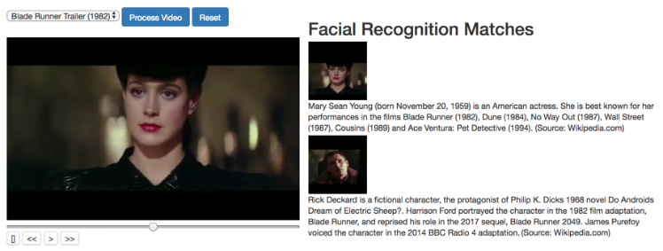
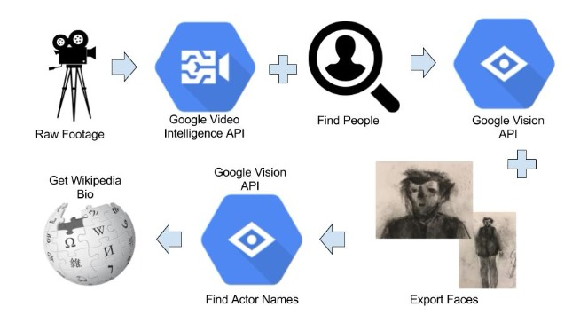
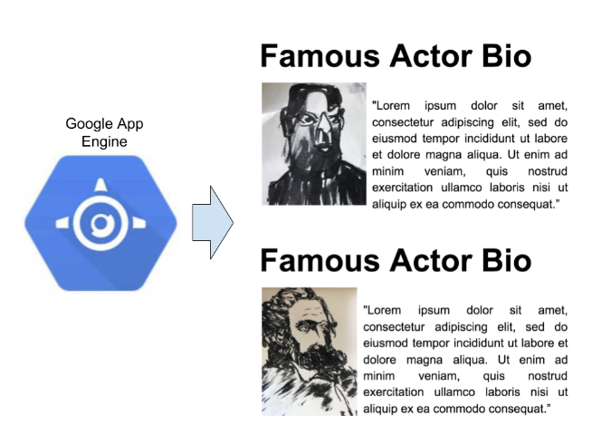

Google Video Intelligence and Vision APIs - Automatically Recognize Actors and Download their Biographies in Real Time

# Google Video Intelligence and Vision APIs - Automatically Recognize Actors and Download their Biographies in Real Time

Practical walkthroughs on machine learning, data exploration and finding insight.

**On YouTube:**

- 

For around 200 lines of code you can process a popular movie-clip down to the actor's face and biography in a fully automated pipeline! This may seem like a lot of code, but just five years ago it would have required tens of thousands of lines and a headache.

At [SpringML](http://www.springml.com/), we’ve built many solutions using the versatile [Google Cloud suite of APIs](https://cloud.google.com/apis/) but some of the funnest projects have been working with the Google Video Intelligence and Vision APIs in particular. Leveraging these two powerful APIs is like having an army of convolutional neural-network PhDs at your beck and call.

### Video Processing Pipeline

Here is a high-level visual chart of the action:

1. Feed a clip of your favorite video into the Google Video Intelligence API and collect time stamps when it detects people

2. Extract the frames with FFmpeg and feed into the Google Vision API facial detection function to get individual faces

3. Feed those faces into the Google Vision API web-detection function and collect names

4. Finally, feed the name into the Wikipedia API and pull the first paragraph for each name

### Principal Functions

Three notes before we begin looking at the different principal functions used in this pipeline:

- The code below wouldn’t be possible without the hands-on samples [python-doc-samples](https://github.com/GoogleCloudPlatform/python-docs-samples/) made available by the gracious folks at Google Cloud.
- Also, as important, [Google Cloud and its APIs aren’t free](https://cloud.google.com/storage/pricing), it’s affordable and you may get a credit if you are a first time user. As with everything ‘cloud’, only use what you need, and turn off ALL services when you’re done, otherwise you’ll keep accruing charges.
- Finally, you will need a [Google Cloud account](https://console.cloud.google.com/start) and you will need a Google Cloud Project and to enable each API covered in this walk through (Video Intelligence and Vision APIs).

#### The Google Video Intelligence API

The first building block, and probably the most important, is the [Google Video Intelligence API](https://cloud.google.com/video-intelligence/), it can gather a lot of intelligence from raw video footage right out of the box! Another big advantage of accessing APIs online is that they keep getting more features and more power without any intervention on your part. Here we’re mostly interested in one feature, the model’s ability to detect a person in a shot. It will return a confidence level of when it sees people and a time stamp of when that happened. I always put my video data to be analyzed in [Google Cloud Storage](https://cloud.google.com/storage) to be as close as possible to the Google Video Intelligence API.

	def analyze_labels(movie_to_process, bucket_name):
	    """ Detects labels given a GCS path. """
	    path = 'gs://' + bucket_name + '/video_processing/' + movie_to_process

	    video_client = videointelligence.VideoIntelligenceServiceClient()
	    features = [videointelligence.enums.Feature.LABEL_DETECTION]

	    mode = videointelligence.enums.LabelDetectionMode.SHOT_AND_FRAME_MODE
	    config = videointelligence.types.LabelDetectionConfig(
	        label_detection_mode=mode)

	    context = videointelligence.types.VideoContext(
	        label_detection_config=config)

	    operation = video_client.annotate_video(
	        path, features=features, video_context=context)

	    result = operation.result(timeout=90)

	    frame_offsets = []

	    # Process frame level label annotations
	    frame_labels = result.annotation_results[0].frame_label_annotations
	    for i, frame_label in enumerate(frame_labels):
	       for category_entity in frame_label.category_entities:
	            # look for categories that contain person regardless of situation
	            if (category_entity.description == 'person'):
	                # Each frame_label_annotation has many frames,
	                # but we keep information only about the first one
	                frame = frame_label.frames[0]
	                time_offset = (frame.time_offset.seconds +
	                               frame.time_offset.nanos / 1e9)
	                print('\tFirst frame time offset: {}s'.format(time_offset))
	                print('\tFirst frame confidence: {}'.format(frame.confidence))
	                print('\n')
	                frame_offsets.append(time_offset)

	    return(sorted(set(frame_offsets)))

#### FFmpeg and the Google Vision API

Once we have a list of time stamps marking each person in the video clip, the next set is to extract those frames into PNG images using [FFmpeg](https://www.ffmpeg.org/) and feeding them into the [Google Vision API](http://amunategui.github.io/google-actor-recognition/cloud.google.com/Vision_API). FFmpeg is a powerhouse in-of-itself and does a great job extracting stills from video. The Vision API is also chock-full-of-features and, at this point in the pipeline, we’re only interested in getting coordinates of a face.

	def extract_image_from_video(video_input, name_output, time_stamp):
	    ret = "Error"
	    try:
	        ret = os.system("ffmpeg -i " + video_input + " -ss " + time_stamp + " -frames:v 1 " + name_output)
	        # if all goes well FFMPEG will return 0
	        return ret
	    except ValueError:
	        return("Oops! error...")

	def detect_face(face_file, max_results=4):
	    # find a face and return its coordinates
	    client = vision.ImageAnnotatorClient()
	    content = face_file.read()
	    image = types.Image(content=content)

	    # return coords of face
	    return client.face_detection(image=image).face_annotations

#### Annotating an Image = Dropping an Image in Google Images

We save the image of each face (actually a little larger than just the face, more like the bust) and feed them back in the Google Vision API again this time to get ‘web hits’ from that image. If the face on the image is from a popular movie, you’ll most likely get some meta data back. It returns all sorts of things from the name all the way to the source URL. In this case we only care about the First and Last Name of the first discovery, the one with the most confidence. From there, we drop that name into the [Wikipedia API](https://pypi.python.org/pypi/wikipedia) and extract the first paragraph.

	def annotate(path):
	    """Returns web annotations given the path to an image."""
	    client = vision.ImageAnnotatorClient()

	    if path.startswith('http') or path.startswith('gs:'):
	        image = types.Image()
	        image.source.image_uri = path
	    else:
	        with io.open(path, 'rb') as image_file:
	            content = image_file.read()

	        image = types.Image(content=content)

	    web_detection = client.web_detection(image=image).web_detection

	    return web_detection

If you watch the video, you’ll notice that I display the pipeline in real time. Briefly, I drop all the images in a Google Cloud Storage bucket and use an App Engine/Flask web site to probe the contents of the bucket and display the findings in real-time. Its great for demos but its a whole project in-of-itself, so too much for this walk through.

### Complete Working Version

Here is the full version of the code. To circumvent some of the permission issues and get the code to run fast, I run this directly off a VM on GCP (see the [video](https://www.youtube.com/watch?v=a5E-W0Ck-8U&list=UUq4pm1i_VZqxKVVOz5qRBIA&index=1) for more details). I don’t cover GCP basics and assume you know how to start a VM with Python and how to install libraries. Also, you need to put the video clip MP4 in your GCP storage bucket in the cloud as well - the closer your data is to the API, the faster it will run. [See the video for more details](https://www.youtube.com/watch?v=a5E-W0Ck-8U&list=UUq4pm1i_VZqxKVVOz5qRBIA&index=1)

.

	# ---  Very Basic Instructions ---
	# 1 - place a video clip in a bucket on your Google Cloud Storage and set permission to public
	# 2 - run the code from the GCP cloud VM
	# 3 - run the requirements.txt file (pip install -r requirements.txt)
	# 4 - run video_processing.py clip_name bucket_name at the command prompt
	#     this will create tmp folder and under a series of folders including faces_found and text_found
	#     where it will store what it learned from your clip
	# 5 - Don't forget to delete the clip (or remove public permission at the very least) and turn
	#     you VM off!

	# If you have ffmpeg issues try this:
	# sudo apt-get install ffmpeg

	import glob, os, sys, io, skvideo.io, argparse, math, datetime, ffmpy, shutil, wikipedia
	from google.cloud import videointelligence
	from google.cloud import vision
	from google.cloud import storage
	from google.cloud.vision import types
	from PIL import Image, ImageDraw
	import numpy as np

	def init():
	    # clean out directory structure
	    os.system('rm -r tmp')

	def analyze_labels(movie_to_process, bucket_name):
	    path = 'gs://' + bucket_name + '/' + movie_to_process
	    """ Detects labels given a GCS path. """
	    video_client = videointelligence.VideoIntelligenceServiceClient()
	    features = [videointelligence.enums.Feature.LABEL_DETECTION]

	    mode = videointelligence.enums.LabelDetectionMode.SHOT_AND_FRAME_MODE
	    config = videointelligence.types.LabelDetectionConfig(
	        label_detection_mode=mode)
	    context = videointelligence.types.VideoContext(
	        label_detection_config=config)

	    operation = video_client.annotate_video(
	        path, features=features, video_context=context)
	    print('\nProcessing video for label annotations:')

	    result = operation.result(timeout=90)
	    print('\nFinished processing.')

	    frame_offsets = []

	    # Process frame level label annotations
	    frame_labels = result.annotation_results[0].frame_label_annotations
	    for i, frame_label in enumerate(frame_labels):
	        #if (frame_label.entity.description == 'person'):
	        print('Frame label description: {}'.format(
	            frame_label.entity.description))
	        for category_entity in frame_label.category_entities:
	            if (category_entity.description == 'person'):
	                print('\tLabel category description: {}'.format(
	                    category_entity.description))
	                print(frame_label)
	                # Each frame_label_annotation has many frames,
	                # here we print information only about the first frame.
	                #for frame in frame_label.frames:
	                frame = frame_label.frames[0]
	                time_offset = (frame.time_offset.seconds +
	                               frame.time_offset.nanos / 1e9)
	                print('\tFirst frame time offset: {}s'.format(time_offset))
	                print('\tFirst frame confidence: {}'.format(frame.confidence))
	                print('\n')
	                frame_offsets.append(time_offset)
	    return(sorted(set(frame_offsets)))

	def extract_image_from_video(video_input, name_output, time_stamp):
	    ret = "Error"
	    try:
	        ret = os.system("ffmpeg -i " + video_input + " -ss " + time_stamp + " -frames:v 1 " + name_output)
	        # if all goes well FFMPEG will return 0
	        return ret
	    except ValueError:
	        return("Oops! error...")

	def crop_image(input_image, output_image, start_x, start_y, width, height):
	    """Pass input name image, output name image, x coordinate to start croping, y coordinate to start croping, width to crop, height to crop """
	    input_img = Image.open(input_image)
	    # give the image some buffer space
	    start_with_buffer_x = int(start_x - np.ceil(width/2))
	    start_with_buffer_y = int(start_y - np.ceil(height/2))
	    width_with_buffer = int(start_x + width  + np.ceil(width/2))
	    height_with_buffer = int(start_y + height  + np.ceil(height/2))

	    box = (start_with_buffer_x, start_with_buffer_y, width_with_buffer, height_with_buffer)
	    output_img = input_img.crop(box)
	    output_img.save(output_image +".png")
	    return (output_image +".png")

	def detect_face(face_file, max_results=4):
	    # can you find a face and return coordinates
	    client = vision.ImageAnnotatorClient()
	    content = face_file.read()
	    image = types.Image(content=content)

	    # return coords of face
	    return client.face_detection(image=image).face_annotations

	def highlight_faces(image, faces):
	    # Draws a polygon around the faces, then saves to output_filename.
	    faces_boxes = []
	    im = Image.open(image)
	    draw = ImageDraw.Draw(im)

	    for face in faces:
	        box = [(vertex.x, vertex.y)
	               for vertex in face.bounding_poly.vertices]
	        draw.line(box + [box[0]], width=5, fill='#00ff00')
	        faces_boxes.append([box[0][0], box[0][1], box[1][0] - box[0][0], box[3][1] - box[0][1]])
	    return (faces_boxes)

	def annotate(path):
	    """Returns web annotations given the path to an image."""
	    client = vision.ImageAnnotatorClient()

	    if path.startswith('http') or path.startswith('gs:'):
	        image = types.Image()
	        image.source.image_uri = path
	    else:
	        with io.open(path, 'rb') as image_file:
	            content = image_file.read()

	        image = types.Image(content=content)

	    web_detection = client.web_detection(image=image).web_detection

	    return web_detection

	def report(annotations, max_report=5):
	    """Prints detected features in the provided web annotations."""
	    names =  []
	    if annotations.web_entities:
	        print ('\n{} Web entities found: '.format(
	            len(annotations.web_entities)))
	        count = 0
	        for entity in annotations.web_entities:
	            print('Score      : {}'.format(entity.score))
	            print('Description: {}'.format(entity.description))
	            names.append(entity.description)
	            count += 1
	            if count >=max_report:
	                break;
	    return names

	def get_stills(movie_to_process, bucket_name, timestamps_to_pull):
	    video_location = 'https://storage.googleapis.com/' + bucket_name + '/' + movie_to_process
	    storage_client = storage.Client()
	    max_results = 3

	    timestamps_to_pull_tmp = timestamps_to_pull + [x + 0.15 for x in timestamps_to_pull[:-1]] + [x - 0.15 for x in timestamps_to_pull[1:]]

	    # clear out stills folder
	    if len(timestamps_to_pull_tmp) > 0:
	        # create directory structure
	        os.system('mkdir tmp')
	        os.system('mkdir tmp/faces_found')
	        os.system('mkdir tmp/text_found')
	        os.system('mkdir tmp/face_images')

	        filepath = 'tmp/'

	        # make stills
	        cnt_ = 0
	        for ttp in timestamps_to_pull_tmp:
	            # get the still image at that timestamp
	            time_stamp = str(datetime.timedelta(seconds=ttp))
	            file = "still_"  + str(cnt_) + ".png"
	            filePathAndName =  filepath + file
	            print('filename: ' + time_stamp)
	            ret = extract_image_from_video(video_input = video_location, name_output = filePathAndName, time_stamp = time_stamp)
	            cnt_ += 1

	            # find face on still image
	            with open(filePathAndName, 'rb') as image:
	                faces = detect_face(image, max_results)
	                print('Found {} face{}'.format(
	                    len(faces), '' if len(faces) == 1 else 's'))

	                print('Looking for a face {}'.format(filePathAndName))
	                # Reset the file pointer, so we can read the file again
	                image.seek(0)
	                faces_boxes = highlight_faces(filePathAndName, faces) #, filePathAndName)
	                print('faces_boxes:', faces_boxes)

	                if len(faces_boxes) > 0:
	                    # image had a face

	                    count = 0
	                    for face_box in faces_boxes:
	                        # cv2.imwrite("frame%d.jpg" % count, image)     # save frame as JPEG file
	                        saved_name = crop_image(filePathAndName, "tmp/face_images/" + file.split('.')[0] + str(count) + '_faces', face_box[0], face_box[1], face_box[2], face_box[3])
	                        count += 1

	                        # get actors name
	                        potential_names = report(annotate(saved_name),2)
	                        print('potential_names: ', potential_names)
	                        # does the first have two words -  as in first and last name?
	                        if (len(potential_names[0].split()) == 2):
	                            # we have a winner
	                            new_name = 'tmp/faces_found/' + potential_names[0] + '.png'
	                            shutil.copy(saved_name,new_name)

	                            # extract wiki bio
	                            rez = wikipedia.page(potential_names[0]).content
	                            # keep only intro paragraph
	                            with open('tmp/text_found/' + potential_names[0] + ".txt", "w") as text_file:
	                                text_file.write(rez.split('\n\n')[0] + " (Source: Wikipedia.com)")

	BUCKET_NAME = ''
	MOVIE_TO_PROCESS = ''

	if __name__ == "__main__":
	    if len(sys.argv) == 3:
	        MOVIE_TO_PROCESS = sys.argv[1]
	        BUCKET_NAME = sys.argv[2]

	        # start things off clean
	        print('Cleaning up...')
	        init()
	        print('Finding people...')
	        # use video intelligence to find high probability of people being visible
	        timestamps_to_pull = analyze_labels(MOVIE_TO_PROCESS, BUCKET_NAME)

	        print('Processing people...')
	        get_stills(MOVIE_TO_PROCESS, BUCKET_NAME, timestamps_to_pull)
	        print('All done...')
	    else:
	        print('Wrong argument inputs')

Here is the Requirements.txt file (run using: sudo pip install -r requirements.txt)

	google_api_python_client==1.6.4
	argparse==1.4.0
	datetime==4.2
	pandas==0.20.3
	numpy==1.13.3
	sk-video==1.1.8
	opencv-python==3.3.0.10
	Pillow==2.7.0
	ffmpy==0.2.2
	ffmpeg-python==0.1.9
	google-api-python-client==1.6.4
	google-cloud-vision==0.29.0
	google-cloud-videointelligence==1.0.0
	google-cloud-storage==1.6.0
	wikipedia==1.4.0

For more information about our work and opportunities at [SpringML](http://www.springml.com/), reach me on [LinkedIn](https://www.linkedin.com/in/manuel-amunategui-20748923/) or at [Manuel.Amunategui@SpringML.com](http://amunategui.github.io/google-actor-recognition/index.htmlmailto:Manuel.Amunategui@SpringML.com)

*Acknowledgments: Blade Runner stills from the 1982 Blade Runner Trailer from Warner Bros, icons from Creative Commons, [original artwork from Lucas Amunategui](https://lucasamunategui.github.io/).*