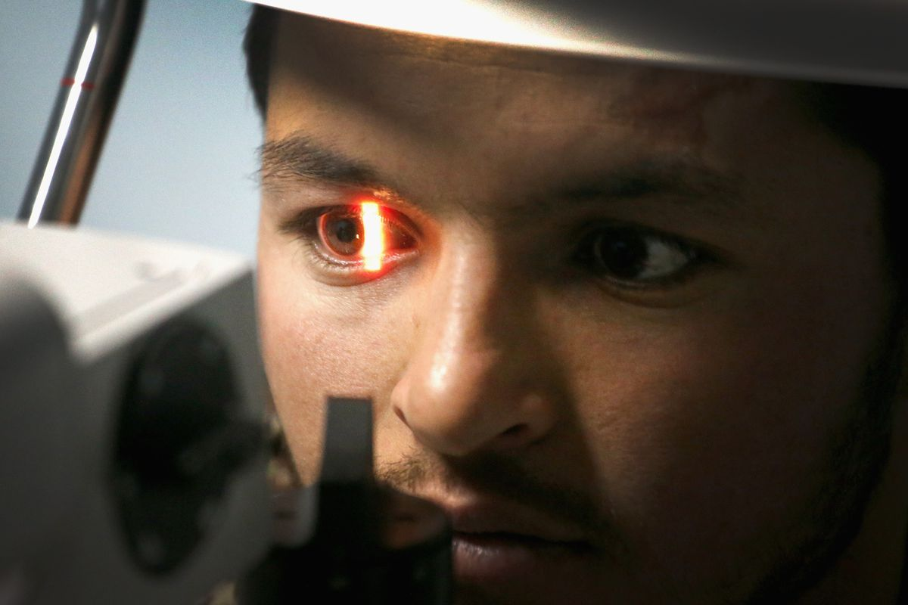
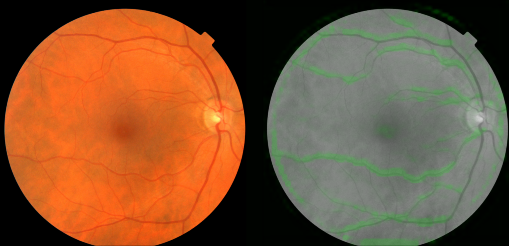

Google’s new AI algorithm predicts heart disease by looking at your eyes

# Google’s new AI algorithm predicts heart disease by looking at your eyes

## Experts say it could provide a simpler way to predict cardiovascular risk

By

The algorithm could allow doctors to predict cardiovascular risk more simply by using scans of the retina.

 Stock photo by Scott Olson/Getty Images

Scientists from Google and its health-tech subsidiary Verily have discovered a new way to assess a person’s risk of heart disease using machine learning. By analyzing scans of the back of a patient’s eye, the company’s software is able to accurately deduce data, including an individual’s age, blood pressure, and whether or not they smoke. This can then be used to predict their risk of suffering a major cardiac event — such as a heart attack — with roughly the same accuracy as current leading methods.

The algorithm potentially makes it quicker and easier for doctors to analyze a patient’s cardiovascular risk, as it doesn’t require a blood test. But, the method will need to be tested more thoroughly before it can be used in a clinical setting. A paper describing the work was [published today](https://www.nature.com/articles/s41551-018-0195-0) in the *Nature* journal *Biomedical Engineering, *although the research was also shared before peer review last September.

Luke Oakden-Rayner, a medical researcher at the University of Adelaide who specializes in machine learning analysis, told *The Verge* that the work was solid, and shows how AI can help improve existing diagnostic tools. “They’re taking data that’s been captured for one clinical reason and getting more out of it than we currently do,” said Oakden-Rayner. “Rather than replacing doctors, it’s trying to extend what we can actually do.”

To train the algorithm, Google and Verily’s scientists used machine learning to analyze a medical dataset of nearly 300,000 patients. This information included eye scans as well as general medical data. As with all deep learning analysis, neural networks were then used to mine this information for patterns, learning to associate telltale signs in the eye scans with the metrics needed to predict cardiovascular risk (e.g., age and blood pressure).

Although the idea of looking at your eyes to judge the health of your heart sounds unusual, it draws from a body of established research. The rear interior wall of the eye (the fundus) is chock-full of blood vessels that reflect the body’s overall health. By studying their appearance with camera and microscope, doctors can infer things like an individual’s blood pressure, age, and whether or not they smoke, which are all important predictors of cardiovascular health.

*Two images of the fundus, or interior rear of your eye. The one on the left is a regular image; the on the right shows how Google’s algorithm picks out blood vessels (in green) to predict blood pressure.*

 Photo by Google / Verily Life Sciences

When presented with retinal images of two patients, one of whom suffered a cardiovascular event in the following five years, and one of whom did not, Google’s algorithm was able to tell which was which 70 percent of the time. This is only slightly worse than the commonly used SCORE method of predicting cardiovascular risk, which requires a blood test and makes correct predictions in the same test 72 percent of the time.

Alun Hughes, professor of Cardiovascular Physiology and Pharmacology at London’s UCL, said Google’s approach sounded credible because of the “long history of looking at the retina to predict cardiovascular risk.” He added that artificial intelligence had the potential to speed up existing forms of medical analysis, but cautioned that the algorithm would need to be tested further before it could be trusted.

For Google, the work represents more than just a new method of judging cardiovascular risk. It points the way toward a new AI-powered paradigm for scientific discovery. While most medical algorithms are built to replicate existing diagnostic tools (like [identifying skin cancer](https://www.theverge.com/2017/1/26/14396500/ai-skin-cancer-detection-stanford-university), for example), this algorithm found new ways to analyze existing medical data. With enough data, it’s hoped that artificial intelligence can then create entirely new medical insight without human direction. It’s presumably part of the reason Google has created initiatives like its [Project Baseline study](https://www.theverge.com/2017/4/19/15349284/alphabet-verily-google-x-project-baseline-medical-data), which is collecting exhaustive medical records of 10,000 individuals over the course of four years.

For now, the idea of an AI doctor churning out new diagnoses without human oversight is a distant prospect — most likely decades, rather than years, in the future. But Google’s research suggests the idea isn’t completely far-fetched.