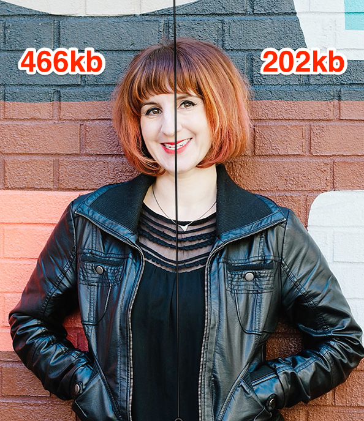
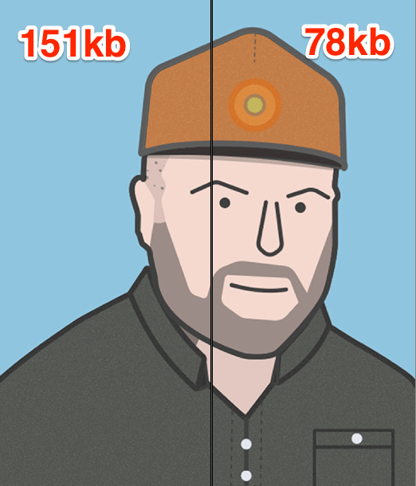
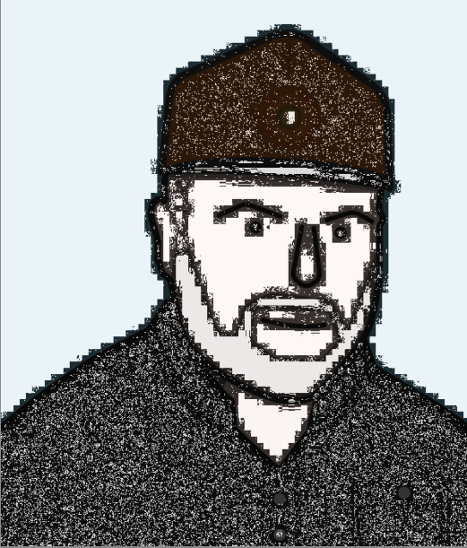

Guetzli, Google's New JPEG Encoder — Christopher Schmitt

# Guetzli, Google’s New JPEG Encoder

[March 19, 2017](http://christopher.org/guetzli-googles-new-jpeg-encoder/) By [Christopher Schmitt](http://christopher.org/author/christopher/)

Last week, Google released to open source JPEG encoder that can create images file sizes 35% smaller than currently available methods. Called [Guetzli](https://research.googleblog.com/2017/03/announcing-guetzli-new-open-source-jpeg.html), which means cookie in Swiss German, it seems new possibilities for the format that’s been around since the late 1980s!

Using a different method than other optimizers, Guetzli doesn’t have a set of rules or laws in a race to the lowest file size when encoding images.

Instead, Guetzli relies on a tool that measures differences between images the way the human eye detects differences called [butteraugli](https://github.com/google/butteraugli).

The results on images appear that Guetzli walks a fine line by not applying general compression metric that some artifacts as other methods by focusing on areas of[barely noticeable perceptual differences between images](https://arxiv.org/pdf/1703.04421.pdf).

### Guetzli on Images

I ran the [CSS Dev Conf speaker photo images](http://2017.cssdevconf.com/) to test out the compression and found that I saved almost 200kb.

This amount of file savings did not apply to all my images, but enough for me to go through all my JPEGs on the site!

I even processed a line art image to see how Guetzli would handle the compression and it saved almost 70kb, with barely any noticeable changes.

I wanted to see, if anything, Google’s encoder did anything to that image, I threw both images into the [Kaleidoscope app](http://www.kaleidoscopeapp.com/) and put them under the Difference view.

Amazing how much work Guetzli did to the image while my eye barely noticed any differences. In fact, I thought the subtle changes enhanced the image!

### Future of Guetzli

At the time of my writing, I could not do batch processing, and I did not even try to hook it up to an automated build process since it was a slow optimization process for Guetzli to do its thing.

Only announced last week, I think it’s safe to say this is only the start of Guetzli. I bet the speed will increase, and Guetzli is going to be part of the build processes sooner than later.

* * *

 * Also published on [Medium](https://medium.com/@teleject/guetzli-googles-new-jpeg-encoder-521c69ef66ca). *

### About Christopher Schmitt

The Internet's [Christopher Schmitt](http://christopher.org/) is an award winning designer, author, and speaker and one of the people behind the web conference team, [Environments for Humans](http://environmentsforhumans.com/). He hosts the [Non Breaking Space Show](http://nonbreakingspace.tv/) and curates the weekly [UX Design Newsletter](http://uxdesignnewsletter.com/).

[development](http://christopher.org/category/development/), [webdesign](http://christopher.org/category/webdesign/)