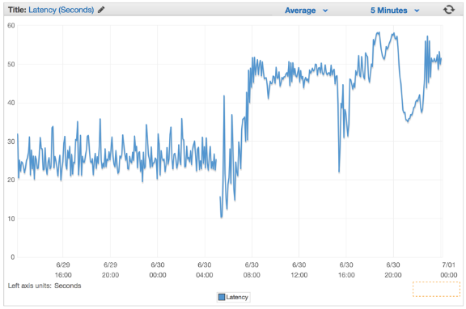
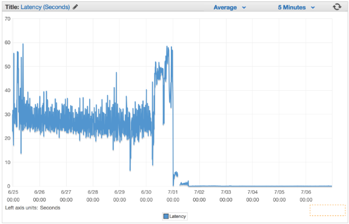
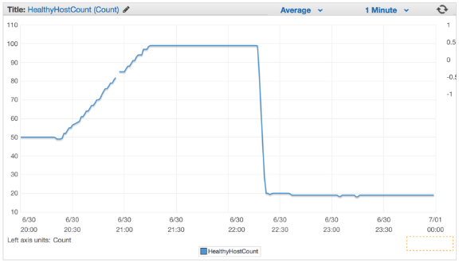

Handling 1 Million Requests per Minute with Go

# Handling 1 Million Requests per Minute with Go

Jul 6, 2015

Here at [Malwarebytes](http://www.malwarebytes.org/) we are experiencing phenomenal growth, and since I have joined the company over 1 year ago in the Silicon Valley, one my main responsibilities has been to architect and develop several systems to power a fast-growing security company and all the needed infrastructure to support a product that is used by millions of people every single day. I have worked in the anti-virus and anti-malware industry for over 12 years in a few different companies, and I knew how complex these systems could end up being due to the massive amount of data we handle daily.

What is interesting is that for the last 9 years or so, all the web backend development that I have been involved in has been mostly done in Ruby on Rails. Don’t take me wrong, I love Ruby on Rails and I believe it’s an amazing environment, but after a while you start thinking and designing systems in the ruby way, and you forget how efficient and simple your software architecture could have been if you could leverage multi-threading, parallelization, fast executions and small memory overhead. For many years, I was a C/C++, Delphi and C# developer, and I just started realizing how less complex things could be with the right tool for the job.

As a Principal Architect, I am not very big on the language and framework wars that the interwebs are always fighting about. I believe efficiency, productivity and code maintainability relies mostly on how simple you can architect your solution.

## The Problem

While working on a piece of our anonymous telemetry and analytics system, our goal was to be able to handle a large amount of POST requests from millions of endpoints. The web handler would receive a JSON document that may contain a collection of many payloads that needed to be written to Amazon S3, in order for our map-reduce systems to later operate on this data.

Traditionally we would look into creating a worker-tier architecture, utilizing things such as:

- Sidekiq
- Resque
- DelayedJob
- Elasticbeanstalk Worker Tier
- RabbitMQ
- and so on…

And setup 2 different clusters, one for the web front-end and another for the workers, so we can scale up the amount of background work we can handle.

But since the beginning, our team knew that we should do this in Go because during the discussion phases we saw this could be potentially a very large traffic system. I have been using Go for about 2 years or so, and we had developed a few systems here at work but none that would get this amount of load.

We started by creating a few structures to define the web request payload that we would be receiving through the POST calls, and a method to upload it into our S3 bucket.

	type PayloadCollection struct {
		WindowsVersion  string    `json:"version"`
		Token           string    `json:"token"`
		Payloads        []Payload `json:"data"`
	}

	type Payload struct {
	    // [redacted]
	}

	func (p *Payload) UploadToS3() error {
	    // the storageFolder method ensures that there are no name collision in
	    // case we get same timestamp in the key name
	    storage_path := fmt.Sprintf("%v/%v", p.storageFolder, time.Now().UnixNano())

		bucket := S3Bucket

		b := new(bytes.Buffer)
		encodeErr := json.NewEncoder(b).Encode(payload)
		if encodeErr != nil {
			return encodeErr
		}

	    // Everything we post to the S3 bucket should be marked 'private'
	    var acl = s3.Private
		var contentType = "application/octet-stream"

		return bucket.PutReader(storage_path, b, int64(b.Len()), contentType, acl, s3.Options{})
	}

### Naive approach to Go routines

Initially we took a very naive implementation of the POST handler, just trying to parallelize the job processing into a simple goroutine:

	func payloadHandler(w http.ResponseWriter, r *http.Request) {

	    if r.Method != "POST" {
			w.WriteHeader(http.StatusMethodNotAllowed)
			return
		}

	    // Read the body into a string for json decoding
		var content = &PayloadCollection{}
		err := json.NewDecoder(io.LimitReader(r.Body, MaxLength)).Decode(&content)
	    if err != nil {
			w.Header().Set("Content-Type", "application/json; charset=UTF-8")
			w.WriteHeader(http.StatusBadRequest)
			return
		}

	    // Go through each payload and queue items individually to be posted to S3
	    for _, payload := range content.Payloads {
	        go payload.UploadToS3()   // <----- DON'T DO THIS
	    }

	    w.WriteHeader(http.StatusOK)
	}

For moderate loads, this could work for the majority of people, but this quickly proved to not work very well at a large scale. We were expecting a lot of requests but not in the order of magnitude we started seeing when we deployed the first version to production. We completely understimated the amount of traffic.

The approach above is bad in several different ways. There is no way to control how many go routines we are spawning. And since we were getting 1 million POST requests per minute of course this code crashed and burned very quickly.

### Trying again

We needed to find a different way. Since the beginning we started discussing how we needed to keep the lifetime of the request handler very short and spawn processing in the background. Of course, this is what you must do in the Ruby on Rails world, otherwise you will block all the available worker web processors, whether you are using puma, unicorn, passenger (Let’s not get into the JRuby discussion please). Then we would have needed to leverage common solutions to do this, such as Resque, Sidekiq, SQS, etc. The list goes on since there are many ways of achieving this.

So the second iteration was to create a buffered channel where we could queue up some jobs and upload them to S3, and since we could control the maximum number of items in our queue and we had plenty of RAM to queue up jobs in memory, we thought it would be okay to just buffer jobs in the channel queue.

	var Queue chan Payload

	func init() {
	    Queue = make(chan Payload, MAX_QUEUE)
	}

	func payloadHandler(w http.ResponseWriter, r *http.Request) {
	    ...
	    // Go through each payload and queue items individually to be posted to S3
	    for _, payload := range content.Payloads {
	        Queue <- payload
	    }
	    ...
	}

And then to actually dequeue jobs and process them, we were using something similar to this:

	func StartProcessor() {
	    for {
	        select {
	        case job := <-Queue:
	            job.payload.UploadToS3()  // <-- STILL NOT GOOD
	        }
	    }
	}

To be honest, I have no idea what we were thinking. This must have been a late night full of Red-Bulls. This approach didn’t buy us anything, we have traded flawed concurrency with a buffered queue that was simply postponing the problem. Our synchronous processor was only uploading one payload at a time to S3, and since the rate of incoming requests were much larger than the ability of the single processor to upload to S3, our buffered channel was quickly reaching its limit and blocking the request handler ability to queue more items.

We were simply avoiding the problem and started a count-down to the death of our system eventually. Our latency rates kept increasing in a constant rate minutes after we deployed this flawed version.

### The Better Solution

We have decided to utilize a common pattern when using Go channels, in order to create a 2-tier channel system, one for queuing jobs and another to control how many workers operate on the JobQueue concurrently.

The idea was to parallelize the uploads to S3 to a somewhat sustainable rate, one that would not cripple the machine nor start generating connections errors from S3. So we have opted for creating a Job/Worker pattern. For those that are familiar with Java, C#, etc, think about this as the Golang way of implementing a Worker Thread-Pool utilizing channels instead.

	var (
		MaxWorker = os.Getenv("MAX_WORKERS")
		MaxQueue  = os.Getenv("MAX_QUEUE")
	)

	// Job represents the job to be run
	type Job struct {
		Payload Payload
	}

	// A buffered channel that we can send work requests on.
	var JobQueue chan Job

	// Worker represents the worker that executes the job
	type Worker struct {
		WorkerPool  chan chan Job
		JobChannel  chan Job
		quit    	chan bool
	}

	func NewWorker(workerPool chan chan Job) Worker {
		return Worker{
			WorkerPool: workerPool,
			JobChannel: make(chan Job),
			quit:       make(chan bool)}
	}

	// Start method starts the run loop for the worker, listening for a quit channel in
	// case we need to stop it
	func (w Worker) Start() {
		go func() {
			for {
				// register the current worker into the worker queue.
				w.WorkerPool <- w.JobChannel

				select {
				case job := <-w.JobChannel:
					// we have received a work request.
					if err := job.Payload.UploadToS3(); err != nil {
						log.Errorf("Error uploading to S3: %s", err.Error())
					}

				case <-w.quit:
					// we have received a signal to stop
					return
				}
			}
		}()
	}

	// Stop signals the worker to stop listening for work requests.
	func (w Worker) Stop() {
		go func() {
			w.quit <- true
		}()
	}

We have modified our Web request handler to create an instance of `Job` struct with the payload and send into the `JobQueue` channel for the workers to pickup.

	func payloadHandler(w http.ResponseWriter, r *http.Request) {

	    if r.Method != "POST" {
			w.WriteHeader(http.StatusMethodNotAllowed)
			return
		}

	    // Read the body into a string for json decoding
		var content = &PayloadCollection{}
		err := json.NewDecoder(io.LimitReader(r.Body, MaxLength)).Decode(&content)
	    if err != nil {
			w.Header().Set("Content-Type", "application/json; charset=UTF-8")
			w.WriteHeader(http.StatusBadRequest)
			return
		}

	    // Go through each payload and queue items individually to be posted to S3
	    for _, payload := range content.Payloads {

	        // let's create a job with the payload
	        work := Job{Payload: payload}

	        // Push the work onto the queue.
	        JobQueue <- work
	    }

	    w.WriteHeader(http.StatusOK)
	}

During our web server initialization we create a `Dispatcher` and call `Run()` to create the pool of workers and to start listening for jobs that would appear in the `JobQueue`.

	dispatcher := NewDispatcher(MaxWorker)
	dispatcher.Run()

Below is the code for our dispatcher implementation:

	type Dispatcher struct {
		// A pool of workers channels that are registered with the dispatcher
		WorkerPool chan chan Job
	}

	func NewDispatcher(maxWorkers int) *Dispatcher {
		pool := make(chan chan Job, maxWorkers)
		return &Dispatcher{WorkerPool: pool}
	}

	func (d *Dispatcher) Run() {
	    // starting n number of workers
		for i := 0; i < d.maxWorkers; i++ {
			worker := NewWorker(d.pool)
			worker.Start()
		}

		go d.dispatch()
	}

	func (d *Dispatcher) dispatch() {
		for {
			select {
			case job := <-JobQueue:
				// a job request has been received
				go func(job Job) {
					// try to obtain a worker job channel that is available.
					// this will block until a worker is idle
					jobChannel := <-d.WorkerPool

					// dispatch the job to the worker job channel
					jobChannel <- job
				}(job)
			}
		}
	}

Note that we provide the number of maximum workers to be instantiated and be added to our pool of workers. Since we have utilized Amazon Elasticbeanstalk for this project with a dockerized Go environment, and we always try to follow the [12-factor](http://12factor.net/) methodology to configure our systems in production, we read these values from environment variables. That way we could control how many workers and the maximum size of the Job Queue, so we can quickly tweak these values without requiring re-deployment of the cluster.

	var (
		MaxWorker = os.Getenv("MAX_WORKERS")
		MaxQueue  = os.Getenv("MAX_QUEUE")
	)

### The Immediate results

Immediately after we have deployed it we saw all of our latency rates drop to insignificant numbers and our ability to handle requests surged drastically.

Minutes after our Elastic Load Balancers were fully warmed up, we saw our ElasticBeanstalk application serving close to 1 million requests per minute. We usually have a few hours during the morning hours in which our traffic spikes over to more than a million per minute.

As soon as we have deployed the new code, the number of servers dropped considerably from 100 servers to about 20 servers.

After we had properly configured our cluster and the auto-scaling settings, we were able to lower it even more to only 4x EC2 c4.Large instances and the Elastic Auto-Scaling set to spawn a new instance if CPU goes above 90% for 5 minutes straight.

### Conclusion

Simplicity always wins in my book. We could have designed a complex system with many queues, background workers, complex deployments, but instead we decided to leverage the power of Elasticbeanstalk auto-scaling and the efficiency and simple approach to concurrency that Golang provides us out of the box.

It’s not everyday that you have a cluster of only 4 machines, that are probably much less powerful than my current MacBook Pro, handling POST requests writing to an Amazon S3 bucket 1 million times every minute.

There is always the right tool for the job. For sometimes when your Ruby on Rails system needs a very powerful web handler, think a little outside of the ruby eco-system for simpler yet more powerful alternative solutions.