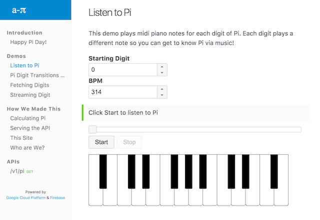
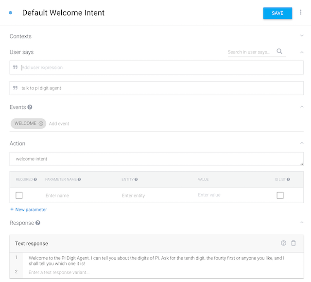
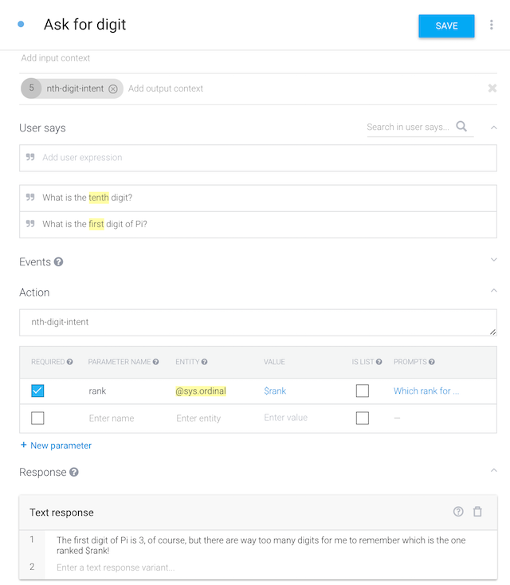
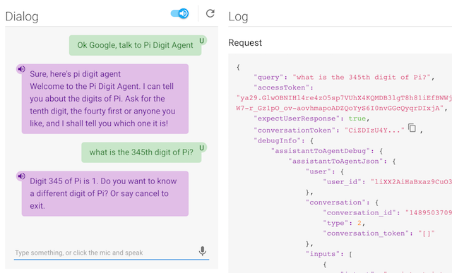

Happy Pi Day! Google Home helps you learn the digits of Pi -- Guillaume Laforge's Blog

# Happy Pi Day! Google Home helps you learn the digits of Pi

Posted on 14 March, 2017 (2 weeks ago)

 You know what? It's Pi Day today! Well, if you follow the American date standard, it's 3.14 today, a nice approximation of Pi. Last year, in a past life, I had [played with Pi](http://restlet.com/company/blog/2016/03/14/win-a-raspberry-pi-3-to-celebrate-pi-day-with-a-pi-api/) already, but this year, my awesome colleagues ([Ray](https://twitter.com/saturnism), [Sandeep](https://twitter.com/SandeepDinesh), [Francesc](https://twitter.com/francesc), [Ian](https://twitter.com/IanMLewis)) have been working on some very cool demos around Pi, with the "Pi delivery", at https://pi.delivery/

You can transform the Pi digits in a nice melody, show a D3.js based visualisation of the transitions between digits, you can stream the Pi digits, and more. And you can learn about how it's been [developed on the Google Cloud Platform](https://pi.delivery/#howcalculating-pi).

Ray pinged me to see if we could also create an assistant you can invoke on Google Home, to ask for digits of Pi, as I recently played with [Google Home, API.AI and Cloud Functions](http://glaforge.appspot.com/article/extending-the-google-assistant-with-actions-on-google)! And I played with the idea: created a new Cloud Function that invokes the Pi's Web API, designed an assistant in API.AI, and submitted this assistant to the Google Assistant.

You'll be able to ask your Google Home:
> Ok Google, talk to Pi Digit Agent.
> What is the 34th digit of Pi?*> “*
And it will tell you that it's 2.

How did I do that, let's first have a look at the Cloud Function, implemented in JavaScript / Node.js:

	{
	  "name": "pi-assistant",
	  "version": "0.0.1",
	  "private": true,
	  "scripts": {
	    "start": "node index.js",
	    "deploy": "rm -rf node_modules; gcloud alpha functions deploy digit --project digit-of-pi-2017-assistant  --trigger-http --stage-bucket gs://digit-of-pi-2017-assistant/"
	  },
	  "description": "Ask for the n-th digit of Pi!",
	  "main": "index.js",
	  "repository": "",
	  "author": "Guillaume Laforge",
	  "dependencies": {
	    "actions-on-google": "^1.0.7",
	    "node-fetch": "^1.6.3"
	  }
	}

The key things here are the dependencies: I'm using the actions-on-google Node module to interact more easily with API.AI and the Assistant, and I'm using node-fetch to interact with the Pi Delivery's REST API.

Let's now have a look at the code of our exported digit function in index.js:

	const ApiAiAssistant = require('actions-on-google').ApiAiAssistant;
	const fetch = require('node-fetch');
	​
	function nthDigit(assistant) {
	    let rank = parseInt(assistant.getArgument('rank').replace(/,/g, ''));
	    console.log(`${rank}nth digit`);
	​
	    *// 0 -> 3, 1 -> ., 2 -> 1, 3 -> 4, 4 -> 1, ...*
	    *// let's return 3 for 0th / 1st, and the digit otherwise, *
	    *// to follow natural human numbering and the fact the dot is accounted*
	​
	    let start = rank < 2 ? 0 : rank;
	​
	    fetch(`https:*//api.pi.delivery/v1/pi?start=${start}&numberOfDigits=1`)*
	        .then(response => response.json())
	        .then(data => {
	            assistant.ask(`Digit ${rank} of Pi is ${data.content}. Do you want to know a different digit of Pi? Or say cancel to exit.`);
	        }).catch(err => {
	            console.log(err);
	            assistant.ask('The ways of Pi are mysterious... Try again, or with another digit? Or say cancel to exit.');
	        });
	}
	​
	exports.digit = function (request, response) {
	    let assistant = new ApiAiAssistant({request, response});
	    let actionMap = new Map();
	    actionMap.set('nth-digit-intent', nthDigit);
	    assistant.handleRequest(actionMap);
	};

It's pretty straightforward, we export a digit function, that creates an API.AI assistant, to which we feed an action map pointing at our main intent, for asking for digits. I extract the parameter (ie. the rank of the digit I'm interested in), I call the REST API with a fetch() call, and then I return the result with the assistant.ask() call.

In a nutshell, on API.AI's side, my welcome intent greets you, telling you how to use the assistant:

And then the main intent, whose webhook points at my Cloud Function, does the heavy lifting:

You can try it in the emulator:

After that, once the webhook is properly configured, I published my action, through the integrations pane, and the cloud API console. I'll skip the details here, but you can read more on [how to distribution your actions](https://developers.google.com/actions/distribute/).

So again, Happy Pi Day! And hopefully, if you have a Google Home device and when my assistant is officially published, you'll be able to learn more about the digits of Pi!

And let's finish with a video of the assistant running live on my Google Home!

[Google Home assistant telling about the digits of Pi](https://www.youtube.com/watch?v=JrqdhpSmNRc)

In categories: [Google Cloud Platform](http://glaforge.appspot.com/category/Google%20Cloud%20Platform)