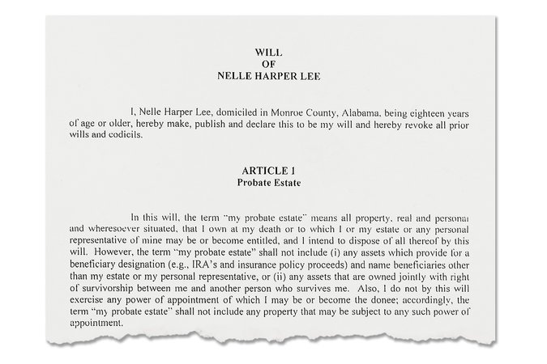
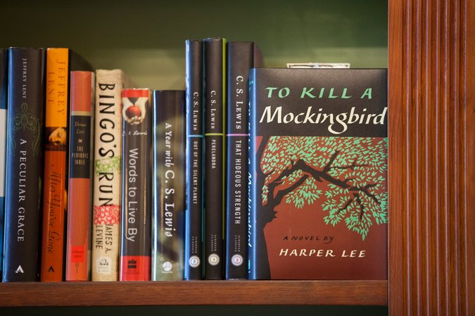

Harper Lee’s Will, Unsealed, Only Adds More Mystery to Her Life

# Harper Lee’s Will, Unsealed, Only Adds More Mystery to Her Life

Photo

Harper Lee, the author of “To Kill a Mockingbird,” who died in 2016. Credit Rob Carr/Associated Press

When the novelist Harper Lee [died in her sleep](https://www.nytimes.com/2016/02/20/arts/harper-lee-dies.html) two years ago, at 89, she left a trail of lingering questions about her life and work.

Why had she decided, in her final years, to publish a second novel, 55 years after her breakout success, “To Kill a Mockingbird”? Were there other unknown works? Who would inherit her literary papers, sought by many universities, as well as her estate, estimated to be worth tens of millions of dollars?

On Tuesday, an Alabama court unsealed Ms. Lee’s will, but the mystery surrounding one of American literature’s most cherished authors only deepened.

The will, signed on February 11, 2016, eight days before her death, directed that the bulk of her assets, including her literary properties, be transferred into a trust she formed in 2011.

Trust documents are private, so all questions about what will become of her literary papers and who beyond her closest relatives might benefit from her assets, will remain unanswered for now.

 [Continue reading the main story](https://www.nytimes.com/2018/02/27/books/harper-lee-will.html#story-continues-2)

ADVERTISEMENT

 [Continue reading the main story](https://www.nytimes.com/2018/02/27/books/harper-lee-will.html#story-continues-3)

It is also unclear how the will differed from any prior document Ms. Lee may have created to distribute her assets.

Photo

The first page of the will that Ms. Lee signed eight days before she died.

Ms. Lee never married or had children, and the court papers identified her heirs and closest living relatives as a niece and three nephews, who are expected to receive an undisclosed portion of the estate through the trust.

The will named Tonja B. Carter, Ms. Lee’s longtime lawyer, as the executor, or personal representative, of the estate, and it provided her with wide-ranging powers to shepherd Ms. Lee’s literary legacy and the rest of her assets.

Ms. Carter had gone to court in 2016 to successfully persuade Probate Judge Greg Norris of Monroe County to seal the will, citing Ms. Lee’s desire for privacy. And while the estate had stressed in court papers that making the will public could lead to the “potential harassment” of individuals identified in it, the document itself is strikingly opaque.

It was unsealed Tuesday on the basis of a lawsuit filed by The New York Times seeking to review the document. Lawyers for The Times argued that wills filed in a probate court in Alabama are typically public records, and that Ms. Lee’s privacy concerns were no different from those of others whose wills are processed through the court system.

“It’s a public record, and the press and the public have a right to public records,” said Archie Reeves, the lawyer who represented The Times.

Last week, as both sides prepared to depose witnesses, the estate withdrew its opposition to making the will public. It did not disclose its reasoning.

The document’s lack of transparency will likely fuel skepticism among those who feel that Ms. Carter had amassed too much power over Ms. Lee’s career and legacy. The will gives Ms. Carter substantial control over Ms. Lee’s estate and her literary properties, which are assigned to the Mockingbird Trust, an entity that was formed in 2011. Ms. Carter served as one of its two trustees at the time.

Photo

“To Kill a Mockingbird” alone sells more than a million copies a year worldwide, generating some $3 million in royalties for the copyright holder. Credit Melanie Stetson Freeman/The Christian Science Monitor, via Associated Press

“It is not an uncommon will, and it is typically what we term a pour-over will where anything in the estate goes over to the trust and they don’t have to disclose the terms of the trust,” said Sidney C. Summey, an estate and trusts lawyer in Birmingham.

“It is done quite often by people of means, people with notoriety and people who just want to be private,” Mr. Summey said.

Ms. Lee’s relatives had supported efforts to seal the will. Phone calls to reach several members of her family were unsuccessful.

As a personal representative, Ms. Carter is entitled to compensation for her work. The will allows the personal representative to earn additional fees as part of an organization, like a law firm, that does work for the estate.

Ms. Carter declined to discuss the will, citing Ms. Lee’s penchant for privacy. “I will not discuss her affairs,” she said.

One of the two witnesses to the will, Cynthia McMillan, a former resident assistant who had helped care for Ms. Lee at a facility where she had lived, said in an interview that Ms. Lee seemed competent when she signed it. “In my opinion, she was,” Ms. McMillian said.

The estate was built largely on the outsize and enduring success of Ms. Lee’s Pulitzer Prize-winning debut novel, “To Kill a Mockingbird,” which since its publication in 1960, has sold more than 40 million copies worldwide and remains a staple on American school curriculums. In addition, “[Go Set a Watchman](https://www.nytimes.com/2015/07/14/books/review/harper-lees-go-set-a-watchman.html),” her second novel, was [the](https://www.publishersweekly.com/pw/by-topic/industry-news/bookselling/article/69052-watchman-tops-print-sales-in-2015.html)[best-selling book of 2015](https://www.publishersweekly.com/pw/by-topic/industry-news/bookselling/article/69052-watchman-tops-print-sales-in-2015.html) in the United States, and sold more than 1.6 million hardcover copies, according to NPD BookScan.

 [Harper Lee, 1926- 2016](https://www.nytimes.com/video/obituaries/100000004221331/harper-lee-1926-2016.html?action=click&gtype=vhs&version=vhs-heading&module=vhs&region=title-area)

By JOHN WOO, NEIL COLLIER and MONA EL-NAGGAR

1:28

1:29

Video

#### Harper Lee, 1926- 2016

Harper Lee, whose first novel, “To Kill a Mockingbird,” about racial injustice in a small Alabama town, sold more than 40 million copies, died at the age of 89.

By JOHN WOO, NEIL COLLIER and MONA EL-NAGGAR on Publish Date February 19, 2016. Photo by Donald Uhrbrock/The LIFE Images Collection, via Getty Images. [Watch in Times Video »](https://www.nytimes.com/video/obituaries/100000004221331/harper-lee-1926-2016.html?action=click&contentCollection=obituaries&module=embedded&region=caption&pgtype=article)

“Mockingbird” alone sells more than a million copies a year worldwide, generating some $3 million in royalties for the copyright holder, according to court documents.

Ms. Lee had always lived simply, despite her fame and mounting wealth, and long shared a modest brick home in Monroeville with her older sister, Alice, who died in 2014. Ms. Lee could be seen around town in sweatpants looking for bargains at a Dollar General Store, washing her clothes at a local Laundromat, drinking coffee at a McDonald’s or eating at David’s Catfish House, where her usual iced tea and a small plate of catfish would cost about $6.

Often miscast as reclusive, she was no hermit, but she was as ferociously private as she was famous, and shunned interviews.

## Newsletter Sign Up

 [Continue reading the main story](https://www.nytimes.com/2018/02/27/books/harper-lee-will.html#continues-post-newsletter)

### Book Review

Be the first to see reviews, news and features in The New York Times Book Review.

 You agree to receive occasional updates and special offers for The New York Times's products and services.

She was thrust into the spotlight three years ago, when “Watchman” was released. Its publication sparked a debate about whether or not Ms. Lee had been pushed into publishing the novel, one that she had abandoned in the 1950s as an early effort at the story that would become “Mockingbird.”

At the release of “Watchman,” there were already questions about Ms. Lee’s vulnerability and her mental and physical condition. She had suffered a stroke in 2007, had severe vision and hearing problems and had moved into an assisted living facility. In 2013, in a copyright dispute that went to court, Ms. Lee’s lawyers said she had been taken advantage of and coerced into signing away her copyright because she was “an elderly woman with physical infirmities that made it difficult for her to read and see.”

The controversy surrounding [“Watchman” divided Ms. Lee’s hometown](https://www.nytimes.com/2015/08/24/books/in-harper-lees-hometown-an-issue-of-control.html), pitting some of her longtime friends and acquaintances, who doubted she had approved of the publication, against Ms. Lee’s lawyer, agent and publisher, generating the kind of public spectacle Ms. Lee abhorred. But an Alabama agency investigated whether Ms. Lee was a victim of elder abuse and financial fraud and determined that no abuse had occurred.

Some scholars and fans embraced “Watchman” as a long awaited sequel to Ms. Lee’s debut work, while others dismissed it as an inferior rough draft, one that was eventually polished and reshaped into a masterpiece. Many fans were shocked to discover that Atticus Finch, the crusading lawyer who fights for racial equality in “Mockingbird,” is depicted in “Watchman” as an aging racist and segregationist who clashes with his daughter, a grown-up Scout, over her support for civil rights.

Photo

At the release of “Go Set a Watchman,” there were already questions about Ms. Lee’s vulnerability and her mental and physical condition. Credit Erik S. Lesser/European Pressphoto Agency

Ms. Carter emerged as polarizing figure in the debate. She was at first credited with recovering Ms. Lee’s long lost novel, and recounted how she discovered the manuscript for “Watchman” in a safe deposit box in the summer of 2014. But others disputed that account and said Ms. Carter had been present when the [manuscript was discovered in October 2011](https://www.nytimes.com/2015/07/03/books/harper-lee-go-set-a-watchman-may-have-been-found-earlier-than-thought.html) during an appraisal by a rare books expert. The appraiser had come to inspect what was thought to be a “Mockingbird” manuscript, and Ms. Carter later said she had not realized at the time that actually a different manuscript had been reviewed.

Still, many viewed Ms. Carter as Ms. Lee’s staunchest protector, and with a coterie of friends from the area, she is now helping to expand Ms. Lee’s literary legacy.

Ms. Carter helps run a nonprofit, Mockingbird Company, that Ms. Lee created in 2015. It puts on a dramatization of “Mockingbird” in Monroeville each year.

A different production, drawn from the novel and scripted by Aaron Sorkin, is headed for Broadway this year. A “Mockingbird” graphic novel, adapted by Fred Fordham, was approved by Ms. Lee’s estate and will be published in the fall. And there are new plans for the [Harper Lee Trail,](http://www.al.com/news/birmingham/index.ssf/2016/12/harper_lees_lawyer_to_lead_tra.html) which local officials hope will attract hundreds of thousands of tourists a year to Monroeville. Planned attractions include a museum dedicated to Harper Lee and replications of characters’ houses in “To Kill a Mockingbird.”

How this all would have sat with Ms. Lee also remains a matter of debate. She took pains to protect her intellectual property and often scorned attempts to commercialize her novel. In 2013, she sued a local museum, arguing that it had infringed on her trademark by selling “Mockingbird” themed T-shirts and trinkets (the suit was settled in 2014).

And in a letter to a friend in 1993, she complained that Monroeville was turning into a “Mockingbird” tourist attraction. She expressed particular irritation at the strangers lingering in front of her house.

“They came in VANS,” [she wrote](https://www.theguardian.com/books/2016/dec/02/harper-lee-hometown-entertains-grand-plans-for-mockingbird-tourism).

Jennifer Crossley Howard contributed reporting, and Susan Beachy provided research.

A version of this article appears in print on February 28, 2018, on Page A11 of the New York edition with the headline: ‘Mockingbird’ Author’s Will Is Unsealed, but the Mystery of Her Life Only Deepens. [Order Reprints](http://www.nytreprints.com/)| [Today's Paper](http://www.nytimes.com/pages/todayspaper/index.html)|[Subscribe](http://www.nytimes.com/subscriptions/Multiproduct/lp839RF.html?campaignId=48JQY)

 [Continue reading the main story](https://www.nytimes.com/2018/02/27/books/harper-lee-will.html#whats-next)

## From Our Advertisers

## Recent Comments

## S. Brown

2 days ago

She trusts Tonja Carter because her late husband was a cousin of Truman Capote.

## Nancy G

2 days ago

I love the integrity of Atticus Finch of To Kill a Mockingbird. I am so moved by the relationship between him and Scout. There are few...

## Sue

2 days ago

in NYC, Harper Lee often ate at a local diner on the upper east side. One morning, I was sitting at the counter eating breakfast. Across...

- See All Comments