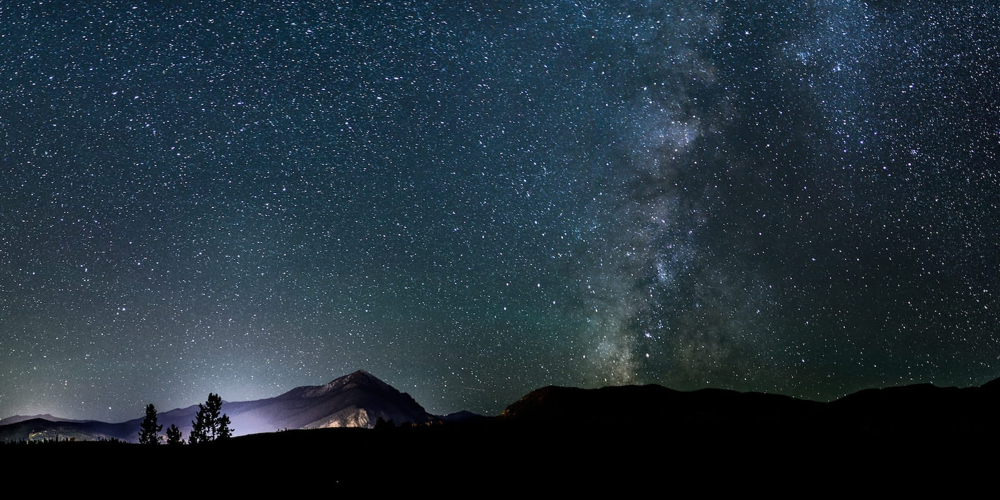
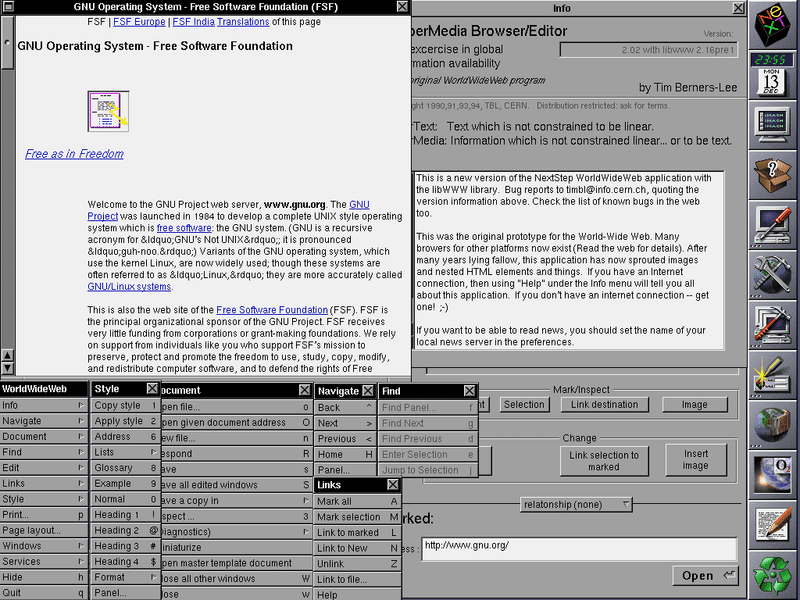
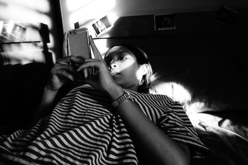
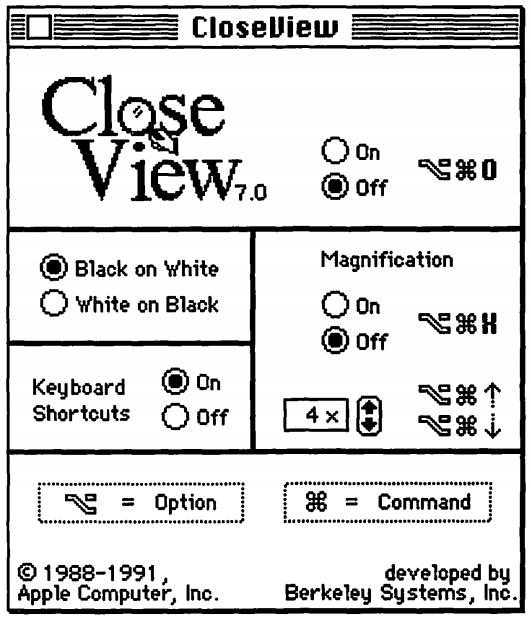
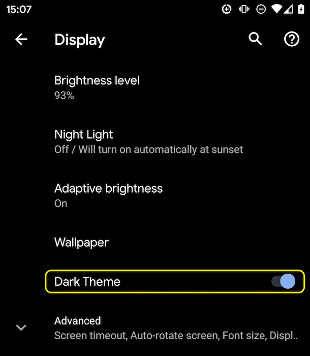
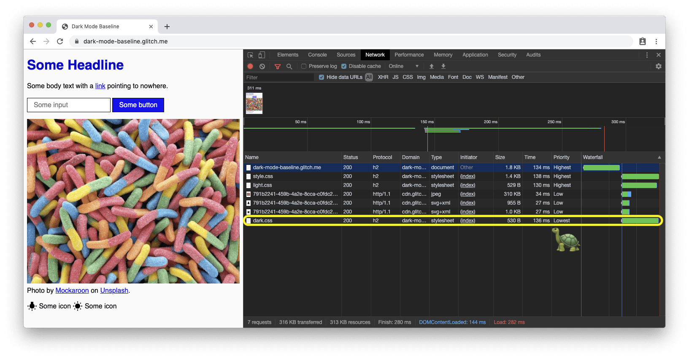
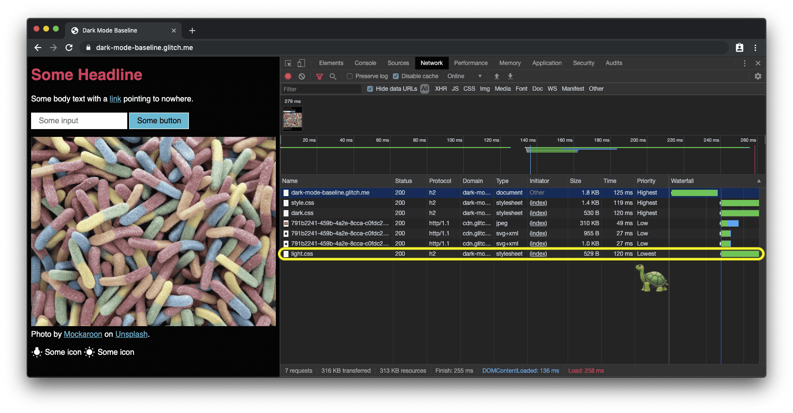
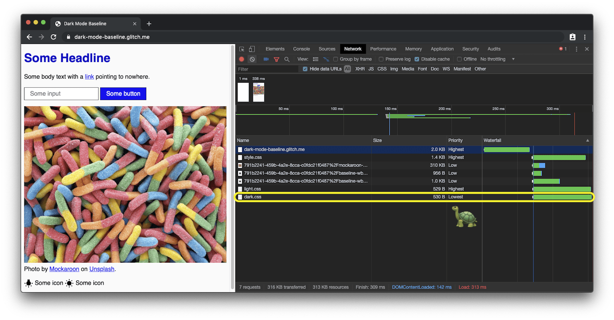

Hello Darkness, My Old Friend  |  web.dev

 

- [Home](https://web.dev/)  chevron_right

- [All articles](https://web.dev/blog)

# Hello Darkness, My Old Friend

Overhyped or necessity? Learn everything about dark mode and how to support it to the benefit of your users!

 Jun 27, 2019

 
 Thomas Steiner

- [Twitter](https://twitter.com/tomayac)  ·

- [GitHub](https://github.com/tomayac)

## Introduction [#](https://web.dev/prefers-color-scheme/#introduction)

star

I have done a lot of background research on the history and theory of dark mode, if you are only interested in working with dark mode, feel free to[skip the introduction](https://web.dev/prefers-color-scheme/#activating-dark-mode-in-the-operating-system).

### Dark mode before *Dark Mode*  [#](https://web.dev/prefers-color-scheme/#dark-mode-before-dark-mode)

 

Green screen ([Source](https://commons.wikimedia.org/wiki/File:Compaq_Portable_and_Wordperfect.JPG))

We have gone full circle with dark mode. In the dawn of personal computing, dark mode wasn’t a matter of choice, but a matter of fact: Monochrome CRT computer monitors worked by firing electron beams on a phosphorescent screen and the phosphor used in early CRTs was green. Because text was displayed in green and the rest of the screen was black, these models were often referred to as[green screens](https://commons.wikimedia.org/wiki/File:Schneider_CPC6128_with_green_monitor_GT65,_start_screen.jpg).

 
Dark-on-white ([Source](https://www.youtube.com/watch?v=qKkABzt0Zqg))

The subsequently introduced Color CRTs displayed multiple colors through the use of red, green, and blue phosphors. They created white by activating all three phosphors simultaneously. With the advent of more sophisticated WYSIWYG[desktop publishing](https://en.wikipedia.org/wiki/Desktop_publishing), the idea of making the virtual document resemble a physical sheet of paper became popular.

 

The WorldWideWeb browser ([Source](https://commons.wikimedia.org/wiki/File:WorldWideWeb_FSF_GNU.png))

This is where *dark-on-white* as a design trend started, and this trend was carried over to the[early document-based web](http://info.cern.ch/hypertext/WWW/TheProject.html). The first ever browser,[WorldWideWeb](https://en.wikipedia.org/wiki/WorldWideWeb)(remember,[CSS wasn’t even invented](https://en.wikipedia.org/wiki/Cascading_Style_Sheets#History) yet),[displayed webpages](https://commons.wikimedia.org/wiki/File:WorldWideWeb_FSF_GNU.png) this way. Fun fact: the second ever browser,[Line Mode Browser](https://en.wikipedia.org/wiki/Line_Mode_Browser)—a terminal-based browser—was green on dark. These days, web pages and web apps are typically designed with dark text on a light background, a baseline assumption that is also hard-coded in user agent stylesheets, including[Chrome’s](https://chromium.googlesource.com/chromium/blink/+/master/Source/core/css/html.css).

 
Smartphone used in bed ([Source](https://unsplash.com/photos/W39xsPWZgA4))

The days of CRTs are long over. Content consumption and creation has shifted to mobile devices that use backlit LCDor energy-saving AMOLED screens. Smaller and more transportable computers, tablets, and smartphones led to new usage patterns. Leisure tasks like web browsing, coding for fun, and high-end gaming frequently happen after-hours in dim environments. People even enjoy their devices in their beds at night-time. The more people use their devices in the dark, the more the idea of going back to the roots of *light-on-dark* becomes popular.

### Why dark mode [#](https://web.dev/prefers-color-scheme/#why-dark-mode)

#### Dark mode for aesthetic reasons [#](https://web.dev/prefers-color-scheme/#dark-mode-for-aesthetic-reasons)

When people get asked[why they like or want dark mode](https://medium.com/dev-channel/let-there-be-darkness-maybe-9facd9c3023d), the most popular response is that *“it’s easier on the eyes,”*followed by *“it’s elegant and beautiful.”*Apple in their[Dark Mode developer documentation](https://developer.apple.com/documentation/appkit/supporting_dark_mode_in_your_interface)explicitly writes: *“The choice of whether to enable a light or dark appearance is an aesthetic one for most users, and might not relate to ambient lighting conditions.”*

star

‍ Read up more on[user research regarding why people want dark mode and how they use it](https://medium.com/dev-channel/let-there-be-darkness-maybe-9facd9c3023d).

 

System 7 CloseView ([Source](https://archive.org/details/mac_Macintosh_System_7_at_your_Fingertips_1992))

#### Dark mode as an accessibility tool [#](https://web.dev/prefers-color-scheme/#dark-mode-as-an-accessibility-tool)

There are also people who actually *need* dark mode and use it as another accessibility tool, for example, users with low vision. The earliest occurrence of such an accessibility tool I could find is[System 7](https://en.wikipedia.org/wiki/System_7)’s *CloseView* feature, which had a toggle for*Black on White* and *White on Black*. While System 7 supported color, the default user interface was still black-and-white.

These inversion-based implementations demonstrated their weaknesses once color was introduced. User research by Szpiro *et al.* on[how people with low vision access computing devices](https://dl.acm.org/citation.cfm?id=2982168)showed that all interviewed users disliked inverted images, but that many preferred light text on a dark background. Apple accommodates for this user preference with a feature called[Smart Invert](https://www.apple.com//accessibility/iphone/vision/), which reverses the colors on the display, except for images, media, and some apps that use dark color styles.

A special form of low vision is Computer Vision Syndrome, also known as Digital Eye Strain, which is[defined](https://onlinelibrary.wiley.com/doi/full/10.1111/j.1475-1313.2011.00834.x)as *“the combination of eye and vision problems associated with the use of computers (including desktop, laptop, and tablets) and other electronic displays (e.g. smartphones and electronic reading devices).”*It has been [proposed](https://bmjopen.bmj.com/content/5/1/e006748)that the use of electronic devices by adolescents, particularly at night time, leads to an increased risk of shorter sleep duration, longer sleep-onset latency, and increased sleep deficiency. Additionally, exposure to blue light has been widely[reported](https://www.ncbi.nlm.nih.gov/pmc/articles/PMC4254760/)to be involved in the regulation of[circadian rhythm](https://en.wikipedia.org/wiki/Circadian_rhythm)and the sleep cycle, and irregular light environments may lead to sleep deprivation, possibly affecting mood and task performance, according to[research by Rosenfield](https://www.college-optometrists.org/oip-resource/computer-vision-syndrome--a-k-a--digital-eye-strain.html). To limit these negative effects, reducing blue light by adjusting the display color temperature through features like iOS’ [Night Shift](https://support.apple.com/en-us/HT207570) or Android’s[Night Light](https://support.google.com/pixelphone/answer/7169926) can help, as well as avoiding bright lights or irregular lights in general through dark themes or dark modes.

#### Dark mode power savings on AMOLED screens [#](https://web.dev/prefers-color-scheme/#dark-mode-power-savings-on-amoled-screens)

Finally, dark mode is known to save a *lot* of energy onAMOLED screens. Android case studies that focused on popular Google apps like YouTube have shown that the power savings can be up to 60%. The video below has more details on these case studies and the power savings per app.

## Activating dark mode in the operating system [#](https://web.dev/prefers-color-scheme/#activating-dark-mode-in-the-operating-system)

Now that I have covered the background of why dark mode is such a big deal for many users, let’s review how you can support it.

 
Android Q dark theme settings

Operating systems that support a dark mode or dark theme typically have an option to activate it somewhere in the settings. On macOS X, it’s in the system preference’s *General* section and called *Appearance* ([screenshot](https://web.dev/prefers-color-scheme/macosx.png)), and on Windows 10, it’s in the *Colors* section and called *Choose your color* ([screenshot](https://web.dev/prefers-color-scheme/windows10.png)). For Android Q, you can find it under *Display* as a *Dark Theme* toggle switch ([screenshot](https://web.dev/prefers-color-scheme/android.png)), and on iOS 13, you can change the *Appearance* in the *Display & Brightness*section of the settings ([screenshot](https://web.dev/prefers-color-scheme/ios.jpg)).

## The `prefers-color-scheme` media query

One last bit of theory before I get going.[Media queries](https://developer.mozilla.org/en-US/docs/Web/CSS/Media_Queries/Using_media_queries)allow authors to test and query values or features of the user agent or display device, independent of the document being rendered. They are used in the CSS `@media` rule to conditionally apply styles to a document, and in various other contexts and languages, such as HTML and JavaScript.[Media Queries Level 5](https://drafts.csswg.org/mediaqueries-5/)introduces so-called user preference media features, that is, a way for sites to detect the user’s preferred way to display content.

star

☝️ An established user preference media feature is `prefers-reduced-motion`that lets you detect the desire for less motion on a page. I have[written about `prefers-reduced-motion`](https://developers.google.com/web/updates/2019/03/prefers-reduced-motion)before.

The [`prefers-color-scheme`](https://drafts.csswg.org/mediaqueries-5/#prefers-color-scheme)media feature is used to detect if the user has requested the page to use a light or dark color theme. It works with the following values:

- `no-preference`: Indicates that the user has made no preference known to the system. This keyword value evaluates as `false` in the[boolean context](https://drafts.csswg.org/mediaqueries-5/#boolean-context).
- `light`: Indicates that the user has notified the system that they prefer a page that has a light theme (dark text on light background).
- `dark`: Indicates that the user has notified the system that they prefer a page that has a dark theme (light text on dark background).

## Supporting dark mode [#](https://web.dev/prefers-color-scheme/#supporting-dark-mode)

### Finding out if dark mode is supported by the browser [#](https://web.dev/prefers-color-scheme/#finding-out-if-dark-mode-is-supported-by-the-browser)

As dark mode is reported through a media query, you can easily check if the current browser supports dark mode by checking if the media query `prefers-color-scheme` matches at all. Note how I don’t include any value, but purely check if the media query alone matches.

`if (window.matchMedia('(prefers-color-scheme)').media !== 'not all') {[[NEWLINE]]  console.log(' Dark mode is supported');[[NEWLINE]]}`

At the time of writing, `prefers-color-scheme` is supported on both desktop and mobile (where available) by Chrome and Edge as of version 76, Firefox as of version 67, and Safari as of version 12.1 on macOS and as of version 13 on iOS. For all other browsers, you can check the [Can I use support tables](https://caniuse.com/#feat=prefers-color-scheme).

star

There is a custom element [`<dark-mode-toggle>`](https://github.com/GoogleChromeLabs/dark-mode-toggle)available that adds dark mode support to older browsers. I write about it [further down in this article](https://web.dev/prefers-color-scheme/#the-lessdark-mode-togglegreater-custom-element).

### Dark mode in practice [#](https://web.dev/prefers-color-scheme/#dark-mode-in-practice)

Let’s finally see how supporting dark mode looks like in practice. Just like with the [Highlander](https://en.wikipedia.org/wiki/Highlander_(film)), with dark mode *there can be only one*: dark or light, but never both! Why do I mention this? Because this fact should have an impact on the loading strategy.**Please don’t force users to download CSS in the critical rendering path that is for a mode they don’t currently use.**To optimize load speed, I have therefore split my CSS for the example app that shows the following recommendations in practice into three parts in order to [defer non-critical CSS](https://web.dev/defer-non-critical-css/):

- `style.css` that contains generic rules that are used universally on the site.
- `dark.css` that contains only the rules needed for dark mode.
- `light.css` that contains only the rules needed for light mode.

### Loading strategy [#](https://web.dev/prefers-color-scheme/#loading-strategy)

The two latter ones, `light.css` and `dark.css`, are loaded conditionally with a `<link media>` query. Initially,[not all browsers will support `prefers-color-scheme`](https://caniuse.com/#feat=prefers-color-scheme)(detectable using the [pattern above](https://web.dev/prefers-color-scheme/#finding-out-if-dark-mode-is-supported-by-the-browser)), which I deal with dynamically by loading the default `light.css` file via a conditionally inserted `<link rel="stylesheet">` element in a minuscule inline script (light is an arbitrary choice, I could also have made dark the default fallback experience). To avoid a [flash of unstyled content](https://en.wikipedia.org/wiki/Flash_of_unstyled_content), I hide the content of the page until `light.css` has loaded.

`[[NEWLINE]]<!--[[NEWLINE]]  Conditionally either load the light or the dark stylesheet. The matching file[[NEWLINE]]  will be downloaded with `highest`, the non-matching file with `lowest`[[NEWLINE]]  priority. If the browser doesn’t support `prefers-color-scheme`, the media[[NEWLINE]]  query is unknown and the files are downloaded with `lowest` priority (but[[NEWLINE]]  above I already force `highest` priority for my default light experience).[[NEWLINE]]-->[[NEWLINE]]<link rel="stylesheet" href="/dark.css" media="(prefers-color-scheme: dark)">[[NEWLINE]]<link rel="stylesheet" href="/light.css" media="(prefers-color-scheme: no-preference), (prefers-color-scheme: light)">[[NEWLINE]]<!-- The main stylesheet -->[[NEWLINE]]<link rel="stylesheet" href="/style.css">`

### Stylesheet architecture [#](https://web.dev/prefers-color-scheme/#stylesheet-architecture)

I make maximum use of [CSS variables](https://developer.mozilla.org/en-US/docs/Web/CSS/var), this allows my generic `style.css` to be, well, generic, and all the light or dark mode customization happens in the two other files `dark.css` and `light.css`. Below you can see an excerpt of the actual styles, but it should suffice to convey the overall idea. I declare two variables, `-⁠-⁠color` and `-⁠-⁠background-color`that essentially create a *dark-on-light* and a *light-on-dark* baseline theme.

`/* light.css:  dark-on-light */[[NEWLINE]]:root {[[NEWLINE]]  --color: rgb(5, 5, 5);[[NEWLINE]]  --background-color: rgb(250, 250, 250);[[NEWLINE]]}`

`/* dark.css:  light-on-dark */[[NEWLINE]]:root {[[NEWLINE]]  --color: rgb(250, 250, 250);[[NEWLINE]]  --background-color: rgb(5, 5, 5);[[NEWLINE]]}`

In my `style.css`, I then use these variables in the `body { … }` rule. As they are defined on the[`:root` CSS pseudo-class](https://developer.mozilla.org/en-US/docs/Web/CSS/:root)—a selector that in HTML represents the `<html>` element and is identical to the selector `html`, except that its specificity is higher—they cascade down, which serves me for declaring global CSS variables.

`/* style.css */[[NEWLINE]]:root {[[NEWLINE]]  color-scheme: light dark;[[NEWLINE]]}[[NEWLINE]][[NEWLINE]]body {[[NEWLINE]]  color: var(--color);[[NEWLINE]]  background-color: var(--background-color);[[NEWLINE]]}`

In the code sample above, you will probably have noticed a property[`color-scheme`](https://drafts.csswg.org/css-color-adjust-1/#propdef-color-scheme)with the space-separated value `light dark`.

warning

**Warning:**The `color-scheme` property is still [in development](https://crbug.com/925935)and it might not work as advertised, full support in Chrome will come later this year.

This tells the browser which color themes my app supports and allows it to activate special variants of the user agent stylesheet, which is useful to, for example, let the browser render form fields with a dark background and light text, adjust the scrollbars, or to enable a theme-aware highlight color. The exact details of `color-scheme` are specified in[CSS Color Adjustment Module Level 1](https://drafts.csswg.org/css-color-adjust-1/).

star

Read up more on[what `color-scheme` actually does](https://medium.com/dev-channel/what-does-dark-modes-supported-color-schemes-actually-do-69c2eacdfa1d).

Everything else is then just a matter of defining CSS variables for things that matter on my site. Semantically organizing styles helps a lot when working with dark mode. For example, rather than `-⁠-⁠highlight-yellow`, consider calling the variable`-⁠-⁠accent-color`, as “yellow” may actually not be yellow in dark mode or vice versa. Below is an example of some more variables that I use in my example.

`/* dark.css */[[NEWLINE]]:root {[[NEWLINE]]  --color: rgb(250, 250, 250);[[NEWLINE]]  --background-color: rgb(5, 5, 5);[[NEWLINE]]  --link-color: rgb(0, 188, 212);[[NEWLINE]]  --main-headline-color: rgb(233, 30, 99);[[NEWLINE]]  --accent-background-color: rgb(0, 188, 212);[[NEWLINE]]  --accent-color: rgb(5, 5, 5);[[NEWLINE]]}`

`/* light.css */[[NEWLINE]]:root {[[NEWLINE]]  --color: rgb(5, 5, 5);[[NEWLINE]]  --background-color: rgb(250, 250, 250);[[NEWLINE]]  --link-color: rgb(0, 0, 238);[[NEWLINE]]  --main-headline-color: rgb(0, 0, 192);[[NEWLINE]]  --accent-background-color: rgb(0, 0, 238);[[NEWLINE]]  --accent-color: rgb(250, 250, 250);[[NEWLINE]]}`

### Full example [#](https://web.dev/prefers-color-scheme/#full-example)

In the following [Glitch](https://dark-mode-baseline.glitch.me/) embed, you can see the complete example that puts the concepts from above into practice. Try toggling dark mode in your particular [operating system’s settings](https://web.dev/prefers-color-scheme/#activating-dark-mode-in-the-operating-system)and see how the page reacts.

### Loading impact [#](https://web.dev/prefers-color-scheme/#loading-impact)

When you play with this example, you can see why I load my `dark.css` and `light.css` via media queries. Try toggling dark mode and reload the page: the particular currently non-matching stylesheets are still loaded, but with the lowest priority, so that they never compete with resources that are needed by the site right now.

star

Read up more on[why browsers download stylesheets with non-matching media queries](https://blog.tomayac.com/2018/11/08/why-browsers-download-stylesheets-with-non-matching-media-queries-180513).

 
Site in light mode loads the dark mode CSS with lowest priority.
 
Site in dark mode loads the light mode CSS with lowest priority.
 

Site in default light mode on a browser that doesn’t support `prefers-color-scheme` loads the dark mode CSS with lowest priority.

### Reacting on dark mode changes [#](https://web.dev/prefers-color-scheme/#reacting-on-dark-mode-changes)

Like any other media query change, dark mode changes can be subscribed to via JavaScript. You can use this to, for example, dynamically change the[favicon](https://developers.google.com/web/fundamentals/design-and-ux/browser-customization/#provide_great_icons_tiles)of a page or change the[`<meta name="theme-color">`](https://developers.google.com/web/fundamentals/design-and-ux/browser-customization/#meta_theme_color_for_chrome_and_opera)that determines the color of the URL bar in Chrome. The [full example](https://web.dev/prefers-color-scheme/#full-example) above shows this in action, in order to see the theme color and favicon changes, open the[demo in a separate tab](https://dark-mode-baseline.glitch.me/).

`  const darkModeMediaQuery = window.matchMedia('(prefers-color-scheme: dark)');[[NEWLINE]]  darkModeMediaQuery.addListener((e) => {[[NEWLINE]]    const darkModeOn = e.matches;[[NEWLINE]]    console.log(`Dark mode is ${darkModeOn ? ' on' : '☀️ off'}.`);[[NEWLINE]]  });`

## Dark mode best practices [#](https://web.dev/prefers-color-scheme/#dark-mode-best-practices)

### Avoid pure white [#](https://web.dev/prefers-color-scheme/#avoid-pure-white)

A small detail you may have noticed is that I don’t use pure white. Instead, to prevent glowing and bleeding against the surrounding dark content, I choose a slightly darker white. Something like `rgb(250, 250, 250)` works well.

### Re-colorize and darken photographic images [#](https://web.dev/prefers-color-scheme/#re-colorize-and-darken-photographic-images)

If you compare the two screenshots below, you will notice that not only the core theme has changed from *dark-on-light* to *light-on-dark*, but that also the hero image looks slightly different. My [user research](https://medium.com/dev-channel/re-colorization-for-dark-mode-19e2e17b584b)has shown that the majority of the surveyed people prefer slightly less vibrant and brilliant images when dark mode is active. I refer to this as *re-colorization*.

 
Hero image slightly darkened in dark mode.

 
Regular hero image in light mode.

Re-colorization can be achieved through a CSS filter on my images. I use a CSS selector that matches all images that don’t have `.svg` in their URL, the idea being that I can give vector graphics (icons) a different re-colorization treatment than my images (photos), more about this in the [next paragraph](https://web.dev/prefers-color-scheme/#vector-graphics-and-icons). Note how I again use a [CSS variable](https://developer.mozilla.org/en-US/docs/Web/CSS/var), so I can later on flexibly change my filter.

star

Read up more on[user research regarding re-colorization preferences with dark mode](https://medium.com/dev-channel/re-colorization-for-dark-mode-19e2e17b584b).

As re-colorization is only needed in dark mode, that is, when `dark.css` is active, there are no corresponding rules in `light.css`.

`/* dark.css */[[NEWLINE]]--image-filter: grayscale(50%);[[NEWLINE]][[NEWLINE]]img:not([src*=".svg"]) {[[NEWLINE]]  filter: var(--image-filter);[[NEWLINE]]}`

#### Customizing dark mode re-colorization intensities with JavaScript [#](https://web.dev/prefers-color-scheme/#customizing-dark-mode-re-colorization-intensities-with-javascript)

Not everyone is the same and people have different dark mode needs. By sticking to the re-colorization method described above, I can easily make the grayscale intensity a user preference that I can[change via JavaScript](https://developer.mozilla.org/en-US/docs/Web/CSS/Using_CSS_custom_properties#Values_in_JavaScript), and by setting a value of `0%`, I can also disable re-colorization completely. Note that [`document.documentElement`](https://developer.mozilla.org/en-US/docs/Web/API/Document/documentElement)provides a reference to the root element of the document, that is, the same element I can reference with the[`:root` CSS pseudo-class](https://developer.mozilla.org/en-US/docs/Web/CSS/:root).

`const filter = 'grayscale(70%)';[[NEWLINE]]document.documentElement.style.setProperty('--image-filter', value);`

### Invert vector graphics and icons [#](https://web.dev/prefers-color-scheme/#invert-vector-graphics-and-icons)

For vector graphics—that in my case are used as icons that I reference via `` elements—I use a different re-colorization method. While [research](https://dl.acm.org/citation.cfm?id=2982168) has shown that people don’t like inversion for photos, it does work very well for most icons. Again I use CSS variables to determine the inversion amount in the regular and in the [`:hover`](https://developer.mozilla.org/en-US/docs/Web/CSS/:hover) state.

 
Icons are inverted in dark mode.

 
Regular icons in light mode.

Note how again I only invert icons in `dark.css` but not in `light.css`, and how `:hover`gets a different inversion intensity in the two cases to make the icon appear slightly darker or slightly brighter, dependent on the mode the user has selected.

`/* dark.css */[[NEWLINE]]--icon-filter: invert(100%);[[NEWLINE]]--icon-filter_hover: invert(40%);[[NEWLINE]][[NEWLINE]]img[src*=".svg"] {[[NEWLINE]]  filter: var(--icon-filter);[[NEWLINE]]}`

`/* light.css */[[NEWLINE]]--icon-filter_hover: invert(60%);`

`/* style.css */[[NEWLINE]]img[src*=".svg"]:hover {[[NEWLINE]]  filter: var(--icon-filter_hover);[[NEWLINE]]}`

### Use `currentColor` for inline SVGs

For *inline* SVG images, instead of [using inversion filters](https://web.dev/prefers-color-scheme/#invert-vector-graphics-and-icons), you can leverage the [`currentColor`](https://developer.mozilla.org/en-US/docs/Web/CSS/color_value#currentColor_keyword)CSS keyword that represents the value of an element’s `color` property. This lets you use the `color` value on properties that do not receive it by default. Conveniently, if `currentColor` is used as the value of the SVG[`fill` or `stroke` attributes](https://developer.mozilla.org/en-US/docs/Web/SVG/Tutorial/Fills_and_Strokes#Fill_and_Stroke_Attributes), it instead takes its value from the inherited value of the color property. Please note that this only works for *inline* SVGs, but not SVGs that are referenced as the `src` of an image. You can see this applied in the demo below.

`<!-- Some inline SVG -->[[NEWLINE]]<svg xmlns="http://www.w3.org/2000/svg"[[NEWLINE]]    stroke="currentColor"[[NEWLINE]]>[[NEWLINE]]  […][[NEWLINE]]</svg>`

### Smooth transitions between modes [#](https://web.dev/prefers-color-scheme/#smooth-transitions-between-modes)

Switching from dark mode to light mode or vice versa can be smoothed thanks to the fact that both `color` and `background-color` are[animatable CSS properties](https://www.quackit.com/css/css3/animations/animatable_properties/). Creating the animation is as easy as declaring two `transition`s for the two properties. The example below illustrates the overall idea, you can experience it live in the[demo](https://dark-mode-baseline.glitch.me/).

`body {[[NEWLINE]]  --duration: 0.5s;[[NEWLINE]]   --timing: ease;[[NEWLINE]][[NEWLINE]]  color: var(--color);[[NEWLINE]]  background-color: var(--background-color);[[NEWLINE]][[NEWLINE]]  transition:[[NEWLINE]]    color var(--duration) var(--timing),[[NEWLINE]]    background-color var(--duration) var(--timing);[[NEWLINE]]}`

### Art direction with dark mode [#](https://web.dev/prefers-color-scheme/#art-direction-with-dark-mode)

While for loading performance reasons in general I recommend to exclusively work with `prefers-color-scheme`in the `media` attribute of `<link>` elements (rather than inline in stylesheets), there are situations where you actually may want to work with `prefers-color-scheme` directly inline in your HTML code. Art direction is such a situation. On the web, art direction deals with the overall visual appearance of a page and how it communicates visually, stimulates moods, contrasts features, and psychologically appeals to a target audience.

With dark mode, it’s up to the judgment of the designer to decide what is the best image at a particular mode and whether [re-colorization of images](https://web.dev/prefers-color-scheme/#photographic-images) is maybe *not* good enough. If used with the `<picture>` element, the `<source>` of the image to be shown can be made dependent on the `media` attribute. In the example below, I show the Western hemisphere for dark mode, and the Eastern hemisphere for light mode or when no preference is given, defaulting to the Eastern hemisphere in all other cases. This is of course purely for illustrative purposes. Toggle dark mode on your device to see the difference.

`<picture>[[NEWLINE]]  <source srcset="western.webp" media="(prefers-color-scheme: dark)">[[NEWLINE]]  <source srcset="eastern.webp" media="(prefers-color-scheme: light), (prefers-color-scheme: no-preference)">[[NEWLINE]]  [[NEWLINE]]</picture>`

### Dark mode, but add an opt-out [#](https://web.dev/prefers-color-scheme/#dark-mode-but-add-an-opt-out)

As mentioned in the [why dark mode](https://web.dev/prefers-color-scheme/#why-dark-mode) section above, dark mode is an aesthetic choice for most users. In consequence, some users may actually like to have their operating system UI in dark, but still prefer to see their webpages the way they are used to seeing them. A great pattern is to initially adhere to the signal the browser sends through`prefers-color-scheme`, but to then optionally allow users to override their system-level setting.

#### The `<dark-mode-toggle>` custom element

You can of course create the code for this yourself, but you can also just use a ready-made custom element (web component) that I have created right for this purpose. It’s called [`<dark-mode-toggle>`](https://github.com/GoogleChromeLabs/dark-mode-toggle)and it adds a toggle (dark mode: on/off) or a theme switcher (theme: light/dark) to your page that you can fully customize. The demo below shows the element in action (oh, and I have also silently snuck it in all of the[other](https://dark-mode-baseline.glitch.me/)[examples](https://dark-mode-currentcolor.glitch.me/)[above](https://dark-mode-picture.glitch.me/)).

`<dark-mode-toggle[[NEWLINE]]    legend="Theme Switcher"[[NEWLINE]]    appearance="switch"[[NEWLINE]]    dark="Dark"[[NEWLINE]]    light="Light"[[NEWLINE]]    remember="Remember this"[[NEWLINE]]></dark-mode-toggle>`

 
 `<dark-mode-toggle>` in light mode.

 
 `<dark-mode-toggle>` in dark mode.

Try clicking or tapping the dark mode controls in the upper right corner in the demo below. If you check the checkbox in the third and the fourth control, see how your mode selection is remembered even when you reload the page. This allows your visitors to keep their operating system in dark mode, but enjoy your site in light mode or vice versa.

## Conclusions [#](https://web.dev/prefers-color-scheme/#conclusions)

Working with and supporting dark mode is fun and opens up new design avenues. For some of your visitors it can be the difference between not being able to handle your site and being a happy user. There are some pitfalls and careful testing is definitely required, but dark mode is definitely a great opportunity for you to show that you care about all of your users. The best practices mentioned in this post and helpers like the[`<dark-mode-toggle>`](https://github.com/GoogleChromeLabs/dark-mode-toggle) custom element should make you confident in your ability to create an amazing dark mode experience.[Let me know on Twitter](https://twitter.com/tomayac) what you create and if this post was useful or also suggestions for improving it. Thanks for reading!

## Related links [#](https://web.dev/prefers-color-scheme/#related-links)

Resources for the `prefers-color-scheme` media query:

- [Chrome Platform Status page](https://chromestatus.com/feature/5109758977638400)
- [Chromium bug](https://crbug.com/889087)
- [Media Queries Level 5 spec](https://drafts.csswg.org/mediaqueries-5/#prefers-color-scheme)

Resources for the `color-scheme` meta tag and CSS property:

- [Chrome Platform Status page](https://chromestatus.com/feature/5330651267989504)
- [Chromium bug](http://crbug.com/925935)
- [CSS Color Adjustment Module Level 1 spec](https://drafts.csswg.org/css-color-adjust-1/)
- [CSS WG GitHub Issue for the meta tag and the CSS property](https://github.com/w3c/csswg-drafts/issues/3299)
- [HTML WHATWG GitHub Issue for the meta tag](https://github.com/whatwg/html/issues/4504)

General dark mode links:

- [Material Design—Dark Theme](https://material.io/design/color/dark-theme.html)
- [Dark Mode in Web Inspector](https://webkit.org/blog/8892/dark-mode-in-web-inspector/)
- [Dark Mode Support in WebKit](https://webkit.org/blog/8840/dark-mode-support-in-webkit/)
- [Apple Human Interface Guidelines—Dark Mode](https://developer.apple.com/design/human-interface-guidelines/macos/visual-design/dark-mode/)

Background research articles for this post:

- [What Does Dark Mode’s “supported-color-schemes” Actually Do?](https://medium.com/dev-channel/what-does-dark-modes-supported-color-schemes-actually-do-69c2eacdfa1d)
- [Let there be darkness! Maybe…](https://medium.com/dev-channel/let-there-be-darkness-maybe-9facd9c3023d)
- [Re-Colorization for Dark Mode](https://medium.com/dev-channel/re-colorization-for-dark-mode-19e2e17b584b)

## Acknowledgements [#](https://web.dev/prefers-color-scheme/#acknowledgements)

The `prefers-color-scheme` media feature, the `color-scheme` CSS property, and the related meta tag are the implementation work of [Rune Lillesveen](https://twitter.com/runeli). Rune is also a co-editor of the [CSS Color Adjustment Module Level 1](https://drafts.csswg.org/css-color-adjust-1/) spec. I would like to thank [Lukasz Zbylut](https://www.linkedin.com/in/lukasz-zbylut/),[Rowan Merewood](https://twitter.com/rowan_m),[Chirag Desai](https://www.linkedin.com/in/chiragd/), and [Rob Dodson](https://twitter.com/rob_dodson)for their thorough reviews of this article. The [loading strategy](https://web.dev/prefers-color-scheme/#loading-strategy) is the brainchild of [Jake Archibald](https://twitter.com/jaffathecake).[Emilio Cobos Álvarez](https://twitter.com/ecbos_) has pointed me to the correct `prefers-color-scheme` detection method. Finally, I am thankful to the many anonymous participants of the various user studies that have helped shape the recommendations in this article. Hero image by [Nathan Anderson](https://unsplash.com/photos/kujXUuh1X0o).

  Last updated: Jun 27, 2019    [Improve article](https://github.com/GoogleChrome/web.dev/blob/master/src/site/content/en/blog/prefers-color-scheme/index.md)

 [arrow_back Return to all articles](https://web.dev/blog)  [arrow_forward      ### Next article  Top tips for web performance](https://web.dev/use-srcset-to-automatically-choose-the-right-image/)