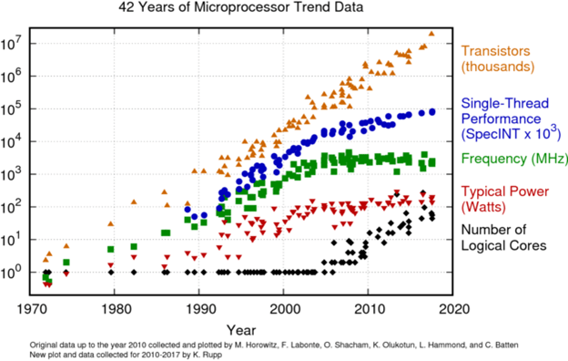
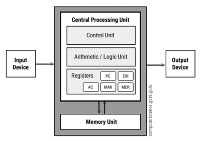
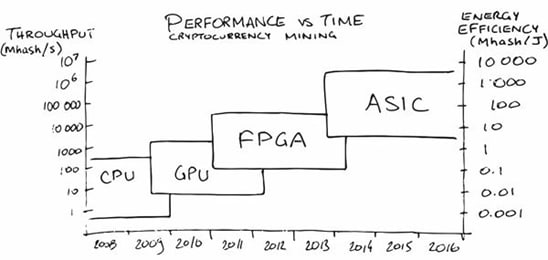
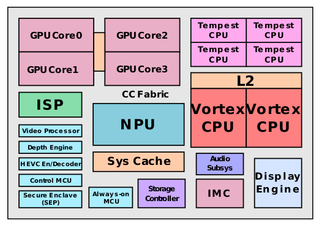
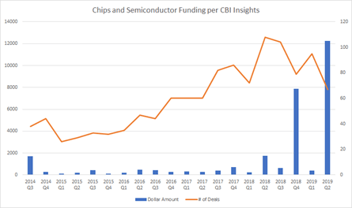
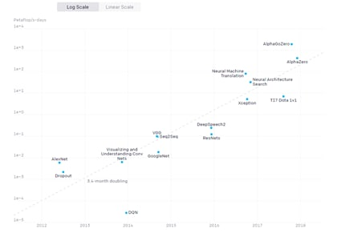

Heterogeneous Compute: The Paradigm Shift No One is Talking About - Mule’s Musings

# Heterogeneous Compute: The Paradigm Shift No One is Talking About

### TLDR: Moore’s law is dead and we are on the cusp of a new paradigm, Heterogeneous compute. Some are calling it a Renaissance, and through specialization and new processes we are in a new era for semis

|     |     |     |     |     |
| --- | --- | --- | --- | --- |
| [mule](https://mule.substack.com/people/34637) | Feb 19 | [ 6](#) | [ 6](https://mule.substack.com/p/heterogeneous-compute-the-paradigm/comments) |  |

* * *

Domain Specific Architecture. Advanced Packaging. 3D IC. Chaplet. Interconnect. Big data. IoT. What do these concepts have in common? They’re all buzzwords, true, but more importantly, they all fit under the big tent of “Heterogeneous Compute”.

I have been following the rise of Heterogeneous Compute closely for the last 2 years – and compared to every other hot tech trend, it’s one of the sleepiest “revolutions” that I’m aware of. This is likely because most investors have a hard time getting over the steep technical hurdle necessary to understand anything semiconductors related. They can’t appreciate what’s really going on right now. Thankfully for you, one of my longer-term projects is to help generalists (and others) understand semiconductors, so we’ll start by talking about the next paradigm in the space: Heterogeneous Compute.

Before we dive into those buzzword applications, however, we need to start at the beginning. What happened? What’s changed? Why now?

# The End of the Last Paradigm: “Bring out your dead! Wait I’m not dead yet!”

*I am not going to baby you. Please refer to Wikipedia for help with confusing terms. If that doesn’t work, feel free to dm me @foolallthetime.*

Overall transistor growth is the result of several underlying processes and trends coming together at once. The **orange transistor** values are obtained by multiplying the values of each color (which represents a process) below it, which is a neat identity of showing just how we’ve achieved transistor growth over the years.

In the beginning there was Moore’s (and Dennard’s) law. You can see the approximation for** Dennard’s in red**, which sadly broke down in the early 2000s. Traditional **Moore’s law is in blue**. When people say that Moore’s law is dead, that slow tapering off to the side is what they are referring to. There is no doubt that Moore’s in its original form has broken down. This can be attributed to the slowing of semiconductor shrink, pricing per core, and performance.

Why have transistors continued to grow in-line with the exponential trend? Over the past decade, technological improvements have allowed **logical core increases (in black)** to pick up the slack. Sadly, we are at the end of this particular tunnel due to **Amdahl’s Law,** which describes the decreasing returns on parallelization (the process of using multiple cores to compute).

In conclusion, the way we have scaled transistors has slowed, and **many of the exponential laws set out at the beginning of semiconductor history are finally breaking down. Moore’s law is dead**. Of course, that doesn’t mean progress is over. Just that the old ways are dead, so we must find a way forward.

But wait, why do so many industry titans (namely Jim Keller and Lisa Su) say that Moore’s law isn’t dead? I think most of the fight is over *semantics*. Moore’s law in the traditional sense of the term is decidedly dead, but the spirit of Moore’s lives on. This is partially demonstrated in AMD’s leap over Intel with the EPYC architecture and chiplets. But, before we talk about that, we need to understand what makes Heterogeneous Compute possible: specialization.

# The Special Thing about Specialization

Specialists beats generalist in the environment they are adapted to. Not exactly a fire take. To bet against this is to deny that 99.99% of the population isn’t farming anymore, and we have moved on to greener and more specialized pastures. While this core principle has been applied to society, biology, and everything we could throw it at, one place we haven’t really implemented this well is in semiconductors. Despite all the advancements in computational power, semiconductors still fundamentally look like Von Neuman’s[[1]](https://mule.substack.com/p/heterogeneous-compute-the-paradigm?token=eyJ1c2VyX2lkIjoyNzM5NTY4LCJwb3N0X2lkIjoyODE3NDUsIl8iOiI4ZkgvdSIsImlhdCI6MTU4MzA3MTQ4MywiZXhwIjoxNTgzMDc1MDgzLCJpc3MiOiJwdWItMjIxMDgiLCJzdWIiOiJwb3N0LXJlYWN0aW9uIn0.wgsnT5r_QXILGOaobHUfNphViTplGtq7RcKu3CAtC5M#_ftn1) representation of them in 1945. [2]

This exact architecture has simply been scaled up to billions of transistors. For the most part, every computational problem we’ve run into so far has been nail-like enough to smash with an exponential scaling hammer. This is what we call Generalized Compute.

GPUs offer the first concrete, sizeable set of different tools in the semiconductor toolkit. GPUs are specialized to accelerate the creation of images, and their architectures is more effective for parallelization than CPUs. Their recent rise in the datacenter for machine learning and data heavy programs prove the concept, but this is just the tip of the iceberg. Below are the speed-ups recognized by additional hardware specialization for cryptocurrency mining. Note that the order of magnitude of speed increases through specialization alone. [[2]](https://mule.substack.com/p/heterogeneous-compute-the-paradigm?token=eyJ1c2VyX2lkIjoyNzM5NTY4LCJwb3N0X2lkIjoyODE3NDUsIl8iOiI4ZkgvdSIsImlhdCI6MTU4MzA3MTQ4MywiZXhwIjoxNTgzMDc1MDgzLCJpc3MiOiJwdWItMjIxMDgiLCJzdWIiOiJwb3N0LXJlYWN0aW9uIn0.wgsnT5r_QXILGOaobHUfNphViTplGtq7RcKu3CAtC5M#_ftn2)[[3]](https://mule.substack.com/p/heterogeneous-compute-the-paradigm?token=eyJ1c2VyX2lkIjoyNzM5NTY4LCJwb3N0X2lkIjoyODE3NDUsIl8iOiI4ZkgvdSIsImlhdCI6MTU4MzA3MTQ4MywiZXhwIjoxNTgzMDc1MDgzLCJpc3MiOiJwdWItMjIxMDgiLCJzdWIiOiJwb3N0LXJlYWN0aW9uIn0.wgsnT5r_QXILGOaobHUfNphViTplGtq7RcKu3CAtC5M#_ftn3)

These are insane speed increases! Multiple generations of Moore’s level growth in a single chart! A simple conclusion is this: if we just specialize our chips, we can extend life way behind Moore’s.

**Applied Materials (NASDAQ: AMAT) management calls this “More than Moore’s”, while Cadence (NASDAQ: CDNS) calls this a Renaissance. I call it the beginning of the next Semiconductor paradigm: Heterogeneous Compute. **

# Letting Go of the Past

There is a weird secret to this new paradigm: it’s been underway for some time. Let’s get back to AMD’s chiplets. In some ways, they partially adhere to the concept of Heterogeneous Compute[[4]](https://mule.substack.com/p/heterogeneous-compute-the-paradigm?token=eyJ1c2VyX2lkIjoyNzM5NTY4LCJwb3N0X2lkIjoyODE3NDUsIl8iOiI4ZkgvdSIsImlhdCI6MTU4MzA3MTQ4MywiZXhwIjoxNTgzMDc1MDgzLCJpc3MiOiJwdWItMjIxMDgiLCJzdWIiOiJwb3N0LXJlYWN0aW9uIn0.wgsnT5r_QXILGOaobHUfNphViTplGtq7RcKu3CAtC5M#_ftn4). One of the reasons why AMD managed to leapfrog Intel to 7nm was because of focus.

You can see the clear difference in design between the chiplet and the multi-die MCM (multi-chip module, aka how we did it in the past generations of CPUs). In the chiplet architecture, the only 7nm part of the process is the CPU dies. This allows AMD to continue the hard process of shrinking to smaller nodes, but with better yields as smaller dies tend to be less prone to defects. Meanwhile the I/O (input/output) is on the tried-and-true 14nm node, which is larger and more stable. This is a very practical application of heterogeneous-like compute, where you push performance in a small but meaningful way. It’s about making something more than the sum of its parts, bringin specialized processes to the correct pieces so you can build something greater than the pieces. Think of it like Legos, you’ve been building things piece by piece with a single units for so long, now you can bring special pieces that fit each role perfectly. Talk about a speedup!

While AMD’s chiplet is cool, the most striking example of heterogeneous-like compute is the Axx chip line by Apple. Apple’s core insight about mobile processors is that while there are a lot of things you do on your phone, at its core there are a few important specialized features that sell them. In the last couple of years that’s been** better photography. **So, they put an ISP (image signal processor)—a specialized chip—to pair with their processor chip to take better photos.

This used to stress the hell out of your CPU—remember how hot iPhone 4s got when you took a long video? Specialized chips make the process faster and more energy efficient. That’s the power of Heterogeneous Compute.

This chip looks a bit more like the future[[6]](https://mule.substack.com/p/heterogeneous-compute-the-paradigm?token=eyJ1c2VyX2lkIjoyNzM5NTY4LCJwb3N0X2lkIjoyODE3NDUsIl8iOiI4ZkgvdSIsImlhdCI6MTU4MzA3MTQ4MywiZXhwIjoxNTgzMDc1MDgzLCJpc3MiOiJwdWItMjIxMDgiLCJzdWIiOiJwb3N0LXJlYWN0aW9uIn0.wgsnT5r_QXILGOaobHUfNphViTplGtq7RcKu3CAtC5M#_ftn6), where there are a lot of specialized parts that go into the specific, increasingly intensive computing processes running on the chip. More interesting is that the share of non CPU/GPU parts of the die has been decreasing, with specialized IP blocks tripling in four years from A4 to A8 architectures. (Shao and Brooks 2015)

It’s clear heterogeneous has already made its mark, but I think things are going to get bonkers only when industry participants let go of the past and embrace the heterogeneous future en masse.

# What’s Next: More than Moore’s

We are finally starting to see the green shoots of this new paradigm emerge. I’m not going to write about each specific part in detail in this post – but I can point to a few things confirming the renewed excitement:

1)      This is a dated graph I made from CBInsights for total semiconductor funding.

This is in the midst of a ton of AI startups coming out of stealth.

2)      AI Compute in training for models is doubling at 3.4 months on average[[5]](https://mule.substack.com/p/heterogeneous-compute-the-paradigm?token=eyJ1c2VyX2lkIjoyNzM5NTY4LCJwb3N0X2lkIjoyODE3NDUsIl8iOiI4ZkgvdSIsImlhdCI6MTU4MzA3MTQ4MywiZXhwIjoxNTgzMDc1MDgzLCJpc3MiOiJwdWItMjIxMDgiLCJzdWIiOiJwb3N0LXJlYWN0aW9uIn0.wgsnT5r_QXILGOaobHUfNphViTplGtq7RcKu3CAtC5M#_ftn7)

Meanwhile Moore’s law shrink is ~2.5 years on average.

3)      General Bullishness on increased energy from R&D leaders from Suppliers

People in the industry think this is exciting and it’s palpable– and I can’t help but agree. Heterogeneous computing gets us a step closer to true level 4/5 driving, which requires a real-time AI engine processing data on the scale  that is currently reserved for data centers. Compare that to the sad state of automatic driving today, where automotive suppliers are whipping around with 10 GPUs (collectively worth more than the car) loaded in the trunk.

Heterogeneous compute has inherent scale built in, which makes it more consumer accessible. A device that costs $10,000+ with high consistent energy needs can theoretically be replaced with one that cost <$1000 with better energy usage.

And that’s just the beginning. Chips will likely be designed for every use case and application you can think of, each optimized in an architecture suited best for its energy and computational output. The next computing paradigm is here.

**When the platform shifts, there will certainly be winners and losers, as there are in every radical change in order. The moats and businesses built on top of the current paradigm often fall from grace.**  **New companies, customers, suppliers, and use cases will emerge, but many companies won’t make the leap.** The opportunity set here is huge, and I can’t wait (to say more in my full-time semis newsletter). Stay tuned.

**Footnotes: **

[[1]](https://mule.substack.com/p/heterogeneous-compute-the-paradigm?token=eyJ1c2VyX2lkIjoyNzM5NTY4LCJwb3N0X2lkIjoyODE3NDUsIl8iOiI4ZkgvdSIsImlhdCI6MTU4MzA3MTQ4MywiZXhwIjoxNTgzMDc1MDgzLCJpc3MiOiJwdWItMjIxMDgiLCJzdWIiOiJwb3N0LXJlYWN0aW9uIn0.wgsnT5r_QXILGOaobHUfNphViTplGtq7RcKu3CAtC5M#_ftnref1) Technically its modified Harvard right now, but essentially the same. Another abstraction of this is “Control flow” https://softwareengineering.stackexchange.com/questions/178454/how-can-i-tell-whether-my-computer-is-harvard-or-von-neumann-architecture

[[2]](https://mule.substack.com/p/heterogeneous-compute-the-paradigm?token=eyJ1c2VyX2lkIjoyNzM5NTY4LCJwb3N0X2lkIjoyODE3NDUsIl8iOiI4ZkgvdSIsImlhdCI6MTU4MzA3MTQ4MywiZXhwIjoxNTgzMDc1MDgzLCJpc3MiOiJwdWItMjIxMDgiLCJzdWIiOiJwb3N0LXJlYWN0aW9uIn0.wgsnT5r_QXILGOaobHUfNphViTplGtq7RcKu3CAtC5M#_ftnref2) Note this is representative – this is roughly approximated from observed speedups from crypto.

 [[3]](https://mule.substack.com/p/heterogeneous-compute-the-paradigm?token=eyJ1c2VyX2lkIjoyNzM5NTY4LCJwb3N0X2lkIjoyODE3NDUsIl8iOiI4ZkgvdSIsImlhdCI6MTU4MzA3MTQ4MywiZXhwIjoxNTgzMDc1MDgzLCJpc3MiOiJwdWItMjIxMDgiLCJzdWIiOiJwb3N0LXJlYWN0aW9uIn0.wgsnT5r_QXILGOaobHUfNphViTplGtq7RcKu3CAtC5M#_ftnref3)https://news.fpga.guide/cryptocurrency-mining-why-use-fpga-for-mining-fpga-vs-gpu-vs-asic-explained/ Ironically bitcoin mining is a really good case of exponential compute demand and how to solve those problems.

 [[4]](https://mule.substack.com/p/heterogeneous-compute-the-paradigm?token=eyJ1c2VyX2lkIjoyNzM5NTY4LCJwb3N0X2lkIjoyODE3NDUsIl8iOiI4ZkgvdSIsImlhdCI6MTU4MzA3MTQ4MywiZXhwIjoxNTgzMDc1MDgzLCJpc3MiOiJwdWItMjIxMDgiLCJzdWIiOiJwb3N0LXJlYWN0aW9uIn0.wgsnT5r_QXILGOaobHUfNphViTplGtq7RcKu3CAtC5M#_ftnref4) This is technically process specialization, not domain specific specialization. But clearly this is Heterogenous. s/o to Essen here.

[[5]](https://mule.substack.com/p/heterogeneous-compute-the-paradigm?token=eyJ1c2VyX2lkIjoyNzM5NTY4LCJwb3N0X2lkIjoyODE3NDUsIl8iOiI4ZkgvdSIsImlhdCI6MTU4MzA3MTQ4MywiZXhwIjoxNTgzMDc1MDgzLCJpc3MiOiJwdWItMjIxMDgiLCJzdWIiOiJwb3N0LXJlYWN0aW9uIn0.wgsnT5r_QXILGOaobHUfNphViTplGtq7RcKu3CAtC5M#_ftnref6)https://openai.com/blog/ai-and-compute/

[[6]](https://mule.substack.com/p/heterogeneous-compute-the-paradigm?token=eyJ1c2VyX2lkIjoyNzM5NTY4LCJwb3N0X2lkIjoyODE3NDUsIl8iOiI4ZkgvdSIsImlhdCI6MTU4MzA3MTQ4MywiZXhwIjoxNTgzMDc1MDgzLCJpc3MiOiJwdWItMjIxMDgiLCJzdWIiOiJwb3N0LXJlYWN0aW9uIn0.wgsnT5r_QXILGOaobHUfNphViTplGtq7RcKu3CAtC5M#_ftnref7)https://en.wikichip.org/wiki/apple/ax/a12

|     |     |     |
| --- | --- | --- |
| [ 6](#) | [ 6](https://mule.substack.com/p/heterogeneous-compute-the-paradigm/comments) |  |