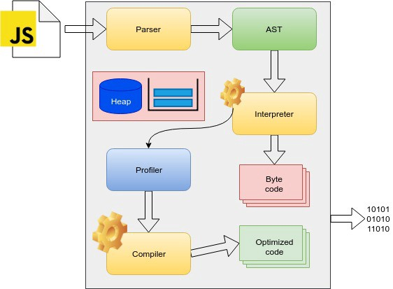
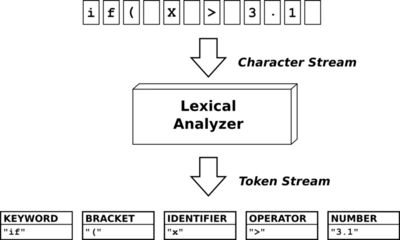
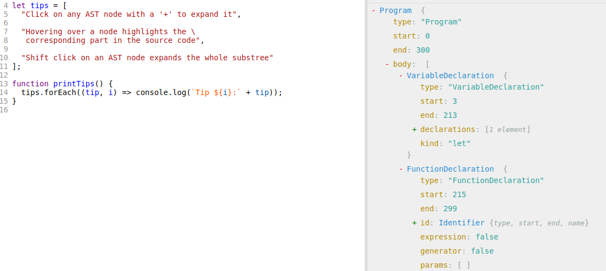

How Does JavaScript Really Work? (Part 1) – Bits and Pieces

# How Does JavaScript Really Work? (Part 1)

## What is V8 and what happens under the hood when JavaScript runs?

[Priyesh Patel](https://blog.bitsrc.io/@priyeshp18)
May 6·6 min read

If you are a JS developer or a student learning the language, there is a very high chance that you came across the two-letter word ‘V8’’. In this article, I will give you a brief overview of different JS engines and then dive deeper into how the V8 engine works. The second part of this article will contain memory management concepts and will be released soon.

This post is brought to you by [**Bit**](https://bit.dev/) ([GitHub](https://github.com/teambit/bit)):**  **the platform for shared components. Bit helps everyone build modular JavaScript applications, easily share components between projects and team, and build better & faster. [Try it](https://bit.dev/).

Bit: easily share components between projects and teams.

### How do programming languages work?

Before we start with JavaScript, let’s understand the basic working of any programming language. The computer is made of microprocessors and we write code to instruct this tiny but powerful machines. But what is the language that the microprocessors understand? They don’t understand Java, Python, etc., but only machine code.

Writing enterprise level code in machine or assembly language is not feasible, so we need High-level languages like Java, Python along with a compiler or an interpreter to convert it to machine code.

#### Compilers and Interpreters

Compiler/interpreter can be written the same language that it processes or any other language too.

**Interpreter: **Reads and translates the file line by line on the fly. Initially, this is how JavaScript worked.

**Compiler: **A compiler works ahead of time and creates a new file which contains the machine code translation for your input file.

There are two ways in which we could translate the JavaScript code to machine code. When the code is compiled, the machine has a better understanding of what is going to happen before the code starts to run which makes the execution faster later on, but it takes some time up front for this process.

On the other hand, when the code is interpreted, the execution starts immediately and hence faster, but lack of optimizations makes it really slow with large applications.

People making the ECMAScript engines are really smart, so they use the best of both worlds and make a JIT(Just-in-time) compiler. JavaScript is compiled as well as interpreted but the actual implementation and order depend on the engine. We will see what is the strategy employed by the team at V8.

### JavaScript to Machine code

In the case of JavaScript, there is an engine to convert it to machine code. Similar to other languages, this engine can be built using any language and hence there is not just one engine.

- •V8 is Google’s implementation of the engine for its Chrome browser.
- •SpiderMonkey was the first engine built for Netscape Navigator and now powers FireFox.
- •JavaScriptCore is what Apple uses for the Safari browser.

This list is quite big and if you want to know the engine behind Internet Explorer, visit [this Wikipedia page](https://en.wikipedia.org/wiki/JavaScript_engine).

#### ECMAScript

One question arises from the huge list of engines; Can I make my own engine? Yes, just follow the ECMAScript standard.

If we are making a translator, we need to know the valid words from both the languages. We already know what is valid in machine language, but what is valid in JavaScript needs to be standardized.

This standardization of JavaScript is handled by an organization called Ecma International in a specification called the ECMAScript or ES. So now when you come across an article/video “What’s new in ES7?”, you know that it refers to the newly added features to JS by the ECMAScript standard.

### The V8 engine

#### Some history

Google created Google Maps for the browser which required a lot of processing power. The JavaScript implementation at that time was not good enough to run maps fast. Google wants to bring more users to their services so that they can sell more advertisements and make money. For this, the service needs to be fast and robust. So Google built its own engine called the V8 in C++ which was launched in 2008 and quite fast or as some say the fastest.

#### Parsing and building the tree

The JavaScript file enters the engine and the parser does lexical analysis which breaks the code into tokens to identify their meaning. These tokens make the **AST(Abstract Syntax Tree).**

The ASTs play a critical role in the semantic analysis where the compiler validates the correct usage of the language elements and keywords. Later on, the ASTs are used to generate the actual bytecode or machine code.

JavaScript to AST using [astexplorer.net](https://astexplorer.net/)

#### Heart of the engine

- •As we discussed earlier, JavaScript is interpreted by an interpreter named **Ignition** as well as compiled by a JIT optimizing compiler named **TurboFan**.
- •Initially, the ASTs generated in the previous step are given to the interpreter which generates non-optimized machine code quickly and the execution can start with no delay.
- •**Profiler** watches the code as it runs and identifies areas where optimizations can be performed. For example, a ‘for’ loop running 100 times but producing the same result in each iteration.
- •Using this profiler, any unoptimized code is passed to the compiler to perform optimizations and generate machine code which eventually replaces its counterpart in the previously generated non-optimized code by the interpreter.
- •As the profiler and compiler constantly make changes to the bytecode, the JavaScript execution performance gradually improves.

#### Some more history

Before the release of version 5.9 of the V8, it used two optimizing compilers and a baseline compiler.

- •The Baseline compiler named full-codegen produced machine code quickly which was not optimized.
- •The two optimizing compilers named Crankshaft and TurboFan were employed in the optimization of the code.

With new features added to JavaScript, it became difficult for the V8 team to maintain the same pipeline because of increasing architectural complexity. If you want to read more about the old approach and the reasons for the switch to a new pipeline, visit [their site here](https://v8.dev/blog).

#### Into the future

This working of the V8 engine may change in the future as more research is done to further improve performance. Moreover, as [Webassembly](https://webassembly.org/) starts to take shape, an additional step may be added to the pipeline.

### Conclusion

There are a lot of implementations of the ECMAScript engines and V8 by Google is the most famous one. I hope this article succeeded in giving you a brief overview of not only how JavaScript works, but also in general how a programming language works. If you want to know what are the future plans of the V8 team or want even more details on the engine, they have a wonderful blog [here](https://v8.dev/blog).

Part 2 of this article will be released soon in which I will talk about memory heap, stack, event loop and may more concepts related to the execution of JavaScript code. So stay tuned!

If you are confused where Node.js fits in all these, I have accidentally written a very good article.

[**What exactly is Node.js?** *Node.js is a JavaScript runtime environment. Sounds great, but what does that mean? How does that work?*medium.freecodecamp.org](https://medium.freecodecamp.org/what-exactly-is-node-js-ae36e97449f5)[(L)](https://medium.freecodecamp.org/what-exactly-is-node-js-ae36e97449f5)