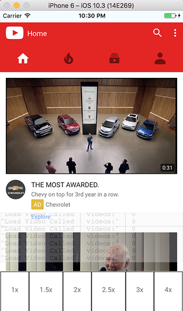
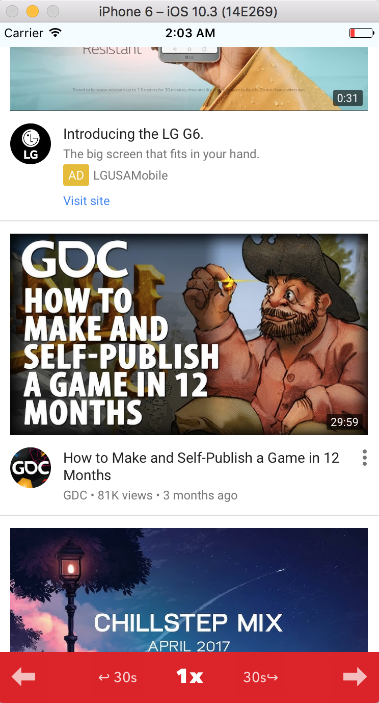

How I learned React Native by building and shipping an app to study faster

# How I learned React Native by building and shipping an app to study faster

 [Programming](http://vasir.net/blog)

Posted on Apr 13th, 2017

This post is an overview of how I learned React Native by taking a problem and shipping a product to solve it. This post details the entire app design and development process I took to build YouSpeeder, a simple app allows you to adjust YouTube playback speed. This post covers my process from idea to implementation to shipping in both [Google Play Store](https://play.google.com/store/apps/details?id=com.youspeeder) and [Apple app stores](https://itunes.apple.com/us/app/youspeeder/id1227365631?ls=1&mt=8).

Watching some lectures and want to finish studying them by the afternoon instead of the evening? That's the point of **  [YouSpeeder](https://itunes.apple.com/us/app/youspeeder/id1227365631?ls=1&mt=8)  **.

 

Simple react native app to adjust YouTube playback speed.

Available on [Android - Google Play](https://play.google.com/store/apps/details?id=com.youspeeder) and [iOS - Apple App Store](https://itunes.apple.com/us/app/youspeeder/id1227365631?ls=1&mt=8)

### Product Design - 1. Identify the Problem

You can create a product that solves your own [problem](http://paulgraham.com/startupideas.html) or someone else's problem. Generally, it is easier to solve your own problem because you deeply understand it.

Sometimes multiple problems can be solved at once, but it's usually easier to clearly define a single problem and focus on it entirely. My main problem was wanting to learn React Native, but that's not enough for a product. I thought about the biggest pain points I have when using my iPhone, and the one that stuck out was:

>  Problem: I wanted to watch lectures on YouTube on my phone at 2x speed

I waste a lot of time, but I'd like to waste less. I listen to a lot of audio books and lectures on my daily commute, and when doing things like jogging or cleaning dishes. To save time, the playback rate is always set at 1.5x or 2x.

When watching lectures on YouTube on my laptop, I can increase the playback rate. I cannot do this on my phone. For me, this problem makes the mobile YouTube app unusable.

###  2. Design a Solution

This is a simple product. The problem is so clear that the solution immediately presents itself: *Provide playback speed controls*. While the solution might be clear, the way we get there is not.

My process involved jumping directly into the code and prototyping possible solutions. This isn't always a great approach, but I wasn't sure exactly what kind of in-app experience I wanted to create. I only knew I wanted to increase the playback speed. Because I wanted to also learn React Native while prototyping the app, I skipped a traditional wireframing / mockup process. [Framer](https://framer.com/) is a great prototyping tool, but in this case for me it would be just as quick to iterate in code as it would be to iterate in a different prototyping tool.

Before coding though, I imagined how I might solve the problem at a technical level. I knew from working on [a previous product](http://vasir.net/blog/programming/projects/midnight-netflix-chat) that wrapping an app inside another app isn't really possible on iOS (but there are ways to achieve similar kinds of experiences on Android). Therefore, it seemed the answer would be to use some sort of webview and inject client side code to manipulate the client side `<video>` elements to adjust playback speed.

####  3. Build a Prototype

I do experience with React, but none with React Native. To get started, I followed the terrific [Facebook React Native tutorial](https://facebook.github.io/react-native/docs/tutorial.html). After getting a basic project going, I did spend too much time looking at different "starter kits," like [Ignite](https://github.com/infinitered/ignite) and [Este](https://github.com/este/este), but decided to keep it simple. With a more complex app, I would likely pursue Ignite. These kits are extremely helpful when building any kind of application that requires multiple views or components, as they bundle a lot of best practices and tools in an easy to use package.

The one potential downside, however, is by using them you may not as easily fully learn how the pieces work together (but you can get going much faster). I personally learn best by doing, and so would not recommend diving into a starter kit before building a simple app so you can experience for yourself the decisions made by starter kits.

My design process was intertwined with the development. I began by getting a simple, ugly prototype working that would adjust the current video's playback speed. For this product, I needed to actually play around with it and get the entire experience to know what direction I wanted to the design to take.

 
Initial prototype with logger and basic controls

As ironic as it sounds, the app is basically a webview with native app playback controls. In fact, the entire app *could* just be a webview, but then I wouldn't learn much about React Native. When you press the "2x" button, it sends a message to injected client-side code to increase video playback speed. I won't get into the fine details of the code here, but you can find the [full source on GitHub](https://github.com/erikhazzard/YouSpeeder). I already have experience with React, so the learning curve was very quick. If you do not have experience with React though, the [React Fundamentals course](https://reacttraining.com/online/react-fundamentals) is excellent.

I made a lot of use of logging throughout the dev process. The app is essentially a webview with React Native controls to adjust client content (the videos). Because the injected javascript lives on the page and not in the native app itself, console logs did not show up in the React Native debugger - so, I tested the injected code locally (outside of react native), and also injected log messages into the page itself in the React Native app.

After getting a prototype working, I started working on the UI so it wouldn't look like you didn't need to learn VIM to use it.

 
Prototype v2

It's not going to win any design awards. However, it does condense all app actions into just a few buttons. Playback speed is changed by cycling through values. I discovered that I rarely ever needed to jump from 1x to 4x. It does force more taps to get to the playback speed you want, and there is some hidden complexity in that you don't know the bounds; but the tradeoff is a simplified, small UI element.

Initially, there were over 10 playback speeds you could cycle through, going all the way from 0.1x to 4x. This was painful and unnecessary. I simplified it to use 0.5, 1, 1.25, 1.5, 2x values, and it covered all speeds I ever actually wanted to use. Before actually using the prototype, it's hard to know how seemingly small decisions, like number playback speed options, can make the app experience painful or pleasant.

Next, I started next to implement advanced controls hidden behind a drawer using [React Native Drawer](https://github.com/root-two/react-native-drawer), but after using the app more, I realized it was solving my goal and I didn't want to get entangled by feature creep.

####  Polish and Knowing When to Stop

There are number of things that can be improved, but the goal of this app was to learn React Native and ship a simple product that would solve playback speed for "most" people. To that end, I added some polish (a ripple effect) and ensured all provided playback speed values would still provide a quality video experience.

The first bit of polish was adding a ripple effect. I tried a couple different material UI libraries, but in the end [this simple ripple library](https://github.com/n4kz/react-native-material-ripple) proved to be the quickest, simplest, and easiest to integrate. It's a simple effect, but it adds some juicy feedback to the UI.

 
Ripple effect

In terms of UX polish, one thing that was slightly annoying was that when the video was at 0.5x playback speed, the 30sec time skip was too great. To make that experience better, at 0.5x playback speed the time skip buttons will go back or forward by 15 seconds instead of 30. It was not obvious before using the prototype that the time skip should change based on playback speed, but that's the benefit of iterative prototyping: you can quickly discover how each element affects the entire experience.

The navigation controls (back / forward arrows) could be improved, but overall they effectively accomplish the goal (you can't go forward / backward without them). Alternatively, a swipe gesture recognizer could be used to achieve the same effect, and it may have led to a better experience. However, I made the tradeoff to ship it now and improve it later.

Secondly, a more advanced control pane should exist. While the playback controls are great for all the use cases I had, it would serve power users better if there were a way to allow more fine grained playback speed options. For example, being able to play videos at 2.5x or 3x. The reason I did not include anything higher than 2x was because after 2x, video playback on mobile looks bad - it stutters and is janky. 2x was the upper limit for an acceptable "user friendly" playback speed. However, if higher playback speeds were enabled behind an advanced settings pane or drawer, stuttering videos would be acceptable as the user is more amenable to a degraded video watching experience.

With these things in mind, the goal of this app was to learn React Native and ship a product that solves the problem of speeding up videos. More polish and features could make it better, or more pleasant, but perfect is the enemy of good (or something). My goal was to ship a product that solved my problem in a pleasant way. There's always room for improvement.

####  Shipping to the App Stores

I followed the following steps for each platform. iOS wasn't as streamlined as I hoped, but it is pretty straightfoward after doing it the first time.

##### Apple App Store Deployment

To publish it, I followed [Facebook's Tutorial](https://facebook.github.io/react-native/docs/running-on-device.html#building-your-app-for-production), along with [this guide to release to the App Store](https://clearbridgemobile.com/how-to-submit-an-app-to-the-app-store/).

Important note - make sure to change the `Deployment Target` in the Deployment Info section under your project settings, otherwise you may be limiting your app to newer versions of iOS unintentionally.

**Problems**When following steps, everything went fine until I tried to archive it. I received the error "YouSpeeder has conflicting provisioning settings. YouSpeeder is automatically signed for development, but a conflicting code signing identity iPhone Distribution has been manually specified. Set the code signing identity value to "iPhone Developer" in the build settings editor, or switch to manual signing in the project editor. Code signing is required for product type 'Application' in SDK 'iOS 10.3'." It seems this is because I manually tried to set the build settings as per the second tutorial. This was unnecessary - set it back to automatic and then in the General -> Signing second, check "Automatically manage signing." (see [this StackOverflow answer](http://stackoverflow.com/questions/40824727/i-get-conflicting-provisioning-settings-error-when-i-try-to-archive-to-submit-an) if you get stuck).

After submitting it for review, it took two days to be approved.

##### Google Play Store

Very straightforward. I followed [Facebook's tutorial](https://facebook.github.io/react-native/docs/signed-apk-android.html) and then [Google's release guide](https://support.google.com/googleplay/android-developer/answer/113469?hl=en) and had zero issues.

####  1. Build App. 2. ??? 3. Profit

If you build an app that's compelling enough and solves a problem, some people will pay for it. It's a simple concept, but it's not easy.

I priced the app at $0.99 and got more downloads than I expected. Apparently, a number of people had the same problem I did. There are a few areas that I think led to downloads.

 **First**, the icon is simple and mimics existing concepts (both YouTube and Fast Forward buttons).

 

The app is just YouTube with playback controls, so my goal was to capture the core YouTube logo but change it enough to communicate the added value.

After creating the logo in photoshop, I used [http://appicon.build/](https://makeappicon.com/) to generate app icons for different device sizes.

 **Second**, I included screenshots that clearly communicated what the app did. Before I created them, I looked at the most popular apps to get a sense of what works. I tried to immediately communicate the app's value and tried to take what worked from other successful apps by imitating their marketing aesthetic. Don't copy, but steal what works. Figure out the components and use them yourself.

One problem I tried to hook into was the problem of wanting to study faster. When you're watching a video at twice the playback speed, it takes you half as long to get through it. This doesn't always mean you'll be studying faster of course, but I have saved a lot of time by watching lectures that were sped up.

 **Lastly**, I'm not sure how much the description helped convert users, but I aimed to provide a concise summary of the app.

> Speed up YouTube videos

Condensing the value into [a single sentence](https://medium.dave-bailey.com/the-magic-formula-to-describe-a-product-in-one-sentence-175ce38619c7) with no more than ten words is a good constraint that can help focus your product.

The [Google Play Store](https://play.google.com/store/apps/details?id=com.youspeeder&rdid=com.youspeeder) accounted for far fewer downloads (surprisingly to me, only about about 5%) than the [Apple App Store](https://itunes.apple.com/us/app/youspeeder/id1227365631?ls=1&mt=8).

##  React Native Problems and Stumbling Blocks

I encountered a number of issues throughout the whole development process that led me with the impression that while it's incredible, React Native still has room for improvement.

The first issues were a class of build error problems with iOS, including:

- "RCTBundleURLProvider.h file not found in AppDelegate.m"

- Errors with profile; XCcode, provisioning profile, Xcode would just freeze when compiling

- Errors with "No bundle URL present"

- Can't package react native because of port 8081 sunproxyadmin

- ProxyComponent has no propType for native prop ... and View has no propType error

All build issues were solved by some combination of `rm -rf node_modules`, "Command + Shift + K" in XCode (to clean), `watchman watch-del-all`, `npm cache clean`, `npm start -- -- reset-cache` updating package versions, and restarting my computer, and re-running `:w             npm install`. These errors, which seemingly had nothing to do with code, were the most frustrating part of the whole dev process. But, no toolset is without its own gotchas.

I also ran into a few smaller issues tripped me up but become obvious after you've spent some time with it (or fully read the [whole React Native tutorial](https://facebook.github.io/react-native/docs/tutorial.html)), such as:

- On iOS, all animations slowed down unexpectedly. The reason: I unwittingly pressed COMMAND + T, which slows down animations (can be toggled in the toolbar under Debug -> Slow Animations)

- After running it on my iPhone, the app would not open when I was disconnected for the network. A *[release build](https://facebook.github.io/react-native/docs/running-on-device.html)* must be created to allow this.

- With iOS, simply running `react-native run-ios` will boot up the sim and I'm good to go; but for android development, I had to open the simulator through Android Studio.

#####  Implementation - Web View Problems

Because the app uses a webview, ideally we want bi-directional communication. Unfortunately, I was able to only get communication from React Native to Webview working.

The [Facebook docs on WebViews](https://facebook.github.io/react-native/docs/webview.html) have examples of bi-directional communication. However, when running the code with the versions of React Native I had, it did not work. There are [a number](https://github.com/facebook/react-native/issues/10865)[of open](https://github.com/facebook/react-native/pull/10941)[issues](https://github.com/facebook/react-native/issues/1086) about this problem, and all attempts to solve it were fruitless. Fortunately, to solve the problem I only really need to send a message to the client code. Unfortunately, because YouTube is a single page app, `onNavigationStateChange` is not properly triggered, so it's much more difficult to track navigation since the client cannot send a message to the native app when the route changes.

None of these problems were show stopping, and after experiencing them they become easier to manage. Like any system, there is room for improvement, and I could see some of these issues being very frustrating for beginners. However, there are countless resources to help overcome these issues.

###  React Native Community

The React Native community is likewise encouraging and the amount of resources out there is staggering. The [Awesome React Native List](https://github.com/jondot/awesome-react-native) is a terrific resource that gives a thousand foot overview of what's out there, but it could seem overwhelming at first. The code and community is always improving, which leads to pretty fast changes. There's a [great overview of React Native as of March 2017](https://medium.com/react-native-development/react-native-app-stack-march-2017-f7605e02d46f), but even this will be "outdated" in a few months.

To keep up with progress, I cannot recommend enough the [react native newsletter](http://reactnative.cc/). It's an invaluable hand curated resource that highlights what's going on in the react native world.

If those sources aren't enough, there is also a terrific [community on discord](http://join.reactiflux.com/).

###  Conclusion

React Native is incredible. It's not perfect, but overall I love React Native. I've made both simple and moderately complex iOS apps before with Objective C and Swift, but I was amazed by how fast I could iterate and build with React Native. Most the dev time was focused on the injected client side webview code, not even the actual React Native code! The contributors and maintainers are doing a fantastic job.

The source code for YouSpeeder is [available on GitHub](https://github.com/erikhazzard/YouSpeeder). Build it yourself, or take what works and use it as a base to get into React Native yourself!

You can also check it out on the [Google Play Store](https://play.google.com/store/apps/details?id=com.youspeeder) and the [Apple App Store](https://itunes.apple.com/us/app/youspeeder/id1227365631?ls=1&mt=8).

Happy React'ing!

 [ PREVIOUS | Crafting Experiences with Data Visualization](http://vasir.net/blog/data-visualization/crafting-experiences-with-data-visualization)  [ All Posts](http://vasir.net/blog)

# Engage

 [⇧ Like]()

 [   Tweet]()  [ Reddit]()

# Comments

- [7 comments]()
- [**Erik Hazzard**](https://disqus.com/home/forums/vasir/)
- [Login](https://disqus.com/embed/comments/?base=default&f=vasir&t_u=http%3A%2F%2Fvasir.net%2Fblog%2Fprogramming%2Freact-native-beginner-tutorial-overview&t_d=How%20I%20learned%20React%20Native%20by%20building%20and%20shipping%20an%20app%20to%20study%20faster&t_t=How%20I%20learned%20React%20Native%20by%20building%20and%20shipping%20an%20app%20to%20study%20faster&s_o=default#)
- [1](https://disqus.com/home/inbox/)
- [ Recommend](https://disqus.com/embed/comments/?base=default&f=vasir&t_u=http%3A%2F%2Fvasir.net%2Fblog%2Fprogramming%2Freact-native-beginner-tutorial-overview&t_d=How%20I%20learned%20React%20Native%20by%20building%20and%20shipping%20an%20app%20to%20study%20faster&t_t=How%20I%20learned%20React%20Native%20by%20building%20and%20shipping%20an%20app%20to%20study%20faster&s_o=default#)
- [⤤Share](https://disqus.com/embed/comments/?base=default&f=vasir&t_u=http%3A%2F%2Fvasir.net%2Fblog%2Fprogramming%2Freact-native-beginner-tutorial-overview&t_d=How%20I%20learned%20React%20Native%20by%20building%20and%20shipping%20an%20app%20to%20study%20faster&t_t=How%20I%20learned%20React%20Native%20by%20building%20and%20shipping%20an%20app%20to%20study%20faster&s_o=default#)
- [Sort by Best](https://disqus.com/embed/comments/?base=default&f=vasir&t_u=http%3A%2F%2Fvasir.net%2Fblog%2Fprogramming%2Freact-native-beginner-tutorial-overview&t_d=How%20I%20learned%20React%20Native%20by%20building%20and%20shipping%20an%20app%20to%20study%20faster&t_t=How%20I%20learned%20React%20Native%20by%20building%20and%20shipping%20an%20app%20to%20study%20faster&s_o=default#)

Join the discussion…

-

    - [−](https://disqus.com/embed/comments/?base=default&f=vasir&t_u=http%3A%2F%2Fvasir.net%2Fblog%2Fprogramming%2Freact-native-beginner-tutorial-overview&t_d=How%20I%20learned%20React%20Native%20by%20building%20and%20shipping%20an%20app%20to%20study%20faster&t_t=How%20I%20learned%20React%20Native%20by%20building%20and%20shipping%20an%20app%20to%20study%20faster&s_o=default#)
    - [*⚑*](https://disqus.com/embed/comments/?base=default&f=vasir&t_u=http%3A%2F%2Fvasir.net%2Fblog%2Fprogramming%2Freact-native-beginner-tutorial-overview&t_d=How%20I%20learned%20React%20Native%20by%20building%20and%20shipping%20an%20app%20to%20study%20faster&t_t=How%20I%20learned%20React%20Native%20by%20building%20and%20shipping%20an%20app%20to%20study%20faster&s_o=default#)

[Sivadass N](https://disqus.com/by/sivadassn/)•[13 hours ago](http://vasir.net/blog/programming/react-native-beginner-tutorial-overview#comment-3273147669)

Thanks for sharing your experience man, it really motivates!

-

    - [−](https://disqus.com/embed/comments/?base=default&f=vasir&t_u=http%3A%2F%2Fvasir.net%2Fblog%2Fprogramming%2Freact-native-beginner-tutorial-overview&t_d=How%20I%20learned%20React%20Native%20by%20building%20and%20shipping%20an%20app%20to%20study%20faster&t_t=How%20I%20learned%20React%20Native%20by%20building%20and%20shipping%20an%20app%20to%20study%20faster&s_o=default#)
    - [*⚑*](https://disqus.com/embed/comments/?base=default&f=vasir&t_u=http%3A%2F%2Fvasir.net%2Fblog%2Fprogramming%2Freact-native-beginner-tutorial-overview&t_d=How%20I%20learned%20React%20Native%20by%20building%20and%20shipping%20an%20app%20to%20study%20faster&t_t=How%20I%20learned%20React%20Native%20by%20building%20and%20shipping%20an%20app%20to%20study%20faster&s_o=default#)

[Tyler McGinnis](https://disqus.com/by/tylermcginnis/)•[a day ago](http://vasir.net/blog/programming/react-native-beginner-tutorial-overview#comment-3272139022)

Hey Erik! Great write up. Just wanted to say thank you for mentioning our React Fundamentals course.

    -

        - [−](https://disqus.com/embed/comments/?base=default&f=vasir&t_u=http%3A%2F%2Fvasir.net%2Fblog%2Fprogramming%2Freact-native-beginner-tutorial-overview&t_d=How%20I%20learned%20React%20Native%20by%20building%20and%20shipping%20an%20app%20to%20study%20faster&t_t=How%20I%20learned%20React%20Native%20by%20building%20and%20shipping%20an%20app%20to%20study%20faster&s_o=default#)
        - [*⚑*](https://disqus.com/embed/comments/?base=default&f=vasir&t_u=http%3A%2F%2Fvasir.net%2Fblog%2Fprogramming%2Freact-native-beginner-tutorial-overview&t_d=How%20I%20learned%20React%20Native%20by%20building%20and%20shipping%20an%20app%20to%20study%20faster&t_t=How%20I%20learned%20React%20Native%20by%20building%20and%20shipping%20an%20app%20to%20study%20faster&s_o=default#)

[Erik Hazzard](https://disqus.com/by/ehazzard/)Mod[*>* Tyler McGinnis](http://vasir.net/blog/programming/react-native-beginner-tutorial-overview#comment-3272139022)•[a day ago](http://vasir.net/blog/programming/react-native-beginner-tutorial-overview#comment-3272201417)

Thanks Tyler! Thank you for your course, your teaching style is masterful. You managed to weave theory and application in a very engaging way, and did a terrific job of breaking down concepts that people sometimes skirt over and assume people understand (e.g., your explanations of declarative vs imperative programming). Incredible teaching skill.

For anyone reading, the course is extremely beginner friendly and the link is [https://reacttraining.com/o...](https://disq.us/url?url=https%3A%2F%2Freacttraining.com%2Fonline%2Freact-fundamentals%3AS7_my49oA2jc37Pa7cHNB-4c-h8&cuid=522323) . Check it out! (There's also a react native course!)

-

    - [−](https://disqus.com/embed/comments/?base=default&f=vasir&t_u=http%3A%2F%2Fvasir.net%2Fblog%2Fprogramming%2Freact-native-beginner-tutorial-overview&t_d=How%20I%20learned%20React%20Native%20by%20building%20and%20shipping%20an%20app%20to%20study%20faster&t_t=How%20I%20learned%20React%20Native%20by%20building%20and%20shipping%20an%20app%20to%20study%20faster&s_o=default#)
    - [*⚑*](https://disqus.com/embed/comments/?base=default&f=vasir&t_u=http%3A%2F%2Fvasir.net%2Fblog%2Fprogramming%2Freact-native-beginner-tutorial-overview&t_d=How%20I%20learned%20React%20Native%20by%20building%20and%20shipping%20an%20app%20to%20study%20faster&t_t=How%20I%20learned%20React%20Native%20by%20building%20and%20shipping%20an%20app%20to%20study%20faster&s_o=default#)

[Con Antonakos](https://disqus.com/by/twitter-260828058/)•[a day ago](http://vasir.net/blog/programming/react-native-beginner-tutorial-overview#comment-3272333534)

Thanks for this awesome write-up! Really looking forward to diving into React Native. For your bundling issues, did you get to try yarn at all?

-

    - [−](https://disqus.com/embed/comments/?base=default&f=vasir&t_u=http%3A%2F%2Fvasir.net%2Fblog%2Fprogramming%2Freact-native-beginner-tutorial-overview&t_d=How%20I%20learned%20React%20Native%20by%20building%20and%20shipping%20an%20app%20to%20study%20faster&t_t=How%20I%20learned%20React%20Native%20by%20building%20and%20shipping%20an%20app%20to%20study%20faster&s_o=default#)
    - [*⚑*](https://disqus.com/embed/comments/?base=default&f=vasir&t_u=http%3A%2F%2Fvasir.net%2Fblog%2Fprogramming%2Freact-native-beginner-tutorial-overview&t_d=How%20I%20learned%20React%20Native%20by%20building%20and%20shipping%20an%20app%20to%20study%20faster&t_t=How%20I%20learned%20React%20Native%20by%20building%20and%20shipping%20an%20app%20to%20study%20faster&s_o=default#)

[JD](https://disqus.com/by/disqus_Zl7iP8ejdM/)•[18 hours ago](http://vasir.net/blog/programming/react-native-beginner-tutorial-overview#comment-3272934382)

am i the only one not receiving sound for the videos? i love the problem the app solves. the interface is quite practical. well done. just no volume. perhaps its my iphone? (running 10.2.1)

    -

        - [−](https://disqus.com/embed/comments/?base=default&f=vasir&t_u=http%3A%2F%2Fvasir.net%2Fblog%2Fprogramming%2Freact-native-beginner-tutorial-overview&t_d=How%20I%20learned%20React%20Native%20by%20building%20and%20shipping%20an%20app%20to%20study%20faster&t_t=How%20I%20learned%20React%20Native%20by%20building%20and%20shipping%20an%20app%20to%20study%20faster&s_o=default#)
        - [*⚑*](https://disqus.com/embed/comments/?base=default&f=vasir&t_u=http%3A%2F%2Fvasir.net%2Fblog%2Fprogramming%2Freact-native-beginner-tutorial-overview&t_d=How%20I%20learned%20React%20Native%20by%20building%20and%20shipping%20an%20app%20to%20study%20faster&t_t=How%20I%20learned%20React%20Native%20by%20building%20and%20shipping%20an%20app%20to%20study%20faster&s_o=default#)

[Erik Hazzard](https://disqus.com/by/ehazzard/)Mod[*>* JD](http://vasir.net/blog/programming/react-native-beginner-tutorial-overview#comment-3272934382)•[18 hours ago](http://vasir.net/blog/programming/react-native-beginner-tutorial-overview#comment-3272942503)

Thanks JD, I appreciate it! Is your phone on silent or vibrate by any chance? I actually had my phone switched to silent and spent a good 10 minutes trying to debug why sound wasn't playing, then I plugging in headphones and realized it. If that's not the problem though please let me know and I will do my best to fix it. Thanks again!

        -

            - [−](https://disqus.com/embed/comments/?base=default&f=vasir&t_u=http%3A%2F%2Fvasir.net%2Fblog%2Fprogramming%2Freact-native-beginner-tutorial-overview&t_d=How%20I%20learned%20React%20Native%20by%20building%20and%20shipping%20an%20app%20to%20study%20faster&t_t=How%20I%20learned%20React%20Native%20by%20building%20and%20shipping%20an%20app%20to%20study%20faster&s_o=default#)
            - [*⚑*](https://disqus.com/embed/comments/?base=default&f=vasir&t_u=http%3A%2F%2Fvasir.net%2Fblog%2Fprogramming%2Freact-native-beginner-tutorial-overview&t_d=How%20I%20learned%20React%20Native%20by%20building%20and%20shipping%20an%20app%20to%20study%20faster&t_t=How%20I%20learned%20React%20Native%20by%20building%20and%20shipping%20an%20app%20to%20study%20faster&s_o=default#)

[JD](https://disqus.com/by/disqus_Zl7iP8ejdM/)[*>* Erik Hazzard](http://vasir.net/blog/programming/react-native-beginner-tutorial-overview#comment-3272942503)•[10 hours ago](http://vasir.net/blog/programming/react-native-beginner-tutorial-overview#comment-3273250618)

Nice call! That was it. Thanks Erik!

## Also on **Erik Hazzard**

- [ ### OpenLayers Tutorial - Part 1 - Introduction       - 8 comments•      - 4 years ago•](http://disq.us/url?url=http%3A%2F%2Fvasir.net%2Fblog%2Fopenlayers%2Fopenlayers-tutorial-part-1-introduction%3A8xyXAV0rMk7dwzCLPWQA2SLOcEc&imp=2t4g7do1ba1bn7&prev_imp=2t3intn140fo60&forum_id=522323&forum=vasir&thread_id=5745914354&thread=1747382300&zone=thread&area=bottom&object_type=thread&object_id=1747382300)[Oscar—ready my notes](http://disq.us/url?url=http%3A%2F%2Fvasir.net%2Fblog%2Fopenlayers%2Fopenlayers-tutorial-part-1-introduction%3A8xyXAV0rMk7dwzCLPWQA2SLOcEc&imp=2t4g7do1ba1bn7&prev_imp=2t3intn140fo60&forum_id=522323&forum=vasir&thread_id=5745914354&thread=1747382300&zone=thread&area=bottom&object_type=thread&object_id=1747382300)
- [ ### Data Visualization in Games: Leaderboards       - 1 comment•      - 3 years ago•](http://disq.us/url?url=http%3A%2F%2Fvasir.net%2Fblog%2Fdata-visualization%2Fdata-visualization-in-games-leaderboards%3AOsO3Vd2s41uWxgvhmzZCZSJpQq8&imp=2t4g7do1ba1bn7&prev_imp=2t3intn140fo60&forum_id=522323&forum=vasir&thread_id=5745914354&thread=3064250831&zone=thread&area=bottom&object_type=thread&object_id=3064250831)[Nils—nice article!](http://disq.us/url?url=http%3A%2F%2Fvasir.net%2Fblog%2Fdata-visualization%2Fdata-visualization-in-games-leaderboards%3AOsO3Vd2s41uWxgvhmzZCZSJpQq8&imp=2t4g7do1ba1bn7&prev_imp=2t3intn140fo60&forum_id=522323&forum=vasir&thread_id=5745914354&thread=3064250831&zone=thread&area=bottom&object_type=thread&object_id=3064250831)
- [ ### How Logging Made me a Better Developer       - 8 comments•      - 3 years ago•](http://disq.us/url?url=http%3A%2F%2Fvasir.net%2Fblog%2Fdevelopment%2Fhow-logging-made-me-a-better-developer%3ApfGLFh6Rj67NtKnfSWir5X0YSU8&imp=2t4g7do1ba1bn7&prev_imp=2t3intn140fo60&forum_id=522323&forum=vasir&thread_id=5745914354&thread=2916707325&zone=thread&area=bottom&object_type=thread&object_id=2916707325)[pavius— 4. I think the more important aspect here is to produce structured logs, rather than waste both processing power …](http://disq.us/url?url=http%3A%2F%2Fvasir.net%2Fblog%2Fdevelopment%2Fhow-logging-made-me-a-better-developer%3ApfGLFh6Rj67NtKnfSWir5X0YSU8&imp=2t4g7do1ba1bn7&prev_imp=2t3intn140fo60&forum_id=522323&forum=vasir&thread_id=5745914354&thread=2916707325&zone=thread&area=bottom&object_type=thread&object_id=2916707325)
- [ ### OpenLayers Tutorial - Part 3 - Controls       - 5 comments•      - 4 years ago•](http://disq.us/url?url=http%3A%2F%2Fvasir.net%2Fblog%2Fopenlayers%2Fopenlayers-tutorial-part-3-controls%3A39ACOK1Mf4pRgaJ_TXh4cRLMnYI&imp=2t4g7do1ba1bn7&prev_imp=2t3intn140fo60&forum_id=522323&forum=vasir&thread_id=5745914354&thread=1605259379&zone=thread&area=bottom&object_type=thread&object_id=1605259379)[Annie Gerard— Very nice - altho I already knew many of the pieces, seeing it put together like this is very useful. The …](http://disq.us/url?url=http%3A%2F%2Fvasir.net%2Fblog%2Fopenlayers%2Fopenlayers-tutorial-part-3-controls%3A39ACOK1Mf4pRgaJ_TXh4cRLMnYI&imp=2t4g7do1ba1bn7&prev_imp=2t3intn140fo60&forum_id=522323&forum=vasir&thread_id=5745914354&thread=1605259379&zone=thread&area=bottom&object_type=thread&object_id=1605259379)
- [Powered by Disqus](https://disqus.com/)
- [*✉*Subscribe*✔*](https://disqus.com/embed/comments/?base=default&f=vasir&t_u=http%3A%2F%2Fvasir.net%2Fblog%2Fprogramming%2Freact-native-beginner-tutorial-overview&t_d=How%20I%20learned%20React%20Native%20by%20building%20and%20shipping%20an%20app%20to%20study%20faster&t_t=How%20I%20learned%20React%20Native%20by%20building%20and%20shipping%20an%20app%20to%20study%20faster&s_o=default#)
- [*d*Add Disqus to your site](https://publishers.disqus.com/engage?utm_source=vasir&utm_medium=Disqus-Footer)
- [*🔒*Privacy](https://help.disqus.com/customer/portal/articles/1657951?utm_source=disqus&utm_medium=embed-footer&utm_content=privacy-btn)

 [blog comments powered by Disqus](http://disqus.com/)