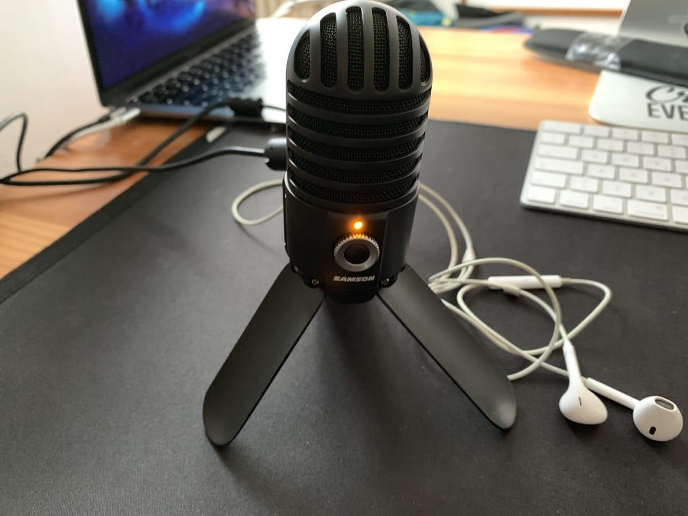
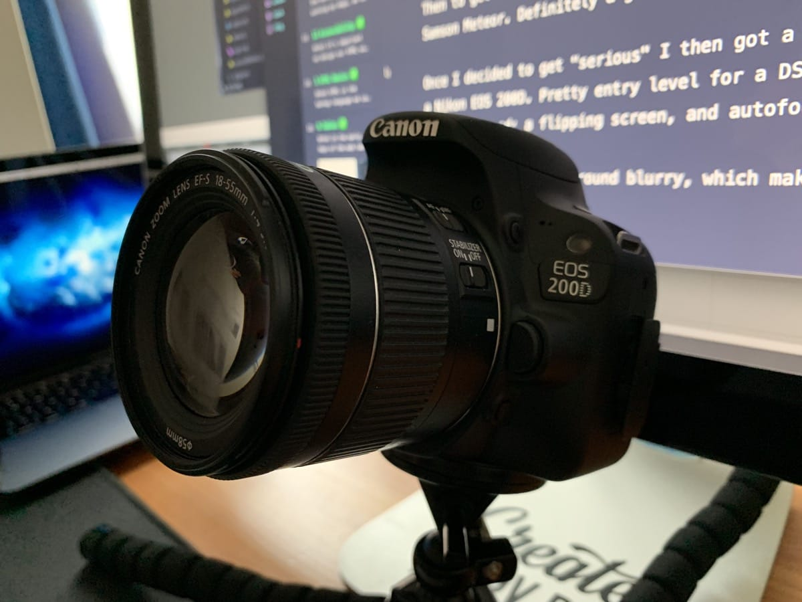
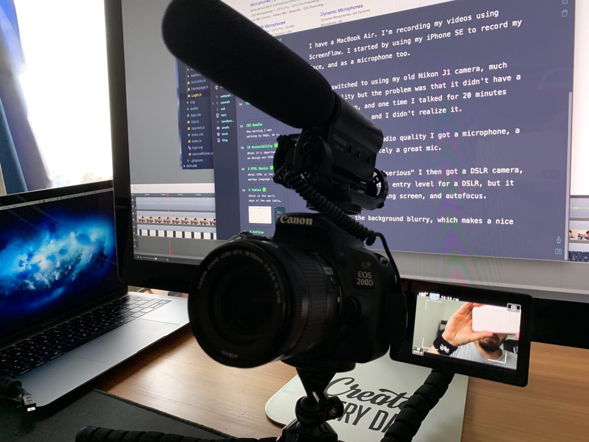
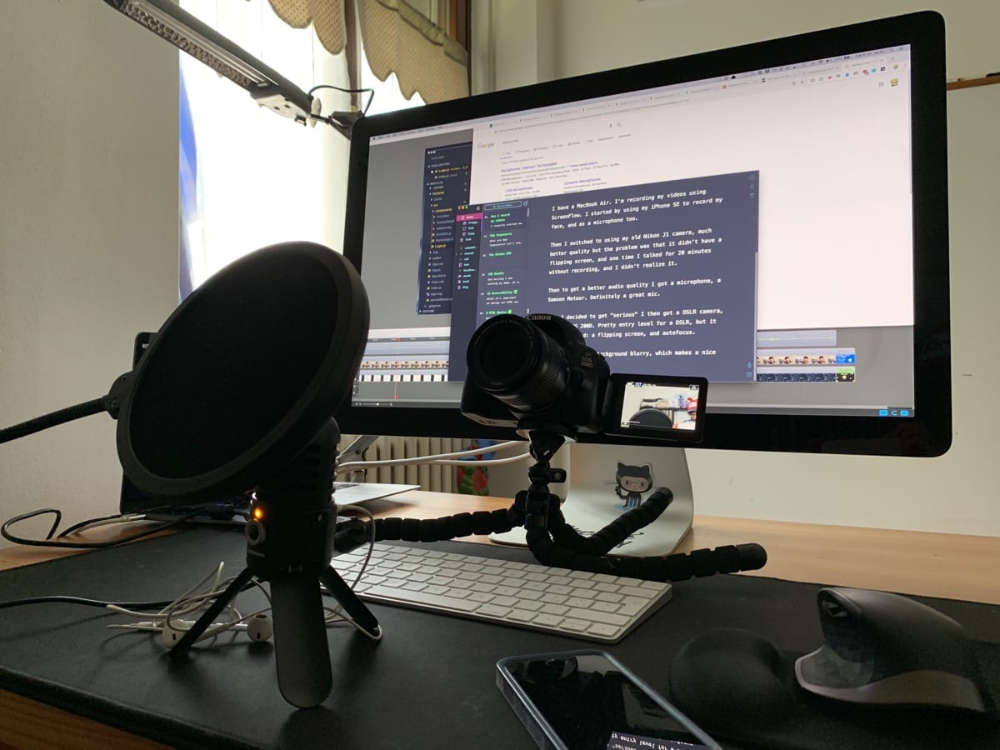
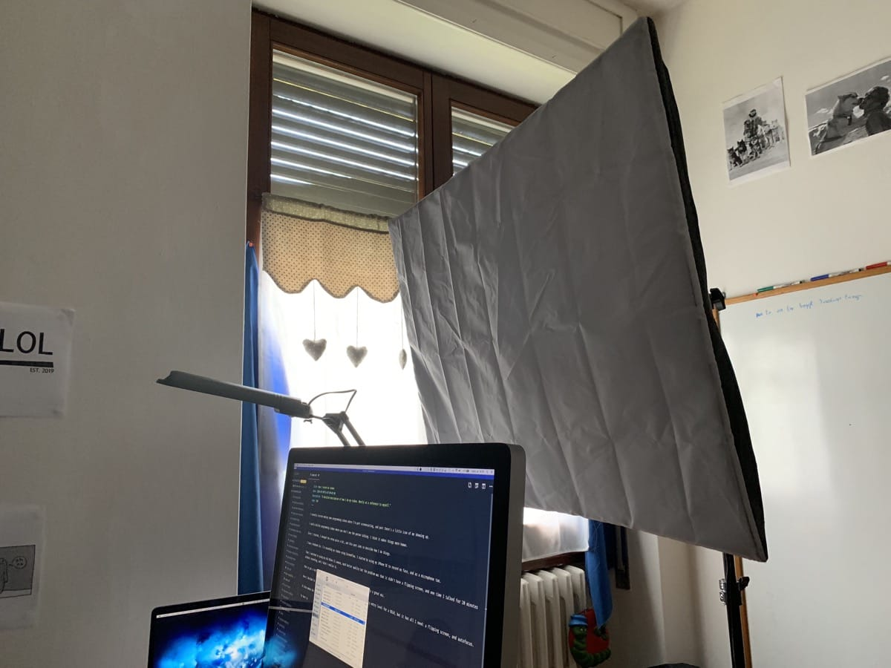

How I record my videos

# How I record my videos

## A detailed description of how I do my videos. Mostly as a reference to myself.

 Published Jul 12, 2019

I recently started making some programming videos where I’m part screencasting, and part there’s a little icon of me showing up.

I really dislike programming videos where you don’t see the person talking. I think it makes things more human.

Since I started, I changed the setup quite a bit, and this post aims to describe how I do things.

I have a MacBook Air. I’m recording my videos using ScreenFlow. I started by using my iPhone SE to record my face, and as a microphone too.

Then I switched to using my old Nikon J1 camera, much better quality but the problem was that it didn’t have a flipping screen, and one time I talked for 20 minutes without recording, and I didn’t realize it.

Then to get a better audio quality I got a microphone, a Samson Meteor. Definitely a great mic.

It has a built-in monitor where those earpods are connected, so I can
1. hear if it’s recording correctly
2. immerse more into the video, it gives a nice isolation from the outside

Once I decided to get “serious” I then got a DSLR camera, a Nikon EOS 200D. An entry level DSLR camera, but it has all I need: a flipping screen, and autofocus.

The flipping screen is the things I was more interested in.
It also makes the background blurry in videos, which makes a nice effect.
I also got a microphone for it, the TAKSTAR SGC-598, which sounds awesome.

I usually put it before the screen while recording me coding:

Then I got a few lights for when I’m recording in the evening or when the light is just not right. I don’t use them always. Here’s one:

I also got a green panel for those nice recordings where you are into the video, but I never used them yet. Why? The simpler the process, the more videos I make. It’s like with blog posts.

So, my recording workflow until this morning was this: start a ScreenFlow recording to get the screen image and the audio from the monitor, and start the camera recording at the same time.

Finished the video, I grabbed the SD card from the camera, and put it into the usb-c hub connected to the Mac, and imported the video into ScreenFlow. The audio track from the two videos helped me sync the 2 recordings.

The problem with this is that videos last 30 minutes on the camera, so I had to re-start the video again (maybe there’s some setting, I didn’t look too much) and the SD thing was becoming a burden (the camera also has Wi-Fi download for videos, but it’s not very practical as well).

The other day I was randomly searching “how to use a Canon EOS as a webcam” and I found [this sweet Swizec article about it](https://swizec.com/blog/connected-canon-dslr-webcam/swizec/7477).

You can read all the details there but long story short, I keep these 2 applications open:

- [Camera Live](https://github.com/v002/v002-Camera-Live)
- [CamTwist](http://camtwiststudio.com/)

and my camera, connected via USB to the Mac, shows up as an option for video input.

With this system I can use the DSLR camera as a webcam, which is pretty cool because that’s the best webcam I could ever find!

I tried to also stream the audio along with the video, but I couldn’t, so I use the Samson Meteor microphone instead, with a pop filter. Bonus points for not having the big camera microphone covering parts of the screen. There’s a little delay between audio and video in the recording, but easily fixable.

The problem now is that the MacBook Air fans (2018, 16GB of memory, SSD, 1,6 GHz Intel Core i5) start and make a lot of noise. And it gets super hot, I think I’m pushing its limits too much by recording the screen, the camera input and the microphone all at the same time.

So for most videos I’ll switch to use the camera as a camera, rather than as a webcam. Or I’ll find a way to keep the MacBook Air either cool or far from the microphone so I can’t record the fans.

All still work in progress!

* * *

[Found a typo or problem? Edit this page](https://github.com/flaviocopes/website-content/blob/content/post/lab/how-i-record-videos/index.md)