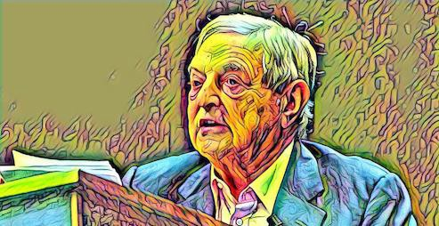

How Karl Popper can make you as good a data scientist as George Soros

#### The Tao of Data Science

# How Karl Popper can make you as good a data scientist as George Soros

## Popper’s views on “falsifiability” and how to build better machine learning models

[Robert Osazuwa Ness](https://towardsdatascience.com/@osazuwa)

Jun 2·4 min read

[*The Tao of Data Science*](https://medium.com/tag/the-tao-of-data-science)* column explores how centuries of philosophers have been tackling the key problems of machine learning and data science.*

If Karl Popper were a modern data scientist, he would have used the concept of “falsifiability” when he implemented machine learning models.

Karl Popper is best known for the view that science proceeds by “falsifiability” — the idea that one **cannot** prove a hypothesis is true, or* even have evidence of truth by induction* (yikes!), but one can refute a hypothesis if it is false.

### If Popper were a data scientist…

Suppose Popper was a modern data scientist and needed to implement a machine learning solution to predict some phenomenon of interest. Given his philosophy of science, how would he have proceeded to implement his model?

**Popper would implement a causal model**. A causal machine learning model directly models the causal mechanism at play in the phenomenon the modeler aims to predict. Modeling causal mechanism enables robust predictions under interventions to the system, even when those interventions cause the system to behave in ways fundamentally different than how it was behaving in the training data. The term “intervention” refers to any artificial way of “messing” with the thing you are modeling. For example, in financial modeling, an example of an intervention might be a new tax policy. If you have a model that predicts sales revenue for your e-commerce platform, running an ad campaign would be an intervention.

Popper would build a model by the following **iterative model refutation** algorithm:

1. 1.Based on ideas of how to improve on the previous iteration of your model, you come up with an updated model.

2. 2.You use the new model to predict the outcome of an intervention. When choosing which intervention to focus on, prefer interventions with predicted outcomes that are more surprising.

3. 3.You actually perform that intervention and observe the outcome. If the outcome doesn’t match the prediction — boom! Model falsified.

4. 4.Repeat steps 1–3. Keep going until you can’t find a way to falsify the current iteration of model.

***Do you know what Popper would not do?****  *He would **not** focus on optimizing some function of likelihood or predictive accuracy. He knows that models can predict really well on average, but still predict really poorly on edge cases that matter.

### Popper might still have been a mediocre data scientist

Let’s face it, sometimes all you need is a damn fine prediction on average. A good data scientist recognizes when this is the case, and when this is not.

However, another problem with Popper’s approach occurs in step 1. In this step, Popper has to select from a large space of candidate models that have not yet been falsified by data from intervention experiments in previous iterations.

Most data scientists would rank candidate models by how much the evidence from all of these previous experiments supports a given candidate, for example using [cross-validation](https://en.wikipedia.org/wiki/Cross-validation_%28statistics%29), or a likelihood-based criterion like [AIC](https://en.wikipedia.org/wiki/Akaike_information_criterion) or [BIC](https://en.wikipedia.org/wiki/Bayesian_information_criterion).

Not Popper, whose mantra was:

> “You can’t prove a hypothesis [i.e. a model] true, or even have evidence that it is true by induction, but you can refute it if it is false.”

Since falsifiability is all that matters to Popper, every candidate model would be on equal footing with every other one. There is nothing that helps him prefer one model to any other. This calls the effectiveness of his algorithm into question given the giant space of not-yet-refuted models he has to search through.

However, we don’t have be as opposed to inductive reasoning with evidence as Popper. We can employ the above model-building algorithm, and select models for the next iteration that are strongly supported by evidence in the previous iteration.

### How Popper can make you as good a data scientist as George Soros.

The most valuable idea Popper gives us is this idea of trying your best to break your model by devising circumstances where it might fail, then improving the model in a way that accounts for those circumstances.

While you don’t exactly need a causal model to do this, it certainly makes the process much easier. Without a means of predicting the effects of intervention, it is difficult to identify the failure modes of your model. Just because you can’t figure out what edge cases break your model, doesn’t mean those edge cases won’t come up once your model is in production.

Financial investing is a domain where the rare edge case can ruin you. If you think wealth is proof of this modeling technique, then look no further than billionaire investor [George Soros](https://en.wikipedia.org/wiki/George_Soros) (that guy at the heart of a [fascinating number of conspiracy theories](https://en.wikipedia.org/wiki/George_Soros#Conspiracy_theories_and_threats)). Soros has been applying data science to financial markets since long before “data science” was a thing.

BIllionaire George Soros attributes his investment success to Popper’s philosophy

Soros was also Popper’s student at the London School of Economics, and credits Popper for inspiring his “general theory of reflexivity”. This is causal theory — the causal mechanisms are in terms of macroeconomic abstractions — is the core of his investment strategy. His strategy can be summed up as a form of the **iterative model refutation** algorithm above**.**

> I’m only rich because I know when I’m wrong … I basically have survived by recognizing my mistakes. — George Soros

If it worked for him, maybe it will work for you.
**Further reading:**

- •[Karl Popper](https://plato.stanford.edu/entries/popper/) — Stanford Encyclopedia of Philosophy
- •[The Problem of Induction](https://plato.stanford.edu/entries/induction-problem/) — Stanford Encyclopedia of Philosophy
- •Soros, George. “Fallibility, reflexivity, and the human uncertainty principle.” *Journal of Economic Methodology* 20.4 (2013): 309–329.