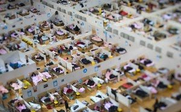

How Many Americans Really Have the Coronavirus? - The Atlantic

 [Technology](https://www.theatlantic.com/technology/)

# The Official Coronavirus Numbers Are Wrong, and Everyone Knows It

Because the U.S. data on coronavirus infections are so deeply flawed, the quantification of the outbreak obscures more than it illuminates.

[Alexis C. Madrigal](https://www.theatlantic.com/author/alexis-madrigal/)
  March 3, 2020

' x='0' y='0' height='100%25' width='100%25' xlink%3Ahref='data%3Aimage/png;base64,iVBORw0KGgoAAAANSUhEUgAAAAoAAAAFCAIAAADzBuo/AAAAfUlEQVQImWPgEpBERuoS0twCkp8+fc4tKJMTk2JAluMXlNSUkJYQkQJKlxeWKIuDpXkEQQjIKC8qTYpLcrWw+nj3RlFOPlAEJN1dkLOmtyMtK//Y8ZOXr1x7cfMqxHCodEdR/tblS+/cvLVtx65tO3afPHHywsXLcUkZQCkA7As1aeLfRBYAAAAASUVORK5CYII='%3E%3C/image%3E%3C/svg%3E)

The Atlantic

We know, irrefutably, one thing about the coronavirus in the United States: The number of cases reported in every chart and table is far too low.

The data are untrustworthy because the [processes we used to get them](https://www.washingtonpost.com/politics/inside-trumps-frantic-attempts-to-minimize-the-coronavirus-crisis/2020/02/29/7ebc882a-5b25-11ea-9b35-def5a027d470_story.html) were flawed. The Centers for Disease Control and Prevention’s [testing p](https://www.nytimes.com/2020/02/27/health/coronavirus-testing-california.html)[rocedures](https://www.nytimes.com/2020/03/02/health/coronavirus-testing-cdc.html) missed the bulk of the cases. They focused exclusively on travelers, rather than testing more broadly, because that seemed like the best way to catch cases entering the country.

Advertisement

*[*[Read: You’re likely to get the coronavirus](https://www.theatlantic.com/health/archive/2020/02/covid-vaccine/607000/)*]*

[Just days ago](https://www.cnn.com/2020/02/27/health/us-cases-coronavirus-community-transmission/index.html), it was not clear that the virus had spread solely from domestic contact at all. But then cases began popping up with no known international connection. What public-health experts call “community spread” had arrived in the United States. The virus would not be stopped by tight borders, because it was already propagating domestically. Trevor Bedford’s lab at the Fred Hutchinson Cancer Research Center in Seattle, which studies viral evolution, concluded there is “[firm evidence](https://bedford.io/blog/ncov-cryptic-transmission/)” that, [at least in Washington State](https://twitter.com/trvrb/status/1234589598652784642?s=20), the coronavirus had been spreading undetected for weeks. Now different projections estimate that [20](https://twitter.com/trvrb/status/1234589820946534401?s=20)  [to 1,500](https://twitter.com/trvrb/status/1234589598652784642?s=20) people have already been infected in the greater Seattle area. In California, too, the disease [appears to be spreading](https://www.sacbee.com/news/local/health-and-medicine/article240799126.html), although the limited testing means that no one is quite sure how far.

Advertisement

In total, fewer than [500 people have been tested](https://www.fiercebiotech.com/medtech/new-california-coronavirus-case-reveals-problems-u-s-testing-protocols) across the country (although the CDC has [stopped reporting](https://web.archive.org/web/20200301063238/https://www.cdc.gov/coronavirus/2019-ncov/cases-in-us.html) that number in its [summary of the outbreak](https://www.cdc.gov/coronavirus/2019-ncov/cases-in-us.html)). As a result, the current “official” case count inside the United States stood at 43 as of this morning (excluding [cruise-ship cases](https://www.theatlantic.com/ideas/archive/2020/02/i-prepared-everything-not-coronavirus-cruise-ship/607138/)). This number is wrong, yet it’s still constantly printed and quoted. In other contexts, we’d call this what it is: a subtle form of misinformation.

## More Stories

### [The Coronavirus Is a Data Time Bomb](https://www.theatlantic.com/technology/archive/2020/02/coronavirus-effects-on-global-markets-will-be-delayed/606508/)

 [Alexis C. Madrigal](https://www.theatlantic.com/author/alexis-madrigal/)

### [You’re Likely to Get the Coronavirus](https://www.theatlantic.com/health/archive/2020/02/covid-vaccine/607000/)

 [James Hamblin](https://www.theatlantic.com/author/james-hamblin/)

### [Epidemics Reveal the Truth About the Societies They Hit](https://www.theatlantic.com/ideas/archive/2020/03/italys-response-to-coronavirus/607306/)

 [Anne Applebaum](https://www.theatlantic.com/author/anne-applebaum/)

### [You Already Live in Quarantine](https://www.theatlantic.com/technology/archive/2020/03/coronavirus-you-already-live-quarantine/607474/)

 [Ian Bogost](https://www.theatlantic.com/author/ian-bogost/)
nonenone
nonenone

*[*[Read: What Trump could do right now to keep workers safe from the coronavirus](https://www.theatlantic.com/ideas/archive/2020/03/use-osha-help-stem-covid-19-pandemic/607312/)*]*

This artificially low number means that for the past few weeks, we’ve seen massive state action abroad and only simmering unease domestically. While Chinese officials were enacting a world-historic containment effort—putting [more than 700 million people](https://www.nytimes.com/2020/02/15/business/china-coronavirus-lockdown.html) under some kind of movement restriction, quarantining [tens of millions of people](https://www.latimes.com/science/story/2020-01-28/wuhan-chinas-coronavirus-50-million-people-quarantined), and placing others under [new kinds of surveillance](https://www.nytimes.com/2020/03/01/business/china-coronavirus-surveillance.html)—and American public-health officials were staring at the writing on the wall that the disease was [extremely likely to spread in the U.S.](https://www.theatlantic.com/health/archive/2020/02/covid-vaccine/607000/), the public-health response was stuck in neutral. The case count in the U.S. was not increasing at all. Preparing for a sizable outbreak seemed absurd when there were fewer than 20 cases on American soil. Now we know that the disease was already spreading and that it was the U.S. *response* that was stalled.

Advertisement

Meanwhile, South Korean officials have been [testing more than 10,000 people a day](https://abcnews.go.com/International/massive-coronavirus-testing-program-south-korea-underscores-nimble/story?id=69226222), driving up the country’s reported-case count. Same goes for Italy: high test rate, high number of cases. (Now [some Italian politicians want to restrict testing](https://www.bloomberg.com/opinion/articles/2020-03-02/coronavirus-accounting-is-looking-vulnerable-in-italy-and-china).) In China, the official data say the country has more than 80,000 cases, but the real number might be far, far higher because of all the people who had mild(er) cases and were turned away from medical care, or never sought it in the first place. That may be cause for reassurance ([though not everyone agrees](https://www.statnews.com/2020/02/25/new-data-from-china-buttress-fears-about-high-coronavirus-fatality-rate-who-expert-says/)), because the total number of cases is the denominator in the simple equation that yields a fatality rate: deaths divided by cases. More cases with the same number of deaths means that the disease is likely less deadly than the data show.

*[*[Read: What you can do right now about the coronavirus](https://www.theatlantic.com/health/archive/2020/03/coronavirus-what-you-can-do-help-slow-outbreak/607369/)*]*

The point is that every country’s numbers are the result of a specific set of testing and accounting regimes. Everyone is cooking the data, one way or another. And yet, even though these inconsistencies are public and plain, people continue to rely on charts showing different numbers, with no indication that they are not all produced with the same rigor or vigor. This is bad. It encourages dangerous behavior such as cutting back testing to bring a country’s numbers down or slow-walking testing to keep a country’s numbers low.

Advertisement

*[*[Read: A coronavirus quarantine in America could be a giant legal mess](https://www.theatlantic.com/ideas/archive/2020/02/coronavirus-quarantine-america-could-be-giant-legal-mess/606595/)*]*

The other problem is, now that the U.S. appears to be ramping up testing, [the number of cases will grow quickly](https://www.npr.org/2020/03/01/810958388/as-testing-quickly-ramps-up-expect-more-u-s-coronavirus-cases). Public-health officials are currently cautioning people not to worry as that happens, but it will be hard to disambiguate what proportion of the ballooning number of cases is the result of more testing and what proportion is from the actual spread of the virus.

People trust data. Numbers seem real. Charts have charismatic power. People believe what can be quantified. But data do not always accurately reflect the state of the world. Or as one scholar put it in a book title: *[“Raw Data” Is an Oxymoron](https://mitpress.mit.edu/books/raw-data-oxymoron)*.

The reality gap between American numbers and American cases is wide. Regular citizens and decision makers cannot rely on only the numbers to make decisions. Sometimes [quantification actually obscures](https://www.theatlantic.com/technology/archive/2020/02/coronavirus-effects-on-global-markets-will-be-delayed/606508/) as much as it reveals.

## Related Video

 

**  [Alexis C. Madrigal](https://www.theatlantic.com/author/alexis-madrigal/) is a staff writer at *The Atlantic *and the author of *[Powering the Dream: The History and Promise of Green Technology](http://www.amazon.com/Powering-Dream-History-Promise-Technology/dp/030681885X)*. **

Connect

  