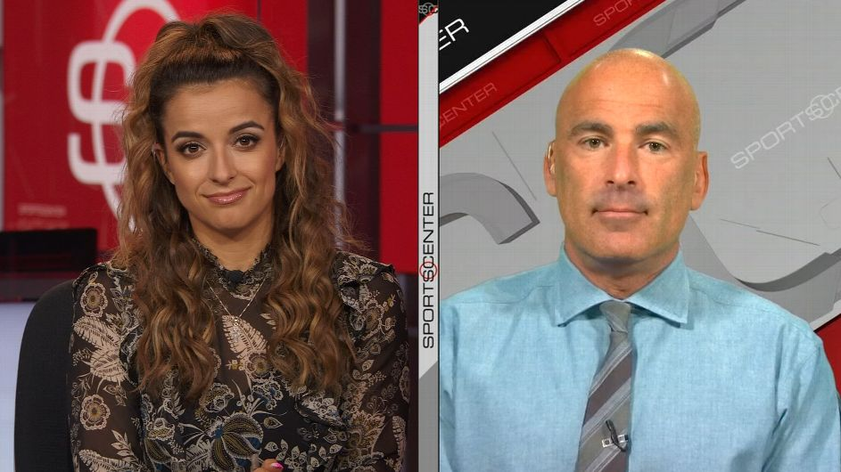
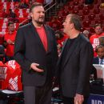
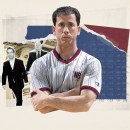
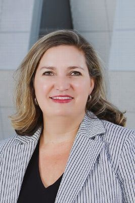
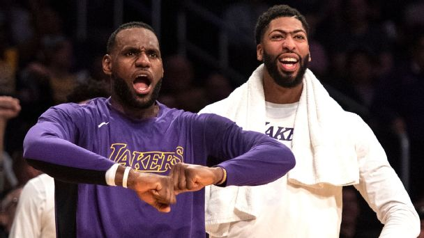
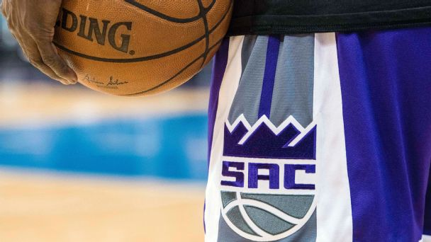

How NBA executive Jeff David stole $13 million from the Sacramento Kings

# How NBA executive Jeff David stole $13 million from the Sacramento Kings

play

0:07
/
1:28

M

- Autoplay

- Closed Caption

- Caption Settings

Settings

Nov 19, 2019
-

Kevin ArnovitzESPN Staff Writer

- ▪
- ▪[Facebook](https://www.facebook.com/dialog/share?href=https%3A%2F%2Fwww.espn.com%2Fnba%2Fstory%2F_%2Fid%2F28078881&app_id=116656161708917)
- ▪[Twitter](http://twitter.com/intent/tweet?lang=en&url=https%3A%2F%2Fwww.espn.com%2Fnba%2Fstory%2F_%2Fid%2F28078881&text=The%20wild%20story%20behind%20the%20NBA%27s%20most%20unlikely%20heist)
- ▪[Facebook Messenger](http://facebook.com/dialog/send?link=https://www.espn.com/nba/story/_/id/28078881&next=https://www.espn.com/nba/story/_/id/28078881&app_id=116656161708917)
- ▪[Pinterest](https://pinterest.com/pin/create/button/?url=https%3A%2F%2Fwww.espn.com%2Fnba%2Fstory%2F_%2Fid%2F28078881%2Fhow%2Dnba%2Dexecutive%2Djeff%2Ddavid%2Dstole%2D13%2Dmillion%2Dsacramento%2Dkings&description=How+NBA+executive+Jeff+David+stole+%2413+million+from+the+Sacramento+Kings&media=https%3A%2F%2Fa.espncdn.com%2Fphoto%2F2019%2F1028%2FSacramento+1296x729.jpg)
- ▪[@Email@](https://www.espn.com/nba/story/_/id/28078881/how-nba-executive-jeff-david-stole-13-million-sacramento-kingsmailto:?subject=How%20NBA%20executive%20Jeff%20David%20stole%20%2413%20million%20from%20the%20Sacramento%20Kings&body=https%3A%2F%2Fwww.espn.com%2Fnba%2Fstory%2F_%2Fid%2F28078881)
- ▪[°print°](http://espn.go.com/espn/print?id=28078881)

**THE MOVING VAN** from Sacramento chokes its way through Miami's thick August air. It contains the objects of Jeff David's life, all destined for the Davids' new house in the affluent Pinecrest neighborhood. It is July 2018, and much of David's family is on hand to help with the move. Jeff's mother-in-law and her partner had arrived the previous night to help wrangle the kids while Jeff and his wife, Kate, led their family from their rental home in Coconut Grove.

Jeff, the former chief revenue officer of the [Sacramento Kings](https://www.espn.com/nba/team/_/name/sac/sacramento-kings), has taken the day off to move after landing a new role as CRO of the [Miami Heat](https://www.espn.com/nba/team/_/name/mia/miami-heat). His life is seemingly picture-perfect. He has an adoring wife of almost 10 years, three healthy children. And after two stints with the Kings spanning more than a decade -- while helping secure hundreds of millions of dollars in arena sponsorships for the team -- he has joined one of the NBA's most respected organizations in an appealing, sun-drenched market.

ADVERTISEMENT

On this Monday, walking through the Davids' new front door is a dizzying procession of cable guys, utility workers and movers. Amid all of this, Jeff receives a phone call from a former co-worker with the Kings. Her name is Stacy Wegzyn, and she works in HR. Jeff last remembers sitting in her office in Sacramento just months earlier, being told that the Kings were going to eliminate his position. After a few pleasantries, she gets down to business. She tells Jeff she's been going through his old files, and in doing so she found one labeled "TurboTax" that references an entity called Sacramento Sports Partners.

"I was just curious what that is and if those are documents that should go to somebody else," Wegzyn says.

It's a seemingly innocuous inquiry from an HR lifer. But it's one that will dictate the rest of Jeff David's life. If he knows that -- or senses it -- he doesn't let on.

"No, no, no," Jeff responds. "That was a ... man, this is taking me back. Maybe 2015?"

Wegzyn presses on. She asks Jeff whether the documents contain anything that anyone with the Kings needs to see. Jeff assures her they can trash them because the entity isn't around anymore. A few minutes after he hangs up, his mother-in-law, Nancy, is standing at the front door when an FBI investigator appears, asking to speak to Jeff.

# Editor's Picks

- 

## [Inside the NBA's silent tension surrounding Daryl Morey](https://www.espn.com/nba/story/_/id/28059499/inside-nba-silent-tension-surrounding-rockets-gm-daryl-morey)

- 

## [How former ref Tim Donaghy conspired to fix NBA games](https://www.espn.com/nba/story/_/id/25980368/how-former-ref-tim-donaghy-conspired-fix-nba-games)

This agent, John Sommercamp, finds Kate and Jeff in the kitchen, where he tells them they might be the victims of fraud. He says he's investigating a real estate title company. Jeff retreats to a back bedroom with Sommercamp, who wants Jeff relaxed and comfortable, a willing conversationalist. He does not believe Jeff is a victim. He strongly suspects he's the perpetrator of a felony. The longer Jeff believes the inquiry is about the title company, the more likely it is that Sommercamp can extract the details he wants.

Sommercamp has questions. A year earlier, Jeff had purchased an $8 million home in Hermosa Beach, 20 miles southwest of Los Angeles. Sommercamp asks Jeff how he found the money to buy it. Jeff explains that he's part of an investor group. Sommercamp wants to know who these investors are. Jeff volunteers that Golden 1 and Kaiser Permanente, two major sponsors with the Kings, are partners. The agent gets more specific, probing the mechanics of Sacramento Sports Partners' formation.

But it's when Sommercamp asks about how he obtained signatures from his partners in Sacramento that Jeff knows it's time to suspend his cheery front.

Jeff David knows he's cornered.

[**ESPN Daily Podcast: **Inside the great NBA heist](https://www.espn.com/espn/story/_/id/27852002/the-espn-daily-podcast-how-listen-episode-guide-more)

* * *

**BACK AT THE** rental house in Coconut Grove hours later, Kate logs on to her personal banking app to discover a balance of $0.00. No alert, no explanation. Just zeros.

Kate dials Bank of America, whose reps bounce her around the after-hours customer service labyrinth. She finally learns that there's a freeze on the family account. Kate toggles over to the family's secondary account at Wells Fargo. It, too, is frozen.

*"Why is all of our money gone?!"* she screams at Jeff, who seems oddly sanguine for a man who suddenly doesn't have the liquidity to order takeout. "Does this have anything to do with those FBI agents today?"

Kate grasps for any theory, speculating that the agents might have been con artists posing as Feds to fleece the family. Jeff tells her that's unlikely. He pulls out the business card Sommercamp handed him when Jeff walked the agent out the door -- after telling Sommercamp that he'd be more comfortable continuing the conversation once he consulted an attorney.

Jeff calls Sommercamp and puts him on speakerphone.
"Our money is frozen," Jeff says as Kate listens.

"You're probably not going to get that money back," Sommercamp says. "You know what you did."

When Jeff hangs up, Kate is apoplectic.
"What's he talking about?! What did you do?! *What's going on?!*"
Jeff sits on the bed next to his wife and places his hand on her knee.

"I'm going to tell you, but I need you to hear me out," he says. "I need you to listen to me."

The story Jeff David was about to tell his wife -- of a yearslong fraud, of millions of dollars stolen -- was almost too absurd to believe.

* * *

**IN 2009, WITH** the NBA in the headwinds of the global recession and rumors of a Kings relocation swirling, David was a man with growing concerns. Then Sacramento's vice president of corporate partnerships, David feared he'd have to make ends meet as a private sports marketing consultant. Motivated by such prospects, he'd set up a private entity -- Sacramento Sports Partners. In its nine years of existence, SSP never undertook any consultancy work. But it did ultimately prove useful.

David left for a brief stint with the NBA league office before returning to Sacramento in 2011 as CRO. He was bright and self-motivated, with a keen understanding of the industry -- not a man in need of micromanaging.

His style wasn't for everyone. One Kings co-worker considered him the sort of oleaginous salesman who'd go into business with anyone. Another said David had a casual relationship with the truth, the type of person who claimed, semiseriously, to be the inventor of phrases like "Cali Love."

"Jeff is white-collar meets surfer dude, the consummate bro," says a former Kings co-worker on the business operations side. "He'd open meetings with 'It's Money Monday!' Then drop a silly rap lyric about an account."

Still, [in a Kings organization often beset by palace intrigue](https://www.espn.com/espn/feature/story/_/page/presents2/is-demarcus-cousins-sacramento-kings-real-problem), many colleagues found Jeff to be a reassuring voice who preached the virtues of "not sweating the small stuff." He was gregarious, fond of "hugging it out," able to laugh at himself when less extroverted spirits made light of that exuberance. "Let's close some phone numbers" in David-speak meant he wanted the Kings' sales team to craft some seven-digit sponsorship agreements.

In 2012, approaching his 40s, David was earning a low-to-mid-six-figure salary. But he had a desire for more.

His first opportunity came that year when Van Wagner, a New York-based sports marketing firm, placed a routine call to David. It was looking to broker courtside signage for Peak Sport, a sportswear company. When it came time to bill the buyer, David used the Kings' standard invoice template but had Van Wagner make three payments, totaling about $30,000, to SSP.

David had answered the unsolicited call from Van Wagner, so no one else with the Kings would have had knowledge of the discussion. The amount represented a relatively small sum for a franchise that would generate some $13 million in sponsorship revenue that season.

Because the advertising had been purchased by Van Wagner on behalf of Peak Sports, there was no suspicion that a check from Peak hadn't turned up in the accounting department. An inquisitive bean counter with the Kings could assume that any new signage in the arena must be part of a larger advertising buy.

The Kings had given David an autonomy he could exploit. He had launched the first in a series of grifts that would grow from thousands to millions of dollars. It was audacious and, in David's mind, airtight.

And in more than two dozen interviews, colleagues, friends, neighbors, family, law enforcement and Sacramento businesspeople could offer no explanation as to why he did it. When asked for the motivation behind the theft, David, years later, gives no unified theory.

"Curiosity? Stupidity?"

In 2015, led by Jeff David, the Kings began discussions with several corporations for the naming rights for their new arena and training facility, which were under construction. AP Photo/Rich Pedroncelli

**THE KINGS ENTERED** 2015 celebrating their unlikely survival.

Led by David, they had begun discussions with several corporations for the naming rights for their new arena and training facility, which were under construction. Given the team's near departure from Sacramento numerous times over the previous few years -- including the [stay of execution that had wrested the team back from Seattle in 2013](https://www.espn.com/nba/story/_/id/9279593/nba-owners-back-recommendation-keep-kings-sacramento) -- the Kings saw large-scale sponsorship deals as more than just an opportunity to cash some checks. They wanted to go local.

"The team almost left the city, and it was the people and companies of Sacramento that kept it there," David says. "It tells a better story."

It also gave David an opening. He spent the 2015-16 NBA season stealing more money than most Kings players earned on the court.

In June 2015, the Kings and California credit union Golden 1 agreed to a 20-year, $110 million naming rights deal for the team's new arena. David and Golden 1 had a deal structure that included 20 annual payments averaging $5.5 million. During negotiations, Golden 1 CEO Donna Bland suggested that if the Kings needed more cash up front, Golden 1 could be in a position to accommodate. David filed this information away.

That August, the Kings also agreed to a 10-year, $28 million sponsorship deal for their new training facility with Oakland-based nonprofit health care provider Kaiser Permanente. Deals like this often have "escalators," an excess amount paid each year to account for inflation or increased operating costs -- akin to a cost-of-living adjustment. David told his bosses that the Kaiser deal wouldn't include one, a condition they could live with given their satisfaction with the $28 million haul and the lengthy negotiation, according to David. But unbeknownst to the higher-ups, he kept negotiating.

Claiming that expenses were piling up as the Kings tried to complete construction of the new arena, David asked Kaiser if it would add a $4.4 million upfront payment in lieu of an escalator. Kaiser agreed, and on Aug. 19, 2015, David invoiced the company on Sacramento Kings letterhead, payable not to the Kings but to his SSP account.

He got to work revising the original paperwork, forging team president Chris Granger's signature and sending a digital file back to Kaiser. The Kings, in possession of the original contract, never saw the altered version.

In September, $4.4 million landed in the account of SSP.

A year later, David reached back out to Bland to inquire whether her offer for an upfront payment still stood. On July 5, 2016, Golden 1 wired $9 million to SSP.

To offset the $9 million, David altered the payment schedule of the initial agreement, again forging Granger's signature. Starting in 2026, the annual installments due on July 1 of each year were reduced by either $500,000 or $1 million for the duration of the deal. To make up the shortfall, David says he planned to wire the missing amount to the Kings.

## How David changed the Golden 1 deal

| Original |     | Amendment |
| --- | --- | --- |
| $0  | ** Initial payment ** | $9.0 million |
| $6.0 million | ** Years 1-3* ** | $6.0 million |
| $5.5 million | ** Years 4-8* ** | $5.5 million |
| $5.5 million | ** Years 9-13* ** | $5.0 million |
| $5.5 million | ** Years 14-17* ** | $4.5 million |
| $5.0 million | ** Year 18* ** | $4.5 million |
| $5.0 million | ** Years 19-20* ** | $4.0 million |
| **$110 million** | ** Total ** | **$110 million** |
| *Annual payments |

The mutual trust between David and the sponsors was unassailable -- enough to even navigate a snafu that could have derailed his entire scheme. When Golden 1 remitted its first scheduled annual payment, it did so to SSP -- not the Kings. Like a bank thief tossing away a dye pack, David reached out to Golden 1 and explained that SSP was the account reserved for finalizing construction of the arena. He promptly returned the $6 million and instructed Golden 1 to wire the funds to the Kings' primary account.

"I knew how the Kings operated," David says. "I knew how these other companies operated. We had an arrangement and we agreed upon it, then everyone moved on."

Less than four years after siphoning off $30,000 in courtside signage, David had now stolen $13.4 million from the Kings and their top corporate partners.

And nobody suspected a thing.

* * *

**FOR JEFF DAVID,** the summer of 2017 was one of those times when the reality of a man's life surpasses even his dreams. The previous June, he had purchased a [$3.8 million home](https://www.redfin.com/CA/Manhattan-Beach/814-Highland-Ave-90266/home/6711766/crmls-SB16145709) just blocks from the Pacific Ocean in Manhattan Beach.

Now he had flown his wife and young family on a private charter to Southern California to spend July Fourth at the new four-bedroom house, which was half a mile from an even grander [property in Hermosa Beach](https://vimeo.com/275935426) that Jeff had also purchased. He planned to rent these investment properties, but in the meantime, his young family could bask in the warm glow of one of L.A.'s most appealing coastal towns.

When Jeff had moved $250,000 of the family's savings into Sacramento Sports Partners, he told Kate the money was for a real estate fund with other investors. But the people she heard Jeff speaking with about floorings and fixtures weren't their co-investors -- they were brokers and designers consulting with Jeff about how to improve the homes for maximum return.

The cash used in the purchases was almost entirely the millions sent to Jeff by Golden 1 and Kaiser Permanente.

As rewarding as sales work can be on behalf of a pro basketball team, it hadn't satisfied Jeff's thirst for more. Flipping these valuable properties -- funded by his pilfering -- gave him that chance. Now he was a part of the action with his most wealthy counterparts, demonstrating to himself that he could succeed at the art of investment. Kate, a chronic worrier about the Davids' growing family, could rest easier knowing he'd secured their future.

The next summer, David left the Kings for the Heat. But on his way out, he had left behind a digital trail.

An exterior look at the home David purchased in Manhattan Beach (left). Via Google Street View

**IT WAS ONLY** one document -- one ordinary little document -- that Stacy Wegzyn had needed from Jeff David.

In August 2018, the Kings' senior vice president of human resources had been looking for a copy of a commission structure to build out the corporate sales team. David had neglected to leave the digital document when he'd departed for Miami a few weeks earlier. Wegzyn figured a quick tour of his file directory would produce something, so on Tuesday, six days before the FBI sting in Miami, she'd had the Kings' IT department download an archive from their shared cloud system.

As Wegzyn navigated a morass of files in David's old directory, she hadn't been able to discern an organized system, so she'd had to open things one by one. Eventually, she'd stumbled onto a folder titled "TurboTax," whose first item was a depreciation schedule for a home. As someone who owned rental properties, the table of depreciating items looked familiar in its contents -- furniture, a golf cart -- but the name of the entity in question was odd: Sacramento Sports Partners LLC.

Wegzyn was aware of other entities associated with the Kings' basketball and real estate assets, but this one didn't sound familiar. Also, she wondered, why would a business whose name suggests it's an arm of the Kings write off a golf cart at a beach house near Los Angeles?

Before leaving the office that day, Wegzyn had asked John Rinehart, the team's president of business operations, and Gerri Guzman, the team's director of finance, whether they were aware of SSP. Neither was. Wegzyn had also found a couple of K-1 tax forms listing Golden 1 and Kaiser Permanente as partners in SSP, which seemed peculiar given that credit unions and health care consortiums don't make a habit of investing in beach houses with basketball executives.

She'd told the Kings' IT department that she needed access to David's email. She was leaving town in less than 48 hours to drop her daughter off at college in the Pacific Northwest, and she desperately wanted some clarity.

Now, in the wee hours of Wednesday morning, Wegzyn's husband, Mark, found her sitting at her kitchen table, hunched over her laptop.

"What's going on?" Mark asked.

"I've got something really crazy going on at work," she said. "I can't talk about it, but I'm obsessed. I have to stay with this. I'll be up soon."

She searched David's emails for any connection to the address in Manhattan Beach or Sacramento Sports Partners. She discovered that David had applied for mortgages and included a bank statement to a lender that showed a $4.4 million deposit from Kaiser Permanente. Later on, she found a $9 million deposit from Golden 1.

A surge of adrenaline jolted through Wegzyn's body. With each passing hour, she became increasingly convinced that she was headed down a path that would upend David's life forever. She was consumed by the chase but also suffering from periodic pangs of doubt. *What if I'm wrong? What if this is all legit?* Reading David's email felt invasive, even if Kings employees, like those at most companies, sign away their privacy to people like her.

Stacy Wegzyn, the Kings' senior vice president of human resources, caught on to David's digital trail. Rocky Widner

Later that Wednesday, Wegzyn reached out to Golden 1 and Kaiser Permanente to learn more. She wanted to move quickly. In scouring David's correspondences, it appeared as if he'd been working to sell one of the properties.

"This is Stacy with the Kings," she told the rep in accounts payable at each organization. "We're partners. We're going through an audit, and I'd like to see if you can send me a list of all payments made to my organization over the last five years."

She was careful not to reveal her intention, not wanting to alarm either entity. When she found a receptive party at Golden 1, she emailed him the list of legitimate Kings entities, burying SSP in the middle.

One day later, as the family Ford Expedition charted its course northward, Wegzyn stayed in touch with Rinehart, trying to break through their partners' bureaucracy. Stacy and Mark bid schmaltzy parental farewells to their daughter, whom they settled at school, then reversed course back to Sacramento.

Just as Wegzyn returned to the office on Tuesday, confirmation arrived from Golden 1: It had sent a $9 million payment to SSP. Wegzyn and the Kings brass realized it was time to escalate this homegrown investigation. The team's new vice president of security operations, Dave Thomas, spent nearly 30 years in law enforcement with the FBI and Secret Service. Wegzyn asked Thomas to set up a meeting.

When the FBI arrived Wednesday afternoon, the Kings were armed with troves of documents unearthed and organized by Wegzyn -- a binder with all the correspondence, the tax documents, the bank statements, anything she could get her hands on. What Wegzyn didn't yet have were whatever contracts David had drawn up to lure Golden 1 and Kaiser Permanente into his scheme.

On Thursday, when the Kings were mining their network for additional evidence, a folder named "660" was uncovered -- 660 J Street was a temporary home of the team's business operations during construction of the new arena. Inside the folder were the contents of David's old laptop, which included a PDF with the signatures of Granger, Bland and Rinehart, along with copies of the amendment for the Golden 1 deal and the revised contract with Kaiser Permanente.

One week after her first foray into David's underworld, Wegzyn had struck the mother lode.

"You could come work for us," Sommercamp told Wegzyn.

* * *

**BACK IN COCONUT** Grove, in the living room of the house that Jeff and Kate had been renting, Kate lies shivering in a ball on the couch. Hours earlier, the FBI had stormed her house. Her bank accounts had been frozen. And now, after her husband has confessed to a monstrous fraud, her mother sits beside her and extends an arm, but she is virtually unresponsive.

"I'm in really big trouble," Jeff says to Kate's mother, Nancy, and her partner, Rich.

Kate is inconsolable.

# [NBA on ESPN and the ESPN App](https://www.espn.com/watch/collections/23009/basketball-live-upcoming)

The NBA is back! [Tune in here.](https://www.espn.com/watch/collections/23009/basketball-live-upcoming)

**Wednesday, Nov. 27**

• [Nets at Celtics | 7 p.m. ET](https://www.espn.com/watch?id=9eb00b96-c11a-4b52-a911-86b65c7f1538)

• [Lakers at Pelicans | 9:30 p.m. ET](https://www.espn.com/watch?id=98c6d164-ca53-4770-a73f-714457f54faa)

**Friday, Dec. 6**
• [Nuggets at Celtics | 8 p.m. ET](https://www.espn.com/watch)
• [Lakers at Blazers | 10:30 p.m. ET](https://www.espn.com/watch)

Jeff explains -- the visit from the FBI earlier in the day, the full breadth of the scam. Still, to Nancy and Rich, he seems oblivious to the depth of his crime.

"I'll just give the money back," Jeff says. "I can liquidate the properties. All the money's there. I'll give it back, and when I do, it'll be OK."

Rich shifts into fix-it mode, calling attorneys he knows back at home in Ohio, leaving messages because it's after midnight on a Tuesday morning. Rich tells Jeff it's imperative that he get legal protection.

"I think you're making too much of this," Jeff says. "I'll go to the FBI. I'll call them tomorrow. I'll tell them the whole story and show them where the money is. Everyone will get their money back, and it'll be OK. It's not going to be a big deal."

Rich and Nancy become incredulous. Does Jeff truly believe that the only item on his to-do list is restitution? As Rich pleads with Jeff, Kate rouses from her trance, shock replaced by resignation.

"You're going to go to prison," Kate says. "We're going to lose everything."

For several more hours, Rich tries to pierce Jeff's logic, while Nancy reassures the family that Jeff is redeemable.

"We went back to bed at 4 in the morning, and I said, 'I don't think he really gets it,'" Rich says nearly a year later.

After a short night's sleep, the family returns to the house in Pinecrest the next morning to rebox their belongings.

Says Nancy: "It was awful."

* * *

**TWO DAYS LATER,** David sits in Sacramento at a conference table between his two defense attorneys and across from a team from the U.S. attorney's office that specializes in white-collar crime.

Here, they begin with a directive to David:

"Anytime you want to confer with your lawyers privately, we're happy to step out of the room," says Assistant U.S. Attorney Michael D. Anderson. "But any half-truth will be considered a lie. Leaving out pertinent facts will be considered a lie. We expect you to tell us everything you know, and if you plan to do anything apart from that, let's go our separate ways, because lying is worse than telling us nothing at all."

David is operating under the hope that by cooperating, he can work out a favorable deal. He tries to establish a personal rapport with the government's lawyers, but few professions are more impervious to a salesman's charm than that of government lawyer.

David offers a broad outline of the Golden 1 and Kaiser Permanente schemes. When asked to recall the last time he spoke with someone from the Kings, though, he neglects to mention the call with Wegzyn on Monday. It occurs to the U.S. attorneys that David might not realize it's that conversation that implicated him. David also doesn't disclose information about the 2012 instance of fraud until Assistant U.S. Attorney Matt Yelovich brings it up.

David contends that from the moment he diverted funds from Golden 1 and Kaiser Permanente, he intended to repay the money. He says he had the mechanics worked out: On July 1, 2026, the Kings would be expecting $5.5 million (per the original payment schedule). And when Golden 1 would wire $5 million, David says he planned to open up a DBA ("doing business as") account called GoldenOne from which he'd wire the $500,000 shortfall. He says he believes that the Kings' finance department wouldn't have a concern that the $5.5 million had arrived in two payments as long as the full amount was present.

When asked whether David's scenario sounds plausible, business operations executives from six NBA teams say they find it far-fetched. One executive in the finance department of an NBA team says, "We invoice everything -- even signed contracts. So Golden 1 would be getting an invoice for $5.5 million weeks before the payment." Several of the executives note that it's not unusual for teams and sponsors to explore renegotiating their active agreements, which would require executives on both sides to review the paperwork. With David no longer present to service the Golden 1 account or run interference, the fraud would be nearly impossible to manage.

> "I knew how the Kings operated. I knew how these other companies operated. We had an arrangement and we agreed upon it, then everyone moved on."> Jeff David

In the matter of Kaiser Permanente's $4.4 million, these executives are even more dubious of David's blueprint to make the Kings whole.

Unlike Golden 1's advance of $9 million, which produced annual shortfalls later in the deal, Kaiser Permanente's $4.4 upfront payment created no missing money. The cash went straight to David without the Kings knowing it existed. If he had truly wanted to return $4.4 million to the franchise, he would have needed to get creative.

How do you repay money to a team that doesn't know anything has been stolen? It's not uncommon in the NBA for one franchise to buy assets from another -- suites, signage, logo rights -- to construct a multimarket agreement for a corporate sponsor. David says that in his capacity as a top executive with another team, he could have called his counterpart in Sacramento several times over a 10-year period and brokered such deals.

One longtime team president finds David's plan unconvincing, noting that while franchises aggregate their market power, they're far more likely to swap data of pricing and then share the contact information for the sponsor. The notion that David could orchestrate, say, nine deals valued at an average of $500,000 is, the executive says, fantastical: "It doesn't work like that."

Furthermore, the U.S. attorney's office believes the debate over whether David could feasibly repay the funds is irrelevant because he had no intention to do so.

"If he really wanted to pay back the victims, he would've paid his earlier victims once he had a lot of money," Anderson says.

On Sept. 7, 2018, the Heat dismiss David. In the following weeks, attempting to make restitution to the parties he victimized, he boldly pitches the prosecutors on the idea that he could help sell the properties based on his expertise and knowledge of the market.

But the forfeiture team has arranged to sell far more complex assets than beach homes. Given the circumstances, they're worried David might try to arrange a questionable below-market deal with a side payment to himself or a friend. The forfeiture team instead works with a real estate team in Los Angeles. The house in Hermosa Beach that David purchased in July 2016 for $8 million sells for $10.6 million; the Manhattan Beach house he bought for $3.8 million sells for $4.3 million. After restitution is paid to the Kings and other wronged parties, the remaining money goes to an asset forfeiture fund that compensates crime victims.

In December, David pleads guilty to wire fraud and aggravated identity theft charges. He returns to Columbus, where he, Kate and their three children have relocated to a roomy cluster home not far from where Kate grew up and where most of her family resides.

He has six months before returning to Sacramento for sentencing.

"What happened with Golden 1 and Kaiser probably doesn't happen with American Airlines or Bank of America," says a top NBA team executive. Kelley L Cox/USA TODAY Sports

**IN JANUARY 2019,** top business-operations executives from the NBA and its 30 franchises congregate in Miami for the league's annual sales and marketing meetings. It's a schmoozy industry conclave where David had once thrived, and this year he is at the center of attention in absentia. Though his crime didn't make him a household name, David has become a cautionary tale among NBA front offices afraid they could fall victim to such a scam.

At group dinners and in casual conversations, execs who worked with David try to recall instances that might have marked him as a crook. CFOs swap accounts of stress-testing their team's internal checks and balances to protect against potential fraud. One team president says the franchise initiated a full audit of its operations days after the story became public.

Questions raged about how a credit union tasked with protecting the savings of teachers and a health care nonprofit could be snookered out of millions by a single individual. Golden 1 and Kaiser Permanente wired millions to an entity they hadn't vetted without asking David to loop in his legal and finance counterparts. Multiple sources in Sacramento portray Golden 1 as an institution eager to make a splash in the market it has championed passionately. In doing so, the credit union left itself exposed to a mistake a more sophisticated entity might have avoided thorough due diligence.

"What happened with Golden 1 and Kaiser probably doesn't happen with American Airlines or Bank of America," says a top NBA team executive.

Officials from Golden 1, Kaiser Permanente and Van Wagner declined to comment.

# [NBA Rooks](https://www.espn.com/watch/series/451bae0d-c408-4e8a-9fe0-126527adcde3/nba-rooks)

Follow Zion, Ja, RJ, De'Andre, Coby and more top rooks as they balance basketball and life during an exciting NBA season. **[Watch on ESPN+](https://www.espn.com/watch/series/451bae0d-c408-4e8a-9fe0-126527adcde3/nba-rooks)**

The most persistent item for debate has been the extent to which this fraud could've happened to any team. The U.S. attorney's office and others in law enforcement praise the Kings for swiftly responding to what Wegzyn uncovered. But multiple sources who have come through the Kings organization over the past decade say the organization had systemic flaws that left it susceptible during much of David's tenure. Among the weak links, they say, was the Kings' finance department.

One NBA team controller says it's common practice at any well-run finance department, be it team or sponsor, to call when invoiced to pay an entity for the first time. Whether it's a $20,000 signage buy with Van Wagner, a shipment of basketballs or a $110 million sponsorship deal, most NBA organizations have a rigorous system that tracks every purchase and sale.

The Kings take issue with this characterization.

"Any organization can suffer betrayal by a trusted employee," says Bill Portanova, a former assistant U.S. attorney who was retained by the Kings as an independent investigator. "Jeff David was a lone operator."

* * *

**JEFF, KATE AND** their families arrive at the U.S. Courthouse in Sacramento early on June 24, 2019. Jeff wears a double-vented navy suit, whiskey-colored shoes and thick-framed glasses; Kate is in a black dress. Across the courtroom, the U.S. attorney's team readies itself to argue that Jeff David should serve nine years in federal prison.

David's lawyers counter that their client has cooperated fully and presents little risk of recidivism. They state that a lengthy sentence would be an act of vengeance with no practical purpose.

Nancy speaks with a measured empathy about a man whose adult life she admires. "It was particularly difficult for us because we had previously been witnesses to many occasions on which his strong moral compass was in clear view in far less profound situations," she says. This is the first moment when Kate, remarkably stoic throughout the 90-minute sentencing, visibly cries.

David breaks down during the testimonial from his mother-in-law, removing his glasses and burying his head in his hands. And he becomes emotional when he speaks on his own behalf, pausing to collect himself as he conveys remorse to the court.

"I lost the respect I had," David tells Judge William B. Shubb. "I lost a job and a career I loved and excelled in. But I care less what has happened to me and I care more about making sure I've done the right thing for the people I've offended and I've hurt."

Anderson, the government's lead attorney at sentencing, lends no credence to David's unrelenting claim that he intended to compensate the Kings, and takes issue with the premise that David committed one or two indiscreet actions.

"This was a long, sophisticated course of conduct that required registering LLCs with the state, opening commercial mailboxes in the LLC's name, using the identities and the good names of prominent regional businesspeople, signing their names on LLC documents unbeknownst to them, and using their identities to perpetuate fraud," he says. "This happened over many, many years."

Shubb, an 81-year-old who has presided on the bench in the Eastern District of California since 1990, expresses deep skepticism over whether David's contention that he planned to pay back the money is plausible.

"It's a fantasy," he says.

David and his legal team had hoped for a sentence not much longer than two years, but Shubb hands down a term of seven. When the session breaks, David's family and friends commiserate with him, but Kate doesn't move. From the front row of the gallery, she stares into the distance.

* * *

**FIFTEEN DAYS BEFORE** David begins serving his sentence, a pressing matter lands on his docket. The family had spent the weekend at the Ohio State Fair, where two of his three kids won goldfish. This meant that one of his three kids was deprived of the innocent pleasure of toting home and choosing a name for this shiny, breathing doubloon swimming around in a plastic bag.

# Timeline

How Jeff David's scheme unraveled.
• **2009: **David sets up SSP
• **2011: **Named Kings CRO
• **2012: **Van Wagner fraud
• **2015-16: **Golden 1, Kaiser frauds
• **2016: **Purchases beach homes
• **Summer 2018:** Wegzyn finds the trail
• **Dec. 2018:** David pleads guilty
• **2019:** Begins seven-year sentence

The pet stores are closed on Sunday evening, so soon after David mixes three glasses of chocolate milk and prepares breakfast, he corrals the kids into the SUV for a trip to equalize the great goldfish disparity of 2019.

"You have to put on real clothes, dude," he tells his 5-year-old son, who finds the proposition that he can't wear pajamas to a suburban shopping mall entirely unconvincing.

David now lives at the Federal Correctional Institution in Morgantown, West Virginia, where pleasures are smaller and infrequent. Where, according to an [article in Fortune](https://fortune.com/2014/07/07/matthew-kluger-talks/), the prison currency comes in the form of tins of cooked mackerel.

Though his wife and in-laws still believe he's a good man, David won't enjoy their devotion in close proximity, except as official visitation rules permit. He won't see the children at all for the next several years. The family feels that seeing their father in a state of incarceration would be too traumatic for his kids.

Jeff and Kate attended the 2016 Christmas party of Kings owner Vivek Ranadive, pictured here. (AP Photo/Rich Pedroncelli

**ATHERTON, CALIFORNIA, IS** the cradle of Silicon Valley, the second-richest ZIP code in the U.S. and the site of Kings managing partner Vivek Ranadive's 2016 Christmas party. Grapevines and Teslas lined the driveway of Ranadive's 3-acre chateau; his glass-bottom pool was covered with flooring beneath an expansive tent. Tech titans helped themselves to sushi, while guests roamed downstairs on Ranadive's sunken basketball half court. Nearby, a shrine commemorated Ranadive's meetings with global celebrities. The party, say sources with knowledge of the event, cost between $150,000 and $200,000.

Jeff arrived at the soiree with Kate, who found the whole affair conspicuous, a bit ridiculous, a different kind of life. But this was the nerve center of Jeff's world. As the Kings' CRO, he had been the architect of multimillion-dollar sponsorship deals that were funneled to an ownership group whose managing partner was worth several hundred million dollars. The team's star, [DeMarcus Cousins](https://www.espn.com/nba/player/_/id/4258/demarcus-cousins), earned $17 million. Even the head coach pulled in almost $4 million per season.

No milieu displayed this NBA abundance more than the Lexus Lounge at the Golden 1 Center half an hour before tipoff. There was nothing aesthetically unique about the Lexus Lounge. The masculine minimalism looked familiar to anyone who has walked into a boutique hotel in the past decade. But in Sacramento, where those with money are more likely to hide their affluence than flaunt it, this was the single most prominent accumulation of wealth the city saw.

Partners in the Kings' ownership group arrived to games via private jet from one of their multiple homes, while others showed up in limousines or $100,000 sports cars. Four blocks down L Street was the capital of the world's fifth-largest economy, and the lobbyists who grease the wheels of that engine were there at one of 41 exclusive parties per season. On occasion, Ranadive walked into the building alongside celebrities such as Drake and Jamie Foxx.

From the exposed wall of the lounge, guests watched Kings players dash to and from the locker room and court for warm-ups. As the person principally responsible for selling associations to these famous athletes, David was a fixture on the event level, too. And even though he was earning $360,000 per year plus bonuses, just about everyone in here made more than he did.

Jeff David's NBA was awash in wealth, yet in this rarefied air, he was the pauper.

[**ESPN Daily Podcast: **Inside the great NBA heist](https://www.espn.com/espn/story/_/id/27852002/the-espn-daily-podcast-how-listen-episode-guide-more)

[by Taboola](https://popup.taboola.com/en/?template=colorbox&utm_source=espnnetwork-espn&utm_medium=referral&utm_content=thumbnails-3x1-a:story:)

[Sponsored Links](https://popup.taboola.com/en/?template=colorbox&utm_source=espnnetwork-espn&utm_medium=referral&utm_content=thumbnails-3x1-a:story:)

Sponsored Headlines

[(L)](https://trkwl.me/?flux_fts=cppipaaqzqpltxzzlcecppipocxplittolqcpe41e2&campaign_id=3232538&publisher=espnnetwork-espn&ad=Incredible+%2499+Smartwatch+is+Taking+Isle+Of+Man+By+Storm&creative=http%3A%2F%2Fblogs.dailylifetech.com%2Fb%2Fxwatch%2F293%2F001.jpg&banner_id=2850623961&tb_cid=CjA2MjI4NmE2Mi0yMDlhLTRiNWUtODQ0ZS05YzM4Njk5Mjc4NGYtdHVjdDQ5NGExZDYSE3dvcmxkbGVhZHNtZWRpYTMtc2M)[Incredible $99 Smartwatch is Taking Isle Of Man By StormeWatch](https://trkwl.me/?flux_fts=cppipaaqzqpltxzzlcecppipocxplittolqcpe41e2&campaign_id=3232538&publisher=espnnetwork-espn&ad=Incredible+%2499+Smartwatch+is+Taking+Isle+Of+Man+By+Storm&creative=http%3A%2F%2Fblogs.dailylifetech.com%2Fb%2Fxwatch%2F293%2F001.jpg&banner_id=2850623961&tb_cid=CjA2MjI4NmE2Mi0yMDlhLTRiNWUtODQ0ZS05YzM4Njk5Mjc4NGYtdHVjdDQ5NGExZDYSE3dvcmxkbGVhZHNtZWRpYTMtc2M)

Undo

[(L)](https://om.forgeofempires.com/foe/us/?ref=tab_row_en_adeven4&&external_param=78850464&pid=espnnetwork-espn&bid=78850464)[The Most Addictive Game of the YearForge of Empires - Free Online Game](https://om.forgeofempires.com/foe/us/?ref=tab_row_en_adeven4&&external_param=78850464&pid=espnnetwork-espn&bid=78850464)

Undo

[(L)](https://www.farandwide.com/s/european-countries-ranked-ccef2494f3994077?utm_campaign=rankingeurope-50d26b9d05104642&utm_source=tab&utm_medium=cpc&utm_term=espnnetwork-espn)[European Countries, Ranked from Worst to FirstFar & Wide](https://www.farandwide.com/s/european-countries-ranked-ccef2494f3994077?utm_campaign=rankingeurope-50d26b9d05104642&utm_source=tab&utm_medium=cpc&utm_term=espnnetwork-espn)

Undo