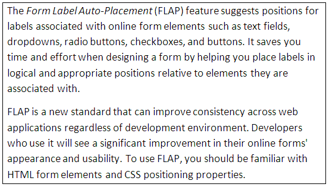
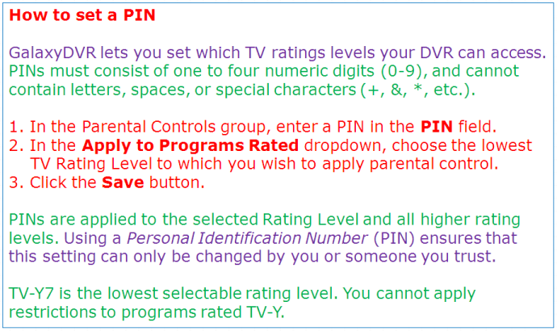
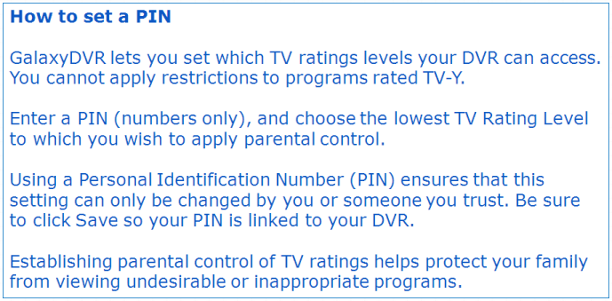
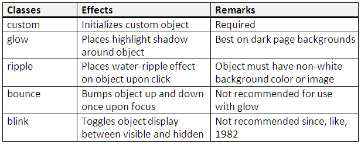
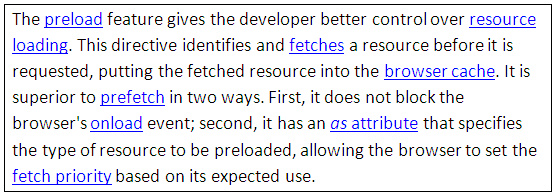

How Not to Write a Tutorial – Dave Gash – Medium

# How Not to Write a Tutorial

### Introduction

I’ve been presenting, training, and writing technical tutorials for a few decades now, and if I’ve learned anything, it’s “Never go in against a Sicilian when death is on the line!” Wait, that’s not right. It’s “A great technician does not a great teacher make.” Yeah, that’s it. Just because a technician knows something backward and forward doesn’t mean they can explain it to other people. And yet, they try; oh, how they try.

Lately I’ve been reading a lot of web tutorials, all technical in nature — how to use various APIs, custom controls, HTML5 and CSS3 features, and so on — mostly written by developers. Not only do many of the authors make content and presentation errors, many of them make the *same* content and presentation errors. This led me to chuckle to myself, “Wow, these guys could write a book on how NOT to write a tutorial!” At which time, of course, the little light bulb above my head went on, and here we are.

In this article, we’ll explore some of the common errors made by tutorial authors, try to understand why they make those errors, and offer some constructive alternatives for better structure and presentation. Let’s dive right in.

### Common Tutorial Errors, or, What Not to Do

**Error #1: Forget why the reader is there**

Although I’m a staunch advocate of conceptual and background information, there’s a difference between exposition and verbosity. Your reader should already assume you know what you’re talking about; don’t spend several paragraphs trying to prove it. Tell them what they need to know and move on.

> Be aware that, in virtually every case, your reader’s goal when they get into your documentation is *> to get out of your documentation!*>  Readers access User Assistance documents such as tutorials because they are having a problem getting something done; they only want to learn what they need to know to solve the problem so they can get back to work.

So what, exactly, do they need to know at this point? Good question!

The first thing your reader needs to decide is, “Am I in the right place?”, so ensure that they’re familiar with the technique, product, or feature before proceeding. *This is essential to good decision-making.* If the conceptual information reveals to the reader that this is in fact what they’re looking for, they can skim or skip the rest of the background and go right to the task steps. However, if the background reveals that this is not what they need, they can go elsewhere immediately instead of wasting time on something that doesn’t solve their current problem. Give readers enough information up front to easily make that critical stay-or-go decision.

**Error #2: Start in the middle of the narrative**

Even if the reader decides that this is the right topic, don’t assume they fully understand why. Briefly address these points before proceeding:

- •What does this technique/product/feature do?
- •How will it improve my work or solve my problem?
- •Why is it important in the grand scheme of things?
- •Why should I use it myself?
- •What should I know before I begin?

When you answer these questions from the reader’s perspective, you will be ready to present the task steps. For example, the following introductory paragraphs provide the reader with everything they need to know to make an informed decision whether to continue.

Straightforward introductory text that answers the above questions.
**Error #3: Drift off-point**

In the introductory, conceptual section, it’s easy to skate off into tangents. After all, everything is related in some way, innit? Trying to fully cover some bit of technical background often leads an author to the dreaded “But should I explain *this* first?” question, and that’s the proverbial slippery slope.

While “what to leave in, what to leave out” is largely subjective, it’s primarily a know-your-audience issue. Be aware of who you’re writing for and their general expertise, but recognize that your readers will be at different levels. A reasonable approach is to write for the lowest *likely* level (not lowest *possible* level) of reader expertise; that is, when in doubt, leave it in. This technique provides the most flexibility for the most readers: experienced readers can easily skip something they already know, but novices can’t read something that isn’t there.

**Error #4: Mix it up!**

The discipline of Information Typing — the IT in DITA — prescribes three main kinds of content: concept, task, and reference (CTR). In an online help system, the content types are typically separated into individual topics; in a tutorial, the three types are typically presented in the same document, but are (read: should be) presented linearly. Many (read: most) tutorial authors are unaware of information typing principles and often (read: all the damn time) conflate the types, resulting in an information mishmash that may actually contain the needed info but makes it hard for the reader to efficiently parse and retain.

Here are examples of conflated info that are, respectively, fairly easy and fairly hard to parse.

*CTR parsed and color-coded: concept info in purple, task info in red, reference info in green. Restructuring, but not rewriting, is required.*

*Same info, but significantly harder to separate into CTR. A complete rewrite is required.*

Take care to keep the information types clean and discrete — again, this helps the reader make subsequent stay-or-go decisions along the way — and to present them in that order: first concepts, then tasks, then reference.

**Error #5: Throw some code at ‘em!**

Technicians often start tutorials with a code sample. This natural and explainable phenomenon gets right up my shorts, and not in the fun way. Authors often do this because (a) they’re more comfortable writing executable code than expository prose, (b) they are aware that their code skills are better than their English skills, and (c) they learn best from reading code, so surely everyone else does too! Spoiler alert: no, we don’t.

I can’t even tell you the number of tutorials (okay, I could, but it would just depress you) I’ve seen in the past year or two that started with a big block of code *on the landing page!* Please don’t do that.

Here’s a true story.

> A few months ago I hit a certain tutorial’s landing page. (I won’t say where it came from, but the company name rhymes with Schploogle.) The author’s first paragraph was three sentences about why this particular feature is great. The second paragraph, preceding a giant block of colorfully syntax-highlighted code, consisted of just one sentence, which I quote here verbatim, as it is forever seared into my brain like the fires of a thousand suns: “Probably the best way to explain this is with a code sample.” I literally yelled at my monitor, ***> “NO, IT EFFING ISN’T!!!”***

I repeat, please don’t do that. It makes me shout at inanimate objects, and that’s not good for my blood pressure. There’s a place for code samples, and it’s not in the introduction.

**Error #6: Don’t present the task as enumerated steps**

This error is rampant but, even as a lifelong developer, I don’t really understand it. Technicians’ thought patterns, development processes, and coding languages are invariably, extraordinarily linear. And yet, many writers tend to avoid the trusty ol’ <ol> when describing tasks, which is just… weird. Numbered lists should be your go-to procedural device; always use them to present the steps required to accomplish a task.

In the numbered list, include only the steps needed to complete the task in its basic form (there’s plenty of time for tweaking later) and present the steps in the correct sequence — both overall and inside the steps. For example, don’t say:

> 4. Click the **> Delete **> button, after ensuring you have made two backups of your data.

Oops.

If a small code sample can help clarify a step, include it — but not as a replacement for the step’s explanation. Start steps with an imperative verb indicating what to do, then indicate what object to act on and where to find it. If performing the task step results in a significant change, say so in an intermediate result statement. Give readers enough mid-task feedback to know that they are performing the steps correctly. For example:

> 3. Click the **> Update **> button in the confirmation dialog.

> The confirmation dialog closes and the pending updated information appears in the main window.

**Error #7: Ignore the possibility of errors**

As writers, we like to think our instructions are flawless and that our readers will follow them perfectly, but of course that’s not the case. Despite our and our readers’ best efforts, some soufflés fall. Show the reader one or more common failures, and explain what happened and why.

Remember that “an expert is one who has made nearly every mistake in his chosen field”, and allow your readers the benefit of learning from the experts who came before them.

Include specific syntax or logic errors that readers often make while completing the task, and refer back to problematic task steps as applicable. For example:

> Note that the **> Scale Value**>  field in step 5 is specified in multiples of the original; take care not to treat it like a percentage. That is, a value of 10.0 is ten times — not ten percent — of the original scale.

**Error #8: Keep the final result secret**

No, just no. Be generous with feedback. Show the reader the final (positive) result they will obtain if they have correctly followed the task steps to the end. This might include a completed code sample, a screen capture, or a return code or message.

While this is a common exit point for many readers, others may push on to gain more knowledge; don’t let them down. In fact, this is generally a great place to segue into reference material that shows how to tweak the process to improve or customize the result. For example:

> The client update process is complete. The main window displays the new information, and the Status indicator changes from yellow to green.

After that result statement following the last task step, you could present reference information that might include ways to change the update confirmation options.

**Error #9: Don’t explain mods and customizations**

While most readers will follow a basic, vanilla procedure to make sure they understand how it works, hardly any of them will actually use it in exactly that way in the real world. Instead, they’ll want to tweak it for their specific situation, and that’s what reference material is for.

In this section, present details about available modifiers that affect the appearance or performance of the task, including calling options or parameters that extend, change, or limit its behavior. Briefly explain each option’s use case, show how to invoke or apply the option, and display or explain the results of its use.

This information should be presented sparsely (tabular format is common) but completely, as it is from this section that readers learn how to get exactly what they want from the feature instead of using it in its basic form. For example:

Reference information doesn’t require much verbiage; clean presentation assists readers with both comprehension and retention.

**Error #10: Link out to 487 external pages, samples, blogs, and videos**

Because who wants to see all the info they need in one place, amirite? Corollary error: Pepper the links throughout the text.

As you write, you’ll want to reference various resources that might be useful to readers. That’s fine, but don’t overwhelm them. *Do* close your tutorial with a brief list of “for more information” links where interested readers can learn more. *Do not* include these links in the body of your tutorial, especially scattered throughout text paragraphs — they distract readers and lead them away from your primary content.

For example, don’t do this:

Link-heavy text. Eek.

Instead, collect the references in their own section at the end of the tutorial. Links in this section might go to other conceptual topics, related tasks, instructional videos, or further reference material, whether written by you or others.

**Error #11: Challenge the reader!**
I’ve saved this one for last because it irritates me the most.

Some recent email and comment threads I’ve followed have taken the position that tutorials should “challenge the reader”. The remarks included gems of wisdom like:

- •Make the reader work for the information
- •Just give them enough info to get started
- •Don’t coddle the users
- •Tutorials should lead, not teach
- •Let readers do their own research

The apparent tough-love consensus was “present enough information for readers to grasp the basic idea, then let them work it out for themselves, because making them think is good for them.” *In a tutorial!* To this idea, I offer the following rejoinders (ahem, pardon me while I consult my thesaurus): Balderdash. Nonsense. Bunk. Hokum. Drivel. Baloney. Rot. Hogwash. Rubbish. Garbage. Codswallop. Hooey. And also too in addition as well: tripe, twaddle, and claptrap. (Notice how I politely avoided saying “bullshit”? Oh, wait.)

Allow me a brief analogy.

Here’s everything you need. Just, you know, put it together.

The Latin *tutor* means “guardian, defender, protector”, and that’s a pretty good root word. The purpose of writing a tutorial is to advocate for your readers, not to annoy them; don’t be stingy with information, whether conceptual, procedural, or reference. Tell readers exactly why and how to perform the task; don’t make them guess, don’t make them test, don’t make them research — give them everything they need right there in the tutorial.

Of course, provide links to additional information that users can follow if they want. Such information should be pertinent, but not critical, to understanding or performing the task at hand. Again, remember that your readers’ mission is just *to learn how to do something and get back to work* — don’t impede them in that quest.

**Takeaways**

Congratulations; you now know what not to do when writing a tutorial. If you follow the guidelines presented here, or most of them, you will have served your readers well by:

- •providing up-front information that confirms whether they are in the right place,
- •listing specific steps in the correct sequence to accomplish the task at hand,
- •demonstrating both successful and unsuccessful attempts,
- •explaining ways to modify the feature to fit the reader’s requirements, and
- •offering links to external resources that provide additional information.

**Totally Random and Totally Silly Tutor Poem**
> A tutor who tooted the flute
> Tried to tutor two tooters to toot.
> Said the two to the tutor,
> “Is it harder to toot,
> or to tutor two tooters to toot?”
> — Anonymous
**Thanks!**

Thank you for reading this article; I hope you had fun and learned something along the way! Comments or questions? Contact the author, Dave Gash, at [dave@davegash.com](https://medium.com/@davidagash/how-not-to-write-a-tutorial-c6dbbcbd0102about:invalid#zSoyz).