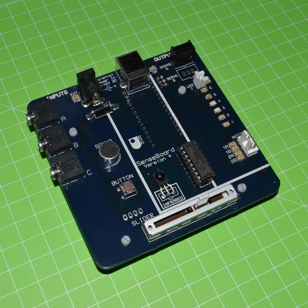
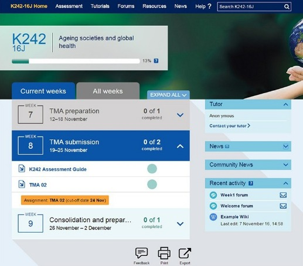
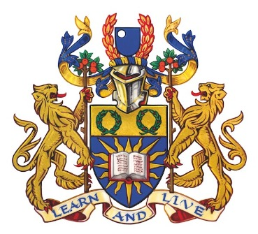

How Open University Works: An Insider’s Perspective — Class Central

   [    Class Central](https://www.class-central.com/)

# How Open University Works: An Insider’s Perspective

       24 minute read   written by   [Manoel Cortes Mendez](https://www.class-central.com/report/author/manoel/) . Published on April 22, 2018

Last year, I graduated from The Open University (OU) with a bachelor’s degree in computer science. Studying online proved a great fit for me. So much, in fact, that I went on to apply to Georgia Tech’s Online Master of Science in Computer Science (OMSCS). I’m currently halfway through the program, specializing in machine learning. This puts me in an unusual situation: I’ve completed my entire higher education online. I suspect that, in time, this will become more common.

Unlike most Open University (OU) students, who are usually in their mid-thirties, I joined the OU in my early twenties. I chose the OU over a brick university because I had started working full time after high school, and I wanted to continue working during my university studies. Furthermore, I lived in Belgium, but I envisioned my career in the US. So I wanted to study in English and my degree to be recognized internationally. As it happens, the OU is one of a handful of UK universities to be fully accredited in the US. That settled my choice.

In this article, I retrace my steps at the OU, from enrollment to graduation. The goal is twofold: first, to give you a sense of what it’s like to study with the OU; second, to highlight particular aspects of the OU experience that aren’t readily apparent from the outside, but that every prospective student ought to know.

> The purpose of this article isn’t to speculate about the OU’s future, but rather to present an account of the OU experience as I lived it, and for the sake of future students, as I hope it will remain.>

## Challenges

The Open University is a UK public research institution and the world’s first distance-learning university. Founded in 1969 following a government push for a more accessible higher education, it has grown to become the largest academic institution in the UK, with over 170,000 students. It offers courses on a wide variety of subjects and degrees including bachelor’s, master’s, and doctorate.

The OU is currently facing important challenges. Funding reforms in UK’s higher education have led to cuts in student aid, hikes in course fees, and drops in enrollments. The situation recently culminated in the resignation of the OU vice-chancellor, following a vote of no confidence from the OU staff. The vice-chancellor’s departure was precipitated by his controversial plans to lay off staff, cut courses, and scale down research.

So the OU’s future is uncertain. To overcome the challenges it faces, the OU may adopt measures that’ll change its approach to online teaching, perhaps drastically. But the purpose of this article isn’t to speculate about the OU’s future, but rather to present an account of the OU experience as I lived it, and for the sake of future students, as I hope it will remain.

## Admission & Cost

> I paid about $1,500 per course and $18,000 in total for my degree.>

As its name indicates, the Open University is built around the notion of openness. There are no barriers to entry besides knowing English, having internet access, and paying your tuition fees. Given the OU’s public, nonprofit nature, tuition fees fluctuate according to UK politics. I paid about $1,500 per course and $18,000 in total for my degree. However, prices have been increasing. So the OU isn’t cheap, but it’s more affordable than most British universities, and it doesn’t require you to shoulder the cost of living in the UK.

## Courses

### Subjects

The OU offers for-credit courses in pretty much every discipline you’d expect from any large university: biology, economics, engineering, journalism, law, and mathematics to name a few.

### Levels

Undergraduate courses are classified into levels 1, 2, and 3. These roughly correspond to academic years. For example, level 1 courses are the type of course you’d take in your first year in a brick university. They are often introductory courses and involve some hand-holding. At level 2, courses are likely to build on previous ones, and you’re expected to be much more self-reliant. By level 3, you’re autonomous and ready to tackle semester-long research and development projects.

You can take individual courses at any level, or you can study toward a degree comprising a series of courses across several levels.

### Availability

The OU offers courses worldwide, but the exact course catalog varies from country to country. As a general rule, most courses are available throughout Europe, but options in other continents may be more limited. For instance, as of the writing of this article, the OU offers close to 240 undergraduate courses in the UK, but just under 180 in the US.

## Degrees

### Types

Different degrees allow accommodating different student needs and constraints. At the undergraduate level, degrees available include:

|     |     |
| --- | --- |
| Undergraduate certificate | Equivalent to ⅓ of a bachelor’s degree. |
| Undergraduate diploma | Equivalent to ⅔ of a bachelor’s degree. |
| Bachelor’s degree without honours | Equivalent to ⅚ of a bachelor’s degree. |
| Bachelor’s degree with honours | Full bachelor’s degree. |

The difference between these degrees isn’t trivial. They don’t all benefit from the same level of recognition, especially outside the UK. For example, many graduate programs only accept applicants with an **honours** undergraduate degree.

Similar degrees are offered at the graduate level:

|     |     |
| --- | --- |
| Graduate certificate | Equivalent to ⅓ of a master’s degree. |
| Graduate diploma | Equivalent to ⅔ of a master’s degree. |
| Master’s degree | Full master’s degree. |

Certificates and diplomas can serve as stepping stones toward full degrees, allowing to reduce the time it takes to gain a credential.

Finally, the OU offers doctoral degrees including PhD and EdD.

### Open Degrees

OU undergraduate degrees can focus on either one or two complementary subjects. For example, you can pursue a Bachelor of Science in Mathematics. But you may prefer a Bachelor of Science in Mathematics and Physics. If you decide to study two subjects, you’ll spend equal time on each.

But the OU also offers an alternative to regular undergraduate degrees called **open degrees**. Instead of focusing on one or two subjects, open degrees allow you to pick and choose any courses you like, to tailor your degree to your needs and interests. The only requirement is that courses be taken across different levels (usually four courses at level 1, four at level 2, and four at level 3).

But open degrees are a double-edged sword. If they offer more control to students, they can also be perceived as lacking focus — for example, if a student chooses courses that don’t complement each other. Moreover, employers are unlikely to know what open degrees are. This may not be an issue if you’re studying simply for the pleasure of learning, but if your goal is to improve your professional prospects, a regular degree is your safest option.

### Mode of Delivery

In addition to being a distance-learning university, the OU is a research institution. Its campus and research facilities are located some 50 miles north of London in the town of Milton Keynes, also home to the famous Bletchley Park.

OU Campus ([Source](https://www.flickr.com/photos/the-open-university/15201078703/))

If most OU courses, and by extension, most OU degrees are completed online, some require students to spend time on campus.

This is notably the case for courses that don’t lend themselves naturally to an online mode of delivery — for instance, because they require direct communication (such as a foreign language course) or access to special resources (such as a laboratory chemistry course). Rather than not offering those courses, the OU decided to add an on-campus component to them, requiring students to spend time at Milton Keynes, or at a partner institution, to attend classes, take part in practical activities, and collaborate.

This is also the case for doctoral students, who are usually required to live at a commutable distance from Milton Keynes to fully engage with the research environment and regularly meet with their doctoral advisors.

But these cases are the exception rather than the rule. The OU remains first and foremost a distance-learning institution.

### Concentrations

OU degrees may offer different concentrations. These are specific fields of study within your degree subject. For instance, in computing, undergraduate concentrations include:

- •Computer Science
- •Software Development
- •Communication and Networking

Each concentration involves a different set of courses. And while some of these courses are compulsory, others are elective — that is, you can choose between several alternatives. For example, in the Computer Science concentration, taking Algorithms, Data Structures, and Computability is compulsory. But Software Engineering, Data Analysis, and Interaction Design are electives — you may pick any two of the three.

### Calendar

Most undergraduate courses are offered twice a year (starting in February and October) and last about nine months. Registrations close a few weeks before courses begin, and there’s a limit to how many courses you can take at once. Maxing out credits each year, you can finish a bachelor’s degree in as little as three years, but most students take longer.

## Study

### Course Material

The OU remains a firm believer in traditional course material, which they’ve been producing in-house since 1971 and is included in the course fee. So a few weeks before classes start, you’ll receive a UK-stamped package containing textbooks, DVDs, USB drives, and sometimes, special equipment.

*OU Textbooks*

For example, in one course I received a programmable board similar to a Raspberry Pi. The board was used in conjunction with a collection of sensors and a motor to introduce students to programming through a hands-on approach. This is a recurring theme with the OU: they try hard not to let distance get in the way of a rich learning experience.

*OU SenseBoard*

### Tutor

> Think of your tutor as both your professor and TA. If you have a question, you can contact him for help.>

The OU has a very particular approach to course building and teaching. Courses are built by multidisciplinary teams that comprise experts from academia and industry, educational technologists, content creation specialists, and external examiners. They are in charge of producing all the course material from theory to assessments, from printed to digital format.

But on a daily basis, courses are run by tutors. Think of your tutor as both your professor and TA. If you have a question, you can contact him for help. When you submit an assignment, he’s the one to mark it and provide feedback. And periodically, he conducts live online sessions. Simply put, your tutor is your most valuable source of support during your studies.

Each tutor is in charge of a tutor group that usually comprises 30 students. Think of these students as your classmates: they’re all in the same course, follow the same schedule, and have the same tutor as you.

Tutors are experts in their course subject matter, and many combine their work as tutors with related positions in academia or industry. Some of my tutors were also lecturers in brick universities, some were engineers, some held PhDs, some were OU alumni, and some, several of the above. But regardless of their background, my tutors were unfailingly helpful and experienced. Now maybe I got lucky, but the OU prides itself on ranking high in the national student satisfaction survey conducted annually by the UK authorities, so I suspect my experience isn’t an outlier.

Shortly before the term begins, you’ll receive an email from your tutor where he welcomes you to the course and introduces himself. From there, how much contact you have with him is entirely up to you. My suggestion is to engage in meaningful exchanges with your tutors. Their support can be invaluable both during the course and beyond. Few distance-learning programs give you the chance to build meaningful relationships with instructors, so take full advantage of this opportunity.

### OU Website

The heart of the OU is its website. There, you can find most of the information you need to determine if the OU could be a good fit for you. And if you enroll, it’s from there you’ll log into your **student homepage**, which centralizes the main components of your virtual student life including your:

- •Profile — where you can access your academic record.
- •Newsfeed — where faculty posts announcements.
- •Email — which ends in *.ac.uk*, the UK equivalent of an US *.edu* student email.
- •Calendar — which aggregates all your course deadlines.
- •Services — such as career support, digital library, financial aid, and help center.
- •Communities — such as OU student associations, forums, and social media.
- •Finally, your student homepage allows you to access your courses.

### Course Website

Each course has its own website with at its center, a study planner. The planner is divided into weekly checklists of activities, where each activity links to the corresponding course material. As you advance through the material, you check items off your list to track your progress. Note that although the study is self-paced, assessments do have hard deadlines.

*OU Course Website ([Source](http://www.open.ac.uk/courses/what-study-like/distance-learning))*

### Course Content

The bulk of the course material consists of text interspersed with supporting images and charts. Audio and video material aren’t all that common. I imagine this is a deliberate choice by the OU. First, it helps keep production costs down. Second, it helps maintain parity between the printed and online material, ensuring that students get a similar experience whether they study on their textbook or computer.

Of course, this parity has its limits. Some resources simply can’t be put in printed format, such as interactive quizzes and links to external references. So there’s a gap between the printed and online material. And as newer and better educational technologies are integrated into the OU platform to enrich the learning experience, this gap is bound to increase.

### Online Sessions

> I remember online sessions being a nice break from the monotony of solo learning>

Every month or two, your tutor will schedule a live online session. These are like going to class but over the internet. You and your classmates use a web conferencing app to join your tutor in a virtual classroom. There, you can communicate through video, audio, or chat, and collaborate on a shared blackboard.

Your tutor spends one to two hours teaching the course material, often with the support of a slide presentation. Online sessions tend to focus on the more challenging topics, the ones students can really benefit from being taught directly.

And if you have a question, all you need do is raise your hand. Your virtual hand that is. Virtual classrooms have a system of emojis that can be leverage different ways — for example, by students to draw the attention of the tutor, or by the tutor to ask if students are following along, which is usually echoed by a wave of thumbs up.

I remember online sessions being a nice break from the monotony of solo learning. They’re a great opportunity to get some face-to-face time with your tutors and bond with classmates.

And if you can’t make it to a session, don’t worry; these are systematically recorded, so you can always catch up later. In some courses, you can even access recordings from other tutors. This is useful when dealing with difficult subjects because if your tutor’s explanations don’t click with you, another tutor’s just might. In addition, I found that cross-referencing the advice shared by different tutors prior to assessments would give you a good idea of the type of questions you’d get. No wonder pre-exam sessions had by far the larger attendance.

### Communication

At some point, you may have to contact your tutor. You have different options to do so.

For personal matters, use email. Your tutor’s email address is always available to you, and it’s the main avenue for official contact. For instance, if you need an extension on an assignment, request it by email. You can expect a response within two days, although, in my experience, tutors often reply on the same day. And if you’re wondering, tutors will gladly grant you an assignment extension as long as you contact them well ahead of the deadline.

> You can expect a response within two days, although, in my experience, tutors often reply on the same day.>

For urgent matters, you may be able to call or message your tutor. They often share their phone number and contact hours at the start of the course. I never resorted to contacting one of my tutors on his phone, but having this option was certainly reassuring.

For general questions, you can still ask your tutor, but you may want to use the course forums instead.

Forums are ideal to discuss the course material and get quick answers to questions. There, you can receive replies from both tutors and students. And since those students work on the same problems and must meet the same deadlines as you, you’re likely to get a timely response. In addition, you’re probably not the only one asking yourself those questions, so by sharing them, you ensure that others benefit from the community answers.

Each course has several forums, and how these are broken down differs from course to course. Some forums are specific to particular course sections or assignments, to ensure that all questions stay on topic, while others are more general and informal, to allow for more relaxed discussions on a wider range of topics.

One special forum that is present in every course is the tutor group forum. This forum is restricted to your tutor group — that is, all students in the course that have the same tutor as you. So you can think of it as your class forum. But in my experience, tutor forums are seldom used, except by tutors themselves to post class announcements.

### Assessments

The OU uses two methods of assessment: homeworks and exams. Let’s discuss each.

#### Homeworks

Regularly during the course, you’ll have to submit homeworks. Naturally, these are assignments you complete at home and at your own pace, and they come in two types.

The first type of homework is the **tutor-marked assignment** (**TMA**). TMAs are substantial assignments that aim to assess your understanding of a large chunk of the course material. And as their name indicates, they are marked by your tutor.

TMAs require anywhere from 20 to 40 hours of work and can involve a wide variety of tasks, such as short- and long-answer questions, programming problems, or essays. Most courses have between three and five TMAs, and the precise number is listed on the registration page, so you can get an idea of the course load before you register. Although TMA deadlines are fixed on the first day of class, the TMAs themselves may only become accessible later. For instance, in my algorithms course, they were released two months before their deadline. So you can work ahead, but within some limits. Once you complete a TMA, you submit it by uploading it to the course website.

Passed the deadline, your tutor can score your TMA. He checks your answers one by one, marking in green the correct ones, marking in red the wrong ones, providing feedback on each as required, and finally, giving you a score out of 100 and an overall comment on your performance. So the OU adopts a very conventional approach to scoring TMAs. There are no automated scoring agents, no peer feedback involved, just good old manual marking.

The second type of homework is the **interactive computer-marked assignment** (**iCMA**). iCMAs are short assignments that you completed online and that are graded automatically.

iCMAs have a predefined availability window, usually several weeks long. You may complete them at any time during that period. iCMA’s include multiple choice questions, fill in the blank questions, drag and drop questions, code input questions… In short, all question types that are easily autograded. Although more numerous than TMAs, iCMAs require less time to complete and don’t impact your grade as much. So they’re not as critical. In fact, I remember iCMAs being entirely optional in some courses, serving only as a tools for self-assessment.

#### Exams

All courses end with an exam, and just like homeworks, exams come in two types.

The first type of exam the is the bona fide **proctored exam** — that is, an exam taken in person, in a timed environment, and under the watchful eye of an invigilator.

So once again the OU departs from a purely online experience in favor of a more traditional approach, and this despite the logistical overhead it implicates. I suspect this decision is motivated by a desire to leave no doubt about the rigor of the university.

Now having students fly to the UK to sit their exams would defeat the purpose of studying online. So instead, it’s the exams that go to the students. Indeed, the OU has partnered with over 100 examination centers across Europe, where students can go take their exams. And if you don’t live in Europe, the OU can make individual arrangements with an appropriate venue in your country of residence.

In my case, the exam center was a ten-minute drive from home. I’d go there and find myself in a room full of OU students taking exams on different subjects. An invigilator would verify our identities and point us to our allocated seats, where our exam papers would be waiting face down. After instructing us on what to do, and more importantly, what not to do during the exam, we’d be allowed to start. Exams would usually have a four-hour time limit. So all in all, a pretty typical exam experience.

The second and less common type of exam is the **end-of-module assignment** (**EMA**). EMAs are a cross between a student project and a TMA on steroids. Just like homeworks, EMAs are completed at home and at your own pace. But unlike homeworks, EMAs are not marked by tutors, but by external examiners, to ensure consistency and prevent biases.

EMAs require 30 to 60 hours of work and aim to assess your knowledge of the course material, but also, your ability to apply this knowledge in practical contexts. To this end, EMAs often adopt an open-ended, project-centric approach. And for this reason, only courses where a project seems like a natural extension of the course material have EMAs.

For instance, my data analysis course had an EMA that involved conducting a full-fledged analysis of a couple of seemingly unrelated datasets. We were given free reigns as to how to approach our analysis. Our score only depended on our ability to unearth relations between the dataset, extract valuable insights, and thoroughly report on our findings.

### Grades

Once you receive all your homework and exam results, your final course grade can be determined. This is done in three steps.

First, your homework scores are combined to form your so-called **continuous score**. This involves calculating a weighted mean of your TMA and iCMA scores. The specific weights used vary from course to course, but TMAs are always weighted more heavily than iCMAs.

Second, your exam score becomes your so-called **examinable score**.

Third, your continuous and examinable scores are compared, and the **worst** of the two is used to determine your course grade using the following table:

|     |     |
| --- | --- |
| **Score** | **Course Grade** |
| 85 – 100 | Distinction |
| 70 – 84 | Pass 2 |
| 55 – 69 | Pass 3 |
| 40 – 54 | Pass 4 |
| 0 – 39 | Fail |

This system is particularly ruthless. Imagine you get perfect scores on all your homeworks, resulting in a continuous score of 100, but you bomb your exam, resulting in an examinable score of just 65. Since only the worst score is used to determine your course grade, you end the course with a Pass 3. And the same would happen if you aced your exam but did poorly on your homeworks. So the only way to get a good course grade is to perform well on both.

Unfortunately, there’s no single way to convert UK grades into US letter grades. But for what it’s worth, when I had my OU degree evaluated by World Education Services (WES) to apply to grad school in the US, both Pass 2 and Distinction grades were converted to As.

## Graduation

### Honors

Once you pass all your degree courses, you can apply for graduation. Based on your academic results, you’ll be offered to graduate with one of the following classes of honors:

- •First
- •Upper Second
- •Lower Second
- •Third

Again, there’s no one way to convert these to the US system, but according to WES, an OU First translates into a 4.0 GPA and an Upper Second into a 3.8. But your mileage may vary.

If you’re satisfied with the class of honors you’re offered, you can immediately graduate. But if you’d like to improve it, you can also delay your graduation to take more courses. Good results in these could offset previous lower results and bump you up a class of honors.

Once you accept your graduation offer, you have immediate access to documents detailing your degree, including the courses you’ve taken, the grades you’ve achieved, and the skills you’ve gained. These documents also explain how courses were delivered and assessed, and they don’t shy away from the fact the OU is primarily a distance-learning institution.

Two months later, you’ll receive by post your shiny new diploma with the usual ornaments and information, including the university coat of arms and the degree class of honours.

*Coat of Arms ([Source](https://twitter.com/OUstudents/status/955443315176038401))*

### Ceremony

The OU organizes graduation ceremonies with the traditional bells and whistles: academic dresses, inspirational speeches, rolled diplomas, the works. Ceremonies are held monthly in venues across the UK. If you get the chance to attend, I encourage you to do so. They’re a great opportunity to meet faculty and classmates. And having your name called, walking the stage, and hearing the cheers from your family makes for some great memories.

*OU Graduation Ceremony ([Source](http://www.open.ac.uk/students/ceremonies/event/bar/ld15a))*

## Beyond

### Recognition

Despite its unconventional mode of delivery, the OU is on paper a university like the others. More precisely, it’s a *recognized body* in the UK, which is british legalese for *fully accredited*. And it’s one of the few UK universities to also be *regionally accredited* in the US. So if after your OU degree, you want to pursue further studies in a brick university, you can. And this includes prestigious universities. For instance, one of my OU classmates went on to study a master’s degree in computer science at Oxford University.

### Support

Finally, OU students have access to structures of support that extend beyond their studies, such as Career Services, Student Support, and OU Associations. Here’s how each can help.

**Career Services** offers resources to help students at every step of their job search. For example, they provide access to private job listings, they organize career-oriented webinars and consultations, and they facilitate contact between students and employers.

**Student Support** offers direct, individualized assistance to students. For example, they can provide you a letter of recommendation tailored to your academic profile and needs. Although these tend to be a bit generic, it’s nice to have a streamlined process for requesting them. And if you need a more personal, more inspired recommendation, you can always try to get one directly from a tutor. If you did well in his course, he’ll most likely oblige.

**OU Associations**, such as the OU Student Association and the OU Alumni Association, offer access to a vast network of OU students and alumni. Keep in mind the OU has over two million alumni working in a wide range of industries and companies. So needless to say, leveraging this network can be key to successfully launch or advance your career.

## Conclusion

In 1969, the Open University became the world’s first distance-learning university. Since, its approach to education has continued to evolve at the pace of technological development. But this evolution has been selective — embracing technology to augment the learning experience but retaining proven features of conventional education (such as in-person exams and close contact between students and instructors). And this nuanced approach, balancing tradition with novelty to try to offer the best of both worlds, must have struck a chord with students, because almost 50 years after its inception, the Open University is the largest academic institution in the UK. And if you too would like to join, I hope this article helped shed light on how you should proceed and what you can expect.

|     |     |
| --- | --- |
|  [Learn Faster by Training Your Brain to Focus](https://www.class-central.com/report/learn-faster-training-brain-focus/) |  [Sessions We’re Excited About at the 2018 Open edX Conference](https://www.class-central.com/report/2018-open-edx-conference/) |

|     |     |     |
| --- | --- | --- |
|  Category - [Commentary](https://www.class-central.com/report/category/mooc-commentary/) |  Tags  [open university](https://www.class-central.com/report/tag/open-university/) |     |

##### Browse courses by

- [Random](https://www.class-central.com/random)

- [Providers](https://www.class-central.com/providers)

- [Universities](https://www.class-central.com/universities)

- [Institutions](https://www.class-central.com/institutions)

- [Subjects](https://www.class-central.com/subjects)

- [Careers](https://www.class-central.com/careers)

- [Languages](https://www.class-central.com/languages)

##### More

- [MOOCs for Credit](https://www.class-central.com/report/moocs-for-credit/)

- [Earn A Credential](https://www.class-central.com/certificate)

- [Follow Button](https://www.class-central.com/report/follow-button-for-education/)

- [MOOC Report](https://www.class-central.com/report)

- [FAQ](https://www.class-central.com/faq)

- [Privacy Policy](https://www.class-central.com/privacy-policy)

- [MOOCWatch](https://www.class-central.com/moocwatch)

- [What is MOOC Tracker?](https://www.class-central.com/report/mooc-tracker/)

##### Connect

- [Email](https://www.class-central.com/report/open-university-insiders-perspective/?utm_medium=email&utm_source=other&utm_campaign=opencourse.GdeNrll1EeSROyIACtiVvg.announcements~opencourse.GdeNrll1EeSROyIACtiVvg.iX_8mkSHEei0NAqn-q-HUgmailto:contact@class-central.com)

- [Facebook](https://www.facebook.com/classcentral)

- [Twitter](https://twitter.com/classcentral)

- [Google+](https://plus.google.com/+ClassCentral)

- [Youtube](http://www.youtube.com/channel/UC0VOktSaVdm_YIUa4X5mBTQ)

#### Newsletter. Never miss a course.

 No spam. Unsubscribe any time.

 ©Class Central 2011-2017