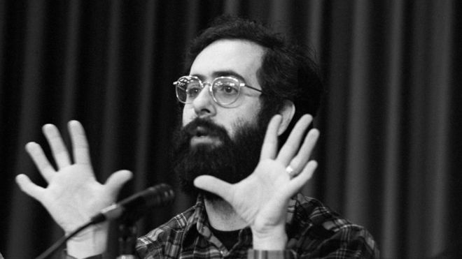
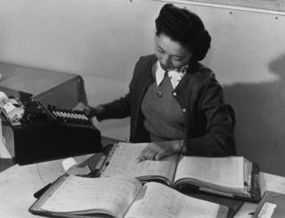
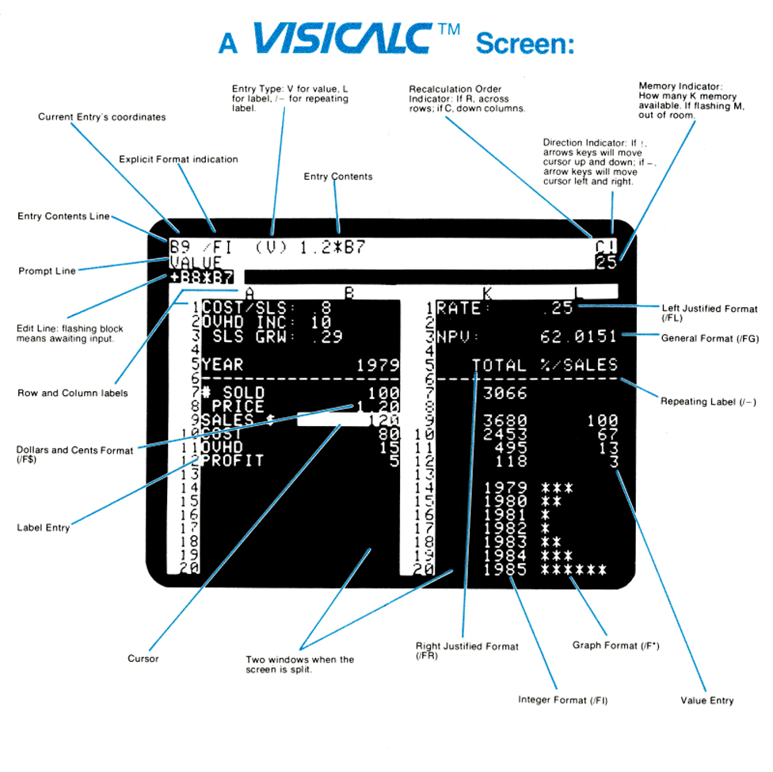
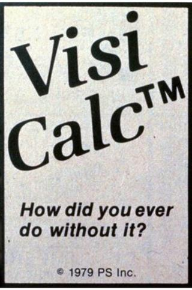
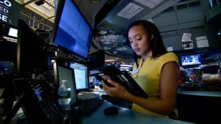
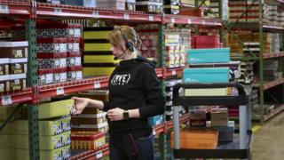
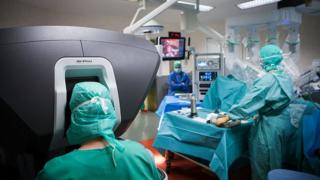

How computing's first 'killer app' changed everything

# How computing's first 'killer app' changed everything

 By Tim Harford  Presenter, 50 Things That Made the Modern Economy

- 22 May 2019

- [      Share this with Facebook](https://www.bbc.co.uk/news/business-47802280#)

- [      Share this with Messenger](https://www.bbc.co.uk/news/business-47802280#)

- [  ![](data:image/svg+xml,%3csvg xmlns='http://www.w3.org/2000/svg' class='extracted-svg ex-twitter js-evernote-checked' viewBox='-13 -15 44 44' enable-background='new 0 0 44 44' width='44px' height='44px' aria-hidden='true' focusable='false' data-evernote-id='1185'%3e %3cg%3e%3cpath d='M5.80573373%2c15 C12.7721527%2c15 16.581877%2c9.22887915 16.581877%2c4.22385671 C16.581877%2c4.06002242 16.581877%2c3.89618812 16.5714931%2c3.73466135 C17.3122088%2c3.19816171 17.9525471%2c2.53359441 18.4602026%2c1.77326482 C17.7690988%2c2.08016568 17.0364595%2c2.28092039 16.28536%2c2.36976011 C17.0756874%2c1.89671742 17.6675677%2c1.15138674 17.9502395%2c0.274527115 C17.2072164%2c0.715264453 16.3938137%2c1.02678037 15.5457981%2c1.19407596 C14.1105174%2c-0.331198284 11.7118448%2c-0.405039095 10.1865706%2c1.0290879 C9.20241101%2c1.95440555 8.78590269%2c3.33315194 9.09049603%2c4.64844138 C6.04571636%2c4.4961447 3.20861397%2c3.05740266 1.28529161%2c0.691035437 C0.280364327%2c2.42167943 0.793788713%2c4.63574999 2.45751448%2c5.74682343 C1.85525036%2c5.72951699 1.26567764%2c5.56683646 0.738408105%2c5.27262698 L0.738408105%2c5.32108501 C0.739561868%2c7.12441605 2.00985456%2c8.67622684 3.77741896%2c9.03389326 C3.2201516%2c9.18618993 2.63519393%2c9.20811142 2.06754269%2c9.09850397 C2.56366064%2c10.6410847 3.98509624%2c11.6979313 5.60613279%2c11.7290828 C4.26430681%2c12.7824682 2.60750362%2c13.3547344 0.902242404%2c13.3535807 C0.601110348%2c13.3524269 0.299978293%2c13.3339667 7.10542736e-15%2c13.2982001 C1.73295152%2c14.4104273 3.74742113%2c15 5.80573373%2c14.9965387'%3e%3c/path%3e%3c/g%3e %3c/svg%3e)    Share this with Twitter](https://www.bbc.co.uk/news/business-47802280#)

- [      Share this with Email](https://www.bbc.co.uk/news/business-47802280mailto:?subject=Shared%20from%20BBC%20News&body=https%3A%2F%2Fwww.bbc.co.uk%2Fnews%2Fbusiness-47802280)

- [Share](https://www.bbc.co.uk/news/business-47802280#share-tools)

     Image copyright  Getty Images

 Image caption   Dan Bricklin, inventor of the first computer spreadsheet

In 1978, a Harvard Business School student named Dan Bricklin was sitting in a classroom, watching his accounting lecturer filling in rows and columns on the blackboard.

Every time the lecturer changed a figure, he had to work down and across the grid on the board, erasing and rewriting other numbers to make everything add up, just as accounting clerks all over the world did every day in the pages of their ledgers.

It's boring and repetitive work. A two-page spread across the open fold of the ledger is called a "spreadsheet".

The output of several paper spreadsheets provides the input for larger, master spreadsheets.

Changing any of the data in that chain might mean hours of work with a pencil, rubber, and a calculator.

     Image copyright  Getty Images

 Image caption   Bookkeeper Teruko Kiyomura pictured manually updating various ledgers

Like many business school students, Mr Bricklin had had a real job before going to Harvard - he'd worked as a programmer at Wang and DEC, two big players in 1970s computing.

Why on Earth would anyone do this on a blackboard or paper ledger, he wondered, when you could do it on a computer instead?

* * *

   

[50 Things That Made the Modern Economy](http://www.bbc.co.uk/programmes/p04b1g3c) highlights the inventions, ideas and innovations that helped create the economic world.

It is broadcast on the BBC World Service. You can [listen to all the episodes online](https://www.bbc.co.uk/programmes/w3csz2w9) or [subscribe to the programme podcast](http://www.bbc.co.uk/programmes/p04b1g3c/episodes/downloads).

* * *

So he wrote a program for the new Apple II personal computer: an electronic spreadsheet.

His friend Bob Frankston helped him sharpen up the software - and, on 17 October 1979, VisiCalc went on sale.

Almost overnight, it was a sensation.

     Image copyright  IBM/1979 Software Arts, Inc

Other financial and accounting programs had long existed but VisiCalc was the first with the modern spreadsheet interface.

It is widely thought to be the first "killer app", a software program so essential that you'd buy a computer just to be able to use it.

As Mr Bricklin notes on his website, [Steve Jobs later acknowledged that VisiCalc had "propelled the Apple II to the success it achieved"](http://www.bricklin.com/jobs96.htm).

Within a few years, many accountants and business owners divided their professional experience into two periods: before and after the advent of the electronic spreadsheet.

     Image copyright  Dan Bricklin

Unsurprisingly, it wasn't long before VisiCalc had a new and powerful rival: Lotus 1-2-3.

By 1988, [the New York Times reported that Lotus had dominated the spreadsheet market for five years](https://www.nytimes.com/1988/03/13/business/the-executive-computer-lotus-1-2-3-faces-up-to-the-upstarts.html), after toppling VisiCalc "whose dominant share of the personal computer market seemed invincible".

How the mighty were humbled.

The New York Times also described several other upstart challengers, including a program called Microsoft Excel.

But the real lesson of the spreadsheet is not about how monopolies rise and fall but about how technology changes things.

It's a cliche that [the robots are coming for our jobs](https://www.bbc.co.uk/news/business-39296096).

But the story is never as simple as that, as the digital spreadsheet proves.

If the concept of a robot accountant means anything, surely it means VisiCalc or Excel. These programs put hundreds of thousands of accounting clerks out of work.

Of course VisiCalc was revolutionary. Of course it was more efficient than a human.

[According to the Planet Money podcast](http://www.npr.org/sections/money/2015/02/25/389027988/episode-606-spreadsheets), in the US alone, there are 400,000 fewer accounting clerks today than in 1980, the first full year that VisiCalc went on sale.

But Planet Money also found that there were 600,000 more jobs for regular accountants. After all, crunching numbers had become cheaper, more versatile, and more powerful, so demand went up.

The point is not really whether 600,000 is more than 400,000: sometimes automation creates jobs and sometimes it destroys them.

The point is that [automation reshapes the workplace in much subtler ways than "a robot took my job"](https://www.bbc.co.uk/news/business-45545228).

   

 Image caption   Technology has transformed the jobs of New York Stock Exchange traders such as Lauren Simmons

In the age of the spreadsheet, the repetitive, routine parts of accountancy disappeared. What remained - and indeed flourished - required more judgement, more human skills.

The spreadsheet created whole new industries.

There are countless jobs in high finance that depend on exploring different numerical scenarios - tweaking the numbers and watching the columns recalculate themselves.

These jobs barely existed before the electronic spreadsheet.

I've written before about [the Jennifer Unit, an earpiece that directs warehouse pickers to collect products by breaking down instructions](http://www.bbc.co.uk/news/business-39296096) into the most mindless, idiot-proof steps.

     Image copyright  Lucas Systems

 Image caption   The voice-directed Jennifer Unit tells workers how best to carry out their tasks

The Jennifer Unit strips a menial task of its last faintly interesting element. The spreadsheet operates in reverse: it strips an intellectually demanding job of the most boring bits.

Viewed together, the two technologies show that technology doesn't usually take jobs wholesale - it chisels away the easily automated chunks, leaving humans to adapt to the rest.

That can make the human job more interesting, or more soul-destroying - it all depends.

In accountancy, it made the human jobs more creative.

The histories of accountancy that I've read don't bother to mention VisiCalc or Excel. Perhaps it seems beneath their dignity.

What the spreadsheet did to accounting and finance is a harbinger of what is coming to other white-collar jobs.

* * *

## More things that made the modern economy:

[Grace Hopper's compiler: Computing's hidden hero](http://www.bbc.co.uk/news/business-38677721)

[Just Google it: The student project that changed the world](http://www.bbc.co.uk/news/business-39129619)

[How the world's first accountants counted on cuneiform](http://www.bbc.co.uk/news/business-39870485)

[Managing the managers: The rise of the business 'philosopher-kings'](http://www.bbc.co.uk/news/business-41582245)

* * *

Algorithms can churn out routine stories about corporate earnings reports more quickly and cheaply than human journalists.

Some teachers use online tutorials to quiz pupils to identify where they are getting stuck before helping them progress.

A doctor can sometimes be replaced by a diagnostic app.

Robotic surgery is increasingly common and can allow greater precision, flexibility and control than conventional techniques.

Law firms use "document assembly systems" that quiz clients and then draft customised legal contracts.

It is hard to conclude this trend won't continue across other sectors.

     Image copyright  Getty Images

 Image caption   A surgeon (left) uses a da Vinci surgical robot, controlled by a console, to perform a hysterectomy

But we shouldn't ignore the other cautionary tale the spreadsheet has to offer.

We may think we have delegated a routine job to an infallible computer - but in fact we've simply acquired [a lever with which to magnify human error to a dramatic scale](http://www.eusprig.org/horror-stories.htm).

Consider the time when unsuccessful applicants for a senior police job were told they'd been offered the job: that's what happens when you sort one column without sorting the adjacent one.

Or the time [two noted economists, Carmen Reinhart and the former IMF chief economist Ken Rogoff, were mightily embarrassed when a graduate student spotted a spreadsheet error](https://www.bbc.co.uk/news/magazine-22223190) in an influential economics paper.

Reinhart and Rogoff accidentally omitted several countries because they forgot to drag down the formula selection box by five more cells.

As [Lisa Pollack noted in the FT](https://ftalphaville.ft.com/2013/01/17/1342082/a-tempest-in-a-spreadsheet/), the investment bank JP Morgan lost $6bn (£4.6bn), in part because a risk indicator in a spreadsheet was being divided not by an average of two numbers but by their sum - making the risks look half as big as they should have done.

If we ask computers to do the wrong thing, they'll do it with the same breathtaking speed and efficiency that inspired Dan Bricklin to create VisiCalc.

That is a lesson we seem doomed to keep learning far beyond the borders of accountancy.

The author writes the Financial Times's Undercover Economist column. [50 Things That Made the Modern Economy](https://www.bbc.co.uk/programmes/p04b1g3c)** is broadcast on the BBC World Service. You can **[listen to all the episodes online](https://www.bbc.co.uk/programmes/w3csz2w9)** or **[subscribe to the programme podcast.](https://www.bbc.co.uk/programmes/p04b1g3c/episodes/downloads)