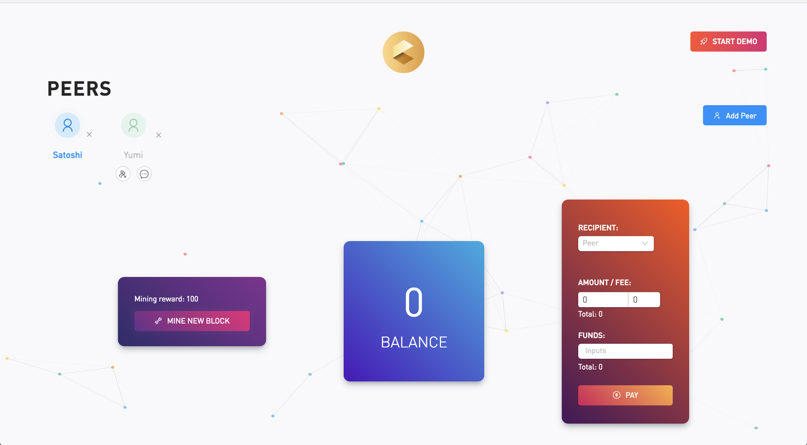
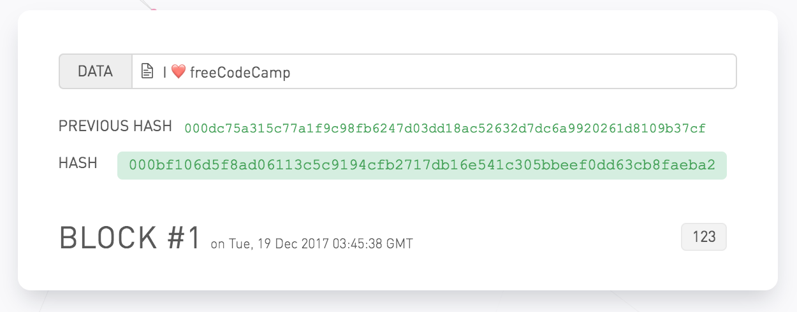
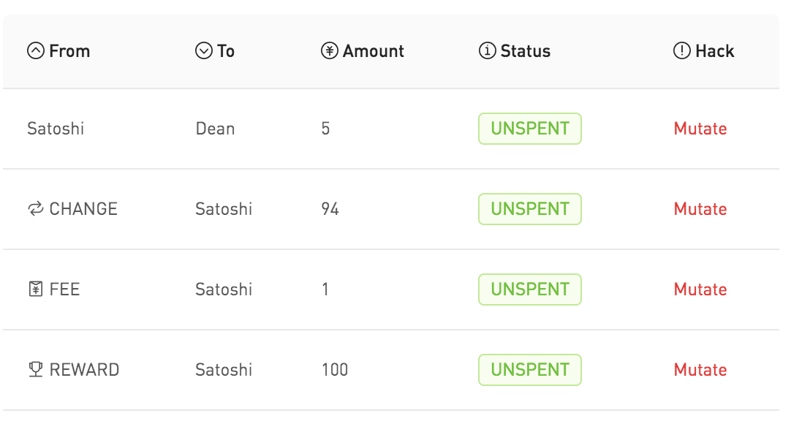

How does bitcoin work? I built an app to show you. – freeCodeCamp

# How does bitcoin work? I built an app to show you.

https://coindemo.io

As Bitcoin rose to unprecedented levels, it caught my attention & curiosity. I wondered, how does bitcoin **really **work?

As I went down the blockchain rabbit hole, I found that many resources rarely go beyond the *“revolutionary”*, *“distributed”* and *“immutable” *dialogue. Many talk about the *what*,*  *but not so much the *why *and *how***.**

I resorted to reading technical papers and source code to uncover this black box. I started sharing what I learned by building [apps](https://www.producthunt.com/@seanhan/submitted) that demonstrated the inner workings of the blockchain.

What I realized was bitcoin was just blockchain + transactions. This article will cover the transactions part of the equation. If you would like a refresher on blockchain, checkout [Blockchain Demo](https://blockchaindemo.io/) or this [article](https://medium.freecodecamp.org/how-does-blockchain-really-work-i-built-an-app-to-show-you-6b70cd4caf7d).

A block on the blockchain has the following parts:

A block on the blockchain — [https://blockchaindemo.io](https://blockchaindemo.io/)

- •**Index **(Block #1)**:** Which block is it?
- •**Hash **(#00001834d29f33…)**:** Is the block valid?
- •**Previous Hash **(#000dc75…)**: **Is the previous block valid?
- •**Timestamp **(Tue, 19 Dec 2017 …)**: **When was the block added?
- •**Data **(I ❤️ freeCodeCamp)**: **What information is stored on the block?
- •**Nonce **(1263)**: **How many iterations did we go through before we found a valid block?

Instead of having **text** (I ❤️ freeCodeCamp) as data, cryptocurrencies have **transactions** as data.

### What is a transaction?

Transactions are a record of payment between two parties. When there is an exchange of value, a transaction is created to record it.

For example, let’s say Satoshi has 100 coins.

He wants to pay Dean 5 coins, with a mining fee of 1 coin. He uses the 100 coins he has to make the transaction. He expects to have 94 coins in change.

When Satoshi mines a new block with the transaction above, he is rewarded with 100 new coins.

The example above will create the following transaction **outputs **(to be explained):

Transaction outputs — [http://coindemo.io](http://coindemo.io/)

Since the initial 100 coins Satoshi had was used as an **input** to create the above transaction, the initial 100 coins is now **spent**. (to be explained)

Spent transaction output — [http://coindemo.io](http://coindemo.io/)
The above concepts will be explained next.

### Three types of transactions:

1. 1**Reward** — Satoshi rewarded with 100 coins for mining new block
2. 2**Regular** — Satoshi paid Dean 5 coins with change of 94 coins

3. 3**Fee** — Mining fee of 1 for whoever mines the transaction (Satoshi in example above)

### Transaction

A transaction consists of four parts:
1. 1Inputs — **Where value is coming from**
2. 2Outputs — **Where value is going to**
3. 3Hash —Uniquely identifies the transaction (using inputs & outputs)
4. 4Type — Reward, Regular, or Fee

### Outputs — Where value is going to

An output has two parts:
1. 1Address — What is the public wallet address to send the coins to?
2. 2Amount — How many coins?

### Inputs — Where value is coming from

An input **has to come from a previous output**. However, an output can only be used as input **once**. When an output is used, it is considered to be **spent**. Outputs that have not been used as input are **unspent**.

An input has five parts:
1. 1Transaction Hash —Transaction hash of the (unspent) output
2. 2Output Index — The index of the (unspent) output in the transaction
3. 3Amount — Amount of the (unspent) output
4. 4Address — Address of the (unspent) output
5. 5Signature — Signed by the Address’s private key

### Reward Transaction

Reward transactions are created as a result of finding a valid block on the blockchain. As a result, reward transactions do not have any inputs because it creates new coins.

**For example:** Satoshi mined a new block with a mining reward of 100. The transaction on the block will look like this:

**Type:** Reward
**Inputs:** None
**Outputs:**

- •*Address:* Satoshi’s public wallet address
- •*Amount:* 100 (reward specified by the cryptocurrency)

**Hash:** 𝑓(inputs + outputs) = 000abcdefg…

### Regular Transaction

Regular transactions are transactions created when one party pays another.

**Continued example:** Satoshi uses the (unspent) **output** from the reward transaction as an **input** to pay Dean 5 coins. He specifies a mining fee of 1 coin.

**Type:** Regular
**Inputs:**

- •*Transaction Hash:* 000abcdefg… (hash of reward transaction above)
- •*Output Index: *0 (first index of output is 0)
- •*Amount: *100 (output amount)
- •*Address: *Satoshi’s public wallet address (output address)
- •*Signature: *Satoshi signs this input with his private key

**Outputs:**
*Output 1*: (index 0)

- •*Address*: Dean’s address
- •*Amount:* 5 coins

*Output 2*: (index 1)

- •*Address:* Satoshi’s address
- •*Amount:* 94 coins= 100 - 5 (payment) - 1 (fee)

1. 1The first output is the **payment** going to Dean.
2. 2The second output is the **change **going back to Satoshi

Because Satoshi’s reward transaction output (from the previous example) has been used as an input for this payment, it is now **spent and cannot be used again**. If it is used again, then there is [double spending](https://en.bitcoin.it/wiki/Irreversible_Transactions).

#### Why doesn’t it add up???

The total input amount is 100.
The total output amount is 5 + 94 = 99.

In the example, Satoshi specified a mining fee of 1 coin. *The difference between inputs and outputs of a regular transaction is the ****mining fee****.*

Inputs must be greater or equal to outputs. *If inputs and outputs are equal, then there is ****no mining fee****.*

### Fee Transaction

*Whoever mines the above regular transaction will add the mining fee transaction.***  **Because there was a deficit of 1 in the regular transaction, the fee amount is 1.

**Continued Example: **Bob mines Satoshi and Dean’s transaction.
Type: Fee
Inputs: None
Outputs:

- •*Address:* Bob’s public wallet address
- •*Amount:* 1 (fee, difference of regular transaction input and output)

Because Bob mined this transaction to the new block, there will be a reward transaction of 100 to Bob.

### On the blockchain:

**1.** Satoshi spends his reward output **2. **Satoshi pays Dean **3.** Bob mines the transaction — [http://coindemo.io](http://coindemo.io/)

### Final Balances:

Satoshi: **94** = 100 (reward) - 5 (payment) - 1 (fee)
Dean: **5** (payment from Satoshi)
Bob: **101** = 100 (reward from mining new block with transaction) + 1 (fee)

**Total currencies in circulation:**  **200** = 94 (Satoshi)+ 5 (Dean)+ 101 (Bob)

Two blocks were mined, and each block has a reward of 100, so there should be 200 coins in circulation.

### **Conclusion**

On a new block, **regular and fee inputs and output totals must equal**. This ensures that only reward transactions generate new coins.

Deficits from regular outputs are offset with fee transaction outputs. Leaving the only output surplus to be reward transactions.

### Try it yourself at [http://coindemo.io](http://coindemo.io/)

