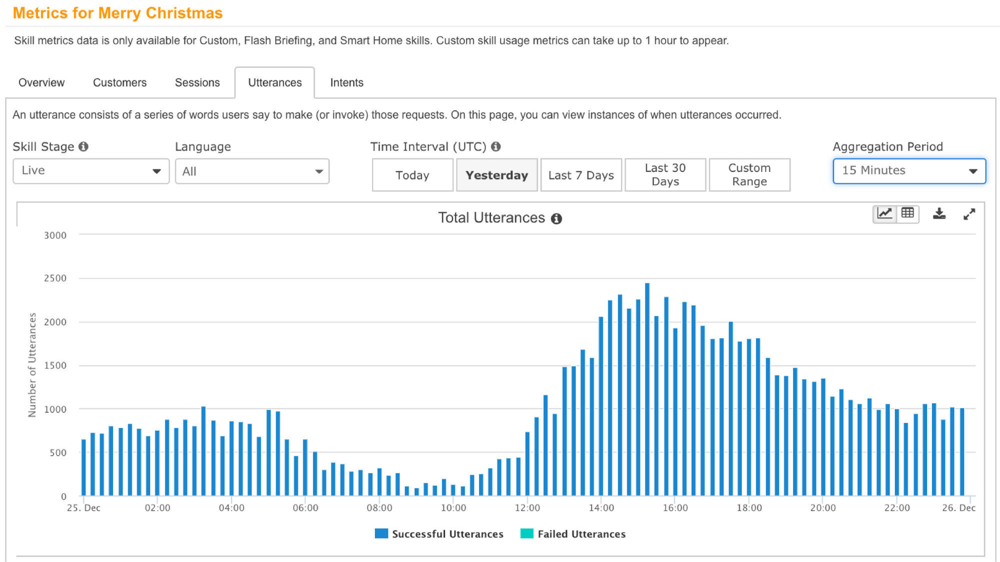
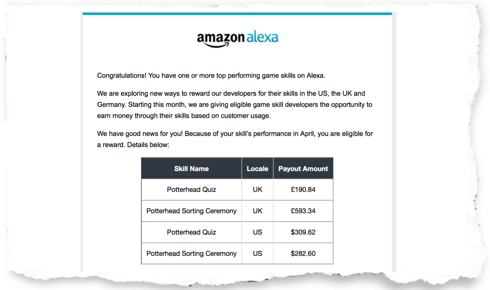
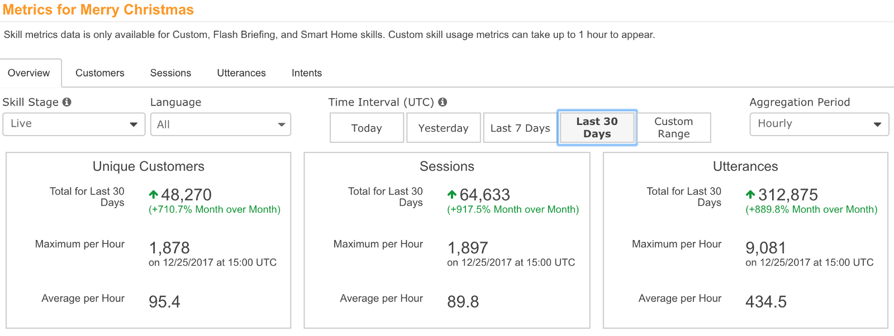
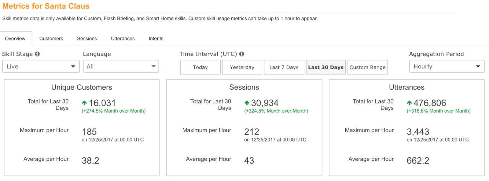
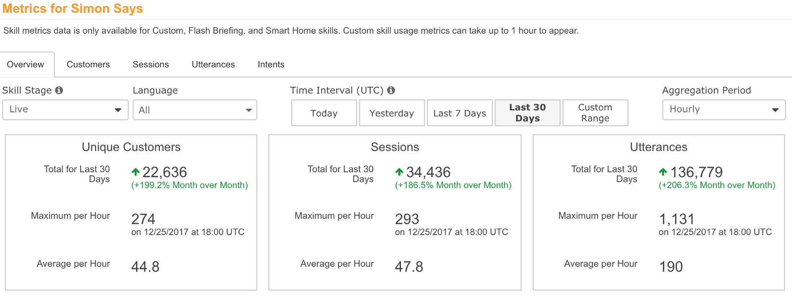
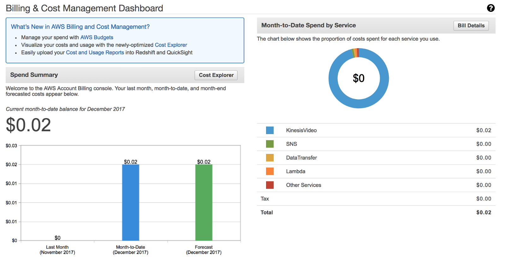

How serverless scales an idea to 100K monthly users — at zero cost

# How serverless scales an idea to 100K monthly users — at zero cost

## Eliminate friction to move closer to the customer experience — and closer to the functional value of technology

Developing an Amazon Alexa skill within an AWS Lambda function is a simple way to demonstrate the power of ‘serverless’.

Within an hour, you can design, develop and deploy an Alexa skill onto the Amazon.com marketplace — with immediate access to millions of consumers.

Over the past couple of years, I’ve developed a bunch of simple Alexa skills to experiment with AWS Lambda and explore the Alexa Skills Kit. Along the way, some of the skills have even generated enough customers to qualify for a monthly payout from Amazon’s incentive program.

The majority of the work involves coding an AWS Lambda function that expresses the business logic — using your choice of popular languages such as Node.js or Python. To get started, the Amazon Alexa team makes it really easy with a variety of [sample templates in their GitHub repositories](https://github.com/alexa/).

With much of the undifferentiated infrastructure heavy-lifting being done by AWS, you can focus attention on the actual product, marketing, and customer acquisition. For an Alexa skill, your results are easily measured by the volume of unique customers and their number of interactions.

#### Amazon Alexa metrics

During the month of December, several of my custom Alexa skills — which are all based on AWS Lambda functions running in a single account — have collectively reached over 100K users in just 30 days.

Below are the 30-day metrics for a few of these skills, including Merry Christmas and Santa Claus — and cloud computing cult favorite [Simon Says](https://www.amazon.com/Drew-Firment-Simon-Says/dp/B01NBLMM84/). The data for each skill is accessible directly in the Alexa developer console.

#### AWS Lambda metrics

So how does a large volume of customers, sessions, and interactions translate to the underlying utilization of AWS Lambda functions?

Over the same 30-day period, the Alexa skills have invoked the related AWS Lambda functions over 1M times.

All the Lambda functions share the same AWS account —and each function is allocated 512MB of memory and configured with a 7 second timeout. If needed, AWS provides a lot [more levers to prepare your Alexa skill for scale](https://developer.amazon.com/blogs/alexa/post/546ab5a1-1d1a-49c2-85a5-92ada3e6e907/best-practices-for-scaling-your-alexa-skill-using-amazon-web-services).

During the 30-day period, not a single function was throttled due to invocation rates exceeding the concurrency limits. The average invocation duration for the functions was 25 milliseconds.

#### The cost of serverless

How much does hosting a dozen Alexa skills that connect to over 100K unique users in 30 days with 1M function invocations cost? *Zero. Zilch. Nada.*

AWS provides developers access to 1M requests and 400,000 GB-seconds of compute time per month — at no cost. With the memory size of my functions set to 512MB, that equates to 800K free tier seconds per month.

Here’s the December invoice for my personal AWS account:

The only cost incurred during the same period was a whopping $0.02 — the high cost of [experimenting with new AWS Kinesis Video Streams service](https://twitter.com/drewfirment/status/939567539734175744).

So what happens if your Alexa skills go viral and exceed 1M requests for the AWS Lambda service? For every 1M requests thereafter, you’ll get a charge of $0.20 to your bill — easily absorbed by the [$100 of promotional credits](https://developer.amazon.com/alexa-skills-kit/alexa-aws-credits) provided to Alexa developers.

The economics of serverless technology also applies to the most heavily used Alexa skills. For example — even with over 50 million Lambda requests serving 175K users *per day,* the [sleep sound](http://invokedapps.com/) apps developed by [Nick Schwab](https://twitter.com/nickschwab) generates a frugal monthly bill under $30.

#### The value of frictionless innovation

Software engineers at leading startups and enterprises are deploying serverless architectures to convert innovative product ideas into consumable value — with minimal friction and negligible cost.

Serverless technologies like AWS Lambda functions are key enablers of frictionless innovation — allowing you to more easily deploy and scale products and services into the hands of a global customer base.

Despite the clear business advantages, there still seems to be a lot of debate and fear-mongering regarding the value of adopting serverless technology. Don’t believe the FUD — fear, uncertainty and doubt.

As the abstraction of platform services matures with serverless, the elimination of utility layers can move you closer to the customer experience — and closer to the functional value of technology.

*Drew is an AWS Community Hero, Alexa Champion, and maker of dad jokes.

Follow on Twitter *[*@drewfirment*](https://twitter.com/drewfirment)*. *[*#WePowerTech*](https://info.acloud.guru/we-power-tech)