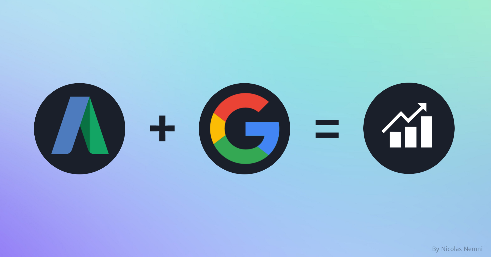
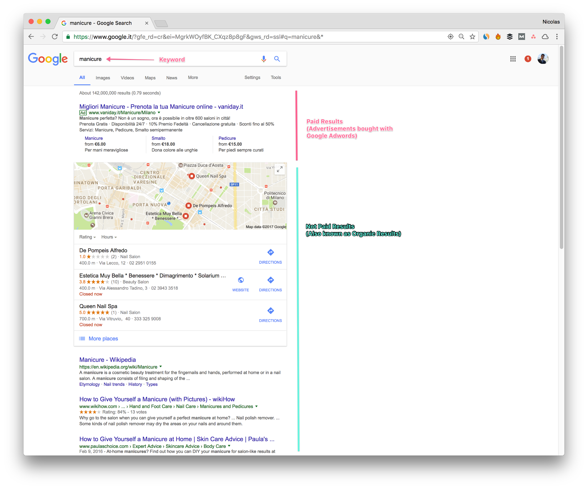

How to Advertise on Google – Nicolas Nemni – Medium

# How to Advertise on Google

### What this guide explains and who is it for

This guide is for those who have never used advertising on Google and aims to clearly explain how Google can increase sales of a company that sells products or services on the Internet or in a physical store.

> If you can not explain it simply, you have not understood well enough.
>  — Albert Einstein

Note for those who already know AdWords: This guide is designed for those unfamiliar with AdWords, so I’m not always using technically correct terms to describe all the concepts. This way of writing in done intentionally to make the guide understandable by anyone. Things are slightly more complicated as explained here.

### What does it mean to advertise on Google?

For a person working with Google for years, the statement “advertising on Google” is not very clear. Google has many advertising products that can be used.

People say That “advertising on Google” intend, in technical jargon a “Search Network only — All features” Campaign. That is to display the ads on the results page -called SERP- when you search for a keyword on Google.

Example SERP with Google ads. [Link to full resolution image](https://cl.ly/3W37270R0f3V).

In the above example, the user used “manicure” as the keyword. In the upper part (highlighted in pink) the ads are placed. The word “Ad” precedes the advertisement results. The area without commercials is called Organic, and it’s below the ads area.

### What is Google Adwords?

**Google Adwords** is the principal tool by which advertisers who want to advertise on advertising channels offered by Google are setting up their campaigns.

It is a pretty complicated tool to use and is easy to make mistakes that result in considerable loss of money. Below you can find a Google Adwords screen.

The main panel of Adwords. [Link to high-resolution image.](https://cl.ly/3a1J0u2N003p)

To be able to advertise on Google you need to know how Google Adwords works. There is a simplified version of Google Adwords called Adwords Express but does not include many of the features available on Google Adwords.

### Advertising Channels purchasable through Google Adwords

This guide focuses on the explanation of advertising campaigns on “Search Network only,” simplifying, the Google results page, also called SERP.

However here is a list (not exhaustive) of the advertising channels that you can buy through Google Adwords:

- •Page of Google results, SERP
- •Page of the search results of Google Partners (other search engines)
- •Youtube
- •Gmail
- •Google Products
- •Millions of websites, through the Google Display Network

### Type of Advertisements purchasable through Google Adwords

This guide focuses on the explanation of the text ads.

However here is a list (not exhaustive) of the kind of advertisements that you can buy through Google Adwords:

**Text Ad:**

Example of an Adwords Text Ad
**Call-Only Ad**:

Example of an Adwords Call-only Ad
**Video Ad**:

Example of an Adwords Video Ad
**Google Shopping Ad**:

Example of an Adwords Google Shopping Ad.

### Google Docs Tutorial

I created a Google Sheet (a kind of Online Excel Spreadsheet) that contains all the essential data required to set your Campaign. As you read this guide, you can fill it out and then transfer all of AdWords later. Link to the sheet:

[**Google Search Campaign Template** *Sheet Guide to Creating an advertising campaign on Google Adwords.*docs.google.com](https://docs.google.com/spreadsheets/d/1NTnLf_KRNzrTtTo6p_B57dE52MiWNZDB8HABD4BHcdE/edit?usp=sharing)[(L)](https://docs.google.com/spreadsheets/d/1NTnLf_KRNzrTtTo6p_B57dE52MiWNZDB8HABD4BHcdE/edit?usp=sharing)

### How to set the Adwords Campaign

Below I will explain how to set the Adwords campaign step by step.

#### Step 0: Structure of an Adwords Campaign

Before you start you need to understand the structure of an Adwords campaign.

Structure of an Adwords Campaign. [Link to full resolution image](https://cl.ly/3s0k3g253y3K).

To set up an Adwords campaign, you must know first of all the components.
Below are the main elements of an Adwords campaign:

- •**Campaign**: Every Adwords account can contain multiple Adwords campaigns. At the campaign level, you can set the type, the Network, the Budget and more.
- •**Ad groups **(or Groups, or Adgroups): they include two interrelated elements: Ads and Keywords.
- •**Keywords**: When the users search on Google these keywords (phrases), Adwords shows the Ads contained in the Ad Group on the search result page. It is important to understand that, in principle, when a user enters one of the keywords, any of the ads in the group can be seen. So basically, all the keywords in the group must be relevant for all the group’s ads.
- •**Ad**: this is how your announcement partially graphically displays on the Google Search result page. I wrote “partially” because in the Ads section you do not set the “Ad Extensions.” That is a different thing that changes the appearance of your Ad.
- •**Ad Extensions**: these are additional elements that can enrich your Ad giving more information to the potential customer. It is VERY IMPORTANT to use all of those applicable to your business. The Extensions increase a lot the clicks on your ads. In the chart above I have included Extensions at Group level, but they can be at the Campaign level. Campaign Level means that the Extension will appear for all ads of all groups.

#### Step 1: Map your services/products → Define Adgroups

The first step is to create a clear list of services or goods that you want to advertise. Having a clear and comprehensive list is important. Whether you have ten products/services, or if you have 10.000.

Use a Google Sheet to do it. The one I have prepared it’s perfect.

Se you have many, Google provides a methodology to create ads in an automated way.

#### Step 2: Write ads → Define Ads for each Adgroup

For each Text Ad you should write the following things (see image):

- •Final Url: where you want to redirect the user when he clicks the Ad.
- •Headline 1: the first part of headline
- •Headline 2: the second part of the headline.
- •Displayed Url: Write an Url that is clear to read and understandable by the user.
- •Description: Write 1 or 2 sentences that are related to the headline.

**Image**: Structure of an AdWords Text Ad. Link to high-resolution image.

The question that comes to mind is: what do I write? The answer is simple: you do not need to know right away what to write. Write at least three Ads for each product/service. Google will test them all automatically and will pick to display only the Ads that get you more results. Obviously, if you already know what value or what message attracts your customers, you will be more advantaged. However, always test different ads to see which is most appreciated by your target.

To write different Ads, tests changes in the following elements, in order of importance:

- •Different Headline 1
- •Different Headline 2
- •Different Descriptions
- •Diverse Final URLs
- •Different Shown URLs

#### Step 3: Choose keywords → Define keywords of each Adgroup

Keywords are the phrases that you write in the Google search bar. For example in the image below, the keyword is “new york.”

Keyword Example

For each ad choose at least three keywords that you would use if you searched on Google that product/service. It will then be Google Adwords to suggest further keywords.

**Important**: the keyword suggestion tool by Google Adwords is a very powerful tool that should be used with caution. Read through each keyword before you add it and ask yourself the following three questions before adding it:

1. 1If the user searches for this keyword and sees any of the ads, might he be interested in buying the product/service displayed in that ad? If yes, go to question 2.

2. 2Is the keyword synonymous of the product? If yes, the go to question 3. If no, you can add the keyword.

3. 3Is it possible that the customer is familiar with the synonymous only and NOT original product/service used in the ads? If no, then you can add keywords. If yes, then you have to duplicate the ad group, substitute the name utilized in the Ads with the synonymous, and treat this Adgroup it as if it were a different product/service. Possibly even the Landing Pages must reflect the synonym and not the product name used before

**Image**: The Keyword suggestion tool by Google Adwords. Link to high-resolution image.

#### Step 4: Ad Extensions → Define Extensions of each Adgroup.

The Ad Extensions expand the information provided by your Ad. It’s important to use all those are relevant to your Ads and business.

I will not explain here how to add each extension, as each extension is different from each other to set up. But I will show how the graphically look.

It is important to note that the extensions can be set at the Campaign Level (i.e., that appear for all ads in the campaign) or at the Group Level (i.e., only appear for ads in that group).

**Sitelinks Extensions**: They are the links that appear below the ad. When and how to use it: if you think the customer can be highly interested in information related to those included in the announcement. Example: the contact page.

Example of Sitelink Extension in Adwords

**Call Extensions**: If you like the user to called you directly, you can enter your phone number directly into the ad. If the ad is displayed on a computer, Adwords shows the number. If the ad is displayed on a mobile phone, Adwords shows a “Call” button.

Example of Call Extension in Adwords

**Price Extensions**: if you want to showcase the prices of your products and services directly into your ad, you can use this extension.

Example of Price Extension in Adwords
Here are other extensions available:

- •Callout
- •Snippet
- •Structured Message
- •Location
- •Affiliate location
- •Review
- •For App

Google continuously creates new types of extensions because it realized that it substantially increases the performance of ad campaigns. And if advertisers are happy, they spend more, and Google earns more.

Set up as many extensions as possible. Do not worry; Google continues to test extensions to see which increase clicks and which are not, automatically hiding those with no increase clicks. However, do not abuse extensions: use them only in the manner for which they were born.

#### Step 5: Optimization

Good news: you have finished setting up your Google campaign.
Bad news: this is just the beginning.

Allocate at least 2 hours per week to improve your campaign. All elements of the campaign will receive statistics on their performance. Keywords, ads, extensions receive a deluge of statistics you can analyze. My personal recommendation: start with the worst statistics. Try to figure out what was wrong, fix it and move on to something “less worse.”

The purpose of this guide is not to teach you how to optimize your Adwords campaign. The truth is that in addition to some fundamental techniques, optimization of an AdWords campaign requires two things:

1. 1Knowing by heart of Adwords
2. 2A depth knowledge of the business you are advertising

The second point is of particular importance. Do not think that an Adwords specialist is enough to work miracles. Example: the expert realizes that the group containing advertisements for the sale of ice cream performs below average. However, the specialist does not know that winter will not sell ice cream. Obviously, this is a “stupid” example, but this is to explain that every business has its peculiarities, and should always be kept in mind.

### Conclusion

I hope to have been clear enough. Google Adwords is my daily bread, so I may have omitted details that a person who has never used AdWords might have considered necessary.

Have a beautiful day,
[Nicolas](https://www.nclx.io/) :)