How to Stop Eating Sugar

# How to Stop Eating Sugar

By David Leonhardt
[Save for Later]()

If you’re like most Americans, you eat more sugar than is good for you. But it’s entirely possible to eat less sugar without sacrificing much — if any — of the pleasures of eating. Surprising as it may sound, many people who have cut back on sugar say they find their new eating habits more pleasurable than their old ones. This guide will walk you through why sugar matters, how you can make smart food choices to reduce sugar consumption, and how you can keep your life sweet, even without so many sweets.

## The Added-Sugar Problem

Here's why you eat more sugar than you realize, and why it's a problem.

The first thing to know: Added sugars, of one kind or another, are almost everywhere in the modern diet. They’re in sandwich bread, chicken stock, pickles, salad dressing, crackers, yogurt and cereal, as well as in the obvious foods and drinks, like soda and desserts.

The biggest problem with added sweeteners is that they make it easy to overeat. They’re tasty and highly caloric but they often don’t make you feel full. Instead, they can trick you into wanting even more food. Because we’re surrounded by added sweeteners — in our kitchens, in restaurants, at schools and offices — most of us will eat too much of them unless we consciously set out to do otherwise.

### How Did We Get Here?

It’s not an accident. The sugar industry has conducted an aggressive, decades-long [*campaign*](https://www.nytimes.com/2017/11/21/well/eat/sugar-industry-long-downplayed-potential-harms-of-sugar.html) to blame the obesity epidemic on [*fats*](https://www.nytimes.com/2016/09/13/well/eat/how-the-sugar-industry-shifted-blame-to-fat.html), not sugars. Fats, after all, seem as if they should cause obesity. Thanks partly to that campaign, sugar consumption soared in the United States even as people were trying to lose weight. But research increasingly indicates that an overabundance of simple carbohydrates, and sugar in particular, is the No. 1 problem in modern diets. Sugar is the driving force behind the diabetes and obesity epidemics. Fortunately, more people are realizing the harms of sugar and cutting back.

### What to Cut

Health experts recommend that you focus on reducing added sweeteners — like granulated sugar, high fructose corn syrup, honey, maple syrup, stevia and molasses. You don’t need to worry so much about the sugars that are a natural part of fruit, vegetables and dairy products. Most people don’t overeat naturally occurring sugars, as Marion Nestle of New York University says. The fiber, vitamins and minerals that surround them fill you up.

A typical adult should not eat more than 50 grams (or about 12 teaspoons) of added sugars per day, and closer to 25 is healthier. The average American would need to reduce added-sweetener consumption by about 40 percent to get down to even the 50-gram threshold. Here’s how you can do it — without spending more money on food than you already do.

### The Gameplan

Changing your diet is hard. If your strategy involves thinking about sugar all the time — whenever you’re shopping or eating — you’ll likely fail. You’ll also be miserable in the process. It’s much more effective to come up with a few simple rules and habits that then become second nature. (One strategy to consider: [*Eliminate all added sugars for one month*](https://www.nytimes.com/2016/12/30/opinion/a-month-without-sugar.html), and then add back only the ones you miss. It’s easier than it sounds.)

Above all, most people’s goal should be to find a few simple, lasting ways to cut back on sugar. Once you’re done reading this guide, we suggest you choose two or three of our ideas and try them for a few weeks.

### More on Life Without Sugar

[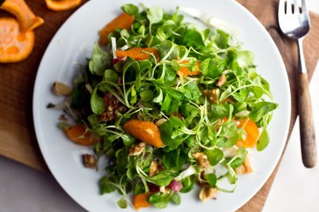   #### Vowing to Eat ‘Smarter’ Carbs for 30 Days   The writer has Type 1 diabetes. The Whole30 diet, with no wheat, dairy or sugar, made her blood sugar levels perfect.](https://www.nytimes.com/2018/01/26/well/eat/whole30-diet-low-carb-carbohydrates-diabetes.html)

[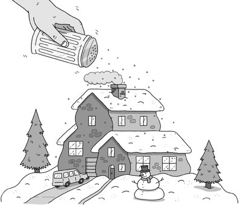   #### Sugar Season. It’s Everywhere, and Addictive.   The sweet craving that once offered a survival advantage now works against us.](https://www.nytimes.com/2014/12/23/opinion/sugar-season-its-everywhere-and-addictive.html)

[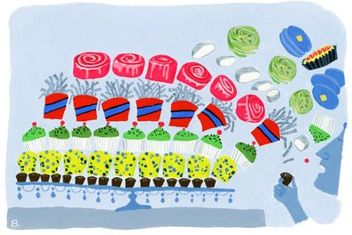   #### Why Cutting Back on Carbs Is So Tough   Eating a little of a tasty dessert doesn’t satisfy me — it creates a fierce craving to eat it all, and then some.](https://www.nytimes.com/2017/07/19/well/eat/are-you-a-carboholic-why-cutting-carbs-is-so-tough.html)

[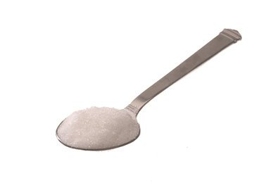   #### Sugar Industry Downplayed Potential Harms   The sugar industry funded research in the 1960s on sugar’s effects on heart health, then buried data suggesting it could be harmful.](https://www.nytimes.com/2017/11/21/well/eat/sugar-industry-long-downplayed-potential-harms-of-sugar.html)

[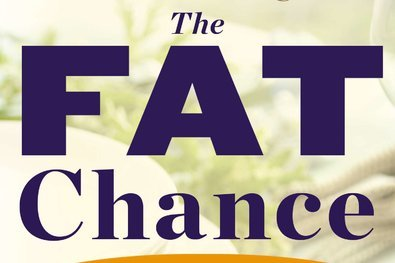   #### Learning to Cut the Sugar   Many know Dr. Robert Lustig as “the anti-sugar guy,” but he’d prefer being known as the “anti-processed food guy.”](https://well.blogs.nytimes.com/2014/02/19/learning-to-cut-the-sugar/)

## First Thing in the Morning

Remember, breakfast shouldn't taste like dessert.
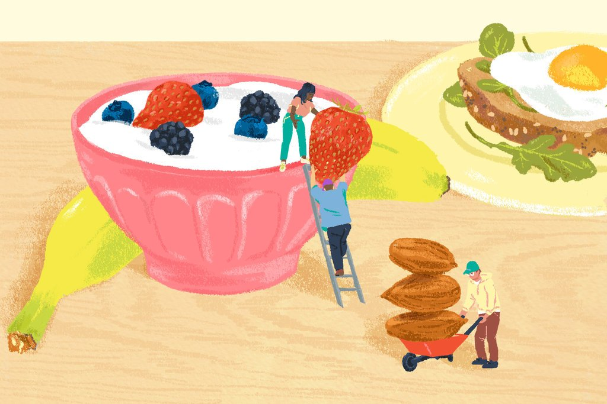

Breakfast is the most dangerous meal of the day for sugar. Many breakfast foods that sound as if they’re healthy are in fact laden with sugar. In Chobani Strawberry Yogurt, for example, the second ingredient — ahead of strawberries! — is evaporated cane sugar. And many brands of granola have more sugar per serving than Froot Loops or Cocoa Puffs. In the United States, as the science writer Gary Taubes says, breakfasts have become “lower-fat versions of dessert.”

There are two main strategies to ensure that breakfast doesn’t become a morning dessert. The first is for people who can’t imagine moving away from a grain-based breakfast, like cereal or toast. If you fall into this category, you have to be quite careful, because processed grains are often packed with sugar.

A few grain-based breakfasts with no or very low sugar:

- **Cheerios. **They’re quite low in sugar.

- **Plain oatmeal. **Flavor it with fresh fruit and, if necessary, a small sprinkling of brown sugar.

- **Bread. **A few breads have no sugar (like Ezekiel 4:9 Whole Grain). A longer list of brands have only one gram, or less, per slice (including Sara Lee Whole Wheat and Nature’s Own Whole Wheat). Authentic Middle Eastern breads, like pita and lavash, are particularly good options and a growing number of supermarkets sell them.

- **Homemade granola.** You can also [*make your own granola*](https://cooking.nytimes.com/68861692-nyt-cooking/477-our-favorite-granolas) and play around with the sugar amounts.

But there is also a more creative alternative. Move away from grain-based breakfasts. If you do that (as I have recently, after decades of eating cereal), avoiding added sugar is easy. My new breakfast routine actually feels more indulgent than my old one. Most days, I eat three or four of the following:

- Scrambled or fried eggs

- Fruit

- Plain yogurt

- A small piece of toast

- A few nuts

- A small portion of well-spiced vegetables, like spinach, carrots and sweet potatoes.

### Veggies for Breakfast?

I realize the part about vegetables may sound weird. Maybe morning veggies aren’t for you. But maybe you’ll be surprised to discover they are, as I was. Remember: In much of the world, including large parts of Asia, breakfast is a savory meal, not a sweet one, just as lunch and dinner are. Vegetables aren’t a weird thing to eat for breakfast in China or India. For more breakfast ideas, check out [*breakfast recipes from Whole30*](https://greatist.com/eat/whole30-breakfast-recipes) (a food program that eliminates much more than just sugar).

**A final tip:** Keep your juice portions small. Real juice doesn’t have added sweeteners. But fruit juice is one source of natural sugars that can be dangerous, because of how efficiently it delivers those sugars. You’re not eating the stomach-filling fiber of an orange when you drink a glass of orange juice. **Keep your juice portions to no more than six ounces, and have only one per day.**

## From the Bottle and Can

Beverages are one of the biggest sources of added sugars in our diets.
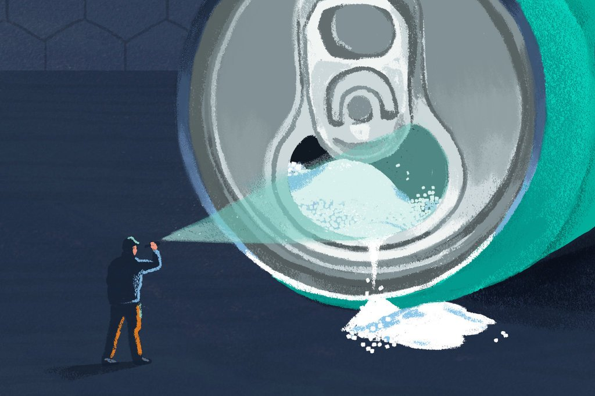

Eliminate soda from your regular diet. Just get rid of it. If you must, drink diet soda. Ideally, though, you should get rid of diet soda, too.

That may sound extreme, but **sweetened beverages are by far the biggest source of added sugar in the American diet —**  [*47 percent*](https://health.gov/dietaryguidelines/2015/resources/2015-2020_Dietary_Guidelines.pdf), according to the federal government. Soda — along with sweetened sports drinks, energy drinks and iced teas — is essentially flavored, liquefied sugar that pumps calories into your body without filling you up. Among all foods and beverages, says Kelly Brownell, an obesity expert and dean of the Sanford School of Public Policy at Duke, “the science is most robust and most convincing on the link between soft drinks and negative health outcomes.”

**Get this: **A single 16-ounce bottle of Coke has 52 grams of sugar. That’s more added sugar than most adults should consume *in an entire day*.

As for diet soda, researchers aren’t yet sure whether they’re damaging or harmless. Some scientists think diet soda is perfectly fine. Others, like the Yale cardiologist Dr. Harlan Krumholz, think it may be damaging. Dr. Krumholz recently announced that after years of pounding diet sodas, he was giving them up. There is reason to believe, [*he wrote*](https://blogs.wsj.com/experts/2017/09/14/why-one-cardiologist-has-drunk-his-last-diet-soda/), that the artificial sweeteners they contain lead to “weight gain and metabolic abnormalities.”

### The Soda Alternative

Many people who think they’re addicted to soda are attracted to either the caffeine or the carbonation in the drink. You can get caffeine from coffee and tea (lightly sweetened or unsweetened), and you can get carbonation from seltzer, flavored or otherwise.

For many people, the shift to seltzer, club soda or sparkling water is life changing. It turns hydration into a small treat that’s still calorie-free. Buy yourself a seltzer maker, as I have, and gorge on the stuff at home, while saving money. Or buy fizzy water in cans or bottles. Sales of carbonated water have more than doubled since 2010, with the brand LaCroix now offering more than 20 different flavors, all without added sugar.

If they’re not sweet enough for you, you can also add a dash of juice to plain seltzer. But many people find that they lose their taste for soda after giving it up. And many Americans are giving it up: Since the late 1990s, sales of full-calorie soda have fallen more than 25 percent.

### More on Cutting Back on Soda

[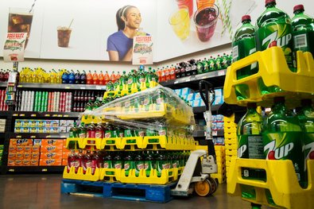   #### Americans Are Putting Down the Soda Pop   Children and adults are downing sugary drinks far less often than they used to, a new study finds.](https://www.nytimes.com/2017/11/14/health/soda-pop-sugary-drinks.html)

[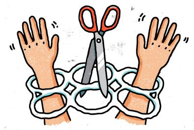   #### How to Win Against Big Soda   Taxing sugary drinks requires public education and grass-roots organizing.](https://www.nytimes.com/2017/10/15/opinion/soda-tax-chicago-sugar.html)

[   #### She Took On Colombia’s Soda Industry. She Was Silenced.   The debate over taxing sugary drinks has turned into a ferocious global policy brawl.](https://www.nytimes.com/2017/11/13/health/colombia-soda-tax-obesity.html)

[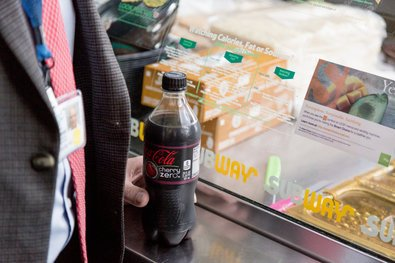   #### Putting Sugary Soda Out of Reach   Workplaces are banning the sale of soft drinks as part of a growing effort to curb their consumption around the country.](https://www.nytimes.com/2016/11/08/well/eat/putting-sugary-soda-out-of-reach.html)

Advertisement

## The Smarter Living Newsletter

A weekly roundup of the best advice from The Times on living a better, smarter, more fulfilling life.

Your email address

## Check Your Pantry

Check the labels of your pantry staples for some easy places to cut the sugar.
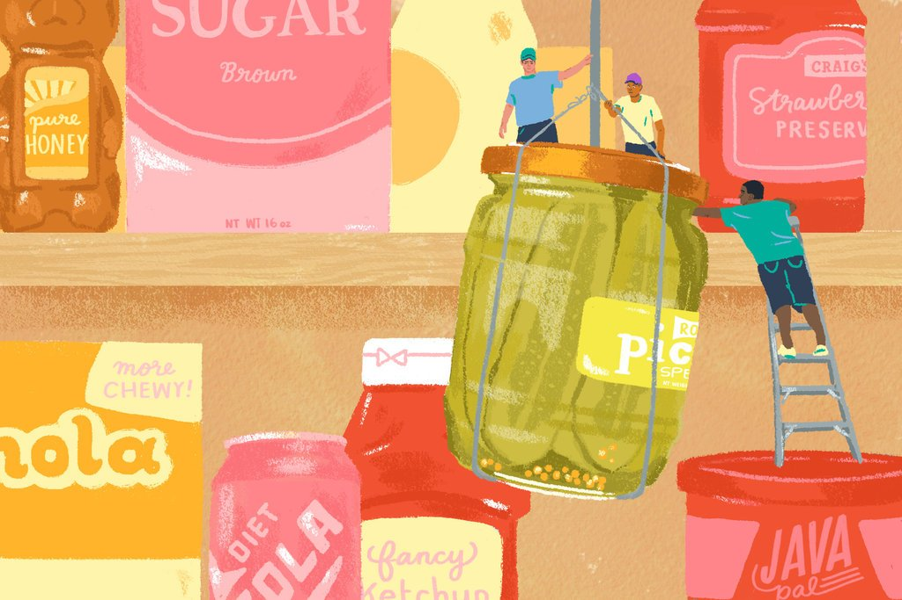

Food makers sneak sugar into more foods than you may realize. It’s in many brands of chicken stock, soup, salami, smoked salmon, tortillas and crackers. And most of these foods do not need sweeteners to taste good.

If you take a little time to look at labels — at the grocery store or online — you can quickly learn which staples have sugar and which don’t. Here’s a sampling of some quick switches you could make:

**Tip:** If you live near a Trader Joe’s, it provides a lot of good, affordable options. Many of its staples have little or no added sweeteners, including some of its house brand sandwich breads, tortillas and bacon.

**Try it:** When you go to the supermarket, compare various brands, and choose one with little added sugar. Do this once, and then it’s easy to make the no-sugar items your default. You no longer have to spend energy thinking about it.

Start with a product’s Nutrition Facts table. Some products now include a helpful line listing the amount of “added sugars,” in addition to the standard “sugars” line (which includes naturally occurring sugars). The Trump administration [*has made the “added sugars” line voluntary*](https://www.washingtonpost.com/news/wonk/wp/2017/06/13/trumps-fda-just-took-another-swipe-at-michelle-obamas-food-legacy/?utm_term=.9b424eecef9d), however, so you may also need to look at the full ingredient list next to the Nutrition Facts table, to figure out whether a food has an added sweetener. Here’s [*a helpful list*](https://www.nytimes.com/2016/05/22/upshot/it-isnt-easy-to-figure-out-which-foods-contain-sugar.html) of the many sweetener names.

### Snacks

Snacks can all too easily turn into yet another dessert. Many granola bars and power bars are packed with added sugars. The same goes for canned and dried fruits. And don’t kid yourself about those flavored Starbucks drinks: They’re more like a milkshake than a cup of coffee.

What are better alternatives for snacking? Have some nuts, [*as Barack Obama famously does*](https://www.nytimes.com/2016/07/29/us/politics/obama-sets-the-record-straight-on-his-7-almond-habit.html). Or popcorn. Or fresh fruit. Or canned fruit that doesn’t come soaked in thick syrup.

Several companies have also realized that more people are trying to reduce their sugar intake and have begun offering snack bars without added sweeteners. These options include Larabars and Rxbars.

Advertisement

## The Sauce Risk

What's hiding in your ketchup? Sugar, most likely.

Other than breakfast, sauces and toppings are the biggest stealth sugar risk.

Two of the four biggest ingredients in Heinz Ketchup are sweeteners. The biggest ingredient in many barbecue sauces is high fructose corn syrup. Many pickles — especially those labelled “bread and butter” — are heavily sweetened. Not only does Ragu pasta sauce have added sugar but so does Newman’s Own Marinara. Even Grey Poupon Dijon Mustard has some added sugar.

It is easy enough to use sauces without sugar in most cases. These products are good examples of sauces that forgo the sugar:

- Maille dijon mustard

- Gulden’s spicy brown

- French’s Yellow Mustard

- Prego’s Marinara

- Victoria pasta sauces

- Vlasic Kosher Dill Pickles

- Newman’s Own Classic Oil and Vinegar salad dressing

As for barbecue sauce: You’re probably won’t find a good one without sugar. And as a Texan by marriage, I’m not going to suggest you give up barbecue. But no one said that you have to eliminate all sugar from your diet. Cut back on it elsewhere, and you can enjoy your brisket, ribs or pulled pork, slathered in a delicious sauce, without feeling guilty.

### Make Your Own

Want to control what’s in your sauces? Make them yourself. You can quickly and cheaply make your own salad dressing with some combination of olive oil, an acid (like vinegar, lemon or lime), herbs, garlic and shallots. [*Here’s a great, and extremely simple, recipe*](https://cooking.nytimes.com/recipes/1013113-basic-sunday-salad-dressing) from my friend Sam Sifton.

While you’re at it, try making your own [*homemade marinara sauce*](https://cooking.nytimes.com/recipes/1015987-classic-marinara-sauce), and impress your friends with [*ketchup*](https://cooking.nytimes.com/recipes/9369-ketchup) cooked on your own stove.

Advertisement

## Don’t Ruin it All at the End of a Meal

Dessert doesn't have to be any less sweet if you are cutting back on sugar.
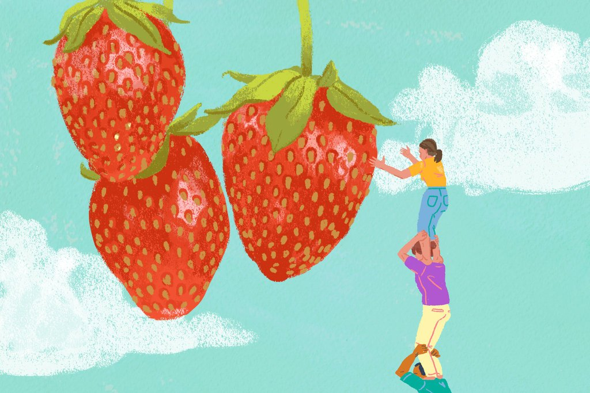

Eating dessert is one of the great little joys of life, and we’re not going to tell you that you can’t have dessert. Have dessert! Just keep three rules in mind:

**1. Portion size. **Many standard American desserts have become grotesquely large. At Applebee’s, the country’s largest casual dining chain, a single piece of cheesecake has 1,000 calories (which is half the calories a typical adult should eat in an entire day) and a whopping 21 teaspoons of sugar. Imagine pouring 21 teaspoons of sugar into your mouth after a meal. At Starbucks, a piece of chocolate marble loaf has 490 calories and is also packed with 43 grams of sugar.

The desserts of yesteryear were not nearly so monstrous. Even if you’re not a fan of Oreos, which have been around since 1912, they’re illustrative. A single Oreo cookie — the regular kind, not “double stuff” or “mega stuff” — has only one teaspoon of sugar. You should think of two or three Oreos, or a different dessert of similar size, as a normal dessert. Anything larger is a big splurge, the sort of indulgence to reserve for special occasions.

**2. Habits. **I’ve gone through periods when I ate a bowl of ice cream every night. It’s not a great idea.

If you want to keep your sugar consumption under control, you can help yourself by getting out of the habit of having a full artificially sweetened dessert every night. There are other end-of-day rituals that can help you fill the void, like a cup of tea or...

3. **Fruit. **Fruit is really a miracle food. It’s sweet, delicious and full of nutrients and fiber. Yes, it’s possible to eat so much fruit that you end up getting too much sugar in your diet. But very few people have this problem. For people who want a sweet every day, fruit is the way to go.

Some tips on picking great fruits?

- Eat it fresh. (Here’s a [*guide to seasonality.*](https://cuesa.org/eat-seasonally/charts/fruit))

- Experiment with new fruits (like pomelos and papaya).

- Eat it dried (again, Trader Joe’s excels here).

- Eat it jarred or canned in the winter. (Just avoid all the fruit that comes with extra sweeteners.)

The beauty of fruit helps to underscore the overriding point about sugar. It’s normal to have some sugar in your diet. The problem is all of the processed sugar that has snuck into the modern diet. It’s so prevalent that you need a strategy for avoiding it. Once you come up with a strategy, eating a healthy amount of sugar isn’t nearly as hard as it sometimes seems.

## About the Author

David Leonhardt, a Pulitzer Prize-winning Op-Ed columnist for The Times, eats more sweets than he should but fewer than he once did.

Illustrations by Meryl Rowin