How to deploy a webapp to Google Cloud Run with Cloud Build - DEV Community 👩‍💻👨‍💻

#  How to deploy a webapp to Google Cloud Run with Cloud Build

###     [  Carlos Azaustre](https://dev.to/carlosazaustre)        Jul 11 '19  ・7 min read

 [#googlecloud](https://dev.to/t/googlecloud)  [#javascript](https://dev.to/t/javascript)  [#node](https://dev.to/t/node)  [#serverless](https://dev.to/t/serverless)

This article was originally published in [spanish on my blog](https://carlosazaustre.es/google-cloud-run/).

In the past Cloud Next event, Google announced a new product of its services: [Cloud Run](https://cloud.google.com/run/). This is an evolution of App Engine which let us run any backend language on a Docker container.

In this article, I will describe how to start with this service and run your first Node.js app with it. Let's go!

##   [(L)](https://dev.to/carlosazaustre/how-to-deploy-a-webapp-to-google-cloud-run-with-cloud-build-4eel#create-a-project-on-google-cloud) Create a project on Google Cloud.

Go to [Google Cloud Console](https://console.cloud.google.com/) and create a new project. I'm named `hello-cloud-run` but you can name it as you want. Keep in mind the `ProjectID` which we are using later.

[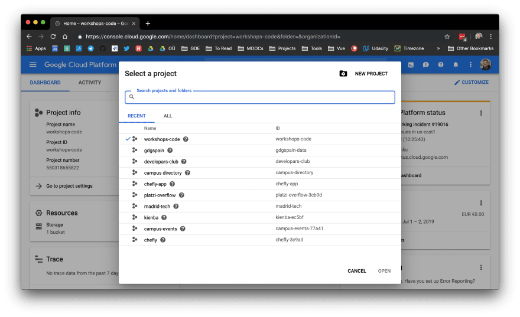](https://res.cloudinary.com/practicaldev/image/fetch/s--crojx7ft--/c_limit%2Cf_auto%2Cfl_progressive%2Cq_auto%2Cw_880/https://carlosazaustre.es/content/images/2019/07/Screenshot-2019-07-02-at-21.02.43.png)

[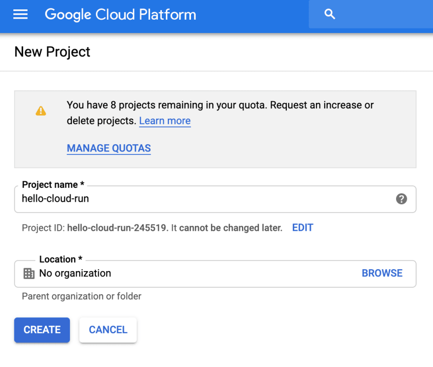](https://res.cloudinary.com/practicaldev/image/fetch/s--v_iXxy-W--/c_limit%2Cf_auto%2Cfl_progressive%2Cq_auto%2Cw_880/https://carlosazaustre.es/content/images/2019/07/Screenshot-2019-07-02-at-21.03.12.png)

[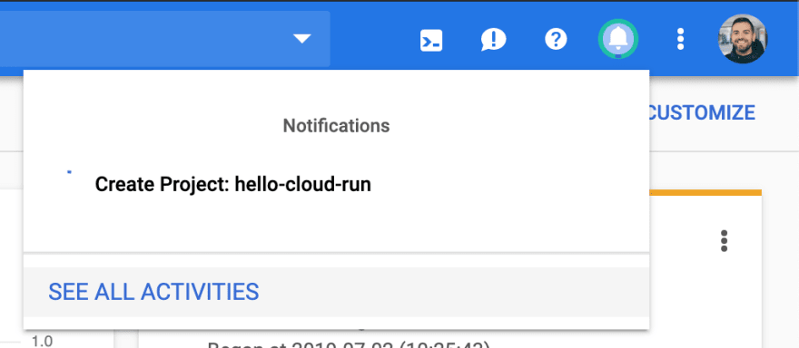](https://res.cloudinary.com/practicaldev/image/fetch/s--kJsOuNUp--/c_limit%2Cf_auto%2Cfl_progressive%2Cq_auto%2Cw_880/https://carlosazaustre.es/content/images/2019/07/Screenshot-2019-07-02-at-21.03.25.png)

[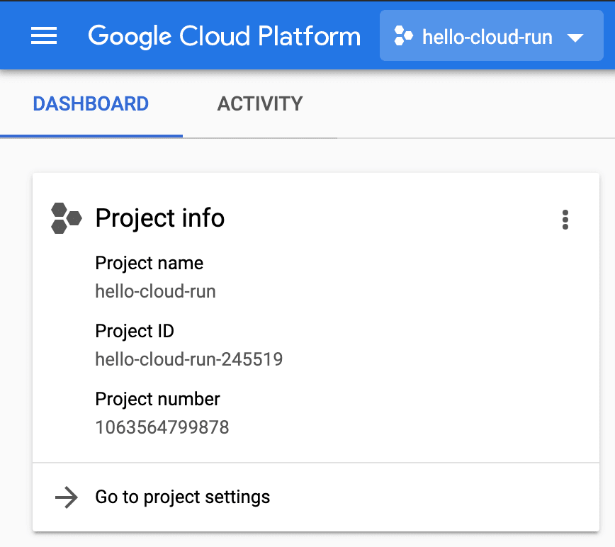](https://res.cloudinary.com/practicaldev/image/fetch/s--T3p9BoRL--/c_limit%2Cf_auto%2Cfl_progressive%2Cq_auto%2Cw_880/https://carlosazaustre.es/content/images/2019/07/Screenshot-2019-07-02-at-21.03.51.png)

> To be able to use Google Cloud Platform you will need a Gmail/GSuite account, and to activate the billing. If it is the first time you sign up, you have > [> $300 free in credits](https://console.developers.google.com/billing/freetrial?hl=en)>  to use for one year.

##   [(L)](https://dev.to/carlosazaustre/how-to-deploy-a-webapp-to-google-cloud-run-with-cloud-build-4eel#api-activation) API Activation

We need to activate some APIs to have not problems. One is the Cloud Run API and another one is Cloud Build API which we will use later.

[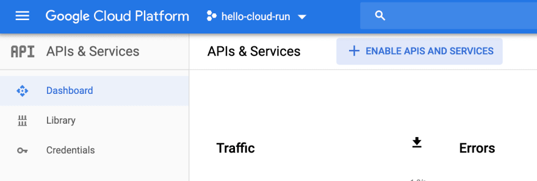](https://res.cloudinary.com/practicaldev/image/fetch/s--3SZ4XbbN--/c_limit%2Cf_auto%2Cfl_progressive%2Cq_auto%2Cw_880/https://carlosazaustre.es/content/images/2019/07/Screenshot-2019-07-02-at-21.05.19.png)

Click on Enable APIs and Services and look for Cloud Run

Activate the Cloud Run API and do the same with Cloud Build API

[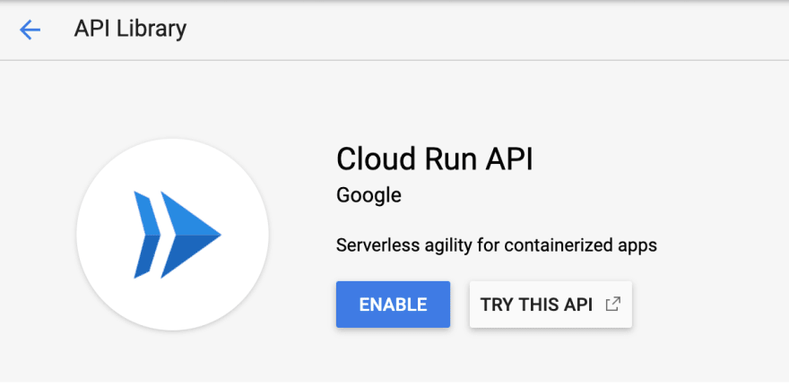](https://res.cloudinary.com/practicaldev/image/fetch/s--I_NcM1Sc--/c_limit%2Cf_auto%2Cfl_progressive%2Cq_auto%2Cw_880/https://carlosazaustre.es/content/images/2019/07/Screenshot-2019-07-02-at-21.05.58.png)

[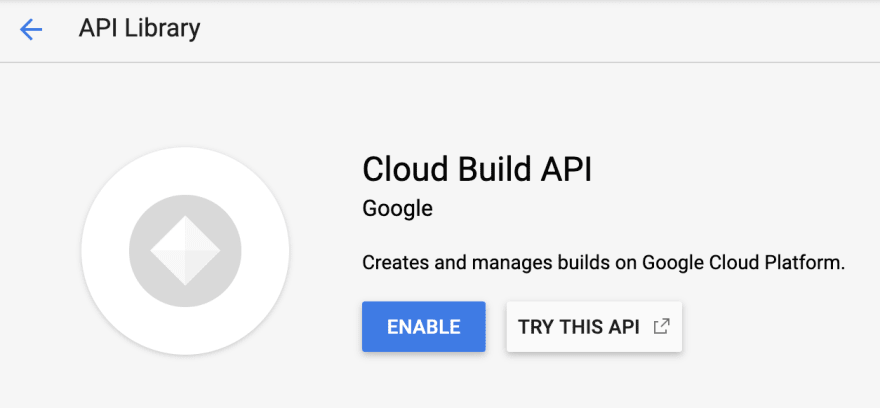](https://res.cloudinary.com/practicaldev/image/fetch/s---4-vk94X--/c_limit%2Cf_auto%2Cfl_progressive%2Cq_auto%2Cw_880/https://carlosazaustre.es/content/images/2019/07/Screenshot-2019-07-02-at-21.34.05.png)

##   [(L)](https://dev.to/carlosazaustre/how-to-deploy-a-webapp-to-google-cloud-run-with-cloud-build-4eel#our-app-code) Our App code

I have created this example code. It is a Node.js application that in the root path returns a JSON object with two properties: The today date and the time that the application is running up.

Create a Node project with the following command (remember to have Node.js installed):

	$ npm init -y

Then, install `express` as dependence:

	$ npm i express

Create an `index.js` file with the following content:

	const express = require('express');
	const app = express();
	const port = process.env.PORT || 3000;

	const dateStart = Date.now();

	app.get('/', (req, res) => {
	  const today = new Date();

	  res.json({
	    date: today,
	    up: `${(Date.now() - dateStart) / 1000} seg.`
	  });
	});

	app.listen(port, () => {
	  console.log(`Server running on port: ${port}`);
	  console.log('Press CTRL + C to quit');
	})

Let's update the `package.json` file to add the `start` script:

	...
	"scripts": {
	   "start": "NODE_ENV=production node index.js"
	  },
	...

On this way, when we execute `npm start` command the app will run. We can testing locally.

Next step is to create the `Dockerfile` with this we define the container which contains the application code. Here you have the content:

	FROM node:10

	WORKDIR /usr/src/app

	ENV PORT 8080
	ENV HOST 0.0.0.0

	COPY package*.json ./

	RUN npm install --only=production

	# Copy the local code to the container
	COPY . .

	# Start the service
	CMD npm start

With this file we are configuring an environment with `Node v10` as a base, the working directory will be `/usr/src/app`. We are defining as environment variables the `PORT: 8080`and `HOST: 0.0.0.0`. We are copying the `package.json` and `package-lock.json` to the working directory and installing the dependencies with `RUN npm install --only=production`.

Finally, we are moving the app code to the container working directory with `COPY . .` And with the last one `CMD npm start` the app is run.

We can try if everything is ok so far, generating the image and the start the docker container. Write the following commands on your terminal:

	$ docker build --tag hello-cloud-run:01 .
	$ docker run -p 8080:8080 hello-cloud-run:01

> Keep in mind you need to have Docker installed on your system.

The `build` command you have created an image following the `Dockerfile` steps with the name `hello-cloud-run:01`. The `run` command let you run the app on `http://localhost:8080`

If all is ok you should see the following on your browser:

[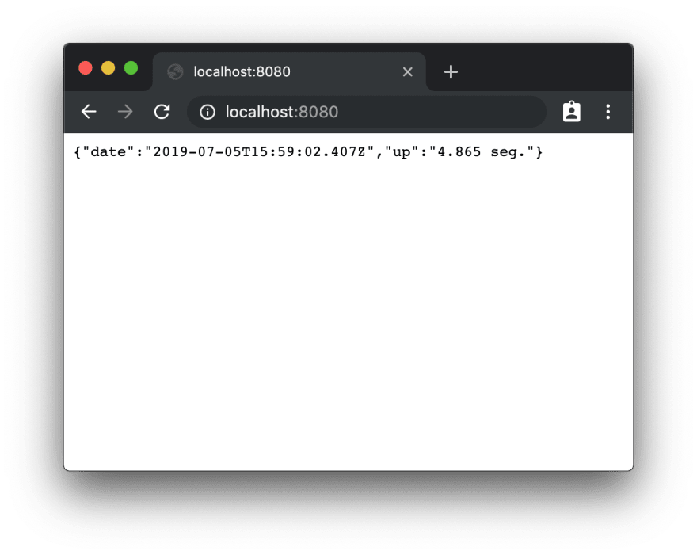](https://res.cloudinary.com/practicaldev/image/fetch/s--r2z7iBIq--/c_limit%2Cf_auto%2Cfl_progressive%2Cq_auto%2Cw_880/https://carlosazaustre.es/content/images/2019/07/Screenshot-2019-07-05-at-17.59.45.png)

##   [(L)](https://dev.to/carlosazaustre/how-to-deploy-a-webapp-to-google-cloud-run-with-cloud-build-4eel#automate-the-container-deploying) Automate the container deploying

Once our project is configurated on Google Cloud and the application code is written and containerized, the following step is to upload it to Google Container Registry.

We are going to create a YAML file with the steps to build and deploy the code using Google Cloud Build. This service is similar to TravisCI but customized to Google Cloud.

On this way, every time we push our code to Github (for example) Cloud Build will build the Docker image and upload the new code to Cloud Container Registry and deploy it into Cloud Run. So awesome!

First, we need to create a trigger on Cloud Build:

[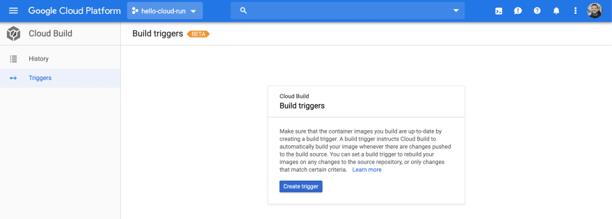](https://res.cloudinary.com/practicaldev/image/fetch/s--SFZb1kU_--/c_limit%2Cf_auto%2Cfl_progressive%2Cq_auto%2Cw_880/https://carlosazaustre.es/content/images/2019/07/Screenshot-2019-07-02-at-22.57.51.png)

Once created, we choose Github as source repository option

[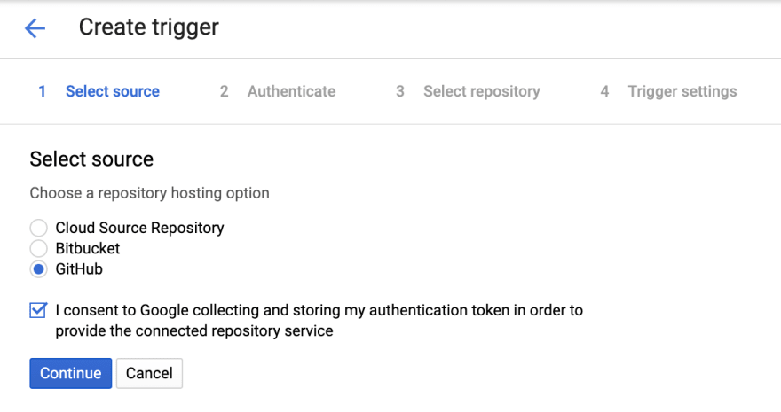](https://res.cloudinary.com/practicaldev/image/fetch/s--MaXCXcer--/c_limit%2Cf_auto%2Cfl_progressive%2Cq_auto%2Cw_880/https://carlosazaustre.es/content/images/2019/07/Screenshot-2019-07-02-at-22.58.02.png)

We need to authenticate on the service chosen (in this case Github) and to choose the repository.

> You need to store the application code on it. If you prefer other option like Bitbucket or Cloud Source, go ahead.

> You can use > [> this repository](https://dev.to/carlosazaustre/creating%20a%20fork%20on%20your%20account)>  as the base project.

[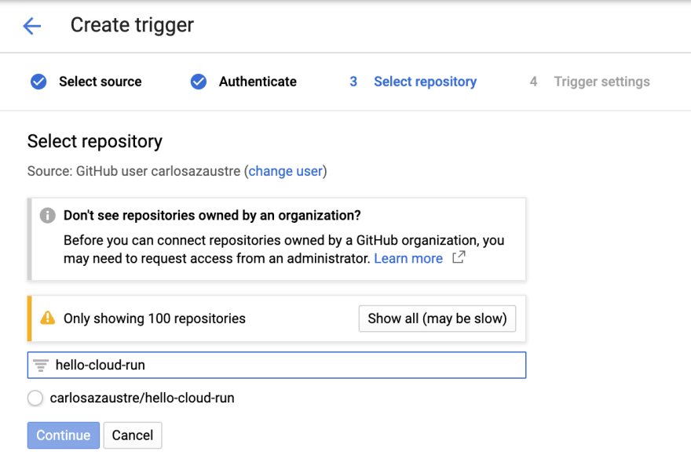](https://res.cloudinary.com/practicaldev/image/fetch/s--sAjwqQZc--/c_limit%2Cf_auto%2Cfl_progressive%2Cq_auto%2Cw_880/https://carlosazaustre.es/content/images/2019/07/Screenshot-2019-07-02-at-22.58.40.png)

On settings, to choose Cloud Build Configuration file (yaml or json) as Build configuration, putting the name `cloudbuild.yaml` which we write later.

[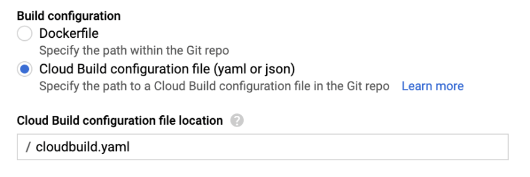](https://res.cloudinary.com/practicaldev/image/fetch/s--vwBxW-3n--/c_limit%2Cf_auto%2Cfl_progressive%2Cq_auto%2Cw_880/https://carlosazaustre.es/content/images/2019/07/Screenshot-2019-07-02-at-23.30.39.png)

All right! On the options, you can choose if you want to dispatch the trigger every time you push to a specific branch repo or with a tag.

##   [(L)](https://dev.to/carlosazaustre/how-to-deploy-a-webapp-to-google-cloud-run-with-cloud-build-4eel#add-roles-and-permissions) Add roles and permissions

Once you have activated the [Cloud Run API](https://console.cloud.google.com/apis/library/run.googleapis.com?_ga=2.191926124.-772456817.1555320972) we need to follow the next steps to bring access from outside to our application.

1. Grant *Cloud Run Admin* role to Cloud Build Service account

    1. From Cloud Console, access to [IAM Menu](https://console.cloud.google.com/iam-admin/iam/project?_ga=2.217088720.-772456817.1555320972)

    2. On the members' list, locate and select `[PROJECT_NUMBER]@cloudbuild.gserviceaccount.com`

    3. Click on *EDIT* button (pencil icon) to approve the new role.
    4. Click on *Add another role*
    5. Select *Cloud Run* and then *Cloud Run Admin*
    6. Click on *Save*

2. Grant *IAM Service Account User* to Cloud Build Service Account from [Cloud Run Runtime service account](https://cloud.google.com/run/docs/securing/service-identity#runtime_service_account)

    1. From Google Cloud Console, access to [Service Accounts](https://cloud.google.com/run/docs/securing/service-identity#runtime_service_account)

    2. On the members' list, locate and select `[PROJECT_NUMBER]-compute@developer.gserviceaccount.com`

    3. Click on *Show Info Panel* up on the right corner.
    4. On *Permissions* panel, click on *Add Member* button.

    5. Introduce the Cloud Build service account `[PROJECT_NUMBER]@cloudbuild.gserviceaccount.com` in the *New Member* new field.

    6. On the *Role* dropdown, select *Service Accounts* and then *Service Account User*.

    7. Click on *Save*.

Now in our code, we are going to create the `cloudbuild.yaml` file which executes the necessary commands to build the docker image, upload it to container registry and deploy it to Cloud Run:

	steps:
	  # build the container image

	- name: 'gcr.io/cloud-builders/docker'

	  args: ['build', '-t', 'gcr.io/$PROJECT_ID/hello-cloud-run:${SHORT_SHA}', '.']
	  # push the container image to Container Registry

	- name: 'gcr.io/cloud-builders/docker'

	  args: ['push', 'gcr.io/$PROJECT_ID/hello-cloud-run']
	  # deploy container image to Cloud Run

	- name: 'gcr.io/cloud-builders/gcloud'

	  args: ['beta', 'run', 'deploy', 'hello-cloud-run', '--image', 'gcr.io/$PROJECT_ID/hello-cloud-run:${SHORT_SHA}', '--region', 'us-central1', '--allow-unauthenticated']
	  env:

	  - 'PORT=8080'

	images:

	- gcr.io/$PROJECT_ID/hello-cloud-run

Keep in mind that `<PROJECT_ID>` is your project identifier.

##   [(L)](https://dev.to/carlosazaustre/how-to-deploy-a-webapp-to-google-cloud-run-with-cloud-build-4eel#checking-all-is-working) Checking all is working

So now, we will deploy our application code to a repository, in my case I chose Github. (this is my [repo](https://github.com/carlosazaustre/hello-cloud-run) for this example). When we made a change and we will push it to `master` branch, the build configuration will trigger and it will follow all the steps to upload it to Container Registry and then deploy it to Cloud Run!

When you made `push` to your repo, check inside Google Cloud Console if Cloud Build has triggered an event

[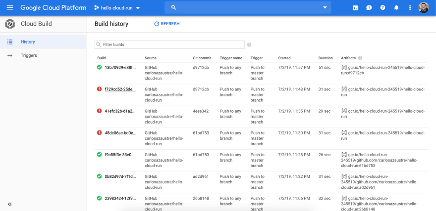](https://res.cloudinary.com/practicaldev/image/fetch/s--1dL1KGUA--/c_limit%2Cf_auto%2Cfl_progressive%2Cq_auto%2Cw_880/https://carlosazaustre.es/content/images/2019/07/Screenshot-2019-07-05-at-18.17.00.png)

If it is Ok, you can go to Container Registry section and check if the Docker image has been created:

And the last, check if in Cloud Run section you have an application running:

[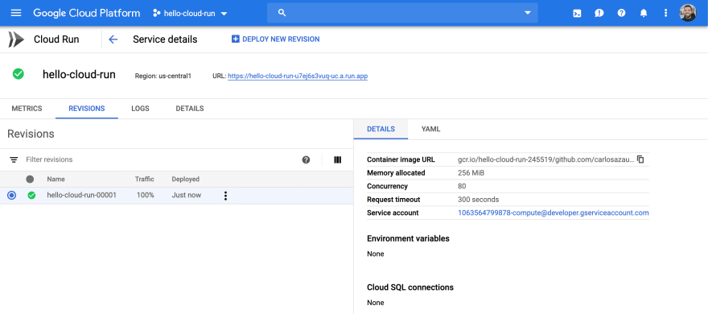](https://res.cloudinary.com/practicaldev/image/fetch/s--VXAIMwzI--/c_limit%2Cf_auto%2Cfl_progressive%2Cq_auto%2Cw_880/https://carlosazaustre.es/content/images/2019/07/Screenshot-2019-07-02-at-23.18.36.png)

One last thing is to let external invocations to the service because for default is private.

Add `allUsers` to the new members and the `Cloud Run > Cloud Run Invoker` role.

[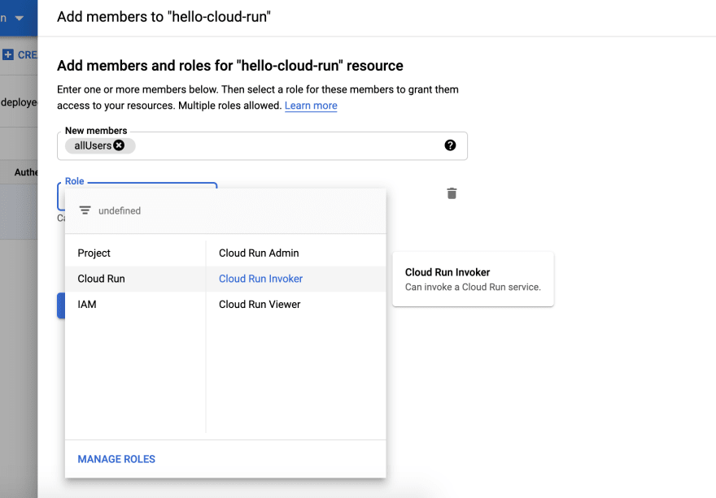](https://res.cloudinary.com/practicaldev/image/fetch/s--p5M_EGER--/c_limit%2Cf_auto%2Cfl_progressive%2Cq_auto%2Cw_880/https://carlosazaustre.es/content/images/2019/07/Screenshot-2019-07-05-at-18.45.44.png)

You can see a more detail explanation on [this post in Dev.to](https://dev.to/googlecloud/help-i-forgot-to-click-allow-unauthenticated-invocations-on-google-cloud-run-2hoj)

And yes! You finish! Click on the URL associated to your Cloud Run deployment and if all is OK you can see something similar to this on your browser

[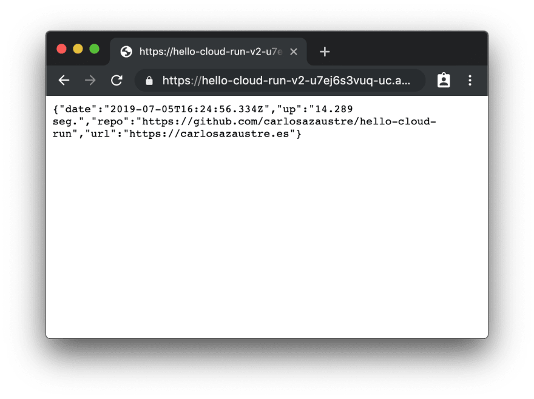](https://res.cloudinary.com/practicaldev/image/fetch/s--_uYsnAPF--/c_limit%2Cf_auto%2Cfl_progressive%2Cq_auto%2Cw_880/https://carlosazaustre.es/content/images/2019/07/Screenshot-2019-07-05-at-18.25.03.png)

##   [(L)](https://dev.to/carlosazaustre/how-to-deploy-a-webapp-to-google-cloud-run-with-cloud-build-4eel#references) References

- [Cloud Run Docs](https://cloud.google.com/run/docs/)
- [Cloud Build Docs](https://cloud.google.com/cloud-build/docs/configuring-builds/build-test-deploy-artifacts)

 
 **Sore eyes?**

 **[dev.to](https://dev.to/enter)** now has dark mode.

Go to the "misc" section of **[your settings](https://dev.to/enter)** and select **night theme** ❤️