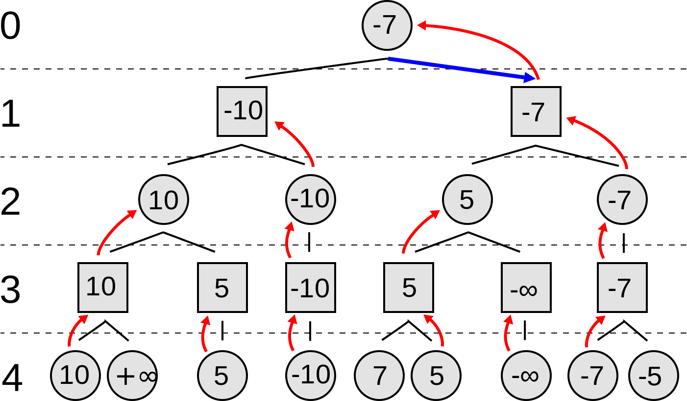
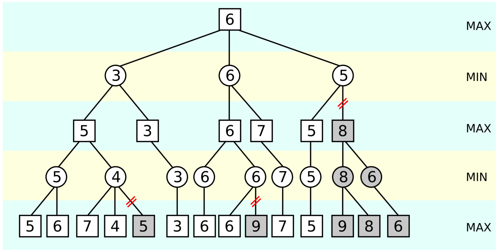
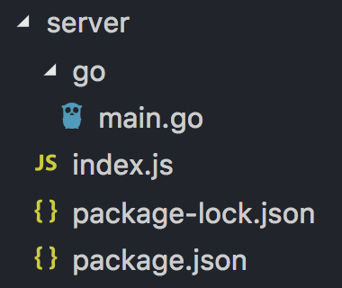
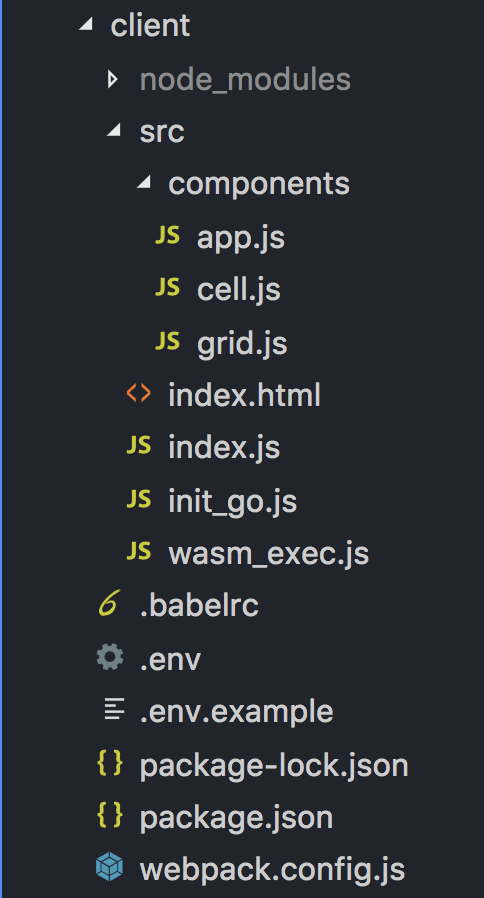
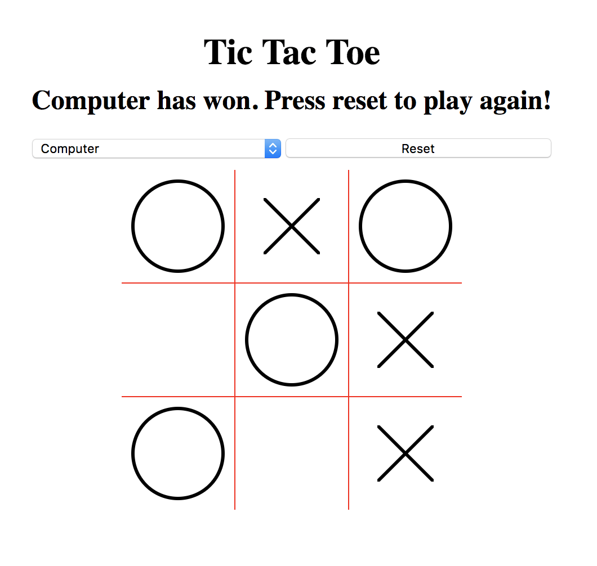
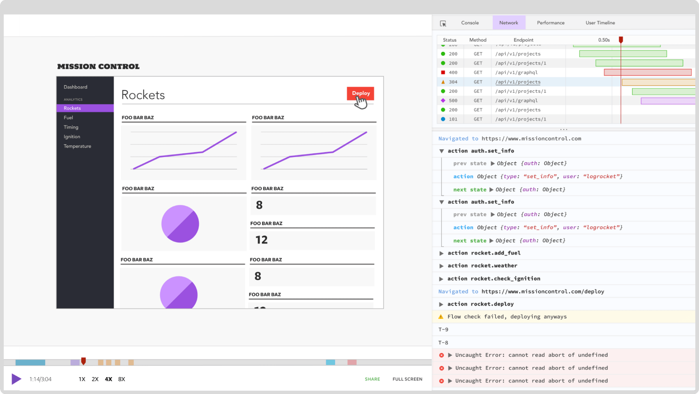

How to make a tic-tac-toe bot with WebAssembly for Go - LogRocket Blog

 

 [Chris ChuckFollow](https://blog.logrocket.com/author/chrischuck/)

# How to make a tic-tac-toe bot with WebAssembly for Go

  May 23, 2019   ·  15 min read

 

A while back, I wrote an [article](https://medium.freecodecamp.org/taking-off-with-webassembly-for-go-in-react-7c099bd907fa) about the basic setup for Go WebAssembly in a React.js app. We’ll be piggybacking off of the work we did there so make sure to give that a read first (or download the [starter template](https://github.com/Chrischuck/React-Go-WASM))!

If you need to download the template, run the following:
`git clone https://github.com/Chrischuck/React-Go-WASM.git`

Also, make sure you have [Chrome](https://www.google.com/chrome/) downloaded because we need it for development.

Last time we used Go to simply log stuff to the console. That’s cool and all, but this time we’ll put Go to use by making a bot that’s unbeatable at tic-tac-toe.

This tutorial will cover the following topics in order:

- tic-tac-toe
- MiniMax algorithm
- Implementing MiniMax in Go
- Making it work in React
- Takeaways/pitfalls of WebAssembly for Go

As you can see, we’ll be covering a lot of different topics ranging from AI theory, writing some Go, and a little bit of web dev. You don’t need to be an expert in any of these so let’s jump right into it.

Here’s a link to a full [demo](https://chris-tac-toe.netlify.com/) (desktop and Chrome only ) and its [repo](https://github.com/Chrischuck/ai-tic-tac-toe).

And as another resource, a link to this article’s [repo](https://github.com/Chrischuck/React-Go-WASM).

### Tic-tac-toe basics

If you aren’t familiar with tic-tac-toe, it’s a game played by school children everywhere. It’s origins date back to ancient Egypt (as far back as 1300 BCE)! The game is relatively simple, so let’s take a look!

[Image](https://en.wikipedia.org/wiki/Tic-tac-toe#/media/File:Tic-tac-toe-game-1.svg) from Wikipedia

You have a 3×3 matrix (shown above) and one player is the O and the other is the X. Players take turns filling in empty positions with their symbol. The first person to get three of their symbols in a row wins! The classic game of tic-tac-toe involves a 3×3 board, but you can go up to any size as long as it’s square. For this tutorial, we’ll be sticking to 3×3 for simplicity and performance reasons (more on the performance reasons later).

### How to win all of the time — MiniMax

The first thing we should go over is the actual algorithm that will power our tic-tac-toe bot. The definition of this algorithm from Wikipedia states the following:

> [**> Minimax**](https://en.wikipedia.org/wiki/Minimax)>  is a decision rule used in > [> artificial intelligence](https://en.wikipedia.org/wiki/Artificial_intelligence)> , > [> decision theory](https://en.wikipedia.org/wiki/Decision_theory)> , > [> game theory](https://en.wikipedia.org/wiki/Game_theory)> , > [> statistics](https://en.wikipedia.org/wiki/Statistics)>  and > [> philosophy](https://en.wikipedia.org/wiki/Philosophy)>  for *> mini*> mizing the possible > [> loss](https://en.wikipedia.org/wiki/Loss_function)>  for a worst case (*> max*> imum loss) scenario.

What this means is that our algorithm isn’t necessarily trying to win, it’s trying not to lose. Applying this idea to our tic-tac-toe game, our bot will choose the path that gives the opponent the lowest opportunity to win.

Take a look at the image below:

[Image](https://en.wikipedia.org/wiki/File:Minimax.svg) from Wikipedia

The levels with circles on them represent the opponent’s choice (0, 2, 4) while the levels with squares represent the bot’s choice (1 and 3). The branches represent the possible choices. For each possible move the bot has, it will traverse the tree until it reaches a terminal state i.e. no more moves can be played. Each path along the tree represents a sequence of moves. Looking at the first level, we have 6 pairs, (10, inf), (5), (-10), (7, 5), (-inf), and (-7, -5). Since it’s the opponent’s choice, we choose the smallest values of each pair, so 10, 5, -10, 5, -inf, and -7. We then apply the same algorithm to our values new values but instead of taking the minimum, we take the maximum.

This naive version of MiniMax works fine, but we can improve it with something called alpha-beta pruning.

With alpha-beta pruning, we can completely ignore some branches of the tree, vastly speeding up our search for the winningest solution.

[Image](https://en.wikipedia.org/wiki/Alpha%E2%80%93beta_pruning#/media/File:AB_pruning.svg) from Wikipedia

Let’s begin to apply the Minimax algorithm to see alpha-beta pruning at work. Looking at the pairs (5,6) the minimum is 5. We know that we will now have to pick a maximum between 5 and whatever we get on the right branch. Comparing (7,4) now, our minimum is 4. 4 is less than 5 so 5 will be chosen for the maximum when we compare them. Because of this, we do not have to check the third branch, in this case, 5, because it is impossible for it to propagate up the tree past the maximum comparison with 5.

### MiniMax in Go

Picking up where we left off last time (or after downloading the starter template), your folder structure should look like this:

Edit your `main.go` file in your `server/go` folder to the following:

package mainimport  "syscall/js"func findNextComputerMove(args []js.Value)  {grid := args[0]turnCount := args[1].Int()nextMove :=  GetNextMove(grid, turnCount)js.Global().Set("nextMove", js.TypedArrayOf(nextMove))}func checkGameState(args []js.Value)  {grid := args[0]lastMoveArg := args[1]turnCount := args[2].Int()player := args[3].String()lastMove :=  []int8{int8(lastMoveArg.Index(0).Int()),int8(lastMoveArg.Index(1).Int()),}gameState :=  StateValue(grid, lastMove, player, turnCount)js.Global().Set("gameState", js.ValueOf(gameState))}func registerCallbacks()  {js.Global().Set("findNextComputerMove", js.NewCallback(findNextComputerMove))js.Global().Set("checkGameState", js.NewCallback(checkGameState))}func main()  {done  := make(chan bool,  0)registerCallbacks()<-done}

We really only added three things from last time, a function that finds the bot’s next move, a function that checks the state of the game (bot win, user win, tie, or game isn’t over), and the game state itself after calculations have been completed. Both of these functions are essentially wrappers exposing around the code we’ll be writing soon to the JavaScript client. Remember for later that the variable `gameState` and the functions `findNextComputerMove`and `checkGameState` will be exposed as global variables in our React app.

Take note of both of these function’s parameters, `args []js.Value`. Instead of having multiple parameters, we have a single array that contains JavaScript values. So on the client side, we can pass as many arguments as we want, they will just be indexed in the `args` array.

Looking at the `checkGameState` function, you can see that we extract the arguments we need from the array using the indices.

Now create a file called `tictactoe.go` in your `server/go` folder. The first thing we should do is create is a function that checks the game state:

package mainimport  "syscall/js"func StateValue(grid js.Value, lastMove []int8, player string, turnCount int)  int  {// return 0 for more moves to be played, 1 for Computer win, 2 for hooman win, and 3 for tie!rowIndex := lastMove[0]columnIndex := lastMove[1]gridSize := grid.Length()// check columns and rowsrowEqual :=  truecolumnEqual :=  truefor i :=  0; i < gridSize; i++  {if grid.Index(int(rowIndex)).Index(i).String()  != player {rowEqual =  false}if grid.Index(i).Index(int(columnIndex)).String()  != player {columnEqual =  false}if  !rowEqual &&  !columnEqual {break}}if rowEqual || columnEqual {if player ==  "COMPUTER"  {return  1}return  2}// check upper left to bottom right diagonalif rowIndex == columnIndex {firstDiagonalEqual :=  truefor i :=  0; i < gridSize; i++  {if grid.Index(i).Index(i).String()  != player {firstDiagonalEqual =  false}}if firstDiagonalEqual {if player ==  "COMPUTER"  {return  1}return  2}}// check top right to bottom left diagonalif  int(rowIndex)  == gridSize-1-int(columnIndex)  {secondDiagonalEqual :=  truefor i :=  0; i < gridSize; i++  {if grid.Index(i).Index(gridSize-1-i).String()  != player {secondDiagonalEqual =  false}}if secondDiagonalEqual {if player ==  "COMPUTER"  {return  1}return  2}}if gridSize*gridSize == turnCount {return  3}return  0}

What this function does is checks if the game is a tie, bot win, human win, or if moves are still available. It takes a `js.Grid` representing the game state as its first parameter, the last played move, the player of the last played move, and the number of turns so far. This function returns four different states:

- 0 if there are more moves to be played
- 1 if the bot won
- 2 if the human won
- 3 if it is a tie game

First, the function checks if the row or column affected by this move creates three in a row. If there is a winning state, the function returns 1 or 2 depending on who won. If nobody won through columns or rows, then the diagonals are checked if the last move is on a diagonal. Again, if there’s a win state, 1 or 2 is returned depending on who won. If not, the function checks if there is a tie by checking if the number of turns equals the square of the grid size. If there is a tie, 3 is returned and if not, 0 is returned.

Now that we have the ability to check the state of a game, we can build our MiniMax algorithm. Add the following changes to your `tictactoe.go` file:

package mainimport  ("math""syscall/js")type SuccessorState  struct  {Grid js.ValueLastMove  []int8Rating  int}/*

* StateValue function...

*/func GetNextMove(grid js.Value, turnCount int)  []int8 {successorStates := getSuccessorStates(grid,  "COMPUTER")var maxState SuccessorState// kicking off the minimax algo, we can assume the move is from the computerfor index, state := range successorStates {state.Rating  = miniMax(state.Grid, state.LastMove,  "COMPUTER", turnCount, math.MinInt32, math.MaxInt32)if index ==  0  || state.Rating  > maxState.Rating  {maxState = state}}return maxState.LastMove}

This `GetNextMove` function simply iterates over all of the next possible states and runs the Minimax algorithm on each successor state. After doing this, it returns the state with the maximum value.

Now let’s add some utility functions. Add the following to your file:

func intMax(x int, y int)  int  {if x > y {return x}return y}func intMin(x int, y int)  int  {if x < y {return x}return y}func getSuccessorStates(grid js.Value, player string)  []SuccessorState  {var states []SuccessorState// slice version of our grid so we can copy itbaseGrid := duplicateGrid(grid)for i :=  0; i < grid.Length(); i++  {for j :=  0; j < grid.Length(); j++  {if grid.Index(i).Index(j).String()  ==  ""  {// copy the base gridnewGrid := make([]interface{}, len(baseGrid))copy(newGrid, baseGrid)jsGrid := js.ValueOf(newGrid)// apply the next movejsGrid.Index(i).SetIndex(j, player)newState :=  SuccessorState{Grid: jsGrid,LastMove:  []int8{int8(i), int8(j)},}states = append(states, newState)}}}return states}func duplicateGrid(grid js.Value)  []interface{}  {// I wish there was an easier way... but as of now I don't// think you can create a duplicate of a js array :(// so we just pass the values into a slice// pls lmk if you have an optimal solutiongridSize := grid.Length()newGrid := make([]interface{}, gridSize)for i :=  0; i < gridSize; i++  {newGridRow := make([]interface{}, gridSize)for j :=  0; j < gridSize; j++  {newGridRow[j]  = grid.Index(i).Index(j).String()}newGrid[i]  = newGridRow}return newGrid}

The first two functions `intMin` and `intMax` just return the minimum and maximum of two numbers. `getSuccessorStates` takes a current game state, and finds all possible moves for a player, applies each move, and then returns the array of states with each possible move applied. The last utility function is the `duplicateGrid` function. This function takes the grid of type `js.Value`and transforms it into a slice. As of now, I don’t think there’s an easier way to do this operation which is an obvious pain point. But more on this later.

Now that we have the perquisites, we can create the core of the MiniMax function. Add the following function to your `tictactoe.go` file:

func miniMax(grid js.Value, lastMove []int8, player string, turnCount int, alpha int, beta int)  int  {gameState :=  StateValue(grid, lastMove, player, turnCount)if gameState ==  1  {return  1}  else  if gameState ==  2  {return  -1}  else  if gameState ==  3  {return  0}if player ==  "COMPUTER"  {return miniMaxMin(grid,  "HUMAN", turnCount, alpha, beta)}  else  {return miniMaxMax(grid,  "COMPUTER", turnCount, alpha, beta)}}

This function is very simple. First, it gets the value of the current state and returns 1 which represents a computer win, -1 to represent a human win, and 0 to represent a tie. Next, we apply the mini/max part of the algorithm. If it’s the computer’s turn we choose the turn that returns the maximum value for the computer. If it’s the human’s turn, we choose the least winning turn for the human.

Let’s build the `miniMaxMin` function. Add this function to your `tictactoe.go`file:

func miniMaxMin(grid js.Value, player string, turnCount int, alpha int, beta int)  int  {successorStates := getSuccessorStates(grid, player)minStateRating :=  int(math.MaxInt32  +  1)for _, state := range successorStates {minStateRating = intMin(minStateRating, miniMax(state.Grid, state.LastMove, player, turnCount+1, alpha, beta))if minStateRating <= alpha {return minStateRating}beta = intMin(beta, minStateRating)}return minStateRating}

This function takes a given state and for each of the children states it finds the state that brings the lowest net value. However, we apply alpha-beta pruning so we do not have to traverse every single node on the tree.

Now let’s look at the `miniMaxMax` function. Add this function to your `tictactoe.go` file:

func miniMaxMax(grid js.Value, player string, turnCount int, alpha int, beta int)  int  {successorStates := getSuccessorStates(grid, player)maxStateRating :=  int(math.MinInt32  -  1)for _, state := range successorStates {maxStateRating = intMax(maxStateRating, miniMax(state.Grid, state.LastMove, player, turnCount+1, alpha, beta))if maxStateRating >= beta {return maxStateRating}alpha = intMax(alpha, maxStateRating)}return maxStateRating}

This function takes a given state and for each of the children states it finds the state that brings the highest net value. However, again we apply alpha-beta pruning so we do not have to traverse every single node on the tree.

That’s it for the MiniMax algorithm in Go!

Time to build the Go WASM file. `cd` into the `server/go` directory and run the following in your terminal:

GOOS=js GOARCH=wasm go build -o main.wasm
This should create a `main.wasm` file in your `server/go` directory.

From here, `cd` back into the root `/server` directory and run `npm run dev` to start an express server to serve up your WASM file.

### Connecting the dots in React

Now we need to get our logic into the front end.
Open a new terminal and `cd` into the `/client` directory.
Run the following:

npm install  --save react react-dom && npm install --save-dev@babel/core @babel/plugin-proposal-class-properties @babel/plugin-proposal-decorators @babel/plugin-syntax-dynamic-import  @babel/polyfill @babel/preset-env @babel/preset-react add-asset-html-webpack-plugin babel-loader html-webpack-plugin webpack webpack-cli webpack-dev-server webpack-dotenv-plugin

By doing this, we update our dependencies and make sure we have everything we need to build our React application.

Next, update our file structure to the following:

First, update your `webpack.config.js` like this:

const  HtmlWebpackPlugin  =  require('html-webpack-plugin');const  AddAssetHtmlPlugin  =  require('add-asset-html-webpack-plugin');const  DotenvPlugin  =  require('webpack-dotenv-plugin');module.exports =  {  resolve:  {  modules:  ['src',  'node_modules']  },  devtool:  'source-map',  entry:  {  vendor:  ['@babel/polyfill',  'react',  'react-dom'],  client:  './src/index.js',  },  output:  {  path: __dirname +  '/dist',  filename:  '[name].chunkhash.bundle.js',  chunkFilename:  '[name].chunkhash.bundle.js',  publicPath:  '/',  },  module:  {  rules:  [  {  test:  /\.js$/,  exclude:  /node_modules/,  use:  {  loader:  "babel-loader"  }  },  ]  },  devServer:  {  historyApiFallback:  true,  disableHostCheck:  true  },  plugins:  [  new  DotenvPlugin({  sample:  './.env.example',  path:  './.env'  }),  new  HtmlWebpackPlugin({  title:  'GoWasm!',  template:  './src/index.html',  filename:  './index.html',  inject:  true,  minify:  {  collapseWhitespace:  true,  collapseInlineTagWhitespace:  true,  minifyCSS:  true,  minifyURLs:  true,  minifyJS:  true,  removeComments:  true,  removeRedundantAttributes:  true  }  }),  // Make sure to add these in this order, so the wasm_exec.js gets injected first  // yes, it's backwards, I know :/  new  AddAssetHtmlPlugin({  filepath:  require.resolve('./src/init_go.js')  }),  new  AddAssetHtmlPlugin({  filepath:  require.resolve('./src/wasm_exec.js')  })  ]};

All that has changed is we added the Dotenv plugin.
No, in your `.env.example` and `.env` file add the following:
DEV_SERVER_URI=[http://localhost:3000](http://localhost:3000/)
Now let’s update the `App.js`, paste the following:

import  React  from  'react'import  Grid  from  './grid'export  default  class  App  extends  React.Component  {  constructor(props)  {  super(props)  this.state =  { isLoading:  true  }  } componentDidMount()  {const  { DEV_SERVER_URI }  = process.envWebAssembly.instantiateStreaming(fetch(DEV_SERVER_URI), go.importObject).then(async  (result)  =>  { go.run(result.instance)  this.setState({ isLoading:  false  })  });  } render()  {  return  (  
  {  this.state.isLoading ?  
  {  /* https://codepen.io/aurer/pen/jEGbA for this cool loader and more! */  }  <svg version="1.1" id="Layer_1" xmlns="http://www.w3.org/2000/svg" x="0px" y="0px" width="24px" height="30px" viewBox="0 0 24 30" style={{enableBackground:  'new 0 0 50 50'}}>  <rect x="0" y="0" width="4" height="20" fill="#333">  <animate attributeName="opacity" attributeType="XML" values="1; .2; 1"  begin="0s" dur="0.6s" repeatCount="indefinite"  />  </rect>  <rect x="7" y="0" width="4" height="20" fill="#333">  <animate attributeName="opacity" attributeType="XML" values="1; .2; 1"  begin="0.2s" dur="0.6s" repeatCount="indefinite"  />  </rect>  <rect x="14" y="0" width="4" height="20" fill="#333">  <animate attributeName="opacity" attributeType="XML" values="1; .2; 1"  begin="0.4s" dur="0.6s" repeatCount="indefinite"  />  </rect>  </svg>  
  :  <Grid  />  }  
  )  }}

This component isn’t really doing much, it’s simply initializing web assembly and displaying our grid component after the loading is done.

Now let’s create each cell of the grid. This component isn’t that complicated either and only contains a little bit of logic. Add this to your `cell.js` file.

import  React  from  'react'export  default  class  Cell  extends  React.Component  { renderIcon()  {  const  { fill }  =  this.props if  (!fill)  {  return  null  }  if  (fill ===  'HUMAN')  {  return  (  // Thanks w3schools! https://www.w3schools.com/graphics/svg_line.asp  <svg height="50" width="50">  <line x1="0" y1="0" x2="50" y2="50" style={{stroke:'black', strokeWidth:3}}  />  <line x1="0" y1="50" x2="50" y2="0" style={{stroke:'black', strokeWidth:3}}  />  </svg>  )  }  if  (fill ===  'COMPUTER')  {  return  (  // Thanks again w3schools! https://www.w3schools.com/graphics/svg_circle.asp  <svg height="100" width="100">  <circle cx="50" cy="50" r="40" style={{stroke:'black', strokeWidth:3, fill:  'white'  }}  />  </svg>  )  }  }  clickCell  =  ()  =>  {  const  { cell, fillCell, fill, turn, isGameOver }  =  this.props if  (fill || turn !==  'HUMAN'  || isGameOver)  {  return  } fillCell(cell,  'HUMAN')  } render()  {  const  { cell, gridSize, fill, isGameOver,  }  =  this.props const  [row, column]  = cell return  (  
  {  this.renderIcon()  }  
  )  }}

This component is fairly simple. It takes a few props fed from the grid component. The most important prop is the `fill` prop which says if the cell is filled by a human or computer. Based on this prop, it will return either nothing if it’s a free move, a circle if it’s a human, or an X if it’s a computer.

Now, this brings us to the final part of our frontend app: the grid component.
Go ahead and add this to your `grid.js` file and then let’s break it down:

import  React  from  'react'import  Cell  from  './cell'const DEFAULT_GRID_SIZE =  3const DEFAULT_TURN =  'HUMAN'  const initGrid =  (size)  =>  {  const grid =  []  const gridSize = size || DEFAULT_GRID_SIZE for  (let i =  0; i < gridSize; i++)  {  const row =  []  for  (let j =  0; j < gridSize; j++)  { row.push('')  } grid.push(row)  }  return grid}export  default  class  Grid  extends  React.Component  {  constructor(props)  {  super(props)  this.state =  {  isGameOver:  false,  startTurn: DEFAULT_TURN,  turn: DEFAULT_TURN,  gridSize: DEFAULT_GRID_SIZE,  lastMove:  null,  turnCount:  1,  message:  '',  grid: initGrid()  }  } componentDidMount()  {  const  { turn }  =  this.state if  (turn ===  'COMPUTER')  {  this.calculateComputerMove()  }  } componentDidUpdate(prevProps, prevState, snapshot)  {  const  { turn, isGameOver }  =  this.state if  (!isGameOver && turn ===  'COMPUTER')  {  this.calculateComputerMove()  }  } calculateComputerMove =  async  ()  =>  {  const  { grid, turnCount }  =  this.state await  new  Promise((resolve, reject)  =>  { findNextComputerMove(grid, turnCount)  // let the other threads finish setTimeout(resolve,  0)  })  this.fillCell(nextMove,  'COMPUTER')  } fillCell =  async  (cell, player)  =>  {  const  { grid, turnCount }  =  this.state const  [row, column]  = cell const gridCopy =  [  ...grid ]  // we do this so we don't mutate state itself! gridCopy[row][column]  = player const turn = player ===  'HUMAN'  ?  'COMPUTER'  :  'HUMAN'  await  new  Promise((resolve, reject)  =>  { checkGameState(grid, cell, turnCount, player)  // let the other threads finish setTimeout(resolve,  0)  })  switch  (gameState)  {  case  1:  this.endGame('Computer has won. Press reset to play again!', gridCopy)  return  case  2:  this.endGame('Congrats Hackerman. Press reset to play again!', gridCopy)  return  case  3:  this.endGame('Nobody won. Press reset to play again!', gridCopy)  return  }  this.setState({ turn,  grid: gridCopy,  turnCount: turnCount +  1,  lastMove: cell })  } endGame =  (message, grid)  =>  {  this.setState({ grid, message,  isGameOver:  true  })  } resetGame =  (turn)  =>  {  this.setState((prevState, _)  =>  ({  message:  'Restarting Game..',  isGameOver:  false,  startTurn: turn || prevState.startTurn,  turn: turn || prevState.startTurn || DEFAULT_TURN,  gridSize: DEFAULT_GRID_SIZE,  lastMove:  null,  turnCount:  1,  grid: initGrid()  }),  ()  =>  this.setState({  message:  ''}))  } render()  {  const  { grid, gridSize, turn, isGameOver, message }  =  this.state return  (  
  <h1  style={{textAlign:  'center',  marginBottom:  '5px'}}>Tic  Tac  Toe</h1>  <h2  style={{textAlign:  'center',  marginTop:  '5px'}}>{message ? message :  (!isGameOver && turn ===  'COMPUTER')  ?  'Computer is thinking '  :  ' '}</h2>  
  <select  onChange={(e)  =>  this.resetGame(e.target.value)} style={{ flex:  1, marginRight:  '3px'}}>  <option  value='HUMAN'>Human</option>  <option  value='COMPUTER'>Computer</option>  </select>  <button  style={{  flex:  1}}  onClick={(e)  =>  this.resetGame()}>Reset</button>  
  
  { grid.map((row, rowIndex)  =>  (  
  { row.map((fill, columnIndex)  =>  (  <Cell  key={`col-${columnIndex}`}  isGameOver={isGameOver}  turn={turn}  fill={fill}  // This  determines  if  this  cell  is  empty  or  not!  cell={[rowIndex,  columnIndex]}  gridSize={gridSize}  fillCell={this.fillCell}  />  ))  }  
  ))  }  
  
  )  }}

This component does two things. First, it keeps track of the game state and renders cells to reflect the game state. It then uses the helper functions we exposed through web assembly to calculate the computer’s move and update the game state.

The heart of the computer calculations lies in the `fillCell` function. This function simply takes the state representation of the grid, applies the player or computer’s move, and checks if the game has been won using the `checkGameState` function which is exposed by the web assembly module. After the game state has been calculated, we then check if the game is over after this move has been applied by checking the value of the `gameState`variable which is set globally via WebAssembly. Lastly, we switch the players’ turn.

Next, using `componentDidUpdate`, whenever state is updated we check if it’s the computer’s turn. If it is the computer’s turn, we simply use the `findNextComputerMove` function we created earlier in Go.

Once the `gameState` has reached a terminal state, we end the game.

### Running the app

1. Create two terminal windows
2. In one, `cd` into the `/server` folder and run `npm install && npm run dev`
3. In the other, `cd` into the `/client` folder and run `npm run dev`

4. Navigate to `[localhost:8080](http://localhost:8080/)` in your Chrome browser

### Issues with WebAssembly for Go

#### 1. Initial overhead

When using WebAssembly, we need to make a request to get the WASM file and then initialize it once it has reached the browser. With moderately large WASM files, this can cause a long initial loading time. On top of this, Go’s variant of WebAssembly ships with a Go runtime and garbage collector which bloats its WASM files.

#### 2. Run on a separate thread

This is good and bad. The good part is that it allows you to do processes in the background of your application. However, this means you have to get a little crafty when you are waiting for data. We had to store variables globally so the Go code could share information with the React code.

#### 3. Performance is lackluster

After the overhead, I was expecting the computations to be lightning fast. Although I have not tested it, I believe writing the MiniMax algorithm in JavaScript would be almost as fast as Go. On top of this, after a board size of 4×4, the computations become too great and your browser will most likely crash.

#### 4. Limited power of Go WASM JavaScript structures

I believe part of why the Go code was slower than I anticipated was because of the transformations from JavaScript data structures to Go ones and vice versa. For example, the `duplicateGrid` function was made in order to clone a JS array in go. This was done because I could not deeply transform a 2d array into a usable Go data structure. Unfortunately, the `duplicateGrid` function was built naively with a double for loop and it definitely destroyed performance. With regular Go arrays, you can clone an array with the `make`function and it would be nice to see this in Go.

### Conclusion

WebAssembly for Go allows us to bring low-level code to the browser, in theory, allowing us to write more computationally intensive programs. While I love the idea of using Go for WebAssembly, I believe it has a little ways to go before it’s refined and viable for production usage. However, since this is Go’s first step into WebAssembly, it has a lot of room to grow and improve.

I hope you enjoyed this tutorial and I hope you learned something new!

### Plug: [LogRocket](https://logrocket.com/signup/), a DVR for web apps

### 

https://logrocket.com/signup/

[LogRocket](https://logrocket.com/signup/) is a frontend logging tool that lets you replay problems as if they happened in your own browser. Instead of guessing why errors happen, or asking users for screenshots and log dumps, LogRocket lets you replay the session to quickly understand what went wrong. It works perfectly with any app, regardless of framework, and has plugins to log additional context from Redux, Vuex, and @ngrx/store.

In addition to logging Redux actions and state, LogRocket records console logs, JavaScript errors, stacktraces, network requests/responses with headers + bodies, browser metadata, and custom logs. It also instruments the DOM to record the HTML and CSS on the page, recreating pixel-perfect videos of even the most complex single-page apps.

[Try it for free](https://logrocket.com/signup/).

### Share this:

- [Twitter](https://blog.logrocket.com/how-to-make-a-tic-tac-toe-bot-with-webassembly-for-go-e01800a874c9/?share=twitter&nb=1)
- [Reddit](https://blog.logrocket.com/how-to-make-a-tic-tac-toe-bot-with-webassembly-for-go-e01800a874c9/?share=reddit&nb=1)
- [LinkedIn](https://blog.logrocket.com/how-to-make-a-tic-tac-toe-bot-with-webassembly-for-go-e01800a874c9/?share=linkedin&nb=1)
- [Facebook](https://blog.logrocket.com/how-to-make-a-tic-tac-toe-bot-with-webassembly-for-go-e01800a874c9/?share=facebook&nb=1)

-

- [Featured Posts](https://blog.logrocket.com/category/featured/)

« [What’s new in Vuex 3.1.1](https://blog.logrocket.com/whats-new-in-vuex-3-1-1-d796b0c791bf/)

[Getting started with Enzyme for React](https://blog.logrocket.com/getting-started-with-enzyme-for-react-a106b58fc53b/) »