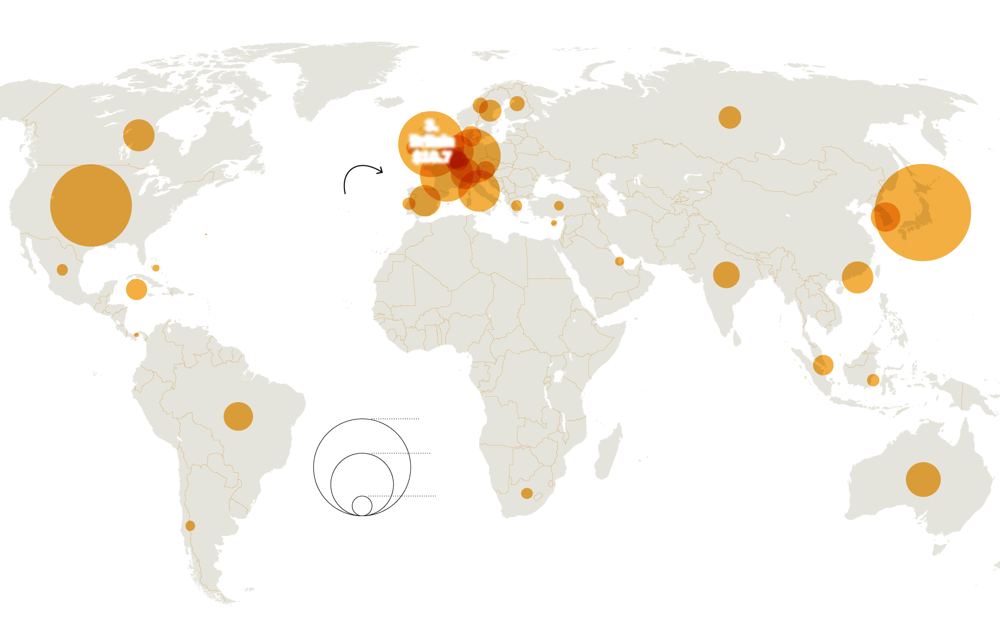
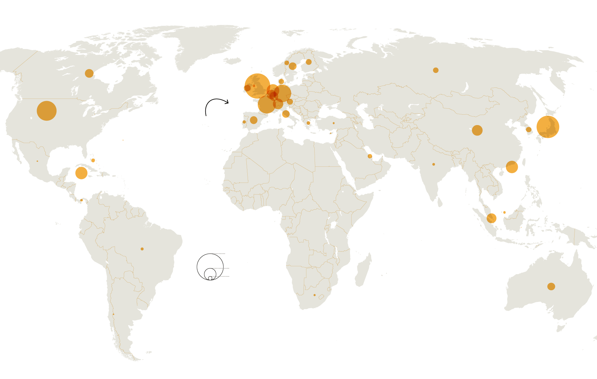
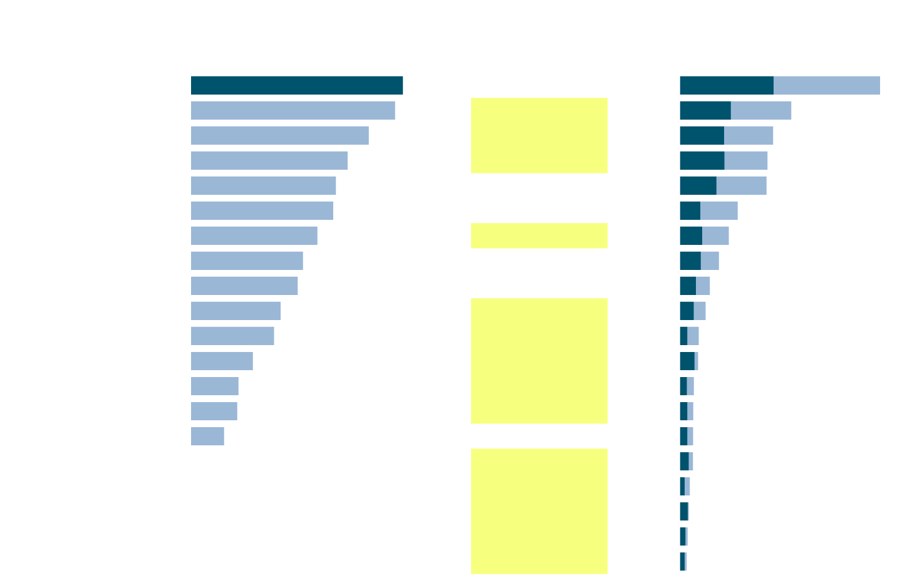
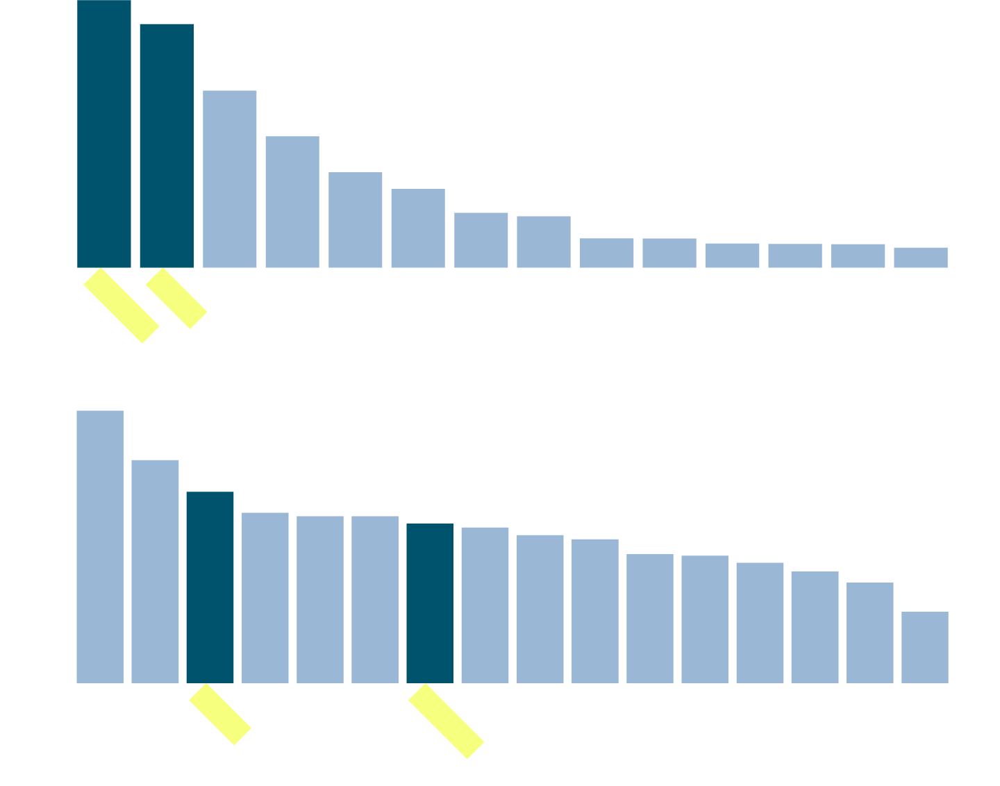

How ‘Brexit’ Could Alter London, the World’s Banker

##     [Business Day](https://www.nytimes.com/pages/business/index.html)

- [**Share](#)

# How ‘Brexit’ Could Alter London, the World’s Banker

By [KARL RUSSELL](https://www.nytimes.com/by/karl-russell)MAY 11, 2017

 For centuries, London has functioned as a critical artery for the flow of money around the world. From Canary Wharf to the City of London, it now comprises one of the greatest concentrations of financial companies on earth. But a large piece of London’s banking business depends on its inclusion in the European Union. Britain is now moving to exit the union, jeopardizing its status as a leading global financial center.  [Related Article](https://www.nytimes.com/2017/05/11/business/dealbook/brexit-uk-london-banking.html)

## Britain is a global financial hub

Nearly one-fifth of the world’s banking transactions go through the United Kingdom, with most moving through London.

Biggest banking sectors
2016, in trillions of dollars
3.
Britain
$10.7
Canada
$2.6
9.
2.
United
States
$16.8
1.
Japan
$24.1
4.
5.
6.
8.
Germany
France
Italy
Netherlands
$7.7
7.5
4.2
2.8
10.
Hong Kong $2.5
$24
trillion
10
Australia $3.1
7.
1

 Data are total claims (financial assets that have a counterpart liability) for financial firms located in each country, regardless of its nationality, as of the third quarter in 2016. Figure for the United States is total assets at the end of 2016. | Sources: Bank for International Settlements; U.S. Federal Deposit Insurance Corporation

## And it has more international flair

While New York is largely centered on the American markets, London is more focused on the world, catering to a global clientele that runs from French money managers to Saudi princes to Chinese billionaires.

Biggest cross-border banking sectors
2016, in trillions of dollars
1. Britain
$4.6
2.
Japan
$3.6
4.
5.
7.
10.
France
Germany
Netherlands
Switzerland
$2.3
2.1
1.2
0.8
3. United
States
$2.8
9.
China
$0.8
6. Hong Kong $1.3
8. Cayman
Islands $1.1
$5
trillion
1
0.1

 Source: Bank for International Settlements

## Banking helps drive London’s economy

Much of London’s business is connected to Europe, in deals that could be effectively be illegal after Brexit.

British banking counterparties
Cross-border banking as a share of G.D.P.
European Union members are highlighted
1.
2.
3.
4.
5.
6.
7.
8.
9.
10.
11.
12.
13.
14.
15.
Britain
Netherlands
Belgium
Switzerland*
Finland
Ireland
France
Sweden
Denmark
Austria
Germany
Greece
Portugal
Spain
Italy
161
155
135
119
110
108
96
85
81
68
63
47
36
35
25
%
1.
2.
3.
4.
5.
6.
7.
8.
9.
10.
11.
12.
13.
14.
15.
16.
17.
18.
19.
20.
United States
France
Germany
Netherlands
Japan
Switzerland*
Belgium
Australia
Hong Kong
Jersey†
Ireland
Luxembourg
Guernsey†
Spain
Canada
Sweden
Finland
Isle of Man†
Denmark
Greece
$1,519
844
707
664
656
438
369
295
226
193
142
137
104
99
98
97
74
66
56
50
CLAIMS
LIABILITIES
In billions

 Notes: *Switzerland is not part of the European Union but follows many of the E.U.’s banking rules. †Crown dependencies of Britain. Luxembourg and Cyprus are omitted from the chart showing banking as a share of G.D.P., because their relatively small economies make their share incomparable. | Sources: Organization for Economic Cooperation and Development; Bank for International Settlements

## Brexit will put jobs at risk

At the high end of estimates, as many as 80,000 finance positions could depart over the next two years.

In Europe, only Germany employs more people in banking …
1,310
1,193
Total employed in the financial and
insurance sectors, in thousands
867
643
468
386
268
251
143
142
118
114
116
97
Germany
France
Italy
Spain
Netherlands
Britain
Poland
Switzerland
Austria
Romania
Czech Rep.
Belgium
Portugal
Sweden
… but they account for a greater share of all jobs in Britain.
5.3%
Financial and insurance employment
as a share of total employed
4.4%
3.7%
3.3%
3.3%
3.3%
3.1%
3.1%
2.9%
2.8%
2.5%
2.5%
2.4%
2.2%
2.0%
1.4%
Switzerland
Britain
Ireland
France
Germany
EU28
Spain
Austria
Netherlands
Italy
Romania
Belgium
Portugal
Czech Rep.
Poland
Sweden

 Source: Eurostat

##  More on NYTimes.com

Advertisement

[](https://adclick.g.doubleclick.net/pcs/click?xai=AKAOjsu5Uj7cJPkvN4KCDUpE4EcBvKNcERLClY7ytSCGUdeLHuWR_k98gDcBTGLYeFHMeadq-g8g-aU36Q8ocbjIOWB344vLGTR9Ikeg&sig=Cg0ArKJSzLX1Cqd4j80k&urlfix=1&adurl=http://pixel.mathtag.com/click/img%3Fmt_aid%3D1863610982674834809%26mt_id%3D4058395%26mt_adid%3D158391%26mt_sid%3D2219044%26mt_exid%3D4%26mt_inapp%3D0%26mt_uuid%3D3b0956f6-a2ea-4800-a4ff-92655dd7542c%26mt_3pck%3Dhttps%253A//adclick.g.doubleclick.net/aclk%253Fsa%253DL%2526ai%253DCQYeseeAWWd_YEpW8zAbdq4I44N2QqQfAhtmCxgLAjbcBEAEgAGC7vq6D0AqCARdjYS1wdWItNDE3Nzg2MjgzNjU1NTkzNMgBCeACAKgDAaoE0gJP0COFMKI1NKmeTua_akJN0OdjovHDg08G1KBGSUjPG3bU_iOGKAaw0YkWhsA3NNG9RbWsHBFghKqL_p0zK5MJBqKD139sbQJc-CVHNt7SBGQy_ASOyA2OrknIhwJFl9jVfbOCaE0pGxBj7sbiEB5ZkpSjQ_ucGqChTrrH52UATuYW5hTrHw4MMc03wr7wQQq6FMNwgw6aZm0pzjoIS_S-iWtLMx2WxjPYBsmiMDTV0hnR9zUoVFBsCY_OXhvW7dvycyUxmsfpv17fBKzWil0_5ZtY4_zeOHTND8ecN3-5shJDCH6iOAY0Tlp59yfWeCpoPj_CesymkEabiIFfVk-nigYVguaqfC65KRUUOlYi5XwdVEOsj4QKIm8X15mPlYTfNzI3PfQO_s72XoC-yDRBTz0fJ8PhqvmhQKwK_TGx4vnJJcQzZexRMUXS-VxOhjV7QuAEAYAGnoOo09Sls45goAYhqAemvhvYBwDSCAUIjGMQAQ%2526num%253D1%2526sig%253DAOD64_1_VsE0diJ_HUrO3jBcwQyeHR6oqg%2526client%253Dca-pub-4177862836555934%2526adurl%253D%26redirect%3Dhttps://www.skycasino.com/casino%253Foffer%253D174%2526aff%253D1197315751%2526DCMP%253DDIS_Casino_MOA)