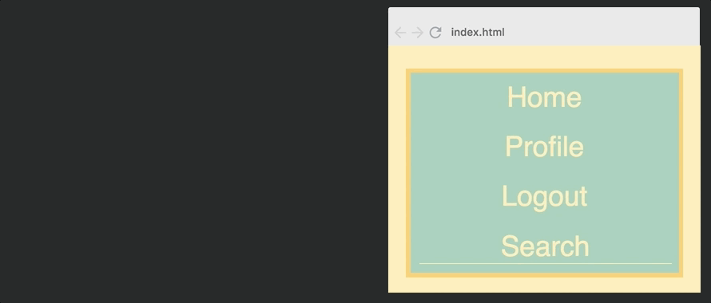

I just launched a free full-length Flexbox course where you can build projects interactively

# I just launched a free full-length Flexbox course where you can build projects interactively

Click the image to get to the course.

After the success of the [CSS Grid course I launched](https://medium.freecodecamp.org/heres-my-free-css-grid-course-merry-christmas-3826dd24f098) with freeCodeCamp in December (over 14,000 students so far!) I decided to launch a second free course.

This time you can learn Flexbox, which has become a must-have skill for front-end developers.

Flexbox was also one of the most frequent requests I got from students who took the CSS Grid course.

In this article I’ll explain how the Flexbox course is laid out, so that you can decide whether it’s a good fit for you.

But if you want to jump straight into the course immediately, you can just [go there directly and get started](https://scrimba.com/g/gflexbox).

### What my Flexbox course covers

The course consists of twelve interactive screencasts, which take you from beginner to advanced. It’s focused on giving you relevant skills as early as possible, meaning that I’ve prioritized the properties based on how useful I think they are in a real-world setting.

So if you only work through the five first, you’ll still learn new concepts you can start using in your projects. This said, I still recommend to working through the whole thing.

Throughout the course you’ll be building and experimenting with a navbar, since this is a very typical use case for Flexbox.

Let’s have a look at each of the screencasts:

#### Lesson #1: Your first Flexbox

You’ll start off by creating a simple layout. This will teach you the concept of a flex **container** and flex **items**, the two core ingredients of a Flexbox layout.

#### Lesson #2: Main axis and cross axis

In the second screencast, I explain a core concept of Flexbox that’s critical to understand early on: axes. A Flexbox layout has two axes: the main axis and the cross axis. By default, the main axis is horizontal and the cross axis vertical, but they can also flip roles.

#### Lesson #3: How to justify content

The `justify-content` property controls the content along the main axis. Throughout the course, your main axis will be mostly horizontal, as opposed to vertical. I’ve chosen to do it this way as I’ve found horizontal Flexbox layouts to be more common than vertical ones in real life.

#### Lesson #4: How to position single items

In this lesson, you’ll learn how to position single items using the good old technique of setting the `margin` to auto.

#### Lesson #5: The flex property

The `flex` property allows you give your items responsive widths. It’s actually a shorthand for three other properties: `flex-grow`, `flex-shrink` and `flex-basis`. But we’ll save those for the end of the course, as they’re more advanced.

#### Lesson #6: How to align items

The `align-items` property controls the items along the cross axis, which in our case is vertical. In the image above, we’ve centered the items along this axis.

#### Lesson #7: Flex direction column

Setting the `flex-direction` to column will flip the main axis and cross axis, so that the items are laid our downwards as opposed to sideways.

#### Lesson #8: Wrapping

By default, Flexbox won’t allow you to wrap your items, meaning they’ll stay on a single line or a row. If you set `flex-wrap` to wrap you’ll be able to, though. I’ll show how this would play out.

#### Lesson #9: Flex grow, shrink, and basis

Flex grow, shrink, and basis are a bit complex to understand, so this is the longest screencast in the course. In short, `flex-basis` sets the base width of the item, `flex-grow` controls how it’ll grow above it’s basis width, and `flex-shrink` controls how it’ll shrink when the item is narrower than its base width.

#### Lesson #10: Order

We’ll end the course with a lecture on the `order` property. This will introduce you to *source order independence*, which allows you to set the order of the items independently of how they’re laid out in the HTML.

#### Bonus section

In the bonus section you’ll create two real-world layouts from beginning to end.

In the first one you’ll take everything you’ve learned through the course and use it to create a navbar which adapts itself to various screen sizes.

In the second bonus lecture, you’ll experiment with creating an image grid with Flexbox. If you’ve taken my CSS Grid course, you’ll recognize the setup from there:

And that’s all.

### The Scrimba format

Let’s also finally look at the technology behind the course. It’s built using Scrimba, an interactive coding screencast tool which has been built by my two awesome co-founders [Sindre](https://medium.com/@somebee) and [Magnus](https://medium.com/@judofyr).

Scrimba screencasts look like normal videos, but they’re fully interactive. You can edit the code inside the casts.

Here’s a gif which explains the concept: