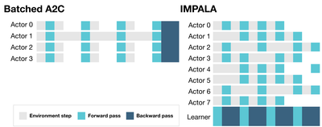
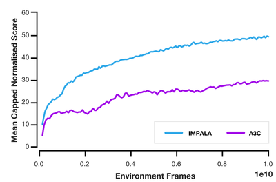

IMPALA: Scalable Distributed DeepRL in DMLab-30 | DeepMind

# IMPALA: Scalable Distributed DeepRL in DMLab-30

**Deep Reinforcement Learning (DeepRL) has achieved remarkable success in a range of tasks, from continuous control problems in robotics to playing games like Go and Atari. The improvements seen in these domains have so far been limited to individual tasks where a separate agent has been tuned and trained for each task.**

In our most recent work, we explore the challenge of training a single agent on many tasks.

Today we are releasing DMLab-30, a set of new tasks that span a large variety of challenges in a visually unified environment with a common action space. Training an agent to perform well on many tasks requires massive throughput and making efficient use of every data point. To this end, we have developed a new, highly scalable agent architecture for distributed training called IMPALA (Importances Weighted Actor-Learner Architectures) that uses a new off-policy correction algorithm called V-trace.

#### DMLab-30

DMLab-30 is a collection of new levels designed using our open source RL environment [DeepMind Lab](https://github.com/deepmind/lab). These environments enable any DeepRL researcher to test systems on a large spectrum of interesting tasks either individually or in a multi-task setting.

The tasks are designed to be as varied as possible. They differ in the goals they target, from learning, to memory, to navigation. They vary visually, from brightly coloured, modern-styled texture, to the subtle brown and greens of a desert at dawn, midday, or by night. And they contain physically different settings, from open, mountainous terrain, to right-angled mazes, to open, circular rooms.

In addition, some of the environments include ‘bots’, with their own, internal, goal-oriented behaviours. Equally importantly, the goals and rewards differ across the different levels, from following language commands and using keys to open doors, foraging mushrooms, to plotting and following a complex irreversible path.

However, at a basic level, the environments are all the same in terms of their action and observation space allowing a single agent to be trained to act in every environment in this highly varied set. More details about the environments can be found on the [DMLab GitHub page](https://github.com/deepmind/lab).

#### IMPALA: **Imp**ortance-Weighted **A**ctor-**L**earner **A**rchitectures

In order to tackle the challenging DMLab-30 suite, we developed a new distributed agent called IMPALA that maximises data throughput using an efficient distributed architecture with [TensorFlow](https://www.tensorflow.org/).

IMPALA is inspired by the popular [A3C](https://arxiv.org/abs/1602.01783) architecture which uses multiple distributed actors to learn the agent’s parameters. In models like this, each of the actors uses a clone of the policy parameters to act in the environment. Periodically, actors pause their exploration to share the gradients they have computed with a central parameter server that applies updates (see figure below).

IMPALA’s actors on the other hand are not used to calculate gradients. Instead, they are just used to collect experience which is passed to a central learner that computes gradients, resulting in a model that has completely independent actors and learners. To take advantage of the scale of modern computing systems, IMPALA can be implemented using a single learner machine or multiple learners performing synchronous updates between themselves. Separating the learning and acting in this way also has the advantage of increasing the throughput of the whole system since the actors no longer need to wait for the learning step like in architectures such as batched A2C. This allows us to train IMPALA on interesting environments without suffering from variance in frame rendering-time or time consuming task restarts.

Learning is continuous with IMPALA, unlike other architectures that need to pause at each learning step

However, decoupling the acting and learning causes the policy in the actor to lag behind the learner. In order to compensate for this difference we introduce a principled off-policy advantage actor critic formulation called V-trace which compensates for the trajectories obtained by actors being off policy. The details of the algorithm and its analysis can be found in our [paper](https://arxiv.org/abs/1802.01561).

Thanks to the optimised model of IMPALA, it can process one-to-two orders of magnitude more experience compared to similar agents, making learning in challenging environments possible. We have compared IMPALA with several popular actor-critic methods and have seen significant speed-ups. Additionally, the throughput using IMPALA scales almost linearly with increasing number of actors and learners which shows that both the distributed agent model and the V-trace algorithm can handle very large scale experiments, even on the order of thousands of machines.

When it was tested on the DMLab-30 levels, IMPALA was 10 times more data efficient and achieved double the final score compared to distributed A3C.  Moreover, IMPALA showed positive transfer from training in multi-task settings compared to training in single-task setting.

* * *

Read the full IMPALA paper [here](https://arxiv.org/abs/1802.01561).

Explore DMLab-30 [here](https://github.com/deepmind/lab/tree/master/game_scripts/levels/contributed/dmlab30).

***This work was done by Lasse Espeholt, Hubert Soyer, Remi Munos, Karen Simonyan, Volodymir Mnih, Tom Ward, Yotam Doron, Vlad Firoiu, Tim Harley, Iain Dunning, Shane Legg and Koray Kavukcuoglu***

Authors
  Monday, 5 February 2018