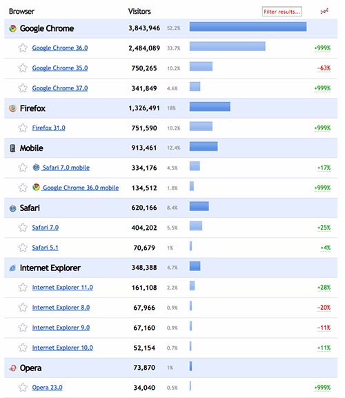
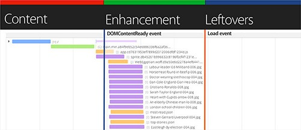
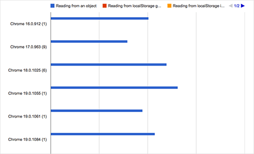
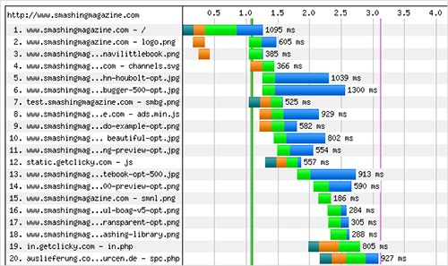
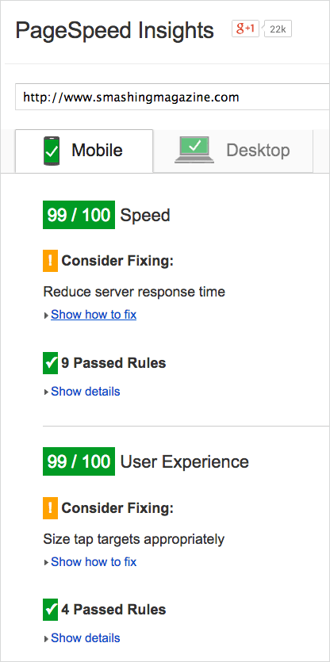
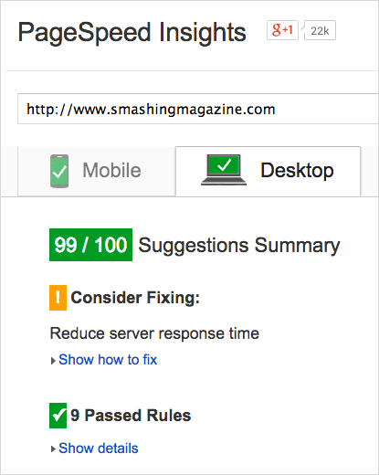
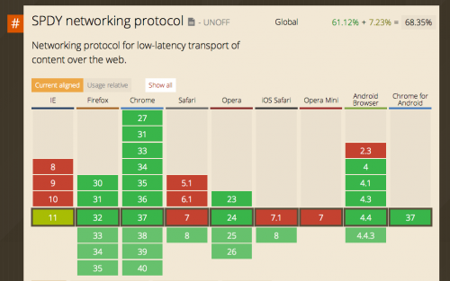

Improving Smashing Magazine's Performance: A Case Study

## [Improving Smashing Magazine’s Performance: A Case Study](https://www.smashingmagazine.com/2014/09/improving-smashing-magazine-performance-case-study/)

- By [Vitaly Friedman](https://www.smashingmagazine.com/author/vitaly-friedman/)
- September 8th, 2014
- [CSS,](https://www.smashingmagazine.com/tag/css/)[Performance,](https://www.smashingmagazine.com/tag/performance/)[Responsive Web Design](https://www.smashingmagazine.com/tag/responsive-web-design/)
- [96 Comments](https://www.smashingmagazine.com/2014/09/improving-smashing-magazine-performance-case-study/#comments)

Advertisement

  Create a website to showcase your work. Make your next move with a beautiful website from Squarespace. [Start your free trial today. →](https://auslieferung.commindo-media-ressourcen.de/www/delivery/ck.php?oaparams=2__bannerid=14382__zoneid=22__OXLCA=1__cb=384f85fee1__oadest=https%3A%2F%2Fad.atdmt.com%2Fc%2Fgo%3Bp%3D11237205124810%3Bev.a%3D1%3Bidfa%3D%3Baaid%3D%3Bidfa_lat%3D%3Baaid_lat%3D%3Bcache%3D384f85fee1)

*Today Smashing Magazine turns eight years old. Eight years is a long time on the web, yet for us it really doesn’t feel like a long journey at all. Things have changed, evolved and moved on, and we gratefully take on new challenges one at a time. To mark this special little day, we’d love to share a few things that we’ve learned over the last year about the **performance challenges** of this very website and about the work we’ve done recently. If you want to craft a fast responsive website, you might find a few interesting nuggets worth considering. – Ed.*

### Further reading on Smashing: [Link](https://www.smashingmagazine.com/2014/09/improving-smashing-magazine-performance-case-study/#further-reading-on-smashing)

- [Perceived Performance](https://www.smashingmagazine.com/2015/09/why-performance-matters-the-perception-of-time/)
- [Perception Management](https://www.smashingmagazine.com/2015/11/why-performance-matters-part-2-perception-management/)
- [Preload: What is it good for?](https://www.smashingmagazine.com/2016/02/preload-what-is-it-good-for/)
- [Getting Ready For HTTP/2](https://www.smashingmagazine.com/2016/02/getting-ready-for-http2/)
- [Front-End Performance Checklist 2017](https://www.smashingmagazine.com/2016/12/front-end-performance-checklist-2017-pdf-pages/)

Improvement is a matter of steady, ongoing iteration. When we redesigned Smashing Magazine back in 2012, our main goal was to establish trustworthy branding that would reflect the ambitious editorial direction of the magazine. We did that primarily by focusing on crafting a delightful reading experience. Over the years, our focus hasn’t changed a bit; however, that very asset that helped to establish our branding turned into a major **performance bottleneck**.

### Good Old-Fashioned Website Decay [Link](https://www.smashingmagazine.com/2014/09/improving-smashing-magazine-performance-case-study/#good-old-fashioned-website-decay)

Looking back at the early days of our redesign, some of our decisions seem to be quick’n’dirty fixes rather than sound long-term solutions. Our advertising constraints pushed us to compromises. Legacy browsers drove us to dependencies on (relatively) heavy JavaScript libraries. Our technical infrastructure led us to heavily customized WordPress plugins and complex PHP logic. With every new feature added, our technical debt grew, and our style sheets, markup and JavaScript weren’t getting any leaner.

Sound familiar? Admittedly, responsive web design as a technique often gets a **pretty bad rap** for bloating websites and making them difficult to maintain. (Not that non-responsive websites are any different, but that’s another story.) In practice, all assets on a responsive website will show up pretty much everywhere: be it a slow smartphone, a quirky tablet or a fancy laptop with a Retina screen. And because media queries merely provide the ability to *respond* to screen dimensions — and do not, rather, have a more local, self-contained scope — adding a new feature and adjusting the reading experience potentially means going through each and every media query to prevent inconsistencies and fix layout issues.

#### “Mobile First” Means “Always Mobile First” [Link](https://www.smashingmagazine.com/2014/09/improving-smashing-magazine-performance-case-study/#mobile-first-means-always-mobile-first)

When it comes to setting priorities for the content and functionality on a website, “mobile first” is one of those difficult yet incredibly powerful constraints that help you focus on what really matters, and identify critical components of your website. We discovered that designing mobile first is one thing; building mobile first is an entirely different story. In our case, both the design and development phases were heavily mobile first, which helped us to focus tightly on the content and its presentation. But while the design process was quite straightforward, implementation proved to be quite difficult.

Because the entire website was built mobile first, we quickly realized that adding or changing components on the page would entail going through the mobile-first approach for every single (minor and major) design decision. We’d design a new component in a mobile view first, and then design an “extended” view for the situations when more space is available. Often that meant adjusting media queries with every single change, and more often it meant adding new stuff to style sheets and to the markup to address new issues that came up.

*Shortly after the new SmashingMag redesign went live, we ran into performance issues. An [article by Tim Kadlec from 2012](http://timkadlec.com/2012/01/work-to-be-done/) shows just that.*

We found ourselves trapped: development and maintenance were taking a lot of time, the code base was full of minor and major fixes, and the infrastructure was becoming too slow. We ended up with a code base that had become bloated before the redesign was even released — [very bloated](http://timkadlec.com/2012/01/work-to-be-done/), in fact.

Advertisement

  Make your next move. Make your next website. Create an impressive portfolio website with the all-in-one platform. [Start your free trial today. →](https://auslieferung.commindo-media-ressourcen.de/www/delivery/ck.php?oaparams=2__bannerid=14383__zoneid=110__OXLCA=1__cb=176775a4db__oadest=https%3A%2F%2Fad.atdmt.com%2Fc%2Fgo%3Bp%3D11237205124809%3Bev.a%3D1%3Bidfa%3D%3Baaid%3D%3Bidfa_lat%3D%3Baaid_lat%3D%3Bcache%3D176775a4db)

### Performance Issues [Link](https://www.smashingmagazine.com/2014/09/improving-smashing-magazine-performance-case-study/#performance-issues)

In mid-2013, our home page weighed 1.4 MB and produced 90 HTTP requests. It just wasn’t performing well. We wanted to create a remarkable reading experience on the website while avoiding the *flash of unstyled text* (FOUT), so web fonts were loaded in the header and, hence, were blocking the rendering of content (actually it’s correct behaviour according to the [spec](http://www.w3.org/TR/resource-priorities/#intro-download-priority), designed to avoid multiple repaints and reflows.) **jQuery was required for ads** to be displayed, and a few JavaScripts depended on jQuery, so they all were blocking rendering as well. Ads were loaded and rendered *before* the content to ensure that they appeared as quickly as possible.

Images delivered by our ad partners were usually heavy and unoptimized, slowing down the page further. We also loaded Respond.js and Modernizr to deal with legacy browsers and to enhance the experience for smart browsers. As a result, articles were almost inaccessible on slow and unstable networks, and the start rendering time on mobile was disappointing at best.

It wasn’t just the front-end that was showing its age though. The back-end wasn’t getting any better either. In 2012 we were playing with the idea of having fully independent sections of the magazine — sections that would live their own lives, evolving and growing over time as independent WordPress installations, with custom features and content types that wouldn’t necessarily be shared across all sections.

*Yes, we do enjoy a quite savvy user base, so optimization for IE8 is really not an issue. [Large view.](https://www.smashingmagazine.com/wp-content/uploads/2014/09/browser-stats.png)*

Because WordPress multi-install wasn’t available at the time, we ended up with six independent, autonomous WordPress installs with six independent, autonomous style sheets. Those installs were connected to 6 × 2 databases (a media server and a static content server). We ran into dilemmas. For example, what if an author wrote for two sections and we’d love to show their articles from both sections on one single author’s bio page? Well, we’d need to somehow pull articles from both installs and add redirects for each author’s page to that one unified page, or should we just be using one of those pages as a “host”? Well, you know where this is going: increasing complexity and increasing maintenance costs. In the end, the sections didn’t manage to evolve significantly — at least not in terms of content — yet we had already customized technical foundation of each section, adding to the CSS dust and PHP complexity.

(Because we had outsourced WordPress tasks, some plugins depended on each other. So, if we were to deactivate one, we might have unwittingly disabled two or three others in the process, and they would have to be turned back on in a particular order to work properly. There were even differences in the HTML outputted by the PHP templates behind the curtains, such as classes and IDs that differed from one installation to the next. It’s no surprise that this setup made development a bit frustrating.)

The traffic was stagnant, readers kept complaining about the performance on the site and only a very small portion of users visited more than 2 pages per visit. The visual feedback when browsing the site was *visible* and surely wasn’t instant, and this lag has been driving readers away from the site to Instapaper and Pocket — both on mobile and desktop. We knew that because we asked our readers, and the feedback was quite clear (and a bit frustrating).

It was time to push back — heavily, with a **major refactoring of the code base**. We looked closely under the hood, discovering a few pretty scary (and nasty) things, and started fixing issues, one by one. It took us quite a bit of time to make things right, and we learned quite a few things along the way.

### Switching Gears [Link](https://www.smashingmagazine.com/2014/09/improving-smashing-magazine-performance-case-study/#switching-gears)

Up until mid-2013, we weren’t using a CSS preprocessor, nor any build tools. Good long-term solutions require a good long-term foundation, so the first issues we tackled were tooling and the way the code base was organized. Because a number of people had been working on the code base over the years, some things proved to be rather mysterious… or challenging, to say the least.

We started with a **code inventory**, and we looked thoroughly at every single class, ID and CSS selector. Of course, we wanted to build a system of modular components, so the first task was to turn our seven large CSS files into maintainable, well-documented and easy-to-read modules. At the time, we’d chosen LESS, for no particular reason, and so our front-end engineer [Marco](https://twitter.com/nice2meatu) started to rewrite CSS and build a modular, scalable architecture. Of course, we could very well have used Sass instead, but Marco felt quite comfortable with LESS at the time.

With a new CSS architecture, [Grunt](https://www.smashingmagazine.com/2013/10/29/get-up-running-grunt/) as a build tool and a [few](https://github.com/gruntjs/grunt-contrib-less)  [time-saving](https://github.com/nDmitry/grunt-autoprefixer)  [Grunt](https://github.com/gruntjs/grunt-contrib-cssmin)  [tasks](https://github.com/gruntjs/grunt-contrib-watch), the task of maintaining the entire code base became much easier. We set up a brand new testing environment, synced up everything with GitHub, assigned roles and permissions, and started digging. We rewrote selectors, reauthored markup, and refactored and optimized JavaScript. And yes, it took us quite some time to get things in order, but it really wouldn’t have been so difficult if we hadn’t had a number of very different stylesheets to deal with.

#### The Big Back-End Cleanup [Link](https://www.smashingmagazine.com/2014/09/improving-smashing-magazine-performance-case-study/#the-big-back-end-cleanup)

With the introduction of Multisite, creating a single WordPress installation from our six separate installations became a necessary task for our friends at [Inpsyde](http://inpsyde.com/en/). Over the course of five months, Christian Brückner and Thomas Herzog cleaned up the PHP templates, kicked unnecessary plugins into orbit, rewrote plugins we had to keep and added new ones where needed. They cleared the databases of all the clutter that the old plugins had created — one of the databases weighed in at **70 GB** (no, that’s not a typo; we do mean gigabytes) — merged all of the databases into one, and then created a single fresh and, most importantly, *maintainable* WordPress Multisite installation.

The speed boost from those optimizations was remarkable. We are talking about **400 to 500 milliseconds of improvement** by avoiding sub-domain redirects and unifying the code base and the back-end code. Those [redirects](https://twitter.com/markodugonjic/statuses/478980625215782912) are indeed a major performance culprit, and just avoiding them is one of those techniques that usually boost performance significantly because you avoid full DNS lookups, improve time to first byte and reduce round trips on the network.

Thomas and Christian also refactored our entire WordPress theme according to the coding standard of their own theme architecture, which is basically a sophisticated way of writing PHP based on the WordPress standard. They wrote custom drop-ins that we use to display content at certain points in the layout. Writing the PHP strictly according to WordPress’ official API felt like getting out of a horse-drawn carriage and into a race car. All modifications were done without ever touching WordPress’ core, which is wonderful because we’ll never have to fear updating WordPress itself anymore.

*We’ve also marked a few millions spam comments across all the sections of the magazine. And before you ask: no, we did not import them into the new install.*

We migrated the installations during a slow weekend in mid-April 2014. It was a huge undertaking, and our server had a few hiccups during the process. We brought together over 2500 articles, including about 15,000 images, all spread over six databases, which also had a few major inconsistencies. While it was a very rough start at first — a lot of redirects had to be set up, caching issues on our server piled up, and some articles got lost between the old and new installations — the result was well worth the effort.

Our editorial team, primarily [Iris](https://twitter.com/smash_it_on), [Melanie](https://twitter.com/mel_in_media) and [Markus](https://twitter.com/indysigner), worked very hard to **bring those lost articles back to life** by analyzing our 404s with Google Webmaster Tools. We spent a few weekends to ensure that every single article was recovered and remains accessible. Losing articles, including their comments, was simply unacceptable.

We know well how much time it takes for a good article to get published, and we have a lot of respect for authors and their work, and ensuring that the content remains online was a **matter of respect for the work published**. It took us a few weeks to get there and it wasn’t the most enjoyable experience for sure, but we used the opportunity to introduce more consistency in our information architecture and to adjust tags and categories appropriately. (Ah, if you do happen to find an article that has gotten lost along the way, please [do let us know](http://www.twitter.com/smashingmag) and we’ll fix it right away. Thanks!)

### Front-End Optimization [Link](https://www.smashingmagazine.com/2014/09/improving-smashing-magazine-performance-case-study/#front-end-optimization)

In April 2014, once the new system was in place and had been running smoothly for a few days, we rewrote the LESS files based on what was left of all of the installs. Streamlining the classes for posts and pages, getting rid of all unneeded IDs, shortening selectors by lowering their specificity, and rooting out anything in the CSS we could live without crunched the CSS from 91 KB down to a mere 45 KB.

Once the CSS code base was in proper shape, it was time to reconsider how assets are loaded on the page and how we can improve the start rendering time beyond having clean, well-structured code base. Given the nightmare we experienced with the back-end previously, you might assume that improving performance now would have been a complex, time-consuming task, but actually it was quite a bit easier than that. Basically, it was just a matter of **getting our priorities right** by optimizing the critical rendering path.

The key to improving performance was to focus on what matters most: the content, and the fastest way for readers to actually start reading our articles on their devices. So over a course of a few months we kept reprioritizing. With every update, we introduced mini-optimizations based on a very simple, almost obvious principle: **optimize the delivery of content, and defer the rest** — without any compromises, anywhere.

Our optimizations were heavily influenced by the [work done by Scott Jehl](https://github.com/scottjehl), as well as [The Guardian](https://github.com/guardian) and the [BBC](https://github.com/BBC-News) teams (both of which open-sourced their work). While Scott [has been sharing valuable insight](http://filamentgroup.com/lab/performance-rwd.html) into the front-end techniques that Filament Group was using, the BBC and The Guardian helped us to define and refine the concept of the **core experience** on the website and use it as a baseline. A shared main goal was to deliver the content as fast as possible to as many people as possible regardless of their device or network capabilities, and enhance the experience with progressive enhancement for capable browsers.

However, historically we haven’t had a lot of JavaScript or complex interactions on Smashing Magazine, so we didn’t feel that it was necessary to introduce complex loading logic with JavaScript preloaders. However, being a content-focused website, we *did* want to reduce the time necessary for the articles to start displaying as far as humanly possible.

#### Performance Budget: Speed Index <= 1000 [Link](https://www.smashingmagazine.com/2014/09/improving-smashing-magazine-performance-case-study/#performance-budget-speed-index-1000)

[How fast is fast enough?](http://timkadlec.com/2014/01/fast-enough/) Well, that’s a tough question to answer. In general, it’s quite difficult to visualize performance and explain why every millisecond counts—unless you have hard data. At the same time, falling into trap of absolutes and relying on not truly useful performance metrics is easy. In the past, the most commonly cited performance metric was average loading time. However, on its own, average loading time isn’t *that* helpful because it doesn’t tell you much about when a user can actually start using the website. This is why talking about “fast enough” is often so tricky.

*A nice way of visualizing performance is to use WebPageTest to generate an actual video of the page loading and run a test between two competing websites. Besides, the [Speed Index metric](https://sites.google.com/a/webpagetest.org/docs/using-webpagetest/metrics/speed-index) often proves to be very useful.*

Different components require different amounts of time to load, yet some components of the page are more important than others. E.g. you don’t need to load the *footer content* fast, but it’s a good idea to render the visible portion of the page fast. You know where it’s heading: of course, we are talking about the “above the fold” view here. As [Ilya Grigorik once said](http://www.lukew.com/ff/entry.asp?1756), “We don’t need to render the entire page in one second, [just] the above the fold content.” To achieve that, according to Scott’s research and Google’s test results, it’s helpful to set ambitious performance goals:

- On [WebPageTest](http://www.webpagetest.org/), aim for a [Speed Index](https://sites.google.com/a/webpagetest.org/docs/using-webpagetest/metrics/speed-index) value of under 1000.
- Ensure that all HTML, CSS and JavaScript fit within the first 14 KB.

What does it mean and why are they important? According to HCI research, “for an application to feel instant, a perceptible response to user input must be provided [within hundreds of milliseconds](http://chimera.labs.oreilly.com/books/1230000000545/ch10.html#SPEED_PERFORMANCE_HUMAN_PERCEPTION). After a second or more, the user’s flow and engagement with the initiated task feels broken.” With the first goal, we are trying to ensure an instant response on our website. It refers to the so-called *Speed Index* metric for the *start rendering* time — the average time (in ms) at which visible parts of the page are displayed, or become accessible. So the first goal basically reflects that a page **starts rendering** under 1000ms, and yes, it’s a quite difficult challenge to take on.

*Ilya Grigorik’s book [High Performance Browser Networking](http://chimera.labs.oreilly.com/books/1230000000545) is a very helpful guide with useful guidelines and advice on making websites fast. And it’s available as a free HTML book, too.*

The second goal can help in achieving the first one. The value of 14 KB has been [measured empirically](https://www.youtube.com/watch?v=YV1nKLWoARQ) by Google and is the threshold for the first package exchanged between a server and client via towers on a cellular connection. You don’t need to include images within 14 Kb, but you might want to deliver the markup, style sheets and any JavaScript required to render the visible portion of the page in that threshold. Of course, in practice this value can only realistically be achieved with gzip compression.

By combining the two goals, we basically defined a **performance budget** that we set for the website — a threshold for what was acceptable. Admittedly, we didn’t concern ourselves with the start rendering time on different devices on various networks, mainly because we really wanted to push back as far as possible everything that isn’t required to start rendering the page. So, the ideal result would be a Speed Index value that is *way* lower than the one we had set — as low as possible, actually — in all settings and on all connections, both shaky and stable, slow and fast. This might sound naive, but we wanted to figure out how fast we *could* be, rather than how fast we *should* be. We did measure start rendering time for first and subsequent page loads, but we did that much later, after optimizations had already been done, and just to keep track of issues on the front-end.

Our next step would be to integrate Tim Kadlec’s [Perf-Budget Grunt task](http://timkadlec.com/2014/05/performance-budgeting-with-grunt/) to incorporate the performance budget right into the build process and, thus, run every new commit against WebPagetest’s performance benchmark. If it fails, we know that a new feature has slowed us down, so we probably have to reconsider how it’s implemented to fit it within our budget, or at least we know where we stand and can have meaningful discussions about its impact on the overall performance.

#### Prioritization And Separation Of Concerns [Link](https://www.smashingmagazine.com/2014/09/improving-smashing-magazine-performance-case-study/#prioritization-and-separation-of-concerns)

If you’ve been following *The Guardian*‘s work recently, you might be familiar with the strict separation of concerns that they [introduced](https://speakerdeck.com/andyhume/anatomy-of-a-responsive-page-load-whiskyweb-2013) during the major 2013 redesign. The Guardian [separated](https://vimeo.com/77967591) its entire content into three main groups:

- **Core content**

Essential HTML and CSS, usable non-JavaScript-enhanced experience

- **Enhancement**

JavaScript, geolocation, touch support, enhanced CSS, web fonts, images, widgets

- **Leftovers**

Analytics, advertising, third-party content

*A strict separation of concerns, or loading priorities, as defined by The Guardian team. [Large view.](https://www.smashingmagazine.com/wp-content/uploads/2014/09/separation-concerns.png)*

Once you have defined, confirmed and agreed upon these priorities, you can push performance optimization quite far. Just by being very specific about each type of content you have and by clearly defining what **“core content”** is, you are able to load *Core content* as quickly as possible, then load *Enhancements* once the page starts rendering (after the `DOMContentLoaded` event fires), and then load *Leftovers* once the page has fully rendered (after the `load` event fires).

The main principle here of course is to **strictly separate the loading of assets** throughout these three phases, so that the loading of the *Core content* should never be blocked by any resources grouped in *Enhancement* or *Leftovers* (we haven’t achieved the perfect separation just yet, but we are on it). In other words, you try to shorten the critical rendering path that is required for the content to start displaying by pushing the content down the line as fast as possible and deferring pretty much everything else.

We followed this same separation of concerns, grouping our content types into the same categories and identifying what’s critical, what’s important and what’s secondary. In our case, we identified and separated content in this way:

- **Core content**

Only essential HTML and CSS

- **Enhancement**

JavaScript, code syntax highlighter, full CSS, web fonts, comment ratings

- **Leftovers**

Analytics, advertising, Gravatars

Once you have this simple **content/functionality priority list**, improving performance is becoming just a matter of adding a few snippets for loading assets to properly reflect those priorities. Even if your server logic forces you to load all assets on all devices, by focusing on content delivery first, you ensure that the content is accessible quickly, while everything else is deferred and loaded in the background, after the page has started rendering. From a strategic perspective, the list also reflects your technical debt, as well as critical issues that slow you down. Indeed, we had quite a list of issues to deal with already at this point, so it transformed fairly quickly into a list of content priorities. And a rather tricky issue sat right at the top of that list: good ol’ web fonts.

### Deferring Web Fonts

Despite the fact that the proportion of Smashing Magazine’s readers on mobile has always been quite modest (just around 15%—mainly due to the length of articles), we never considered mobile as an afterthought, but we never pushed user experience on mobile either. And when we talk about user experience on mobile, we mostly talk about speed, since typography was pretty much well designed from day one.

We had conversations during the 2012 redesign about how to deal with fonts, but we couldn’t find a solution that made everybody happy. The visual appearance of content was important, and because the new Smashing Magazine was all about beautiful, rich typography, not loading web fonts at all on mobile wasn’t really an option.

With the redesign back then, we switched to Skolar for headings and Proxima Nova for body copy, delivered by Fontdeck. Overall, we had three fonts for each typeface — Regular, Italic and Bold — totalling in six font files to be delivered over the network. Even after our dear friends at Fontdeck subsetted and optimized the fonts, the assets were quite heavy with over 300 KB in total, and because we wanted to avoid the frequent flash of unstyled text (FOUT), we had them loaded in the header of every page. Initially we thought that the fonts would reliably be cached in HTTP cache, so they wouldn’t be retrieved with every single page load. Yet it turned out that **HTTP cache was quite unreliable**: the fonts showed up in the waterfall loading chart every now and again for no apparent reason, both on desktop and on mobile.

The biggest problem, of course, was that the fonts were [blocking rendering](http://ianfeather.co.uk/web-fonts-and-the-critical-path/). Even if the HTML, CSS and JavaScript had already loaded completely, the content wouldn’t appear until the fonts had loaded and rendered. So you had this beautiful experience of seeing link underlines first, then a few keywords in bold here and there, then subheadings in the middle of the page and then finally the rest of the page. In some cases, when Fontdeck had server issues, the content didn’t appear at all, even though it was already sitting in the DOM, waiting to be displayed.

*In his article, [Web Fonts and the Critical Path](http://ianfeather.co.uk/web-fonts-and-the-critical-path/), Ian Feather provides a very detailed overview of the FOUT issues and font loading solutions. We tested them all.*

We experimented with a few solutions before settling on what turned out to be perhaps the most difficult one. At first, we looked into using Typekit and Google’s [WebFontLoader](https://github.com/typekit/webfontloader), an asynchronous script which gives you more granular control of what appears on the page while the fonts are being loaded. Basically, the script adds a few classes to the `body` element, which allows you to specify the styling of content in CSS during the loading and after the fonts have loaded. So you can be very precise about how the content is displayed in fallback fonts first, before users see the switch from fallback fonts to web fonts.

We added **fallback fonts declarations** and ended up with pretty verbose CSS font stacks, using iOS fonts, Android fonts, Windows Phone fonts and good ol’ web-safe fonts as fallbacks — we are still using these font stacks today. E.g. we used this cascade for the main headings (it reflects the order of popularity of mobile operating systems in our analytics):

	h2 {
	   font-family: "Skolar Bold",
	   AvenirNext-Bold, "Avenir Bold",
	   "Roboto Slab", "Droid Serif",
	   "Segoe UI Bold",
	   Georgia, "Times New Roman", Times, serif;
	}

So readers would see a mobile OS font (or any other fallback font first), and it probably would be a font that they are quite familiar with on their device, and then once the fonts have loaded, they would see a switch, triggered by WebFontLoader. However, we discovered that after switching to WebFontLoader, we started seeing FOUT way too often, with HTTP cache being quite unreliable again, and that permanent switch from a fallback font to the web font being quite annoying, basically ruining the reading experience.

So we looked for alternatives. One solution was to **include the @font-face directive only on larger screens** by wrapping it in a media query, thus avoiding loading web fonts on mobile devices and in legacy browsers altogether. (In fact, if you declare web fonts in a media query, they will be loaded only when the media query matches the screen size. So no performance hit there.) Obviously it helped us improve performance on mobile devices in no time, but we didn’t feel right with having a “simplified” reading experience on mobile devices. So it was a no-go, too.

What else could we do? The only other option was to **improve the caching of fonts**. We couldn’t do much with HTTP cache, but there was one option we hadn’t looked into: storing fonts in AppCache or localStorage. Jake Archibald’s article on the beautiful [complexity of AppCache](http://alistapart.com/article/application-cache-is-a-douchebag) led us away from AppCache to experiment with localStorage, a [technique](https://github.com/ahume/webfontjson) that The Guardian’s team was using at the time.

Now, offline caching comes with one major requirement: you need to *have* the actual font files to be able to cache them locally in the client’s browser. And you can’t cache *a lot* because [localStorage space is very limited](http://www.html5rocks.com/en/tutorials/offline/quota-research/), sometimes with just 5Mb available per domain. Luckily, the Fontdeck guys were very helpful and forthcoming with our undertaking, so despite the fact that font delivery services usually require you to load files and have a synchronous or asynchronous callback to count the number of impressions, Fontdeck has been perfectly fine with us grabbing WOFF-files from Google Chrome’s cache and setting up a “flat” pricing based on the number of page impressions in recent history.

So we grabbed the WOFF files and embedded them, base64-encoded, in a single CSS file, moving from six external HTTP-requests with about 50 KB file each to at most one HTTP request on the first load and **400 KB of CSS**. Obviously, we didn’t want this file to be loaded on every visit. So if localStorage is available on the user’s machine, we store the entire CSS file in localStorage, set a cookie and switch from the fallback font to the web font. This switch usually happens once at most because for the consequent visits, we check whether the cookie has been set and, if so, retrieve the fonts from localStorage (causing about 50ms in latency) and display the content in the web font right away. Just before you ask: yes, [read/write to localStorage is much slower than retrieving files from HTTP cache](https://github.com/addyosmani/basket.js/issues/24), but it proved to be a bit more reliable in our case.

*Yes, [localStorage is much slower than HTTP cache](https://github.com/addyosmani/basket.js/issues/24), but it’s more reliable. Storing fonts in localStorage isn’t the perfect solution, but it helped us improve performance dramatically.*

If the browser doesn’t support localStorage, we include fonts with good ol’ `link href` and, well, frankly just hope for the best — that the fonts will be properly cached and persist in the user’s browser cache. For [browsers that don’t support WOFF](http://caniuse.com/#search=woff) (IE8, Opera Mini, Android <= 4.3), we provide external URLs to fonts with older font mime types, hosted on Fontdeck.

Now, if localStorage is available, we still don’t want it to be blocking the rendering of the content. And we don’t want to see FOUT every single time a user loads the page. That’s why we have a little JavaScript snippet in the header before the `body` element: it checks whether a cookie has been set and, if not, we load web fonts asynchronously after the page has started rendering. Of course, we could have avoided the switch by just storing the fonts in localStorage on the first visit and have no switch during the first visit, but we decided that one switch is acceptable, because our typography is important to our identity.

The script was written, tested and documented by our good friend [Horia Dragomir](https://twitter.com/hdragomir). Of course, it’s [available as a gist on GitHub](https://gist.github.com/hdragomir/8f00ce2581795fd7b1b7):

	

During the testing of the technique, we discovered a few surprising problems. Because the **cache isn’t persistent in WebViews**, fonts do load asynchronously in applications such as Tweetdeck and Facebook, yet they don’t remain in the cache once the window is closed. In other words, with every WebViews visit, the fonts are re-downloaded. Some old Blackberry devices seemed to clear cookies and delete the cache when the battery is running out. And depending on the configuration of the device, sometimes fonts do not persist in mobile Safari either.

Still, once the snippet was in place, articles started rendering much faster. By deferring the loading of Web fonts and storing them in localStorage, we’ve **avoided around 700ms delay**, and thus shortened the critical path significantly by avoiding the latency for retrieving all the fonts. The result was quite impressive for the first load of an uncached page, and it was even more impressive for concurrent visits since we were able to reduce the latency caused by Web fonts to just 40 to 50 ms. In fact, if we had to mention just one improvement to performance on the website, deferring web fonts is by far the most effective.

At this point, we haven’t even considered using the new [WOFF2 format](https://gist.github.com/sergejmueller/cf6b4f2133bcb3e2f64a) for fonts just yet. Currently supported in Chrome and Opera, it promises a better compression for font files and it already showed remarkable results. In fact, The Guardian was able to [cut down on 200ms latency and 50 KB of the file weight](https://twitter.com/patrickhamann/status/497767778703933442) by switching to WOFF2, and we intend to look into moving to WOFF2 soon as well.

Of course, grabbing WOFFs might not always be an option for you, but it wouldn’t hurt just to talk to type foundries to see where you stand or to work out a deal to host fonts “locally.” Otherwise, tweaking WebFontLoader for Typekit and Fontdeck is definitely worth considering.

### Dealing With JavaScript [Link](https://www.smashingmagazine.com/2014/09/improving-smashing-magazine-performance-case-study/#dealing-with-javascript)

With the goal of removing all unnecessary assets from the critical rendering path, the second target we decided to deal with was JavaScript. And it’s not like we particularly dislike JavaScript for some reason, but we always tend to prefer non-JavaScript solutions to JavaScript ones. In fact, if we can avoid JavaScript or replace it with CSS, then we’ll always explore that option.

Back in 2012, we weren’t using a lot of scripts on the page, yet displaying advertising via OpenX depended on jQuery, which made it way too easy to lazily approach simple, straightforward tasks with ready-to-use jQuery plugins. At the time, we also used Respond.js to emulate responsive behaviour in legacy browsers. However, Internet Explorer 8 usage has dropped significantly between 2012 and 2014: with 4.7% before the redesign, it was now 1.43%, with a dropping tendency every single month. So we decided to deliver a fixed-width layout with a specific IE8.css stylesheet to those users, and removed Respond.js altogether.

As a strategic decision, we decided to **defer the loading of all JavaScripts until the page has started rendering** and we looked into replacing jQuery with lightweight modular JavaScript components.

jQuery was tightly bound to ads, and ads were supposed to start displaying as fast as possible, so to make it happen, we had to deal with advertising first. The decision to defer the loading of ads wasn’t easy to get agreement on, but we managed to make a convincing argument that better performance would increase click rates because users would see the content sooner. That is, on every page, readers would be attracted by the high-quality content and then, when the ads kick in, would pay attention to those squares in the sidebar as well.

[Florian Sander](http://www.kreativrauschen.de/), our partner in crime when it comes to advertising, rewrote the script for our banner ads so that banners would be loaded only after the content has started rendering, and only then the advertising spots would be put into place. Florian was able to get rid of two render-blocking HTTP-requests that the ad-script normally generated, and we were able to remove the dependency on jQuery by rewriting the script in vanilla JavaScript.

Obviously, because the sidebar’s ad content is generated on the fly and is loaded after the render tree has been constructed, we started seeing **reflows** (this still happens when the page is being constructed). Because we used to load ads before the content, the entire page (with pretty much everything) used to load at once. Now, we’ve moved to a more modular structure, grouping together particular parts of the page and queuing them to load after each other. Obviously, this has made the overall experience on the site a bit noisier because there are a few jumps here and there, in the sidebar, in the comments and in the footer. That was a compromise we went for, and we are working on a solution to reserve space for “jumping” elements to avoid reflows as the page is being loaded.

#### Deferring Non-Critical JavaScript [Link](https://www.smashingmagazine.com/2014/09/improving-smashing-magazine-performance-case-study/#deferring-non-critical-javascript)

When the prospect of removing jQuery altogether became tangible as a long-term goal, we started working step by step to decouple jQuery dependencies from the library. We rewrote the script to generate footnotes for the print style sheet (later replacing it with a PHP solution), rewrote the functionality for rating comments, and rewrote a few other scripts. Actually, with our savvy user base and a solid share of smart browsers, we were able to move to vanilla JavaScript quite quickly. Moreover, we could now move scripts from the header to the footer to avoid blocking construction of the DOM tree. In mid-July, we removed jQuery from our code base entirely.

We wanted full control of what is loaded on the page and when. Specifically, we wanted to ensure that no JavaScript blocks the rendering of content at any point. So, we use the [Defer Loading JavaScript](http://www.feedthebot.com/pagespeed/defer-loading-javascript.html) script to load JavaScript after the `load` event by injecting the JavaScript after the DOM and CSSOM have already been constructed and the page has been painted. Here’s the snippet that we use on the website, with the `defer.js` script (which is loaded asynchronously after the `load` event):

	function downloadJSAtOnload() {
	   var element = document.createElement("script");
	   element.src = "defer.js";
	   document.body.appendChild(element);
	}
	if (window.addEventListener)
	   window.addEventListener("load", downloadJSAtOnload, false);
	else if (window.attachEvent)
	   window.attachEvent("onload", downloadJSAtOnload);
	else
	   window.onload = downloadJSAtOnload;

However, because [script-injected asynchronous scripts are considered harmful](https://www.igvita.com/2014/05/20/script-injected-async-scripts-considered-harmful/) and slow (they block the browser’s speculative parser), we might be looking into using the good ol’ `defer` and `async` attributes instead. In the past, we couldn’t use `async` for every script because we needed jQuery to load before its dependencies; so, we used `defer`, which respects the loading order of scripts. With jQuery out of the picture, we can now load scripts asynchronously, and fast. Actually by the time you read this article, we might already be using `async`.

Basically, we just deferred the loading of all JavaScripts that we identified previously, such as syntax highlighter and comment ratings, and cleared a path in the header for HTML and CSS.

### Inlining Critical CSS [Link](https://www.smashingmagazine.com/2014/09/improving-smashing-magazine-performance-case-study/#inlining-critical-css)

That wasn’t good enough, though. Performance did improve dramatically; however, even with all of these optimizations in place, we didn’t hit that magical Speed Index value of under 1000. In light of the ongoing discussion about inline CSS and above-the-fold CSS, as [recommended by Google](https://developers.google.com/web/fundamentals/performance/critical-rendering-path/page-speed-rules-and-recommendations), we looked into more radical ways to deliver content quickly. To avoid an HTTP request when loading CSS, we measured how fast the website would be if we were to load critical CSS inline and then load the rest of the CSS once the page has rendered.

*Scott Jehl’s [article](http://www.filamentgroup.com/lab/performance-rwd.html) explains how exactly to extract and inline critical CSS.*

But what exactly is critical CSS? And how do you extract it from a potentially complex code base? As [Scott Jehl points out](http://www.filamentgroup.com/lab/performance-rwd.html), critical CSS is the subset of CSS that is needed to render the top portion of the page across all breakpoints. What does that mean? Well, you would decide on a certain height that you would consider to be “above the fold” content — it could be 600, 800 or 1200 pixels or anything else — and you would collect into their own style sheet all of the styles that specify how to render content within that height across all screen widths.

Then you inline those styles in the `head`, and thus **give the browser everything it needs** to start render that visible portion of the page — within one single HTTP request. You’ve heard it a few times by now: everything else is deferred after the first initial rendering. You avoid an HTTP-request, and you load the full CSS asynchronously, so once the user starts scrolling, the full CSS will (hopefully) already have loaded.

Visually speaking, content will appear to render more quickly, but there will also be **more reflowing and jumping on the page**. So, if a user has followed a link to a particular comment below the “fold”, then they will see a few reflows as the website is being constructed because the page is rendered with critical CSS first (there is just so much we can fit within 14 KB!) and adjusted later with the complete CSS. Of course, inline CSS isn’t cached; so, if you have critical CSS and load the complete CSS on rendering, it’s useful to set a cookie, so that inline styles aren’t inlined with every single load. The drawback of course is that you might have duplicate CSS because you would be defining styles both inline and in the full CSS, unless you’re able to strictly separate them.

Because we had just refactored our CSS code base, identifying critical CSS wasn’t very difficult. Obviously, there are [smart](http://css-tricks.com/authoring-critical-fold-css/)  [tools](https://github.com/addyosmani/above-the-fold-css-tools) that analyze the markup and CSS, identify critical CSS styles and export them into a separate file during the build process, but we were able to do it manually. Again, you have to keep in mind that 14 Kb is your budget for HTML and CSS, so in the end we had to rename a few classes here and there, and compress CSS as well.

We analyzed the first 800px, checking the inspector for the CSS that was needed and separating our style sheet into two files – and actually that was pretty much it. One of those files, *above-the-fold.css*, is minified and compressed, and its content is placed inline in the head of our document as early as possible – not blocking rendering. The other file, our full CSS file, is then loaded with JavaScript after the content has loaded, and if JavaScript isn’t available for some reason or the user is on a legacy browser, we’ve put a full CSS file inside `noscript` tag at the end of the head, so they don’t get an unstyled HTML page.

### Was It All Worth It? [Link](https://www.smashingmagazine.com/2014/09/improving-smashing-magazine-performance-case-study/#was-it-all-worth-it)

Because we’ve just implemented these optimizations, we haven’t been able to measure their impact on traffic, but we’ll publish these results later as well. Obviously, we *did* notice a quite remarkable technical improvement though. By deferring and caching web fonts, inlining CSS and optimizing the critical rendering path for the first 14Kb, we were able to achieve dramatic improvements in loading times. The start rendering time started circling around 1s for an uncached page on 3G and was around 700ms (including latency!) on subsequent loads.

*We’ve been using [WebPageTest](http://www.webpagetest.org/) a lot for running tests. Our waterfall chart was becoming better over time and reflected the priorities we had defined earlier. [Large view.](http://www.webpagetest.org/result/140904_H4_T5R/1/details/)*

On average, Smashing Magazine’s front page makes **45 HTTP-requests** and has **440 KB in bandwidth** on the first uncached load. Because we heavily cache everything but ads, subsequent visits have around 15 HTTP requests and 180 KB of traffic. The First Byte time is still around 300–600ms (which is *a lot*), yet Start Render time is usually [under 0.7s](http://www.webpagetest.org/result/140904_ZJ_T62/) on a DSL connection in Amsterdam (for the very first, uncached load), and usually [under 1.7s on a slow 3G](http://www.webpagetest.org/result/140904_Y5_SXS/). On a fast cable connection, the site [starts rendering within 0.8s](http://www.webpagetest.org/result/140904_DB_T5Y/), and on a fast 3G, [within 1.1s](http://www.webpagetest.org/result/140904_H4_T5R/). Obviously, the results vary significantly depending on the First Byte time which we can’t improve just yet, at the time of writing. That’s the only asset that introduces unpredictability into the loading process, and as such has a decisive impact on the overall performance.

Just by following basic guidelines by our colleagues mentioned above and Google’s recommendations, we were able to achieve the [97–99 Google PageSpeed score](https://developers.google.com/speed/pagespeed/insights/?url=http%3A%2F%2Fwww.smashingmagazine.com&tab=desktop) both on desktop and on mobile. The score varies depending on the quality and the optimization level of advertising assets displayed randomly in the sidebar. Again, the main culprit is the server’s response time — not for long, though.

*After a few optimizations, we achieved a Google PageSpeed score of [99 on mobile](https://developers.google.com/speed/pagespeed/insights/?url=http%3A%2F%2Fwww.smashingmagazine.com&tab=mobile).*

*We got a Google PageSpeed score of [99 on the desktop](https://developers.google.com/speed/pagespeed/insights/?url=http%3A%2F%2Fwww.smashingmagazine.com&tab=desktop) as well.*

By the way, Scott Jehl has also published a [wonderful article on the front-end techniques](http://filamentgroup.com/lab/performance-rwd.html) FilamentGroup uses to extract critical CSS and load it inline while loading the full CSS afterwards and avoid downloading overheads. Patrick Hamann’s [talk on “Breaking News at 1000ms”](https://www.youtube.com/watch?v=dfweWyVScaI) explains a few techniques that The Guardian is using to hit the SpeedIndex 1000 mark. Definitely worth reading and watching, and indeed quite similar to what we implemented on this very site as well.

### Work To Be Done [Link](https://www.smashingmagazine.com/2014/09/improving-smashing-magazine-performance-case-study/#work-to-be-done)

While the results we were able to achieve are quite satisfactory, there is still a lot of work to be done. For example, we haven’t considered optimizing the delivery of images just yet, and are now adjusting our editorial process to integrate the new `picture` element and `srcset`/`sizes` with [Picturefill 2.1.0](http://scottjehl.github.io/picturefill/), to make the loading even faster on mobile devices. At the moment, all images have a fixed width of 500px and are basically scaled down on smaller views. Every image is optimized and compressed, but we don’t deliver different images for different devices — and no, we aren’t delivering any Retina images at all. That is all about to change soon.

While Smashing Magazine’s home page is well optimized, some pages and articles still perform poorly. Articles with many comments are quite slow because we use [Gravatar.com](https://en.gravatar.com/) for comments. Because each Gravatar URL is unique, each comment generates one HTTP request, slowing down the loading of the overall page. We are going to defer the loading of Gravatars and cache them locally with a [Gravatar Cache WordPress plugin](https://wordpress.org/plugins/fv-gravatar-cache/). We might have already done it by the time you read this.

We’re playing around with DNS prefetching and HTML5 preloading to resolve DNS lookups way ahead of time (for example, for Gravatars and advertising). However, we are being careful and hesitant here because we don’t want to create a loading overhead for users on slow or expensive connections. Besides, we’ve added [third-party meta data](http://alistapart.com/article/like-able-content-spread-your-message-with-third-party-metadata) to make our articles a bit easier to share. So, if you link to an article on Facebook, Facebook will pull optimized images, a description and a title from our meta data, which is crafted individually for each article. We’ve also happily noticed that article pages scroll smoothly at [60fps](http://jankfree.org/), and that with relatively large images and ads.

*Yes, [we can use SPDY today](http://caniuse.com/#search=SPDY). We just need to install [SPDY Nginx Module](http://nginx.org/en/docs/http/ngx_http_spdy_module.html) or [Apache SPDY Module](https://code.google.com/p/mod-spdy/). This is what we are going to tackle next.*

Despite all of our optimizations, the main issue still hasn’t been resolved: very slow servers and the First Byte response times. We’ve been experiencing difficulties with our current server setup and architecture but are tied with a long-term contract, yet we will be moving to a new server soon. We’ll take that opportunity to also move to [SPDY](https://developers.google.com/speed/spdy/) on the server, a predecessor of HTTP 2.0 (which is [well supported in major browsers](http://caniuse.com/#search=SPDY), by the way), and we are looking into using a content delivery network as well.

#### Performance Optimization Strategy [Link](https://www.smashingmagazine.com/2014/09/improving-smashing-magazine-performance-case-study/#performance-optimization-strategy)

To sum up, optimizing the performance of Smashing Magazine was quite an effort to figure out, yet many aspects of optimization can be achieved very quickly. In particular, front-end optimization is quite easy and straightforward as long as you have a shared understanding of priorities. Yes, that’s right: you optimize content delivery, and defer everything else.

Strategically speaking, the following could be your performance optimization roadmap:

- Remove blocking scripts from the header of the page.
- Identify and defer non-critical CSS and JavaScript.
- Identify critical CSS and load it inline in the head, and then load the full CSS after rendering. (Make sure to set a cookie to prevent inline styles from loading with every page load.)
- Keep all critical HTML and CSS to under 14 KB, and aim for a Speed Index of under 1000.
- Defer the loading of Web fonts and store them in localStorage or AppCache.
- Consider using WOFF2 to further reduce latency and file size of the web fonts.
- Replace JavaScript libraries with leaner JavaScript modules.
- Avoid unnecessary libraries, and look into options for removing Respond.js and Modernizr; for example, by “[cutting the mustard](http://responsivenews.co.uk/post/18948466399/cutting-the-mustard)” to separate browsers into buckets. Legacy browsers could get a fixed-width layout. [Clever SVG fallbacks](http://css-tricks.com/svg-fallbacks/) also exist.

That’s basically it. By following these guidelines, you can make your responsive website really, *really* fast.

### Conclusion [Link](https://www.smashingmagazine.com/2014/09/improving-smashing-magazine-performance-case-study/#conclusion)

Yes, finding just the right strategy to make this very website fast took a lot of experimentation, blood, sweat and cursing. Our discussions kept circling around next steps and on critical and not-so-critical components and sometimes we had to take three steps back in order to pivot in a different direction. But we learned a lot along the way, and we have a pretty clear idea of where we are heading now, and, most importantly, how to get there.

So here you have it. A little story about the things that happened on this little website over the last year. If you notice any issues, please let us know on Twitter [@smashingmag](http://www.twitter.com/smashingmag) and we’ll hunt them down for good.

Ah, and thanks for keeping us reading throughout all these years. It means *a lot*. You are quite smashing indeed. You should know that.

A big “thank you” to Patrick Hamann and Jake Archibald for the technical review of the article as well as Andy Hume and Tim Kadlec for their fantastic support throughout the years. Also a big “thank you” to our front-end engineer, Marco, for his help with the article and for his thorough and tireless front-end work, which involved many experiments, failures and successes along the way. Also, kind thanks to the Inpsyde team and Florian Sander for technical implementations.

A final thank you goes out to Iris, Melanie, Cosima and Markus for keeping an eye out for those nasty bugs and looking after the content on the website. Without you, this website wouldn’t exist. And thank you for having my back all this time. I respect and value every single bit of it. You rock.

*(al, vf, il)*

[CSS](https://www.smashingmagazine.com/tag/css/)[Performance](https://www.smashingmagazine.com/tag/performance/)[Responsive Web Design](https://www.smashingmagazine.com/tag/responsive-web-design/)

[↑ Back to top](https://www.smashingmagazine.com/2014/09/improving-smashing-magazine-performance-case-study/#top)[Tweet it](https://twitter.com/intent/tweet?original_referer=https://www.smashingmagazine.com/2014/09/improving-smashing-magazine-performance-case-study/&source=tweetbutton&text=Improving%20Smashing%20Magazine%26%238217%3Bs%20Performance%3A%20A%20Case%20Study&url=https://www.smashingmagazine.com/2014/09/improving-smashing-magazine-performance-case-study/&via=smashingmag)[Share on Facebook](http://www.facebook.com/sharer/sharer.php?u=https://www.smashingmagazine.com/2014/09/improving-smashing-magazine-performance-case-study/)