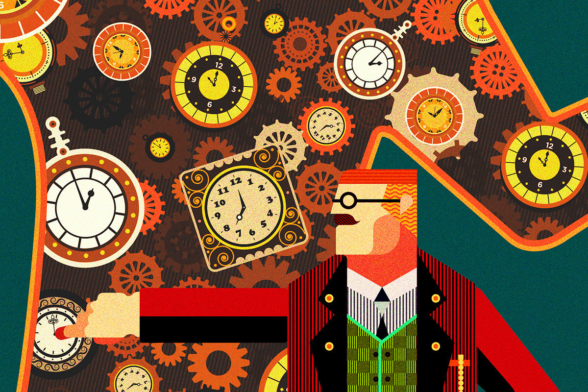
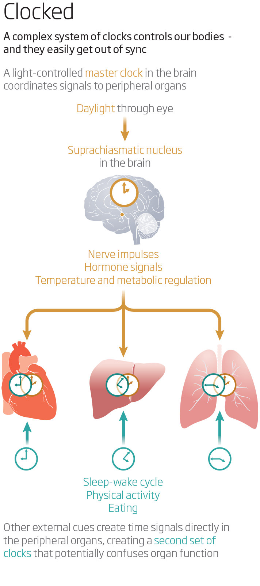
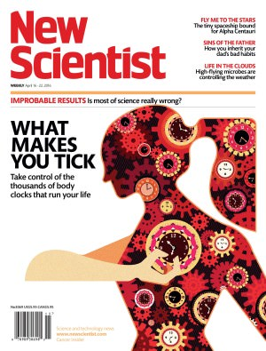

In sync: How to take control of your many body clocks

 [(L)](https://www.newscientist.com/article/mg23030690-300-in-sync-how-to-take-control-of-your-many-body-clocks/#)  [(L)](https://www.newscientist.com/article/mg23030690-300-in-sync-how-to-take-control-of-your-many-body-clocks/#)  [(L)](https://www.newscientist.com/article/mg23030690-300-in-sync-how-to-take-control-of-your-many-body-clocks/#)  [(L)](https://www.newscientist.com/article/mg23030690-300-in-sync-how-to-take-control-of-your-many-body-clocks/#)  [(L)](https://www.newscientist.com/article/mg23030690-300-in-sync-how-to-take-control-of-your-many-body-clocks/#)  [[117](https://www.newscientist.com/article/mg23030690-300-in-sync-how-to-take-control-of-your-many-body-clocks/#)](https://www.newscientist.com/article/mg23030690-300-in-sync-how-to-take-control-of-your-many-body-clocks/#)

[Feature](https://www.newscientist.com/article_type/feature/)

13 April 2016

# In sync: How to take control of your many body clocks

You have not one, but thousands or even millions of body clocks. Learn to control them, and you can tackle problems from jet lag to weight loss

Clocking in: thousands of body clocks make us tick
Jonny Wan
By Catherine de Lange

GERDA POT’S grandmother was a stickler for timekeeping. “She always had breakfast at the same time, lunch and dinner at the same time, but even in between she had tea and coffee breaks every day at the same time,” says Pot. She also aged robustly, living independently well into her 90s. That got Pot wondering: was there something in the regularity of her grandmother’s habits that held the key to her rude health?

[A nutrition researcher at King’s College London](http://www.kcl.ac.uk/lsm/research/divisions/dns/about/people/Profiles/gerdapot.aspx), Pot was better placed than most to investigate – and she soon found she wasn’t the first to ask such questions. She had stumbled into the field of chrononutrition, and is now one of a growing number shedding light on the misunderstood role of time in human biology.

We have known for a long time that messing with our body clocks can take a severe toll on our health. For decades, however, we thought that the body clock was one central timepiece housed in our brain. No longer. We now know our bodies contain thousands, if not millions, of disparate clocks that carefully orchestrate the functioning of our tissues and organs from the heart to the lungs to the liver.

These clocks mean not only that there are benefits to eating regularly, as Pot and others are discovering, but that different parts of the body are tuned to work optimally at certain times of the day. When these clocks fall out of sync it can have serious consequences. Conversely, learn how to take advantage of these rhythms and we could be on a fast track to everything from slimmer waistlines to more effective treatments for cancer.

The first written report of circadian rhythms – the idea that living things operate according to a regular daily cycle – came about 300 years ago when a French astrophysicist, Jean-Jacques d’Ortous de Mairan, showed that, when placed in darkness, some plants continued to open and close their leaves with a rhythm of about 24 hours.

But it wasn’t until the 1970s that researchers looking for the seat of biological rhythms in mammals struck gold. When they disrupted different areas of rodent brains to see whether any of them affected the animals’ day-to-day activity, they discovered that two small areas, collectively now called the suprachiasmatic nucleus and located in the hypothalamus directly behind the eyes, [track light and dark signals](https://www.newscientist.com/article/dn24483-scramble-the-brains-timekeepers-to-banish-jet-lag) coming in from the eye to keep the body in time with day and night. These areas send signals around the brain and body to control things such as hormone release, the regulation of body temperature and appetite.

Only years later did gene studies reveal the startling fact that this clock isn’t the only one. In fact, the activity of almost half of mammalian genes varies regularly with time, says [John Hogenesch of the University](https://www.med.upenn.edu/apps/faculty/index.php/g275/p8127424) of Pennsylvania, Philadelphia. In 2014, he published an atlas of these circadian genes across 12 organs in mice, showing how the heart, lungs, liver, pancreas, skin and fat cells, among others, function over the course of a day ([*PNAS*, vol 111, p 16219](http://www.pnas.org/content/111/45/16219)).

Eating irregularly could have wider effects on your body’s timekeeping
Mark Henley/Panos

These clocks work in a similar way to the brain’s timepiece. In response to an outside signal, two core genes activate a cascade of other genes, causing a burst of cellular activity. Eventually, a few of the activated genes act to switch off the core genes, dampening down the tissue’s cellular activity once more.

Perhaps the biggest surprise was that the outside signals controlling the timing of this frenetic genetic activity didn’t necessarily come from the brain. “Put a liver cell in a petri dish and it very happily ticks along at its rhythm of about 24 hours,” says neuroscientist [Frank Scheer](https://sleep.med.harvard.edu/people/faculty/242/frank+a+j+l+scheer+phd) of Harvard Medical School in Boston, Massachusetts. The idea of “the body clock” had clearly had its day. “You went from it being a single clock that drove every rhythmical process of the body to a complex network of thousands or millions of clocks all over the body, all doing their own thing and all of which have to talk to each other and synchronise to each other,” says [Jonathan Johnston at the University](http://www.surrey.ac.uk/biochemical/People/johnston_jonathan/) of Surrey in Guildford, UK. “That totally changed how people thought about circadian rhythms.”

Then, in 2000, a seminal paper revealed that, in mice, you could uncouple the peripheral clocks from the central pacemaker simply by changing the time at which they ate. If the mice could only eat during the day, when they are usually asleep, their peripheral clocks shifted by 12 hours, but the central, light-activated brain clock remained the same. The liver was the fastest to adapt, taking three to four days, but after a week the heart, kidney and pancreas had shifted too ([*Genes and Development*](http://www.ncbi.nlm.nih.gov/pmc/articles/PMC317100/), vol 14, p 2950).

There was more. Further research revealed how mice that had their eating patterns disturbed, or their core clock genes disabled, were more likely to gain weight and acquire fatty livers. “They are eating the same thing and it’s having a different effect,” says Hogenesch.

Equally, restrict the time windows in which mice could eat, and they [responded similarly to mice](http://www.ncbi.nlm.nih.gov/pmc/articles/PMC3491655/) on a calorie-controlled diet, regardless of how much they ate. It seems that external cues such as food can reset a body’s peripheral clocks, such as those in the liver and pancreas involved in controlling blood sugar levels, leaving them running out of sync with signals sent out by the brain’s master controller. Eat at an unusual time, and confused clock signalling means the relevant organs aren’t prepared to deal with food.

## Time for a smackerel

These findings echoed Pot’s suspicions about the role of food timing in human health. But teasing out such effects is hard because you can’t take regular samples of human organs to monitor their daily activity, or disable genes in specific tissues. Pot instead used data from the UK [National Survey of Health and Development](http://www.nshd.mrc.ac.uk/), in which, starting in 1946, over 5000 people kept detailed records of when and what they ate over much of their lives.

It provided good evidence for her grandmother hypothesis, showing that adults who ate their meals at irregular times had a greatly increased risk of metabolic syndrome – which includes cardiovascular problems and diabetes – decades later ([*International*  *Journal of Obesity*](http://www.nature.com/ijo/journal/v38/n12/full/ijo201451a.html), vol 38, p 1518). “Even though it’s individual, I think consuming regular meals is beneficial for everyone,” she says. In other words, it’s not just about what you eat and how much you eat – but when you eat it, too.

And it’s not just about metabolism. We are starting to build a timeline of activity around the body. For instance, the heart experiences a burst of activity first thing as our bodies prepare for the rigours of the day, as do other organs. We are also privy to a surge of the stress hormone cortisol in this pre-dawn rush hour, which may explain why things like heart attacks are so common in the morning.

Similarly our lungs work to a circadian rhythm that appears to make them more efficient and have a better immune function when we need them most during our most active hours. There are even hints that neurodegenerative diseases such as Alzheimer’s and Parkinson’s could be tied to changes in circadian rhythms, explaining why symptoms are [often worse in the afternoon and evening](http://www.ncbi.nlm.nih.gov/pmc/articles/PMC4150207/). Disrupted circadian clocks are also increasingly being linked to psychiatric disorders including [depression](https://www.newscientist.com/article/dn23530-genes-in-the-brain-keep-bad-time-when-we-are-depressed) and schizophrenia.

Taken together, the findings not only cast longevity in a new light, but may also explain the higher prevalence of conditions such as diabetes, obesity and cardiovascular problems among regular night workers. Even if we don’t work shifts, we are likely to experience similar effects, for example through jet lag or “social jet lag”. This is when our work schedule demands that we get going at times our body doesn’t want to, and affects perhaps 80 per cent of people in Europe, says Pot. Waking up at 6 am during the week and sleeping in to 9 am or 10 am at the weekend, for example, requires a resynchronisation effort equivalent to travelling across several time zones.

If that all sounds rather disheartening, the insights also point to ways to improve our health. For a start, understanding our bodily rhythms and timing meals accordingly might help people control their weight more effectively (see “Early bird, eat more worms”, left). It also seems that the brain’s master clock is more sluggish in shifting to a new time zone than our peripheral body clocks. Johnston is investigating whether calibrating our mealtimes might let us shift our metabolic rhythms more quickly and so avoid the worst effects of shift work or jet lag, social or otherwise. “We have data which shows clearly in humans that you can synchronise some of your rhythms to changes in mealtimes,” he says. One way to avoid social jet lag, for instance, might be to stick to the same meal times during the week and at the weekend as far as possible.

Some companies are trying to develop drugs to target peripheral clocks directly. “If you think about the genes and pathways that you target with drugs, you have a good chance that those pathways show circadian activity,” says Daan van der Veen, also at the University of Surrey. For example, the lungs’ reduced activity seems to be what makes us more prone to asthma at night. “One of the deadliest disorders in the clocks world is nocturnal asthma,” says Hogenesch. A few years ago, a company called Horizon Pharmaceuticals got approval for a delayed release formula of prednisone, a steroid that relieves asthma’s symptoms.

[Other studies show that if people](http://hyper.ahajournals.org/content/54/1/40.full) take certain blood pressure medications before going to sleep rather than when they wake up the drugs work around 60 per cent better – and also reduce diabetes risk. “These studies suggest that night-time administration could be a very cheap way to get a major public health benefit,” says Hogenesch.

His work shows that the majority of the most commonly prescribed drugs in the US, as well as those on the World Health Organization’s essential medicines list, target pathways that have some kind of circadian rhythm. Many of those drugs also have a short half-life of around 6 hours or so. Since he published those findings two years ago, several pharmaceutical companies have been in touch, keen to see whether drugs they had previously shelved for being too toxic or inefficient may just have been tested at the wrong time of day.

Perhaps the most dramatic potential benefits could be in cancer therapy. When cells become cancerous, they often become arrhythmic – either the timings of their clocks shift, or are lost completely. Drug transport pathways in the rest of the body, meanwhile, will be following their normal rhythms. So there could be an optimum time to administer anti-cancer drugs. “By giving the medicine at the right time, you still harm the tumour but you harm the body less,” Hogenesch says.

Time will tell whether this wider promise of chronobiology comes to pass. Meanwhile, a whole body of evidence is telling us that we can help ourselves by paying more attention to the ticking of our many clocks. Stickler for timekeeping that she was, Pot’s grandmother had it right all along.

### Early bird, eat more worms

When [Marta Garaulet first suggested](http://www.garaulet.com/doc/english-summary/#.VvAsY3oTs8o) people were getting fat because their fat was telling the wrong time, she was laughed out of town. “Reviewers said clock genes were not important in obesity, they just didn’t believe this idea,” she says.

That was 2008. Since then, Garaulet, a researcher at the University of Murcia in Spain and head of several weight-loss clinics, has led the way in demonstrating not just how human fat is one of many tissues that has its own circadian clock (see main story), but also how the ticking of these clocks and obesity are linked.

In 2014, for example, she and her colleagues measured circadian rhythms in dieters who came to her clinics, and found that those with a healthy circadian clock, as measured by how their body temperature varied over the day, [tend to lose more weight](http://www.nature.com/ijo/journal/v38/n8/full/ijo2013211a.html). What’s more, about a third of us, Garaulet included, who have a certain variant of a clock gene seem to have more trouble losing weight.

In a study of over 400 obese dieters, her team has also shown that time of eating can influence weight loss. “We found that people who habitually ate their main meal earlier, so before 3 pm, lost around 25 per cent more of their body mass than those who ate later,” says collaborator Frank Scheer, of Harvard Medical School in Boston.

On the other hand if lean, healthy women were made to eat later than usual, it slowed their metabolism, caused glucose intolerance – a reduced ability to control blood sugar levels implicated in diabetes – and blunted the daily variation of the stress hormone cortisol, all within as little as a week. “It was amazing because in only one week these young women of normal weight had metabolic alterations similar to those previously found in obese women,” Garaulet says. “So imagine what happens after years of eating your main meal late.”

The findings give scientific credibility to some common suspicions, says Garaulet – for instance, that getting most of your calories in a burger joint late at night isn’t the best route to a healthy metabolism. But even small shifts in food timing could have significant health effects. “We know these things are real and we can include them in the general dietary advice to the population,” says Garaulet. Testing people to find out what variant of these genes they have could be another way to help people make the most of their metabolic rhythms.

*This article appeared in print under the headline “Get in sync”*
More on these topics:

- [biology](https://www.newscientist.com/article-topic/biology/)
- [brains](https://www.newscientist.com/article-topic/brains/)
- [genetics](https://www.newscientist.com/article-topic/genetics/)

**Catherine de Lange** is a feature editor at *New Scientist*

Magazine issue [3069](https://www.newscientist.com/issue/3069/), published 16 April 2016

 [(L)](https://www.newscientist.com/article/mg23030690-300-in-sync-how-to-take-control-of-your-many-body-clocks/#)  [(L)](https://www.newscientist.com/article/mg23030690-300-in-sync-how-to-take-control-of-your-many-body-clocks/#)  [(L)](https://www.newscientist.com/article/mg23030690-300-in-sync-how-to-take-control-of-your-many-body-clocks/#)  [(L)](https://www.newscientist.com/article/mg23030690-300-in-sync-how-to-take-control-of-your-many-body-clocks/#)  [(L)](https://www.newscientist.com/article/mg23030690-300-in-sync-how-to-take-control-of-your-many-body-clocks/#)  [[117](https://www.newscientist.com/article/mg23030690-300-in-sync-how-to-take-control-of-your-many-body-clocks/#)](https://www.newscientist.com/article/mg23030690-300-in-sync-how-to-take-control-of-your-many-body-clocks/#)

- [Download](https://www.newscientist.com/app-download)

- [Buy In Print](http://mags-uk.com/)
- [Subscribe](http://subscription.newscientist.com/packages/newscientist.php?promCode=9677&packageCodes=TPA&offerCode=Q&intcmp=SUBS-articlefooter-2017-Q1-mug&cmpid=Q1)

[Previous article It’s mind-blowing what our puny brains can do](https://www.newscientist.com/article/mg23030690-200-its-mindblowing-what-our-puny-brains-can-do/)

[Next article Rain makers: How high-flying bacteria could control the clouds](https://www.newscientist.com/article/mg23030690-400-rain-makers-how-highflying-bacteria-could-control-the-clouds/)

##### Advertisement