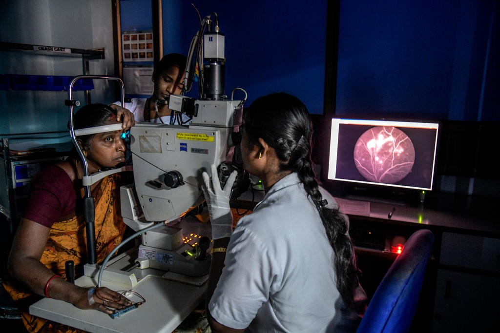
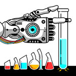
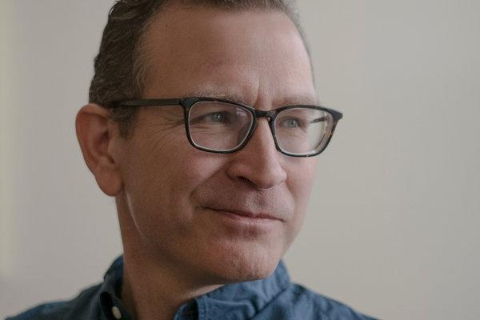
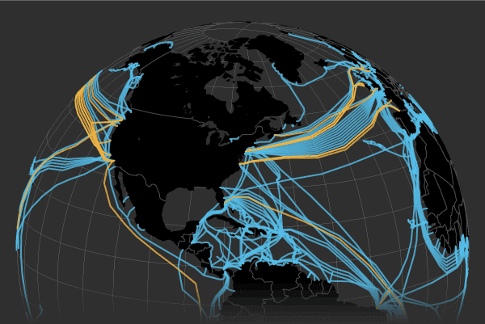
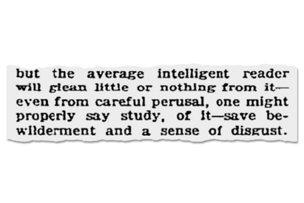

India Fights Diabetic Blindness With Help From A.I.

# India Fights Diabetic Blindness With Help From A.I.India Fights Diabetic Blindness With Help From A.I.

A technician screening a patient at the Aravind Eye Hospital in Madurai, India. The hospital is using a Google system that relies on artificial intelligence to diagnose a retinal problem from such a scan.CreditAtul Loke for The New York Times

Image

A technician screening a patient at the Aravind Eye Hospital in Madurai, India. The hospital is using a Google system that relies on artificial intelligence to diagnose a retinal problem from such a scan.CreditCreditAtul Loke for The New York Times

By [Cade Metz](https://www.nytimes.com/by/cade-metz)

- March 10, 2019

-

    - 
    - 
    - [](https://www.nytimes.com/2019/03/10/technology/artificial-intelligence-eye-hospital-india.html?action=click&module=Discovery&pgtype=Homepagemailto:?subject=NYTimes.com%3A%20India%20Fights%20Diabetic%20Blindness%20With%20Help%20From%20A.I.&body=From%20The%20New%20York%20Times%3A%0A%0AIndia%20Fights%20Diabetic%20Blindness%20With%20Help%20From%20A.I.%0A%0AA%20partnership%20with%20Google%20is%20part%20of%20a%20global%20effort%20to%20build%20and%20deploy%20systems%20that%20can%20detect%20signs%20of%20illness%20and%20disease%20in%20medical%20scans.%0A%0Ahttps%3A%2F%2Fwww.nytimes.com%2F2019%2F03%2F10%2Ftechnology%2Fartificial-intelligence-eye-hospital-india.html)

    -
    -
    -

MADURAI, India — The Aravind Eye Hospital will treat anyone who comes through the door, with or without money.

Each day, more than 2,000 people arrive from across India and sometimes other parts of the world, crowding into the hallways and waiting rooms of this 43-year-old hospital at the southern end of the country. On a recent morning, Vt Muthusamy Ramalingamm, a local resident, walked into a room on the second floor, sat down and rested his chin on a small desktop device that pointed a camera into his eyes.

A technician tapped on a screen at the back of an eye scanner, and within seconds a diagnosis appeared on a computer against the wall. Both eyes showed signs of diabetic retinopathy, a condition that can cause blindness if untreated.

In most hospitals and clinics around the world, trained physicians make this diagnosis, examining a patient’s eyes and identifying the tiny lesions, hemorrhages and discoloration that anticipate diabetic blindness. But Aravind is trying to automate the process. Working with a team of Google artificial intelligence researchers based in California, the hospital is testing a system that can recognize the condition on its own.

Advertisement

Google and its sister company Verily targeted this type of blindness because of its prevalence and because it is the sort of illness that an A.I. system can detect early. Google is not charging the hospital while it tests the technology.

Researchers hope this A.I. system will help doctors screen more patients in a country where diabetic retinopathy is increasingly prevalent. [Nearly 70](https://www.indiatoday.in/education-today/gk-current-affairs/story/98-million-indians-diabetes-2030-prevention-1394158-2018-11-22)[million Indians are diabetic](http://www.searo.who.int/india/mediacentre/events/2016/en/), according to the World Health Organization, and all are at risk of blindness. But the country does not train enough doctors to properly screen them all. For every one million people in India, there are [only 11 eye doctors](http://www.icoph.org/ophthalmologists-worldwide.html), according to the International Council of Ophthalmology.

Doctors at Aravind communicating with one of the small vision centers that the hospital runs in many of the cities and villages surrounding Madurai.CreditAtul Loke for The New York Times

Image

Doctors at Aravind communicating with one of the small vision centers that the hospital runs in many of the cities and villages surrounding Madurai.CreditAtul Loke for The New York Times

The project is part of a widespread effort to build and deploy systems that can automatically detect signs of illness and disease in medical scans. Hospitals in the United States, Britain and Singapore have also run clinical trials with systems that detect signs of diabetic blindness. Researchers across the globe are exploring technologies that detect cancer, stroke, heart disease and other conditions in X-rays and in M.R.I. and CT scans.

Last month, regulators certified the eye system for use in Europe under the Verily name. And the Food and Drug Administration recently approved a similar system in the United States. But hospitals are treading lightly as they consider deploying systems that are vastly different from technology traditionally used for health care.

Advertisement

Aravind’s founder, Govindappa Venkataswamy, an iconic figure in India who was known as “Dr. V” and died in 2006, envisioned a network of hospitals and vision centers that operate like McDonald’s franchises, systematically reproducing inexpensive forms of eye care for people across the country. There are more than 40 of the vision centers around India.

In addition to screening patients in Madurai — one of the largest cities in southern India — the hospital plans to install Google’s technology in surrounding villages where few if any eye doctors are available. The new A.I. system could radically expand the number of people who can be screened.

“Right now, there is a bottleneck when it comes to just screening patients, ” said Dr. R. Kim, a nephew of Dr. V’s who now serves as chief medical officer at Aravind.

Behind the new screening methods are [neural networks](https://www.nytimes.com/2018/03/06/technology/google-artificial-intelligence.html?module=inline), complex mathematical systems that can learn tasks by analyzing vast amounts of data. By analyzing millions of retinal scans showing signs of diabetic blindness, a neural network can learn to identify the condition on its own.

## Editors’ Picks

[  ### A Beef Feast From Vietnam Gets a New York Showcase](https://www.nytimes.com/2019/03/05/dining/madame-vo-bbq-review.html?fallback=0&recId=1IMr9hsvY6zRrg9TRoOpHTqgtTb&locked=0&geoContinent=EU&geoRegion=CHE&recAlloc=story&geoCountry=GB&blockId=home-featured&imp_id=504826140&action=click&module=editorContent&pgtype=Article&region=CompanionColumn&contentCollection=Trending)

[  ### Gwyneth Paltrow Is All Business](https://www.nytimes.com/2019/03/06/business/gwyneth-paltrow-goop-corner-office.html?fallback=0&recId=1IMr9hsvY6zRrg9TRoOpHTqgtTb&locked=0&geoContinent=EU&geoRegion=CHE&recAlloc=story&geoCountry=GB&blockId=home-featured&imp_id=371797930&action=click&module=editorContent&pgtype=Article&region=CompanionColumn&contentCollection=Trending)

[  ### Is This the Greatest Photo in Jazz History?](https://www.nytimes.com/2019/03/08/nyregion/thelonius-monk-charlier-parker.html?fallback=0&recId=1IMr9hsvY6zRrg9TRoOpHTqgtTb&locked=0&geoContinent=EU&geoRegion=CHE&recAlloc=story&geoCountry=GB&blockId=home-featured&imp_id=299977847&action=click&module=editorContent&pgtype=Article&region=CompanionColumn&contentCollection=Trending)

With the Google system, “we’ll be able to reach more people,” Aravind’s chief medical officer said. “Right now, there is a bottleneck when it comes to just screening patients.”CreditAtul Loke for The New York Times

Image

With the Google system, “we’ll be able to reach more people,” Aravind’s chief medical officer said. “Right now, there is a bottleneck when it comes to just screening patients.”CreditAtul Loke for The New York Times

A neural network is the same technology that is rapidly improving [face recognition services](https://www.nytimes.com/2018/06/29/business/newspaper-shooting-facial-recognition.html?module=inline), [talking digital assistants](https://www.nytimes.com/interactive/2018/08/17/technology/alexa-siri-conversation.html?module=inline), [driverless cars](https://www.nytimes.com/2018/01/04/technology/self-driving-cars-aurora.html?module=inline) and [instant translation services like Google Translate](https://www.nytimes.com/2016/12/14/magazine/the-great-ai-awakening.html?module=inline).

Because these systems learn from enormous amounts of information, researchers are still struggling to completely understand how they work — and how they will ultimately behave. But some experts believe that once they are honed, tested and properly deployed, they can fundamentally improve health care.

Advertisement

At Aravind, computer screens mounted on the walls of the waiting rooms translate information into the myriad languages spoken in the hospital.

During his exam, Mr. Ramalingamm, 60, spoke Tamil, the ancient language of southern India and Sri Lanka. He said he was comfortable with a machine diagnosing his eye condition, in part because it happened so quickly. After the initial screening by the A.I. system, doctors could treat the eyes, perhaps with laser surgery, to stave off blindness.

The system performs on a par with trained ophthalmologists, according to a study [published in The Journal of the American Medical Association](https://jamanetwork.com/journals/jama/fullarticle/2588763). But it is far from completely replacing a doctor.

Earlier in the day, Pambaiyan Balusamy, 55, sat in the same room. The Google system diagnosed “proliferative” retinopathy in his left eye — the most serious form of the condition — but it could not read the scan of his right eye, most likely because the eye had developed a cataract.

## Interested in All Things Tech?

The Bits newsletter will keep you updated on the latest from Silicon Valley and the technology industry.

The technology still faces regulatory hurdles in India. Google’s eye system is certified for use in Europe but awaiting approval in the United States.CreditAtul Loke for The New York Times

Image

The technology still faces regulatory hurdles in India. Google’s eye system is certified for use in Europe but awaiting approval in the United States.CreditAtul Loke for The New York Times

Doctors can sometimes make a diagnosis when faced with cataracts and blurry eye scans. The Google system still struggles to do this. It is trained largely on clear, unobstructed images of the retina, though Google is exploring the use of lower-quality images.

Even with this limitation, Dr. Kim said, the system can augment what doctors can do on their own. Aravind already operates small vision centers in many of the cities and villages surrounding Madurai. The hope is that the Google system can make eye screening easier in these facilities and perhaps other locations across southern India.

Advertisement

Today, in these vision centers, technicians take eye scans and send them to doctors in Madurai for review. Automated diagnosis can streamline and expand the process, reaching more people in more places — the kind of “McDonaldization” espoused by Dr. V.

The technology still faces regulatory hurdles in India, in part because of the difficulty of navigating the country’s bureaucracy. And though Google’s eye system is now certified for use in Europe, it is still awaiting approval in the United States.

Luke Oakden-Rayner, the director of medical imaging research at the Royal Adelaide Hospital in Australia, said these systems might even need new regulatory frameworks because existing rules weren’t always sufficient.

“I am not convinced that people care enough about the safety of these systems,” he said.

Though these deep-learning systems are new, they are hardly the first effort to aid diagnosis through computer technology. As Dr. Oakden-Rayner pointed out, software called breast CAD — approved by the Food and Drug Administration in 1998 — has been widely adopted in the United States to help with the detection of breast cancer, in part because Medicaid provides a rebate when the technology is used. But [studies](https://jamanetwork.com/journals/jamainternalmedicine/fullarticle/2443369) have [shown](https://www.nejm.org/doi/full/10.1056/NEJMoa066099) that patient outcomes did not improve and in some cases declined.

“On paper, the Google system performs very well,” Dr. Oakden-Rayner said. “But when you roll it out to a huge population, there can be problems that do not show up for years.”

*Follow Cade Metz on Twitter: [@CadeMetz](https://twitter.com/CadeMetz?lang=en).*

A version of this article appears in print on March 11, 2019, on Page B1 of the New York edition with the headline: A.I. Helps Indian Doctors Save Eyesight. [Order Reprints](http://www.nytreprints.com/) | [Today’s Paper](http://www.nytimes.com/pages/todayspaper/index.html) | [Subscribe](https://www.nytimes.com/subscriptions/Multiproduct/lp8HYKU.html?campaignId=48JQY)

- 
- 
- [](https://www.nytimes.com/2019/03/10/technology/artificial-intelligence-eye-hospital-india.html?action=click&module=Discovery&pgtype=Homepagemailto:?subject=NYTimes.com%3A%20India%20Fights%20Diabetic%20Blindness%20With%20Help%20From%20A.I.&body=From%20The%20New%20York%20Times%3A%0A%0AIndia%20Fights%20Diabetic%20Blindness%20With%20Help%20From%20A.I.%0A%0AA%20partnership%20with%20Google%20is%20part%20of%20a%20global%20effort%20to%20build%20and%20deploy%20systems%20that%20can%20detect%20signs%20of%20illness%20and%20disease%20in%20medical%20scans.%0A%0Ahttps%3A%2F%2Fwww.nytimes.com%2F2019%2F03%2F10%2Ftechnology%2Fartificial-intelligence-eye-hospital-india.html)

-

### Related Coverage

[   ## A.I. Shows Promise Assisting Physicians  Feb. 11, 2019     Image  ](https://www.nytimes.com/2019/02/11/health/artificial-intelligence-medical-diagnosis.html?action=click&module=RelatedCoverage&pgtype=Article&region=Footer)[   ## Making New Drugs With a Dose of Artificial Intelligence  Feb. 5, 2019     Image  ](https://www.nytimes.com/2019/02/05/technology/artificial-intelligence-drug-research-deepmind.html?action=click&module=RelatedCoverage&pgtype=Article&region=Footer)[   ## A New Way for Machines to See, Taking Shape in Toronto  Nov. 28, 2017     Image](https://www.nytimes.com/2017/11/28/technology/artificial-intelligence-research-toronto.html?action=click&module=RelatedCoverage&pgtype=Article&region=Footer)

## [More in Technology](https://www.nytimes.com/section/technology?action=click&module=MoreInSection&pgtype=Article&region=Footer&contentCollection=Technology)

[   Chris Koehler](https://www.nytimes.com/2019/03/12/technology/how-to-disappear-surveillance-state.html?action=click&module=MoreInSection&pgtype=Article&region=Footer&contentCollection=Technology)

[## How a Bitcoin Evangelist Made Himself Vanish, in 15 (Not So Easy) Steps](https://www.nytimes.com/2019/03/12/technology/how-to-disappear-surveillance-state.html?action=click&module=MoreInSection&pgtype=Article&region=Footer&contentCollection=Technology)

10h ago

[   Gabriella Demczuk for The New York Times](https://www.nytimes.com/2019/03/12/technology/bruce-friedrich-animal-activist.html?action=click&module=MoreInSection&pgtype=Article&region=Footer&contentCollection=Technology)

[## This Animal Activist Used to Get in Your Face. Now He’s Going After Your Palate.](https://www.nytimes.com/2019/03/12/technology/bruce-friedrich-animal-activist.html?action=click&module=MoreInSection&pgtype=Article&region=Footer&contentCollection=Technology)

10h ago

 [   PAID POST: HUAWEI](https://adclick.g.doubleclick.net/pcs/click?xai=AKAOjsu4s3pIFTPn-wBTrGIKSXrjCReKk0_jYYHr8Cu7apIeu4mHvLht4dnVx7aa6czEkGT6Niw-3hCCubcMu8e9HQzWj-bizT13mStkh4nDyfXQ86F9a0kcEXbCiKSqylTgT_ROuo_C5gOJhpp8I45Lo3V3sxxO9ekfdhkvFrl2bFPW3UZBbZqgJiG3XhRHn8smDH1L6lLUpdV-6BG6DkWtOovWDRgCbaga1Y4w7lohhNHKgL1v2vYqk1ZhM9C54_sinA&sig=Cg0ArKJSzHvIHx0KiABgEAE&urlfix=1&adurl=https://www.nytimes.com/paidpost/huawei/huawei-redefines-video-experience-with-5g-live-networks.html%3Fcpv_dsm_id%3D191241201%26sr_source%3Dlift_morein%26tbs_nyt%3D2019-March-nytnative_morein)  [2019, a Breakthrough Year for Video and Games via 5G](https://adclick.g.doubleclick.net/pcs/click?xai=AKAOjsu4s3pIFTPn-wBTrGIKSXrjCReKk0_jYYHr8Cu7apIeu4mHvLht4dnVx7aa6czEkGT6Niw-3hCCubcMu8e9HQzWj-bizT13mStkh4nDyfXQ86F9a0kcEXbCiKSqylTgT_ROuo_C5gOJhpp8I45Lo3V3sxxO9ekfdhkvFrl2bFPW3UZBbZqgJiG3XhRHn8smDH1L6lLUpdV-6BG6DkWtOovWDRgCbaga1Y4w7lohhNHKgL1v2vYqk1ZhM9C54_sinA&sig=Cg0ArKJSzHvIHx0KiABgEAE&urlfix=1&adurl=https://www.nytimes.com/paidpost/huawei/huawei-redefines-video-experience-with-5g-live-networks.html%3Fcpv_dsm_id%3D191241201%26sr_source%3Dlift_morein%26tbs_nyt%3D2019-March-nytnative_morein)

[](https://adclick.g.doubleclick.net/pcs/click?xai=AKAOjsu4s3pIFTPn-wBTrGIKSXrjCReKk0_jYYHr8Cu7apIeu4mHvLht4dnVx7aa6czEkGT6Niw-3hCCubcMu8e9HQzWj-bizT13mStkh4nDyfXQ86F9a0kcEXbCiKSqylTgT_ROuo_C5gOJhpp8I45Lo3V3sxxO9ekfdhkvFrl2bFPW3UZBbZqgJiG3XhRHn8smDH1L6lLUpdV-6BG6DkWtOovWDRgCbaga1Y4w7lohhNHKgL1v2vYqk1ZhM9C54_sinA&sig=Cg0ArKJSzHvIHx0KiABgEAE&urlfix=1&adurl=https://www.nytimes.com/paidpost/huawei/huawei-redefines-video-experience-with-5g-live-networks.html%3Fcpv_dsm_id%3D191241201%26sr_source%3Dlift_morein%26tbs_nyt%3D2019-March-nytnative_morein)

[## How the Internet Travels Across Oceans](https://www.nytimes.com/interactive/2019/03/10/technology/internet-cables-oceans.html?&action=click&module=MoreInSection&pgtype=Article&region=Footer&contentCollection=Technology)

March 11

[   Robert Galbraith/Reuters](https://www.nytimes.com/2019/03/12/technology/uber-drivers-lawsuit-settle.html?action=click&module=MoreInSection&pgtype=Article&region=Footer&contentCollection=Technology)

[## Uber Settles Drivers’ Lawsuit for $20 Million](https://www.nytimes.com/2019/03/12/technology/uber-drivers-lawsuit-settle.html?action=click&module=MoreInSection&pgtype=Article&region=Footer&contentCollection=Technology)

1h ago

[   Photo Illustration by The New York Times, Photos by Getty Images; Reuters, The New York Times](https://www.nytimes.com/2019/03/12/style/celebrity-twitter-followers.html?action=click&module=MoreInSection&pgtype=Article&region=Footer&contentCollection=Technology)

[## The Anxiety of Having a Famous Follower on Twitter](https://www.nytimes.com/2019/03/12/style/celebrity-twitter-followers.html?action=click&module=MoreInSection&pgtype=Article&region=Footer&contentCollection=Technology)

3h ago

## Editors’ Picks

[## Oops! Famously Scathing Reviews of Classic Books From The Times’s Archive](https://www.nytimes.com/2019/03/09/books/scathing-reviews-classic-books.html?fallback=0&recId=1IMrC4Hp77BKs4vbBmJTnTYZxza&locked=0&geoContinent=EU&geoRegion=CHE&recAlloc=story&geoCountry=GB&blockId=home-featured&imp_id=79189543&action=click&module=editorsPicks&pgtype=Article&region=Footer)

March 9

[   Brian Rea](https://www.nytimes.com/2019/03/08/style/modern-love-infidelity-husband-leave-me-alone.html?fallback=0&recId=1IMrC4Hp77BKs4vbBmJTnTYZxza&locked=0&geoContinent=EU&geoRegion=CHE&recAlloc=story&geoCountry=GB&blockId=home-featured&imp_id=238189318&action=click&module=editorsPicks&pgtype=Article&region=Footer)

[## ‘Tell Your Husband to Leave Me Alone’](https://www.nytimes.com/2019/03/08/style/modern-love-infidelity-husband-leave-me-alone.html?fallback=0&recId=1IMrC4Hp77BKs4vbBmJTnTYZxza&locked=0&geoContinent=EU&geoRegion=CHE&recAlloc=story&geoCountry=GB&blockId=home-featured&imp_id=238189318&action=click&module=editorsPicks&pgtype=Article&region=Footer)

March 8

[   Pool photo by Thomas Peter](https://www.nytimes.com/2019/03/07/world/asia/china-xi-jinping-gray-hair.html?fallback=0&recId=1IMrC4Hp77BKs4vbBmJTnTYZxza&locked=0&geoContinent=EU&geoRegion=CHE&recAlloc=story&geoCountry=GB&blockId=home-featured&imp_id=27710221&action=click&module=editorsPicks&pgtype=Article&region=Footer)

[## With Streaks of Gray Hair, Xi Jinping of China Breaks With Tradition](https://www.nytimes.com/2019/03/07/world/asia/china-xi-jinping-gray-hair.html?fallback=0&recId=1IMrC4Hp77BKs4vbBmJTnTYZxza&locked=0&geoContinent=EU&geoRegion=CHE&recAlloc=story&geoCountry=GB&blockId=home-featured&imp_id=27710221&action=click&module=editorsPicks&pgtype=Article&region=Footer)

March 7
Most Popular

- [Lori Loughlin’s Daughter Is Caught Up in College Admissions Scandal](https://www.nytimes.com/2019/03/12/style/olivia-jade-giannulli-college-admissions-scandal.html?fallback=0&recId=1IMrC3JoA3uzGS82HkIqBVRp4qh&locked=0&geoContinent=EU&geoRegion=CHE&recAlloc=top_conversion&geoCountry=GB&blockId=most-popular&imp_id=259410566&action=click&module=trending&pgtype=Article&region=Footer)
- [Your Environment Is Cleaner. Your Immune System Has Never Been So Unprepared.](https://www.nytimes.com/2019/03/12/health/immune-system-allergies.html?fallback=0&recId=1IMrC3JoA3uzGS82HkIqBVRp4qh&locked=0&geoContinent=EU&geoRegion=CHE&recAlloc=top_conversion&geoCountry=GB&blockId=most-popular&imp_id=812728009&action=click&module=trending&pgtype=Article&region=Footer)
- [This Animal Activist Used to Get in Your Face. Now He’s Going After Your Palate.](https://www.nytimes.com/2019/03/12/technology/bruce-friedrich-animal-activist.html?fallback=0&recId=1IMrC3JoA3uzGS82HkIqBVRp4qh&locked=0&geoContinent=EU&geoRegion=CHE&recAlloc=top_conversion&geoCountry=GB&blockId=most-popular&imp_id=455213415&action=click&module=trending&pgtype=Article&region=Footer)
- [Opinion: The Massage Parlor Owner and Mar-a-Lago](https://www.nytimes.com/2019/03/11/opinion/cindy-yang-trump-corruption.html?fallback=0&recId=1IMrC3JoA3uzGS82HkIqBVRp4qh&locked=0&geoContinent=EU&geoRegion=CHE&recAlloc=top_conversion&geoCountry=GB&blockId=most-popular&imp_id=815035278&action=click&module=trending&pgtype=Article&region=Footer)
- [Data and Voice Recorders Are Recovered in Ethiopian Airlines Crash](https://www.nytimes.com/2019/03/11/world/boeing-737-max-air-crash-ethiopia.html?fallback=0&recId=1IMrC3JoA3uzGS82HkIqBVRp4qh&locked=0&geoContinent=EU&geoRegion=CHE&recAlloc=top_conversion&geoCountry=GB&blockId=most-popular&imp_id=753470110&action=click&module=trending&pgtype=Article&region=Footer)
- [A Landscape Designer’s Wild Garden](https://www.nytimes.com/2019/03/11/t-magazine/landscape-designer-deborah-nevins-garden.html?fallback=0&recId=1IMrC3JoA3uzGS82HkIqBVRp4qh&locked=0&geoContinent=EU&geoRegion=CHE&recAlloc=top_conversion&geoCountry=GB&blockId=most-popular&imp_id=222888846&action=click&module=trending&pgtype=Article&region=Footer)
- [Lawrence Ferlinghetti’s Enduring San Francisco](https://www.nytimes.com/2019/03/11/travel/lawrence-ferlinghettis-enduring-san-francisco.html?fallback=0&recId=1IMrC3JoA3uzGS82HkIqBVRp4qh&locked=0&geoContinent=EU&geoRegion=CHE&recAlloc=top_conversion&geoCountry=GB&blockId=most-popular&imp_id=567137647&action=click&module=trending&pgtype=Article&region=Footer)
- [She Invented a Board Game With Scientific Integrity. It’s Taking Off.](https://www.nytimes.com/2019/03/11/science/wingspan-board-game-elizabeth-hargrave.html?fallback=0&recId=1IMrC3JoA3uzGS82HkIqBVRp4qh&locked=0&geoContinent=EU&geoRegion=CHE&recAlloc=top_conversion&geoCountry=GB&blockId=most-popular&imp_id=579767732&action=click&module=trending&pgtype=Article&region=Footer)
- [The 50 Best Movies on Netflix Right Now](https://www.nytimes.com/interactive/2019/arts/television/best-movies-on-netflix.html?fallback=0&recId=1IMrC3JoA3uzGS82HkIqBVRp4qh&locked=0&geoContinent=EU&geoRegion=CHE&recAlloc=top_conversion&geoCountry=GB&blockId=most-popular&imp_id=430989315&action=click&module=trending&pgtype=Article&region=Footer)
- [Chills, Thrills and Spills: How Alex Honnold Conquered El Capitan](https://www.nytimes.com/2019/03/07/books/review/mark-synnott-impossible-climb-alex-honnold.html?fallback=0&recId=1IMrC3JoA3uzGS82HkIqBVRp4qh&locked=0&geoContinent=EU&geoRegion=CHE&recAlloc=top_conversion&geoCountry=GB&blockId=most-popular&imp_id=460216350&action=click&module=trending&pgtype=Article&region=Footer)

Advertisement